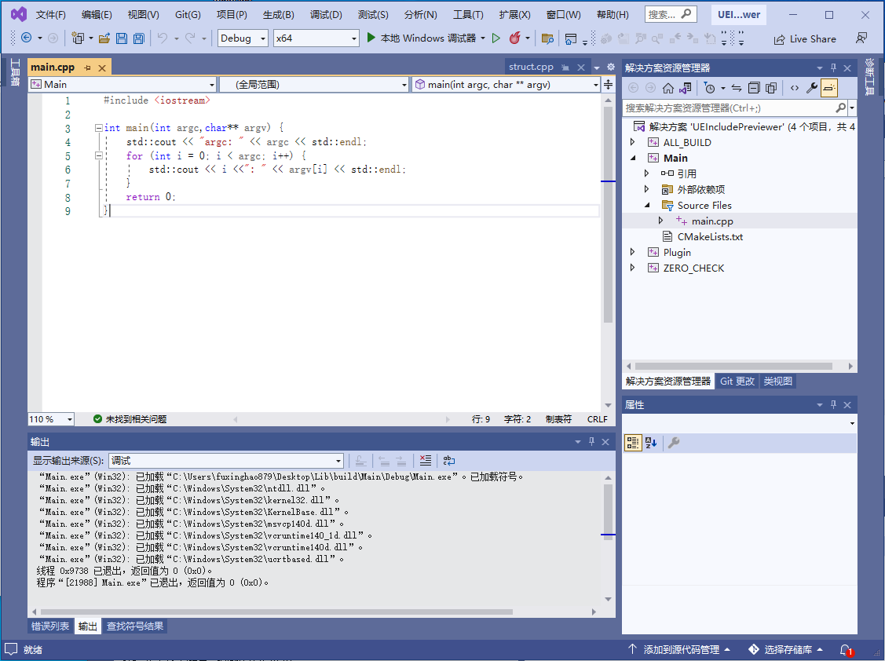
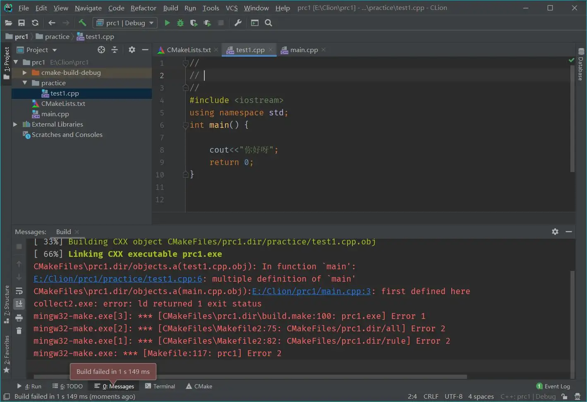
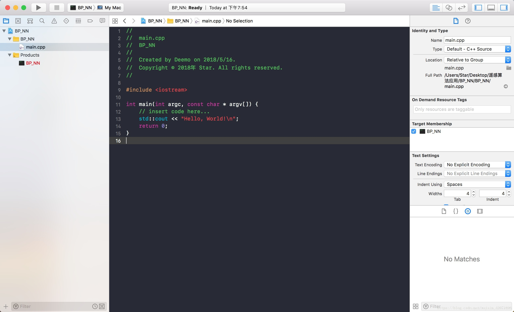
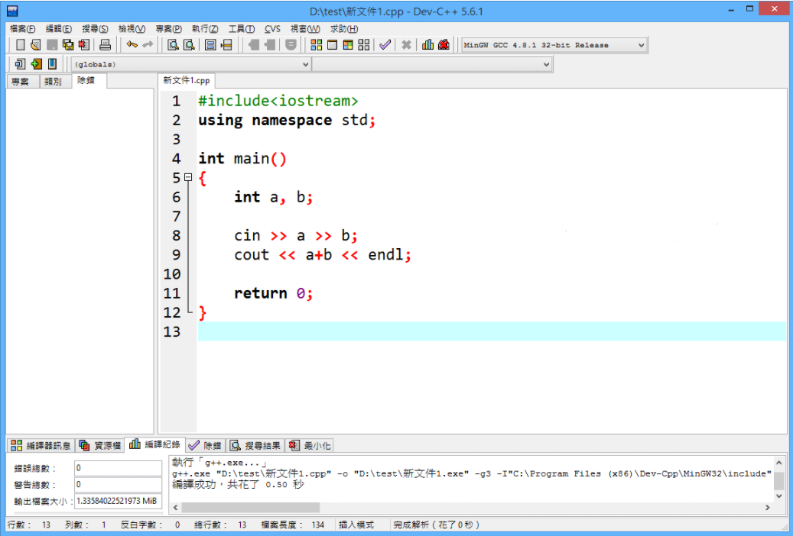
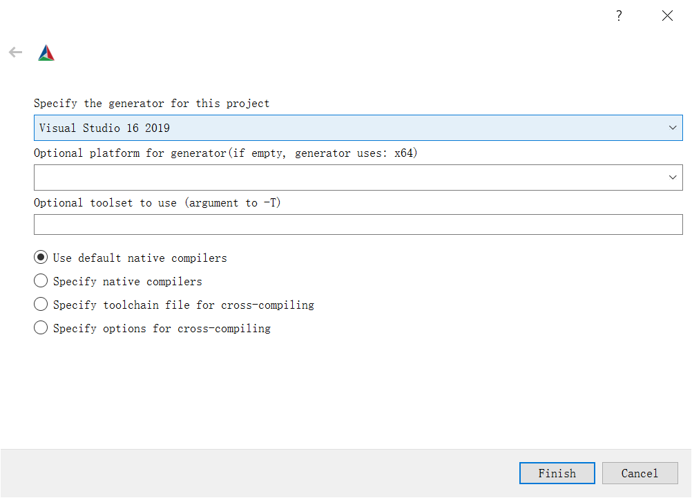

# 工具链

> **我本可以忍受黑暗**
>
> **如果我不曾见过太阳**
>
> 然而阳光已使我的荒凉
>
> 成为更新的荒凉
>
> ​			— Emily Dickinson

人总愿意沉溺在自己的世界中，不求变更

但工欲善其事，必先利其器，变革伴随着风险，但墨守成规终将被淘汰

好的工具链可以大幅提升开发效率，人生苦短，一定得善待自己...

> 如果下述工具不够 **现代** ，请联系博主及时调整，以免误人子弟...

## IDE

**IDE（Integrated Development Environment 集成开发环境）** 是现代程序员接触最频繁的工具，它不仅提供了编译工具，往往还包含：

- 文本编辑器：编写代码，通过对语法着色，以方便阅读
- 智能提示：输入部分代码，即可提示全部代码，提升开发者的代码编写速度
- 调试器：定点执行程序的运行步骤，便于快速发现程序的错误逻辑
- 美观的界面：各种按钮、面板、菜单、窗口等控件整齐排布，操作更方便
- 性能分析：提供工具分析程序的各项性能，如CPU占用、内存消耗
- 项目管理工具：对程序涉及到的所有资源进行管理，包括源文件、图片、视频、第三方库等
- ...

当下主流的C++ IDE有：

- [Visual Studio](https://visualstudio.microsoft.com/zh-hans/)：由微软提供，被很多人尊称为“宇宙第一IDE”，体积庞大，Windows系统下的开发首选。

  

- [Qt Creator](https://www.qt.io/product/development-tools)：由Qt官方提供的IDE，跨平台，功能上中规中矩，对于Qt程序的开发来说比较友好。

  

- [Clion](https://www.jetbrains.com/zh-cn/clion/)： **JET BRAINS** 提供的IDE，代码的辅助功能很巴适，旗下另一IDE — **Rider** ：专门为游戏引擎开发而立。

  

- [XCode](https://developer.apple.com/xcode/)：Mac系统下的IDE

  

- [Visual Studio Code](https://code.visualstudio.com/)：微软提供的跨平台代码编辑器，通过扩展插件可以使得它一样能进行程序编译。

  

对于笔者而言，早期刷题也是被学校强制使用DevC++，VC6.0，当时还用的乐此不疲，现在回头一看确实感觉有些不堪~




笔者的IDE之前经历了以下几个阶段：

VC6.0 > Dev c++ > Visual Studio > IDEA(Java) > Qt Creator

目前，笔者在 Windows 下用 **Visual Studio** 编写 C++代码， **Visual Studio Code** 处理一些常见的文本文件，如Lua，Python、GLSL...

**Visual Studio Code** 毫无疑问的非常优秀的文本编辑器（拥有非常非常多的插件）

而C++的IDE其实都大差不大，该有的功能基本都有，笔者使用 **Visual Studio** 做C++开发，主要是因为UI好看以及汉化完整...

### Visual Studio

请务必查阅官方文档：https://docs.microsoft.com/en-us/visualstudio/windows


#### 常用插件

- [VAssistX](https://www.wholetomato.com/)：提供了大量的辅助功能，提升编码效率，请务必查阅：https://www.wholetomato.com/features

- [CodeMaid](https://www.codemaid.net/)：用于代码的整理与简化，提供一些编辑功能

- [Qt VS Tools](https://doc.qt.io/qtvstools/index.html)：Qt的Vs插件，可在配置中开启按F1打开对应代码的Qt文档

#### 常用快捷键

- 代码编辑

  - 剪切/复制/粘贴：`Ctrl+X` / `Ctrl+C` / `Ctrl+V`
  - 代码注释/取消：`Ctrl+K` + `Ctrl+C`  / `Ctrl+K` + `Ctrl+U`
    - 创建新行
  
      - 下方：`Ctrl+Shift+Enter`
      - 上方：`Ctrl+Enter`
  - 复制本行并粘贴在下方：`Ctrl+D`
  - 撤销/重做：`Ctrl+Z` / `Ctrl +Y`
    - 大小写转换：
      - 转小写：`Ctrl+ U`
      - 转大写：`Ctrl+Shift+U`
  - 触发智能提示：`Ctrl+J` 或 `Alt+ →`
  - 触发自动填充：`Alt+Enter`
- 浏览与检索

  - 头文件和源文件之间跳转：`Alt+O`
  - 当前文件搜索/替换：`Ctrl+F` / `Ctrl+H`
  - 全局文件搜索/替换：`Ctrl+Shift+F` / `Ctrl+Shift+H`
  - 根据文件名搜索并跳转：`Ctrl+1` + `Ctrl+F` （先按Ctrl+数字1，再按Ctrl+F）
  - 根据行数跳转：`Ctrl+G`
  - 浏览位置 回退/前进：`Alt+←` / `Alt+→`
  - 在活动文件中切换：`Ctrl+Tab`
  - 折叠当前代码块/取消：`Ctrl+M` +`Ctrl+M` 
  - 全部代码折叠到定义/取消：`Ctrl+M` + `Ctrl+O` / `Ctrl+M` + `Ctrl+X`

  - 光标跳转
    - 行首/行尾：`Home` / `End`
    - 文件首/文件尾：`Ctrl+Home` / `Ctrl+End`

  - 翻页：`Page Up` / `Page Down` 

#### 达成目标

- 知道如何安装与更新插件及模块
- 熟练使用单步调试，内存及性能探查工具，了解[PDB](https://docs.microsoft.com/en-us/visualstudio/debugger/specify-symbol-dot-pdb-and-source-files-in-the-visual-studio-debugger?view=vs-2022)文件
- 熟练使用各类快捷键
- 了解项目配置中各个参数的意义
- 注意代码文件的编码格式

## 构建工具

上一节中，我们用Visual Studio的CL编译器简单过了一遍C++的编译流程，在实际的工程开发当中，一个工程绝大多数情况下都不会只有一个源文件，这意味着我们要写一大堆编译指令，不过好在我们可以把指令写在 **makefile** 文件里，如何通过 **make** 工具进行构建，但这还有一个非常严重的问题：

> 你一个Windows下的指令，放到 Linux下面，它不认呐~

是的，由于makefile是直接调用操作系统的指令，但各个系统之间的指令却存在差异，这也涌现出了大量的跨平台工程构建工具，比如：

- [cmake](https://link.zhihu.com/?target=https%3A//cmake.org/)：当下主流的跨平台构建工具
- [qmake](https://link.zhihu.com/?target=https%3A//doc.qt.io/qt-6/qmake-manual.html)：由Qt提供的一个构建工具，目前Qt已全面转向Cmake，qmake已不再维护。
- [nmake](https://link.zhihu.com/?target=https%3A//docs.microsoft.com/en-us/cpp/build/reference/nmake-reference)：Visual Studio的内置工具，负责执行Makefile中描述的编译链接步骤
- [xmake](https://link.zhihu.com/?target=https%3A//xmake.io/)：国人编写的基于 Lua 的轻量级跨平台构建工具。
- UBT：Unreal Engine 中基于C#的构建工具

对于大部分C++初学者来说，项目的构建可能大多时候都是直接使用IDE的图形化界面，点击操作按钮来添加源文件，比如Visual Studio：


图形界面在使用起来确实方便，但也存在一些不足：

- 如果连IDE都不支持跨平台，它的工程文件肯定也无法跨平台，这样的话其他平台就编译不了
- 在不同的系统上，会有不同的构建配置，通过图形界面只能进行静态的配置，而不能实现自动化的构建逻辑
- 通过图形界面配置的工程文件，当文件路径或者系统发生变动，可能导致原先的链接丢失
- 库的管理容易混乱，且过于繁琐...

> 话虽如此，笔者在早期没有使用构建，纯图形界面写工程也照样没什么问题（菜是原罪）
>
> 迫使我放弃使用图形界面的主要原因有：
>
> - 需要在程序编译之前，对工程中一些文件做“预处理”再交由C++编译器进行编译（抄袭Qt的Moc：[XObject](https://github.com/Italink/XObject)）
> - 在程序编译之前，执行一些脚本或指令，比如提前将着色器代码编译为二进制文件

那上面 **那么多构建工具该选什么呢？**

### CMake

为什么是CMake呢，它很强大吗？不，这不是主要原因，最根本的原因是： **大部分开源群体都使用CMake作为构建工具** ，使用它你能很方便的引入其他三方库。

很多小伙伴可能会吐槽Cmake难，它的语法像Shit一样，其实难的并不是Cmake，工程的体量上去之后，它的构建逻辑肯定会变复杂，任何构建工具它的主体逻辑都差不多，核心的构建语句就那么几条，多的不过是一些构建选项啊，跨平台配置啊，自动化脚本之类的，搞会一个构建工具，其他简单过一下就懂了。

使用CMake管理工程主要会带来以下几个好处：

- CMake可以生成各个平台IDE的工程文件
- 使用CMake可以编写逻辑代码，完成自动化构建，适配各个平台的构建细节
- 方便管理子工程（库）
- 工程文件具有依赖分析，编译速度极快

对于初学者而言，一般只需要熟悉CMakeGUI的使用和CmakeLists基本语法

#### CMake GUI

CMake GUI是一个 **亲切的** 图形化界面，可以代替命令行操作

大家安装完Cmake 之后，注意创建一下 CMake GUI的桌面快捷方式


想要构建CMake项目的时候直接打开CMake GUI：

- 将CMakeLists.txt拖到窗口里，设置一下`Where to build the Binaries`，构建目录，笔者一般会在源目录后面追加`/build`

- 点击`Configure`会出现一个弹窗，选择想要生成的 IDE 工程文件，以及一些命令行参数

  

- `Finish`之后，这个会出现一些可供调整的配置选项，可根据描述进行调整

- 再点击`Generate`，将会生成对应IDE的工程文件

- 最后点击`Open Project`，就会直接用对应IDE打开工程了

如果后续代码文件结构发生变动，就需要重新在Cmake GUI 中 `Generate` 一下，不过一般IDE在检测到 **CMakeLists内容有变动** 的时候会自动触发 `Generate`

>一些IDE可能支持直接打开CMakeList.txt，比如Qt Creator和Visual Studio，对于Visual Studio，笔者更建议使用CMake GUI 的方式，生成 VS 的工程文件（`*.sln`）


#### CMakeList基本语法

CMake并不难，不过是设置下工程信息：

``` cmake
project(${ProjectName} VERSION 0.1 LANGUAGES CXX)
```

限制一下Cmake的最小版本

``` cmake
cmake_minimum_required(VERSION 3.5)
```

原来 【手动添加点击按钮一个源文件的操作 】换成了：

``` cmake
add_executable(${TargetName} *.h *.cpp ...)				//创建可执行文件
// add_library(${TargetName} STATIC *.h *.cpp ...)		//创建静态库
// add_library(${TargetName} SHARED *.h *.cpp ...)		//创建动态库
```

如果想引入其他库就用：

``` cmake
target_link_libraries(${TargetName} PRIVATE ${LibraryName})  
//PRIVATE代表只有${TargetName}可以访问${LibraryName}中的代码
//PUBLIC代表引入${TargetName}的其他库，也可以访问${LibraryName}中的代码
```

如果想增加Include路径就用：

``` cmake
target_include_directories(QEngineEditor PRIVATE ${IncludeDir}) 
```

如果想操作一个局部变量就直接用：

```cmake
set(VarName "This is String")
messgae(Warning ${VarName})  // 使用${}包裹来读取变量，这里的操作是打印VarName的值
```

想添加子目录就用（子目录指拥有CMakeLists.txt 的路径）

``` cmake
add_subdirectory(${Subdir})
```

基础操作无非就这么一些，只要你觉得某个配置或者功能是合理的，那么它大概率就存在，网上一搜，官网一查，就出来了，构建文件的改动并不频繁，只需要知道主体逻辑即可

构建工具其实都大差不大，用啥都无所谓，它们的使用都不难，关键难的是各种平台和框架的细节配置，这个无可避免。

关于CMake的使用，网上有很多优质的教程，不过笔者更推荐去阅读它的官方文档：https://cmake.org/cmake/help/latest/guide/tutorial/index.html


## 包管理

一些用过python的小伙伴可能都用过包管理工具——`pip`

使用`pip install ...`可以为python快速安装第三方库

而C++的包管理一直都比较混乱，如果你想给自己的工程装载一个三方库（例如 OpenCV，ffmpeg...），你可能得到官方网站上去下载，如果是CMake构建的源码还好，如果是库文件，就需要注意编译类型是Debug还是Release、动态库还是静态库、MD还是MT、32位还是64...

很多小伙伴应该都在安装库的时候被各种配置给折磨过，现在，终于有拯救大家的工具啦 —— [Vcpkg](https://github.com/microsoft/vcpkg)

> Vcpkg 可帮助您在 Windows、 Linux 和 MacOS 上管理 C 和 C++ 库。

关于它的使用，大家可以参阅：

- https://github.com/microsoft/vcpkg/blob/master/README_zh_CN.md

## 版本管理

那一天，笔者回忆起了没有版本管理时的恐惧...

笔者早期学习的时候并不了解什么版本管理工具，因为平时就是刷刷题，代码量撑死也就一两百行，写个小工程也不过千行，直到后面工程的体量上去之后，每次做Feature的代码变动都比较大，所以在动工之前，笔者会把源代码复制一份留做备份，以免新增的代码加入一些 “莫名其妙” 、无法修复的错误.

早期这种做法也没遇到什么大问题，直到笔者在某一次写代码写上头了，没有提前备份，大概一个星期的代码变动，非常多，查了一天没找到原因，头都要炸了，后面没办法，只能用之前的备份重新去写，一点一点的加，一点一点的测试，大概花了三天的时间，才修复问题，恢复进度

那三天的时间里，笔者度日如年，看着一行行熟悉的代码，小心翼翼的再来一遍，一度想要放弃，又不断说服自己耐着性子坚持下去...

可即便如此，笔者也还是不愿意浪费时间去了解新东西，而是把那些时间花在 **堆** 代码上

直到后来，笔者遇到一位老大哥，耐着性子的去点出我工程中的瑕疵，流程中的不规范，苦口婆心的给我介绍 Git ，我也终于是 被 他 打动 了 ，决定去用下，这一用就用到了现在，如果让现在的笔者去评价原来的自己，那只有两个字 — 傻X

### Git

Git是一个开源的分布式版本控制系统，可以有效、高速地处理从很小到非常大的项目版本管理。 

- 官网：https://git-scm.com/

如果你成功安装的话，能在右键菜单中看到：


这里有一个不错的中文Git文档：

-   https://zjdoc-gitguide.readthedocs.io/zh_CN/latest/git/index.html

很多程序员喜欢在 Git Bash 上写命令行代码，但对笔者而言，无疑增加了很多的记忆负担，因此笔者更喜欢使用Git的图形界面：

####  Tortoise Git

- 下载地址：https://tortoisegit.org/download/

> 虽然一些IDE也支持Git，但功能并没有Tortoise Git那么强大
>
> 读者在安装的时候注意安装中文的语言包

使用 **Git & Tortoise Git** 能带来以下好处：

- 可以一点一点的提交代码，在日志上可以直观地对比版本间的修改记录

  

- 可以方便的对比文件变更

  

- 可以还原文件，回退版本来追溯问题

  

- 可以追溯单个文件完整的提交信息

  

- 多人协作的时候可以合并代码
- 可以在分支上进行各种feature的尝试
- ...

> **小贴士**
>
> Tortoise Git根目录下有一个TortoiseGitProc的程序可以用来监控仓库的变更，定时的去检测仓库的变更，如果有人提交代，就会弹出一个系统通知
>
> 


#### Github、Gitlab、Gitee

一个Git仓库中，包含了一个隐藏的.git文件夹，它里面存储了git的各种数据：


这个仓库是位于本地的，很多时候，我们可能希望它能存储到服务器上面，这样才方便于他人共享，目前，几个主流的 **Git代码托管平台** 如下

- Github：https://github.com/
- Gitlab：https://about.gitlab.com/
- Gitee：https://gitee.com/

具体选用什么平台，可以参考：[知乎 爆测一周！22年必看最细致代码托管工具测评](https://zhuanlan.zhihu.com/p/459390312)

版本管理除了Git，还有老牌的SVN，当然一些公司内部也有自己的版本管理工具

### SVN

SVN是subversion的缩写，是一个[开放源代码](https://baike.baidu.com/item/开放源代码/114160?fromModule=lemma_inlink)的版本控制系统，通过采用分支管理系统的高效管理，简而言之就是用于多个人共同开发同一个项目，实现共享资源，实现最终集中式的管理。

相比Git，SVN虽然显得非常古老，但由于其管理方便，很多公司依旧还在使用它

Tortoise也有提供对SVN的支持：

- https://tortoisesvn.net/

### 提交规范

好的提交规范可以让你的日志看上去更直观，比如笔者不同时期的提交记录：


关于提交规范，笔者建议阅读这篇文章：

- https://blog.csdn.net/fd2025/article/details/124543690

> 笔者个人项目中的规范并没有那么严格，只是一个Tag+简短的描述

## 文档笔记

俗话说好记性不如烂笔头，人的大脑就像电脑的CPU，内存的速度很快，但容量有限，聪明的人懂得将大量内容存储到 **"磁盘”（笔记）** 上，而将内容的索引存放到大脑的 **“高速缓存”** 中，记笔记主要能带来几个好处：

- 记的时候加深印象
- 回顾的时候快速联想细节

那怎么记笔记呢？

笔者目前见到过的记笔记的方式主要有：

- 办公软件：Word、Excel
- 博客网站：知乎、博客园、CSDN、掘金、简书、哔哩哔哩、自己搭建的博客网站...
- 笔记类软件：如印象笔记

笔者早期在CSDN上记录一些解题思路的博客，如果没有那个好大哥苦心孤诣地给我介绍Github、Markdown、CMake，可能现在依旧沉溺在自己的世界中继续跟自己斗智斗勇...

### Markdown

> Markdown 是一种[轻量级标记语言](https://baike.baidu.com/item/轻量级标记语言/52671915?fromModule=lemma_inlink)，创始人为约翰·格鲁伯（John Gruber）。 它允许人们使用易读易写的[纯文本格式](https://baike.baidu.com/item/纯文本格式/9862288?fromModule=lemma_inlink)编写文档，然后转换成有效的 [XHTML](https://baike.baidu.com/item/XHTML/316621?fromModule=lemma_inlink)（或者HTML）文档。这种语言吸收了很多在电子邮件中已有的纯文本标记的特性。
>
> ——《百度百科》：https://baike.baidu.com/item/markdown/3245829

为什么要用Markdown呢？

笔者的博客都是使用Markdown编写的，一直使用下来的感受是：

- **编写速度快** ：熟悉Markdown语法之后，文档的编写速度很快
- **操作简单，认知负担小** ：限制了一些"不合理"的功能，保证文档的逻辑是线性的，用它写文档感觉就是一种享受。
- **通用** ：很多网站都提供了Markdown的支持，因为它本质上只是纯文本，其他网站可以解析它的语法，来进行预览，还因为是文本的缘故，使得文档的版本管理也很方便
- **美观** ：markdown只记录了文档的结构，有很多漂亮的第三方皮肤主题

那用什么写Markdown呢？

Markdown编辑器很多，一些博客网站就直接支持，对于本地，笔者见过较多的是使用VS Code，还有就是狂拽酷炫，天下无敌，宇宙第一的Markdown神器：

#### Typora

可惜的是Typora现在开始收费了，不过免费版用户还可以使用单个Typora窗口，够用了


关于Markdown的语法，这里有一个完整的文档：

- https://support.typoraio.cn/zh/Markdown-Reference/

Typora的完整文档目录如下：

- https://support.typoraio.cn/

关于读者可能容易忽略但却很有用的两个功能：

- Typora还支持图表 **mermaid** ：https://support.typora.io/Draw-Diagrams-With-Markdown/

- 为Typora设置好图片处理方式，搭建 **图床** ，可以让你的工作变得非常流程：https://support.typoraio.cn/Images/

Markdown作为开源行业的主要文档形式，很多公司的内部文档，也比较喜欢使用Markdown搭建的Wiki，你用上了你就知道有多香了

虽然Markdown是很强，但它毕竟只是单个文件的文档，如果想更好的组织文档间的关联关系，这个时候就要借助其他工具了：

#### 文档组织工具

对笔者而言，一个Typora已经够用了，网络上推荐比较多的是：

- **Notion**
- **Obsidian**
- **Remnote** 

> 具体的选择，大家可以看下这里知乎上提问：[你在 Notion、Obsidian、Remnote 等之间做出什么选择，为什么这么选？](https://www.zhihu.com/question/407810894/answer/2095659162)

目前笔者的文档流程是：

- 通过Typora编写Markdown文件，通过文件夹分类来组织md文件，并将其托管到 **Github** 上
- 使用Mkdocs（也有小伙伴用Gitbook），将文档生成静态网站，并部署到 **Github Pages** 上

笔者强烈推荐Mkdocs的这个主题：https://squidfunk.github.io/mkdocs-material/getting-started/

Mkdocs可以简单配置一下yml就能将自己的markdown文件组织成一个精美的网站，托管到Github上，现在笔者每次提交文档到Github上，会 **自动** 执行Github Action，将我的文档变更重新部署到 Github Pages上

这是本系列文章的网站：

- https://italink.github.io/ModernGraphicsEngineGuide/


### 思维导图

与Markdown的线性叙事相比， **思维导图（Mind map）** 更符合人类的思考习惯，具有激发思维、暂时记忆、发散思维和集中思维的优点。

它适用于：

- 待办事项
- 准备演讲
- 做笔记
- 解决问题
- 项目计划
- 决策
- 知识管理
- 项目管理
- 个人思考
- 写作
- ...

比如下方Games104呕心沥血整理的知识图谱，虽然看上去有些恐怖，但如果没有这张图，你会觉得更恐怖...


> 原图来自Games104微信公众号

当下制作思维导图的软件主要有：

- [XMind](https://xmind.cn/)：非常强大的思维导图软件
- [Process On](https://www.processon.com/)：在线流程图、思维导图制作网站

上方笔者提到的一些文档组织工具，比如 **Obsidian** ，也有支持思维导图的插件


## 项目管理

各个企业有自己偏好的项目管理工具

一些企业可能使用飞书、钉钉、企业微信的功能就足够了

公司一般会使用一些提单平台，比如Jira、禅道、Redmine、PingCode...

还有一些CI /CD平台，如Jenkins、Github Action、GitLab CI、 CODING CI...

> [知乎 什么是持续集成（CI）/持续部署（CD）？](https://zhuanlan.zhihu.com/p/42286143)

对于个人而言，这里笔者主要是为了推荐大家使用 **Trello**

### Trello

Trello使用简单高效的看板就能完成很多操作，比如 个人To Do，备忘录，团队成员的分工，项目的开发计划等等

[知乎 Trello 等任务管理工具体验如何？](https://www.zhihu.com/question/20339647/answer/139279285)


笔者早期是在[UE4 Roadmap](https://trello.com/b/TTAVI7Ny/ue4-roadmap) 注意到它，单是浏览，就感觉这个界面很舒适，操作很流畅~


> 由于Trello的服务器在国外，国内访问速度可能会比较慢，网上也有许多不错的替代方案，大家跟根据自己的需求进行选择


## 其他

- [Listary](https://www.listary.com/)：可以大幅提供本地搜索、浏览、操作的效率
- [LICEcap](https://www.anopos.com/licecap/)：一个小巧的GIF录制软件，笔者经常用它录制一些动态操作放到文档中
- QQ截屏、录屏：注意设置全局快捷键
- Word、Excel、PPT：基本操作
- Python：脚本始终会比GUI更强大，更何况Python有那么多强大的三方库

> 有其他好用的小工具，大家可以在反馈哦，博主会及时更新0.0


## 结语

自此笔者似乎在触碰到道的轨迹之后，任一阶段，都有一种无所不能的感觉，但回顾前一阶段，才发现只是在自己的舒适圈里自嗨罢了，人生有崖，学海无涯，经过上述工具的洗礼，笔者至今的提升不知凡几，工作流程规范，知识文档齐全，效率恐怖如斯，不止是对自己，试想：随手就能给你丢一篇图文并茂、有声有色的说明文档，这样的队友，难道你不喜欢吗？

此外，文章上述罗列的工具中，不乏一些收费软件，虽然互联网上流传着很多的破解版本，但笔者真诚的恳请大家，如果具备经济能力，请尽量为开发者的知识付费，开发本就不易，坚持下来更难，很多团队，大风大浪都熬过来了，不曾想，一着不慎，满盘皆输，落得是项目解散，各自逃难....，因果循环，最终收益的又会是谁呢？

