# GUI

> 图形用户界面（Graphical User Interface，简称 GUI，又称图形用户接口）是指采用图形方式显示的计算机操作用户界面。
>
> 图形用户界面是一种人与[计算机通信](https://baike.baidu.com/item/计算机通信/8082711?fromModule=lemma_inlink)的界面显示[格式](https://baike.baidu.com/item/格式/2406?fromModule=lemma_inlink)，允许用户使用[鼠标](https://baike.baidu.com/item/鼠标/122323?fromModule=lemma_inlink)等输入设备操纵[屏幕](https://baike.baidu.com/item/屏幕/3750314?fromModule=lemma_inlink)上的[图标](https://baike.baidu.com/item/图标/3823326?fromModule=lemma_inlink)或菜单选项，以选择命令、调用文件、启动程序或执行其它一些[日常任务](https://baike.baidu.com/item/日常任务/10744783?fromModule=lemma_inlink)。与通过键盘输入文本或字符命令来完成例行任务的字符界面相比，图形用户界面有许多优点。图形用户界面由窗口、下拉菜单、对话框及其相应的控制机制构成，在各种新式应用程序中都是标准化的，即相同的操作总是以同样的方式来完成，在图形用户界面，用户看到和操作的都是图形对象，应用的是计算机图形学的技术。
>
> ——《[百度百科](https://baike.baidu.com/item/GUI/479966)》

如果你厌倦了跟控制台斗智斗勇的日子，那么这篇文章或许能帮上忙。

## 概览

GUI的划分主要有两个大类，分别是：

- **Native UI** ：传统的原生App开发模式，使用系统平台上的接口进行开发
- **Web UI** ：特定运行在浏览器上的网站应用

这里有一个更详细的介绍：

- [知乎：什么是 Native、Web App、Hybrid？](https://zhuanlan.zhihu.com/p/40705635)

> Hybrid 指使用 Native UI 和 Web UI 混合开发

关于它们的争论，可以查看：

- [知乎：Web App 和 Native App，哪个是趋势？](https://www.zhihu.com/question/19558750)

Web UI 由于成本低，开发快，在互联网市场上占据主导地位，而使用 Native UI 的原因无外乎：高性能、定制化、硬件交互.

虽然 [Web GPU](https://www.zhihu.com/question/315103318) 现在已经趋于稳定，对于 Web 程序员而言有更大的提升空间，但对于图形、引擎方向的同学，笔者建议最好是走Native 方向，这样有更多的可控空间

而 Native UI方案，根据语言来划分，主要有：

C/C++:	[Qt](https://www.qt.io/product/framework)、    [WxWidget](https://www.wxwidgets.org/)、[GTK](https://www.gtk.org/)、     [FLTK](https://www.fltk.org/)、    [DearImGUI](https://github.com/ocornut/imgui/wiki)、[Nuklear](https://github.com/vurtun/nuklear)、[duilib](https://github.com/duilib/duilib)、[C++ Builder](https://www.embarcadero.com/cn/products)、[MFC](https://learn.microsoft.com/en-us/cpp/mfc/mfc-desktop-applications)、[EasyX](https://easyx.cn/)

Python:  [PyQt](https://riverbankcomputing.com/software/pyqt/)、[WxPython](https://www.wxpython.org/)、[PyGTK](https://www.gtk.org/)、[PyFLTK](https://pyfltk.sourceforge.io/)、[DearPyGUI](https://github.com/hoffstadt/DearPyGui/wiki)、[Tkinter](https://docs.python.org/3/library/tkinter.html)、[PyGame](https://www.pygame.org/news)

C#：	   [WPF](https://learn.microsoft.com/en-us/dotnet/desktop/wpf/overview/)、[WinForm](https://learn.microsoft.com/en-us/dotnet/desktop/winforms/overview)

Java：     Swing、[JavaFx](https://openjfx.io/)

在上面的框架中，使用 C/C++ 具有天然的优势，当然如果你是一个 Python 或者 C# 开发者，没有强制的工作需求，倒也不必大费周章为了GUI 去学 C++

- [知乎：什么语言最适合做 GUI？](https://www.zhihu.com/question/276815517)

在这些C++GUI框架中，又该如何选择呢？

笔者依次学过：EasyX - Tkinter - PyGame - JavaFx - FLTK - Qt - ImGUI - UE Slate

整体用下来发现：GUI无非就是：

- 处理一下系统的（键鼠）交互事件
- 在屏幕上填充像素画几个图形

这是操作系统或者说每个GUI框架都至少提供的功能，试想一下，都有这两个功能了，就是在键鼠操作上绑个回调函数，用循环在屏幕像素上填充RGB，什么狂拽酷炫的图形界面它做不出来？比如说这样的程序

``` c++
#include <conio.h>		//控制台IO
#include <iostream>

int main() {
	char currentChar = '\0';
	const int width = 20;
	const int height = 20;
	while (true) {
		if (kbhit()) {				//kbhit能判断当前是否有按键输入
			currentChar = getch();	//getch为不回显输入函数，于getchar不同的是，输入的按键不会显示在控制台上
		}
		system("cls");				//控制台清屏
		std::cout << "Please enter key:" << std::endl;
		for (int y = 0; y < height; y++) {
			for (int x = 0; x < width; x++) {
				std::cout << currentChar;
			}
			std::cout << std::endl;
		}
	}
    return 0;
}
```


> 控制台程序在运行过程中会疯狂闪烁，这一点会在下文解决

GUI相较于上面的控制台程序，无非就是将键鼠输入封装一层接口，`width`和`height`为窗口尺寸，在对应坐标的像素填充颜色而已

真正决定选什么框架，最关键的还是生态，具体体现在：

- 使用的人多，队友多，更容易招聘
- 框架覆盖面广，工具库多，文档齐全
- 官方长期维护，迭代频率高，坑少

而上述框架中，做的最好的，毫无疑问 — Qt

Qt中的大部分模块遵循 LGPL 协议，这允许我们可以以动态链接的形式使用模块，并发布商业软件，每个模块的开源协议，请查阅：

- https://doc.qt.io/qt-6/licenses-used-in-qt.html

如果想修改Qt源码或使用一些商业模块，你需要购买Qt的商业许可证，具体请查阅：

- https://www.qt.io/licensing/open-source-lgpl-obligations

由于Qt开源协议比较严格，独立于C++标准，且体量庞大，很多团队可能还是会选择WxWidget、C++ Builder、duilib、GTK等框架，而 MFC、FLTK、EasyX 或许是一个不错的GUI框架，但它的开发生态却不容乐观，如果有的选，笔者建议不要去碰

Dear ImGUI 和 Nuklear 是一种轻量、便携且遵循 **Immediate Mode** 的GUI工具包，它本质上是提供一些控件接口给开发者来完成一帧图形的绘制，以ImGUI 为例，使用如下代码：

``` c++
ImGui::Text("Hello Dear ImGUI");
static bool CheckState;
ImGui::Checkbox("CheckBox ", &CheckState);
```

能生成这样的界面：


**Immediate Mode（立即模式）** 主要体现在它将变量 `CheckState` 的指针传递到了 “控件” 之中，而传统的 **Retained Mode（保留模式）** ，比如在Qt中，它的代码可能是这样的：

``` c++
static bool CheckState;
QCheckBox* CheckBox = new QCheckBox;
CheckBox->setCheckState( CheckState? Qt::Checked : Qt::Unchecked);		//初始化
QObject::connect(CheckBox,&QCheckBox::stateChanged,[&](int state){		//绑定signal-slot
    CheckState = state == Qt::Checked;
});
```

可以看到 **QCheckBox** 并没有使用 `CheckState` 的指针，而是通过`CheckState`设置控件的初始状态，当控件`stateChanged`时，再设置 `CheckState` 的值，也就是说控件本身是持有自己的State，而 **Immediate Mode 则强调无状态** ，而是将状态嵌入到了控件之中

在开发过程中，存储过多的局部状态需要编写很多代码保持同步，可能一不小心就弄出了个Bug，比如很容易导致某些事件多次执行 甚至 死循环

打个比方，对一个Color调色：

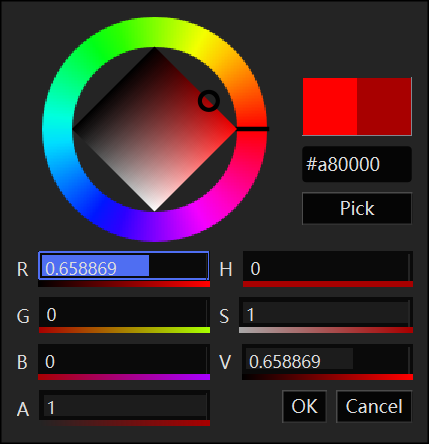

使用调色盘，拖拽或输入通道数值，十六进制输入，屏幕取色等多种方式都可以对同一个颜色值进行调整，如果使用保留模式，在通过某种方式修改了颜色之后，还得手动调整其他控件来保证颜色同步，虽然遵循一些设计模式可以解决这个问题，但立即模式在这种应用场景下具有天然优势，关于它们的差异的争论，请查阅：

- [知乎：Retained 和 IMGUI 有何联系和区别？](https://www.zhihu.com/question/39093254/answer/1351958747)

那么这是否意味着 Dear ImGUI 比 Qt 好? 不尽然，笔者的观点如下：

- **Immediate Mode 更适用于游戏引擎，但  Dear ImGUI  还不够。** 它仅仅只是一个小巧的GUI工具包，虽然它确实很容易上手，也能做出不错的界面效果，但大型软件系统的开发是一门工程艺术，较低的门槛会带来更多的问题，除非有足够的人手和精力去不断迭代，否则使用原生Dear ImGUI 开发简直就是一场灾难...

  > 这里有个回答，虽然不是说 Dear ImGUI，但很好地暴露了这类框架的问题：https://www.zhihu.com/question/66934513/answer/248036488

-  **Retained Mode 只是一种控件架构的方式，Qt != Retained Mode。** 虽然基本上Native UI框架的官方控件都是使用 Retained Mode，但只要你想，你也可以在这些框架上使用 Immediate Mode

  > [Why Qt and not IMGUI?](https://deplinenoise.wordpress.com/2017/03/05/why-qt-and-not-imgui/)

那么是否就意味着Qt更好呢？也不尽然，使用Qt意味着要把它整个Core和Widget模块及moc给引入进来，且由于开源许可导致我们不能去修改它的源代码，所以它在游戏引擎中，大多是做为编辑器存在，例如：

- [O3DE](https://www.o3de.org/)：https://github.com/o3de/o3de

目前它并不适用于游戏内的UI方案：

- 云风的 BLOG — 游戏 UI 模块的选择：https://blog.codingnow.com/2020/07/game_ui.html

UE中的Slate是一个非常优秀的底层UI框架：

-   https://docs.unrealengine.com/5.1/en-US/understanding-the-slate-ui-architecture-in-unreal-engine/

但在本系列文章接下来图形相关的教程，将会使用 Qt 作为主编辑器，内嵌 ImGUI 用于场景编辑，主要原因如下：

- Qt拥有跨平台的Window封装，可以拿到 Handle 使用 Native API 做一些特殊处理
- Qt拥有一套优雅的反射系统，便于搭建编辑器，使用Signal-Slot可以很好的给逻辑解耦，增加可读性
- Qt拥有独立的容器库，使用它可以免受STL的摧残
- Qt拥有很多接口风格统一的扩展库，例如基础数学库，图片编解码库，多媒体库，可以让学习成果更容易变现
- Qt 6.0 以后推出了支持OpenGL、DX11、Vulkan、Metal的RHI（Render Hardware Interface），使用上远比OpenGL容易，架构上使用 Vulkan风格的 glsl 和 现代图形API，没有像bgfx那样进行魔改，最重要的是，使用Qt的RHI可以很好的兼容 Native API，这样以便于使用图形API或者硬件提供的高级特性
- Qt中的很多体系结构可以映射到 Unreal Engine 里面，如果你的目标是它，Qt绝对是最好的跳板，因为Qt的官方代码可读性高，且拥有大量的文档、Demo、教程

## 平台基础

GUI程序将显示在屏幕上，为了能够系统的管理屏幕上的像素，操作系统提供了名为 Window 的结构，在Windows10上，一个标准的Window如下，它带有一个标题栏（图标，标题文本，最小化按钮，最大化按钮，关闭按钮）：


你可以按如下的方式来创建一个Window：

- 新建一个 `CMakeLists.txt` 和 `main.cpp` 文件

- `CMakeLists.txt`中填入：

  ``` cmake
  cmake_minimum_required(VERSION 3.12)
  project(Window)
  add_executable(Window WIN32 main.cpp)
  ```

  > Win32 表明该executable为Win32窗口，具体对应Visual Studio的`项目设置` - `链接器` - `系统` - `子系统` - `窗口`
  >
  > 

- 在`main.cpp` 中填入：

  ``` c++
  #ifndef UNICODE
  #define UNICODE
  #endif 
  
  #include <windows.h>
  
  LRESULT CALLBACK WindowProc(HWND hwnd, UINT uMsg, WPARAM wParam, LPARAM lParam);
  
  int WINAPI wWinMain(HINSTANCE hInstance, HINSTANCE hPrevInstance, PWSTR pCmdLine, int nCmdShow)
  {
      // Register the window class.
      const wchar_t CLASS_NAME[]  = L"Sample Window Class";
      
      WNDCLASS wc = { };
  
      wc.lpfnWndProc   = WindowProc;
      wc.hInstance     = hInstance;
      wc.lpszClassName = CLASS_NAME;
  
      RegisterClass(&wc);
  
      // Create the window.
  
      HWND hwnd = CreateWindowEx(
          0,                              // Optional window styles.
          CLASS_NAME,                     // Window class
          L"Learn to Program Windows",    // Window text
          WS_OVERLAPPEDWINDOW,            // Window style
  
          // Size and position
          CW_USEDEFAULT, CW_USEDEFAULT, CW_USEDEFAULT, CW_USEDEFAULT,
  
          NULL,       // Parent window    
          NULL,       // Menu
          hInstance,  // Instance handle
          NULL        // Additional application data
          );
  
      if (hwnd == NULL)
      {
          return 0;
      }
  
      ShowWindow(hwnd, nCmdShow);
  
      // Run the message loop.
  
      MSG msg = { };
      while (GetMessage(&msg, NULL, 0, 0) > 0)
      {
          TranslateMessage(&msg);
          DispatchMessage(&msg);
      }
  
      return 0;
  }
  
  LRESULT CALLBACK WindowProc(HWND hwnd, UINT uMsg, WPARAM wParam, LPARAM lParam)
  {
      switch (uMsg)
      {
      case WM_DESTROY:
          PostQuitMessage(0);
          return 0;
  
      case WM_PAINT:
          {
              PAINTSTRUCT ps;
              HDC hdc = BeginPaint(hwnd, &ps);
  
              // All painting occurs here, between BeginPaint and EndPaint.
  
              FillRect(hdc, &ps.rcPaint, (HBRUSH) (COLOR_WINDOW+1));
  
              EndPaint(hwnd, &ps);
          }
          return 0;
  
      }
      return DefWindowProc(hwnd, uMsg, wParam, lParam);
  }
  ```

- 使用CMake命令行或CMakeGUI生成VisualStudio工程文件，在`解决方案资源管理器`中，右键 Window项目 - `设为启动项目`，执行就能看到

  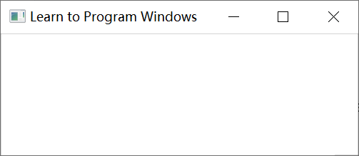

上述代码来自于 微软 的官方教程，有兴趣的读者可以自己过一遍：

- https://learn.microsoft.com/en-us/windows/win32/learnwin32/your-first-windows-program

### Spy++

看到这里，你觉得什么是Window？它是一个带有最大化、最小化、关闭的按钮的框吗？

不尽然，在 Visual Studio 中可以找到 **Spy++** ：`菜单栏`—`工具`—`Spy++`

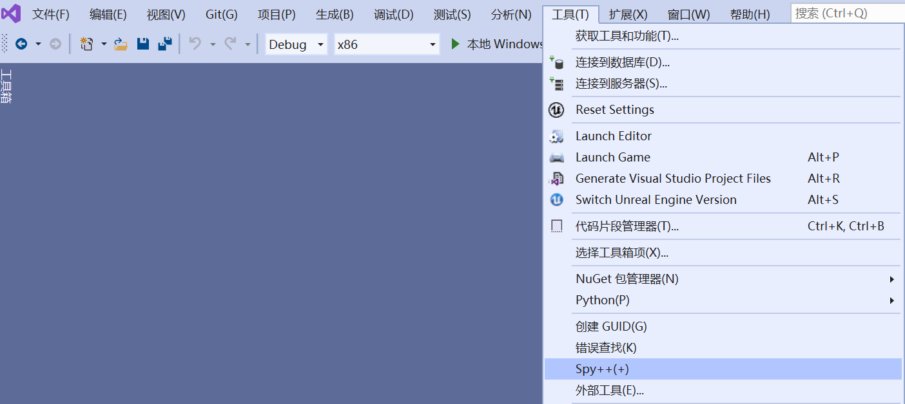

使用它可以查看系统中的所有Window：


> Spy++自底向上按层级显示了所有窗口，即，你在显示器上看到的东西，都有迹可循，比如最底层为桌面（壁纸）

使用它的窗口搜索工具（`菜单栏`—`搜索`—`查找窗口`—`拖拽`下图准心到任意窗口），可以在Spy++中定位到具体的`Item`，这有点类似UE中的控件反射器。

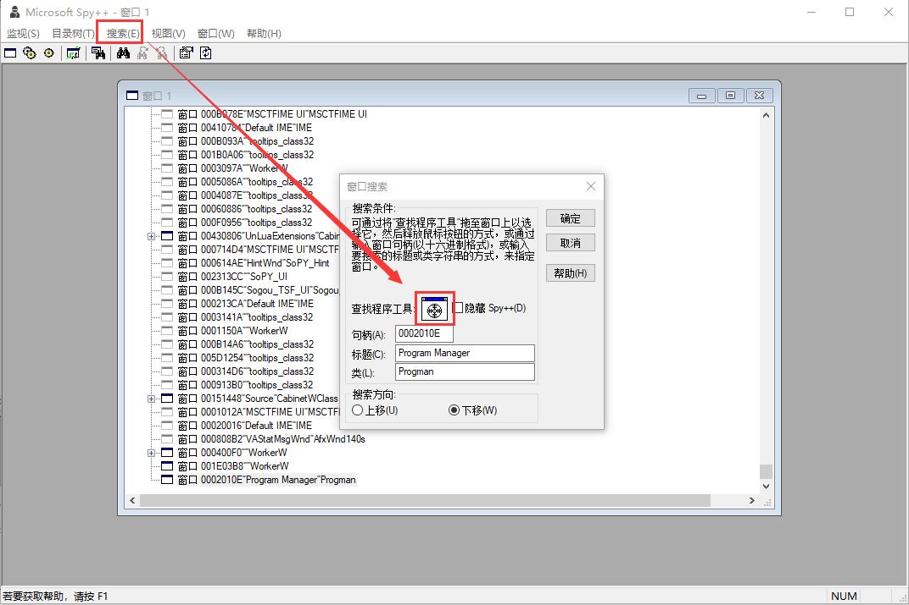

通过上面的工具，可以发现窗口是有层级的，且不一定会有关闭按钮，甚至没有边框。

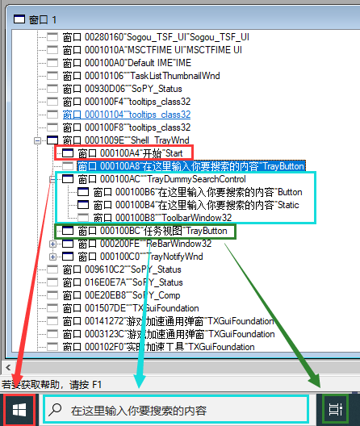

在Windows下，边框和标题栏部分由系统控制，它不属于程序本身，我们称之为 **Non-Client Area（非客户区域）**

边框内部的区域才可以由程序自由绘制，这部分称之为 **Client Area（ 客户区域）**

- [What is windows client and non-client area?](https://www.equestionanswers.com/vcpp/client-non-client-area.php)

微软可能意识到它的标题栏限制了UI的美化，所以窗口还支持设置 **无边框且背景透明** 的属性，而很多软件通过这种方式来绘制 **异形窗口** ，比如QQ音乐的播放器：

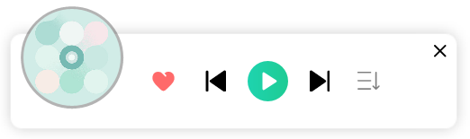

系统交互事件会传递给 当前的Activated（激活的）窗口，而处于Unactivated状态的窗口，系统一般会以灰色的样式来进行显示：


> 一般情况下，只会有一个激活的窗口，这也意味着当前只有一个窗口能接受电脑的输入事件，不过也可以通过一些方法来打破规则，比如 [钩子](https://baike.baidu.com/item/%E9%92%A9%E5%AD%90)

### Multiple buffering

在之前的控制台程序中，页面在疯狂闪烁，这是因为我们对一个缓冲区一点一点的在添加东西，而控制台窗口正在预览这个过程，由于刷新速度很快，就导致了闪烁，为了解决这类问题，在计算机科学中，提出了 **Multiple buffering（多缓冲）** 的概念：

- 用来供给控制台预览的缓冲区称之为 **前台缓冲区** ，多缓冲的核心在于我们并不直接操作前台缓冲区，而是对 **后台缓冲区** 处理完毕后，再 **统一提交** 给 前台缓冲区，这样可以有效避免闪烁和撕裂

> 提到统一提交，是否想到了上一节的 **for copy** 和 **memcpy** ？
>
> 要将筐里的所有橘子放到另一个筐里，一个一个放快呢？还是直接抬起筐倒快呢？显而易见
>
> 硬件和接口的提供者显然也懂得这个道理，绝大多情况下，他们都会都支持 Map，Blit 之类的操作

在控制台中使用双缓冲区的示例如下：

``` c++
#include <conio.h>		//控制台IO
#include <iostream>
#include <Windows.h>

const int width = 20;
const int height = 20;
const int MaxBufferSize = width * height * 10;

void UseSingleBuffer() {
	char currentChar = '*';
	while (true) {
		if (kbhit()) {				//kbhit 能判断当前是否有按键输入
			currentChar = getch();	//getch 为不回显输入函数，与getchar不同的是，输入的按键不会显示在控制台上
		}
		system("cls");				//控制台清屏
		for (int y = 0; y < height; y++) {
			for (int x = 0; x < width; x++) {
				std::cout << currentChar;
			}
			std::cout << std::endl;
		}
	}
}

void UseDoubleBuffer() {
	HANDLE frontendBuffer = GetStdHandle(STD_OUTPUT_HANDLE);		//获取默认的缓冲区

	HANDLE backendBuffer = CreateConsoleScreenBuffer(				//创建一个新的缓冲区作为后台缓冲区
		GENERIC_READ | GENERIC_WRITE,
		FILE_SHARE_READ | FILE_SHARE_WRITE,
		NULL,
		CONSOLE_TEXTMODE_BUFFER,
		NULL
	);

	//隐藏两个缓冲区的光标
	CONSOLE_CURSOR_INFO cci;
	cci.bVisible = 0;
	cci.dwSize = 1;
	SetConsoleCursorInfo(frontendBuffer, &cci);
	SetConsoleCursorInfo(backendBuffer, &cci);


	char bufferData[MaxBufferSize];		//缓存数据暂存区
	DWORD bufferLength = 0;
	COORD zeroCoord = { 0,0 };
	char currentChar = '*';

	while (true) {
		if (kbhit()) {				
			currentChar = getch();	
		}
		bufferLength = 0;

		CONSOLE_SCREEN_BUFFER_INFO backendBufferInfo; 		//获取backendBuffer每行的字符数量
		GetConsoleScreenBufferInfo(backendBuffer, &backendBufferInfo);
		int lineWidth = backendBufferInfo.srWindow.Right - backendBufferInfo.srWindow.Left + 1;		

		for (int y = 0; y < height; y++) {
			for (int x = 0; x < width; x++) {
				bufferData[bufferLength++] = currentChar;
			}
			while (bufferLength % lineWidth != 0) {				//填充字符以到达换行的效果
				bufferData[bufferLength++] = ' ';
			}
		}
        
        //从backendBuffer的zeroCoord开始写入bufferLength长度的bufferData
		WriteConsoleOutputCharacterA(backendBuffer, bufferData, bufferLength, zeroCoord, &bufferLength);	
		SetConsoleActiveScreenBuffer(backendBuffer);			//将backendBuffer显示出来
		std::swap(backendBuffer, frontendBuffer);				//交换前后缓冲操作句柄,frontendBuffer将作为下一次循环的backendBuffer
	}
}

int main() {
	//UseSingleBuffer();
    UseDoubleBuffer();
	return 0;
}
```

大多数GUI框架都使用了双缓冲的方式，而游戏中甚至使用了三缓冲，一般我们会称这个结构为 [交换链](https://en.wikipedia.org/wiki/Swap_chain)

关于多缓冲的细节，可以查阅：

- https://en.wikipedia.org/wiki/Multiple_buffering

### DPI

> 图像每英寸长度内的像素点数。
>
> DPI（Dots Per Inch，每英寸点数）是一个量度单位，用于点阵[数码影像](https://baike.baidu.com/item/数码影像/6208065?fromModule=lemma_inlink)，指每一[英寸](https://baike.baidu.com/item/英寸?fromModule=lemma_inlink)长度中，取样、可显示或输出点的数目。

在Windows上，通过设置 **缩放与布局** 来调整系统的DPI


操作系统将根据DPI的变动按一定可配置的机制去调整窗口的尺寸和内容，关于DPI感知的细节，请查阅：

- https://learn.microsoft.com/zh-cn/windows/win32/hidpi/high-dpi-desktop-application-development-on-windows
- https://doc.qt.io/qt-6/highdpi.html
- https://en.wikipedia.org/wiki/Dots_per_inch

在GUI开发过程中，支持多 DPI 的预览一直是一个比较头疼的问题，因为很难通过 几个参数 去调整 整个界面 的 效果与布局

而在图形开发过程中，一个比较大的坑就是：

- Window Size != Buffer Size，很多小伙伴通过Window Size去创建 Frame Buffer，这在100%缩放的电脑上表现是正常的，但在其他情况下，就有问题了

## Qt基础

### 安装

https://courses.qt.io/how-to-install-qt/index.html#/lessons/WDj_gIccDJa6gmhH_-3P7uC2QDaZHbYA


如果你想继续学习之后的图形章节，那么你在安装的时候请选择 `Custom installation`，确保安装以下模块：

- Qt6以上的任意版本，建议是最新的（比如6.5.2 beta），包含
  - **MSVC 2019 64-bit** ：支持使用Visual Studio进行Qt开发
  - **Sources** ：Qt源码
  - **Qt 5 Compatibility Module** ：Qt5的共存模块
  - **Qt Shader Tools** ：Qt的着色器工具，用于将glsl转换hlsl、msl
  - Qt Debug Infomation Files：可选，体积较大，用于调试Qt源码
- Developers and Designer Tools
  - **Debugging Tools  For Windows** ：Windows调试工具
  - **CMake** ：构建工具，如果已有，则无需安装
  - Qt Installer Framework ：可选，用于将Qt程序打包为安装包

此外，笔者还建议在学习的初期，不要使用 **Designer（*.ui）** 及 **Design Studio** ，它们会是你早期提升最大的阻力

### 开始

- 新建一个`CMakeLists.txt` 及 `main.cpp` 文件

- `CMakeLists.txt` 中填入：

  ``` cmake
  cmake_minimum_required(VERSION 3.12)
  project(QtExample)
  
  add_executable(QtExample main.cpp)
  
  find_package(Qt6 COMPONENTS Core Widgets REQUIRED)      #查找Qt6的模块
  
  target_link_libraries(QtExample                         #将Core和Widget链接到QtExample中
      PRIVATE 
          Qt6::Core                     
          Qt6::Widgets
  )
  ```

- `main.cpp`中填入：

  ``` c++
  #include <QApplication>
  #include <QWindow>
  
  int main(int argc, char* argv[]) {
  	QApplication a(argc, argv);
  	QWindow window;
  	window.setTitle("Hello Qt!");
  	window.show();
  	return a.exec();
  }
  ```

- 使用`Cmake命令行`或者 `CMake GUI` 生成 Visual Studio工程

- 选择  **QtExample** 为启动项目，编译运行，就能看到：

  

[ **QApplication** ](https://doc.qt.io/qt-6/qapplication.html) 是Qt对整个程序的调度管控中心，通过它可以：

- 解析程序的输入参数（即上方的`argument count`，`argument value`）
- 管理对象之间的事件通信
- 处理程序的事件循环
- 能获取到所有的Window、Widget
- 提供程序进程相关的各类操作
- ...

> 对应 UE 中的 **GenericApplication** 、 **SlateApplication**

通过`QApplication::instance()`或宏 `qApp` ，能在程序中的任何地方对其进行操作，查看官方文档，你能知道它可以做什么：

- https://doc.qt.io/qt-6/qapplication.html

QApplication 继承自 QGuiApplication，它来自于 **Widgets模块** ，如果需要的是控制台程序，而非窗口，那么使用 **Core模块** 中的 **[QCoreApplication](https://doc.qt.io/qt-6/qcoreapplication.html)** 就够了

> 在实际开发应用时，可以派生QApplication，在其中添加一些全局的管理操作。

`QApplication::exec()`将启动Qt的事件循环，它等价于：

``` c++
#include <QApplication>
#include <QWindow>

int main(int argc, char* argv[]) {
	QApplication a(argc, argv);	
	Q_ASSERT(QApplication::instance() == &a);

	QWindow window;
	window.setTitle("Hello Qt!");
	window.show();
	while (true) {						//QApplication内部有一个退出信号，可惜它是私有的，这里就只能作为死循环了
		QApplication::processEvents();	//注释它,你会发现窗口无法再响应交互事件
	}
}
```

> 在开发过程中，可能经常会执行一些比较慢的操作，导致界面卡顿，这个时候就可以在这些操作中间手动调用一下`QApplication::processEvents()`让界面能够刷新

### Object

Qt中的绝大多数类都派生自 [QObject](https://doc.qt.io/qt-6/qobject.html) ，这样便于管理其所有子对象，并提供了反射、Signal-Slot、垃圾回收、事件等机制，一个QObject子类定义的示例如下：

``` c++
class QExmapleClass : public QObject {
	Q_OBJECT			//Q_OBJECT是Qt反射数据的入口，如果无需反射功能，可以不写
};
```

#### Meta Object System

Qt 的元对象系统提供了Signal-Slot、运行时类型信息和动态属性系统等机制

如果想在 CMake作为构建系统的工程 中启用QObject的反射功能，需要在`CMakeLists.txt`的`add_executable`之前中开启 [AUTOMOC](https://cmake.org/cmake/help/latest/prop_tgt/AUTOMOC.html)：

``` cmake 
set(CMAKE_AUTOMOC ON)
```

`AUTOMOC`会自动检测头文件中是否存在 `Q_OBJECT` 之类的宏，如果存在，则会使用Qt的反射编译器 **moc**  扫描该文件，扫描结束将生成一个 `*.moc` 文件，这里面包含了Qt反射数据的定义

你能在类似如下的路径中，找到Qt的moc，在当前目录打开cmd，执行 `moc -h`，就能看到它的帮助文档

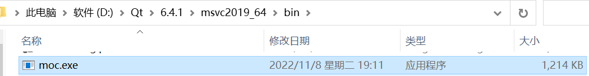

moc的源码位于如下路径：

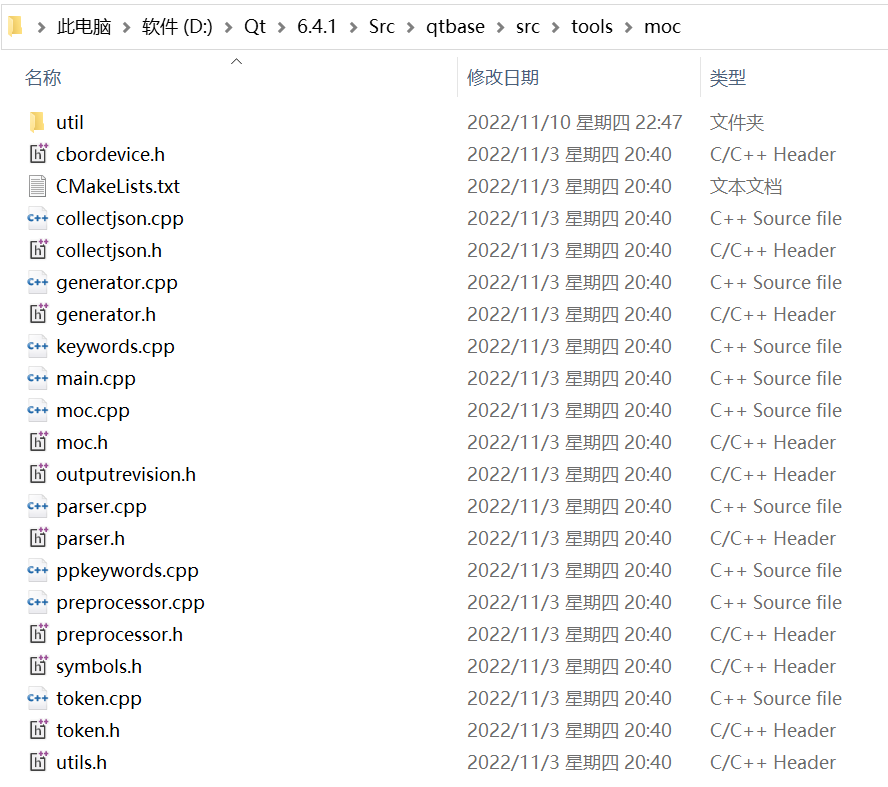

> UE 的反射编译器为 UHT（Unreal Header Tool）

对于那些写在`*.cpp`中的`Q_OBJECT`，需要在末尾手动`include` `*.moc`，才能触发 moc 的执行，例如：

```c++
/* main.cpp
*/

#include <QApplication>
#include <QMetaType>
#include <QMetaProperty>

class QExmapleClass : public QObject {
	Q_OBJECT
	Q_PROPERTY(int Var READ getVar WRITE setVar)				//通过Getter、Setter生命MetaProperty
public:
	int getVar() {
		return mVar;
	}
	void setVar(int inVar) {
		mVar = inVar;
	}

	Q_INVOKABLE void sayHello(const QString& inName) {			//声明MetaMethod
		qDebug() << "Hello " << inName.toLatin1().data();
	}

	enum Number {
		Zero, One, Two, Three
	};
	Q_ENUM(Number)												//声明MetaEnum
protected:
	int mVar= 5;
};

int main(int argc, char* argv[]) {
	QApplication a(argc, argv);

	QExmapleClass obj;		

	//获取MetaObject
	const QMetaObject* metaObjectFromStatic = &QExmapleClass::staticMetaObject;	
	const QMetaObject* metaObjectFromVirtual = obj.metaObject();

	//读写属性
	obj.setProperty("Var", QVariant::fromValue<int>(10));						
	QVariant var = obj.property("Var");
	qDebug() << "Property : " << var.value<int>();

	//调用函数
	qDebug() << "Invoke Method Begin:";
	metaObjectFromStatic->invokeMethod(&obj, "sayHello",Q_ARG(QString,"Boy"));
	qDebug() << "Invoke Method End";

	//MetaType操作
	QMetaType metaType = var.metaType();
	qDebug() << "Meta Type : " << metaType.name() <<" ID: " << metaType.id();

	//在MetaObject中遍历及读写属性，并打印属性类型
	for (int i = metaObjectFromStatic->propertyOffset() ; i < metaObjectFromStatic->propertyCount(); i++) {
		const QMetaProperty& metaProperty = metaObjectFromStatic->property(i);
		metaProperty.write(&obj, QVariant::fromValue<int>(15));
		QVariant varFromMetaObject = metaProperty.read(&obj);
		qDebug() << "Meta Property : " << metaProperty.name() << varFromMetaObject;
	}

	//在MetaObject中遍历函数，并打印参数信息
	for (int i = metaObjectFromStatic->methodOffset(); i < metaObjectFromStatic->methodCount(); i++) {
		const QMetaMethod& metaMethod = metaObjectFromStatic->method(i);
		QByteArrayList paramNames = metaMethod.parameterNames();
		QStringList paramsDefineList;
		for (int j = 0; j < metaMethod.parameterCount(); j++) {
			paramsDefineList << metaMethod.parameterTypeName(j) +" " + paramNames[j];
		}
		qDebug() << QString("Meta Method : %1 %2(%3)")
			.arg(metaMethod.typeName())
			.arg(metaMethod.name())
			.arg(paramsDefineList.join(',')).toLatin1().data();
	}

	//在MetaObject中遍历枚举，并打印枚举信息
	for (int i = metaObjectFromStatic->enumeratorOffset(); i < metaObjectFromStatic->enumeratorCount(); i++) {
		const QMetaEnum& metaEnum = metaObjectFromStatic->enumerator(i);
		qDebug()<< "Meta Enum : " << metaEnum.name();
		for (int j = 0; j < metaEnum.keyCount(); j++) {
			qDebug() << "-- " << metaEnum.key(j) << " : " << metaEnum.value(j);
		}
	}
	return a.exec();
}

#include "main.moc"		//必须包含main.moc才能触发moc编译
```

上述代码是一个很好的Qt反射示例，更详细的内容，请参阅：

- Qt Meta Object System：https://doc.qt.io/qt-6/metaobjects.html
- QMetaObject ：https://doc.qt.io/qt-6/qmetaobject.html
- Qt Property System：https://doc.qt.io/qt-6/properties.html

#### Signal-Slot

信号槽机制用于对象之间的通信，它是 Qt 的核心特性，关于它的作用，一个伪代码示例如下：

``` c++
class Student{
    Signal nameChanged(string OldName, string NewName);
public:
    void setName(string inName){
        nameChanged.Emit(mName，inName);
        mName = inName;
    }
private:
    string mName;
};

class Tearcher{
public:
    void OnStudentNameChanged(string OldName, string NewName){
        //do something
    }
};

class Class{
protected:    
    void connectEveryone(){
         for(auto Student:mStudents){       
             Student.nameChanged.Connect(mTeacher,&Tearcher::OnStudentNameChanged);
         }
    }
private:
    Teacher mTeacher;
    TArray<Student> mStudents;
};
```

通过connectEveryone函数，可以看做是："老师"在班级里面告诉学生，如果你们改名字了，请通知我。

这里没有直接修改Teacher和Student的结构，而是在第三方集合（班级）中进行二者关系的绑定，从而实现很好的解耦，

> 这一机制对应UE中的委托（Delegate），它相较于Qt的信号槽更细致一些，但译文有些槽点，如果也叫Signal的话，相信可以更容易勾起开发者的联想而采用正确的使用方式

对于更细节的说明，请查阅：

- https://doc.qt.io/qt-6/signalsandslots.html

#### Event System

在Qt中，事件是指抽象类[QEvent](https://doc.qt.io/qt-6/qevent.html)子类的实例对象，它用于描述应用程序内部或外部活动的结果。在作用上它可以看做是重量级的Single-Slot，QWigdet中的交互机制都是通过事件实现的。

当一个事件发生时，Qt通过构造适当的QEvent子类实例来表示它，并调用：

- [static bool QCoreApplication::sendEvent(QObject* *receiver*, QEvent event)](https://doc.qt.io/qt-6/qcoreapplication.html#sendEvent)

来向对应的`QObject`发送事件，而QObject拥有一个虚函数：

- [virtual bool QObject::event( QEvent* *e* )](https://doc.qt.io/qt-6/qobject.html#event)

通过覆写`event`可以在其中处理事件或者进一步分发到其他函数

此外，Qt还支持事件监听器机制，可以覆写QObject的虚函数：

- [bool QObject:: eventFilter ( QObject * *watched* , QEvent* *event* )](https://doc.qt.io/qt-6/qobject.html#eventFilter)

使之可以作为`filterObj`，再调用：

- [void QObject:: installEventFilter ( QObject* *filterObj* )](https://doc.qt.io/qt-6/qobject.html#installEventFilter)

从而让该对象能作为其他的对象的事件监听者

关于事件系统，详见：

- https://doc.qt.io/qt-6/eventsandfilters.html

#### Garbage Collection

在上一节内存管理中，已经提过Qt的GC，它的GC方式很简单，就是QObject可以指定唯一的parent，当parent释放时，还会释放children，此外，可以还可以使用 [QObject::deleteLater](https://doc.qt.io/qt-6/qobject.html#deleteLater) 来延迟QObject的释放

在QWidget中，加入子控件会隐式设置parent，绝大多数情况下都不需要手动去delete，但需要注意控制parent的生命周期，对象树中的某个节点如果出现纰漏，那么整个子树的对象都无法被释放

### Window

在前面，我们使用了Win API简单创建了一个窗口，那些代码一点也不 **"现代"** ，大量的宏，奇怪的命名规范

**QPlatformWindow** 是 Qt 的跨平台Window底层封装的细节，Qt将其包裹一层用来提供接口，也就是 [ **QWindow** ](https://doc.qt.io/qt-6/qwindow.html)

> 这里对应UE的 **GenericWindow** 和 **SWindow**
>
> 你要说它两之间没 “奸情” 我肯定是不信的0.0

在Window的客户区域中，经常会有很多的小部件，比如下面的窗口：


它拥有很多的按钮和控件，如果我们单纯使用一个窗口的点击事件（可获取到鼠标坐标）去判断点了窗口的哪个部分，再一点点处理绘制，当窗口的复杂度一上来，整个代码会显得异常混乱，管理困难，虽然Windows提供了SubWindow的机制，但由于维护一个Window的开销过大，所以，很多框架都提出了 **Widget** 的概念

> 对应Qt中的QWidget，UE中的 SWidget

Widget 可以看做是一个轻量级的Window，它具有以下特性：

- 在显示上，Widget可以看做是一个块，它本质上是分割Window的客户区域，该区域由Widget自行绘制。
- 在逻辑上，Widget具有树状层级，事件往往会自顶向下传递。

### Widget

[ **QWidget** ](https://doc.qt.io/qt-6/qwidget.html) 是Qt GUI的核心， Qt中的绝大多数的 可视部件 都派生于它

它的创建也很简单：

``` c++
#include <QApplication>
#include <QWidget>

int main(int argc, char* argv[]) {
	QApplication a(argc, argv);
	QWidget widget;
	widget.setWindowTitle("Hello QWigdet!");
	widget.show();
	return a.exec();
}
```

在单个部件的开发中，主要是设置 QWidget 的 [Properties](https://doc.qt.io/qt-6/qwidget.html#protected-functions)：


和覆写[Event](https://doc.qt.io/qt-6/qwidget.html#protected-functions)：

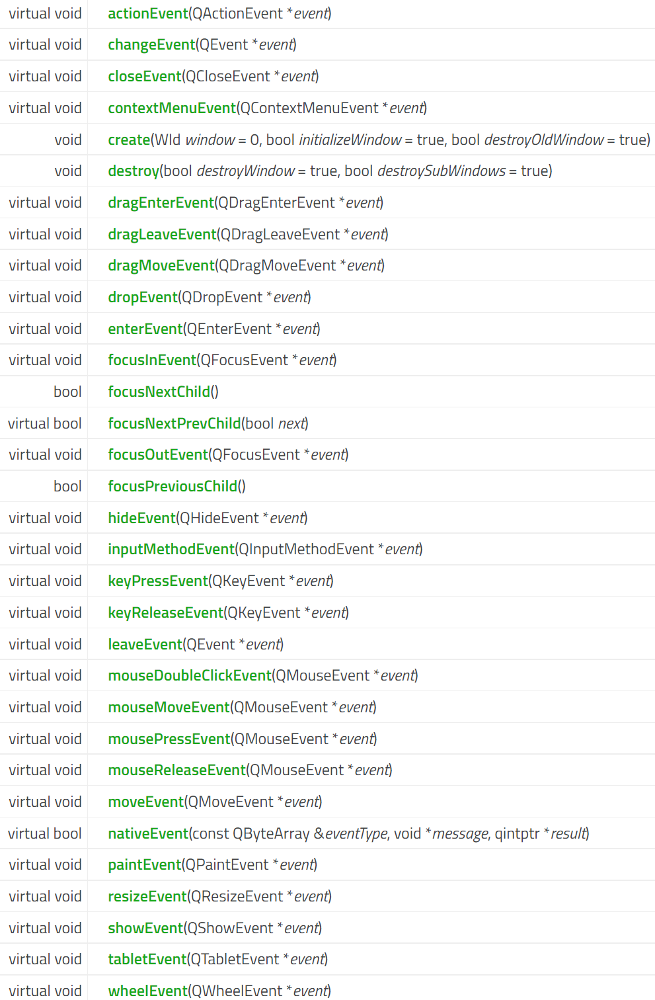

来实现各种复杂的界面效果和交互逻辑

#### WindowOption

在一般情况下，开发者甚至都不会接触到 `QWindow`，因为最外层 （or 最顶级）的 `QWidget` 会自动生成 `QWindow`，我们可以通过对这个QWidget做一些设置，来影响Window的生成：

- [WindowFlag](https://doc.qt.io/qt-6/qt.html#WindowType-enum)：调整Window的标识，比如弹窗，对话框，提示框，无边框...

- [WindowModality](https://doc.qt.io/qt-6/qt.html#WindowModality-enum)：设置模态窗口，模特窗口会阻塞其他窗口的输入，一般用于让用户在当前强制选择某些选项，才能继续执行

- [WindowState](https://doc.qt.io/qt-6/qt.html#WindowState-enum)：Window的状态有：`默认`，`最小化`，`最大化`，`全屏（无边框）`，`激活`，可以调用`setWindowState`，Qt也提供了一些便捷API，例如 [activateWindow()](https://doc.qt.io/qt-6/qwidget.html#activateWindow)

比如这样的代码：

```c++
QWidget widget;
widget.setWindowFlags(Qt::FramelessWindowHint|Qt::Tool);
widget.resize(200,200);
widget.show();
```

你能在屏幕上看到一个200*200的灰色方块，并且你在下方的任务栏中，它的图标也被隐藏了

需要注意的是，在创建Widget的时候并没有创建Window，我们对Widget的设置绝大多数时候只是在调整它的参数状态机，只有在事件执行时，才会根据这些状态来进行实际的操作，就比如说，你得在show之后才能拿到Window的句柄

#### **[Attribute](https://doc.qt.io/qt-6/qt.html#WidgetAttribute-enum)** 

在Qt命名空间下，有一组以`WA_`开头的枚举值可以用来设置[WidgetAttribute](https://doc.qt.io/qt-6/qt.html#WidgetAttribute-enum)，你可以给QWidget设置很多有用的属性，其中常用的：

- Qt::WA_DeleteOnClose：关闭窗口时，销毁该对象
- Qt::WA_TranslucentBackground：使窗口的背景变透明

#### Event

GUI的显示在于 QWidget 的 [paintEvent](https://doc.qt.io/qt-6/qwidget.html#paintEvent) ，我们可以通过覆写它，在里面使用通过 [QPainter](https://doc.qt.io/qt-6/qpainter.html) 绘制我们想要的任何图形

而GUI的本质无非就是借助于各类交互事件，调整属性状态机，切换 paintEvent 的绘制结果

这是一个很好的例子：

```c++
#include <QApplication>
#include <QWidget>
#include <QMouseEvent>
#include <QPainter>

class QExmapleWidget:public QWidget {
	Q_OBJECT
private:
	QPoint mMousePressPos;
	bool bIsHovered = false;
protected:
	void mousePressEvent(QMouseEvent* event) override {
		if (event->button() == Qt::LeftButton)		//记录鼠标左键按下时的位置
			mMousePressPos = event->pos();			
	}
	void mouseMoveEvent(QMouseEvent* event) override {
		if (event->buttons() & Qt::LeftButton)		//鼠标左键按下拖拽时，调整Widget的位置
			move(event->pos() + this->pos() - mMousePressPos);
	}

	void enterEvent(QEnterEvent* event) override {
		bIsHovered = true;							//鼠标进入Widget中
		setCursor(Qt::ClosedHandCursor);			//设置鼠标光标的形状
		update();									//请求刷新界面
	}

	void leaveEvent(QEvent* event) override {
		bIsHovered = false;							//鼠标离开Widget
		setCursor(Qt::ArrowCursor);					//设置鼠标光标的形状
		update();									//请求刷新界面
	}

	void paintEvent(QPaintEvent* event) override {
		QPainter painter(this);

		painter.fillRect(this->rect(),bIsHovered ? Qt::green : QColor(0,100,200));	//在区域内填充颜色

		painter.setPen(QPen(Qt::white));
		painter.setFont(QFont("",20,90));											//使用缺省字体并设置字号和权重
		painter.drawText(this->rect(), Qt::AlignCenter, "Hello Qt");				//绘制文字
	}
};

int main(int argc, char* argv[]) {
	QApplication a(argc, argv);
	QExmapleWidget widget;
	widget.setWindowFlags(Qt::FramelessWindowHint);			//无边框
	widget.setAttribute(Qt::WA_TranslucentBackground);		//背景透明		
	widget.setAttribute(Qt::WA_AlwaysStackOnTop);			//置顶
	widget.resize(200,200);
	widget.show();
	return a.exec();
}

#include "main.moc"
```

运行它你能看到如下效果：


使用QWidget，可以实现我们想要的任何效果。

Qt官方的提供了很多基础控件供开发者使用：

- https://doc.qt.io/qt-6/widget-classes.html

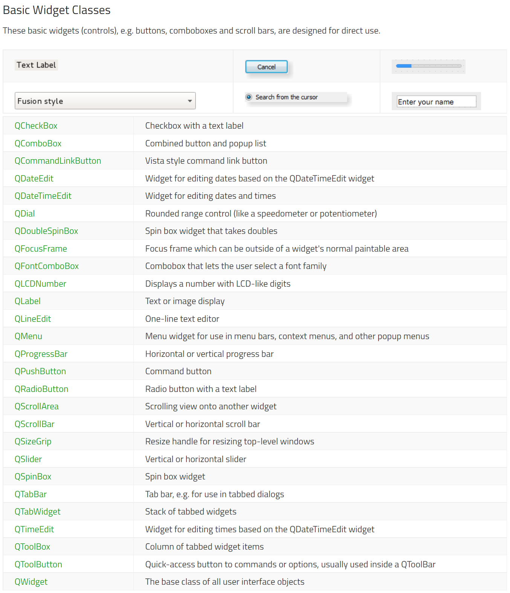

#### Layout

在一个程序中，往往不会只有一个QWidget，所以我们还需要组织这些Widget的布局，Qt中常用的布局是BoxLayout，这里有一个简单的示例：

``` c++
#include <QApplication>
#include <QWidget>
#include <QHBoxLayout>
#include <QPushButton>

class QMainWidget :public QWidget {
	Q_OBJECT
public:
	QMainWidget() {
		createUI();
	}
private:
	void createUI() {
		QHBoxLayout* hLayout = new QHBoxLayout(this);
		// QHBoxLayout* hLayout = new QHBoxLayout();			//等价
		//setLayout(hLayout);

		hLayout->setContentsMargins(5, 5, 5, 5);				//设置外边距
		hLayout->setSpacing(10);								//设置内部元素间隔
		hLayout->setAlignment(Qt::AlignLeft|Qt::AlignVCenter);	//设置左对齐且垂直居中
		hLayout->addWidget(new QPushButton("A"));
		hLayout->addSpacing(20);								//加入空白填充
		hLayout->addWidget(new QPushButton("B"));
		hLayout->addWidget(new QPushButton("C"));
	}
};

int main(int argc, char* argv[]) {
	QApplication a(argc, argv);
	QMainWidget widget;
	widget.resize(300, 300);
	widget.show();
	return a.exec();
}

#include "main.moc"
```

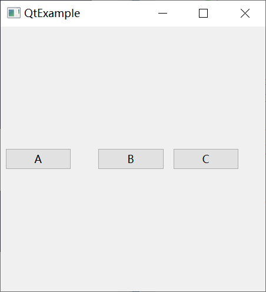

布局的完整介绍，请查阅：

- https://doc.qt.io/qt-6/layout.html

对于：

- 最外层的Widget
- 没有设置Layout，但具有层级关系的Widget

可以通过相对与parent左上角坐标来调整以下属性

- pos：https://doc.qt.io/qt-6/qwidget.html#pos-prop
- geometry：https://doc.qt.io/qt-6/qwidget.html#geometry-prop

在同一层级的Widget，可以调用以下接口来调整Z Order：

- [raise()](https://doc.qt.io/qt-6/qwidget.html#raise)：置顶
- [lower()](https://doc.qt.io/qt-6/qwidget.html#lower)：置底

#### Style

Qt的默认样式并不美观，但它支持使用 QSS 进行美化控件，详见：

- https://doc.qt.io/qt-6/stylesheet.html

## 进阶路线

就跟第三节 C++基础所说的那样：大量刷题是学习编程最好的方式，这样可以快速地掌握C++的基本语法和各类数据结构与算法，消除自己的误解，塑造自己的编程思维

同样Qt也是，你无需根据某些书籍或教程按部就班的学习，大量的实践能让你快速了解某个框架的基本骨架

在学习框架的过程中，最最最重要的是：

- 示例
- 文档

在遇到问题的时候，往往能帮上你的是：

- 社区

### 文档

在 **Qt Creator** 中，你只需选择代码中的Qt结构，按下 `F1`就能打开它的相关文档

在 **Visual Studio** 中，你需要安装 Qt Vs Tool 插件，在设置中开启：

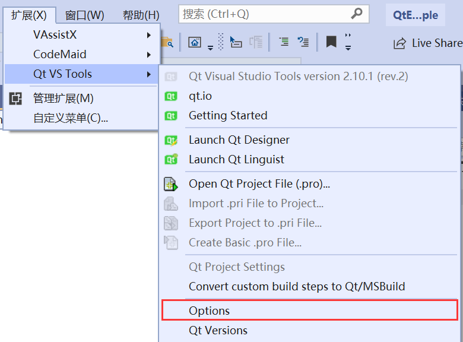

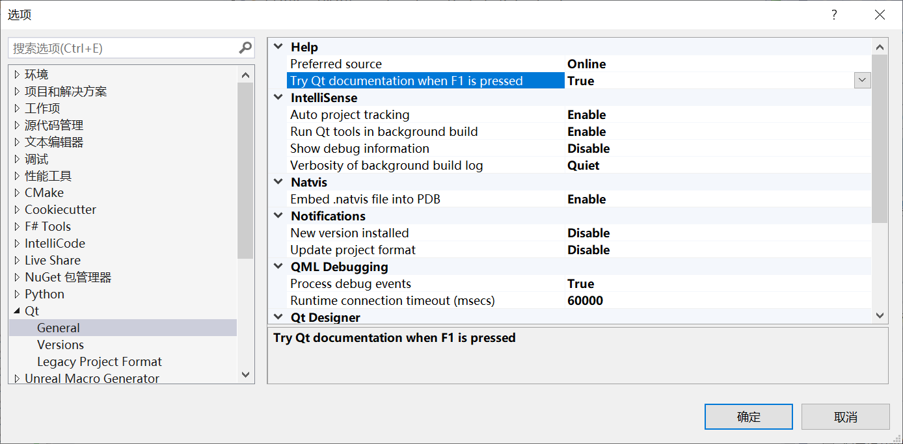

### 示例

这是Qt官方的示例教程页面：

- https://doc.qt.io/qt-6/qtexamplesandtutorials.html


在Qt Creator中也有大量的使用示例：


### 源码

在达到一定阶段之后，好奇心总会驱使你打开这个目录：


在每个模块的`tests`目录下面，你能找到非常多可供运行的测试工程：


## 结尾

看到这里，你还觉得Qt只是一个 GUI 框架吗？

Qt的GUI功能甚至都只是源码目录下的一小部分：

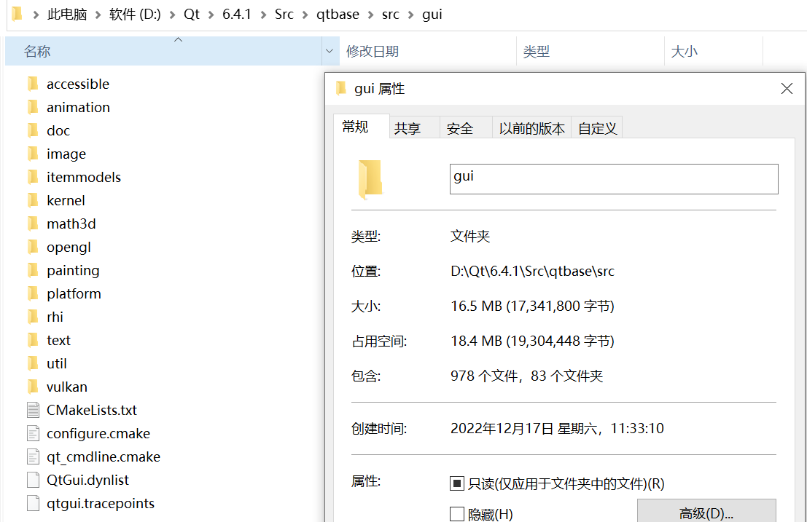

翻阅一下源码，你能体会到Qt有多么庞大~

在笔者眼里，它在代码层面并不比 Unreal Engine 逊色，由于它们适用于不同的行业，比较起来毫无意义

但无论你之后的目标是 Qt 还是 Unreal Engine 或是其他，只要方向是 C++ ，那么 Qt 不仅是一个完善的工具库，更是提升代码素养、架构能力的最好途径
