# 图形API概览

在开始学习之前，你需要确切地意识到 C/C++ 只是一个将 **现实理论** 在 **计算机中** **变现** 的 **工具** ，并且能够熟练使用它，否则，你应该继续潜修，在没构建好完备的基础知识体系和良好的代码素养之前，笔者认为是没有能力甚至没有资格去进一步学习的。

> 如何界定是一件比较困难的事情，可以当作像玩[蜘蛛纸牌](https://baike.baidu.com/item/%E8%9C%98%E8%9B%9B%E7%BA%B8%E7%89%8C/877244)那样思考，最好在觉得无路可走的时候，才请求发牌，因为进入到新的领域会提供一些切入点，但也会面临更大的挑战，甚至走进死胡同。

此外，你还需要考虑是否有学习它的必要，如果未来的目标从业方向是：

-   游戏引擎、图形
-   VR、AR、XR
-   三维工业软件
-   音视频
-   图形驱动

那么学习 底层图形API 是必经之路，但如果更专注图形所呈现出的艺术效果和趣味性，直接上手游戏引擎和三维处理软件会是一个更好的开端。

## 基础体系

在上一节中，我们通过控制台程序去映射GUI的基础架构，而在这一节中，依然会采用这种方式，不过稍作修改，暂时去除`SwapChain`，我们以这样的代码开始：

``` c++
void renderFrame(std::vector<std::vector<char>>& frameBuffer) {
}

int main() {
	const int width = 40;
	const int height = 20;
	const char clearCh = '0';

	while (true) {
		system("cls");              //控制台清屏
		std::vector<std::vector<char>> frameBuffer(width, std::vector<char>(height, clearCh));
		renderFrame(frameBuffer);

		/*上传到输出设备*/
		for (int y = 0; y < height; y++) {
			for (int x = 0; x < width; x++) {
				std::cout<<(frameBuffer[x][y]);
			}
			std::cout<<std::endl;
		}
	}
	return 0;
}
```

这里通过一个二维的`vector`来表示屏幕上的像素数据，一般称这个结构为[FrameBuffer](https://zhuanlan.zhihu.com/p/381766140)，运行它你能看到：

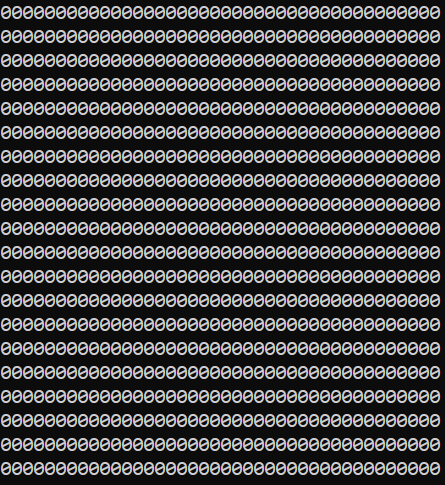

我们要做的就是在这张二维的表上绘制我们的图形

### 光栅化

什么是图形？

三角形，长方形，矩形，圆形，杯子一样的形状...，如果这么多的东西要考虑的话，那计算机就有数不清的规则要去定义，因此需要进行简化，使用最小的基础单位来囊括自然界中的所有图形，而计算机就只需处理这些基础单位的绘制即可，而这些基础单元（图元）也就是：

- 点（Point）
- 线（Line）
- 三角面（Triangle）

它们可以使用如下的数据结构进行描述：

``` c++
struct Point {
	int x, y;
};

struct Line {
	std::array<Point, 2> points;
};

struct Triangle {
	std::array<Point, 3> vertices;
};
```

如果要将一个点绘制在`FrameBuffer`上，很简单：

``` c++
void drawPoint(std::vector<std::vector<char>>& frameBuffer, const Point& point) {
	frameBuffer[point.x][point.y] = '1';
}
```

那如果要将一条线绘制在`FrameBuffer`上呢？

线由一系列的点组成，但需要注意的是，一条线上有无数的点，但`FrameBuffer`上的点却是有限的，因此绘制的时候会丢失一部分精度，而我们也只需要根据精度来计算对应点的坐标，而这个过程正是 **光栅化** （[Rasterisation](https://en.wikipedia.org/wiki/Rasterisation)）

一条线可以使用斜切式方程表示：y = kx+b

根据两点坐标可以解出`k`和`b`的值，确定精度为1，那么很容易就能算出端点之间的其他点，但需要注意的是，斜切式不能表示垂直于x轴的直线，所以得绕开斜率的计算，这种做法是： **DDA** （[Digital differential analyzer](https://en.wikipedia.org/wiki/Digital_differential_analyzer_(graphics_algorithm))），简易实现如下：

``` c++
void drawLine(std::vector<std::vector<char>>& frameBuffer, Line line) {
	int dx = line.points[1].x - line.points[0].x;
	int dy = line.points[1].y - line.points[0].y;

	if (dx == 0 && dy == 0) {			//端点重叠，直接绘制点	
		drawPoint(frameBuffer, line.points[0]);
	}

	float steps = abs(dx) > abs(dy) ? abs(dx) : abs(dy);

	float xInc = dx / (float)steps;		//x增量
	float yInc = dy / (float)steps;		//y增量

	float x = line.points[0].x;			//x起始值
	float y = line.points[0].y;			//y起始值

	for (int i = 0; i <= steps; i++) {	//
		drawPoint(frameBuffer, Point(round(x), round(y)));
		x += xInc;
		y += yInc;
	}
}
```

此外，还由一些其他的线条光栅化算法，这里不一一介绍：

- [Bresenham's line algorithm](https://en.wikipedia.org/wiki/Bresenham's_line_algorithm)
- [Xiaolin Wu's line algorithm](https://en.wikipedia.org/wiki/Xiaolin_Wu's_line_algorithm) 

在`renderFrame`中进行测试：

``` c++
void renderFrame(std::vector<std::vector<char>>& frameBuffer) {
	std::vector<Line> lines = {
		{0,0,39,0},
		{0,0,39,19}
	};

	for (const auto& line : lines) {
		drawLine(frameBuffer, line);
	}
}
```


而三角形的光栅化相对来说复杂一些，这里有几种算法：

- 分割法
- Bresenham 算法
- Barycentric 算法

其中分割法比较常见，它的核心思想也很简单，就是将一个三角形划分成两个底边与X抽并行的三角形，然后在纵向上逐步的填充线条：

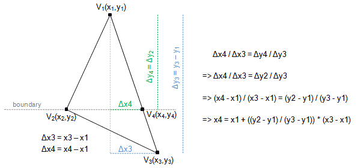

思路细节请阅读：

- http://www.sunshine2k.de/coding/java/TriangleRasterization/TriangleRasterization.html

这里有一个简单的实现：

``` c++
void drawTriangle(std::vector<std::vector<char>>& frameBuffer, Triangle triangle) {
	std::sort(triangle.vertices.begin(), triangle.vertices.end(), [](const Point& a, const Point& b) {
		return a.y < b.y;
	});
	if (triangle.vertices[0] == triangle.vertices[1]	//出现重叠顶点时不绘制
		|| triangle.vertices[1] == triangle.vertices[2]
		|| triangle.vertices[0] == triangle.vertices[2]
		)
		return;

	auto fillBottomFlatTriangle = [&](const Point& v1, const Point& v2, const Point& v3) {
		float invslope1 = (v2.x - v1.x) / (v2.y - v1.y);
		float invslope2 = (v3.x - v1.x) / (v3.y - v1.y);

		float curx1 = v1.x;
		float curx2 = v1.x;

		for (int scanlineY = v1.y; scanlineY <= v2.y; scanlineY++) {
			Line scanLine = {
			 (int)curx1, scanlineY ,
			 (int)curx2, scanlineY 
			};
			drawLine(frameBuffer, scanLine);
			curx1 += invslope1;
			curx2 += invslope2;
		}
	};

	auto fillTopFlatTriangle = [&](const Point& v1, const Point& v2, const Point& v3) {
		float invslope1 = (v3.x - v1.x) / (float)(v3.y - v1.y);
		float invslope2 = (v3.x - v2.x) / (float)(v3.y - v2.y);

		float curx1 = v3.x;
		float curx2 = v3.x;

		for (int scanlineY = v3.y; scanlineY > v1.y; scanlineY--) {
			Line scanLine = {
			 (int)curx1, scanlineY ,
			 (int)curx2, scanlineY
			};
			drawLine(frameBuffer, scanLine);
			curx1 -= invslope1;
			curx2 -= invslope2;
		}
	};
	if (triangle.vertices[1].y == triangle.vertices[2].y) {
		fillBottomFlatTriangle(triangle.vertices[0], triangle.vertices[1], triangle.vertices[2]);
	}
	else if (triangle.vertices[0].y == triangle.vertices[1].y) {
		fillTopFlatTriangle(triangle.vertices[0], triangle.vertices[1], triangle.vertices[2]);
	}
	else {
		Point mid = Point({
			(int)(triangle.vertices[0].x + ((float)(triangle.vertices[1].y - triangle.vertices[0].y) / (float)(triangle.vertices[2].y - triangle.vertices[0].y)) * (triangle.vertices[2].x - triangle.vertices[0].x))
			, triangle.vertices[1].y
		});
		fillBottomFlatTriangle(triangle.vertices[0], triangle.vertices[1], mid);
		fillTopFlatTriangle(triangle.vertices[1], mid, triangle.vertices[2]);
	}
}
```

使用如下代码可以验证：

``` c++
void renderFrame(std::vector<std::vector<char>>& frameBuffer) {
	std::vector<Triangle> triangles = { 
		{0,0,20,0,10,9},
		{30,15,30,5,20,9},
	};

	for (const auto& triangle : triangles) {
		drawTriangle(frameBuffer,triangle);
	}
}
```


关于相关细节，可阅读：

- [图形渲染基础：光栅化算法](https://zhuanlan.zhihu.com/p/370059588)
- [Rasterization: a Practical Implementation](https://www.scratchapixel.com/lessons/3d-basic-rendering/rasterization-practical-implementation/rasterization-stage.html)

### 处理管线

计算机中除了表示朴素的，静态的几何图形，有时候还需要绘制一些动态的，经处理的图形效果，这就需要

- 可以给每个顶点做一些处理，比如移动，相对坐标原点旋转，缩放等
- 可以对FrameBuffe上的像素进行一些额外的加工，比如上色，加各种滤镜等

结合上一节的`SwapChain`，可以实现这样的小程序：


上图中动态地缩放三角形的大小，并为其添加了一层 * 边框，完整代码如下：

``` c++
#include <iostream>
#include <vector>
#include <algorithm>
#include <functional>
#include <array>
#include <Windows.h>

double GTime = 0;

struct Point {
	int x, y;
	bool operator == (const Point& other) { return x == other.x && y == other.y; }
};

struct Line {
	std::array<Point, 2> points;
};

struct Triangle {
	std::array<Point, 3> vertices;
};

void drawPoint(std::vector<std::vector<char>>& frameBuffer, const Point& point) {
	frameBuffer[point.x][point.y] = '1';
}

void drawLine(std::vector<std::vector<char>>& frameBuffer, Line line) {
	int dx = line.points[1].x - line.points[0].x;
	int dy = line.points[1].y - line.points[0].y;

	if (dx == 0 && dy == 0) {			//端点重叠，直接绘制点	
		drawPoint(frameBuffer, line.points[0]);
	}

	float steps = abs(dx) > abs(dy) ? abs(dx) : abs(dy);

	float xInc = dx / (float)steps;		//x增量
	float yInc = dy / (float)steps;		//y增量

	float x = line.points[0].x;			//x起始值
	float y = line.points[0].y;			//y起始值

	for (int i = 0; i <= steps; i++) {
		drawPoint(frameBuffer, Point(round(x), round(y)));
		x += xInc;
		y += yInc;
	}
}

void drawTriangle(std::vector<std::vector<char>>& frameBuffer, Triangle triangle) {
	std::sort(triangle.vertices.begin(), triangle.vertices.end(), [](const Point& a, const Point& b) {
		return a.y < b.y;
	});
	if (triangle.vertices[0] == triangle.vertices[1]	//出现重叠顶点时不绘制，暂时忽略共线的情况
		|| triangle.vertices[1] == triangle.vertices[2]
		|| triangle.vertices[0] == triangle.vertices[2]
		)
		return;

	auto fillBottomFlatTriangle = [&](const Point& v1, const Point& v2, const Point& v3) {
		float invslope1 = (v2.x - v1.x) / (v2.y - v1.y);
		float invslope2 = (v3.x - v1.x) / (v3.y - v1.y);

		float curx1 = v1.x;
		float curx2 = v1.x;

		for (int scanlineY = v1.y; scanlineY <= v2.y; scanlineY++) {
			Line scanLine = {
			 (int)curx1, scanlineY ,
			 (int)curx2, scanlineY 
			};
			drawLine(frameBuffer, scanLine);
			curx1 += invslope1;
			curx2 += invslope2;
		}
	};

	auto fillTopFlatTriangle = [&](const Point& v1, const Point& v2, const Point& v3) {
		float invslope1 = (v3.x - v1.x) / (float)(v3.y - v1.y);
		float invslope2 = (v3.x - v2.x) / (float)(v3.y - v2.y);

		float curx1 = v3.x;
		float curx2 = v3.x;

		for (int scanlineY = v3.y; scanlineY > v1.y; scanlineY--) {
			Line scanLine = {
			 (int)curx1, scanlineY ,
			 (int)curx2, scanlineY
			};
			drawLine(frameBuffer, scanLine);
			curx1 -= invslope1;
			curx2 -= invslope2;
		}
	};
	if (triangle.vertices[1].y == triangle.vertices[2].y) {
		fillBottomFlatTriangle(triangle.vertices[0], triangle.vertices[1], triangle.vertices[2]);
	}
	else if (triangle.vertices[0].y == triangle.vertices[1].y) {
		fillTopFlatTriangle(triangle.vertices[0], triangle.vertices[1], triangle.vertices[2]);
	}
	else {
		Point mid = Point({
			(int)(triangle.vertices[0].x + ((float)(triangle.vertices[1].y - triangle.vertices[0].y) / (float)(triangle.vertices[2].y - triangle.vertices[0].y)) * (triangle.vertices[2].x - triangle.vertices[0].x))
			, triangle.vertices[1].y
		});
		fillBottomFlatTriangle(triangle.vertices[0], triangle.vertices[1], mid);
		fillTopFlatTriangle(triangle.vertices[1], mid, triangle.vertices[2]);
	}
}

/*逐顶点处理
* 根据时间动态缩放顶点位置
*/
Point processVertex(const Point& point) {
	Point newPoint = point;
	double scaleFactor = 0.5 + 0.4 * std::sin(GTime);		//保证缩放因子在[0.1,0.9]
	newPoint.x *= scaleFactor;
	newPoint.y *= scaleFactor;
	return newPoint;
}

/*逐像素处理
* 简单描边
*/
char processPixel(const std::vector<std::vector<char>>& frameBuffer, int x,int y) {
	static int direction[4][2] = { {0,1},{0,-1},{1,0},{-1,0} };	//四方向
	for (int i = 0; i < 4; i++) {
		int xOff = x + direction[i][0];
		int yOff = y + direction[i][1];
		if (xOff >= 0											//判断是否位于frame边界内，当前像素为0，周边像素有1
			&& xOff < frameBuffer.size()
			&& yOff >= 0 
			&& yOff < frameBuffer[0].size()
			&& frameBuffer[x][y]=='0'
			&& frameBuffer[xOff][yOff] == '1') {
			return '*';
		}
	}
	return frameBuffer[x][y];
}

void renderFrame(std::vector<std::vector<char>>& frameBuffer) {
	std::vector<Triangle> triangles = { 
		{0,0,40,0,20,19},
	};

    /*顶点处理*/
	for (auto& triangle : triangles) {
		for (auto& vertex : triangle.vertices) {
			vertex = processVertex(vertex);
		}
	}

	for (const auto& triangle : triangles) {
		drawTriangle(frameBuffer,triangle);
	}

    /*像素处理*/
	std::vector<std::vector<char>> newFrameBuffer(frameBuffer);
	for (int x = 0; x < frameBuffer.size(); x++) {
		for (int y = 0; y < frameBuffer[x].size(); y++) {
			newFrameBuffer[x][y] = processPixel(frameBuffer, x, y);
		}
	}
	frameBuffer = newFrameBuffer;
}

int main() {
	HANDLE frontendBuffer = GetStdHandle(STD_OUTPUT_HANDLE);        //获取默认的缓冲区
	HANDLE backendBuffer = CreateConsoleScreenBuffer(               //创建一个新的缓冲区作为后台缓冲区
		GENERIC_READ | GENERIC_WRITE,
		FILE_SHARE_READ | FILE_SHARE_WRITE,
		NULL,
		CONSOLE_TEXTMODE_BUFFER,
		NULL
	);
	//隐藏两个缓冲区的光标
	CONSOLE_CURSOR_INFO cci;
	cci.bVisible = 0;
	cci.dwSize = 1;
	SetConsoleCursorInfo(frontendBuffer, &cci);
	SetConsoleCursorInfo(backendBuffer, &cci);

	const int width = 40;
	const int height = 20;
    const char clearCh = '0';
	const int MaxBufferSize = width * height * 10;

	char bufferData[MaxBufferSize];     //缓存数据暂存区
	DWORD bufferLength = 0;
	COORD zeroCoord = { 0,0 };
	while (true) {
		GTime += 0.01;
		bufferLength = 0;
		CONSOLE_SCREEN_BUFFER_INFO backendBufferInfo;      
		GetConsoleScreenBufferInfo(backendBuffer, &backendBufferInfo);
		int lineWidth = backendBufferInfo.srWindow.Right - backendBufferInfo.srWindow.Left + 1;

		std::vector<std::vector<char>> frameBuffer(width, std::vector<char>(height, clearCh));
		renderFrame(frameBuffer);

		for (int y = 0; y < height; y++) {
			for (int x = 0; x < width; x++) {
				bufferData[bufferLength++] = frameBuffer[x][y];
			}
			while (bufferLength % lineWidth != 0) {             //填充字符以到达换行的效果
				bufferData[bufferLength++] = ' ';
			}
		}

		WriteConsoleOutputCharacterA(backendBuffer, bufferData, bufferLength, zeroCoord, &bufferLength);
		SetConsoleActiveScreenBuffer(backendBuffer);           
		std::swap(backendBuffer, frontendBuffer);              
	}
	return 0;
}
```

现代图形渲染管线中除了上面的逐顶点处理以及逐像素处理，还支持其他的可编程阶段，这些会在后面的章节中深入说明。

三维的图形渲染，无非就是通过一些数值计算将三维的顶点投影到二维的屏幕坐标上，再进行绘制，这里推荐大家可以完整地过一遍：

- [《3D数学基础 - 图形与游戏开发（第2版）》](https://baike.baidu.com/item/3D%E6%95%B0%E5%AD%A6%E5%9F%BA%E7%A1%80%EF%BC%9A%E5%9B%BE%E5%BD%A2%E5%92%8C%E6%B8%B8%E6%88%8F%E5%BC%80%E5%8F%91%EF%BC%88%E7%AC%AC2%E7%89%88%EF%BC%89)

现在绘制的理论有了，但在计算机中，还需要考虑性能，因为这就决定了一定的时间范围内，所能绘制三角形数量的上限。

总结上面的代码中，我们可以发现：

- 代码里面有许多的数值计算
- 顶点之间的处理，像素之间的处理，图元之间的绘制是没有相互影响的，这也就意味着这些操作都可以并行

为了加速这个过程，现代计算机体系结构中增加了一种专门用于图形绘制的处理器 ——GPU（G[raphics Processing Unit，图形处理单元](https://en.wikipedia.org/wiki/Graphics_processing_unit)）

### GPU

现代 GPU 在操纵[计算机图形](https://en.wikipedia.org/wiki/Computer_graphics)和[图像处理](https://en.wikipedia.org/wiki/Image_processing)方面非常高效。对于并行处理大块数据的算法，它们的[并行结构](https://en.wikipedia.org/wiki/Parallel_computing)使得它们比通用[中央处理器](https://en.wikipedia.org/wiki/Central_processing_unit)(CPU)更高效。

这里有一些文章很好地解释了它的作用：

- [图形流水线的GPU架构](https://zhuanlan.zhihu.com/p/558985283)
- [理解GPU的底层架构](https://zhuanlan.zhihu.com/p/598173226)

另外，笔者强烈简易观看 Games104 的这一节内容：

- [第四节：游戏引擎中的渲染实践](https://www.bilibili.com/video/BV14r4y1p7tt/)

## 图形API

> [ **图形 API** ](https://en.wikipedia.org/wiki/List_of_3D_graphics_libraries) 提供了一种抽象的GPU硬件访问方式，简化了计算机图形生成的各个阶段，使得开发者无需深入了解硬件细节，而专注于图形的构建。
>
> 它可以纯粹在[软件](https://en.wikipedia.org/wiki/Computer_software)中完成并在[CPU](https://en.wikipedia.org/wiki/Central_processing_unit)上运行，这在[嵌入式系统](https://en.wikipedia.org/wiki/Embedded_system)中很常见，或者由[GPU](https://en.wikipedia.org/wiki/Graphics_processing_unit)进行[硬件加速](https://en.wikipedia.org/wiki/Hardware_acceleration)，在[PC](https://en.wikipedia.org/wiki/Personal_computer)中更常见，它主要用于[视频游戏](https://en.wikipedia.org/wiki/Video_game)和[模拟](https://en.wikipedia.org/wiki/Simulation_video_game)。
>

当下主流的3D图形API有：

- DX11、[DX12](https://www.nvidia.com/en-sg/geforce/technologies/dx12/)：[微软](https://zh.wikipedia.org/wiki/微軟)公司在[Windows](https://zh.wikipedia.org/wiki/Microsoft_Windows)系统上所开发的3D图形编程接口
- [OpenGL](https://www.opengl.org/)：OpenGL是一套跨语言、跨平台的API，它的实现存在于Windows、部分UNIX和Mac OS，这些实现一般由显卡厂商提供，而且非常依赖于该厂商提供的硬件。
- [Vulkan](https://www.vulkan.org/)：下一代的OpenGL，相比之下，Vulkan更接近底层，并且能很好地分配CPU核心来执行并行任务
- [Metal](https://developer.apple.com/metal/)：Metal API 由苹果公司提供，它旨在为[iOS](https://en.wikipedia.org/wiki/IOS)、[iPadOS](https://en.wikipedia.org/wiki/IPadOS)、[macOS](https://en.wikipedia.org/wiki/MacOS)和[tvOS](https://en.wikipedia.org/wiki/TvOS)上的应用程序提供对GPU硬件的低级访问来提高性能，它与Vulkan、DX12都属于低级别的API

相信很多小伙伴看到它们的第一反应是：

- 这些API里面，谁最强呢？该学哪一个？

在这个问题上，每个人都有自己的见解，比如：

- [知乎：Vulkan相比于OpenGL、DX12、Metal和Mantle有什么优势、劣势？](https://www.zhihu.com/question/46536915)

作为一个过来人，笔者的看法是：

- 不要指望学了其中任何一个API，就能高枕无忧，在实际工作开发中，至少都会接触到上述API中的两个及以上，并且更大的可能性是在这些API的上层接口上开发。

大多数游戏引擎都对这些图形API封装成统一的接口，可以在不同的平台上切换来追求更好的图形性能，我们一般称这套接口为 **RHI** （Rendering Hardware Interface） 

> 虽然OpenGL、Vulkan支持 **绝大多数** 的平台，但它们并不完美，此外，苹果在它的操作系统上要求必须使用Metal

如果在相关行业持续发展，深入到底层，一定会接触到DX12、Vulkan、Metal的各种疑难杂症，不过好在这类API的基础结构都相差不多，只要会一个，其他的很容易触类旁通。关于它们的细致研究，可参阅：

- [剖析虚幻渲染体系（13）- RHI补充篇：现代图形API之奥义与指南](https://www.cnblogs.com/timlly/p/15680064.html)

对于初学者而言，DX12、Vulkan、Metal几乎是一道令人望而生畏的天堑

笔者个人认为选择学习曲线更平缓的路线先入门才是更明智的做法

笔者的学习路线如下：

通过Learn OpenGL入门：

- https://learnopengl-cn.github.io/

并复刻这个网站的代码：

- https://ogldev.org/

> 值得一提的是，笔者并没有使用GLFW作为窗口框架，而是使用Qt，当时匮乏的文档无疑给笔者的学习增加了很多困难，但正因为如此，笔者才在不断的试错过程中，一点一点地扫除了自己认知中的雾区，从而有能力去探索更深层次的领域。
>
> 因此，笔者更建议大家不要按部就班地模仿教程，可以根据思路大胆尝试，举一反三，锻炼自己寻找问题，解决问题的能力，因为在之后的工作中，会遇到很多意料之外的困难，需要你能够做到 “兵来将挡，水来土掩”，借一句名言来告勉大家：
>
> 自从厌倦于 **追寻** ，我已学会一觅即中；自从一股逆风袭来，我已能抗御八面来风，驾舟而行。
>
> ——尼采

那现在通过OpenGL入门还是一个不错的选择吗？

笔者必须承认 OpenGL 是一个简单能快速上手的框架，也有很优秀的教程，但可惜的是，现代图形API的架构跟OpenGL API的使用方式已经截然不同，它依然可以用作图形学入门，但整体来说，收益并没有那么高。

> 感叹的是，笔者几年前还听说很多高校使用固定管线的OpenGL做教学，现在却说出了可编程管线的OpenGL都快要过时的话

笔者做过OpenGL的简易教程：

- https://www.bilibili.com/read/readlist/rl394647

也写过Vulkan的Demo：

- https://github.com/Italink/HelloVulkan

深入了解过Bgfx：

- https://zhuanlan.zhihu.com/p/609349255

尝试过O3DE的RHI：

- https://github.com/o3de/o3de-atom-sampleviewer

目前在 Unreal Engine 5 中开发

在这个过程中，笔者学到了很多东西，并且迫切地想要把它们给记录下来，复刻一遍来加深理解，然而，却受尽苦难 —— 废弃的OpenGL，繁琐的Vulkan，魔改的bgfx，错综复杂的O3DE、UE...都不是我想要的，直到，笔者无意间发现了 Qt 的 RHI，它的源码就是一件艺术品，它有着高度简化的现代图形API架构：

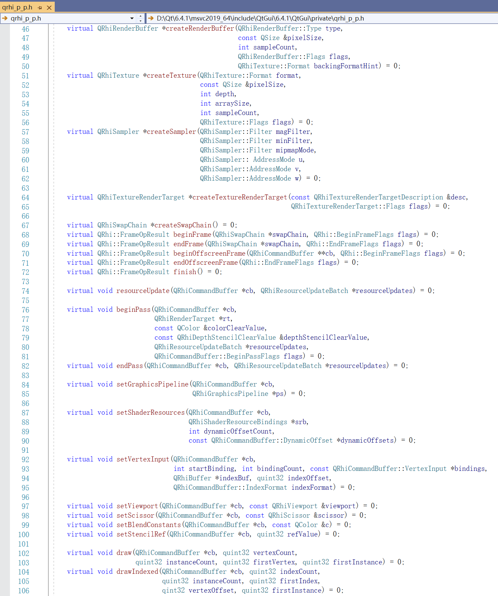

### QRhi

Qt6 的主要目标之一是让 Qt 摆脱直接使用 OpenGL，并且通过适当的抽象，允许在更广泛的图形上进行操作API，例如[Vulkan](https://www.khronos.org/vulkan/)、[Metal](https://developer.apple.com/metal/)和[Direct3D](https://docs.microsoft.com/en-us/windows/win32/direct3d)。[OpenGL](https://www.khronos.org/opengl/)（和[OpenGL ES](https://www.khronos.org/opengles/)），这背后的主要动机不是获得性能，而是在 OpenGL 不可用或不再需要的平台和设备上，仍能确保 **Qt无处不在** ，将来也会如此。同时，能够在现代的、较低级别的、显式 API 上进行构建也可以在提高性能（例如，由于 API 开销较少而降低 CPU 使用率），它是[Qt Quick](https://doc.qt.io/qt-5/qtquick-index.html#)和其他模块背后的渲染引擎，它的架构如下：


> 在官方目前的开发者分支上，QRhi已经支持DX12，预计会在Qt6.6上线

而在Qt6中，它也不再使用与OpenGL兼容的GLSL着色器代码，而是使用Vulkan风格的GLSL编写，然后反射并翻译成其他着色器语言（HLSL，MSL），最后打包成一个可序列化的QShader对象，供QRhi使用，它的工作流程如下：


你能在如下位置，找到它的源码：

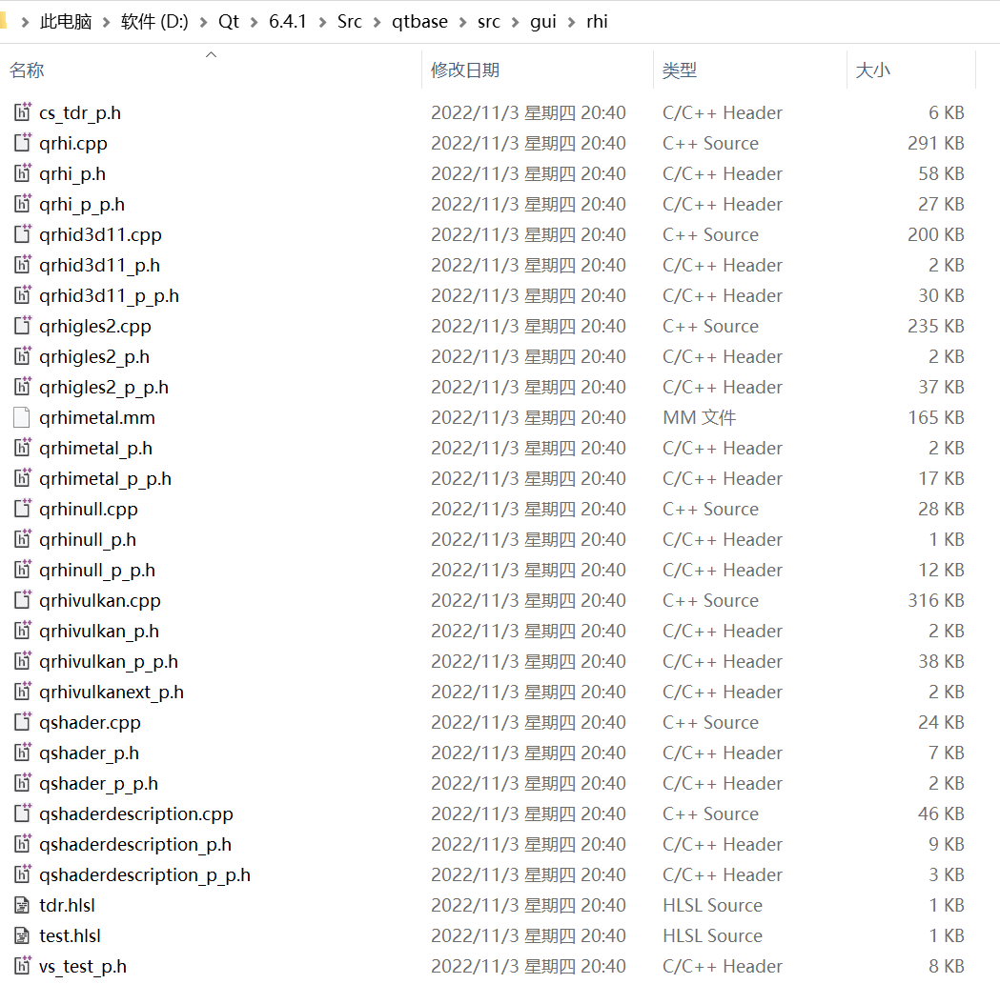

其中关键文件为：

- qrhi_p.h：定义了各种图形资源的结构和操作
- qrhi.cpp：QRhi的调度实现，里面有大量的注释说明
- qrhi_p_p.h：定义了QRhi完整的结构骨架

其他以`qrhi`开头的文件是特定图形API的具体实现

### 示例

在如下目录有很多QRhi的测试工程：

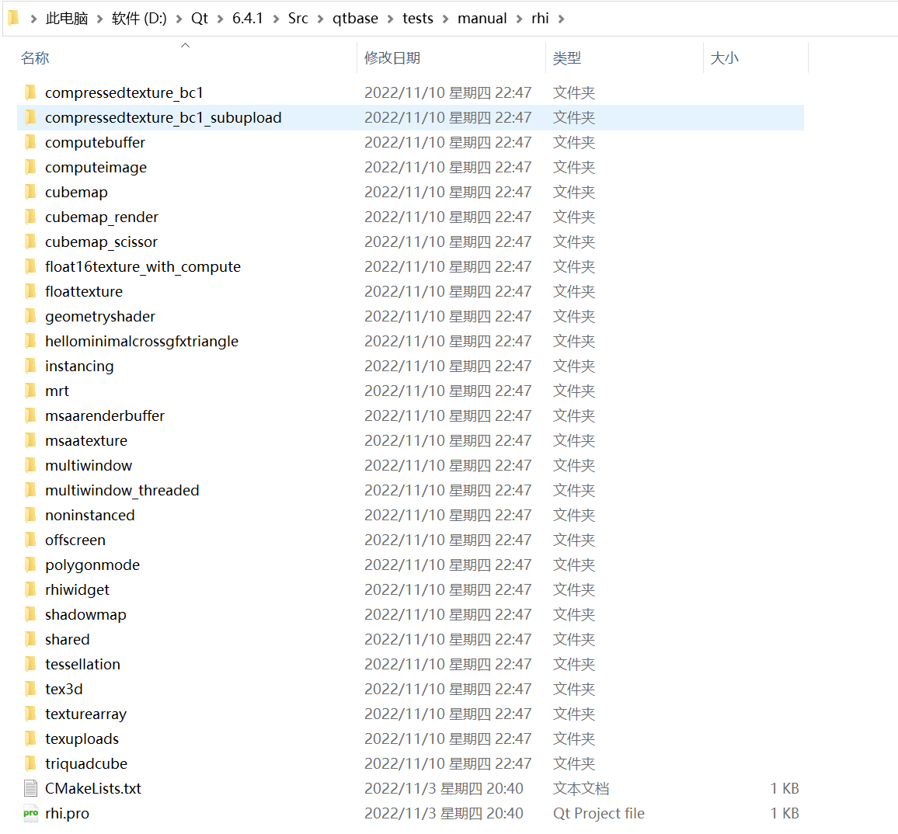

只需修改当前目录下的CMakeLists.txt，在内容开头增加：

```cmake
cmake_minimum_required(VERSION 3.12)
project(QRhiTests VERSION 0.0.1)
find_package(Qt6 COMPONENTS Core Widgets BuildInternals REQUIRED)
include(QtSetup)
include(QtCMakeHelpers)
include(QtTestHelpers)
```

就能使用Cmake对该目录生成工程文件

在这些工程示例中，可以在的`项目属性` - `调试` - `命令参数`中调整Rhi的配置，可配置项可参考`examplefw.h`中的[QCommandLineParser](https://doc.qt.io/qt-6/qcommandlineparser.html)：

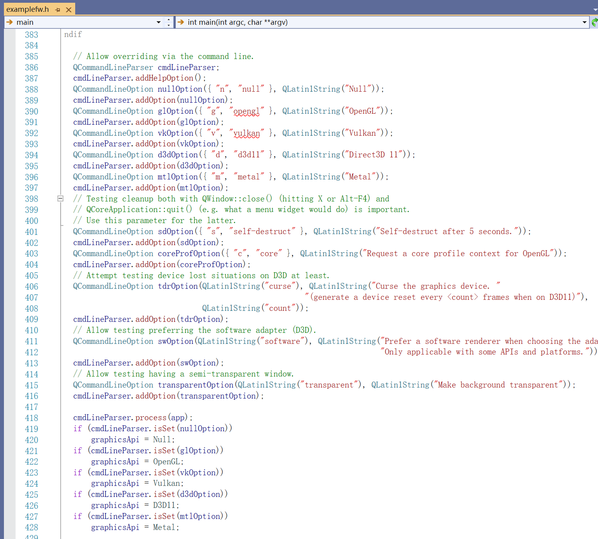

> 例如追加 `-v`，能使用vulkan作为渲染后端，部分示例在DX11中无法运行

如果有一定图形API基础，通过这些工程示例能快速上手QRhi

**helloinimalcrossgfxtriangle** ：简单的三角形绘制程序


**multiwindow** ：多个Rhi窗口


**multiwindow_threaded** ：多窗口，多线程


**rhiwidget** ：在QWidget上使用Rhi


**offscreen** ：离屏（无窗口）渲染

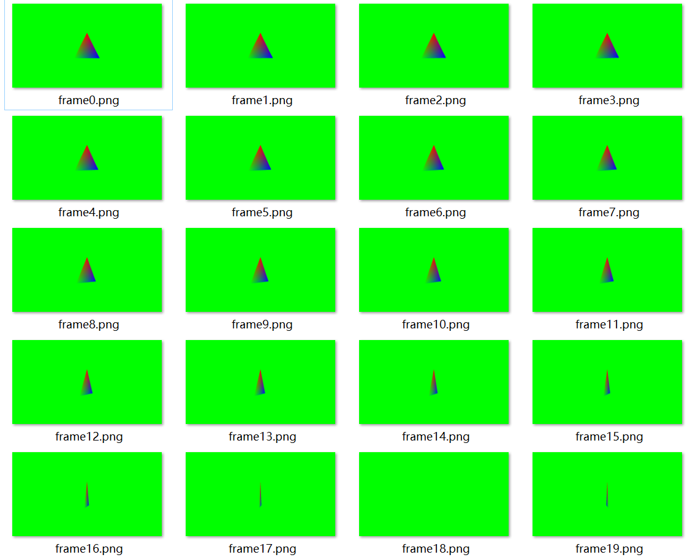

**triquadcube** ：绘制一些简单的几何图形


**polygonmode** ：线框模式

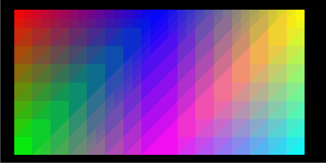

**msaatexture** ：使用 [MSAA](https://baike.baidu.com/item/MSAA/2793968) 的纹理


**msaarenderbuffer** ：使用 [MSAA](https://baike.baidu.com/item/MSAA/2793968) 的RenderBuffer

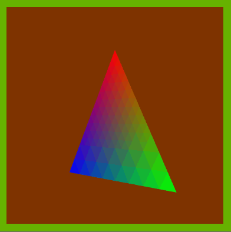

**tst_manual_instancing** ：实例化渲染


**noninstanced** ：非实例化渲染，使用Buffer来达到与实例化相同的目的


**mrt** ：多渲染目标（Multiple Render Target）：一条流水线有多个输出 

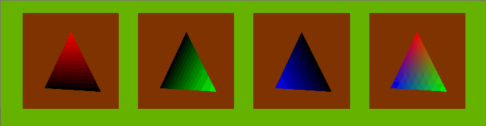

**texuploads** ：上传纹理

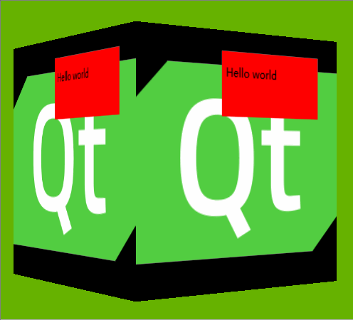

**floattexture** ：浮点纹理：原本纹理的数值存储范围为[0,1]


**texturearray** ：纹理数组


**tex3d** ：3D纹理


**cubemap** ：立方体纹理

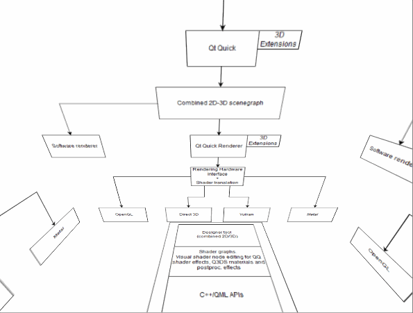

**cubemap_scissor** ：裁剪


**cubemap_render** ：渲染输出到立方体纹理


**compressedtexture_bc1** ：压缩纹理


**compressedtexture_bc1_subupload** ：上传部分压缩纹理

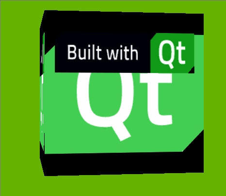

**computebuffer** ：使用 **Compute Shader** 制作简易的GPU粒子


**computeimage** ：使用 **Compute Shader** 动态生成图像

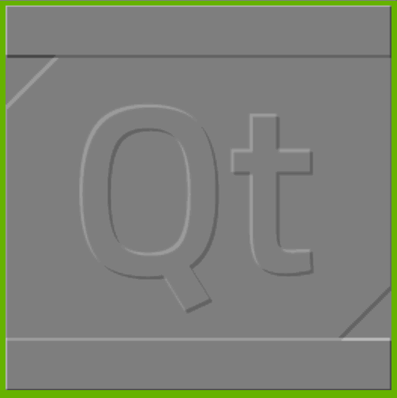

**float16texture_with_compute** ：计算生成16位的浮点纹理


**geometryshader** ：使用几何着色器


**tessellation** ：使用镶嵌着色器


**shadowmap** ：绘制阴影


## 学习资源

该教程的主要目的是为了让一些小伙伴能够入门，并培养良好的代码习惯。

对于深层次的技术，不要指望有太多的文章和教程来阐述它们的原理，主流引擎中的代码绝对是最好的参考，不过想要阅读它们，不仅需要足够的理论知识，还需要过硬的工程能力。

对于图形开发中的常用数学知识，强烈推荐《3D数学基础》，以及其他几册书籍：


关于实时渲染，这里有一个比较完整的资源合集：

- http://www.realtimerendering.com

关于引擎技术的概览，可以观看：

- [Games104 - 现代游戏引擎：入门到实践](https://www.bilibili.com/video/BV1oU4y1R7Km/)

对于引擎的基础知识体系，可以阅读下面的文章：

- [剖析虚幻渲染体系（14）- 延展篇：现代渲染引擎演变史Part 1（萌芽期）](https://www.cnblogs.com/timlly/p/16097134.html)
- [剖析虚幻渲染体系（14）- 延展篇：现代渲染引擎演变史Part 2（成长期）](https://www.cnblogs.com/timlly/p/16147358.html)
- [剖析虚幻渲染体系（14）- 延展篇：现代渲染引擎演变史Part 3（开花期）](https://www.cnblogs.com/timlly/p/16216707.html)
- [剖析虚幻渲染体系（14）- 延展篇：现代渲染引擎演变史Part 4（结果期）](https://www.cnblogs.com/timlly/p/16268881.html)
- [剖析虚幻渲染体系（16）- 图形驱动的秘密](https://www.cnblogs.com/timlly/p/16404963.html)
- [剖析虚幻渲染体系（17）- 实时光线追踪](https://www.cnblogs.com/timlly/p/16687324.html)
- [剖析虚幻渲染体系（18）- 操作系统](https://www.cnblogs.com/timlly/p/16844127.html)
- [剖析虚幻渲染体系（19）- 计算机硬件体系](https://www.cnblogs.com/timlly/p/16964884.html)

发展资讯，可以关注：

- 游戏开发者大会：https://gdconf.com/
- Nvidia：https://www.nvidia.com/en-sg/geforce/news/
- UnrealEngine ：https://www.unrealengine.com/zh-CN/feed
- Vulkan：https://www.vulkan.org/

> 与之关联的微信公众号、知乎、哔哩哔哩等

此外，这里罗列了一份比较完整的开源图形库列表：

- https://github.com/Gforcex/OpenGraphic

另外还有一些书籍，有更深层次的技术讲解：

- [Graphics Gems](https://www.realtimerendering.com/resources/GraphicsGems/)

- [GPU Pro](http://gpupro.blogspot.com/)

Github上也有很多有意思的图形项目，可以搜搜看~

读者可能会好奇，这么多东西，难道都需要了解吗？

非也，学海无涯生有涯

上面这么多内容也不是一个人的成果，而是一个庞大群体几十年堆叠出来的技术结晶

在实际工作中，能使用上的并不多，大多数时候开发者都是站在巨人的肩膀上

对于个人来讲，选择自己感兴趣的方向研究即可，因为这不仅仅是为了一份糊口的工作，而是为了能够有能力探索更多未来~
