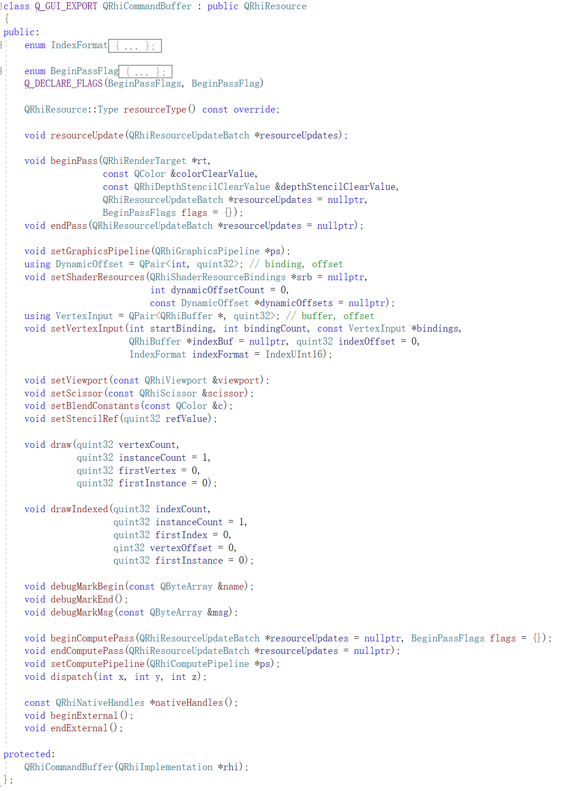
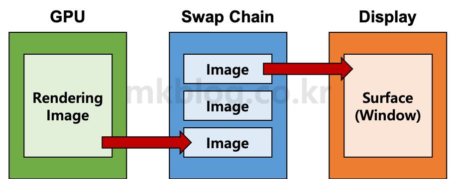
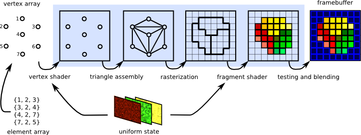
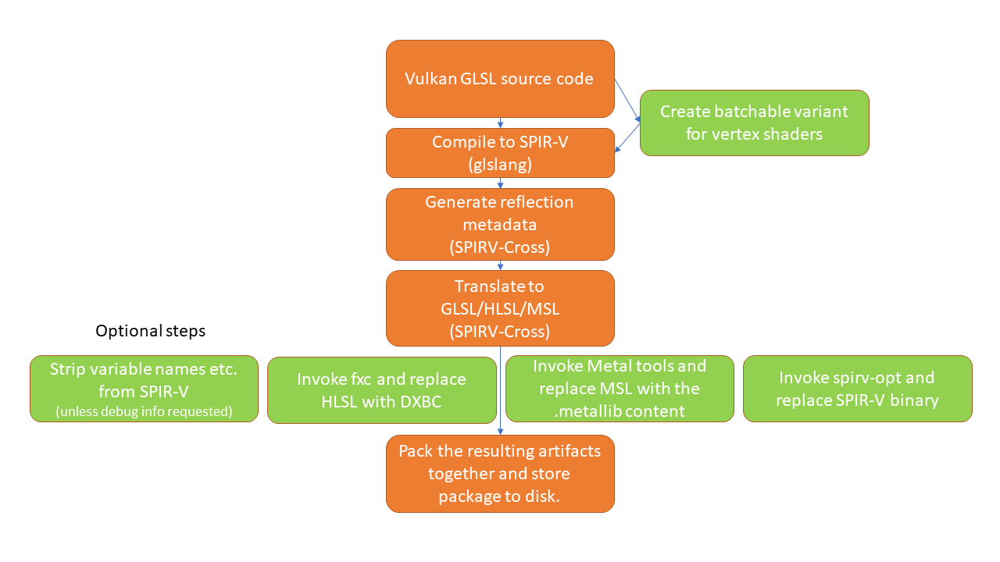
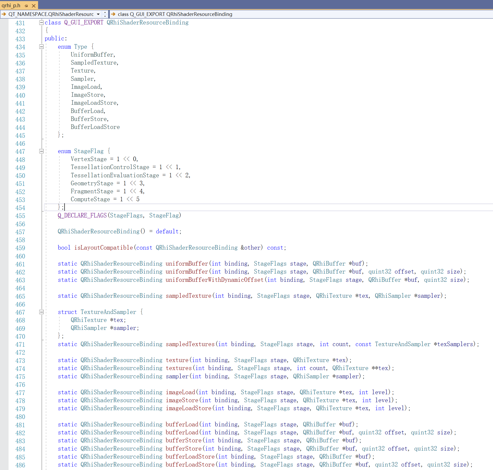
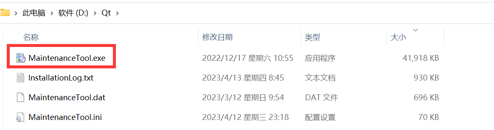
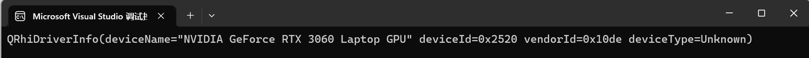

# 图形API基础

## 基础概念

现代图形API对于初学者而言，一开始存在很多莫名其妙的结构，不用过度担心，这些名词只不过是给一些特定结构和流程一个能够称呼的简短昵称，当你了解它的应用场景和熟悉它的使用流程，自然会明白它们的意义。

### 物理设备（Physical Device）

在图形API中，我们一般称 GPU 为 **物理设备**

随着GPU的快速发展，图形API的功能特性也在与日俱增，为了让图形API的使用能够向下兼容GPU设备，图形API往往会提供一些接口来查询物理设备是否支持某些特性以及资源的限制。

以Vulkan为例，使用 **VkPhysicalDeviceFeatures** 可以查询物理设备是否支持某种特性：

```c++
struct VkPhysicalDeviceFeatures {
    VkBool32    robustBufferAccess;
    VkBool32    fullDrawIndexUint32;
    VkBool32    imageCubeArray;
    VkBool32    independentBlend;
    VkBool32    geometryShader;
    VkBool32    tessellationShader;
    VkBool32    sampleRateShading;
    VkBool32    dualSrcBlend;
    VkBool32    logicOp;
    VkBool32    multiDrawIndirect;
    VkBool32    drawIndirectFirstInstance;
    VkBool32    depthClamp;
    VkBool32    depthBiasClamp;
    VkBool32    fillModeNonSolid;
    VkBool32    depthBounds;
    VkBool32    wideLines;
    //...
}
```

使用 **VkPhysicalDeviceLimits** 可以查询物理设备的资源限制：

``` c++
struct VkPhysicalDeviceLimits {
    uint32_t              maxImageDimension1D;
    uint32_t              maxImageDimension2D;
    uint32_t              maxImageDimension3D;
    uint32_t              maxImageDimensionCube;
    uint32_t              maxImageArrayLayers;
    uint32_t              maxTexelBufferElements;
    uint32_t              maxUniformBufferRange;
    uint32_t              maxStorageBufferRange;
    uint32_t              maxPushConstantsSize;
    uint32_t              maxMemoryAllocationCount;
    //...
}
```

开发者在使用图形API时，需要知道这些限制的存在，并且在使用时除了找出符合自己功能要求的物理设备，还需要在开发时为某些设备特性不支持的用户做一些逻辑上的兼容性处理。

### 逻辑设备（Device）

逻辑设备是开发者与物理设备沟通的 **“代理商”**

因为CPU和GPU是各自执行互不等待的，为了减轻它们之间通信的负担，让开发者不要因为一点点鸡毛蒜皮的事情就追着GPU大喊：“好家伙，这个活你不给我整完你还想跑？”

现代图形API中就提供了 逻辑设备 这一个概念，让开发者有什么事情跟代理商去说，代理商攒够一堆事情之后，再统一去告诉物理设备去执行。

> 在创建逻辑设备时，需要指定开启物理设备的哪些扩展。

### 指令缓冲（Command Buffer）

指令缓冲也叫 Command List ，它是 开发者 的 **"小纸条"**

开发者除了把一些货物交给 代理商（逻辑设备），还会把一些需要做的事情都记录到一张小纸条上，交给 代理商 转达给 物理设备。

> 在QRhi中，不能直接创建CommandBuffer，它的途径有两种：
>
> - 通过 SwapChain 可以拿到当前的 CommandBuffer
> - `rhi->beginOffscreenFrame` 会创建一个新的 CommandBuffer
>
> **QRhiCommandBuffer** 支持如下指令：
>
> 

### 设备队列（Device Queue）

设备队列是 代理商（逻辑设备）和 物理设备 沟通的唯一 **”桥梁“**

当 代理商 拿到 开发者 送来的 货物 和 小纸条，会快马加鞭地跨越桥梁， 赶向 物理设备

### 同步（Synchronization）

GPU 为什么这么强，是因为它手底下有一群小弟，试想这样一个情景：

> 一天，GPU 老大 收到 代理商 送过来的 小纸条 ，立马召集小弟，开始吩咐
>
> ：”唔~，这第一条，把翻斗大街的小广告都撕掉，张三，你去！“
>
>  ”收到！“，说完张三就立马向着翻斗大街扬长而去。 
>
> ：”这第二条是~，把翻斗大街都贴满开发者的小广告，李四，你来！“ 
>
> “得令！”，说完李四就骑上它心爱的小摩托，往翻斗大街飞驰而去。
>
> 翌日，开发者带着一群小弟过来，找GPU老大，质问小广告怎么都没贴上，眼看就要掀桌子了。
>
> GPU 老大 拿出 小纸条一对，没毛病呀，一问，张三也撕了，李四也贴了，再一问，卧槽，李四去早了，他先贴的小广告，后面全被张三给撕了。
>
> 回顾一下，开发者因为没有做明确的说明，GPU老大的理解也不够正确，从而做了错误的安排，导致了这次事故的发生。

在GPU中，由于很多工作都是并行的，这也意味着可能会出现，某些操作按顺序启动，乱序执行的情况。

还有就是，CPU和GPU是互不等待的，但有些情况下，我们又想要能够等待某些操作执行结束或者事件触发。

为此，现代图形API就提供了一些结构来控制CPU，GPU，指令，队列之间的同步，以Vulkan为例，它就提供了几种用于控制同步的结构：

- 栅栏（Fence）
- 信号量（semaphore）
- 屏障（Barrier）
- 事件（Event）

关于它们的细节，可以阅读：

- [vulkan中的同步和缓存控制之一，fence和semaphore](https://zhuanlan.zhihu.com/p/24817959)
- [vulkan中的同步和缓存控制之二，barrier和event](https://zhuanlan.zhihu.com/p/80692115)
- [理解Vulkan同步(Synchronization)](https://zhuanlan.zhihu.com/p/625089024)

### 窗口表面(Window Surface)

为了将渲染结果呈现到屏幕上，开发者往往还需要创建图形API与窗体系统之间的连接，在Vulkan中，可以通过为对应平台上的窗口创建 **窗口表面（Window Surface）** 来作为图形API与窗体系统交互的桥梁。

由于各个操作系统（Windows，Linux，Mac...）的窗口系统并不一致，所以Window Surface的创建有一些特定于平台的配置。

一些开源库致力于避开这些繁琐的配置，就比如 [GLFW](https://github.com/glfw/glfw)

> **GLFW** 是用于 OpenGL、OpenGL ES 和 Vulkan 应用程序开发的开源、多平台库。
>
> 它提供了一个简单轻量的、独立于平台的 API，用于创建窗口、上下文和表面、读取输入、处理事件等。

GUI 框架也大多提供了 Window Surface 的管理，我们要做的就是翻阅文档，深入源码。

### 交换链（[SwapChain](https://en.wikipedia.org/wiki/Swap_chain)）

在前两节中，我们已经通过控制台程序阐述了交换链的作用，它能有效的避免窗口绘制的闪烁和撕裂。



> https://mkblog.co.kr/vulkan-tutorial-10-create-swap-chain/

### 流水线（Pipeline）

流水线也叫做管线，它是在GPU上执行的任务流程，在现代计算机图形API中，常见的管线有三类：

- 图形渲染管线（[Graphics Pipeline](https://en.wikipedia.org/wiki/Graphics_pipeline)）：用于在 **渲染目标（RenderTarget）** 上绘制图像
- 计算管线（[Compute Pipeline](https://en.wikipedia.org/wiki/Pipeline_(computing))）：用于处理 **缓冲区（Buffer）** 或者 **图像（Image）** 中的数据
- 光线追踪管线（[Ray Tracing Pipeline](https://www.khronos.org/blog/ray-tracing-in-vulkan#blog_Ray_Tracing_Pipelines)）：用于光线追踪流程

上一节中我们通过控制台程序以及简单的了解了一下图形渲染管线，这里有一个更完整的流程图：



> https://graphicscompendium.com/intro/01-graphics-pipeline

它的工作流程中可以简单当作是：

- 开发者将顶点数据上传到GPU中
- 每个顶点的数据都会被 **顶点着色器（Vertex Shader）** 处理 
- （如果有）再经过 **镶嵌控制着色器（Tessellation Control Shader）** ， **镶嵌评估着色（Tessellation Evaluation Shader）** ， **几何着色器（Geometry Shader）** 处理后，成功组装好三角形数据。
- 之后 光栅化引擎 会将 三角形数据 映射（光栅化） 得到一个个 **片段（Frament）**
- 每个片段的数据都会被 **片段着色器（Fragment Shader）** 处理
- 经由 **测试与混合阶段** 处理重叠片段
- 得到对应坐标像素的唯一值，将之绘制到 **渲染目标（RenderTarget）** 上

### 着色器（[Shader](https://en.wikipedia.org/wiki/Shader)）

着色器是一种运行在GPU上的微小程序，它们主要用于扩展管线的功能，比如上面的图形渲染管线中：

- 输入的顶点数组被 **顶点着色器（Vertex Shader）** 进行处理
- 光栅化之后，每个像素又被 **片段着色器（Fragment Shader ）** 处理

一条图形渲染管线要求至少有一个顶点着色器和片段着色器，但实际上，现代图形API还支持额外的着色器扩展：

- **镶嵌控制着色器（Tessellation Control Shader）** 
- **镶嵌评估着色器（Tessellation Evaluation Shader）** 
- **几何着色器（Geometry Shader）**
- **计算着色器（Compute Shader）**

它们使用其API特有的 **Shader Language** 进行编写，比如：

- [GLSL](https://en.wikipedia.org/wiki/OpenGL_Shading_Language)：用于OpenGL、Vulkan
- [HLSL](https://en.wikipedia.org/wiki/High-Level_Shader_Language)：用于Direct3D
- [MSL](https://en.wikipedia.org/wiki/Metal_(API))：用于Metal

现代图形引擎的通用RHI中，由于要支持多种图形API，它们往往会使用上面的一种着色器语言进行开发，再转译成其他API的着色器代码。

> 在QRhi中，使用Vulkan风格的GLSL进行开发，Qt会通过glslang将GLSL编译为 [SPIR-V](https://zhuanlan.zhihu.com/p/497460602) 格式的着色器代码，再使用开源库 [SPIRV-Cross](https://github.com/KhronosGroup/SPIRV-Cross) 将之转译为各个API下的着色器代码，流程如下：
>
> 
>
> QRhi使用Vulkan风格的GLSL，因此这个文档是非常重要的：
>
> - https://registry.khronos.org/OpenGL/specs/gl/GLSLangSpec.4.60.html

### 缓冲区（Buffer）

这里的Buffer，并不只是指GPU上的一段内存（Memory）

确切的说，一个Buffer不仅持有一段内存，还包含了自身的 **类型（Type）** 和  **用途（Usage）** 

在 **类型（Type）** 上，图形API一般将其划分为：

- **Host Local Memory** ：只对Host可见的内存，通常称之为普通内存
- **Device Local Memory** ：只对Device可见的内存，通常称之为显存
- **Host Local Device Memory** ：由Host管理的，对Device看见的内存
- **Device Local Host Memory** ：由Device管理的，对Host可见的内存

> Host 往往是 CPU端， Device 指 GPU 端

关于细节，请查阅：

- [Vulkan 内存管理](https://zhuanlan.zhihu.com/p/166387973)

使用合适的内存类型能大幅提升内存的读写效率，在现代图形引擎中的流水线中，会尽可能地使用 **Device Memory** ，当我们要从CPU中提交数据给它时，由于Host无法访问，一般会将数据上传到一个 **Host可见的Memroy** 上，再通过指令拷贝到对应的 **Device Memory** 上，我们一般称这个持有主机可见内存的Buffer为 [Staging Buffer](https://vulkan-tutorial.com/Vertex_buffers/Staging_buffer)

> QRhi对这些类型进行了进一步包装，通过从使用意图上进行分类：
>
> - **Immutable** ：用于存放希望永远不会发生改变的数据，具有非常高效的GPU读写性能，它通常放置在 **Devices Local** 的 GPU 内存上，无法被CPU直接读写，但QRhi却支持它的上传，其原理是：每次上传数据新建一个 **Host Local** 的 **Staging Buffer** 作为中转来上传新数据，这样操作的代价是非常高昂的。
> - **Static** ：同样存储在 **Devices Local** 的 GPU 内存上，与 Immutable 不同的是，首次上传数据创建的 **Staging Buffer** 会一直保留。
> - **Dynamic** ：用于存放频繁发生变化的数据，它放置 **Host Local** 的GPU内存中，为了不拖延图形渲染管线，它通常会使用双缓冲机制。

在 **用途（Usage）** 上，通常可具备以下 **标识（Flag）** ：

- **VertexBuffer** ：用于存放顶点数据
- **IndexBuffer** ：用于存放索引数据
- **UniformBuffer** ：用于存储常量数据
- **StorageBuffer** ：用于Compute管线中的数据计算
- **IndirectDrawBuffer** ：用于间接渲染提供渲染参数

### 纹理（[Texture](https://en.wikipedia.org/wiki/Image_texture)）和采样器（Sampler）

纹理持有一段具有像素结构的内存（Memory），它可以作为图形渲染管线的输入，或者RenderTarget的附件。

采样器用于定义纹理的才有规则，常见的规则有：

- 在UV值超出值域[0,1]时，使用何种方式处理越界采样：


- 在精度过高或过低时，使用何种方式对纹理进行采用：


> 这里分别对应QRhi中的 **QRhiTexture** 和 **QRhiSampler**
>
> ``` c++
> /*创建带有一个颜色附件的RT*/
> QSharedPointer<QRhiTexture> colorAttachment;
> colorAttachment.reset(rhi->newTexture(QRhiTexture::RGBA32F, QSize(800, 600), 1, QRhiTexture::RenderTarget | QRhiTexture::UsedAsTransferSource));
> colorAttachment->create();
> QSharedPointer<QRhiTextureRenderTarget> renderTarget;
> QSharedPointer<QRhiRenderPassDescriptor> renderPassDesc;
> renderTarget.reset(rhi->newTextureRenderTarget({ colorAttachment.get() }));
> renderPassDesc.reset(renderTarget->newCompatibleRenderPassDescriptor());
> renderTarget->setRenderPassDescriptor(renderPassDesc.get());
> renderTarget->create();
> ```
>

### 描述符（Descriptor）

上面图形渲染管线中说到，每个顶点都会被顶点着色器处理，每个片段都会被片段着色器处理，`每个` 英语译作 `Per` ，在流水线中，除了这类 `Per` 数据，往往还有相同 着色器之间 公共的，共享的 数据，这类数据，在图形API中，我们一般称作 Uniform 数据，它可以当作是着色器的公共输入。

在创建流水线结构的时候，就需要使用描述符（Descriptor）来描述Uniform数据的基本结构信息，常见的描述符类型有：

- **UniformBuffer** ：着色器只读的Buffer输入
- **Sampler** ：着色器只读的纹理采样输入
- **StorageBuffer** ：着色器可读可写的Buffer，在计算管线中使用
- **StorageImage** ：着色器可读可写的Image，在计算管线中使用

> 这里对应QRhi的 **QRhiShaderResourceBinding** ：
>
> 

### 描述符集布局绑定（DescriptorSetLayoutBinding）

一个着色器往往不会只有一种类型的Uniform输入，描述符集布局绑定（DescriptorSetLayoutBinding）是一个描述符的集合，它定义了着色器上的Uniform结构布局，图形API在创建流水线之后，流水线的绝大部分参数都无法改变，而描述符集布局绑定，是可以在不重建流水线的前提下，动态去替换的。

> 这里对应QRhi的 **QRhiShaderResourceBindings** ，它的创建方式非常简单：
>
> ``` elm
> mShaderBindings.reset(mRhi->newShaderResourceBindings());
> mShaderBindings->setBindings({
> 		QRhiShaderResourceBinding::bufferLoadStore(0,QRhiShaderResourceBinding::ComputeStage,mStorageBuffer.get()),
> 		QRhiShaderResourceBinding::imageLoadStore(1,QRhiShaderResourceBinding::ComputeStage,mTexture.get(),0),
> });
> mShaderBindings->create();
> ```

### 渲染目标（[RenderTarget](https://en.wikipedia.org/wiki/Render_Target)）

它等价于OpenGL中的 [Frame Buffer Object](https://en.wikipedia.org/wiki/Framebuffer_object)，它由一个或多个 **颜色附件(Color Attachment)** 组成，可能包含深度附件和模板附件。

![Esquema representando a estrutura de um Frame Buffer Object [Green 2005]  ](Resources/Figura-5-Esquema-representando-a-estrutura-de-um-Frame-Buffer-Object-Green-2005.png)

通常，我们的绘制其实是在RenderTarget上填充颜色数据，对于深度和模板的数据，GPU会自动进行处理，我们只需要去配置一些处理规则。

> 它对应QRhi中的 **QRhiRenderTarget** ，使用QRhi创建一个RenderTarget是一件非常容易的事情：
>
> ``` c++
> /*创建带有一个颜色附件的RT*/
> QSharedPointer<QRhiTexture> colorAttachment;
> colorAttachment.reset(rhi->newTexture(QRhiTexture::RGBA32F, QSize(800, 600), 1, QRhiTexture::RenderTarget | QRhiTexture::UsedAsTransferSource));
> colorAttachment->create();
> QSharedPointer<QRhiTextureRenderTarget> renderTarget;
> QSharedPointer<QRhiRenderPassDescriptor> renderPassDesc;
> renderTarget.reset(rhi->newTextureRenderTarget({ colorAttachment.get() }));
> renderPassDesc.reset(renderTarget->newCompatibleRenderPassDescriptor());
> renderTarget->setRenderPassDescriptor(renderPassDesc.get());
> renderTarget->create();
> ```

### 渲染通道（RenderPass）

RenderPass可以当作是一次或多次Pipeline的执行过程

在游戏和影视作品中，为朴素的图形增加一些后期效果，能极大程度的提升画面的艺术感，而在图形渲染管线中，Pass可以当作是一帧图像（RenderTarget）的绘制。

在游戏引擎中，绘制朴素几何物体的Pass我们一般称为 **BasePass**

下面的 **FrameGraph** 展示了如何使用多个Pass来实现[Bloom](https://en.wikipedia.org/wiki/Bloom_(shader_effect))的效果


### 渲染通道描述符（RenderPassDescriptor ）

RenderPassDescriptor用于规定何种格式的RenderTarget符合该RenderPass的使用，在Vulkan中，它的创建极其繁琐。在QRhi，只需要使用：

``` c++
class QRhiTextureRenderTarget : public QRhiRenderTarget
{
    virtual QRhiRenderPassDescriptor* newCompatibleRenderPassDescriptor() = 0;
};
```

## QRhi

如果你是一名初学者，看了上面的基础概念，可能这个时候脑袋瓜已经嗡嗡的了，不过放心，在你上手代码之后，这些概念都是纸老虎，在本大章的接下来的内容中，将系统地阐述图形API基础的结构和使用方式。

首先，你需要Qt，可以在这个 镜像源 下载Qt的在线下载器：

- http://mirrors.ustc.edu.cn/qtproject/official_releases/online_installers/

如果你已经有Qt了，可以在Qt的安装目录找到它的维护工具，它用于更新和卸载Qt的组件



请确保至少安装以下Qt组件：

- **6.0以上版本的Qt库** （当前最新 `6.6.0`）
  - **MSVC编译套件** （当前最新 `2019 64-bit` ) 或 **MinGW编译套件** （当前最新 `11.2.0 64- bit`）：如果IDE是Visual Studio，则需要下载MSVC。
  - **Sources** ：Qt的源码
  - **Qt 5 Compatibility Module** ：Qt5的兼容模块
  - **Qt Shader Tools** ：Qt的着色器编译工具
  - **Additional Libraries** ：Qt的扩展库
    - **Qt Multimedia** ：Qt的多媒体模块，里面有音视频编解码的功能封装
  - **Qt Debug Information Files（可选）** ：用于MSVC下调试Qt的源码，有十几G，比较大

- **Developer and Designer Tools**
  - **Debugging Tools for Windows** ：用于MSVC下的调试。
  - **CMake** （当前最新 `3.24.2`）

此外，还需要安装 [Vulkan SDK](https://www.lunarg.com/vulkan-sdk/)

你可以通过一个小工程来验证环境是否正常：

- 新建一个`CMakeLists.txt`和`main.cpp`

- 在`CMakeLists.txt`中创建一个`Target`并链接Qt的模块：

``` cmake
cmake_minimum_required(VERSION 3.12)

project(FirstRhiWindowProj)

add_executable(FirstRhiWindow main.cpp)

find_package(Qt6 COMPONENTS Core Widgets Gui REQUIRED)     

target_link_libraries(FirstRhiWindow                        
    PRIVATE 
        Qt6::Core  
        Qt6::Widgets
        Qt6::Gui
        Qt6::GuiPrivate        	//qrhi是GUI的私有模块       
)
```

- 在`main.cpp`中填入以下代码：

```C++
#include <private/qrhi_p.h>
#include <private/qrhid3d11_p.h>

int main(int argc, char** argv) {
	QRhiD3D11InitParams params;
	QRhi::Flags flags;
	QSharedPointer<QRhi> rhi(QRhi::create(QRhi::D3D11, &params, flags));
	qDebug() << rhi->driverInfo();		//打印显卡设备信息
	return 0;
}
```

- 使用cmake编译执行，执行成功你能看到控制台窗口打印了显卡信息:

  

### QRhiWindow

操作系统提供的窗口有非常细粒度的控制，在开发者想要调整窗口的某个效果时，可能会需要改变窗口的多个属性和事件，当大量的效果堆叠设置的时候，就很比较容易出现冲突。打个比方：

> 假如 **A** 效果需要开启属性`a`和`b`， **B** 效果需要开启属性`b`和`c`，如果窗口开启了效果 **A** 和 **B** （即开启属性`a`、`b`、`c`），之后如果想要关闭效果 **B** ，如果不稍加验证，直接关闭了与之关联的属性`b`和`c`，那么开启的属性只剩下`a`，效果 **A** 的显示就会出现问题。

开发者往往只希望关注窗口的表现效果，而不是操作系统级别的窗口属性和事件，所以在窗口管理中，效果间的设置就存在了大量属性和事件的重叠

如果给每个属性的设置都加一遍关联验证，会使得代码变得很臃肿，且难以维护，也更容易出Bug

因此Qt采用了状态机的方式来跟管理原生窗口：

- 在Qt层面对Window的各种设置并没有立即生效，而是将这些设置存储起来，等到特定时机，比如说Show，Qt才会根据当前上下文的配置来创建实际的操作系统窗口

换而言之，对于Qt的窗口，只有在调用了show函数之后，才实际创建了Window，才能拿到它的窗口句柄。

> 在程序开发过程中，经常可以接触到这类代码，它能很好地组织复杂的代码逻辑，尤其是在图形相关的工程代码中，经常能看到以`ensure`开头的函数，而它所做的工作，就是根据当前属性上下文来进行某些操作。

而我们如果要创建窗口的图形渲染结构，由于需要实际的窗口句柄，也必须在show之后进行初始化，不过好在Qt提供了相关的事件 ：

- [void QWindow:: exposeEvent (QExposeEvent* ev )](https://doc.qt.io/qt-6/qwindow.html#exposeEvent)
  - 当窗口从 `un-exposed` 切换到 `exposed` 状态时，会执行此事件
  - 在第一次显示窗口时，会在此事件之前执行resizeEvent

> 需要注意的是，对于一个窗口而言，exposeEvent会多次执行，但初始化只需要进行一次，因此需要增加一些逻辑验证。

而图形渲染结构主要指的是：

- `QScopedPointer<QRhiEx> mRhi`
- `QScopedPointer<QRhiSwapChain> mSwapChain`：交换链
- `QScopedPointer<QRhiRenderBuffer> mDSBuffer`：深度模板缓冲区
- `QScopedPointer<QRhiRenderPassDescriptor> mSwapChainPassDesc`：交换链的RenderPass描述符

成功初始化之后，我们只需要在窗口上增加渲染和Resize的逻辑即可，这里有一个标准的Window实现示例：

- https://github.com/qt/qtbase/blob/dev/tests/manual/rhi/shared/examplefw.h

还需要注意的是，使用QRhi创建的资源，必须在QRhi销毁之间进行清理，使用智能指针可以很好的管理这些资源的生命周期。

### QRhiWidget

Widget与Window最大的不同是：

- Widget通过某些事件来触发界面的重绘，而Window则是每帧都在重绘

使用Widget能更好的节约性能，避免不必要的刷新，但在游戏和图形这种需要实时刷新的界面时，使用Window能更好地分摊绘制性能。

这里有一个标准的Widget实现：

- https://github.com/qt/qtbase/tree/dev/tests/manual/rhi/rhiwidget

### 文章示例

你可以该仓库下找到该系列文章的所有文档和代码：

- https://github.com/Italink/ModernGraphicsEngineGuide

可以参考如下视频进行构建：

- https://www.bilibili.com/video/BV1VP41127UM

它里面包含很多有意思的示例，如果你不想进行构建，这里有一个编译好的可执行文件包：

- https://github.com/Italink/ModernGraphicsEngineGuide/releases/download/v1.0.0/Release.zip

#### QEngineUtilities

为了能够简化一些结构的使用，笔者把一些通用的结构封装到了[QEngineUtilities](https://github.com/Italink/QEngineUtilities/)中，它包含三个构建目标：

- **QEngineCore** ：渲染架构，包含RHI、FrameGraph、RenderPass、RenderComponent、Asset的简易封装。
- **QEngineEditor** ：编辑器套件，包含了许多基础属性调整控件，比如：数值调节器，调色器，通知气泡，基于QObject的DetailView，GLSL代码编辑器等。
- **QEngineUtilities** ：Lanuch层，在不同构建配置下对上面两个模块进行组装，例如在`DebugEditor`配置下，会嵌入编辑器界面，而在`Debug`配置下，就只有Core模块。

你可以把这个仓库Pull下来：

- 在自己工程的CMakeLists.txt中使用[add_subdirectory](https://cmake.org/cmake/help/latest/command/add_subdirectory.html) 添加 **QEngineUtilities**
- 并且给自己的`Target` 链接 **QEngineUtilities**

它主要用于教学和尝试：

- 强调可读性是第一要素
- 没有细致地追求性能（代码细节上有一些瑕疵，在笔者察觉到的时候已经太晚了，由于精力有限，目前笔者也只能选择妥协，非常抱歉...不过放心，这些影响微乎其微）
- 以渲染为核心，包含少量编辑器架构，不会引入一些会导致代码膨胀的模块，如资产管理，网络，异步，ECS...

如果成功，你可以使用如下代码来创建Widget和Window：

``` c++
#include <QApplication>
#include "Render/RHI/QRhiWidget.h"
#include "Render/RHI/QRhiWindow.h"

class ExampleRhiWindow : public QRhiWindow {
public:
	ExampleRhiWindow(QRhiWindow::InitParams inInitParams) :QRhiWindow(inInitParams) {}
protected:
	virtual void onRenderTick() override {
		QRhiRenderTarget* renderTarget = mSwapChain->currentFrameRenderTarget();
		QRhiCommandBuffer* cmdBuffer = mSwapChain->currentFrameCommandBuffer();

		const QColor clearColor = QColor::fromRgbF(0.0f, 0.0f, 1.0f, 1.0f);			//使用蓝色清屏
		const QRhiDepthStencilClearValue dsClearValue = { 1.0f,0 };

		cmdBuffer->beginPass(renderTarget, clearColor, dsClearValue);
		cmdBuffer->endPass();
	}
};

class ExampleRhiWidget : public QRhiWidget {
public:
	ExampleRhiWidget() {
		setDebugLayer(true);		//开启验证层
	}
	void render(QRhiCommandBuffer* inCmdBuffer) override {
		const QColor clearColor = QColor::fromRgbF(1.0f, 0.0f, 0.0f, 1.0f);			//使用红色清屏
		const QRhiDepthStencilClearValue dsClearValue = { 1.0f,0 };
		inCmdBuffer->beginPass(mRenderTarget.data(), clearColor, dsClearValue);
		inCmdBuffer->endPass();
	}
};

int main(int argc, char **argv){
    QApplication app(argc, argv);

    QRhiWindow::InitParams initParams;
    ExampleRhiWindow window(initParams);
	window.setTitle("01-RhiWindow");
	window.resize({ 400,400 });
	window.show();

	ExampleRhiWidget widget;
	widget.setWindowTitle("01-RhiWidget");
	widget.setApi(QRhiWidget::Vulkan);
	widget.resize({ 400,400 });
	widget.show();

    return app.exec();
}
```

运行它可以看到：


如果遇到困难，可以参考 [ModernGraphicsEngineGuide](https://github.com/Italink/ModernGraphicsEngineGuide/tree/main/Source/1-GraphicsAPI) 中的 **01-WindowAndWidget** 项目，也可以在[此处](https://github.com/Italink/ModernGraphicsEngineGuide/issues)提问

下一章节，我们开始整活~
