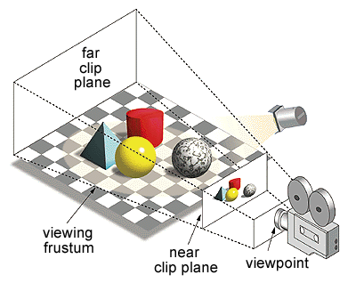
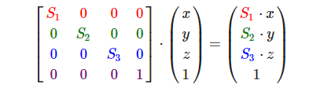
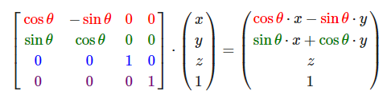
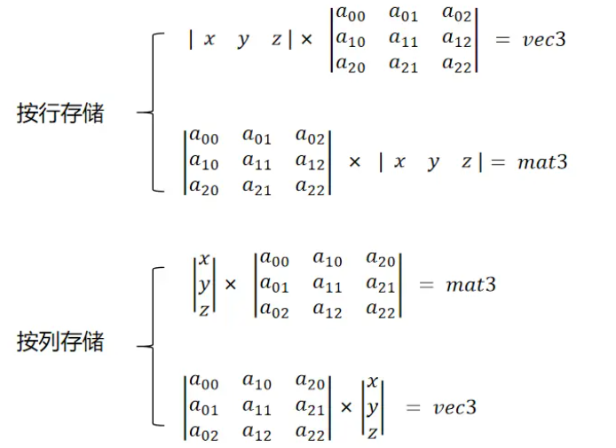
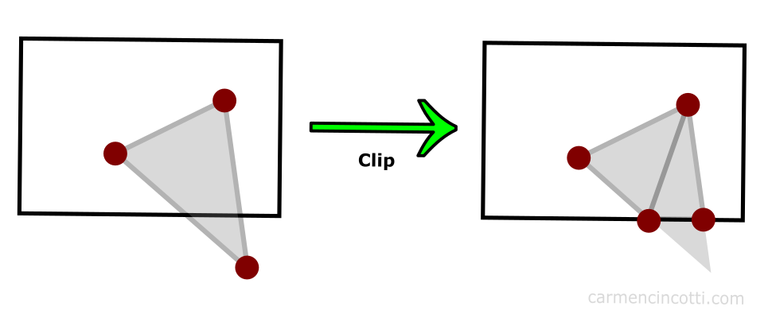
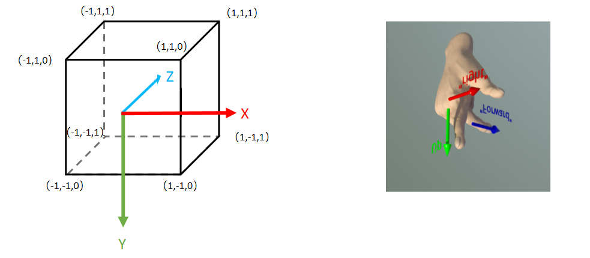

# 三维空间

## 3D变换

现代计算机的图形显示器都是在显示二维的图像，事实上，投影在人体视网膜表面的图像也是二维的，那为什么人体能从二维的图像上感受到距离感和空间感呢？

这是因为我们的大脑往往能捕获图像上的一些细节，从而重建三维空间的信息，就比如：

- 近大远小的空间透视感

  

- 光影产生的立体感

  

除了单帧图像所携带的信息，人眼还会根据图像的运动情况来还原空间的信息，就比如运动视差：


当然，还有一些其他因素，这里暂不展开讨论，感兴趣的小伙伴可以查阅：

- Wiki Depth Perception：https://en.wikipedia.org/wiki/Depth_perception

计算机的成像过程如下：



我们可以简单看作是，把3D空间的物体，拍扁贴到`近平面（Near Plane）`上

在理论层面，3D空间中的物体在计算机中不过是一堆数据，贴到 近平面 的图像又是另一堆数据，而我们要做的，无非是将一堆数据转换成另一堆数据

回顾一下我们初高中在学校所学习过的知识，思考以下场景：

- 将 一个三角形 水平平移 5 个单位，你会怎么做？
  - 很简单，三角形的所有顶点坐标的X值 `加5` 就行

- 将 一个三角形 绕坐标原点旋转180度，怎么处理？
  - 可以把三角形坐标从直角（笛卡尔）坐标系转换为极坐标系，角度 `增加180度` ，再转换回直接坐标系，就能得到转换后的顶点
- 将 一个三角形 放大到原先的两倍，该这么办？
  - 所有顶点的坐标值都 `乘2` 就行了

上述的几种情况包含了图形数据的大部分处理方式，你应该也能发现它们的处理流程都是固定模板的，在计算机中，固定模板的执行流程就意味着可以在硬件级别做大量优化。

所有我们可以再想想，能不能上面的流程能不能再简化一下？使用一个模板就能执行所有可能的操作，这样计算机就能针对这一模板，进行极致的优化。

答案肯定是有的，而这套模板就建立在 [线性代数](https://baike.baidu.com/item/%E7%BA%BF%E6%80%A7%E4%BB%A3%E6%95%B0) 的体系之上

对于一个三维坐标`(X,Y,Z)`，如果我们想让它平移`(Tx,Ty,Tz)`个单位，会给该坐标补上一个[齐次坐标（Homogeneous_Coordinates）](https://en.wikipedia.org/wiki/Homogeneous_coordinates)，然后乘上一个 **平移矩阵(Translation Matrix)** ：


如果想让它在不同坐标分量上，缩放`(S1,S2,S3)`个大小，会给它乘上一个 **缩放矩阵（Scale Matrix）** ：



如果想绕它绕X轴旋转θ角度，会给它乘上一个 **旋转矩阵（Rotate Matrix）** ：


如果是Y轴：


Z轴：



在C++中，大多数数学库都提供了向量和矩阵的各类便捷函数，在Qt中，就提供了以下数据结构：

- [QVector2D](https://doc.qt.io/qt-6/qvector2d.html)
- [QVector3D](https://doc.qt.io/qt-6/qvector3d.html)
- [QVector4D](https://doc.qt.io/qt-6/qvector4d.html)
- [QMatrix4x4](https://doc.qt.io/qt-6/qmatrix4x4.html)

比如这样的代码：

``` c++
QVector4D pos(1, 1, 1, 1);

QMatrix4x4 model;
model.translate(QVector3D(1,0,0));
model.scale(0.5);
model.rotate(180, QVector3D(1, 0, 0));

QVector4D result = model * pos;
```

代表的意义是：

- 使用`model矩阵`先让`pos向量`绕X轴旋转180度，再将其缩放到原先的0.5倍，最后向X轴平移1个单位

由于Qt中的向量使用的是 **按列存储** ，所以我们需要通过 **左乘** 的方式来处理变换，所以整个过程看起来像是反了一样

还记得矩阵的乘法口诀吗？—— **前行乘后列**

根据这一特性，我们实际想要的是：一个`向量`乘以一个`矩阵`，得到的是一个变换后的`向量`

下图从 乘法计算 结果 的 类型 说明了为什么对于 **按列存储的向量需要使用左乘** ：



虽然说对3D空间的变换是通过矩阵进行的，但如果把所有变换都糅合到一个矩阵里面，就回导致变换的二次处理加工变得非常困难。

因此，现代图形学中，3D空间的变换还划分为几个阶段，这几个阶段有着不同的处理职责：


- 图形原先所处的空间，我们称作 **局部空间（Local Space）** ，我们可以通过 **模型矩阵（Model Matrix）** 将它的坐标转换到 **世界空间（World Space）** ， **模型矩阵的职责是处理物体的平移，旋转，缩放** 。
- 通过 **视图矩阵（View Matrix）** ， 我们可以将 **世界坐标（World Coordinate）** 转换到 **视图空间（View Space）** 中的坐标， **视图矩阵的职责是确立视点所在的位置和视野的朝向**
- 再通过 **投影矩阵（Projection Matrix）** ，可以将 **观察坐标（View Coordinate）** 转换到 **裁剪空间（Clip Space）** 中的坐标， **投影矩阵的职责是把视图空间的区域投影到标准设备坐标系（NDC）中**
- **裁剪坐标（Clip Coordinate）** 经由 **视口变换(Viewport Transform)** 最终变换到 **屏幕空间（Screen Space）** 中

在Qt中，我们可能会使用如下代码在CPU侧处理这些变换：

``` c++
QMatrix4x4 corrMatrix = mRhi->clipSpaceCorrMatrix();  //裁剪空间矫正矩阵

QMatrix4x4 project ;
// 设置Fov为90度，传入FrameBuffer的宽高比，设置近平面距离为0.01，远平面距离为1000
project.perspective(90.0, renderTarget->pixelSize().width() /(float) renderTarget->pixelSize().height(), 0.01, 1000);		

QMatrix4x4 view;
// 从位置(10,0,0) 看向 (0,0,0)，视线的上向量为竖直向上（Y轴正方向）
view.lookAt(QVector3D(10, 0, 0), QVector3D(0, 0, 0), QVector3D(0, 1, 0));

QMatrix4x4 model;
model.translate(QVector3D(1, 0, 0));
model.scale(0.5);
model.rotate(180, QVector3D(1, 0, 0));

UniformBlock ubo;
ubo.MVP = (corrMatrix * project * view * model).toGenericMatrix<4, 4>();
batch->updateDynamicBuffer(mUniformBuffer.get(), 0, sizeof(UniformBlock), &ubo);
```

在Shader中这样使用：

```c++
QShader vs = mRhi->newShaderFromCode(QShader::VertexStage, R"(#version 440
    layout(location = 0) in vec3 inPosition;
    layout(binding = 0) uniform UniformBlock{
        mat4 MVP;
    }UBO;
    out gl_PerVertex { vec4 gl_Position; };
    void main()
    {
        gl_Position = UBO.MVP * vec4(inPosition ,1.0f);
    }
)");
```

### 标准化设备坐标(Normalized Device Coordinates）

在前面的章节中，我们使用了这样的顶点数据：

``` c++
static float VertexData[] = {                                       //顶点数据
    //position(xy)      color(rgba)
     0.0f,  -0.5f,      1.0f, 0.0f, 0.0f, 1.0f,
    -0.5f,   0.5f,      0.0f, 1.0f, 0.0f, 1.0f,
     0.5f,   0.5f,      0.0f, 0.0f, 1.0f, 1.0f,
};
```

和顶点着色器：

```cpp
QShader vs = mRhi->newShaderFromCode(QShader::VertexStage, R"(#version 440
    layout(location = 0) in vec2 position;		//这里需要与上面的inputLayout 对应
    layout(location = 1) in vec4 color;

    layout (location = 0) out vec4 vColor;		//输出变量，这里的location是out的，而不是in

    out gl_PerVertex { 							//Vulkan GLSL中固定的定义
        vec4 gl_Position;						
    };

    void main(){
        gl_Position = vec4(position,0.0f,1.0f);	//根据输入的position，设置实际的顶点输出
        vColor = color;							//将输入的color传递给fragment shader
    }
)");
```

绘制出了一个三角形：


大家可能已经猜到了顶点位置里面 `0.0f`，-`0.5f`，`0.5f`所代表的意义，仿佛这些顶点坐标的取值范围是[-1,1]？这是因为图形API为了让坐标运算不受显示器分辨率的影响，都使用了 **标准化设备坐标(Normalized Device Coordinates, 简称NDC)** 的概念。

以OpenGL为例，它遵循右手坐标系：


任一轴向的取值范围为[-1,1]，就像这样：


任何落在范围外的 **顶点** 会按一些策略进行图元裁剪，而不会显示在屏幕上 ：



该过程详见：

- https://registry.khronos.org/vulkan/specs/1.3/html/chap24.html

Vulkan也使用右手坐标系，因为Vulkan声称是下一代的OpenGL，跟OpenGL一样怎么好意思叫Vulkan，它总要跟OpenGL有一些标新立异的点，因此， **Vulkan的Y轴是朝下的** ，为了跟其他现代图形API保持一致， **它的Z轴（深度) 取值范围变成了[0,1]** ，就是这个样子：



而 DirectX 和 Metal 又与它们不同， **DirectX 和 Metal的NDC使用的是左手坐标系，且深度值范围是[0,1]** ：


关于它们的差异和细节，详见：

- https://www.scratchapixel.com/lessons/mathematics-physics-for-computer-graphics/geometry/coordinate-systems.html

#### NDC差异解决方案

这些 图形API 标准坐标系的差异，无疑给RHI的封装增加了一些难题，各个引擎对此都有自己的解决方案。

在QRhi中，我们在使用时只需要顶点数据统一遵循OpenGL的NDC（即右手坐标系，任一轴向的取值范围为[0,1]）

通过`QRhi::clipSpaceCorrMatrix()` 可以获取到一个当前图形API的矫正矩阵，使用它对所有顶点都处理一遍可以将之转换到对应API的NDC空间。

该功能依赖于QRhi中的以下实现：

``` c++
QMatrix4x4 QRhiGles2::clipSpaceCorrMatrix() const
{
    return QMatrix4x4(); // identity
}

QMatrix4x4 QRhiVulkan::clipSpaceCorrMatrix() const
{
    // See https://matthewwellings.com/blog/the-new-vulkan-coordinate-system/

    static QMatrix4x4 m;
    if (m.isIdentity()) {
        // NB the ctor takes row-major
        m = QMatrix4x4(1.0f, 0.0f, 0.0f, 0.0f,
                       0.0f, -1.0f, 0.0f, 0.0f,
                       0.0f, 0.0f, 0.5f, 0.5f,
                       0.0f, 0.0f, 0.0f, 1.0f);
    }
    return m;
}

QMatrix4x4 QRhiD3D11::clipSpaceCorrMatrix() const
{
    // Like with Vulkan, but Y is already good.

    static QMatrix4x4 m;
    if (m.isIdentity()) {
        // NB the ctor takes row-major
        m = QMatrix4x4(1.0f, 0.0f, 0.0f, 0.0f,
                       0.0f, 1.0f, 0.0f, 0.0f,
                       0.0f, 0.0f, 0.5f, 0.5f,
                       0.0f, 0.0f, 0.0f, 1.0f);
    }
    return m;
}

QMatrix4x4 QRhiD3D12::clipSpaceCorrMatrix() const
{
    // Like with Vulkan, but Y is already good.

    static QMatrix4x4 m;
    if (m.isIdentity()) {
        // NB the ctor takes row-major
        m = QMatrix4x4(1.0f, 0.0f, 0.0f, 0.0f,
                       0.0f, 1.0f, 0.0f, 0.0f,
                       0.0f, 0.0f, 0.5f, 0.5f,
                       0.0f, 0.0f, 0.0f, 1.0f);
    }
    return m;
}

QMatrix4x4 QRhiMetal::clipSpaceCorrMatrix() const
{
    // depth range 0..1
    static QMatrix4x4 m;
    if (m.isIdentity()) {
        // NB the ctor takes row-major
        m = QMatrix4x4(1.0f, 0.0f, 0.0f, 0.0f,
                       0.0f, 1.0f, 0.0f, 0.0f,
                       0.0f, 0.0f, 0.5f, 0.5f,
                       0.0f, 0.0f, 0.0f, 1.0f);
    }
    return m;
}
```

对于一些二维的顶点，我们可以简单的翻转一下坐标的Y值，这也是上一节中纹理 [无属性渲染](https://link.zhihu.com/?target=https%3A//stackoverflow.com/questions/2588875/whats-the-best-way-to-draw-a-fullscreen-quad-in-opengl-3-2) ，为什么要用`Y_UP_IN_NDC`对顶点翻转的来由：

```c++
QShader vs = mRhi->newShaderFromCode(QShader::VertexStage, R"(#version 450
    layout (location = 0) out vec2 vUV;
    out gl_PerVertex{
        vec4 gl_Position;
    };
    void main() {
        vUV = vec2((gl_VertexIndex << 1) & 2, gl_VertexIndex & 2);      /
        gl_Position = vec4(vUV * 2.0f - 1.0f, 0.0f, 1.0f);
#if Y_UP_IN_NDC              //因为DX，GL与VK的NDC不一致，因此这里需要做一些兼容处理
	gl_Position.y = - gl_Position.y;
#endif 
    })"
    , QShaderDefinitions()   //该参数只是简单的在代码开头添加 #define Y_UP_IN_NDC 1        
    .addDefinition("Y_UP_IN_NDC", mRhi->isYUpInNDC())
);
```

### Frame Buffer 坐标 差异

此外，我们还需要注意图形API之间不仅仅有NDC的差异，FrameBuffer的坐标空间也有不同，由于[历史原因](https://gamedev.stackexchange.com/questions/83570/why-is-the-origin-in-computer-graphics-coordinates-at-the-top-left)，早期的计算机阴极射线管（CRT）从左上角到右上角绘制图像，所以在大多数传统图形API，通常 **以左上角为帧图像的坐标原点** ，OpenGL成立之初想要改变这一点，让坐标系的使用更符合人类的通识（即二维平面上，使用左下角作为坐标原点，Y轴朝上，X轴朝右），但可惜的是，已经有太多的框架已经适应并普遍遵循原先的规定，这反倒导致了我们在 **使用 OpenGL 的时候还需要对纹理进行上下翻转（Flip Y）** ，在现代图形API （DirectX、Metal、Vulkan）， 都已经向历史妥协，所以大家在使用时注意遵循 ”传统“：


### 示例

根据上面的一些描述，我们可以制作一些简单的小程序，比如一个随时间变换的立方体：


示例代码位于 [05-3D](https://github.com/Italink/ModernGraphicsEngineGuide/blob/main/Source/1-GraphicsAPI/05-3D/Source/main.cpp)

核心代码只是：

``` c++
QShader vs = mRhi->newShaderFromCode(QShader::VertexStage, R"(#version 440
    layout(location = 0) in vec3 inPosition;
    layout(binding = 0) uniform UniformBlock{
        mat4 MVP;
    }UBO;
    out gl_PerVertex { vec4 gl_Position; };
    void main()
    {
        gl_Position = UBO.MVP * vec4(inPosition ,1.0f);
    }
)");
Q_ASSERT(vs.isValid());
```

``` c++
QMatrix4x4 corrMatrix = mRhi->clipSpaceCorrMatrix();  //裁剪空间矫正矩阵

QMatrix4x4 project;
project.perspective(90.0, renderTarget->pixelSize().width() / (float)renderTarget->pixelSize().height(), 0.01, 1000);	// 设置Fov为90度，传入FrameBuffer的宽高比，设置近平面距离为0.01，远平面距离为1000

QMatrix4x4 view;
view.lookAt(QVector3D(10, 0, 0), QVector3D(0, 0, 0), QVector3D(0, 1, 0));		// 从位置(10,0,0) 看向 (0,0,0)，视线的上向量为竖直向上（Y轴正方向）

float time = QTime::currentTime().msecsSinceStartOfDay() / 1000.0f;			//获取当前时间的秒数（浮点类型）
float factor = qAbs(qSin(time));						//利用正弦函数让Y值随时间在[0,1]之间变化
QMatrix4x4 model;
model.translate(QVector3D(0, factor * 5, 0));			//随时间上下移动
model.scale(factor);									//随时间缩放
model.rotate(time * 180, QVector3D(1, 1, 1));			//随时间旋转

UniformBlock ubo;
ubo.MVP = (project * view * model).toGenericMatrix<4, 4>();
batch->updateDynamicBuffer(mUniformBuffer.get(), 0, sizeof(UniformBlock), &ubo);
```


### 建议与技巧

上述文章并不完备，这里还有一些相关参考：

- https://learnopengl-cn.github.io/01%20Getting%20started/08%20Coordinate%20Systems/

3D空间变换涉及到大量的线性代数运算，里面的一些概念和细节，很难用一篇文章去涵盖，这里笔者再次推荐读者一定要去阅读一下《3D数学基础 图形和游戏开发 （第2版）》的前十章内容，它里面涵盖了图形学所必须的极大部分基础知识，认真过一遍，保证你的知识体系里面没有盲区~

对于一个没有经历过透视变换的矩阵，它的平移，旋转，缩放参数是可提取的，在ImGuiZmo中有以下代码：

```c++
void DecomposeMatrixToComponents(const float* matrix, float* translation, float* rotation, float* scale)
{
  matrix_t mat = *(matrix_t*)matrix;

  scale[0] = mat.v.right.Length();
  scale[1] = mat.v.up.Length();
  scale[2] = mat.v.dir.Length();

  mat.OrthoNormalize();

  rotation[0] = RAD2DEG * atan2f(mat.m[1][2], mat.m[2][2]);
  rotation[1] = RAD2DEG * atan2f(-mat.m[0][2], sqrtf(mat.m[1][2] * mat.m[1][2] + mat.m[2][2] * mat.m[2][2]));
  rotation[2] = RAD2DEG * atan2f(mat.m[0][1], mat.m[0][0]);

  translation[0] = mat.v.position.x;
  translation[1] = mat.v.position.y;
  translation[2] = mat.v.position.z;
}
```

当我们想要实现一个始终面向相机公告牌效果时，可以将View矩阵中的Rotate信息给去掉，如果不希望随相机的距离缩放，可以把Scale信息也给去掉，或者说直接这样（伪代码）：
```glsl
mat4 Model,View,Projection;
vec3 position;

mat3 CorrMatrix = inverse(View);		//丢弃平移参数，求它的逆矩阵来矫正旋转和缩放
vec3 facingCameraPos = Projection * View * Model * (CorrMatrix * position, 1.0f);
```

## Camera

相信接触过3D场景的小伙伴大多知道 **摄像机（Camera）** 的概念，在很多3D游戏中都提供这样的操作：

- 使用 WASD 移动相机的位置，使用鼠标来控制视角的旋转

而 Camera 的本质其实是在提供上文所提到的 **视图矩阵（View Matrix）** 和 **投影矩阵（Projection Matrix）**

我们可以窗口系统的输入事件，来调整这些矩阵。

这里有笔者封装好的一个Camera类：

- https://github.com/Italink/QEngineUtilities/blob/main/Core/Src/Utils/QCamera.cpp

``` c++
class QCamera :public QObject {
	Q_OBJECT
    Q_PROPERTY(QVector3D Position READ getPosition WRITE setPosition)
    Q_PROPERTY(QVector3D Rotation READ getRotation WRITE setRotation)
    Q_PROPERTY(float FOV READ getFov WRITE setFov)
    Q_PROPERTY(float NearPlane READ getNearPlane WRITE setNearPlane)
    Q_PROPERTY(float FarPlane READ getFarPlane WRITE setFarPlane)
    Q_PROPERTY(float MoveSpeed READ getMoveSpeed WRITE setMoveSpeed)
    Q_PROPERTY(float RotationSpeed READ getRotationSpeed WRITE setRotationSpeed)
public:
	QCamera();

	void setupWindow(QWindow* window);

	float getYaw();
	float getPitch();
	float getRoll();

	void setYaw(float inVar);
	void setPitch(float inVar);
	void setRoll(float inVar);

	QVector3D getPosition();
	void setPosition(const QVector3D& newPosition);

	void setRotation(const QVector3D& newRotation);
	QVector3D getRotation();

	float getRotationSpeed() const { return mRotationSpeed; }
	void setRotationSpeed(float val) { mRotationSpeed = val; }

	float getMoveSpeed() const{ return mMoveSpeed; }
	void setMoveSpeed(float val) { mMoveSpeed = val; }
	float& getMoveSpeedRef() { return mMoveSpeed; }

	void setFov(float val);
	float getFov() { return mFov; }

	void setAspectRatio(float val);
	float getAspectRatio() { return mAspectRatio; }

	void setNearPlane(float val);
	float getNearPlane() { return mNearPlane; }

	void setFarPlane(float val);
	float getFarPlane() { return mFarPlane; }

	QMatrix4x4 getProjectionMatrixWithCorr(QRhiEx* inRhi);
	QMatrix4x4 getProjectionMatrix();
	QMatrix4x4 getViewMatrix();
};
```

要想使用它，只需使用创建一个QCamera，并调用`void QCamera::setupWindow(QWindow* window)` 就能将窗口的输入事件跟Camera进行绑定，之后我们可以通过以下函数来获取模型矩阵和投影矩阵：

```c++
QMatrix4x4 getProjectionMatrixWithCorr(QRhiEx* inRhi);  //获取带裁剪空间矫正的透视矩阵
QMatrix4x4 getProjectionMatrix();
QMatrix4x4 getViewMatrix();
```

如果你想封装自己的Camera类，这里有一个很好的文章：

- https://learnopengl-cn.github.io/01%20Getting%20started/09%20Camera/

### Mipmap

在上一节中 [缓冲区与纹理](https://zhuanlan.zhihu.com/p/630886324) 中，通过 **minFilter** 可以确定在图像被缩小显示时，使用何种策略来根据纹理坐标的 **邻近像素** 确定当前的像素值，使用线性（Linear）采样会根据像素周边四个的邻近像素来确定当前颜色，可是当图像的缩放比例非常大的时候，比如将一张图像的寸尺从`1000*1000`，缩放到`10*10`，使用Linear采样的时候，只会根据四个邻近像素点来确定颜色，明显会导致采样不足，出现 [摩尔纹](https://baike.baidu.com/item/%E6%91%A9%E5%B0%94%E7%BA%B9) 现象，就像这样：


为了解决这个问题，现代图形API引入了另一个概念 — **多级渐远纹理（Mipmap）**

开启Mipmap会比原纹理多约三分之一的空间大小，，它的原理可以看作是将图像每次缩放到原先图像一半的新图像作为一个 **Mip Level** ，就像是这样：


图形渲染管线在执行时，会根据uv和texture尺寸，选用合适的 Mip Level 进行采样

在QRhi中，我们只需要在创建纹理使用`QRhiTexture::Flag::MipMapped | QRhiTexture::UsedWithGenerateMips`：

```c++
mTexture.reset(mRhi->newTexture(QRhiTexture::RGBA8,
                                mImage.size(), 
                                1 , 
                                QRhiTexture::Flag::MipMapped | QRhiTexture::UsedWithGenerateMips ));
mTexture->create();
```

并在采样器创建时，指定 Mip Level 之间的过滤模式：

``` c++
mSampler.reset(mRhi->newSampler(
    QRhiSampler::Filter::Linear,
    QRhiSampler::Filter::Nearest,
    QRhiSampler::Filter::Linear,			//使用线性过滤
    QRhiSampler::AddressMode::Repeat,	
    QRhiSampler::AddressMode::Repeat,
    QRhiSampler::AddressMode::Repeat
));
mSampler->create();
```

最后在录制 图像资源的上传指令 后，使用`QRhiResourceUpdateBatch::generateMips(QRhiTexture *tex)`录制mips的生成指令：

``` c++
batch->uploadTexture(mTexture.get(), mImage);
batch->generateMips(mTexture.get());
```

再执行程序一看，可以看到摩尔纹已经消失了：


示例代码位于该教程的 ：

- [06-3DWithCamera](https://github.com/Italink/ModernGraphicsEngineGuide/blob/main/Source/1-GraphicsAPI/06-3DWithCamera/Source/main.cpp)

关于 Mipmap，这里有一篇很好的文章：

- [Clawko - 图形学底层探秘 - 纹理采样、环绕、过滤与Mipmap的那些事](https://zhuanlan.zhihu.com/p/143377682)
