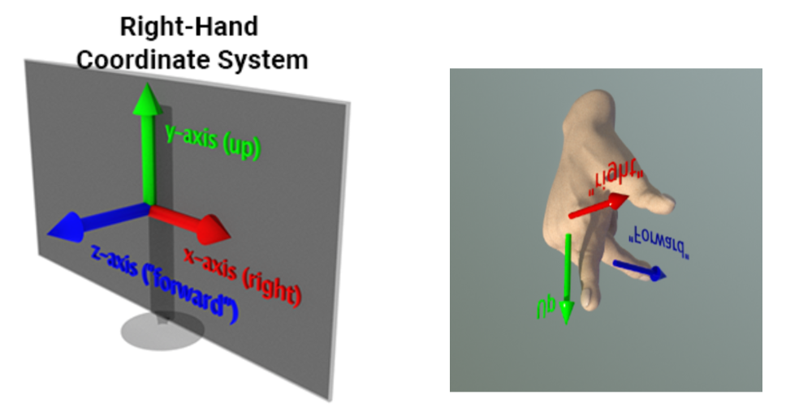

# 三维空间

## 标准化设备坐标(Normalized Device Coordinates）

在前面的章节中，我们使用了这样的顶点数据：

``` c++
static float VertexData[] = {                                       //顶点数据
    //position(xy)      color(rgba)
     0.0f,  -0.5f,      1.0f, 0.0f, 0.0f, 1.0f,
    -0.5f,   0.5f,      0.0f, 1.0f, 0.0f, 1.0f,
     0.5f,   0.5f,      0.0f, 0.0f, 1.0f, 1.0f,
};
```

和顶点着色器：

```cpp
QShader vs = mRhi->newShaderFromCode(QShader::VertexStage, R"(#version 440
    layout(location = 0) in vec2 position;		//这里需要与上面的inputLayout 对应
    layout(location = 1) in vec4 color;

    layout (location = 0) out vec4 vColor;		//输出变量，这里的location是out的，而不是in

    out gl_PerVertex { 							//Vulkan GLSL中固定的定义
        vec4 gl_Position;						
    };

    void main(){
        gl_Position = vec4(position,0.0f,1.0f);	//根据输入的position，设置实际的顶点输出
        vColor = color;							//将输入的color传递给fragment shader
    }
)");
```

绘制出了一个三角形：


大家可能已经猜到了顶点位置里面 `0.0f`，-`0.5f`，`0.5f`所代表的意义，仿佛这些顶点坐标的取值范围是[-1,1]？这是因为图形API为了让坐标运算不受显示器分辨率的影响，都使用了 **标准化设备坐标(Normalized Device Coordinates, 简称NDC)** 的概念。

以OpenGL为例，它遵循右手坐标系：


任一轴向的取值范围为[-1,1]，就像这样：


任何落在范围外的 **顶点** 会按一些策略进行图形裁剪，而不会显示在屏幕上 ：


该过程详见：

- https://registry.khronos.org/vulkan/specs/1.3/html/chap24.html

Vulkan也使用右手坐标系，因为Vulkan声称是下一代的OpenGL，跟OpenGL一样怎么好意思叫Vulkan，所以它总要跟OpenGL有一些标新立异的点，因此，**Vulkan的Y轴是朝下的**，就是这个鬼样子：

为了跟其他现代图形API保持一致，Vulkan选择了妥协，**它的Z轴（深度) 取值范围变成了[0,1]**，就像是这样：


而 DirectX 和 Metal 又与它们不同，**DirectX 和 Metal的NDC使用的是左手坐标系，且深度值范围是[0,1]**：


关于它们的差异和细节，详见：

- https://www.scratchapixel.com/lessons/mathematics-physics-for-computer-graphics/geometry/coordinate-systems.html

### NDC差异解决方案

这些 图形API 标准坐标系的差异，无疑给RHI的封装增加了一些难题，各个引擎对此都有自己的解决方案.

在QRhi中，我们在使用时只需要顶点数据统一使用OpenGL的NDC（即右手坐标系，任一轴向的取值范围为[0,1]）

通过`QRhi::clipSpaceCorrMatrix()` 可以获取到一个当前图形API的矫正矩阵，所有顶点最终都用它处理一遍可以将之转换到对应API的NDC空间。

该功能依赖于QRhi中的以下实现：

``` c++
QMatrix4x4 QRhiGles2::clipSpaceCorrMatrix() const
{
    return QMatrix4x4(); // identity
}

QMatrix4x4 QRhiVulkan::clipSpaceCorrMatrix() const
{
    // See https://matthewwellings.com/blog/the-new-vulkan-coordinate-system/

    static QMatrix4x4 m;
    if (m.isIdentity()) {
        // NB the ctor takes row-major
        m = QMatrix4x4(1.0f, 0.0f, 0.0f, 0.0f,
                       0.0f, -1.0f, 0.0f, 0.0f,
                       0.0f, 0.0f, 0.5f, 0.5f,
                       0.0f, 0.0f, 0.0f, 1.0f);
    }
    return m;
}

QMatrix4x4 QRhiD3D11::clipSpaceCorrMatrix() const
{
    // Like with Vulkan, but Y is already good.

    static QMatrix4x4 m;
    if (m.isIdentity()) {
        // NB the ctor takes row-major
        m = QMatrix4x4(1.0f, 0.0f, 0.0f, 0.0f,
                       0.0f, 1.0f, 0.0f, 0.0f,
                       0.0f, 0.0f, 0.5f, 0.5f,
                       0.0f, 0.0f, 0.0f, 1.0f);
    }
    return m;
}

QMatrix4x4 QRhiD3D12::clipSpaceCorrMatrix() const
{
    // Like with Vulkan, but Y is already good.

    static QMatrix4x4 m;
    if (m.isIdentity()) {
        // NB the ctor takes row-major
        m = QMatrix4x4(1.0f, 0.0f, 0.0f, 0.0f,
                       0.0f, 1.0f, 0.0f, 0.0f,
                       0.0f, 0.0f, 0.5f, 0.5f,
                       0.0f, 0.0f, 0.0f, 1.0f);
    }
    return m;
}

QMatrix4x4 QRhiMetal::clipSpaceCorrMatrix() const
{
    // depth range 0..1
    static QMatrix4x4 m;
    if (m.isIdentity()) {
        // NB the ctor takes row-major
        m = QMatrix4x4(1.0f, 0.0f, 0.0f, 0.0f,
                       0.0f, 1.0f, 0.0f, 0.0f,
                       0.0f, 0.0f, 0.5f, 0.5f,
                       0.0f, 0.0f, 0.0f, 1.0f);
    }
    return m;
}
```

对于一些二维的顶点，我们可以简单的翻转一下坐标的Y值，这也是上一节中纹理 [无属性渲染](https://link.zhihu.com/?target=https%3A//stackoverflow.com/questions/2588875/whats-the-best-way-to-draw-a-fullscreen-quad-in-opengl-3-2) ，为什么要用`Y_UP_IN_NDC`对顶点翻转的来由：

```c++
QShader vs = mRhi->newShaderFromCode(QShader::VertexStage, R"(#version 450
    layout (location = 0) out vec2 vUV;
    out gl_PerVertex{
        vec4 gl_Position;
    };
    void main() {
        vUV = vec2((gl_VertexIndex << 1) & 2, gl_VertexIndex & 2);      /
        gl_Position = vec4(vUV * 2.0f - 1.0f, 0.0f, 1.0f);
#if Y_UP_IN_NDC              //因为DX，GL与VK的NDC不一致，因此这里需要做一些兼容处理
	gl_Position.y = - gl_Position.y;
#endif 
    })"
    , QShaderDefinitions()   //该参数只是简单的在代码开头添加 #define Y_UP_IN_NDC 1        
    .addDefinition("Y_UP_IN_NDC", mRhi->isYUpInNDC())
);
```

### Frame Buffer 坐标 差异

此外，我们还需要注意图形API之间不仅仅有NDC的差异，FrameBuffer的坐标空间也有不同，由于[历史的缘故](https://gamedev.stackexchange.com/questions/83570/why-is-the-origin-in-computer-graphics-coordinates-at-the-top-left)，早期的计算机阴极射线管（CRT）从左上角到右上角绘制图像，所以在大多数传统图形API，通常 **以左上角为帧图像的坐标原点** ，OpenGL成立之初想要改变这一点，让坐标系的使用更符合人类的通识，但可惜的是，已经有太多的框架已经适应并普遍遵循这一规定，这反倒导致了我们在 **使用 OpenGL 的时候还需要对纹理进行上下翻转（Flip Y）**，而现代图形API （DirectX、Metal、Vulkan）， 都已经向历史妥协，所以大家在使用时注意遵循 ”传统“：


## 3D变换


## FPS相机

## 小技巧


