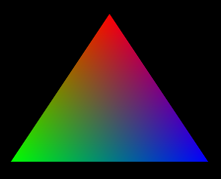
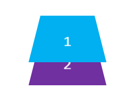
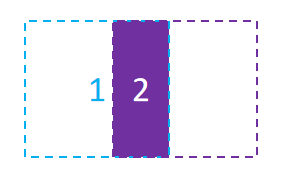
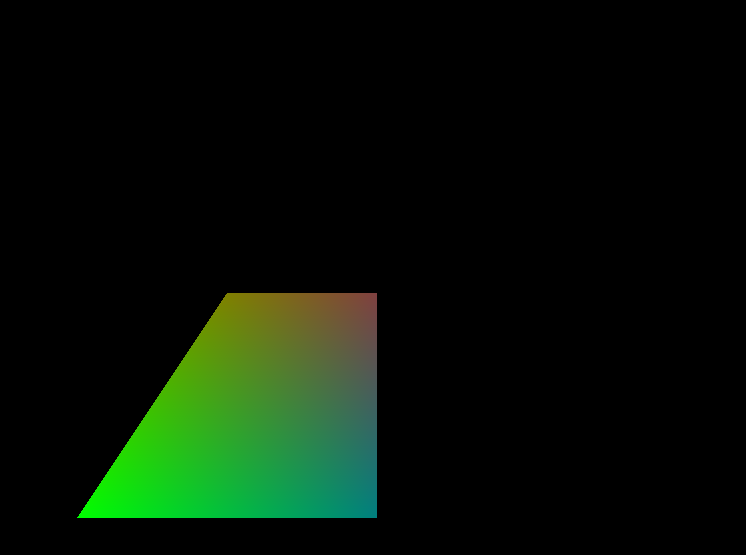
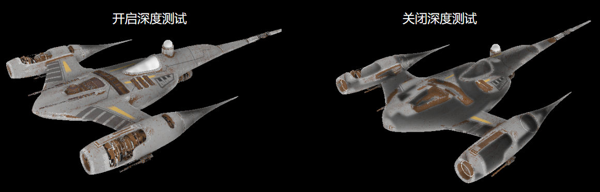
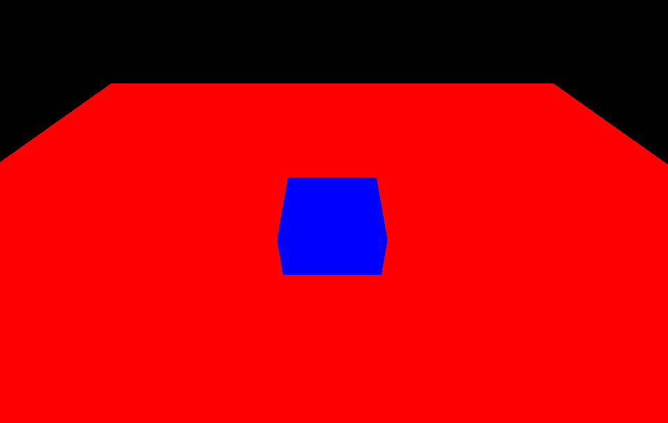
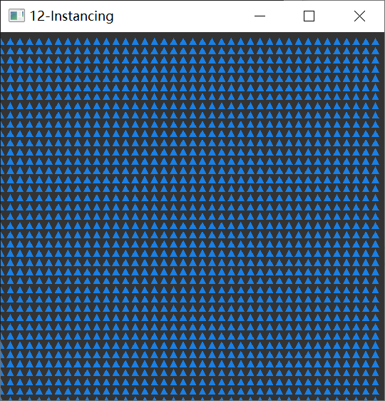
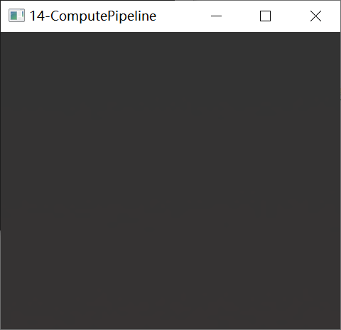
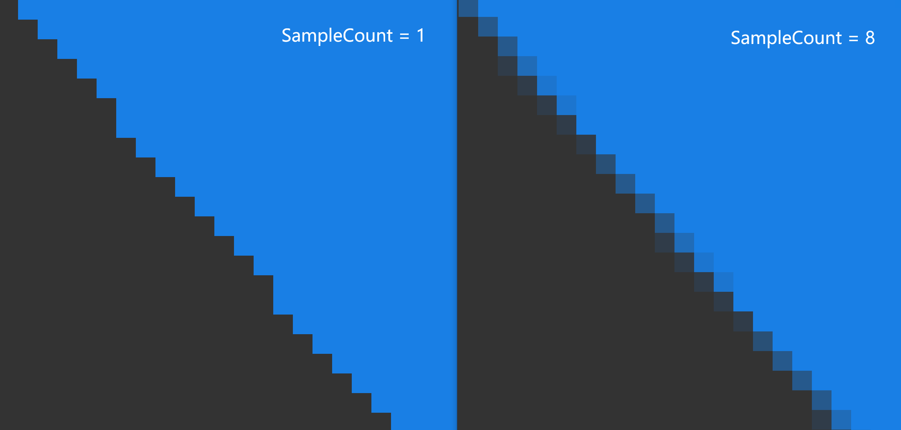

# 图形渲染进阶

在之前的章节中，大家应该都已经熟悉了如何在C++中搭建现代图形API的基本渲染流程：

``` C++
void renderTick(){
    ensureResourcesInit();				//确保初始化渲染资源
 
    updateResources();					//更新渲染资源
    
    beginRenderPass(RenderTarget，ClearValues);	//开启渲染通道
   	for(auto item : RenderItems){						
        setupPipeline();						 //装载流水线
        setDrawState();							 //设置渲染状态
        drawCommand();							 //录制draw命令
    }
    endRenderPass();							 //结束渲染通道
}
```

通过使用 [QRhiGraphicsPipeline](https://alpqr.github.io/qtrhi/qrhigraphicspipeline.html) 和 [QRhiCommandBuffer](https://alpqr.github.io/qtrhi/qrhicommandbuffer.html) ，并编写 Vertex Shader 和 Fragment Shader，对图形渲染管线也有了一定认知：


图形渲染管线本质上只是进行数据的处理，它并没有图形和空间的概念，开发者只是利用这个高效的数据处理器，根据自己的思维去定制相应的流程，从而得到预期的产物。

## 图元拓扑（Primitive Topology）

点，线，面是三维图形的基本单位，在图形API中，我们可以通过设置图元拓扑，来决定流水线产出的图元机制。

``` c++
mPipeline->setTopology(QRhiGraphicsPipeline::Topology::Triangles);
```

图元拓扑就决定了在几何装配阶段，流水线如何挑选顶点来组装基础图元，在QRhi中，支持以下几种拓扑策略：

```c++
enum Topology {
    Triangles,
    TriangleStrip,
    TriangleFan,
    Lines,
    LineStrip,
    Points,
    Patches   //用于镶嵌控制和评估着色器
};
```

QRhi默认使用的是 `Triangles`，假设现在有六个顶点（下方使用索引描述），不同拓扑对应的组装策略是：

- **Triangles** ：组装得到2个三角形`{0,1,2},{3,4,5}`
- **TriangleStrip** ：组装得到4个三角形`{0,1,2},{2,1,3}{2,3,4},{4,3,5}`，顶点的异常索引顺序，是由于流水线会依据顶点的时钟顺序来判断三角形的正反面，所以在组装TriangleStrip的时候会确保时钟顺序不变。
- **TriangleFan** ：组装得到4个三角形`{0,1,2},{0,2,3},{0,3,4},{0,4,5}`
- **Lines** ：组装得到3条线`{0,1},{2,3},{4,5}`
- **LineStrip** ：组装得到5条线`{0,1},{1,2},{2,3},{3,4},{4,5}`
- **Points** ：组装得到6个点`{0},{1},{2},{3},{4},{5}`

这里有一个Vulkan中的图示：


## 几何模式（Polygon Mode）

默认图形渲染管线使用的是填充模式（Fill Mode），绘制的三角形图元会进行填充。



图形API往往还支持 线框模式（Line Mode），该模式只会绘制三角形图元的边线。


在QRhi中的使用方式如下：

``` C++
mPipeline->setPolygonMode(QRhiGraphicsPipeline::Line);
```

## 片段操作（Fragment Operations）

假如我们画了两个矩形：


我们可能会有以下需求：

- 如果出现重叠，让后画的矩形将之前的矩形覆盖

  

- 如果出现重叠，让矩形的颜色按照一定策略混合

  

- 让矩形按照一定的空间遮挡关系进行显示

  

- 让前画的矩形作为蒙版，来确定后方矩形的绘制区域

  

图形API也提供了这些功能的支持，在图形渲染管线中，光栅化产生的片段将经过一些[片段操作（Fragment Operations）](https://registry.khronos.org/vulkan/specs/1.3/html/chap26.html#fragops)，来确定是否或如何在帧缓冲上写入片段着色器产生的值，这些操作通常按如下顺序进行：

1. [裁剪测试（Scissor test）](https://registry.khronos.org/vulkan/specs/1.3/html/chap26.html#fragops-scissor)：通过一个矩形区域来裁剪图像。
2. [深度边界测试（Depth bounds test）](https://registry.khronos.org/vulkan/specs/1.3/html/chap26.html#fragops-dbt)：根据深度值范围来裁剪图像。
3. [模板测试（Stencil test）](https://registry.khronos.org/vulkan/specs/1.3/html/chap26.html#fragops-stencil)：可以通过模板（遮罩：Mask），实现异形区域的裁剪。
4. [深度测试（Depth test）](https://registry.khronos.org/vulkan/specs/1.3/html/chap26.html#fragops-depth)：通过比较深度值来筛选片段，从而让图像表现出前后遮挡的空间关系。
5. [混合（Blending）](https://registry.khronos.org/vulkan/specs/1.3/html/chap27.html#framebuffer-blending)：通过一些策略来混合重叠的片段。

> 需要注意的是：上面只是比较常见且对开发者作用较大的片段操作，这里有一个完整的描述文档：
>
> - (https://registry.khronos.org/vulkan/specs/1.3/html/chap26.html#fragops

这里我们主要是要学会怎么去配置 **重叠片段的处理机制** 和 **片段的筛选手段** 。

### 裁剪测试（Scissor Test）

- 使用裁剪测试的目的很简单：就是希望通过一个矩形对图像进行裁剪，就像是这样：


在QRhi中，使用裁剪测试很容易，只需要在创建流水线时设置`QRhiGraphicsPipeline::Flag::UsesScissor`：

``` c++
mPipeline->setFlags(QRhiGraphicsPipeline::Flag::UsesScissor);
```

绘制时使用`QRhiCommandBuffer::setScissor(const QRhiScissor &scissor)`：

```C++
cmdBuffer->beginPass(renderTarget, clearColor, dsClearValue, batch);
cmdBuffer->setGraphicsPipeline(mPipeline.get());
cmdBuffer->setViewport(QRhiViewport(0, 0, width, height));
cmdBuffer->setScissor(QRhiScissor(0, 0, width/2, height/2));		//通过裁剪只保留四分之一区域
cmdBuffer->setShaderResources(mCubeShaderBindings.get());
const QRhiCommandBuffer::VertexInput vertexInput(mCubeVertexBuffer.get(), 0);
cmdBuffer->setVertexInput(0, 1, &vertexInput);
cmdBuffer->draw(36);
cmdBuffer->endPass();
```

[**教程示例 07-Scissor Test**](https://github.com/Italink/ModernGraphicsEngineGuide/blob/main/Source/1-GraphicsAPI/07-ScissorTest/Source/main.cpp) ：通过裁剪测试只保留四分之一区域。



### 模板测试(Stencil Test)

通常情况下，我们使用模板测试是为了弥补裁剪测试只能使用矩形区域进行裁剪的缺陷，而模板测试允许我们自行制作一个模版（遮罩/Mask）来进行裁剪，就像是这样：


[模板测试 - LearnOpenGL CN (learnopengl-cn.github.io)](https://learnopengl-cn.github.io/04 Advanced OpenGL/02 Stencil testing/)

模版测试的核心机制可以看作是：

- 对于 **具有模版附件** （缓冲区）的RenderTarget，才可以使用模版测试
- 在`BeginPass`的时候，会 **清理模版缓冲区** （一般使用0）
- 我们可以在绑定流水线之后为其指定一个`StencilRef`（Int值），它可以当作是该流水线的ID
- 在绘制过程中，流水线会根据这个ID跟模版缓冲区上当前片段对应的模版值进行比较，我们可以 **设置比较方式** ，它决定了当前片段是否能通过模版测试，此外，我们还可以设置片段 通过模版测试 ， 未通过模版测试 ，未通过深度测试时，怎么去处理模版缓冲区。

在QRhi中，假如我们想要制作一个模版，可能会写如下的代码：

``` c++
mMaskPipeline->setFlags(QRhiGraphicsPipeline::Flag::UsesStencilRef);			//开启流水线的模版测试功能
mMaskPipeline->setStencilTest(true);											//开启模版测试
QRhiGraphicsPipeline::StencilOpState maskStencilState;
maskStencilState.compareOp = QRhiGraphicsPipeline::CompareOp::Never;			//该管线用于绘制模版（遮罩），我们不希望它在RT上绘制任何片段颜色，因此让它的片段永远不会通过模版测试
maskStencilState.failOp = QRhiGraphicsPipeline::StencilOp::Replace;				//设置当该片段没有通过模版测试时，使用StencilRef填充模版缓冲区
mMaskPipeline->setStencilFront(maskStencilState);								//指定正面的模版测试
mMaskPipeline->setStencilBack(maskStencilState);								//指定背面的模版测试
mMaskPipeline->create();
```

对于实际的图形，我们可能会使用这样的参数：

``` c++
mPipeline->setFlags(QRhiGraphicsPipeline::Flag::UsesStencilRef);				//开启流水线的模版测试功能
mPipeline->setStencilTest(true);												//开启模版测试
QRhiGraphicsPipeline::StencilOpState stencilState;
stencilState.compareOp = QRhiGraphicsPipeline::CompareOp::Equal;				//我们希望在当前管线的StencilRef等于模版缓冲区上的片段值时才通过模版测试
stencilState.passOp = QRhiGraphicsPipeline::StencilOp::Keep;					//在通过测试后不会对模版缓冲区进行赋值
stencilState.failOp = QRhiGraphicsPipeline::StencilOp::Keep;					//在没有通过测试时也不会对模版缓冲区进行赋值
mPipeline->setStencilFront(stencilState);
mPipeline->setStencilBack(stencilState);
mPipeline->create();
```

绘制过程可能像是这样：

``` c++
const QColor clearColor = QColor::fromRgbF(0.0f, 0.0f, 0.0f, 1.0f);
const QRhiDepthStencilClearValue dsClearValue = { 1.0f,0 };							//使用 0 清理模版缓冲区
cmdBuffer->beginPass(renderTarget, clearColor, dsClearValue, nullptr);

cmdBuffer->setGraphicsPipeline(mMaskPipeline.get());
cmdBuffer->setStencilRef(1);														//设置StencilRef为1，该管线会在模版缓冲区上填充一块值为1的三角形区域
cmdBuffer->setViewport(QRhiViewport(0, 0, mSwapChain->currentPixelSize().width(), mSwapChain->currentPixelSize().height()));
cmdBuffer->setShaderResources();
const QRhiCommandBuffer::VertexInput maskVertexInput(mMaskVertexBuffer.get(), 0);
cmdBuffer->setVertexInput(0, 1, &maskVertexInput);
cmdBuffer->draw(3);

cmdBuffer->setGraphicsPipeline(mPipeline.get());
cmdBuffer->setStencilRef(1);														//设置StencilRef为1，该管线会用1跟对应位置的片段模版值进行比较，相等时才会通过模版测试，也就是会将片段绘制当颜色附件上
cmdBuffer->setViewport(QRhiViewport(0, 0, mSwapChain->currentPixelSize().width(), mSwapChain->currentPixelSize().height()));
cmdBuffer->setShaderResources();
const QRhiCommandBuffer::VertexInput vertexInput(mVertexBuffer.get(), 0);
cmdBuffer->setVertexInput(0, 1, &vertexInput);
cmdBuffer->draw(3);

cmdBuffer->endPass();
```

[**教程示例 08-StencilTest**](https://github.com/Italink/ModernGraphicsEngineGuide/blob/main/Source/1-GraphicsAPI/08-StencilTest/Source/main.cpp) ：使用MaskPipeline在模版缓冲区上绘制了一块值为1的三角形区域，之后绘制一个翻转的三角形，设置流水线的StencilRef为1，且只有跟模版缓冲区片段的对应值相等时才会通过模版测试，具体表现处理的效果就是只绘制两个三角形的重叠区域，即菱形。


### 深度测试(Depth Test)

开启深度测试，是为了让图像能够呈现出前后遮挡的关系，如果没有深度测试，就会出现错误的遮挡关系，就像是这样：



关于深度测试，这里有一篇非常好的文章：

- [深度测试 - LearnOpenGL CN (learnopengl-cn.github.io)](https://learnopengl-cn.github.io/04 Advanced OpenGL/01 Depth testing/)

此外，在使用深度测试时，一般需要注意几个问题：

- **是否需要开启深度写入和测试？**
  - 开启深度写入和测试是为了让图形在三维空间上具有一定的遮挡关系，但并非三维空间中的所有图形都需要开启深度写入和测试，这其中一个特例就是半透明物体的渲染，大部分引擎会在渲染场景元素的时候，将不透明物体和透明物体进行排序，先开启深度测试和写入，绘制完所有的不透明物体，之后再关闭深度写入，保留深度测试，完成透明物体的渲染，详见：[一篇文章能不能说清楚半透明渲染 - 知乎 (zhihu.com)](https://zhuanlan.zhihu.com/p/579419607)

- **不同图形API之前的深度值范围并不一致！**
  - OpenGL的深度值范围是`[-1,1]`，DX，Vulkan，Metal的深度值范围是`[0，1]`，在QRhi中，可以使用OpenGL的标准，只需要在上传MVP矩阵时，乘上`clipSpaceCorrMatrix`

- **明确RenderTarget是否具有深度附件以及它的精度是多少**
  - 具有深度附件的RenderTarget才能进行深度测试，通常情况下，窗口交换链中使用的深度模板附件是24位用于存储深度值，8位用于存储模板值，这也就代表了深度附件只能存储一定精度的深度值，假如两个平面的距离小于深度附件的最小精度，当进行深度测试的时候，两个平面得到的深度值是相同的，因此我们无法根据数据来明确 重叠像素之间的遮挡顺序 ，这个时候绘制顺序就决定了测试的结果， 又因为图形渲染管线是并行的，图形之间的执行顺序也无法保证，就会导致两个图形交替闪烁的现象，我们称之为 **深度冲突(Z-fighting)** 现象

- **如何避免深度冲突？**
  - 增加深度附件的精度，比如去除模板位，扩充深度到32位
  - 错开图形的位置，使用 [深度偏差（Depth Bias） ](https://learn.microsoft.com/zh-cn/windows/win32/direct3d11/d3d10-graphics-programming-guide-output-merger-stage-depth-bias?redirectedfrom=MSDN)

在QRhi中可以在创建 **QRhiGraphicsPipeline** 时，设置深度测试的相关参数：

``` c++
mPipeline->setDepthTest(true);
mPipeline->setDepthWrite(true);
mPipeline->setDepthOp(QRhiGraphicsPipeline::CompareOp::Less);
```

此外，还需注意RenderPass中使用的ClearValue：

``` c++
const QRhiDepthStencilClearValue dsClearValue = { 1.0f,0 };
cmdBuffer->beginPass(renderTarget, clearColor, dsClearValue);
```

> 通常情况下，我们会使用`1.0f`清理深度缓冲区，并使用`CompareOp::Less`来达到空间遮挡的效果。

**[教程示例 09-Depth Test](https://github.com/Italink/ModernGraphicsEngineGuide/tree/main/Source/1-GraphicsAPI/09-DepthTest/Source)** ：绘制了一个平面，一个立方体，开启深度测试，使立方体的下半部分被正确遮挡。



### 混合(Blending)

混合通常用于半透明渲染，它本质上是一种处理前后重叠片段的机制。

我们称前一（已绘制）片段为 **源（Src）片段** ，称 后一（待绘制）片段为 **目标（Dst）片段** ，混合主要是设定一些公式参数来定制这个过程（方括号`[]` 中的参数是可设置的）：
$$
\begin{align*} 
& ResultColor_{rgb} = [SrcFactor_{alpha}]*SrcColor_{rgb}\ \ [Op]\ \ [DstFactor_{rgb}] * DstColor_{rgb} \\
& ResultAlpha = [SrcFactor_alpha ]*SrcAlpha\ \ [Op]\ \ [DstFactor_{alpha}] * DstAlpha
\end{align*}
$$
还有就是决定哪些颜色通道（RGBA）可以被写入。

其中Factor的值一般可以是：

```C++
Zero,
One,
SrcColor,
OneMinusSrcColor,
DstColor,
OneMinusDstColor,
SrcAlpha,
OneMinusSrcAlpha,
DstAlpha,
OneMinusDstAlpha,
ConstantColor,
OneMinusConstantColor,
ConstantAlpha,
OneMinusConstantAlpha,
SrcAlphaSaturate,
Src1Color,
OneMinusSrc1Color,
Src1Alpha,
OneMinusSrc1Alpha
```

Op的值可以是：

``` c++
Add,
Subtract,
ReverseSubtract,
Min,
Max
```

详见：[混合 - LearnOpenGL CN (learnopengl-cn.github.io)](https://learnopengl-cn.github.io/04 Advanced OpenGL/03 Blending/)

在 QRhi 中，可以在创建图形渲染管线时，设置混合的主要参数如下：

``` C++
class QRhiGraphicsPipeline{
public:
    struct TargetBlend {
        ColorMask colorWrite = ColorMask(0xF); 	 // R | G | B | A		
        bool enable = false;					 // 是否开启混合
        BlendFactor srcColor = One;				 // 源片段的RGB值
        BlendFactor dstColor = OneMinusSrcAlpha; // 目标片段的RGB值
        BlendOp opColor = Add;					 // 片段RGB的算术运算符
        BlendFactor srcAlpha = One;				 // 源片段的Alpha值
        BlendFactor dstAlpha = OneMinusSrcAlpha; // 目标片段的Alpha值
        BlendOp opAlpha = Add;					 // 片段Alpha的算术运算符
    };
};
```

使用也很简单：

``` C++
QRhiGraphicsPipeline::TargetBlend blend;
blend.enable = true;
blend.srcColor = QRhiGraphicsPipeline::SrcAlpha;
blend.dstColor = QRhiGraphicsPipeline::OneMinusSrcAlpha;

mPipeline->setTargetBlends({ blend });
```

你可能注意到了这里设置的是 TargetBlend **s** ，是因为混合的配置跟RenderTarget的颜色附件一一对应，如果你的RT有多个颜色附件，那么你就需要设置多个TargetBlend。

**[教程示例 10-Blending](https://github.com/Italink/ModernGraphicsEngineGuide/blob/main/Source/1-GraphicsAPI/10-Blend/Source/main.cpp)** ：绘制了一个平面，一个半透明立方体，开启混合，使半透明的立方体能正确显示。

## 面剔除(Face Culling)

大多数时候我们在一个3D空间里，往往只能看到一个几何形体的单个侧面，比如一个球体，我们只能看到它的外表面，由于GPU只是一个并行数据处理器，没有空间遮挡的概念，对于球体被遮挡的部分，依旧会执行绘制。

为了解决这个问题，图形API提供了一个面剔除的功能，它要求几何形体的 顶点索引 按照一定 **缠绕顺序** 进行排序，通过缠绕顺序来确定三角形的正反面归属，这样就可以使用面剔除可以让图形渲染管线剔除掉背面的三角形。

详见：[面剔除 - LearnOpenGL CN (learnopengl-cn.github.io)](https://learnopengl-cn.github.io/04 Advanced OpenGL/04 Face culling/)

在QRhi中，使用面剔除要在创建图形渲染管线时，指定 **正面的评定方式** ：

``` c++
mPipeline->setFrontFace(frontFace);
```

并设置 **剔除模式（CullMode）** ：

``` c++
mPipeline->setCullMode(cullMode)
```

它们可以是如下的值：

``` C++
class QRhiGraphicsPipeline{
    enum CullMode {
        None,		//不剔除
        Front,		//剔除正面
        Back		//剔除背面
    };
    enum FrontFace {
        CCW,		//逆时针
        CW			//顺时针
    };
};
```

[**教程示例 11-FaceCulling**](https://github.com/Italink/ModernGraphicsEngineGuide/blob/main/Source/1-GraphicsAPI/11-FaceCulling/Source/main.cpp) ：绘制一个绕Y轴旋转的三角形，开启背面剔除。


## 线条宽度（Line Width）

**部分** 图形API和平台支持在流水线中设置 线 图元 的宽度，在QRhi中使用如下接口即可：

``` C++
 void QRhiGraphicsPipeline::setLineWidth(float width);
```

如果要查看当前后端是否支持设置线宽，请使用如下接口：

``` C++
bool isSupported = mRhi->isFeatureSupported(QRhi::Feature::WideLines);
```

笔者强烈建议不要使用线条图元，一方面是因为只有Vulkan和OpenGL在部分平台上支持线宽的设置，另一方面是因为图形API并不会处理连续线条的 **衔接（Join）** ，如果我们要图形渲染管线的`Line图元`绘制连续线条，那么将得到如下的效果：


在游戏引擎中，我们大多时候会使用三角形图元来绘制，自行计算线条的衔接部分：


> [15.6.1 线连接 (bluevoid.com)](http://www.bluevoid.com/opengl/sig00/advanced00/notes/node290.html)

在本教程的后续章节中，会对连续线条的绘制做一些介绍。

## 实例化（Instancing）

谈到实例化，笔者有一个问题想问下大家：你是否对GPU的算力有所了解？

如果没有，笔者建议最好去找一些相关资料了解一下，在这里笔者简单列一个模糊的说明：

- 常见电脑的显示屏分辨率一般是`1920X1080`，这也就意味着一帧图像大概有 **两百万的像素数据** ，如果是绘制一个全屏的矩形区域，当下的中端显卡（1050Ti以上），在 **关闭垂直同步** 之后一般能有 **几千的帧率（FPS）**

由此可见，GPU的算力是非常恐怖的，但是在实际的渲染工程中，复杂场景的帧率一般都不高，这往往不是因为场景的几何复杂度降低了GPU的性能，而是一个非常重要的因素极大程度地制约了GPU，那就是CPU和GPU之间的数据传输带宽，而上面的描述中，GPU之所以能表现得这么强劲，正是因为顶点数据在一开始就上传到了GPU，这样之后的整个绘制过程都没有CPU和GPU的数据通信，而为了能够更好地发挥GPU的性能，我们一般会尽可能地减少CPU和GPU的数据传输，在之前的章节中，我们使用IndexBuffer来去除重复的顶点，正是基于这个目的，而 **实例化（Instancing）** ，则是图形API提供的一个高级特性，它使得我们可以使用 大量实例数据 和 公共数据 进行组合，来进行大批量的相似物体绘制。

这里有一个更加详细的教程：

- [实例化 - LearnOpenGL CN (learnopengl-cn.github.io)](https://learnopengl-cn.github.io/04%20Advanced%20OpenGL/10%20Instancing/)

在QRhi中，我们只需要在创建流水线时，在顶点输入布局中指定实例化数据：

``` C++
QRhiVertexInputLayout inputLayout;
inputLayout.setBindings({
	QRhiVertexInputBinding(2 * sizeof(float)),
	QRhiVertexInputBinding(2 * sizeof(float), QRhiVertexInputBinding::PerInstance),			//声明逐实例数据
});
mPipeline->setVertexInputLayout(inputLayout);
```

之后在绘制时，只需在draw函数中填入实例数量：

``` c++
void QRhiCommandBuffer::draw(quint32 vertexCount,
                             quint32 instanceCount = 1,
                             quint32 firstVertex = 0,
                             quint32 firstInstance = 0);

void QRhiCommandBuffer::drawIndexed(quint32 indexCount,
                                    quint32 instanceCount = 1,
                                    quint32 firstIndex = 0,
                                    qint32 vertexOffset = 0,
                                    quint32 firstInstance = 0);
```

[**教程示例 12-Instancing**](https://github.com/Italink/ModernGraphicsEngineGuide/blob/main/Source/1-GraphicsAPI/12-Instancing/Source/main.cpp) ：通过一个三角形的顶点数据 结合 一些 用于偏移数据的实例数据 来绘制大量三角形 。



## 多渲染目标（Multi Render Target）

在之前的章节中，我们都是使用的SwapChain提供的RenderTarget，在实际的渲染开发过程中，我们有时候会需要一个中间的渲染过程，为了存储这个过程的结果，我们会自己创建一个RT。

在QRhi中，创建一个RenderTarget是一件非常简单的事，就像是这样：

``` c++
mColorAttachment0.reset(mRhi->newTexture(QRhiTexture::RGBA8, QSize(100, 100), 1, QRhiTexture::Flag::RenderTarget | QRhiTexture::UsedAsTransferSource));				
mColorAttachment0->create();					//创建颜色附件0
mColorAttachment1.reset(mRhi->newTexture(QRhiTexture::RGBA8, QSize(100, 100), 1, QRhiTexture::Flag::RenderTarget | QRhiTexture::UsedAsTransferSource));				
mColorAttachment1->create();					//创建颜色附件1
mDepthStencilBuffer.reset(mRhi->newRenderBuffer(QRhiRenderBuffer::Type::DepthStencil, QSize(100, 100), 1, QRhiRenderBuffer::Flag(), QRhiTexture::Format::D24S8));		
mDepthStencilBuffer->create();					//创建深度（24位）模版（8位）附件

QRhiTextureRenderTargetDescription rtDesc;																												
rtDesc.setColorAttachments({ mColorAttachment0.get(),mColorAttachment1.get() });	
rtDesc.setDepthStencilBuffer(mDepthStencilBuffer.get());
mRenderTarget.reset(mRhi->newTextureRenderTarget(rtDesc));			

//根据RenderTarget的结构来创建RenderPass描述，在使用GraphicsPipeline时，必须指定RenderPassDesc
//这是因为流水线在创建时就需要明确它被用于何种结构的RenderPass，这里的结构指的是：RenderTarget的附件数量和格式
mRenderPassDesc.reset(mRenderTarget->newCompatibleRenderPassDescriptor());														
mRenderTarget->setRenderPassDescriptor(mRenderPassDesc.get());

mRenderTarget->create();
```

> 需要注意的是， **QRhiRenderBuffer** 可以简单当作是一种CPU不可读写的Texture，它具有比Texture更好的GPU处理性能，因此当我们不需要读写RenderTarget中的缓冲区时，请优先考虑使用RenderBuffer作为附件，通常情况下，交换链中的颜色附件和深度模版附件正是使用的RenderBuffer。

而多渲染目标其实只是指一个RenderTarget中含有多个 **颜色附件（ColorAttachment）**

在FragmentShader中，我们可以这样来控制片段输出：

``` c++
#version 440
layout(location = 0) out vec4 fragColor0;		//输出到颜色附件0
layout(location = 1) out vec4 fragColor1;		//输出到颜色附件1
void main(){
    fragColor0 = vec4(1.0f,0.0f,0.0f,1.0f);
	fragColor1 = vec4(0.0f,0.0f,1.0f,1.0f);
}
```

绘制时只需在`beginPass`中使用我们自己的RenderTarget：

```
const QColor clearColor = QColor::fromRgbF(0.2f, 0.2f, 0.2f, 1.0f);
const QRhiDepthStencilClearValue dsClearValue = { 1.0f,0 };
cmdBuffer->beginPass(myRenderTarget.get(), clearColor, dsClearValue);	
cmdBuffer->endPass();
```

[**教程示例 13-MultiRenderTarget**](https://github.com/Italink/ModernGraphicsEngineGuide/blob/main/Source/1-GraphicsAPI/13-MultiRenderTarget/Source/main.cpp) ：在一个具有两个颜色附件的RT上绘制不同的颜色，并用另一条管线将它的颜色附件交替绘制到交换链的RT上。


## 计算管线（Compute Pipeline）

计算管线可以让我们利用GPU的能力去做一些通用的数据计算。

与图形渲染管线不同的是：

- 计算管线只需要编写 Compute Shader
- 计算管线中可以对Usage标识带有 `StorageBuffer` 的资源（缓冲区和图像）进行读写
- 计算管线使用`dispatch(int x, int y, int z)` 开始执行调度
- 计算管线不同于渲染管线，无法使用纹理采样，而是使用`image2D`，通过函数`imageLoad`读取像素值， `imageStore()`进行存储
- 计算着色器中可以对SSBO使用原子（Atomic）操作

这里有一个不错的文章有更详细的介绍：

- [缪之灵 - 从零开始的 Vulkan（八）：计算管线 ](https://zhuanlan.zhihu.com/p/624613836)
- [Reddit - 如何合理划分工作组的调度？](https://www.reddit.com/r/vulkan/comments/barcii/ballpark_dispatch_group_size_for_gpgpu/)

在QRhi中，使用计算管线的流程如下：

创建可被计算管线使用的资源：

``` c++
mStorageBuffer.reset(mRhi->newBuffer(QRhiBuffer::Static, QRhiBuffer::StorageBuffer, sizeof(float)));							//缓冲区被用作StorageBuffer
mStorageBuffer->create();
mTexture.reset(mRhi->newTexture(QRhiTexture::RGBA8, QSize(ImageWidth, ImageHeight), 1, QRhiTexture::UsedWithLoadStore));		//图像可被计算管线读取和存储
mTexture->create();
```

创建计算管线：

``` c++
mPipeline.reset(mRhi->newComputePipeline());
mShaderBindings.reset(mRhi->newShaderResourceBindings());
QShader cs = QRhiHelper::newShaderFromCode(mRhi.get(), QShader::ComputeStage, R"(#version 440
	layout(std140, binding = 0) buffer StorageBuffer{
		int counter;
	}SSBO;
	layout (binding = 1, rgba8) uniform image2D Tex;

	void main(){
		int currentCounter = atomicAdd(SSBO.counter,1);
		//int currentCounter = SSBO.counter = SSBO.counter + 1;
		ivec2 pos = ivec2(gl_GlobalInvocationID.xy);
		imageStore(Tex,pos,vec4(sin(currentCounter/100.0f),0,0,1));
	}
)");
Q_ASSERT(cs.isValid());

mShaderBindings->setBindings({
    //设置计算管线的资源绑定，Load代表可读，Store代表可写
    QRhiShaderResourceBinding::bufferLoadStore(0,QRhiShaderResourceBinding::ComputeStage,mStorageBuffer.get()),	QRhiShaderResourceBinding::imageLoadStore(1,QRhiShaderResourceBinding::ComputeStage,mTexture.get(),0),
});
mShaderBindings->create();
mPipeline->setShaderResourceBindings(mShaderBindings.get());
mPipeline->create();
```

执行计算管线：

``` c++
cmdBuffer->beginComputePass(resourceUpdates);
cmdBuffer->setComputePipeline(mPipeline.get());
cmdBuffer->setShaderResources();
cmdBuffer->dispatch(ImageWidth, ImageHeight, 1);		//根据图像大小划分工作组
cmdBuffer->endComputePass();
```

[**教程示例 14-ComputePipeline**](https://github.com/Italink/ModernGraphicsEngineGuide/blob/main/Source/1-GraphicsAPI/14-ComputePipeline/Source/main.cpp) ：使用SSBO存储一个初始为0的int值，使用ComputeShader让其自增，并将自增的结果标准化到`[0,1]`，根据当前的工作单元的坐标写入到图像中，并绘制在交换链上，得到的效果是：



奇怪的是，每个计算单元中Counter+1，并写入到对于位置的像素，正常情况下显示出来的颜色应该有一定梯度的才对，这种效果就像是每个计算单元在填充图像时，它们的Counter都是一样的。

如果你对多线程有所了解的话，应该想到了解决这个问题，只需要使用原子变量，在GPU中，我们可以对SSBO使用原子操作。

切换ComputeShader中的注释：

``` c++
layout(std140, binding = 0) buffer StorageBuffer{
    int counter;
}SSBO;
layout (binding = 1, rgba8) uniform image2D Tex;
const int ImageSize = 64 * 64;
void main(){
    //int currentCounter = SSBO.counter = SSBO.counter + 1;		
    int currentCounter = atomicAdd(SSBO.counter,1);			//use atomic operation
    ivec2 pos = ivec2(gl_GlobalInvocationID.xy);
    imageStore(Tex,pos,vec4(currentCounter/float(ImageSize),0,0,1));
}
```

我们能看到如下效果，它的渐变梯度显示了计算管线的并行执行情况：


## 间接渲染（Indirect Rendering）

**间接渲染（Indirect Rendering）** 是一个不得不提的现代图形API的高级特性，当下一些亮眼的引擎技术往往都有它的影子，比如动辄上百万数量在模拟的GPU粒子，UE5中的虚拟几何技术 Nanite...，那它的作用是什么呢？

在实例化的小节中我们提到，制约GPU性能的限制往往来源于与CPU的数据通信，而 **IndexBuffer** 和 **Instancing** 也只是让我们能够复用一部分顶点数据，但这部分数据依旧得来自于CPU，而如果这部分数据是动态的，则可能需要每帧都提交，这样依旧会在数据传输阶段产生性能瓶颈，所以很多开发者想到了全GPU的流程，直接在GPU上 生成和处理顶点数据，并使用这些数据直接进行绘制，但要实现这样的效果有一个非常致命的问题，由于调用`draw`命令时，需要指定渲染参数（顶点数量，索引数量，实例数量...），而全GPU的流程将导致CPU不清楚GPU产生的数据，而将GPU的数据 **回读（Readback）** 到CPU是性能损耗非常严重的操作，为了解决这个问题， **间接渲染（Indirect Rendering）** 允许我们调用`drawIndirect`命令时，可以指定一个 Indirect Buffer，该Buffer存储了对应`draw`命令的渲染参数。

打个比方，原先我们可能会调用如下的`draw`命令：

```C++
void QRhiCommandBuffer::draw(
    uint32 vertexCount,
    uint32 instanceCount = 1,
    uint32 firstVertex = 0,
    uint32 firstInstance = 0);
```

现代图形API会提供一个对应的间接指令：

``` c++
void QRhiCommandBuffer::drawIndirect(
    QRhiBuffer *indirectBuffer,
    uint32 bufferOffset = 0
);
```

我们只需要在indirectBuffer中按如下内存结构去填充我们的渲染参数即可：

```c++
struct IndirectBuffer{
    uint32 vertexCount;
    uint32 instanceCount;
    uint32 firstVertex;
    uint32 firstInstance;
}
```

就这样一个很简单的功能，让我们打破了CPU和GPU数据通信的桎梏，从而能够通过 **GPU 驱动管线（GPU Driven Pipeline）**

很可惜的是，QRhi并没有提供 **Indirect Rendering** 的支持，但它提供了非常完备的原生API扩展手段。

这里笔者以Vulkan为例，介绍如何在QRhi的几何管线中使用间接缓冲区。

首先，我们需要创建一个具有 `VK_BUFFER_USAGE_INDIRECT_BUFFER_BIT` 用途标识的缓冲区，这里笔者通过一些Hack的手段做了一些封装：

``` c++
mIndirectDrawBuffer.reset(QRhiHelper::newVkBuffer(mRhi.get(), QRhiBuffer::Static, VK_BUFFER_USAGE_INDIRECT_BUFFER_BIT, sizeof(DispatchStruct)));
mIndirectDrawBuffer->create();
```

之后我们按常规手段去初始化IndirectDrawBuffer的内存：

``` c++
QRhiResourceUpdateBatch* resourceUpdates = nullptr;
if(mSigSubmit.ensure()){
    resourceUpdates = mRhi->nextResourceUpdateBatch();								//初始化间接缓冲区
    DispatchStruct dispatch;
    dispatch.x = dispatch.y = dispatch.z = 1;
    resourceUpdates->uploadStaticBuffer(mIndirectDrawBuffer.get(), 0, sizeof(DispatchStruct), &dispatch);
    cmdBuffer->resourceUpdate(resourceUpdates);
    mRhi->finish();
}
```

```c++
QVulkanInstance* vkInstance = vulkanInstance();
QRhiVulkanNativeHandles* vkHandle = (QRhiVulkanNativeHandles*)mRhi->nativeHandles();
QVulkanDeviceFunctions* vkDevFunc =  vkInstance->deviceFunctions(vkHandle->dev);

QRhiVulkanCommandBufferNativeHandles* cmdBufferHandles = (QRhiVulkanCommandBufferNativeHandles*)cmdBuffer->nativeHandles();
QVkCommandBuffer* cbD = QRHI_RES(QVkCommandBuffer, cmdBuffer);
VkCommandBuffer vkCmdBuffer = cmdBufferHandles->commandBuffer;

QVkComputePipeline* pipelineHandle = (QVkComputePipeline*)mPipeline.get();
VkPipeline vkPipeline = pipelineHandle->pipeline;

QRhiBuffer::NativeBuffer indirectBufferHandle = mIndirectDrawBuffer->nativeBuffer();
VkBuffer vkIndirectBuffer = *(VkBuffer*)indirectBufferHandle.objects[0];

cmdBuffer->beginExternal();															//开始扩展，之后可输入原生API的指令
vkDevFunc->vkCmdBindPipeline(vkCmdBuffer, VkPipelineBindPoint::VK_PIPELINE_BIND_POINT_COMPUTE, vkPipeline);
QRhiHelper::setShaderResources(mPipeline.get(), cmdBuffer, mShaderBindings.get());	//辅助函数，用于更新VK流水线的描述符集绑定
vkDevFunc->vkCmdDispatchIndirect(vkCmdBuffer, vkIndirectBuffer, 0);

cmdBuffer->endExternal();															
```

在QRhi中，我们可以自己创建原生图形API的渲染资源，然后在录入CmdBuffer时，在`beginExternal()`和`endExternal()`之间插入原生API的指令，对于了解OpenGL但不熟悉现代图形API的同学，需要了解以下概念：

### 渲染流程

现代图形API没有Context的概念，而是通过CommandBuffer（CommandList）录入指令，最后统一由Queue提交到GPU上，在多线程的渲染过程中，保证CommandBuffer的录入顺序即可。

现代图形API的渲染流程基本如下：

``` c++
void onRenderTick(){
    if(needInitResource){
        // Create Buffer,Pipeline,Bindings,Texture,Sampler....
    }
    
    if(needUpdateResource){
        cmdBuffer->...();
        //upload static buffer, update dynamic buffer,upload texture
    }
    
    cmdBuffer->beginPass(renderTarget,clearValue);	
    
    cmdBuffer->setPipeline();
	cmdBuffer->setViewport(...);
	cmdBuffer->setShaderResources(..);
	cmdBuffer->setVertexInput(0, 1, &vertexInput);
	cmdBuffer->draw(...);
    
    cmdBuffer->endPass()
}
```

需要注意的是，在`beginPass()`和`endPass()`之间，我们不可以对渲染资源进行操作，这个处理过程我们会放在`beginPass()`之前，在绘制多个物体时，整个过程看上去就像是：

``` c++
for(auto item: renderItem)
    item->tryUpdateResource();

cmdBuffer->beginPass(renderTarget,clearValue);	

for(auto item: renderItem)
    item->drawCommands();

cmdBuffer->endPass()
```

### 内存同步

现代图形API需要我们手动去管理资源的同步

对于两个连续的draw命令：

``` c++
RenderPass1();  //渲染通道1
RenderPass2();	//渲染通道2
```

很多初学的小伙伴会以为当渲染通道1执行完，才会开始执行渲染通道2，很显然这个想法是错误的，因为CPU和GPU的执行是不同步的，cmdBuffer只是负责录制指令，这里的顺序只是指令的录制顺序，当指令有序提交到GPU上，也并不代表渲染通道1执行完才会开始执行渲染通道2，渲染通道2的执行时机取决于GPU上是否有空闲的计算资源，这也意味着两个渲染通道会产生 **顺序启动，无序执行** 的效果，这种做法可以极大程度地提高GPU的使用效率，但同样我们也会面临一个问题，如果两个drawCommands存在依赖关系（比如前一次计算管线输出的缓冲区作为下一个渲染管线的间接缓冲区输入），这种渲染上的并行就会产生不符合我们预期的结果（具体的表现情况在不同平台上有所差异），为了解决这个问题，现代图形API要求我们使用内存（Buffer和Texture）时，需要设置一个 **流水线阶段（Stage）** 和 **许可（Access）** ，这两个参数代表了当前内存只能在`Stage`阶段执行被`许可（Access）`的操作，在执行某个操作时，如果它不满足阶段和许可的要求，则会阻塞等待，我们可以通过 **屏障（Barrier）** 来改变内存的阶段和许可。

以Vulkan为例，为了解决 `前一次计算管线输出的缓冲区作为下一个渲染管线的间接缓冲区输入` 同步问题，我们可能会写出这样的代码：

```C++
VkBufferMemoryBarrier barrier0;							//内存屏障的参数结构体
barrier.sType = VK_STRUCTURE_TYPE_BUFFER_MEMORY_BARRIER;
barrier.srcAccessMask = 0;								//从 可传输写入 转换到 可被着色器写入
barrier.dstAccessMask = VK_ACCESS_SHADER_WRITE_BIT;
barrier.buffer = IndirectBuffer;						//指定缓冲区
barrier.offset = 0;
barrier.pNext = nullptr;
barrier.srcQueueFamilyIndex = barrier.dstQueueFamilyIndex = -1;
barrier.size = IndirectBuffer->size();
vkCmdPipelineBarrier(cmdBuffer,							//从 任意图形阶段 转变为 计算着色器处理阶段
                     VK_PIPELINE_STAGE_ALL_GRAPHICS_BIT, 
                     VK_PIPELINE_STAGE_COMPUTE_SHADER_BIT, 
                     0, 0, nullptr, 1, &barrier0, 0, nullptr);

dispatch(...);		//使用计算管线填充间接缓冲区的值

VkBufferMemoryBarrier barrier1;							
barrier.sType = VK_STRUCTURE_TYPE_BUFFER_MEMORY_BARRIER;
barrier.srcAccessMask = VK_ACCESS_SHADER_WRITE_BIT;		//从 可被着色器写入 转换到 可被间接渲染指令读取
barrier.dstAccessMask = VK_ACCESS_INDIRECT_COMMAND_READ_BIT;
barrier.buffer = IndirectBuffer;						//指定缓冲区
barrier.offset = 0;
barrier.pNext = nullptr;
barrier.srcQueueFamilyIndex = barrier.dstQueueFamilyIndex = -1;
barrier.size = IndirectBuffer->size();
vkCmdPipelineBarrier(cmdBuffer,							//从 计算着色器处理阶段 转变为 间接渲染处理阶段
                     VK_PIPELINE_STAGE_COMPUTE_SHADER_BIT, 
                     VK_PIPELINE_STAGE_DRAW_INDIRECT_BIT, 
                     0, 0, nullptr, 1, &barrier1, 0, nullptr);

drawIndirect(...)		//执行间接渲染
```

Vulkan中的一些相关结构如下：

``` c++
typedef enum VkPipelineStageFlagBits {
    VK_PIPELINE_STAGE_TOP_OF_PIPE_BIT = 0x00000001,
    VK_PIPELINE_STAGE_DRAW_INDIRECT_BIT = 0x00000002,
    VK_PIPELINE_STAGE_VERTEX_INPUT_BIT = 0x00000004,
    VK_PIPELINE_STAGE_VERTEX_SHADER_BIT = 0x00000008,
    VK_PIPELINE_STAGE_TESSELLATION_CONTROL_SHADER_BIT = 0x00000010,
    VK_PIPELINE_STAGE_TESSELLATION_EVALUATION_SHADER_BIT = 0x00000020,
    VK_PIPELINE_STAGE_GEOMETRY_SHADER_BIT = 0x00000040,
    VK_PIPELINE_STAGE_FRAGMENT_SHADER_BIT = 0x00000080,
    VK_PIPELINE_STAGE_EARLY_FRAGMENT_TESTS_BIT = 0x00000100,
    VK_PIPELINE_STAGE_LATE_FRAGMENT_TESTS_BIT = 0x00000200,
    VK_PIPELINE_STAGE_COLOR_ATTACHMENT_OUTPUT_BIT = 0x00000400,
    VK_PIPELINE_STAGE_COMPUTE_SHADER_BIT = 0x00000800,
    VK_PIPELINE_STAGE_TRANSFER_BIT = 0x00001000,
    VK_PIPELINE_STAGE_BOTTOM_OF_PIPE_BIT = 0x00002000,
    VK_PIPELINE_STAGE_HOST_BIT = 0x00004000,
    VK_PIPELINE_STAGE_ALL_GRAPHICS_BIT = 0x00008000,
    VK_PIPELINE_STAGE_ALL_COMMANDS_BIT = 0x00010000,
    VK_PIPELINE_STAGE_NONE = 0,
    //...
} VkPipelineStageFlagBits;

typedef enum VkAccessFlagBits {
    VK_ACCESS_INDIRECT_COMMAND_READ_BIT = 0x00000001,
    VK_ACCESS_INDEX_READ_BIT = 0x00000002,
    VK_ACCESS_VERTEX_ATTRIBUTE_READ_BIT = 0x00000004,
    VK_ACCESS_UNIFORM_READ_BIT = 0x00000008,
    VK_ACCESS_INPUT_ATTACHMENT_READ_BIT = 0x00000010,
    VK_ACCESS_SHADER_READ_BIT = 0x00000020,
    VK_ACCESS_SHADER_WRITE_BIT = 0x00000040,
    VK_ACCESS_COLOR_ATTACHMENT_READ_BIT = 0x00000080,
    VK_ACCESS_COLOR_ATTACHMENT_WRITE_BIT = 0x00000100,
    VK_ACCESS_DEPTH_STENCIL_ATTACHMENT_READ_BIT = 0x00000200,
    VK_ACCESS_DEPTH_STENCIL_ATTACHMENT_WRITE_BIT = 0x00000400,
    VK_ACCESS_TRANSFER_READ_BIT = 0x00000800,
    VK_ACCESS_TRANSFER_WRITE_BIT = 0x00001000,
    VK_ACCESS_HOST_READ_BIT = 0x00002000,
    VK_ACCESS_HOST_WRITE_BIT = 0x00004000,
    //...
} VkAccessFlagBits;
```

在QRhi中，它会根据流水线和资源更新批次的依赖关系，自动添加屏障，所以在正常使用的过程中，我们无需关心同步的问题，但如果我们使用了原生API的扩展，那么就需要自己手动去管理资源同步，所以大家需要了解同步的概念：屏障（Barrier），栅栏（Fence），事件（Event）

> QRhi中为了实现自动添加资源屏障的机制，延迟了指令的提交，比如我们调用了`cmdBuffer->draw()`，它并没有立即调用`vkCmdDraw()`，而是将指令参数记录到QRhi自身维护的CommandBuffer中，直到`QRhi::endFrame()`时才真正执行，这是因为QRhi会分析RenderPass期间的 **着色器资源绑定（ShaderResourceBindings）** ，从而给依赖的资源添加屏障，但RenderPass期间又不允许对资源进行操作，而延迟提交指令让这个机制成为了可能，在`beginExternal`时，QRhi会将当前已存储的指令参数立即提交给原生API，这样我们就能安全地使用原生API进行扩展，但需要注意的是，在`External`期间，因为QRhi延迟提交的特性，我们就不能再使用QRhi的接口。

关于上述描述的细节，请自行查阅资料和文档。

[**教程示例 15-IndirenctDraw**](https://github.com/Italink/ModernGraphicsEngineGuide/blob/main/Source/1-GraphicsAPI/15-IndirectDraw/Source/main.cpp) ：使用间接渲染驱动计算管线让一个数进行自增，并回读到CPU打印显示。

## 离屏渲染 （Offscreen Rendering）

离屏渲染是指无窗口渲染，即不显示任何窗口就能在后台绘制图像。

现代图形API一般会提供 **OffscreenSurface** 的支持，对于OpenGL，我们一般会创建一个不可见的窗口来初始化上下文环境，从而进行离屏渲染。

在QRhi中使用离屏渲染是一件非常容易的事情，我们在创建Rhi时，初始化参数的window可以填`nullptr`

之后使用`QRhiVulkan::beginOffscreenFrame`就能开始绘制离屏帧：

``` c++
QRhiCommandBuffer* cmdBuffer;
if (rhi->beginOffscreenFrame(&cmdBuffer) != QRhi::FrameOpSuccess)
    return 1;

// do rendering

rhi->endOffscreenFrame();
```

**[教程示例 16-Offscreen](https://github.com/Italink/ModernGraphicsEngineGuide/blob/main/Source/1-GraphicsAPI/16-Offscreen/Source/main.cpp)** ：使用离屏渲染绘制一个三角形，回读到CPU，并将图像保存到本地。


## 抗锯齿（Anti-Aliasing）

通过图形渲染管线绘制一个三角形，由于RenderTarget具有一定的存储精度，所以我们得到的图像往往会存在一定锯齿：


而 **抗锯齿（反走样）** 的目标，就是为了柔化图形边缘的锯齿，让图像变成这样：


关于抗锯齿，这里有一个更详细的文档：

- ：[抗锯齿- LearnOpenGL CN (learnopengl-cn.github.io)](https://learnopengl-cn.github.io/04%20Advanced%20OpenGL/11%20Anti%20Aliasing/)

大部分图形API都支持 **多重采样抗锯齿（Multi Ssample Anti-Aliasing）** 的特性。

除了MSAA，还有一些其他的抗锯齿算法，感兴趣可以阅读：

- [张亚坤 - 主流抗锯齿方案详解（一）MSAA](https://zhuanlan.zhihu.com/p/415087003)
- [张亚坤 - 主流抗锯齿方案详解（二）TAA](https://zhuanlan.zhihu.com/p/425233743)
- [张亚坤 - 主流抗锯齿方案详解（三）FXAA](https://zhuanlan.zhihu.com/p/431384101)

在QRhi中，我们可以这样检查特性是否支持：

``` c+=
rhi->isFeatureSupported(QRhi::Feature::MultisampleTexture)
```

如果想要让交换链支持MSAA，其关键代码如下：

``` c++
//创建DS附件时，指定采样数为8
mDSBuffer.reset( mRhi->newRenderBuffer(QRhiRenderBuffer::DepthStencil,QSize(),8,QRhiRenderBuffer::UsedWithSwapChainOnly));
mSwapChain->setDepthStencil(mDSBuffer.get());
mSwapChain->setSampleCount(8);     //设置重采样数量为8
mSwapChain->createOrResize();
```

在创建流水线时，需要保证流水线的采样数和渲染目标的采样数一致：

``` c++
mPipeline->setSampleCount(mSwapChain->sampleCount());
```

需要注意的是：开启多重采样的Texture是不可回读的

如果想要回读MSAATexture，我们需要在创建RenderTarget时，指定一个采样数为1的 **ResolveTexture** ，回读ResolveTexture而不是MSAATexture：

```c++
QScopedPointer<QRhiTexture> msaaTexture;
QScopedPointer<QRhiTexture> msaaResolveTexture;
QScopedPointer<QRhiTexture> renderTargetTexture;
QScopedPointer<QRhiTextureRenderTarget> renderTarget;
QScopedPointer<QRhiRenderPassDescriptor> renderTargetDesc;

msaaTexture.reset(rhi->newTexture(QRhiTexture::RGBA8, QSize(1280, 720), 8, QRhiTexture::RenderTarget | QRhiTexture::UsedAsTransferSource));
msaaTexture->create();
msaaResolveTexture.reset(rhi->newTexture(QRhiTexture::RGBA8, QSize(1280, 720), 1, QRhiTexture::RenderTarget | QRhiTexture::UsedAsTransferSource));
msaaResolveTexture->create();

QRhiColorAttachment colorAttachment;
colorAttachment.setTexture(msaaTexture.get());						//设置msaa纹理
colorAttachment.setResolveTexture(msaaResolveTexture.get());		//指定用于解析的纹理

renderTarget.reset(rhi->newTextureRenderTarget({ colorAttachment }));
renderTargetDesc.reset(renderTarget->newCompatibleRenderPassDescriptor());
renderTarget->setRenderPassDescriptor(renderTargetDesc.get());
renderTarget->create();
	
//...

QRhiReadbackDescription rb(msaaResolveTexture.get());		//回读 msaaResolveTexture 而不是 msaaTexture
resourceUpdates->readBackTexture(rb, &rbResult);
cmdBuffer->endPass(resourceUpdates);
```

[**教程示例 17-MSAA**](https://github.com/Italink/ModernGraphicsEngineGuide/blob/main/Source/1-GraphicsAPI/17-MSAA/Source/main.cpp) ：使用离屏渲染绘制一个重采样数为8的三角形，回读到CPU，并将图像保存到本地。


