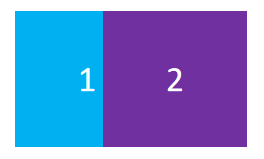
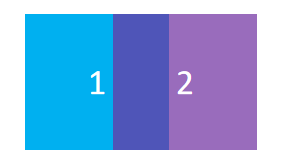

# 混合与测试

在之前的章节中，大家应该都已经熟悉了如何在C++中搭建现代图形API的基本渲染流程：

``` C++
void renderTick(){
    ensureResourcesInit();				//确保初始化渲染资源
 
    updateResources();					//更新渲染资源
    
    beginRenderPass(RenderTarget，ClearValues);	//开启渲染通道
   	for(auto item : RenderItems){						
        setupPipeline();						 //装载流水线
        setDrawState();							 //设置渲染状态
        drawCommand();							 //录制draw命令
    }
    endRenderPass();							 //结束渲染通道
}
```

通过使用 [QRhiGraphicsPipeline](https://alpqr.github.io/qtrhi/qrhigraphicspipeline.html) 和 [QRhiCommandBuffer](https://alpqr.github.io/qtrhi/qrhicommandbuffer.html) ，并编写 Vertex Shader 和 Fragment Shader，对图形渲染管线也有了一定认知：


图形渲染管线本质上只是进行数据的处理，它并不理解图形和空间的概念，假如我们画了两个矩形：


我们可能会有以下需求：

- 如果出现重叠，让后画的矩形将之前的矩形覆盖

  

- 如果出现重叠，让矩形的颜色按照一定策略混合

  

- 让矩形按照一定的空间遮挡关系进行显示

  

- 让前画的矩形作为蒙版，来确定后方矩形的绘制区域

  

这对大家来说应该是一些比较简单的数据处理逻辑，但图形渲染管线依附于GPU，它的执行过程非常高效，而通过图形API我们才能操作GPU，这也就是我们这一节的目标：认识图形渲染管线中的**测试与混合（Testing And Blending）**阶段，学会怎么配置 **重叠片段的处理机制** 和 **片段的筛选手段**。

在图形渲染管线中，光栅化产生的片段将经过一些[片段操作（Fragment Operations）](https://registry.khronos.org/vulkan/specs/1.3/html/chap26.html#fragops)，来确定是否或如何在帧缓冲上写入片段着色器产生的值，这些操作通常按如下顺序进行：

1. [裁剪测试（Scissor test）](https://registry.khronos.org/vulkan/specs/1.3/html/chap26.html#fragops-scissor)：通过一个矩形区域来裁剪图像。
2. [深度边界测试（Depth bounds test）](https://registry.khronos.org/vulkan/specs/1.3/html/chap26.html#fragops-dbt)：根据深度值范围来裁剪图像。
3. [模板测试（Stencil test）](https://registry.khronos.org/vulkan/specs/1.3/html/chap26.html#fragops-stencil)：可以通过模板（遮罩：Mask），实现异形区域的裁剪。
4. [深度测试（Depth test）](https://registry.khronos.org/vulkan/specs/1.3/html/chap26.html#fragops-depth)：通过比较深度值来筛选片段，从而让图像表现出前后遮挡的空间关系。
5. [混合（Blending）](https://registry.khronos.org/vulkan/specs/1.3/html/chap27.html#framebuffer-blending)：通过一些策略来混合重叠的片段。

> 需要注意的是：上面只是比较常见且对开发者作用较大的片段操作，这里有一个完整的描述文档：
>
> - (https://registry.khronos.org/vulkan/specs/1.3/html/chap26.html#fragops

## 裁剪测试（Scissor Test）

- 使用裁剪测试的目的很简单：就是希望通过一个矩形对图像进行裁剪，就像是这样：


在QRhi中，使用裁剪测试很容易，只需要在绘制时使用`QRhiCommandBuffer::setScissor(const QRhiScissor &scissor)`：

```C++
cmdBuffer->beginPass(renderTarget, clearColor, dsClearValue, batch);
cmdBuffer->setGraphicsPipeline(mPipeline.get());
cmdBuffer->setViewport(QRhiViewport(0, 0, width, height));
cmdBuffer->setScissor(QRhiScissor(0, 0, width/2, height/2));		//通过裁剪只保留左上角区域
cmdBuffer->setShaderResources(mCubeShaderBindings.get());
const QRhiCommandBuffer::VertexInput vertexInput(mCubeVertexBuffer.get(), 0);
cmdBuffer->setVertexInput(0, 1, &vertexInput);
cmdBuffer->draw(36);
cmdBuffer->endPass();
```

## 模板测试(Stencil Test)

通常情况下，我们使用模板测试是为了弥补裁剪测试只能使用矩形区域进行裁剪的缺陷，而模板测试允许我们使用模板（遮罩/Mask）来进行裁剪，而这个模板可以由我们自行制作，就像是这样：


[模板测试 - LearnOpenGL CN (learnopengl-cn.github.io)](https://learnopengl-cn.github.io/04 Advanced OpenGL/02 Stencil testing/)

## 深度测试(Depth Test)

开启深度测试，是为了让图像能够呈现出前后遮挡的关系，如果没有深度测试，就会出现错误的遮挡关系，就像是这样：


关于深度测试，这里有一篇非常好的文章：

- [深度测试 - LearnOpenGL CN (learnopengl-cn.github.io)](https://learnopengl-cn.github.io/04 Advanced OpenGL/01 Depth testing/)

在使用深度测试时，一般需要我们注意几个问题：

- 是否需要开启深度测试？
- 是否需要开启深度写入？
- 不同图形API之前的深度值范围并不一致。
- RenderTarget是否具有深度附件，以及它的精度是多少？
- 如何避免深度冲突？


[深度偏差 - Win32 apps | Microsoft Learn](https://learn.microsoft.com/zh-cn/windows/win32/direct3d11/d3d10-graphics-programming-guide-output-merger-stage-depth-bias?redirectedfrom=MSDN)


## 混合(Blending)

[混合 - LearnOpenGL CN (learnopengl-cn.github.io)](https://learnopengl-cn.github.io/04 Advanced OpenGL/03 Blending/)

## 面剔除

[面剔除 - LearnOpenGL CN (learnopengl-cn.github.io)](https://learnopengl-cn.github.io/04 Advanced OpenGL/04 Face culling/)


