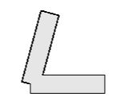
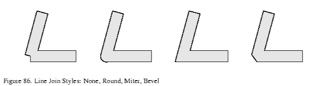

# 图形渲染管线进阶

在之前的章节中，大家应该都已经熟悉了如何在C++中搭建现代图形API的基本渲染流程：

``` C++
void renderTick(){
    ensureResourcesInit();				//确保初始化渲染资源
 
    updateResources();					//更新渲染资源
    
    beginRenderPass(RenderTarget，ClearValues);	//开启渲染通道
   	for(auto item : RenderItems){						
        setupPipeline();						 //装载流水线
        setDrawState();							 //设置渲染状态
        drawCommand();							 //录制draw命令
    }
    endRenderPass();							 //结束渲染通道
}
```

通过使用 [QRhiGraphicsPipeline](https://alpqr.github.io/qtrhi/qrhigraphicspipeline.html) 和 [QRhiCommandBuffer](https://alpqr.github.io/qtrhi/qrhicommandbuffer.html) ，并编写 Vertex Shader 和 Fragment Shader，对图形渲染管线也有了一定认知：


图形渲染管线本质上只是进行数据的处理，它并没有图形和空间的概念，开发者只是利用这个高效的数据处理器，根据自己的思维去定制相应的流程，从而得到预期的产物。

## 图元拓扑（Primitive Topology）

点，线，面是三维图形的基本单位，在图形API中，我们可以通过设置图元拓扑，来决定流水线产出的图元机制。

``` c++
mPipeline->setTopology(QRhiGraphicsPipeline::Topology::Triangles);
```

图元拓扑就决定了在几何装配阶段，流水线如何挑选顶点来组装基础图元，在QRhi中，支持以下几种拓扑策略：

```c++
enum Topology {
    Triangles,
    TriangleStrip,
    TriangleFan,
    Lines,
    LineStrip,
    Points,
    Patches   //用于镶嵌控制和评估着色器
};
```

QRhi默认使用的是 `Triangles`，假设现在有六个顶点（下方使用索引描述），不同拓扑对应的组装策略是：

- **Triangles** ：组装得到2个三角形`{0,1,2},{3,4,5}`
- **TriangleStrip** ：组装得到4个三角形`{0,1,2},{2,1,3}{2,3,4},{4,3,5}`，顶点的异常索引顺序，是由于流水线会依据顶点的时钟顺序来判断三角形的正反面，所以在组装TriangleStrip的时候会确保时钟顺序不变。
- **TriangleFan** ：组装得到4个三角形`{0,1,2},{0,2,3},{0,3,4},{0,4,5}`
- **Lines** ：组装得到3条线`{0,1},{2,3},{4,5}`
- **LineStrip** ：组装得到5条线`{0,1},{1,2},{2,3},{3,4},{4,5}`
- **Points** ：组装得到6个点`{0},{1},{2},{3},{4},{5}`

这里有一个Vulkan中的图示：


## 几何模式（Polygon Mode）

默认图形渲染管线使用的是填充模式（Fill Mode），绘制的三角形图元会进行填充。


图形API往往还支持 线框模式（Line Mode），该模式只会绘制三角形图元的边线。


在QRhi中的使用方式如下：

``` C++
mPipeline->setPolygonMode(QRhiGraphicsPipeline::Line);
```

## 片段操作（Fragment Operations）

假如我们画了两个矩形：


我们可能会有以下需求：

- 如果出现重叠，让后画的矩形将之前的矩形覆盖

  

- 如果出现重叠，让矩形的颜色按照一定策略混合

  

- 让矩形按照一定的空间遮挡关系进行显示

  

- 让前画的矩形作为蒙版，来确定后方矩形的绘制区域

  

图形API也提供了这些功能的支持，在图形渲染管线中，光栅化产生的片段将经过一些[片段操作（Fragment Operations）](https://registry.khronos.org/vulkan/specs/1.3/html/chap26.html#fragops)，来确定是否或如何在帧缓冲上写入片段着色器产生的值，这些操作通常按如下顺序进行：

1. [裁剪测试（Scissor test）](https://registry.khronos.org/vulkan/specs/1.3/html/chap26.html#fragops-scissor)：通过一个矩形区域来裁剪图像。
2. [深度边界测试（Depth bounds test）](https://registry.khronos.org/vulkan/specs/1.3/html/chap26.html#fragops-dbt)：根据深度值范围来裁剪图像。
3. [模板测试（Stencil test）](https://registry.khronos.org/vulkan/specs/1.3/html/chap26.html#fragops-stencil)：可以通过模板（遮罩：Mask），实现异形区域的裁剪。
4. [深度测试（Depth test）](https://registry.khronos.org/vulkan/specs/1.3/html/chap26.html#fragops-depth)：通过比较深度值来筛选片段，从而让图像表现出前后遮挡的空间关系。
5. [混合（Blending）](https://registry.khronos.org/vulkan/specs/1.3/html/chap27.html#framebuffer-blending)：通过一些策略来混合重叠的片段。

> 需要注意的是：上面只是比较常见且对开发者作用较大的片段操作，这里有一个完整的描述文档：
>
> - (https://registry.khronos.org/vulkan/specs/1.3/html/chap26.html#fragops

这里我们主要是要学会怎么配置 **重叠片段的处理机制** 和 **片段的筛选手段**。

### 裁剪测试（Scissor Test）

- 使用裁剪测试的目的很简单：就是希望通过一个矩形对图像进行裁剪，就像是这样：


在QRhi中，使用裁剪测试很容易，只需要在绘制时使用`QRhiCommandBuffer::setScissor(const QRhiScissor &scissor)`：

```C++
cmdBuffer->beginPass(renderTarget, clearColor, dsClearValue, batch);
cmdBuffer->setGraphicsPipeline(mPipeline.get());
cmdBuffer->setViewport(QRhiViewport(0, 0, width, height));
cmdBuffer->setScissor(QRhiScissor(0, 0, width/2, height/2));		//通过裁剪只保留左上角区域
cmdBuffer->setShaderResources(mCubeShaderBindings.get());
const QRhiCommandBuffer::VertexInput vertexInput(mCubeVertexBuffer.get(), 0);
cmdBuffer->setVertexInput(0, 1, &vertexInput);
cmdBuffer->draw(36);
cmdBuffer->endPass();
```

### 模板测试(Stencil Test)

通常情况下，我们使用模板测试是为了弥补裁剪测试只能使用矩形区域进行裁剪的缺陷，而模板测试允许我们使用模板（遮罩/Mask）来进行裁剪，而这个模板可以由我们自行制作，就像是这样：


[模板测试 - LearnOpenGL CN (learnopengl-cn.github.io)](https://learnopengl-cn.github.io/04 Advanced OpenGL/02 Stencil testing/)


### 深度测试(Depth Test)

开启深度测试，是为了让图像能够呈现出前后遮挡的关系，如果没有深度测试，就会出现错误的遮挡关系，就像是这样：


关于深度测试，这里有一篇非常好的文章：

- [深度测试 - LearnOpenGL CN (learnopengl-cn.github.io)](https://learnopengl-cn.github.io/04 Advanced OpenGL/01 Depth testing/)

此外，在使用深度测试时，一般需要注意几个问题：

- **是否需要开启深度写入和测试？**
  - 开启深度写入和测试是为了让图形在三维空间上具有一定的遮挡关系，但并非三维空间中的所有图形都需要开启深度写入和测试，这其中一个特例就是半透明物体的渲染，大部分引擎会在渲染场景元素的时候，将不透明物体和透明物体进行排序，先开启深度测试和写入，绘制完所有的不透明物体，之后再关闭深度写入，保留深度测试，完成透明物体的渲染，详见：[一篇文章能不能说清楚半透明渲染 - 知乎 (zhihu.com)](https://zhuanlan.zhihu.com/p/579419607)

- **不同图形API之前的深度值范围并不一致！**
  - OpenGL的深度值范围是`[-1,1]`，DX，Vulkan，Metal的深度值范围是`[0，1]`，在QRhi中，可以使用OpenGL的标准，只需要在上传MVP矩阵时，乘上`clipSpaceCorrMatrix`

- **明确RenderTarget是否具有深度附件以及它的精度是多少**
  - 具有深度附件的RenderTarget才能进行深度测试，通常情况下，窗口交换链中使用的深度模板附件是24位用于存储深度值，8位用于存储模板值，这也就代表了深度附件只能存储一定精度的深度值，假如两个平面的距离小于深度附件的最小精度，当进行深度测试的时候，两个平面得到的深度值是相同的，因此我们无法根据数据来明确 重叠像素之间的遮挡顺序 ，这个时候绘制顺序就决定了测试的结果， 又因为图形渲染管线是并行的，图形之间的执行顺序也无法保证，就会导致两个图形交替闪烁的现象，我们称之为 **深度冲突(Z-fighting)** 现象

- **如何避免深度冲突？**
  - 增加深度附件的精度，比如去除模板位，扩充深度到32位
  - 错开图形的位置，使用 [深度偏差（Depth Bias） ](https://learn.microsoft.com/zh-cn/windows/win32/direct3d11/d3d10-graphics-programming-guide-output-merger-stage-depth-bias?redirectedfrom=MSDN)

在QRhi中可以在创建**QRhiGraphicsPipeline**时，设置深度测试的相关参数：

``` c++
mPipeline->setDepthTest(true);
mPipeline->setDepthWrite(true);
mPipeline->setDepthOp(QRhiGraphicsPipeline::CompareOp::Less);
```

此外，还需注意RenderPass中使用的ClearValue：

``` c++
const QRhiDepthStencilClearValue dsClearValue = { 1.0f,0 };
cmdBuffer->beginPass(renderTarget, clearColor, dsClearValue);
```

> 通常情况下，我们会使用`1.0f`清理深度缓冲区，并使用`CompareOp::Less`来达到空间遮挡的效果。

### 混合(Blending)

混合通常用于半透明渲染，它本质上是一种处理前后重叠片段的机制。

我们称前一（已绘制）片段为 **源（Src）片段**，称 后一（待绘制）片段为 **目标（Dst）片段**，混合主要是设定一些公式参数来定制这个过程（方括号`[]` 中的参数是可设置的）：
$$
\begin{align*} 
& ResultColor_{rgb} = [SrcFactor_{alpha}]*SrcColor_{rgb}\ \ [Op]\ \ [DstFactor_{rgb}] * DstColor_{rgb} \\
& ResultAlpha = [SrcFactor_alpha ]*SrcAlpha\ \ [Op]\ \ [DstFactor_{alpha}] * DstAlpha
\end{align*}
$$
还有就是决定哪些颜色通道（RGBA）可以被写入。

其中Factor的值一般可以是：

```C++
Zero,
One,
SrcColor,
OneMinusSrcColor,
DstColor,
OneMinusDstColor,
SrcAlpha,
OneMinusSrcAlpha,
DstAlpha,
OneMinusDstAlpha,
ConstantColor,
OneMinusConstantColor,
ConstantAlpha,
OneMinusConstantAlpha,
SrcAlphaSaturate,
Src1Color,
OneMinusSrc1Color,
Src1Alpha,
OneMinusSrc1Alpha
```

Op的值可以是：

``` c++
Add,
Subtract,
ReverseSubtract,
Min,
Max
```

详见：[混合 - LearnOpenGL CN (learnopengl-cn.github.io)](https://learnopengl-cn.github.io/04 Advanced OpenGL/03 Blending/)

在 QRhi 中，可以在创建图形渲染管线时，设置混合的主要参数如下：

``` C++
class QRhiGraphicsPipeline{
public:
    struct TargetBlend {
        ColorMask colorWrite = ColorMask(0xF); 	 // R | G | B | A		
        bool enable = false;					 // 是否开启混合
        BlendFactor srcColor = One;				 // 源片段的RGB值
        BlendFactor dstColor = OneMinusSrcAlpha; // 目标片段的RGB值
        BlendOp opColor = Add;					 // 片段RGB的算术运算符
        BlendFactor srcAlpha = One;				 // 源片段的Alpha值
        BlendFactor dstAlpha = OneMinusSrcAlpha; // 目标片段的Alpha值
        BlendOp opAlpha = Add;					 // 片段Alpha的算术运算符
    };
};
```

使用也很简单：

``` C++
QRhiGraphicsPipeline::TargetBlend blend;
blend.enable = true;
blend.srcColor = QRhiGraphicsPipeline::SrcAlpha;
blend.dstColor = QRhiGraphicsPipeline::OneMinusSrcAlpha;

mPipeline->setTargetBlends({ blend });
```

你可能注意到了这里设置的是 TargetBlend **s**，是因为混合的配置跟RenderTarget的颜色附件一一对应，如果你的RT有多个颜色附件，那么你就需要设置多个TargetBlend。

## 面剔除(Face Culling)

大多数时候我们在一个3D空间里，往往只能看到一个几何形体的单个侧面，比如一个球体，我们只能看到它的外表面，由于GPU只是一个并行数据处理器，没有空间遮挡的概念，对于球体被遮挡的部分，依旧会执行绘制。

为了解决这个问题，图形API提供了一个面剔除的功能，它要求几何形体的 顶点索引 按照一定 **缠绕顺序** 进行排序，通过缠绕顺序来确定三角形的正反面归属，这样就可以使用面剔除可以让图形渲染管线剔除掉背面的三角形。

详见：[面剔除 - LearnOpenGL CN (learnopengl-cn.github.io)](https://learnopengl-cn.github.io/04 Advanced OpenGL/04 Face culling/)

在QRhi中，使用面剔除要在创建图形渲染管线时，指定 **正面的评定方式** ：

``` c++
mCubePipeline->setFrontFace(frontFace);
```

并设置 **剔除模式（CullMode）** ：

``` c++
mCubePipeline->setCullMode(cullMode)
```

它们可以是如下的值：

``` C++
class QRhiGraphicsPipeline{
    enum CullMode {
        None,		//不剔除
        Front,		//剔除正面
        Back		//剔除背面
    };
    enum FrontFace {
        CCW,		//逆时针
        CW			//顺时针
    };
};
```

## 线条宽度（Line Width）

**部分**图形API和平台支持在流水线中设置 线 图元 的宽度，在QRhi中使用如下接口即可：

``` C++
 void QRhiGraphicsPipeline::setLineWidth(float width);
```

如果要查看当前后端是否支持设置线宽，请使用如下接口：

``` C++
bool isSupported = mRhi->isFeatureSupported(QRhi::Feature::WideLines);
```

笔者强烈建议不要使用线条图元，一方面是因为绝大部分API都不支持线宽的设置，另一方面是因为图形API并不会处理连续线条的 **衔接（Join）**，如果我们要图形渲染管线绘制连续线条，那么将得到如下的效果：



在游戏引擎中，我们大多时候会使用三角形图元来绘制，自行计算线条的衔接部分：



> [15.6.1 线连接 (bluevoid.com)](http://www.bluevoid.com/opengl/sig00/advanced00/notes/node290.html)

在本教程的后续章节中，会对连续线条的绘制做一些介绍。
