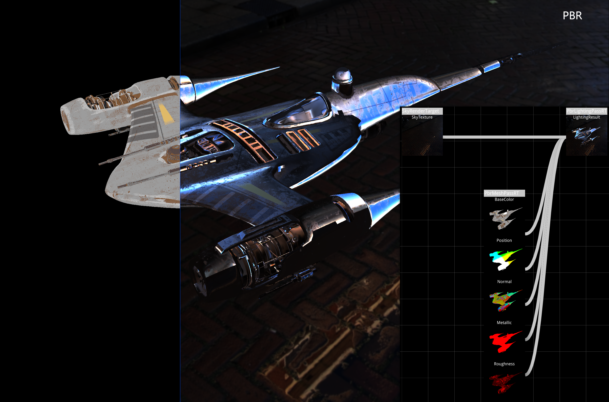
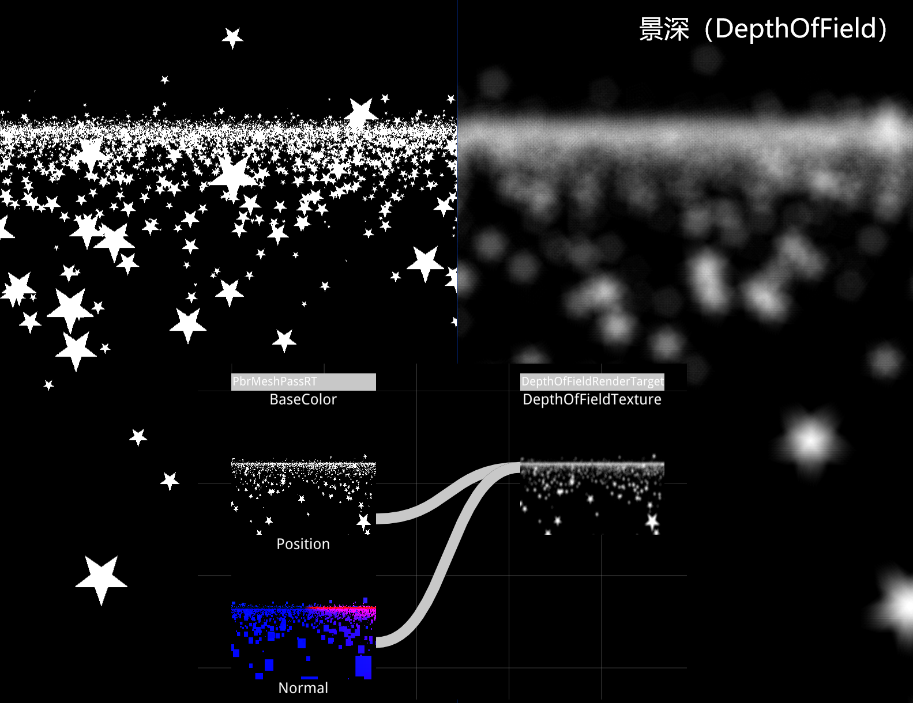
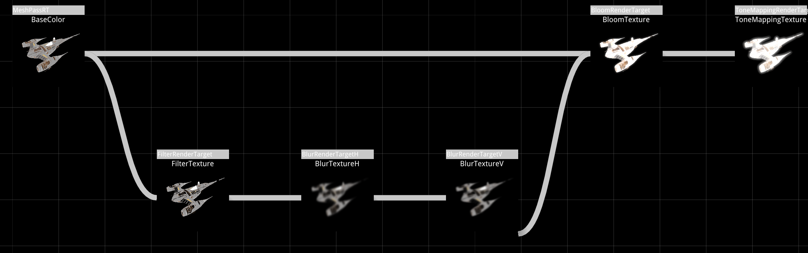
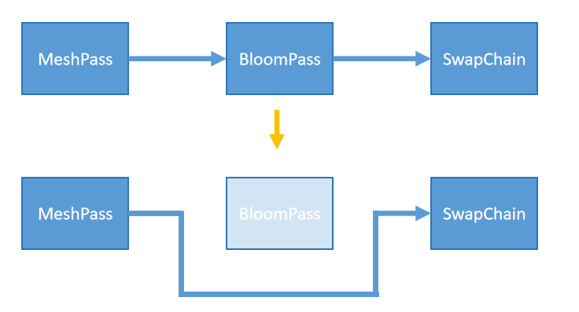
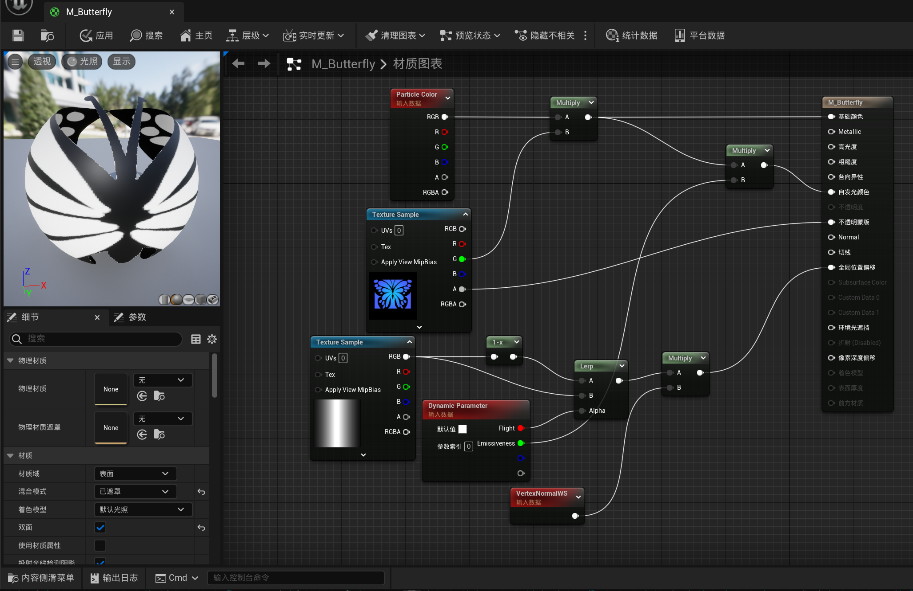
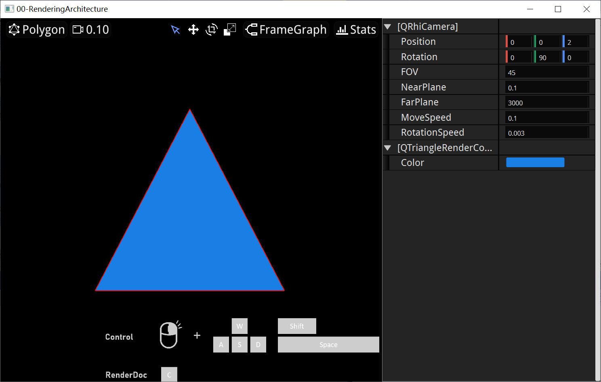

# 渲染架构

在之前的章节中，我们学会了如何使用 **QRhi** 完成图形的绘制，但图形渲染并非只是使用图形API那么简单，随着3D场景中图形复杂度的提升，直接使用RHI的接口编写 线性的逻辑 会让代码变得非常混乱，而为了让代码的组织结构更为合理，现代图形引擎都会在 RHI 的基础上，进行进一步的封装。

比如我们可以将流水线的执行封装到 **渲染项（RenderItem）** 里面，那整个渲染过程可能会是这样：

```C++
void onRenderTick(QRhiCommandBuffer* cmdBuffer){
    QRhiResourceUpdateBatch* batch = rhi->nextResourceUpdateBatch();
 
    for(auto item: renderItems){
        item->tryUpload(batch);
        item->updated(batch);
    }
    
    cmdBuffer->beginPass(renderTarget, clearColor, dsClearValue, batch);
   
    for(auto item: renderItems)
        item->draw(cmdBuffer);
    
    cmdBuffer->endPass();
}
```

这样我们就能够 很轻松组织 代码结构 来将 许多几何图形 绘制到 一张图像 上：


这个 **渲染过程（RenderPass）** 我们一般称之为 **BasePass** / **MeshPass** / **PrimitivePass** 。

该Pass的职责就是绘制3D场景中几乎全部的几何形体。

但仅仅通过MeshPass ，我们得到的图形效果往往是比较朴素的，虽然我们可以调整 Pass内部 渲染项 的 流水线着色逻辑 来丰富 图形效果（前向渲染），但在现代图形渲染中，我们会进行多帧（多Pass）的处理 来调整 整个画面 的效果（延迟渲染 + 后处理）。 

这么说可能有点难理解，但看完下面的图示，相信你就能明白了：






为了能够更好地支持这种多Pass的渲染逻辑，现代图形引擎也都封装了相应的结构，通常情况下，我们称其为 **Render Graph / Frame Graph / Scene Graph**

## RenderGraph

关于RenderGraph的详细描述，有很多优秀的文章，强烈建议大家去阅读一下：

- [不知名书杯 | 理解 Frame Graph](https://zhuanlan.zhihu.com/p/639001043)
- [向往 | 剖析虚幻渲染体系（11）- RDG](https://www.cnblogs.com/timlly/p/15217090.html)
- [丛越 | 游戏引擎随笔 0x03：可扩展的渲染管线架构](https://zhuanlan.zhihu.com/p/70668533)
- [Ubp.a | FrameGraph|设计&基于DX12实现](https://zhuanlan.zhihu.com/p/147207161)

可参考的实现主要有：

- [Unreal Engine | Render Dependency Graph](https://docs.unrealengine.com/5.3/en-US/render-dependency-graph-in-unreal-engine/)
- [Unity | Render Graph System](https://docs.unity3d.com/Packages/com.unity.render-pipelines.core@17.0/manual/render-graph-system.html)
- [O3DE | Pass System](https://docs.o3de.org/docs/atom-guide/dev-guide/passes/pass-system/)
- [Qt Quick | Scene Graph](https://doc.qt.io/qt-6/qtquick-visualcanvas-scenegraph.html)

笔者在该教程的代码中实现了一个简易的 RenderGraph ，下文主要以伪代码的形式，谈一下笔者的 设计思路 和 开发过程 遇到的问题

> 学习别人积淀的成果是一个非常大的挑战，因为我们没有遭遇过与开发者相同的困境，所以很难 设身处地 的思考，为什么要这么做~

RenderGraph的首要设计目标，是为了能够完成 渲染依赖图 的构建：



假如想实现这样的渲染结构，在代码层面，你会如何设计呢？

笔者首先对 **RenderPassNode** 进行了抽象：

``` c++
class IRenderPassNode{
    virtual void onRecrecteResource() = 0;  			 //在此处创建RenderPass所需的RHI资源
    virutal void onRenderTick(QRhiCommandBuffer*) = 0;	 //执行渲染逻辑
       
    virtual QVariant setupInputParam(QString) = 0;		 //由外部填充该Pass的输入参数
    virtual QVariant getOutputParam(QString) = 0;	 	 //由外部获取该Pass的输出参数
protected:
    QMap<QString,QVariant> mInputs;						 //输入参数
    QMap<QString,QVariant> mOutputs;					 //输出参数
}
```

在此基础上， **MeshPass** 的逻辑大概变成了这样：

``` c++
class QMeshPassNode: public IRenderPassNode {
public:
    void addRenderItem(...);
    void removeRenderItem(...);
public:
    QVector<RenderItem> mRenderItems;
    QRhiTextureRenderTarget mRenderTarget;
private:
    void onRecrecteResource() {
        createRenderTarger(mRenderTarget);
        mOutput["BaseColor"] = mRenderTarget.ColorAttachment0;		//注册输出参数
            
        for(auto item: mRenderItems){							    //创建所有Item的渲染资源
            item->createResources();
        }
    }
    
    void onRenderTick(QRhiCommandBuffer* cmdBuffer) override {
        QRhiResourceUpdateBatch* batch = rhi->nextResourceUpdateBatch();
        
        for(auto item: mRenderItems){				//上传和更新所有Item的资源
            item->tryUpload(batch);
            item->updated(batch);
        }

        cmdBuffer->beginPass(mRenderTarget, clearColor, dsClearValue, batch);

        for(auto item: mRenderItems)				//执行Item的绘制
            item->draw(cmdBuffer);

        cmdBuffer->endPass();
    }
}
```

再加一点其他的润色，笔者完成了第一个版本的 FrameGraph 结构：

``` c++
widget.setFrameGraph(
    QFrameGraph::Begin()
    .addPass(
        QMeshRenderPass::Create("MeshPass")				//创建MeshPass
        .addComponent(										//添加静态网格体组件
            QStaticMeshRenderComponent::Create("StaticMesh")
            .setStaticMesh(QStaticMesh::CreateFromFile(RESOURCE_DIR"/Model/mandalorian_ship/scene.gltf"))
            .setRotation(QVector3D(-90, 0, 0))
        )
    )
    .addPass(
        QPixelFilterRenderPass::Create("BrightPixels")						//该Pass用于过滤图像中亮度值超过1.0
        .setTextureIn_Src("MeshPass",QMeshRenderPass::Out::BaseColor)		//设置该Pass的输入为MeshPass输出的BaseColor
        .setFilterCode(R"(
				const float threshold = 1.0f;
				void main() {
					vec4 color = texture(uTexture, vUV);
					float value = max(max(color.r,color.g),color.b);
					outFragColor = (1-step(value, threshold)) * color * 100;
				}
			)")
    )
    .addPass(
        QBlurRenderPass::Create("Blur")												//该Pass用于模糊图像
        .setBlurIterations(1)
        .setTextureIn_Src("BrightPixels", QPixelFilterRenderPass::Out::Result)		//设置该Pass的输入为BrightPixels的输出结果
    )
    .addPass(
        QBloomRenderPass::Create("Bloom")											//该Pass用于混合原图像和泛光的图像
        .setTextureIn_Raw("MeshPass", QMeshRenderPass::Out::BaseColor)
        .setTextureIn_Blur("Blur", QBlurRenderPass::Out::Result)
    )
    .addPass(
        QToneMappingRenderPass::Create("ToneMapping")								//该Pass对图像进行色调映射
        .setTextureIn_Src("Bloom", QBloomRenderPass::Out::Result)
    )
    .end("ToneMapping", QToneMappingRenderPass::Out::Result)						//将色调映射的结果输出到屏幕上
)
```

该代码搭建了如下的RenderGraph：


这个实现可以说是非常简单，这得益于QRhi已经完成了RenderGraph的一些职责。

[上一节](https://italink.github.io/ModernGraphicsEngineGuide/01-GraphicsAPI/6.%E5%9B%BE%E5%BD%A2%E6%B8%B2%E6%9F%93%E8%BF%9B%E9%98%B6/#_2) 中我们提到： **现代图形API要求手动管理资源的同步** 。

现代图形引擎则会在RenderGraph中，分析资源的依赖关系，来自动管理资源的同步。

而在QRhi中，已经实现了这部分逻辑，所以我们无需关心。

但上述的实现并不完美：

- FrameGraph的构建位于主线程中，一次性创建过多的资源将造成UI的卡顿

- FrameGraph的结构固化，因为是一次创建整个FrameGraph，将其装配到渲染器中，现有的代码结构想要动态的调整渲染结构是一件很困难的事情，假如我能判断当前相机空间内不包含任何发光的物体，那么是否意味着可以把`BloomPass`给去掉？而去掉`BloomPass`其实就是将`BloomPass`的输入直接连接到之后的Pass上，就像是这样：

   

- 并没有很好的处理资源之间的依赖和重建，打个比方，假如窗口的尺寸发生变动，某些Pass中的RT就需要重建，而RT中的Texture重建，也就意味着之后使用该Texture的 **ShaderResourceBindings** 也需要重建，而当下的做法就很蠢：当窗口尺寸变动时，会重建整个FrameGraph中的所有资源。因为资源的创建全部放到了 **IRenderPassNode** 中的`onRecrecteResource`函数中，该函数包含了所有的资源创建，为了图省事就统一调用了它，虽然后面笔者增加了另一个抽象函数`onResizeAndLink`，在里面添加RT和Bindings的重建逻辑，但这部分结构依旧比较难用。

虽然这个FrameGraph很拉垮，但 "又不是不能用"：


> 要不是为了出这篇文章，我肯定是不会去爆肝重构的T.T

重构的接口方面主要参考了UE的RDG，上述代码在重构后变成了这样：

``` c++
class MyRenderer: public IRenderer {
	Q_OBJECT
	Q_PROPERTY_VAR(int, BlurIterations) = 2;
	Q_PROPERTY_VAR(int, BlurSize) = 20;
	Q_PROPERTY_VAR(int, DownSampleCount) = 4;

	Q_PROPERTY_VAR(float, Gamma) = 2.2f;
	Q_PROPERTY_VAR(float, Exposure) = 1.f;
	Q_PROPERTY_VAR(float, PureWhite) = 1.f;

	Q_CLASSINFO("BlurIterations", "Min=1,Max=8")
private:
	QStaticMeshRenderComponent mStaticComp;
public:
	MyRenderer()
		: IRenderer({ QRhi::Vulkan })
	{
		mStaticComp.setStaticMesh(QStaticMesh::CreateFromFile(RESOURCE_DIR"/Model/mandalorian_ship/scene.gltf"));
		mStaticComp.setRotation(QVector3D(-90, 0, 0));

		addComponent(&mStaticComp);

		getCamera()->setPosition(QVector3D(20, 15, 12));
		getCamera()->setRotation(QVector3D(-30, 145, 0));
	}
protected:
	void setupGraph(QRenderGraphBuilder& graphBuilder) override {
		QMeshPassBuilder::Output meshOut
			= graphBuilder.addPassBuilder<QMeshPassBuilder>("MeshPass");

		QPixelFilterPassBuilder::Output filterOut = graphBuilder.addPassBuilder<QPixelFilterPassBuilder>("FilterPass")
			.setBaseColorTexture(meshOut.BaseColor)
			.setFilterCode(R"(
				const float threshold = 0.5f;
				void main() {
					vec4 color = texture(uTexture, vUV);
					float value = max(max(color.r,color.g),color.b);
					outFragColor = (1-step(value, threshold)) * color;
				}
			)");

		QBlurPassBuilder::Output blurOut = graphBuilder.addPassBuilder<QBlurPassBuilder>("BlurPass")
			.setBaseColorTexture(filterOut.FilterResult)
			.setBlurIterations(BlurIterations)
			.setBlurSize(BlurSize)
			.setDownSampleCount(DownSampleCount);

		QBloomPassBuilder::Output bloomOut = graphBuilder.addPassBuilder<QBloomPassBuilder>("BloomPass")
			.setBaseColorTexture(meshOut.BaseColor)
			.setBlurTexture(blurOut.BlurResult);

		QToneMappingPassBuilder::Output tonemappingOut = graphBuilder.addPassBuilder<QToneMappingPassBuilder>("ToneMappingPass")
			.setBaseColorTexture(bloomOut.BloomResult)
			.setExposure(Exposure)
			.setGamma(Gamma)
			.setPureWhite(PureWhite);

		QOutputPassBuilder::Output cout
			= graphBuilder.addPassBuilder<QOutputPassBuilder>("OutputPass")
			.setInitialTexture(tonemappingOut.ToneMappingReslut);
	}
};

int main(int argc, char** argv) {
	QEngineApplication app(argc, argv);
	QRenderWidget widget(new MyRenderer());
	widget.showMaximized();
	return app.exec();
}
```

其中比较大的变更如下：

**RenderComponent** 存储在 **Renderer** 中，而不是像之前那样`MeshPass.addComponent`

支持多线程，在RenderThread中驱动 **Renderer** **每帧** 去执行 `setupGraph` 函数，该函数主要职责是：

- 利用 **QRenderGraphBuilder** 提供的一系列以`setup`开头的函数去创建资源描述，这些函数会 **尝试创建** RHI资源，并标记失效（跟之前参数不一致）的资源。

  ``` c++
  void setupBuffer(QRhiBufferRef& buffer, const QByteArray& name, QRhiBuffer::Type type, QRhiBuffer::UsageFlags usages, int size);
  
  void setupTexture(QRhiTextureRef& texture, const QByteArray& name, QRhiTexture::Format format, const QSize& pixelSize, int sampleCount = 1, QRhiTexture::Flags flags = {});
  
  void setupSampler(QRhiSamplerRef& sampler,
                    const QByteArray& name,
                    QRhiSampler::Filter magFilter,
                    QRhiSampler::Filter minFilter,
                    QRhiSampler::Filter mipmapMode,
                    QRhiSampler::AddressMode addressU,
                    QRhiSampler::AddressMode addressV,
                    QRhiSampler::AddressMode addressW = QRhiSampler::Repeat);
  
  void setupShaderResourceBindings(QRhiShaderResourceBindingsRef& bindings, const QByteArray& name, QVector<QRhiShaderResourceBinding> binds);
  
  void setupRenderBuffer(QRhiRenderBufferRef& renderBuffer,
                         const QByteArray& name,
                         QRhiRenderBuffer::Type type,
                         const QSize& pixelSize,
                         int sampleCount = 1,
                         QRhiRenderBuffer::Flags flags = {},
                         QRhiTexture::Format backingFormatHint = QRhiTexture::UnknownFormat);
  
  void setupRenderTarget(QRhiTextureRenderTargetRef& renderTarget,
                         const QByteArray& name,
                         const QRhiTextureRenderTargetDescription& desc,
                         QRhiTextureRenderTarget::Flags flags = {});
  
  void setupGraphicsPipeline(QRhiGraphicsPipelineRef& pipeline,
                             const QByteArray& name,
                             const QRhiGraphicsPipelineState& state);
  
  void setupComputePipeline(QRhiComputePipelineRef& pipeline,
                            const QByteArray& name,
                            const QRhiComputePipelineState& state);
  ```

- 通过`addPass`来添加真正的渲染逻辑

  ``` c++
  void addPass(std::function<void(QRhiCommandBuffer*)> executor)
  ```

- 为了 **便于** Pass资源和功能的划分，提供了一个`IRenderPassBuilder`的抽象类，它的结构如下：

  ``` c++
  class IRenderPassBuilder {
  	friend class QRenderGraphBuilder;
  	virtual void setup(QRenderGraphBuilder& builder) = 0;
  	virtual void execute(QRhiCommandBuffer* cmdBuffer) = 0;
  };
  ```

  在`setupGraph`中可以通过函数`QRenderGraphBuilder::addPassBuilder`来添加：

  ``` C++
  void setupGraph(QRenderGraphBuilder& graphBuilder) override {
      QMeshPassBuilder::Output meshOut
          = graphBuilder.addPassBuilder<QMeshPassBuilder>("MeshPass");
  }
  ```

  它本质上等价于：

  ``` c++
  void setupGraph(QRenderGraphBuilder& graphBuilder) override {
      mMeshPassBuilder->setup(graphBuilder);
      mMeshPassBuilder->addPass(std::bind(&QMeshPassBuilder::execute, mMeshPassBuilder, std::placeholders::_1));
      QMeshPassBuilder::Output meshOut = mMeshPassBuilder->getOutput();
  }
  ```

我们可以按这样的结构来定义 **IRenderPassBuilder**

``` c++
class QPixelFilterPassBuilder : public IRenderPassBuilder {
public:
	QPixelFilterPassBuilder();

	QRP_INPUT_BEGIN(QPixelFilterPassBuilder)					//定义输入
		QRP_INPUT_ATTR(QRhiTextureRef, BaseColorTexture);		
		QRP_INPUT_ATTR(QString, FilterCode);
	QRP_INPUT_END()

	QRP_OUTPUT_BEGIN(QPixelFilterPassBuilder)					//定义输出
		QRP_OUTPUT_ATTR(QRhiTextureRef, FilterResult);
	QRP_OUTPUT_END()
public:
	void setup(QRenderGraphBuilder& builder) override			//装配各种资源描述，读取输入，填充输出
	{
		if (mFilterCode != mInput._FilterCode) {				//获取输入
			mFilterCode = mInput._FilterCode;
			mFilterFS = QRhiHelper::newShaderFromCode(QShader::FragmentStage, R"(#version 450
				layout (binding = 0) uniform sampler2D uTexture;
				layout (location = 0) in vec2 vUV;
				layout (location = 0) out vec4 outFragColor; )"
				+ mFilterCode.toLocal8Bit());
		}
		if (!mFilterFS.isValid())
			return;

       
		builder.setupTexture(mRT.colorAttachment, "FilterTexture", mInput._BaseColorTexture->format(), mInput._BaseColorTexture->pixelSize(), 1, QRhiTexture::RenderTarget | QRhiTexture::UsedAsTransferSource);
		builder.setupRenderTarget(mRT.renderTarget, "FilterRenderTarget", { mRT.colorAttachment.get() });
		builder.setupSampler(mSampler, "FilterSampler",
			QRhiSampler::Linear,
			QRhiSampler::Linear,
			QRhiSampler::None,
			QRhiSampler::ClampToEdge,
			QRhiSampler::ClampToEdge);

		builder.setupShaderResourceBindings(mBindings, "FilterBindings", {
			QRhiShaderResourceBinding::sampledTexture(0,QRhiShaderResourceBinding::FragmentStage,mInput._BaseColorTexture.get(), mSampler.get()),
			});

		QRhiGraphicsPipelineState PSO;
		PSO.sampleCount = mRT.renderTarget->sampleCount();
		PSO.shaderResourceBindings = mBindings.get();
		PSO.renderPassDesc = mRT.renderTarget->renderPassDescriptor();
		PSO.shaderStages = {
			{ QRhiShaderStage::Vertex, builder.getFullScreenVS() },
			{ QRhiShaderStage::Fragment, mFilterFS }
		};
		builder.setupGraphicsPipeline(mPipeline, "FilterPipeline", PSO);
		mOutput.FilterResult = mRT.colorAttachment;				//填充输出
	}

	void execute(QRhiCommandBuffer* cmdBuffer) override			//执行渲染逻辑
	{
		if (!mFilterFS.isValid())
			return;
		cmdBuffer->beginPass(mRT.renderTarget.get(), QColor::fromRgbF(0.0f, 0.0f, 0.0f, 0.0f), { 1.0f, 0 });
		cmdBuffer->setGraphicsPipeline(mPipeline.get());
		cmdBuffer->setViewport(QRhiViewport(0, 0, mRT.renderTarget->pixelSize().width(), mRT.renderTarget->pixelSize().height()));
		cmdBuffer->setShaderResources(mBindings.get());
		cmdBuffer->draw(4);
		cmdBuffer->endPass();
	}

private:
	QShader mFilterFS;
	QString mFilterCode;
	struct RTResource {
		QRhiTextureRef colorAttachment;
		QRhiTextureRenderTargetRef renderTarget;
	};
	RTResource mRT;
	QRhiGraphicsPipelineRef mPipeline;
	QRhiSamplerRef mSampler;
	QRhiShaderResourceBindingsRef mBindings;
};
```

### 设计原则

综上，RenderGraph的主要设计原则有：

- 为了能够让渲染的结构是 **动态可变的** ，会有一个`Setup`阶段， **每帧** 都在重建RenderGraph（只是 **创建资源描述** 和 **组织依赖关系** ，并添加 **Executor** 逻辑）
- 在`Setup`完毕之后，进行`Compile`过程，此时我们可以拿到 **当前帧** 所有的资源描述和依赖关系，这个时候才会根据 资源描述 创建（或从池中复用）真正的 **RHI资源** ，并根据依赖资源间的依赖关系，在 **Executors 之间 穿插 资源同步的Execute指令** ，并处理一些其他的执行优化。
- 在`Compile`阶段之后，进入到`Execute`阶段，此时所有的 **资源描述句柄** 都对应了实际的RHI资源，所有的RHI相关的逻辑都应该在 **Executor** 中。
- `Execute`阶段执行结束，会 **清理资源描述和RHI资源的绑定** ，RHI资源会回归到池中，因为RenderGraph的每次执行之间不存在持久性，这意味着在RenderGraph执行一遍`Setup`创建的 **资源描述 不需要延续到下一帧** （一些特例除外）。

用QRhi去实现RenderGraph的结构并不困难，因为它本身就已经做了资源的同步，而使用`QRhi::new...()`得到的就是 资源描述，只有当调用`create`函数时才真正创建RHI资源，由于QRhi的实现有些特殊，因此笔者并没有完全遵照上述的设计原则去管理资源，关键还是照顾当下的使用需求。

## MeshPass

MeshPass是一个非常特殊的RenderPass，因为三维空间的 几何图形 几乎都在这个Pass中进行绘制，而其他RenderPass的重点往往只是对图像进行处理，而不是几何图元的绘制。

在上文的设计思想下，我们的MeshPass的`execute`函数大概是这个样子：

``` c++
void execute(QRhiCommandBuffer* cmdBuffer){
    QRhiResourceUpdateBatch* batch = rhi->nextResourceUpdateBatch();
 
    for(auto item: renderItems){
        item->tryCreate(rhi,mRenderTarget);
        item->tryUpload(batch);
        item->updated(batch);
    }
    
    cmdBuffer->beginPass(mRenderTarget, clearColor, dsClearValue, batch);
   
    for(auto item: renderItems)
        item->draw(cmdBuffer,viewport);
    
    cmdBuffer->endPass();
}
```

而 **IRenderItem** 的抽象结构大概是这样的：

``` c++
class IRenderItem{
protected:
    virtual void create(QRhi* rhi, QRhiRenderTaget* rt) = 0;
    virtual void upload(QRhiResourceUpdateBatch* batch) = 0;
public:
    void tryCreate(QRhi* rhi,QRhiRenderTaget* rt){ 
        if(needCreate())
            create(rhi,rt);
    }    
    void tryUpload(QRhiResourceUpdateBatch* batch{ 
        if(needUpload())
            upload(batch);
    }
    virtual void updated(QRhiResourceUpdateBatch* batch) = 0;
    virtual void draw(QRhi* commandBuffer, QRhiViewport viewport) = 0;
}
```

如果我们想实现一个能绘制三角形的RenderItem，只需实现这样的结构：

``` c++
class QTriangleRenderItem: public IRenderItem{
public: 
   	QSharedPointer<QRhiBuffer> mVertexBuffer;
	QSharedPointer<QRhiShaderResourceBindings> mShaderBindings;	
    QScopedPointer<QRhiGraphicsPipeline> mPipeline;	
protected:
    void create(QRhi* rhi, QRhiRenderTaget* rt) override{
        mVertexBuffer = ...;
        mShaderBindings = ...;
        mPipeline = ...;
    }
    void upload(QRhiResourceUpdateBatch* batch) override{
       	batch->uploadStaticBuffer(mVertexBuffer.get(), VertexData);	
    }
    void updated(QRhiResourceUpdateBatch* batch) override{}
    void draw(QRhi* cmdBuffer, QRhiViewport viewport) override{
        cmdBuffer->setGraphicsPipeline(mPipeline.get());						
		cmdBuffer->setViewport(viewport);		
		cmdBuffer->setShaderResources();										
		const QRhiCommandBuffer::VertexInput vertexInput(mVertexBuffer.get(), 0);	
		cmdBuffer->setVertexInput(0, 1, &vertexInput);								
		cmdBuffer->draw(3);	
    }
}
```

这样的结构扩展起来非常容易，但随着一些功能需求的出现，问题才慢慢暴露出来：

- 有可能存在多种类型的MeshPass，比如正常的MeshPass的RT带有一个颜色附件，但延迟渲染的MeshPass中可能带有多个附件，比如PBR的就有`BaseColor`，`Position`，`Normal`，`Metallic`，`Roughness`，MeshPass的RT将会影响到 RenderItem 中流水线的 **SampleCount** ， **RenderPassDescriptor** ， **TargetBlends** ，以及我们要在 **FragmentShader** 中如何填充对应的颜色附件。
- 我们可能希望在全局复用Render Item的流水线数据，生成新的流水线，并顶替掉其中一些状态，来完成某些功能，比如：
  - 制作鼠标点选，我们可以在一张RT上，绘制所有Item的ID，当鼠标点击时，将点击的像素回读到CPU，一比对就能知道我们点击的是哪个Item，这需要我们覆盖流水线的 **FragmentShader** 和 **StencilState**
  - 制作ShadowMap，需要从相机视角绘制场景的深度，这需要我们覆盖流水线的 **ShaderResourceBindings（ViewMatrix）** 和 **FragmentShader**

所以在设计 RenderItem 的时候，如果直接操作 RHI 的资源 和 指令，将会使我们后续的一些功能扩展受限。

为此我们得进一步封装，让流水线的使用具备一定弹性。

这里笔者封装的结构是 **QPrimitiveRenderProxy** ，它提供了以下功能：

- 包裹 **QRhiGraphicsPipeline** 的创建，提供 MeshPass Render Target 适配功能。
- 封装 **QRhiUniformBlock** ，可以以简单的方式快速为流水线创建Uniform参数。
- 封装纹理资源，可以自动添加绑定，并生成Shader定义。
- 将 **Create** ， **Upload** ， **Update** ， **Draw** 的逻辑作为回调函数存储起来，本质上它也是一种可被复用的状态。
- 提供SubPipeline的机制，可以以Proxy为模板，创建子管线，顶替掉一些流水线状态， 当Proxy发生变动时，SubPipeline也会重建。

在此基础上，如果想完成一个三角形的绘制，只需编写这样的代码：

``` c++
class QTriangleRenderComponent: public IRenderComponent {			// IRenderComponent对应文章中的IRenderItem
	Q_OBJECT
	Q_PROPERTY(QColor Color READ getColor WRITE setColor)
public:
	QColor getColor() const { return mColor; }
	void setColor(QColor val) { mColor = val; }
private:
	QScopedPointer<QRhiBuffer> mVertexBuffer;
	QSharedPointer<QPrimitiveRenderProxy> mProxy;
	QColor mColor = QColor::fromRgbF(0.1f, 0.5f, 0.9f, 1.0f);
protected:
	void onRebuildResource() override {
		mVertexBuffer.reset(mRhi->newBuffer(QRhiBuffer::Immutable, QRhiBuffer::VertexBuffer, sizeof(VertexData)));
		mVertexBuffer->create();

		mProxy = newPrimitiveRenderProxy();

		mProxy->addUniformBlock(QRhiShaderStage::Fragment, "UBO")
			->addParam("Color", mColor);

		mProxy->setInputBindings({
			QRhiVertexInputBindingEx(mVertexBuffer.get(), 2 * sizeof(float))
		});

		mProxy->setInputAttribute({
			QRhiVertexInputAttributeEx("inPosition",0, 0, QRhiVertexInputAttribute::Float2, 0),
		});
		mProxy->setShaderMainCode(QRhiShaderStage::Vertex, R"(
			void main(){
				gl_Position = vec4(inPosition, 0.0f,1.0f);
			}
		)");
		mProxy->setShaderMainCode(QRhiShaderStage::Fragment, QString(R"(
			void main(){
				%1
			})")
			.arg(hasColorAttachment("BaseColor")? "BaseColor = UBO.Color;" : "")
			.toLocal8Bit()
		);
		mProxy->setOnUpload([this](QRhiResourceUpdateBatch* batch) {
			batch->uploadStaticBuffer(mVertexBuffer.get(), VertexData);
		});
		mProxy->setOnUpdate([this](QRhiResourceUpdateBatch* batch, const QPrimitiveRenderProxy::UniformBlocks& blocks, const QPrimitiveRenderProxy::UpdateContext& ctx) {
			blocks["UBO"]->setParamValue("Color", QVariant::fromValue(mColor));
		});
		mProxy->setOnDraw([this](QRhiCommandBuffer* cmdBuffer) {
			const QRhiCommandBuffer::VertexInput vertexBindings(mVertexBuffer.get(), 0);
			cmdBuffer->setVertexInput(0, 1, &vertexBindings);
			cmdBuffer->draw(3);
		});
    }
};
```

### Material

关于材质，笔者首次接触这个概念是在 [Learn OpenGL](https://learnopengl-cn.github.io/02%20Lighting/03%20Materials/) ，在当时的理解中，材质就是一个这样的UniformBlock：

``` c++
struct Material {
    vec3 ambient;
    vec3 diffuse;
    vec3 specular;
    float shininess;
}; 
```

但在接触过一些引擎之后，才发现材质并没有那么简单：

- [Unreal Engine | Material](https://docs.unrealengine.com/5.3/en-US/unreal-engine-materials/) 

- [O3DE | Material](https://docs.o3de.org/docs/atom-guide/look-dev/materials/material-system/)

- [Unity | Material](https://docs.unity3d.com/Manual/materials-introduction.html)

- [Godot | Material](https://docs.godotengine.org/en/stable/classes/class_material.html)

在各个引擎中材质系统实现都有所差异，但它们都遵循这一原则：材质定义了图形的表面属性，它可以被视为控制物体视觉外观的"皮肤"。

Unreal Engine 中的材质系统无疑是最为强大的，它的材质系统涵盖了所有控制图形外观功能，它提供一系列的参数去控制流水线 裁剪测试，深度测试，模板测试，混合模式，背面剔除...

针对不同的 **着色模型（Shading Model）** 提供 材质表达式插槽，它提供了大量的材质函数节点，可以将其转换为对应的Shader代码，还能轻松创建着色器资源（Buffer，Sampler和Texture），并自动创建着色器资源绑定。



材质系统的架构需要考虑引擎的整个渲染体系，由于本教程更多的是进行渲染尝试（主要是因为没有精力），因此在笔者封装的 **QMaterial** 中，它只是一个简单提供参数和纹理的结构：

``` C++
struct QMaterial {
	QMap<QString, QVariant> mProperties;
};
```

在 **QPrimitiveRenderProxy** 中，添加材质会自动为这些属性创建 **UniformBuffer** 和 **Texture** ，供 MeshPass 中构建 **RenderComponet** 时使用

关于具体的使用，请参考：

- https://github.com/Italink/ModernGraphicsEngineGuide/blob/main/Source/2-EngineTechnology/00-RenderingArchitecture/Source/main.cpp



``` c++
#include "QEngineApplication.h"
#include "QRenderWidget.h"
#include "Render/IRenderComponent.h"
#include "Render/RenderGraph/PassBuilder/QMeshPassBuilder.h"
#include "Render/PassBuilder/QOutputPassBuilder.h"

static float VertexData[] = {
	//position(xy)	
	 0.0f,  -0.5f,
	-0.5f,   0.5f,
	 0.5f,   0.5f,
};

class QTriangleRenderComponent: public IRenderComponent {
	Q_OBJECT
	Q_PROPERTY(QColor Color READ getColor WRITE setColor)
public:
	QColor getColor() const { return mColor; }
	void setColor(QColor val) { mColor = val; }
private:
	QScopedPointer<QRhiBuffer> mVertexBuffer;
	QSharedPointer<QPrimitiveRenderProxy> mProxy;
	QColor mColor = QColor::fromRgbF(0.1f, 0.5f, 0.9f, 1.0f);
protected:
	void onRebuildResource() override {
		mVertexBuffer.reset(mRhi->newBuffer(QRhiBuffer::Immutable, QRhiBuffer::VertexBuffer, sizeof(VertexData)));
		mVertexBuffer->create();

		mProxy = newPrimitiveRenderProxy();

		mProxy->addUniformBlock(QRhiShaderStage::Fragment, "UBO")
			->addParam("Color", mColor);

		mProxy->setInputBindings({
			QRhiVertexInputBindingEx(mVertexBuffer.get(),2 * sizeof(float))
		});

		mProxy->setInputAttribute({
			QRhiVertexInputAttributeEx("inPosition",0, 0, QRhiVertexInputAttribute::Float2, 0),
		});
		mProxy->setShaderMainCode(QRhiShaderStage::Vertex, R"(
			void main(){
				gl_Position =vec4(inPosition, 0.0f,1.0f);
			}
		)");
		mProxy->setShaderMainCode(QRhiShaderStage::Fragment, QString(R"(
			void main(){
				%1
			})")
			.arg(hasColorAttachment("BaseColor")? "BaseColor = UBO.Color;" : "")
			.toLocal8Bit()
		);
		mProxy->setOnUpload([this](QRhiResourceUpdateBatch* batch) {
			batch->uploadStaticBuffer(mVertexBuffer.get(), VertexData);
		});
		mProxy->setOnUpdate([this](QRhiResourceUpdateBatch* batch, const QPrimitiveRenderProxy::UniformBlocks& blocks, const QPrimitiveRenderProxy::UpdateContext& ctx) {
			blocks["UBO"]->setParamValue("Color", QVariant::fromValue(mColor));
		});
		mProxy->setOnDraw([this](QRhiCommandBuffer* cmdBuffer) {
			const QRhiCommandBuffer::VertexInput vertexBindings(mVertexBuffer.get(), 0);
			cmdBuffer->setVertexInput(0, 1, &vertexBindings);
			cmdBuffer->draw(3);
		});
    }
};

class QOutliningPassBuilder : public IRenderPassBuilder {
	QRP_INPUT_BEGIN(QOutliningPassBuilder)
		QRP_INPUT_ATTR(QRhiTextureRef, BaseColor);
	QRP_INPUT_END()

	QRP_OUTPUT_BEGIN(QOutliningPassBuilder)
		QRP_OUTPUT_ATTR(QRhiTextureRef, OutliningResult)
	QRP_OUTPUT_END()
private:
	QRhiTextureRef mColorAttachment;
	QRhiTextureRenderTargetRef mRenderTarget;
	QShader mOutliningFS;
	QRhiSamplerRef mSampler;
	QRhiShaderResourceBindingsRef mOutliningBindings;
	QRhiGraphicsPipelineRef mOutliningPipeline;
public:
	QOutliningPassBuilder() {
		mOutliningFS = QRhiHelper::newShaderFromCode(QShader::FragmentStage, R"(#version 450
			layout (location = 0) in vec2 vUV;
			layout (location = 0) out vec4 outFragColor;

			layout (binding = 0) uniform sampler2D uBaseColor;

			void main() {
				vec2 texOffset = 1.0 / textureSize(uBaseColor, 0);		// gets size of single texel
		
				vec3 maxdiff = vec3(0.f);
				vec3 center = texture(uBaseColor,vUV).rgb;
				
				maxdiff = max(maxdiff, abs(texture(uBaseColor,vUV+vec2(texOffset.x,0)).rgb - center));
				maxdiff = max(maxdiff, abs(texture(uBaseColor,vUV-vec2(texOffset.x,0)).rgb - center));
				maxdiff = max(maxdiff, abs(texture(uBaseColor,vUV+vec2(0,texOffset.y)).rgb - center));
				maxdiff = max(maxdiff, abs(texture(uBaseColor,vUV-vec2(0,texOffset.y)).rgb - center));

				const vec4 outliningColor = vec4(1.0,0.0,0.0,1.0);
				
				outFragColor = length(maxdiff) > 0.1 ? outliningColor : vec4(center,1.0f);

			}
		)");
	}
	void setup(QRenderGraphBuilder& builder) override {
		builder.setupTexture(mColorAttachment, "Outlining", QRhiTexture::Format::RGBA32F, mInput._BaseColor->pixelSize(), 1, QRhiTexture::RenderTarget | QRhiTexture::UsedAsTransferSource);
		builder.setupRenderTarget(mRenderTarget, "OutliningRT", QRhiTextureRenderTargetDescription(mColorAttachment.get()));

		builder.setupSampler(mSampler, "OutliningSampler", QRhiSampler::Nearest, QRhiSampler::Nearest, QRhiSampler::None, QRhiSampler::ClampToEdge, QRhiSampler::ClampToEdge, QRhiSampler::ClampToEdge);

		builder.setupShaderResourceBindings(mOutliningBindings, "OutliningBindings", {
			QRhiShaderResourceBinding::sampledTexture(0, QRhiShaderResourceBinding::FragmentStage,mInput._BaseColor.get() ,mSampler.get()),
		});
		QRhiGraphicsPipelineState PSO;
		PSO.shaderResourceBindings = mOutliningBindings.get();
		PSO.sampleCount = mRenderTarget->sampleCount();
		PSO.renderPassDesc = mRenderTarget->renderPassDescriptor();
		QRhiGraphicsPipeline::TargetBlend targetBlends;
		targetBlends.enable = true;
		PSO.targetBlends = { targetBlends };
		PSO.shaderStages = {
			QRhiShaderStage(QRhiShaderStage::Vertex, builder.getFullScreenVS()),
			QRhiShaderStage(QRhiShaderStage::Fragment, mOutliningFS)
		};
		builder.setupGraphicsPipeline(mOutliningPipeline, "OutliningPipeline", PSO);

		mOutput.OutliningResult = mColorAttachment;
	}
	void execute(QRhiCommandBuffer* cmdBuffer) override {
		const QColor clearColor = QColor::fromRgbF(0.0f, 0.0f, 0.0f, 1.0f);
		const QRhiDepthStencilClearValue dsClearValue = { 1.0f,0 };
		cmdBuffer->beginPass(mRenderTarget.get(), clearColor, dsClearValue);
		cmdBuffer->setGraphicsPipeline(mOutliningPipeline.get());
		cmdBuffer->setViewport(QRhiViewport(0, 0, mRenderTarget->pixelSize().width(), mRenderTarget->pixelSize().height()));
		cmdBuffer->setShaderResources(mOutliningBindings.get());
		cmdBuffer->draw(4);
		cmdBuffer->endPass();
	}
};

class MyRenderer : public IRenderer {
private:
	QTriangleRenderComponent mComp;
public:
	MyRenderer()
		: IRenderer({QRhi::Vulkan})
	{
		addComponent(&mComp);
	}
protected:
	void setupGraph(QRenderGraphBuilder& graphBuilder) override {
		QMeshPassBuilder::Output meshPassOut = graphBuilder.addPassBuilder<QMeshPassBuilder>("MeshPass");

		QOutliningPassBuilder::Output outliningOut = graphBuilder.addPassBuilder<QOutliningPassBuilder>("OutliningPass")
			.setBaseColor(meshPassOut.BaseColor);

		QOutputPassBuilder::Output ret = graphBuilder.addPassBuilder<QOutputPassBuilder>("OutputPass")
			.setInitialTexture(outliningOut.OutliningResult);
	}
};

int main(int argc, char **argv){
	qputenv("QSG_INFO", "1");
	QEngineApplication app(argc, argv);
	QRenderWidget widget(new MyRenderer());
	widget.showMaximized();
    return app.exec();
}

#include "main.moc"
```

