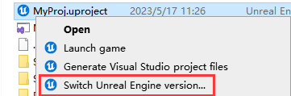
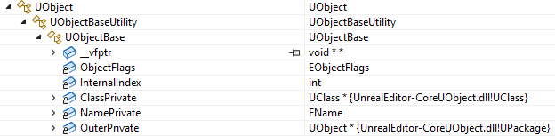
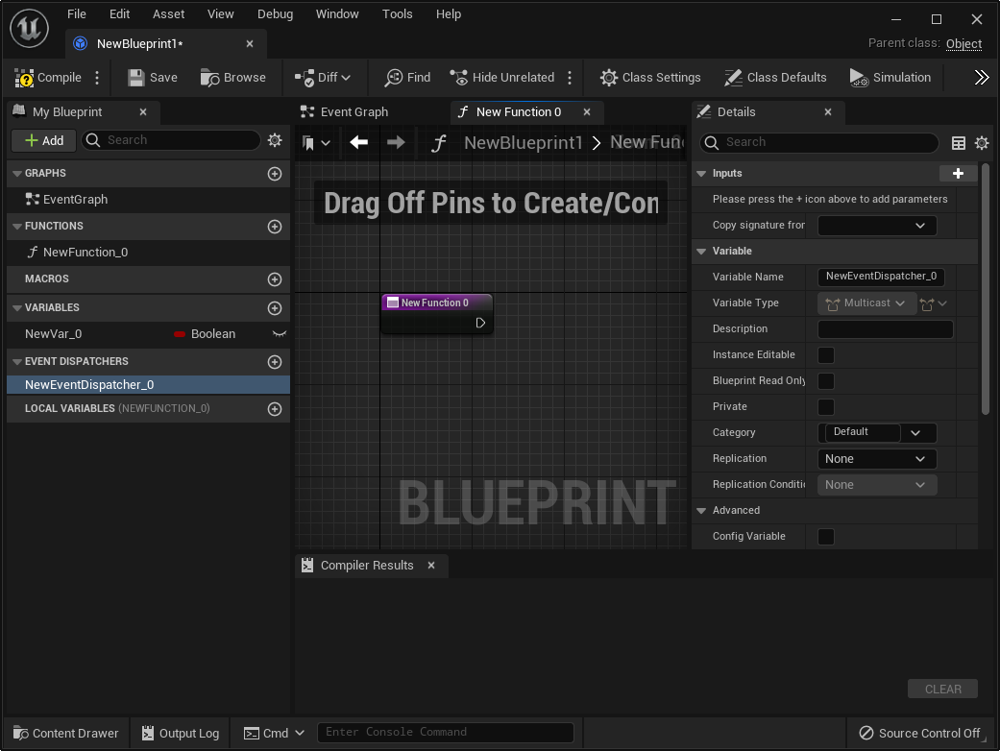
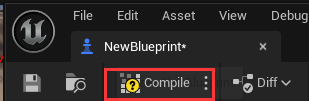

# Unreal Engine C++ 编程文档

## 前言

**Unreal Engine** 是一个由 C++ 编写的 强大引擎，但由于 **构建工具（UBT）** 和 **反射编译器（UHT）** 的存在 ，导致它有着独立于C++标准的语法，因此网友们也戏称它为 **U++** 。

不仅语法上存在一定差异，Unreal Engine下的开发流程也与平常的C++开发流程大相径庭。举例来说，STL标准库就像是一个工具箱（Toolkit）， **We use it to develop** ，而 Unreal Eninge 则更像是一个开发平台（Platform）， **We develop based on it** 。

当下U++教程和书籍并不多，其中对开发者而言作用较大的系列文章有：

- [大象无形：虚幻引擎程序设计浅析](https://book.douban.com/subject/27033749/)
- [UE4开发指南 - Gamedev Guide](https://ikrima.dev/ue4guide/)
- [循迹研究室 - 查利鹏](https://imzlp.com/)
- [剖析虚幻渲染体系 - 向往](https://www.cnblogs.com/timlly/p/13512787.html)
- [InsideUE - 大钊](https://zhuanlan.zhihu.com/p/22813908)

Unreal Engine 匮乏的文档和晦涩的代码对C++初学者而言几乎就是一道天堑，不可逾越，这是因为Unreal Engine这种工业级别的项目有着许多的开发人员，它的代码体量庞大，且迭代很快，想要整理和归纳它的发展过程是一件非常困难的事情。

笔者翻阅了一些U++的视频教程，比较零碎，大多是一些披着UE皮的C++基础教程，介绍的内容有限，且存在比较多的盲区，学习收益并不是很大。

> 如果有发现好的教程，小伙伴也可以在评论区推荐~

想要上手Unreal Engine，往往需要具备中大型C++项目的工程能力，可以明确的说， **它并不适合C++初学者**

如果你是一个还在上学的学生，机缘巧合下发现了Unreal Engine这么一个神奇的东西，被它绚丽的画面效果所吸引，心血来潮想要学习U++开发，那么你应该思考一下，自己除了会刷题和写论文，是否还具备以下技能：

- 熟悉 C++ 的工程构建
- 对引擎中的各个子模块有一定认知，具备中大型项目源码的阅读能力

如果没有，那么笔者建议你再静下心来好好打磨一下，而不是硬着头皮直接上

基础得经历长年打磨才能变得牢靠，而技术也是一点一点地慢慢积累，才能一层一层地逐渐搭高，不能想着什么弯道超车，听别人吹嘘谁谁谁，随随便便折腾几下，技术就多么多么牛，但实际上， **在工业界，没有不努力的天才** ，至少在笔者所敬重的人中，无一例外，而技术并无强弱之分，大多时候无非是 **闻道有先后，术业有专攻**

拿笔者的经历来说，笔者在三年前学过的一段时间U++，当时是把官方文档给过了一遍，然后照着这个教程敲了一遍：

- https://docs.unrealengine.com/5.2/zh-CN/unreal-engine-cpp-programming-tutorials/

过完之后迷迷糊糊的，感觉很多代码莫名其妙，有太多知识雾区，干脆放弃了，倒不如去学一些自己能够看得见摸得着的东西，所以去看了 Qt，CMake，OpenGL，一些图形学知识和数字信号的东西，然后做了它：

- [音频可视化图形引擎—Specinker](https://blog.csdn.net/qq_40946921/article/details/104124455/)

当我能熟练掌握这些技能之后，再回头去看 Unreal Engine 时，哇，一片明朗~

当看到 **UBT（Unreal Build Tool）** 的时候，哦，原来它的用途跟CMake一样，用来管理工程构建，可以利用它去做这些操作：

- 给构建目标添加 **依赖库（Library** ）， **包含目录（Include Directories）** ， **宏定义（Definitions）**
- 设置编译器配置
- 执行构建脚本

瞄见 **UHT（Unreal Header Tool）** 的时候，我想到了Qt的Moc（Meta Object Compiler），工作流程就是扫描代码头文件，得到一些信息，然后生成新的代码文件添加到构建目标中，使用它来实现UE的代码反射，而通过反射，可以实现基于类型的控件，基于对象的面板，还能自行组织反射数据，从而实现像蓝图这样的可视化编程脚本。

遇到 **Slate** ，根本都不需要文档，就能猜到：

- **FSlateApplication** 是一个全局单例，它是所有UI的调度中心，它里面可以获取和设置整个应用的状态，并提供一些有用的操作
-   **SWindow** 是顶层窗口，它持有跨平台的窗口实例（FGenericWindow），提供窗口相关的配置和操作。
-   **SWidget** 用来划分窗口区域，处理自身区域内的交互和绘制事件，看到它的第一反应是查阅它有哪些可供设置的属性，哪些可以覆盖的事件虚函数，以及怎么处理它PaintEvent

再把一些基础的GUI概念给映射过来：

-   **窗口的基本状态** ：激活（Active），焦点（Focus），可见（Visible），模态（Modal），变换（Transform）
-   **布局策略及相关概念** ：
    -   盒式布局（HBox，VBox），流式布局（Flow），网格布局（Grid），锚式布局（Anchors），重叠布局（Overlap），画布（Canvas）
    -   内边距（Margin），外边距（Padding），间距（Spacing），对齐方式（Alignment）
-   **样式管理** ：图标（Icon），风格（Style），画刷（Brush）
-   **字体管理** ：字体类型（Font Family），文本宽度测量(Font Measure)
-   **尺寸计算** ：控件尺寸计算策略
-   **交互事件** ：鼠标，键盘，拖拽，焦点事件，事件处理机制，鼠标捕获
-   **绘制事件** ：绘制元素，区域裁剪
-   **基本控件** ：标签（Label），按钮（Button），复选框（Check），组合框（Combo），滑动条（Slider），滚动条（Scroll Bar），文本框（Text），对话框（Dialog），颜色选取（Color），菜单栏（Menu Bar），菜单（Menu），状态栏（Status Bar），滚动面板（Scroll ），堆栈（切换）面板（Stack/Switcher），列表面板（List），树形面板（Tree），停靠窗口（Dock），...
-   **国际化** ：文本本地化翻译（Localization）

Ok，我发现我也能用Slate实现自己能想象到任何界面效果。

看到 **RHI（Rendering Hardware Interface）** ，我能联想到它对应OpenGL/Vulkan里的什么操作，如果要做自定义扩展，那无非就是照猫画虎。

碰上 **Niagara** ，知道GPU粒子只不过是通过Compute Pipeline在交互链上模拟粒子运动，利用原子操作和间接渲染去做粒子回收，最终将粒子数据作为实例化数据绑定到粒子渲染器的参数上，从而渲染出粒子特效，而Niagara中的Module，也只是在组织Compute Shader的代码和流水线资源，正因为知道粒子系统的实现原理，所以对Niagara的流程和性能非常敏感。

看到 **Wolrd** ， **Actor** ， **Component** ， **Controller** ...，才恍然意识到Gameplay架构原来可以使用这么多结构去划分代码的职责，比我这半吊子水平做的好太多了~

诸如此类，可以说，当我放弃跟着一些文档和教程随波逐流之后，反倒是那些在通用框架上建立起来的知识体系，让我在回头审视 Unreal Engine 时，有了 ”不同寻常“ 的思考维度 —— 一个引擎里面应该有什么东西，哦，Unreal Engine里面也有，且做的很好。

因此，如果你还不具备中大型C++的工程能力，笔者建议你可以学习一下Qt，或者一些开源的，轻量级的，基础文档齐全的引擎，如果能尝试自己搭建一个出来，那就更好了~

在建立起扎实的基础知识体系之后，后续学习的重点主要是 **思路**

本文旨在阐述基础开发的主干路线，仅仅只是一个开发者文档，并非教程。

## 工程结构

一个标准的UE工程的文件结构如下：


-   `Config`：存放项目中的各类配置文件（GameConfig，EngineConfig，EditorConfig，PluginConfig...）
-   `Content`：存放项目的资源文件
-   `Saved`：暂存目录，项目开发过程中生成的文件一般都位于此，包括日志，崩溃记录，烘焙，本地编辑器配置等
-   `Source`：存放项目的源码文件
-   `MyProj.uproject`：项目工程文件

### uproject

`*.uproject` 存储了工程的一些基本信息，它的初始结构如下：

```json
{
	"FileVersion": 3,
	"EngineAssociation": "5.2",		
	"Category": "",
	"Description": "",
	"Modules": [					
		{
			"Name": "MyProj",
			"Type": "Runtime",
			"LoadingPhase": "Default"
		}
	],
	"Plugins": [
		{
			"Name": "ModelingToolsEditorMode",
			"Enabled": true,
			"TargetAllowList": [
				"Editor"
			]
		}
	]
}
```

该文件的关键参数有：

-   `EngineAssociation`：引擎的版本
-   `Modules`：该工程拥有的代码模块
-   `Plugins`：该工程开启的 **内置** 插件

这些参数虽然可以手动修改，但大多时候，在UE的编辑器上进行变更会更加安全和任意。

#### 切换引擎版本

在`*.uproject` 的右键菜单下，可以切换当前工程的引擎版本：




如果引擎没有出现在选择框的下拉列表中，则需要到下方目录使用 **UnrealVersionSelector-Win64-Shipping.exe** 进行注册：


#### 开启内置插件

在引擎中，开启内置插件后，编辑器会自动在`*.uproject` 文件的`Plugins`下追加新的插件条目：


#### 添加工程模块

**模块（Modules）** 是 **虚拟引擎（UE）** 的软件架构的基础构建块。它们在独立的代码单元中封装了一体的编程工具、运行时功能、库或其他功能。

使用模块化编程可以带来以下好处：

-   模块会强制实施良好的代号分离，可用于封装功能和隐藏代号的内部成分。
-   模块编译为单独的编译元。这意味着，只有已经更改的模块才需要编译，更大项目的编译时间会显着缩短。
-   模块在依赖性图表中链接在一起，并且只允许允许实际使用的代码包包含头文件，以符合[Include What You Use (IWYU)](https://docs.unrealengine.com/5.2/zh-CN/include-what-you-use-iwyu-for-unreal-engine-programming)标准。这意味着，你的项目中未使用的模块将安全地排除在编辑中之外。
-   你可以控制在运行时任何时候加载和加载实体的模块。 这样一来，可以管理哪些系统可用并活跃，从而优化项目的性能。
-   你可以基于特定条件（例如，项目是为哪个平台编写的），在你的项目中纳入或排除模块。

所有项目和插件在默认情况下都有自己的 **主模块**

在UE编辑器主面板-`工具（Tools）`- `调试（Debug）` - `模块（Modules）`，可以看到当前工程开启的所有模块：


关于模块的创建，请参阅：

-   虚幻引擎模块：https://docs.unrealengine.com/5.2/zh-CN/unreal-engine-modules/
-   创建Gameplay模块：https://docs.unrealengine.com/5.2/zh-CN/how-to-make-a-gameplay-module-in-unreal-engine/

除了阅读文档，你还必须了解C++项目构建的一些基础概念：

-   `*.Build.cs` 是UE模块的构建文件，它里面定义了该模块的构建规则，其中就包含了包含路径，依赖库，编译选项等。（类似于CMake的CMakeLists.txt）

一个基本的`*.Build.cs` 结构如下：

```C#
using UnrealBuildTool;
using System.IO; // for Path
public class ModuleName : ModuleRules
{
	public ModuleName(ReadOnlyTargetRules Target) : base(Target)
	{
		PCHUsage = ModuleRules.PCHUsageMode.UseExplicitOrSharedPCHs;

		PublicIncludePaths.AddRange(
			new string[] {
				// ... add public include paths required here ...
			}
		);


		PrivateIncludePaths.AddRange(
			new string[] {
				// ... add other private include paths required here ...
			}
		);


		PublicDependencyModuleNames.AddRange(
			new string[]
			{
				"Core",
				"CoreUObject",
				"Engine",
				// ... add other public dependencies that you statically link with here ...
			}
		);

		PrivateDependencyModuleNames.AddRange(
			new string[]
			{
				// ... add private dependencies that you statically link with here ...	
			}
		);
	}
}
```

-   UE的构建工具（UBT）会根据`*.Build.cs` 生成项目的 **工程文件** （VS工程的`*.sln`文件） ，所以当修改了`*.Build.cs`的内容或者模块的代码文件结构，需要使用UBT重新生成工程文件，这样IDE才能对变更的代码和依赖关系进行分析。
-   包含路径和依赖库是C++工程构建的基本概念。
    -   包含路径用于增加头文件定义的搜索路径。
    -   依赖库用于给当前模块 **链接（Link）** 外部模块的实现。

假如项目中存在一个C++头文件 `D:/Unreal Projects/MyProj/Source/MyProj/MyHeader.h`，要想使用它里面的代码定义，可以直接使用：

```c++
#include "D:/Unreal Projects/MyProj/Source/MyProj/MyHeader.h"
```

如果在`*.Build.cs` 中的`IncludePaths`添加了`"D:/Unreal Projects/MyProj/Source/MyProj"`，那么就可以换成：

``` c++
#include "MyHeader.h"
```

如果想在当前模块使用其他模块的代码，只需要在`*.Build.cs` 的`DependencyModuleNames`中添加目标模块即可

>   如果没有做这一步，在编译的时候会报链接错误（Link Error），这个时候只需要找到所使用结构的代码文件，通过IDE找到该文件位于哪个`*.Build.cs` 下，将它的模块名字添加到 `DependencyModuleNames` 中就能解决这个问题。

#### Public和Private的差异

简单而言，Public代表可传递，Private代表仅自己使用。

假设有三个模块A，B，C，他们的代码文件结构如下：

-   文件夹A
    -   A.Build.cs
    -   Public文件夹
        -   a.h
    -   Private文件夹
        -   A.h
-   文件夹B
    -   B.Build.cs
    -   Public文件夹
        -   b.h
    -   Private文件夹
        -   B.h

-   文件夹C
    -   C.Build.cs
    -   Public文件夹
        -   c.h
    -   Private文件夹
        -   C.h

`*.Build.cs` 的伪代码如下：

```C#
public class A(ReadOnlyTargetRules Target) : base(Target){
}

public class B(ReadOnlyTargetRules Target) : base(Target){
    PrivateDependencyModuleNames.AddRange( new string[] { "A"});
}

public class C(ReadOnlyTargetRules Target) : base(Target){
    PublicDependencyModuleNames.AddRange( new string[] { "B"});
}
```

如果在 **c.h** 中去使用模块A和B的文件，将导致以下结果：

```c++
#include "C.h"
//【编译报错0】,Private文件夹并不是模块C的搜索路径。

#include "B.h"
//编译正常，UE会将模块自身的 Public目录 自动加入到 Build.cs 的 PublicIncludePaths 中，又由于 模块C的公有依赖 中加入了 模块B
//所以 模块B的PublicIncludePaths 也会传递给 模块C，因此模块C中可以正常访问B中的Public目录


#include "b.h"	
//【编译报错1】，模块C无法访问到模块B的Private目录

#include "A.h"			
//【编译报错2】，由于 模块C的公有依赖 中加入了 模块B，而 模块B 却只是在私有依赖 中加入了 模块A
//因此B中可以正常使用A中的Public内容，但C不能使用A

#include "a.h"			
//【编译报错3】，模块C无法访问到模块A的任何内容

```

要去除以上报错，可以将`*.Build.cs` 的结构改为：

``` C#
public class A(ReadOnlyTargetRules Target) : base(Target){
    PublicIncludePaths.AddRange( new string[] { "Private"});	//修复【编译报错3】，将模块A的Private文件夹添加到公有包含路径中
}

public class B(ReadOnlyTargetRules Target) : base(Target){
    PublicDependencyModuleNames.AddRange( new string[] { "A"});	//修复【编译报错2，3】，将模块A作为模块B的公用依赖，表示可传递依赖
    PublicIncludePaths.AddRange( new string[] { "Private"});	//修复【编译报错1】，将模块B的Private文件夹添加到公有包含路径中
}

public class C(ReadOnlyTargetRules Target) : base(Target){		
    PublicDependencyModuleNames.AddRange( new string[] { "B"});
    PublicIncludePaths.AddRange( new string[] { "Private"});	//修复【编译报错0】，将模块C的Private文件夹添加到公有包含路径中
}
```

看完上面的例子，理解Public和Private的区别并不难：

-   Public 表示可传递
-   Private 表示仅当前使用

读者可能会好奇，直接统一使用Public不就好了，能省去很多操作，那为什么不全用Public呢？是因为它也会带来问题：

-   定义冲突：当引入的模块出现重叠的定义（类，函数，全局变量）时，会导致编译报错。
-   编译缓慢：假如模块B引入了模块A，当模块A的代码变动时，也会触发B模块的重编译，所以大量的非必要依赖会严重拖垮编译的速度，例如`#include "CoreMinimal.h"`也会导致这样的问题。

为了让模块不会出现编译冲突的风险和编译缓慢的问题，所以在写模块的时候，应尽可能使用Private，当模块需要对外传递时，才考虑用Public。

## 对象系统

UObject 是 UE 对象系统的基类，它的结构层次如下：



它主要由三级结构构成，这三级结构有着不同的职责：

-   **UObjectBase** ：数据层，定义了UObject全部的基础数据，其中包括：

    -   **ObjectFlags** ：Object的各类标识
    -   **InternalIndex** ：UE中所有Object的指针都存放在一个数组中，这里记录index便于在数组中快速定位，主要用于GC
    -   **ClassPrivate** ：Object的元类型—UClass
    -   **NamePrivate** ：Object的名称
    -   **OuterPrivate** ：持有该Object的对象（与序列化有关， **跟生命周期无关** ）

-   **UObjectBaseUtility** ：数据接口层，提供了很多数据层的处理接口。

    

-   **UObject** ：功能层，提供了大量对象系统的基本函数接口。

在 **UObjectBase** 的构造函数中有这样的代码：

```c++
UObjectBase::UObjectBase(UClass* InClass, EObjectFlags InFlags, EInternalObjectFlags InInternalFlags, UObject *InOuter, FName InName)
:   ObjectFlags         (InFlags)
,   InternalIndex       (INDEX_NONE)
,   ClassPrivate        (InClass)
,   OuterPrivate        (InOuter)
{
    check(ClassPrivate);
    // Add to global table.
    AddObject(InName, InInternalFlags);
}
```

其中AddObject会将新建的UObject地址，存放到全局变量 **GUObjectArray** 中，它位于：`Runtime\CoreUObject\Private\UObject\UObjectHash.cpp`

```c++
// Global UObject array instance
FUObjectArray GUObjectArray;
```

**FUObjectArray** 的定义位于`Runtime\CoreUObject\Public\UObject\UObjectArray.h`，它内部主要用于管理所有的Object，簇，GC，其主要数据成员如下：

```c++
class FUObjectArray{
    //typedef TStaticIndirectArrayThreadSafeRead<UObjectBase, 8 * 1024 * 1024 /* Max 8M UObjects */, 16384 /* allocated in 64K/128K chunks */ > TUObjectArray;
    typedef FChunkedFixedUObjectArray TUObjectArray;

    // note these variables are left with the Obj prefix so they can be related to the historical GObj versions

    /** First index into objects array taken into account for GC.                           */
    int32 ObjFirstGCIndex;
    /** Index pointing to last object created in range disregarded for GC.                  */
    int32 ObjLastNonGCIndex;
    /** Maximum number of objects in the disregard for GC Pool */
    int32 MaxObjectsNotConsideredByGC;

    /** If true this is the intial load and we should load objects int the disregarded for GC range.    */
    bool OpenForDisregardForGC;
    /** Array of all live objects.                                          */
    TUObjectArray ObjObjects;
    /** Synchronization object for all live objects.                                            */
    mutable FCriticalSection ObjObjectsCritical;
    /** Available object indices.                                           */
    TArray<int32> ObjAvailableList;

    /**
     * Array of things to notify when a UObjectBase is created
     */
    TArray<FUObjectCreateListener* > UObjectCreateListeners;
    /**
     * Array of things to notify when a UObjectBase is destroyed
     */
    TArray<FUObjectDeleteListener* > UObjectDeleteListeners;
};
```

UE支持监听UObject的创建与销毁：

```c++
class FUObjectCreateListener
{
public:
    virtual ~FUObjectCreateListener() {}
    virtual void NotifyUObjectCreated(const class UObjectBase *Object, int32 Index)=0;
    virtual void OnUObjectArrayShutdown()=0;
};

class FUObjectDeleteListener
{
public:
    virtual ~FUObjectDeleteListener() {}
    virtual void NotifyUObjectDeleted(const class UObjectBase *Object, int32 Index)=0;
    virtual void OnUObjectArrayShutdown() = 0;
};
```

开发者可自定义派生这两类监听器，并调用 **GUObjectArray** 的以下函数，从而达到全局监控或修改UObject的目的（UnLua就是这么做的）：

```c++
class FUObjectArray{
    void AddUObjectCreateListener(FUObjectCreateListener* Listener);
    void RemoveUObjectCreateListener(FUObjectCreateListener* Listener);
    void AddUObjectDeleteListener(FUObjectDeleteListener* Listener);
    void RemoveUObjectDeleteListener(FUObjectDeleteListener* Listener);
};
```

还有一个关键结构是 **FUObjectHashTables** ，它是一个单例类，存放了大量用于快速查找的映射，其代码结构如下：

```c++
struct FHashBucket{
    void *ElementsOrSetPtr[2];  //可能是UObjectBase* ，也可能是 TSet<UObjectBase*>*
};

template <typename T>
class TBucketMap : private TMap<T, FHashBucket>{
    //...
};

class FUObjectHashTables
{
    /** 线程锁 */
    FCriticalSection CriticalSection;
public:

    TBucketMap<int32> Hash;                 //Id到Object的映射
    TMultiMap<int32, uint32> HashOuter;      //Id到父对象ID的映射

    TBucketMap<UObjectBase*> ObjectOuterMap;    //Object 到 子对象集合 的映射
    TBucketMap<UClass*> ClassToObjectListMap;   //UClass 到 其所有实例 的映射
    TMap<UClass*, TSet<UClass*> > ClassToChildListMap;  //UClass 到 其派生Class 的映射
    TAtomic<uint64> ClassToChildListMapVersion;         

    TBucketMap<UPackage*> PackageToObjectListMap;       //包 到 对象集 的映射

    TMap<UObjectBase*, UPackage*> ObjectToPackageMap;   //对象 到 包 的映射

    static FUObjectHashTables& Get()
    {
        static FUObjectHashTables Singleton;
        return Singleton;
    }
    //...
};
```

### 创建

一个简单的UObject类定义如下：

``` c++
#pragma once

#include "UObject/Object.h"
#include "CustomObject.generated.h"		//如果存在 #include "{文件名}.generated.h"	，UE则会使用UHT生成该文件的反射数据

UCLASS()
class UCustomObject :public UObject {
    GENERATED_BODY()	//GENERATED_BODY() 反射的入口宏，UHT会生成该宏的定义，里面定义了一些结构塞到UCustomObject的类定义中
public:
    UCustomObject() {}
};
```

创建UObject的对象实例一般情况下会使用函数`NewObject<>()`，例如`NewObject<UCustomObject>()`，它的完整函数定义如下：

```c++
/**
 * Convenience template for constructing a gameplay object
 *
 * @param	Outer		the outer for the new object.  If not specified, object will be created in the transient package.
 * @param	Class		the class of object to construct
 * @param	Name		the name for the new object.  If not specified, the object will be given a transient name via MakeUniqueObjectName
 * @param	Flags		the object flags to apply to the new object
 * @param	Template	the object to use for initializing the new object.  If not specified, the class's default object will be used
 * @param	bCopyTransientsFromClassDefaults	if true, copy transient from the class defaults instead of the pass in archetype ptr (often these are the same)
 * @param	InInstanceGraph						contains the mappings of instanced objects and components to their templates
 * @param	ExternalPackage						Assign an external Package to the created object if non-null
 *
 * @return	a pointer of type T to a new object of the specified class
 */
template< class T >
FUNCTION_NON_NULL_RETURN_START
	T* NewObject(UObject* Outer,
                 const UClass* Class, 
                 FName Name = NAME_None,
                 EObjectFlags Flags = RF_NoFlags,
                 UObject* Template = nullptr, 
                 bool bCopyTransientsFromClassDefaults = false,
                 FObjectInstancingGraph* InInstanceGraph = nullptr,
                 UPackage* ExternalPackage = nullptr)
{
	if (Name == NAME_None)
	{
		FObjectInitializer::AssertIfInConstructor(Outer, TEXT("NewObject with empty name can't be used to create default subobjects (inside of UObject derived class constructor) as it produces inconsistent object names. Use ObjectInitializer.CreateDefaultSubobject<> instead."));
	}

#if DO_CHECK
	// Class was specified explicitly, so needs to be validated
	CheckIsClassChildOf_Internal(T::StaticClass(), Class);
#endif

	FStaticConstructObjectParameters Params(Class);
	Params.Outer = Outer;
	Params.Name = Name;
	Params.SetFlags = Flags;
	Params.Template = Template;
	Params.bCopyTransientsFromClassDefaults = bCopyTransientsFromClassDefaults;
	Params.InstanceGraph = InInstanceGraph;
	Params.ExternalPackage = ExternalPackage;
	return static_cast<T*>(StaticConstructObject_Internal(Params));
}
```

关于Object的创建，这里需要注意几点：

-   **Outer 跟 Object 的生命周期没有任何关系** ：Outer 参数是为了指明当前对象 **在存储上** 隶属于哪个父对象，它跟资产序列化有关。

-   **可以通过UClass来创建对象** ：`NewObject<UCustomObject>()`等价于`NewObject<UObject>(GetTransientPackage(), UCustomObject::StaticClass())`

### 销毁

UE中通过垃圾回收来管理UObject对象的生命周期，这是一种基于对象引用 定时定量 的回收方式。

其核心机制可以简单理解为：

-   根对象不会被释放
-   如果一个对象不会被释放，那么它所引用的对象也不会被释放

在UE中，可以使用以下函数手动销毁对象：

- `bool UObject::ConditionalBeginDestroy()`：直接销毁对象，而不用等待GC
- `void UObject::MarkAsGarbage()`：标记为垃圾，下一次GC时会被释放

作为开发者，主要需要了解以下几点：

-   如何让一个对象不能被释放？
-   如何构建对象间的引用？
-   如何配置和使用GC？

UE中想让一个对象不可被释放，主要有四种途径：

-   在`NewObject`时，使用`EObjectFlags::RF_Standalone`标识，该标识能保证创建的对象在编辑器中一直不会被GC回收（详见`GarbageCollection.h line28`）

-   使用函数 `void UObject::AddToRoot()` 可以将对象加入到根对象集合中，从而让对象不会被释放，使用`void UObject::RemoveFromRoot()`可以将对象从根对象集合中移除。

-   派生 **FGCObject** 类，它被广泛用于UE中各个模块的对象生命周期管理：

    UE在执行GC时，会调用 **所有FGCObject对象** 的 `virtual void AddReferencedObjects( FReferenceCollector& Collector )` 函数， **Collector** 是一个操作入口，添加到 **Collector** 中的对象在本次GC中不会被释放。

    而 **FGCObject** 的构造函数中，会把该对象注册到UE全局的 FGCObject对象列表 中，相当于派生了FGCObject类的对象就可以作为一个根对象

    因此开发者只需要在自己原生的结构定义上，增加`public FGCObject`，并派生它的相关函数：

    ```c++
    class FMyManager : public FGCObject {
    	virtual void AddReferencedObjects(FReferenceCollector& Collector) override {
    		//Collector.AddReferencedObject(...)
    		//..
    	}
    	virtual FString GetReferencerName() const override{ return TEXT("FMyManager"); }	
    };
    ```

-   使用智能指针 **TStrongObjectPtr** 来存储对象，它的本质其实依旧是使用了 **FGCObject** ，详见：
    -   [UE4的智能指针 UObject相关](https://zhuanlan.zhihu.com/p/371851019)

UE中主要是通过反射来构建对象间的引用，比如这样的代码：

``` c++
UCLASS()
class UCustomObject :public UObject {
public:
	UCustomObject() {}

	UPROPERTY()			
	UObject* Prop = nullptr;
};

int main() {
	auto A = NewObject<UCustomObject>();
	auto B = NewObject<UCustomObject>();
	A->Prop = B;		
	A->AddToRoot();
    // Engine Loop
	return 0;
}
```

-   由于`对象A`被添加到了根对象集合，因此它不会被释放，又因为UE根据反射确定了`对象A`的`Prop属性`引用了`对象B`，因此B也不会被释放

可以在项目配置中对GC的参数细节进行调整：


在C++中，可以使用如下代码在当前帧手动执行GC：

```C++
bool bForceGarbageCollectionPurge = true;   //是否为全量GC
GEngine->ForceGarbageCollection(bForceGarbageCollectionPurge);
```

另外，需要特别注意的是，UE的 对象系统 和 反射系统 相辅相成，由于一些原因导致UObject对象 **没有使用析构函数** 去完成资源的释放逻辑，所以当需要实现析构逻辑时，请覆写UObject的虚函数 `virtual void BeginDestroy()`

### 常用操作

创建唯一对象名：

``` c++
FName MakeUniqueObjectName(UObject* Parent,
                           const UClass* Class,
                           FName InBaseName/*=NAME_None*/,
                           EUniqueObjectNameOptions Options /*= EUniqueObjectNameOptions::None*/)
```

迭代：

``` c++
 // 迭代当前所有类型
for(UClass* Class : TObjectRange<UClass>()) {     
}

 // 迭代当前所有对象实例
for(UObject* Object : TObjectRange<UObject>()) {  
}

 // 迭代UObject的所有属性
for(TFieldIterator<FProperty> PropertyIterator(UObject::StaticClass()); PropertyIterator; ++PropertyIterator){
}

// 获取所有派生自UObject的UClass
TArray<UClass*> DerivedClasses
GetDerivedClasses(UObject::StaticClass(),DerivedClasses,true);
```

`Runtime\CoreUObject\Public\UObject\UObjectHash.h`提供了一些静态方法来管理和访问 **FUObjectHashTables** 的数据

``` c++
UObject* StaticFindObjectFastInternal(const UClass* Class, const UObject* InOuter, FName InName, bool ExactClass = false, bool AnyPackage = false, EObjectFlags ExclusiveFlags = RF_NoFlags, EInternalObjectFlags ExclusiveInternalFlags = EInternalObjectFlags::None);

UObject* StaticFindObjectFastExplicit(const UClass* ObjectClass, FName ObjectName, const FString& ObjectPathName, bool bExactClass, EObjectFlags ExcludeFlags = RF_NoFlags);

COREUOBJECT_API void GetObjectsWithOuter(const class UObjectBase* Outer, TArray<UObject *>& Results, bool bIncludeNestedObjects = true, EObjectFlags ExclusionFlags = RF_NoFlags, EInternalObjectFlags ExclusionInternalFlags = EInternalObjectFlags::None);

COREUOBJECT_API void ForEachObjectWithOuterBreakable(const class UObjectBase* Outer, TFunctionRef<bool(UObject*)> Operation, bool bIncludeNestedObjects = true, EObjectFlags ExclusionFlags = RF_NoFlags, EInternalObjectFlags ExclusionInternalFlags = EInternalObjectFlags::None);

inline void ForEachObjectWithOuter(const class UObjectBase* Outer, TFunctionRef<void(UObject*)> Operation, bool bIncludeNestedObjects = true, EObjectFlags ExclusionFlags = RF_NoFlags, EInternalObjectFlags ExclusionInternalFlags = EInternalObjectFlags::None)
{
    ForEachObjectWithOuterBreakable(Outer, [Operation](UObject* Object) { Operation(Object); return true; }, bIncludeNestedObjects, ExclusionFlags, ExclusionInternalFlags);
}

COREUOBJECT_API class UObjectBase* FindObjectWithOuter(const class UObjectBase* Outer, const class UClass* ClassToLookFor = nullptr, FName NameToLookFor = NAME_None);

COREUOBJECT_API void GetObjectsWithPackage(const class UPackage* Outer, TArray<UObject *>& Results, bool bIncludeNestedObjects = true, EObjectFlags ExclusionFlags = RF_NoFlags, EInternalObjectFlags ExclusionInternalFlags = EInternalObjectFlags::None);

COREUOBJECT_API void ForEachObjectWithPackage(const class UPackage* Outer, TFunctionRef<bool(UObject*)> Operation, bool bIncludeNestedObjects = true, EObjectFlags ExclusionFlags = RF_NoFlags, EInternalObjectFlags ExclusionInternalFlags = EInternalObjectFlags::None);

COREUOBJECT_API void GetObjectsOfClass(const UClass* ClassToLookFor, TArray<UObject *>& Results, bool bIncludeDerivedClasses = true, EObjectFlags ExcludeFlags = RF_ClassDefaultObject, EInternalObjectFlags ExclusionInternalFlags = EInternalObjectFlags::None);

COREUOBJECT_API void ForEachObjectOfClass(const UClass* ClassToLookFor, TFunctionRef<void(UObject*)> Operation, bool bIncludeDerivedClasses = true, EObjectFlags ExcludeFlags = RF_ClassDefaultObject, EInternalObjectFlags ExclusionInternalFlags = EInternalObjectFlags::None);

COREUOBJECT_API void ForEachObjectOfClasses(TArrayView<const UClass*> ClassesToLookFor, TFunctionRef<void(UObject*)> Operation, EObjectFlags ExcludeFlags = RF_ClassDefaultObject, EInternalObjectFlags ExclusionInternalFlags = EInternalObjectFlags::None);

/*获取UClass所有派生类的UClass*/
COREUOBJECT_API void GetDerivedClasses(const UClass* ClassToLookFor, TArray<UClass *>& Results, bool bRecursive = true);

COREUOBJECT_API TMap<UClass*, TSet<UClass*>> GetAllDerivedClasses();

COREUOBJECT_API bool ClassHasInstancesAsyncLoading(const UClass* ClassToLookFor);

void HashObject(class UObjectBase* Object);

void UnhashObject(class UObjectBase* Object);

void HashObjectExternalPackage(class UObjectBase* Object, class UPackage* Package);

void UnhashObjectExternalPackage(class UObjectBase* Object);

UPackage* GetObjectExternalPackageThreadSafe(const class UObjectBase* Object);

UPackage* GetObjectExternalPackageInternal(const class UObjectBase* Object);
```

`Editor\UnrealEd\Public\ObjectTools.h`中的命名空间ObjectTools也提供了非常多 **编辑器下** 安全操作Object的方法，此外相似的还有 **ThumbnailTools** ， **AssetTools** ...

``` c++
namespace ObjectTools
{
    UNREALED_API bool IsObjectBrowsable( UObject* Obj );

    UNREALED_API void DuplicateObjects( const TArray<UObject*>& SelectedObjects, const FString& SourcePath = TEXT(""), const FString& DestinationPath = TEXT(""), bool bOpenDialog = true, TArray<UObject*>* OutNewObjects = NULL );

    UNREALED_API UObject* DuplicateSingleObject(UObject* Object, const FPackageGroupName& PGN, TSet<UPackage*>& InOutPackagesUserRefusedToFullyLoad, bool bPromptToOverwrite = true, TMap<TSoftObjectPtr<UObject>, TSoftObjectPtr<UObject>>* DuplicatedObjects = nullptr);

    UNREALED_API FConsolidationResults ConsolidateObjects( UObject* ObjectToConsolidateTo, TArray<UObject*>& ObjectsToConsolidate, bool bShowDeleteConfirmation = true );
    UNREALED_API FConsolidationResults ConsolidateObjects(UObject* ObjectToConsolidateTo, TArray<UObject*>& ObjectsToConsolidate, TSet<UObject*>& ObjectsToConsolidateWithin, TSet<UObject*>& ObjectsToNotConsolidateWithin, bool bShouldDeleteAfterConsolidate, bool bWarnAboutRootSet = true);
    UNREALED_API void CompileBlueprintsAfterRefUpdate(const TArray<UObject*>& ObjectsConsolidatedWithin);

    UNREALED_API void CopyReferences( const TArray< UObject* >& SelectedObjects ); // const

    UNREALED_API void ShowReferencers( const TArray< UObject* >& SelectedObjects ); // const

    UNREALED_API void ShowReferenceGraph( UObject* ObjectToGraph );

    UNREALED_API void ShowReferencedObjs( UObject* Object, const FString& CollectionName = FString(), ECollectionShareType::Type ShareType = ECollectionShareType::CST_Private);

    UNREALED_API void SelectActorsInLevelDirectlyReferencingObject( UObject* RefObj );

    UNREALED_API void SelectObjectAndExternalReferencersInLevel( UObject* Object, const bool bRecurseMaterial );

    UNREALED_API void AccumulateObjectReferencersForObjectRecursive( UObject* Object, TArray<UObject*>& Referencers, const bool bRecurseMaterial );

    bool ShowDeleteConfirmationDialog ( const TArray<UObject*>& ObjectsToDelete );

    UNREALED_API void CleanupAfterSuccessfulDelete ( const TArray<UPackage*>& ObjectsDeletedSuccessfully, bool bPerformReferenceCheck = true );

    UNREALED_API int32 DeleteObjects( const TArray< UObject* >& ObjectsToDelete, bool bShowConfirmation = true, EAllowCancelDuringDelete AllowCancelDuringDelete = EAllowCancelDuringDelete::AllowCancel);

    UNREALED_API int32 DeleteObjectsUnchecked( const TArray< UObject* >& ObjectsToDelete );

    UNREALED_API int32 DeleteAssets( const TArray<FAssetData>& AssetsToDelete, bool bShowConfirmation = true );

    UNREALED_API bool DeleteSingleObject( UObject* ObjectToDelete, bool bPerformReferenceCheck = true );

    UNREALED_API int32 ForceDeleteObjects( const TArray< UObject* >& ObjectsToDelete, bool ShowConfirmation = true );

    UNREALED_API void ForceReplaceReferences(UObject* ObjectToReplaceWith, TArray<UObject*>& ObjectsToReplace);
    UNREALED_API void ForceReplaceReferences(UObject* ObjectToReplaceWith, TArray<UObject*>& ObjectsToReplace, TSet<UObject*>& ObjectsToReplaceWithin);

    UNREALED_API void AddExtraObjectsToDelete(TArray< UObject* >& ObjectsToDelete);

    UNREALED_API bool ComposeStringOfReferencingObjects( TArray<FReferencerInformation>& References, FString& RefObjNames, FString& DefObjNames );

    UNREALED_API void DeleteRedirector(UObjectRedirector* Redirector);

    UNREALED_API bool GetMoveDialogInfo(const FText& DialogTitle, UObject* Object, bool bUniqueDefaultName, const FString& SourcePath, const FString& DestinationPath, FMoveDialogInfo& InOutInfo);

    UNREALED_API bool RenameObjectsInternal( const TArray<UObject*>& Objects, bool bLocPackages, const TMap< UObject*, FString >* ObjectToLanguageExtMap, const FString& SourcePath, const FString& DestinationPath, bool bOpenDialog );

    UNREALED_API bool RenameSingleObject(UObject* Object, FPackageGroupName& PGN, TSet<UPackage*>& InOutPackagesUserRefusedToFullyLoad, FText& InOutErrorMessage, const TMap< UObject*, FString >* ObjectToLanguageExtMap = NULL, bool bLeaveRedirector = true);

    UNREALED_API void AddLanguageVariants( TArray<UObject*>& OutObjects, TMap< UObject*, FString >& OutObjectToLanguageExtMap, USoundWave* Wave );

    UNREALED_API bool RenameObjects( const TArray< UObject* >& SelectedObjects, bool bIncludeLocInstances, const FString& SourcePath = TEXT(""), const FString& DestinationPath = TEXT(""), bool bOpenDialog = true );

    UNREALED_API FString SanitizeObjectName(const FString& InObjectName);

    UNREALED_API FString SanitizeObjectPath(const FString& InObjectPath);

    UNREALED_API FString SanitizeInvalidChars(const FString& InText, const FString& InvalidChars);

    UNREALED_API FString SanitizeInvalidChars(const FString& InText, const TCHAR* InvalidChars);

    UNREALED_API void SanitizeInvalidCharsInline(FString& InText, const TCHAR* InvalidChars);

    UNREALED_API void GenerateFactoryFileExtensions( const UFactory* InFactory, FString& out_Filetypes, FString& out_Extensions, TMultiMap<uint32, UFactory*>& out_FilterIndexToFactory );

    UNREALED_API void GenerateFactoryFileExtensions( const TArray<UFactory*>& InFactories, FString& out_Filetypes, FString& out_Extensions, TMultiMap<uint32, UFactory*>& out_FilterIndexToFactory );

    UNREALED_API void AppendFactoryFileExtensions( UFactory* InFactory, FString& out_Filetypes, FString& out_Extensions );

    UNREALED_API void AppendFormatsFileExtensions(const TArray<FString>& InFormats, FString& out_FileTypes, FString& out_Extensions);

    UNREALED_API void AssembleListOfExporters(TArray<UExporter*>& OutExporters);

    UNREALED_API void TagInUseObjects( EInUseSearchOption SearchOption, EInUseSearchFlags InUseSearchFlags = EInUseSearchFlags::None);

    UNREALED_API TSharedPtr<SWindow> OpenPropertiesForSelectedObjects( const TArray<UObject*>& SelectedObjects );

    UNREALED_API void RemoveDeletedObjectsFromPropertyWindows( TArray<UObject*>& DeletedObjects );

    UNREALED_API bool IsAssetValidForPlacing(UWorld* InWorld, const FString& ObjectPath);

    UNREALED_API bool IsClassValidForPlacing(const UClass* InClass);

    UNREALED_API bool IsClassRedirector( const UClass* Class );

    UNREALED_API bool AreObjectsOfEquivalantType( const TArray<UObject*>& InProposedObjects );

    UNREALED_API bool AreClassesInterchangeable( const UClass* ClassA, const UClass* ClassB );

    UNREALED_API void GatherObjectReferencersForDeletion(UObject* InObject, bool& bOutIsReferenced, bool& bOutIsReferencedByUndo, FReferencerInformationList* OutMemoryReferences = nullptr, bool bInRequireReferencingProperties = false);

    UNREALED_API void GatherSubObjectsForReferenceReplacement(TSet<UObject*>& InObjects, TSet<UObject*>& ObjectsToExclude, TSet<UObject*>& OutObjectsAndSubObjects);
};
```

## 反射系统

反射是现代程序开发中一个兴起的概念，它旨在以 Meta 的角度去审视代码，将代码中的枚举、类、结构、函数...作为运行时可访问甚至操作的资产 **，** 它本质上是C++代码的自省。

关于反射的概念以及基本实现，详见：

-   [现代图形引擎入门指南（五）— 宏 模板 反射](https://zhuanlan.zhihu.com/p/600456225)

在UE中，一个相对完整的反射标记示例如下：

```c++
/*CustomStruct.h*/
#pragma once        
#include "UObject/Object.h"
#include "CustomStruct.generated.h"

UCLASS()
class UCustomClass :public UObject {
    GENERATED_BODY()
public:
    UCustomClass() {}
public:
    UFUNCTION()
    static int Add(int a, int b) {
        UE_LOG(LogTemp, Warning, TEXT("Hello World"));
        return a + b;
    }

private:
    UPROPERTY(meta = (Keywords = "This is keywords"))
    int SimpleValue = 123;

    UPROPERTY()
    TMap<FString, int> ComplexValue = { {"Key0",0},{"Key1",1} };
};

UENUM()
enum class ECustomEnum : uint8 {
    One UMETA(DisplayName = "This is 0"),
    Two UMETA(DisplayName = "This is 1"),
    Tree UMETA(DisplayName = "This is 2")
};

USTRUCT()
struct FCustomStruct
{
    GENERATED_BODY()

    UPROPERTY()
    int Value = 123;
};

//Interface的固定结构定义
UINTERFACE()
class UCustomInterface :public UInterface {
    GENERATED_BODY()
};
class ICustomInterface
{
    GENERATED_BODY()
public:
    UFUNCTION()
    virtual void SayHello() {}
};
```

对于上述宏标记的结构，UE都会创建相应的数据结构来保存它的元数据

-   **UCLASS()** ：UClass，存储类的描述信息
-   **USTRUCT()** ：UScriptStruct，存储结构体的描述信息
-   **UENUM()** ：UEnum，存储枚举的描述信息
-   **UPROPERTY()** ：FProperty，存储属性的描述信息
-   **UFUNCTION()** ：UFunction，存储函数的描述信息
-   **UINTERFACE()** ：无

在这些宏的括号中，可以添加一些参数，供给相关系统使用，具体的配置请参阅：

-   [Reflection System in Unreal Engine | Unreal Engine 5.2 Documentation](https://docs.unrealengine.com/5.2/en-US/reflection-system-in-unreal-engine/)
    -   [Objects in Unreal Engine | Unreal Engine 5.2 Documentation](https://docs.unrealengine.com/5.2/en-US/objects-in-unreal-engine/)
    -   [UFunctions in Unreal Engine | Unreal Engine 5.2 Documentation](https://docs.unrealengine.com/5.2/en-US/ufunctions-in-unreal-engine/)
    -   [Unreal Engine UProperties | Unreal Engine 5.2 Documentation](https://docs.unrealengine.com/5.2/en-US/unreal-engine-uproperties/)
    -   [Structs in Unreal Engine | Unreal Engine 5.2 Documentation](https://docs.unrealengine.com/5.2/en-US/structs-in-unreal-engine/)
    -   [Interfaces in Unreal Engine | Unreal Engine 5.2 Documentation](https://docs.unrealengine.com/5.2/en-US/interfaces-in-unreal-engine/)
    -   [Metadata Specifiers in Unreal Engine | Unreal Engine 5.2 Documentation](https://docs.unrealengine.com/5.2/en-US/metadata-specifiers-in-unreal-engine/)

-   其他：https://www.unrealengine.com/en-US/blog/unreal-property-system-reflection

这里有一个相对完整的反射使用示例：

```c++
UClass* MetaClassFromGlobalStatic = StaticClass<UCustomClass>();
UClass* MetaClassFromMemberStatic = UCustomClass::StaticClass();            //根据类型通过静态方法获取UClass
UCustomClass* Instance = NewObject<UCustomClass>();
UClass* MetaClassFromInstance = Instance->GetClass();                       //根据实例获取UClass，当实例指针退化为父类时依然有效
UClass* SuperMetaClass = MetaClassFromInstance->GetSuperClass();            //获取父类的UClass
bool IsCustomClass = MetaClassFromInstance->IsChildOf(UCustomClass::StaticClass()); //判断继承关系

UFunction* FuncAdd = MetaClassFromInstance->FindFunctionByName("Add");      //获取函数
UFunction* SuperFunc = FuncAdd->GetSuperFunction();                         //获取父函数，此时为null

/*调用函数*/
int A = 5, B = 10;
uint8* Params = (uint8*)FMemory::Malloc(FuncAdd->ReturnValueOffset);
FMemory::Memcpy((void*)Params, (void*)&A, sizeof(int));
FMemory::Memcpy((void*)(Params + sizeof(A)), (void*)&B, sizeof(int));
FFrame Frame(Instance, FuncAdd, Params, 0, FuncAdd->ChildProperties);
int Result;
FuncAdd->Invoke(Instance, Frame, &Result);
UE_LOG(LogTemp, Warning, TEXT("FuncAdd: a + b = %d"), Result);

/*覆盖函数*/
FuncAdd->SetNativeFunc(execCallSub);
Frame = FFrame(Instance, FuncAdd, Params, 0, FuncAdd->ChildProperties);
FuncAdd->Invoke(Instance, Frame, &Result);
UE_LOG(LogTemp, Warning, TEXT("FuncSub: a - b = %d"), Result);

/*读写属性信息*/
FIntProperty* SimpleProperty = FindFProperty<FIntProperty>(UCustomClass::StaticClass(), "SimpleValue");
int* SimplePropertyPtr = SimpleProperty->ContainerPtrToValuePtr<int>(Instance);	  //根据复合结构的地址，得到实际属性的地址
*SimplePropertyPtr = 789;

FMapProperty* ComplexProperty = FindFProperty<FMapProperty>(UCustomClass::StaticClass(), "ComplexValue");
TMap<FString, int>* ComplexPropertyPtr = ComplexProperty->ContainerPtrToValuePtr<TMap<FString, int>>(Instance);
ComplexPropertyPtr->FindOrAdd("Key02", 2);

bool HasBlueprintVisible = SimpleProperty->HasAllPropertyFlags(EPropertyFlags::CPF_BlueprintVisible);
FString MetaData = SimpleProperty->GetMetaData("Keywords");

/*枚举相关*/
UEnum* MetaEnum = StaticEnum<ECustomEnum>();            
UEnum* MetaEnumFromValueName = nullptr; 
UEnum::LookupEnumName("EMetaEnum::One", &MetaEnumFromValueName);        //根据枚举元素的名称获取
for (int i = 0; i < MetaEnum->NumEnums(); i++) {
    UE_LOG(LogTemp, Warning, TEXT("%s : %d - %s"), *(MetaEnum->GetNameByIndex(i).ToString()), MetaEnum->GetValueByIndex(i), *MetaEnum->GetMetaData(TEXT("DisplayName"), i));
}

/*UStruct相关*/
UStruct* MetaStructFromGlobalStatic = StaticStruct<FCustomStruct>();
UStruct* MetaStructFromMemberStatic = FCustomStruct::StaticStruct();
FCustomStruct* StructInstance = new FCustomStruct;
```

### CDO（Class Default Object）

UE的反射系统为UObject提供了一个名为 **Class Default Object** 的机制，即：每个类有一个默认对象

因为 CDO 的存在，使得每个Class都拥有了一个 **全局单例** 

通过如下函数可以获取 CDO：

``` c++
UObject* UClass::GetDefaultObject(bool bCreateIfNeeded = true) const
{
    if (ClassDefaultObject == nullptr && bCreateIfNeeded)   // 不存在则新建
    {
        UE_TRACK_REFERENCING_PACKAGE_SCOPED((GetOutermost()), PackageAccessTrackingOps::NAME_CreateDefaultObject);
        const_cast<UClass*>(this)->CreateDefaultObject();
    }
    return ClassDefaultObject;
}
```

UE也提供了一些便捷的方法获取：

```c++
const UObject* ConstCDO = GetDefault<UObject>();		 //获取CDO的Cosnt指针
UObject* MutableCDO = GetMutableDefault<UObject>(); 	 //获取可变的CDO指针
```

UE在`NewObject`的时候会以CDO作为模板，因此你可以修改CDO的属性值来调整 新对象属性 的初始值。

UE的细节面板也会以CDO作为参照，查看当前对象的哪些属性与CDO存在差异：


此外，CDO还与UE的Config机制紧密关联：

```c++
UCLASS(config = CustomSettings, defaultconfig)
class UCustomSettings : public UObject {
	GENERATED_BODY()
public:
	UPROPERTY(EditAnywhere, Config)
	FString ConfigValue;
};
```

因为 CDO 全局单例的特性，可以用它来存储一些配置，通过在`UCLASS`和`UPROPERTY`中增加Config相关的标识，使用如下代码可以将相关配置存储到项目的工程目录下：

```c++
CDO->SaveConfig();
```

如果想让配置文件进一步显示在编辑器的项目配置中，可以在插件的启动时机使用如下代码注册配置文件：

```c++
ISettingsModule* SettingsModule = FModuleManager::GetModulePtr<ISettingsModule>("Settings");
if (SettingsModule) {
    auto Settings = GetMutableDefault<UCustomSettings>();
    SettingsModule->RegisterSettings("Project", 
                                     TEXT("CustomSection"),
                                     TEXT("CustomSettingsName"),
                                     LOCTEXT("CustomSettingsName", "CustomSettingsName"),
                                     LOCTEXT("CCustomSettingsTooltip", "Custom Settings Tooltip"),
                                     Settings);
}
```

还需要注意的是，CDO也会执行UObject的构造函数，因此在做一些损耗比较高的操作时，需要考虑CDO是否也需要执行：

``` c++
UCustomObject::UCustomObject(const FObjectInitializer& ObjectInitializer){
    if (HasAnyFlags(EObjectFlags::RF_ClassDefaultObject)) {		//判断当前对象是否是CDO
	}
}
```

### 蓝图（Blueprint）

Unreal Engine 反射中最强大的点在于：开发者不仅可以通过 扫描代码 生成 反射数据，甚至还 **可以自行创建和组织反射的数据结构** 

这是一个使用代码去构造UClass的示例：

```c++
DEFINE_FUNCTION(execIntToString)                //自定义本地函数
{
    P_GET_PROPERTY(FIntProperty, IntVar);       //获取参数
    P_FINISH;                                   //获取结束
    *((FString*)RESULT_PARAM) = FString::FromInt(IntVar);       //设置返回值
}
```

``` c++
UClass* CustomClass = NewObject<UClass>(GetTransientPackage(),"CustomClass");       //自定义类
CustomClass->ClassFlags |= CLASS_EditInlineNew;         //设置类标识
CustomClass->SetSuperStruct(UObject::StaticClass());    //设置父类

FIntProperty* IntProp = new FIntProperty(CustomClass, TEXT("IntProp"), EObjectFlags::RF_NoFlags);//创建Int属性
FStrProperty* StringProp = new FStrProperty(CustomClass, TEXT("StringProp"), EObjectFlags::RF_NoFlags);

UPackage* CoreUObjectPkg = FindObjectChecked<UPackage>(nullptr, TEXT("/Script/CoreUObject"));   //创建Vector结构体属性
UScriptStruct* VectorStruct = FindObjectChecked<UScriptStruct>(CoreUObjectPkg, TEXT("Vector"));
FStructProperty* VectorProp = new FStructProperty(CustomClass, "VectorProp", RF_NoFlags);
VectorProp->Struct = VectorStruct;

CustomClass->ChildProperties = IntProp;                 //CustomClass->ChildProperties 是一个链表节点，通过链表来链接属性
IntProp->Next = StringProp;                 
StringProp->Next = VectorProp;

UFunction* CustomFucntion = NewObject<UFunction>(CustomClass, "IntToString", RF_Public);
CustomFucntion->FunctionFlags = FUNC_Public | FUNC_Native;  //本地函数指的是本地C++函数，否则是指蓝图脚本中的函数代码

FIntProperty* IntParam = new FIntProperty(CustomFucntion, "IntParam", EObjectFlags::RF_NoFlags);
IntParam->PropertyFlags = CPF_Parm;                         //用作函数参数

FStrProperty* StringReturnParam = new FStrProperty(CustomFucntion, "StringReturnParam", EObjectFlags::RF_NoFlags);
StringReturnParam->PropertyFlags = CPF_Parm | CPF_ReturnParm;       // 用作函数返回值（必须包含CPF_Parm）

CustomFucntion->ChildProperties = IntParam;                         // 函数返回值必须是最后的节点，用于计算后续的参数偏移
IntParam->Next = StringReturnParam;

CustomFucntion->SetNativeFunc(execIntToString);                     // 设置本地函数
CustomFucntion->Bind();                                                 
CustomFucntion->StaticLink(true);                                   // 链接所有属性，此操作会生成Property的内存大小、偏移值..
CustomFucntion->Next = CustomClass->Children;                       // 将Function添加Class Children链表的头部，以便Field访问
CustomClass->Children = CustomFucntion;

CustomClass->AddFunctionToFunctionMap(CustomFucntion, CustomFucntion->GetFName());  //将自定义函数添加到自定义类的函数表中

CustomClass->Bind();
CustomClass->StaticLink(true);                          // 链接所有属性
CustomClass->AssembleReferenceTokenStream();            // 关联属性的GC，完成自定义类的构建

UObject* CDO = CustomClass->GetDefaultObject();         

// 对CDO中的属性进行赋值
void* IntPropPtr = IntProp->ContainerPtrToValuePtr<void*>(CDO);
IntProp->SetPropertyValue(IntPropPtr, 789);

FVector Vector(1, 2, 3);
void* VectorPropPtr = VectorProp->ContainerPtrToValuePtr<void>(CDO);
VectorProp->CopyValuesInternal(VectorPropPtr, &Vector, 1);

// 调用自定义函数
int InputParam = 12345;
UFunction* Func = CustomClass->FindFunctionByName("IntToString");
uint8* Params = (uint8*)FMemory::Malloc(Func->ReturnValueOffset);		//分配参数缓冲区
FMemory::Memcpy((void*)Params, (void*)&InputParam, sizeof(int));
FFrame Frame(CDO, Func, Params, 0, Func->ChildProperties);
FString ReturnParam;
Func->Invoke(CDO, Frame, &ReturnParam);
```

而在这之后，我们甚至可以使用自己创建的UClass来创建UObject：

```c++
UObject* CustomObject = NewObject<UObject>(GetTransientPackage(), CustomClass);
```

而UE的蓝图，不过是对上面的操作进行了一些包装，并提供了相应的编辑器。

UE的蓝图对应的数据结构是 **UBlueprint** ，我们在蓝图编辑器上的绝大部分操作（属性、函数操作，节点编辑，类设置...），基本上都是在修改 **UBlueprint** 的参数：



使用如下接口可以创建一个蓝图：

```c++
static UBlueprint* FKismetEditorUtilities::CreateBlueprint(
    UClass* ParentClass,
    UObject* Outer, 
    const FName NewBPName,
    enum EBlueprintType BlueprintType,
    TSubclassOf<UBlueprint> BlueprintClassType,
    TSubclassOf<UBlueprintGeneratedClass> BlueprintGeneratedClassType, 
    FName CallingContext = NAME_None);
```

参数意义如下：

- **ParentClass** ：父类，生成蓝图将继承该Class的属性和方法

- **Outer** ：生成蓝图的Outer（持有者）

- **NewBPname** ：生成蓝图的名称

- **BlueprintType** ：蓝图的类型、可以是如下值：

  ``` c++
  enum EBlueprintType
  {
      /** Normal blueprint. */
      BPTYPE_Normal               UMETA(DisplayName="Blueprint Class"),
      /** Blueprint that is const during execution (no state graph and methods cannot modify member variables). */
      BPTYPE_Const                UMETA(DisplayName="Const Blueprint Class"),
      /** Blueprint that serves as a container for macros to be used in other blueprints. */
      BPTYPE_MacroLibrary         UMETA(DisplayName="Blueprint Macro Library"),
      /** Blueprint that serves as an interface to be implemented by other blueprints. */
      BPTYPE_Interface            UMETA(DisplayName="Blueprint Interface"),
      /** Blueprint that handles level scripting. */
      BPTYPE_LevelScript          UMETA(DisplayName="Level Blueprint"),
      /** Blueprint that serves as a container for functions to be used in other blueprints. */
      BPTYPE_FunctionLibrary      UMETA(DisplayName="Blueprint Function Library"),
  
      BPTYPE_MAX,
  };
  ```

- **BlueprintClassType** ：蓝图类的基础模板，默认可以使用`UBlueprint::StaticClass()`，它可以用来自定义蓝图配置

- **BlueprintGeneratedClassType** ：蓝图生成类的基础模板，默认可以使用`UBlueprintGeneratedClass::StaticClass()`，，它可以用来自定义生成策略

- **CallingContext** ：调用上下文，默认为空

创建蓝图的逻辑可以简单看做是：

``` c++
UBlueprint* FKismetEditorUtilities::CreateBlueprint(
    UClass* ParentClass,
    UObject* Outer,
    TSubclassOf<UBlueprint> BlueprintClassType,
    TSubclassOf<UBlueprintGeneratedClass> BlueprintGeneratedClassType)
{
    UBlueprint* NewBP = NewObject<UBlueprint>(Outer,*BlueprintClassType);   //根据BlueprintClassType创建实例
    NewBP->ParentClass = ParentClass;

    UBlueprintGeneratedClass* NewGenClass =                                 //根据BlueprintGeneratedClassType创建实例
        NewObject<BlueprintGeneratedClassType>(NewBP->GetOutermost(),*BlueprintGeneratedClassType);

    NewGenClass->SetSuperStruct(ParentClass)            //设置NewGenClass的父类为ParentClass，这样就能访问其属性和方法

    NewBP->GeneratedClass = NewGenClass;            	//将新生成的UClass赋值给NewBP->GeneratedClass 
}
```

当点击蓝图编辑器的编译按钮时



实际会调用以下函数：

``` c++
static void FKismetEditorUtilities::CompileBlueprint(UBlueprint* BlueprintObj, 
                             EBlueprintCompileOptions CompileFlags = EBlueprintCompileOptions::None,
                             class FCompilerResultsLog* pResults = nullptr );
```

该函数的目标是依据 蓝图编辑器 的 `属性列表`  和 `逻辑图表` 再加上 `ParentClass` 来生成 UBlueprint 的 **成员变量GeneratedClass** 

通常情况下，在C++侧去使用蓝图的步骤如下：

``` c++
UClass * BlueprintGenClass = LoadObject<UClass>(nullptr, "/Game/NewBlueprint.NewBlueprint_C");  	//获取蓝图中的生成类
UObject* Instance = NewObject<UObject>(GetTransientPackage(),Blueprint->GeneratedClass);			//根据类来创建对象实例

UFunction* Func = Blueprint->GeneratedClass->FindFunctionByName("FuncName");     // 在类反射数据中查找名称为[FuncName]的函数
Instance->ProcessEvent(Func, nullptr);							 				 // 调用蓝图中定义的函数

FProperty* Prop = FindFProperty<FProperty>(Blueprint->GeneratedClass, "IntProp");// 在类反射数据中查找名称为[IntProp]的属性
int value = 0;
Prop->GetValue_InContainer(Instance,&value);		//获取属性
Prop->SetValue_InContainer(Instance,&value);		//设置属性
```

使用`/Game/NewBlueprint.NewBlueprint_C` 正是得到 `UBlueprint 的成员变量GeneratedClass` ，其中`/Game/NewBlueprint`是Package路径，`NewBlueprint_C`是`成员变量GeneratedClass`的 对象名称。

对于 **UBlueprint** 生成的 **UClass** ，可以访问 **UClass** 的成员变量 `ClassGeneratedBy`，来获取生成它的 **UBlueprint** ，也可以使用函数：

```c++
static UBlueprint* UBlueprint::GetBlueprintFromClass(const UClass* InClass);
```

理解蓝图的原理之后，它的使用并不困难，下面是一个使用代码来创建蓝图并打开编辑器的示例：

``` c++
UClass* ParentClass = NewObject<UClass>();      //创建ParentClass
ParentClass->SetSuperStruct(UObject::StaticClass());
ParentClass->ClassFlags = CLASS_Abstract | CLASS_MatchedSerializers | CLASS_Native | CLASS_ReplicationDataIsSetUp | CLASS_RequiredAPI | CLASS_TokenStreamAssembled | CLASS_HasInstancedReference  | CLASS_Constructed;

//为Class添加事件函数
UFunction* BPEvent = NewObject<UFunction>(ParentClass, "BlueprintEvent", RF_Public | RF_Transient);
BPEvent->FunctionFlags = FUNC_Public | FUNC_Event | FUNC_BlueprintEvent;
BPEvent->Bind();
BPEvent->StaticLink(true);

BPEvent->Next = ParentClass->Children;              //将函数添加到Parent的Field中
ParentClass->Children = BPEvent;
ParentClass->AddFunctionToFunctionMap(BPEvent, "BlueprintEvent");

ParentClass->Bind();
ParentClass->StaticLink(true);
ParentClass->AssembleReferenceTokenStream(true);

UBlueprint* NewBP = FKismetEditorUtilities::CreateBlueprint(                        //创建蓝图
    ParentClass,
    GetTransientPackage(),
    "NewBP",
    EBlueprintType::BPTYPE_Normal,
    UBlueprint::StaticClass(),
    UBlueprintGeneratedClass::StaticClass());

int32 NodePositionY = 0;

//在图表中创建事件节点
FKismetEditorUtilities::AddDefaultEventNode(NewBP, NewBP->UbergraphPages[0], "BlueprintEvent", ParentClass, NodePositionY); 

//当事件不存在时会创建自定义事件
FKismetEditorUtilities::AddDefaultEventNode(NewBP, NewBP->UbergraphPages[0], "CustomEvent", ParentClass, NodePositionY);    

//打开蓝图编辑器
FBlueprintEditorModule& BlueprintEditorModule = FModuleManager::LoadModuleChecked<FBlueprintEditorModule>("Kismet");
BlueprintEditorModule.CreateBlueprintEditor(EToolkitMode::Standalone, nullptr, NewBP);  
```


## 资产

UE的资产管理也是建立在对象系统之上，UObject支持序列化和反序列化，因此任何一个UObject都可以作为资产（Asset）。

UE的序列化接口如下：

``` c++
class UObject{
    /** 
     * Handles reading, writing, and reference collecting using FArchive.
     * This implementation handles all FProperty serialization, but can be overridden for native variables.
     */
    virtual void Serialize(FArchive& Ar);
};
```

UObject会自动序列化 `非Transient` 的反射属性，也可以覆写`Serialize`函数，使用`FArchive`增加非反射的数据。

使用 **FObjectReader** 、 **FObjectWriter** 可以将UObject和ByteArray互转。

关于序列化，详见：

-   [知乎 - UE序列化介绍及源码剖析](https://zhuanlan.zhihu.com/p/617464719)

UE中的资产不等同于物理文件，UE中物理文件的管理，实际上是依靠于 **UPackage**

**UPackage** 对应着 Content 目录下的`*.uasset`和`*.umap`文件

UE中创建资产时，首先会创建一个`UPackage`作为实际的物理文件映射，然后使用 `NewObject` 创建实际资产，此时会指定它的`Outer`为`Package`，当保存`Package`时，会将该`Package`持有的所有`UObject`都序列化到物理文件中，这个过程看上去就像是：

``` c++
// 创建一个新Package，/Game/CustomPackage为包路径，其中/Game代表工程的Content目录
UPackage* CustomPackage = CreatePackage(nullptr, TEXT("/Game/CustomPackage"));

// 创建一个新的资产，可以是任意UObject（这里使用的UObject是抽象类，会有警告）
UObject* CustomInstance = NewObject<UObject>(CustomPackage, UObject::StaticClass(),
                                             TEXT("CustomInstance"), 
                                             EObjectFlags::RF_Public | EObjectFlags::RF_Standalone);	

// 获取Package的本地磁盘路径
FPackagePath PackagePath = FPackagePath::FromPackageNameChecked(CustomPackage->GetName());
const FString PackageFileName = PackagePath.GetLocalFullPath();

// 将包存储到磁盘上
const bool bSuccess = UPackage::SavePackage(CustomPackage,
                                            CustomInstance, 
                                            RF_Public | RF_Standalone,
                                            *PackageFileName,
                                            GError, nullptr, false, true, SAVE_NoError);
```

该操作会在工程的Content目录下创建一个`CustomPackage.uasset`文件


我们可以通过如下代码去加载磁盘上的包和资产对象：

``` C++
UPackage* LoadedPackage = LoadPackage(nullptr, TEXT("/Game/CustomPackage"), LOAD_None);
UObject* LoadedAsset = LoadObject<UObject>(nullptr,TEXT("/Game/CustomPackage.CustomInstance"));
```

如果想让该资产能够在UE编辑器上被创建和预览，则需要：

-   派生 **UFactory** ，定义资产对象的生成工厂
-   派生 **FAssetTypeActions_Base** ，定义资产在编辑器上的预览，菜单等行为

关于资产管理的更多细节，请查阅：

-   [知乎 - UE4的资源管理](https://zhuanlan.zhihu.com/p/357904199)

### 常用操作

批量处理资产：

``` c++
TArray<FAssetData> AssetDataList;
IAssetRegistry& AssetRegistry = FModuleManager::LoadModuleChecked<FAssetRegistryModule>(TEXT("AssetRegistry")).Get();
AssetRegistry.GetAssetsByClass(UStaticMesh::StaticClass()->GetFName(), AssetDataList);
for (auto AssetData : AssetDataList) {
	UObject* Asset = AssetData.GetAsset();
    //Do something...
}
```

离线加载地图：

```C++
FString MapLoadCommand = FString::Printf(TEXT("MAP LOAD FILE=%s TEMPLATE=0 SHOWPROGRESS=0 FEATURELEVEL=3"), *MapPath);
FPackagePath Path = FPackagePath::FromLocalPath(*MapPath);
GEditor->Exec(nullptr, *MapLoadCommand, *GError);
FlushAsyncLoading();
UPackage* MapPackage = FindPackage(nullptr, *Path.GetPackageName());
UWorld* World = MapPackage ? UWorld::FindWorldInPackage(MapPackage) : nullptr;
```

离线保存资产：

``` c++
FEditorFileUtils::SaveDirtyPackages(false,true,true,true);
```

等待资产编译结束：

``` c++
FAssetCompilingManager::Get().FinishAllCompilation(); 	//蓝图，材质，纹理，距离场，Niagara...
```

## 委托

UE 中使用 **委托（Delegate）** 的概念来进行对象间的通信，它可以以通用且类型安全的方式调用C++函数。

> 如果你熟知Qt的话，Delegate其实对应Qt的信号槽（Signal-Slot）中的Signal，只不过Delegate相比Signal更强大，在使用上也变得更复杂。
>
> 它最大的槽点在于命名，如果也叫Signal，相信可以更容易勾起开发者的联想而使之采用正确的使用方式。

以下是一个使用Delegate的场景（使用Signal命名的伪代码）：

```C++
class Student{
    Signal nameChanged(string OldName, string NewName);
public:
	void setName(string inName){
       	string oldName = mName;
    	mName = inName;
        nameChanged.Emit(oldName,mName);
    }
private:
    string mName;
};

class Tearcher{
public:
    void OnStudentNameChanged(string OldName, string NewName){
        // do something
    }
};

class Class{
protected:    
    void connectEveryone(){
      	 for(auto Student:mStudents){		
             Student.nameChanged.Connect(mTeacher,&Tearcher::OnStudentNameChanged);
         }
    }
private:
   	Teacher mTeacher;
    TArray<Student> mStudents;
};
```

该示例中`connectEveryone`函数完成的功能可以看做是："老师"在班级里面告诉学生，如果你们改名字了，请通知我。

这里没有直接修改Teacher和Student的结构，而是在第三方（班级）中进行二者关系的绑定，从而达到代码的解耦。

如果不使用委托，实现相同的功能，可能会写出这样丑陋的代码：

``` c++
class Student{
public:
    Student(Class* InClass)		//需要传递上一级逻辑域的指针
        : mClass(InClass){}
    
	void setName(string inName){
        string oldName = mName;
    	mName = inName;
        
        //不安全的链式调用，且上下文跨度较大的调用会让后续的维护和迭代变得困难
        mClass->mTeacher->OnStudentNameChanged(OldName,mName);	
    }
private:
    string mName;
    Class* mClass
};

class Tearcher{
public:
    void OnStudentNameChanged(string OldName, string NewName){
        // do something
    }
};

class Class{
    friend class Student;
private:
   	Teacher mTeacher;
    TArray<Student> mStudents;
};
```

关于UE委托的使用，详见：

- [UE4中的委托及实现原理 - 鹅厂程序小哥](https://zhuanlan.zhihu.com/p/575671003)

