Slate是UE中提供的UI框架，它的核心理念如下：

-   [Slate 架构|虚幻引擎5.2文档 ](https://docs.unrealengine.com/5.2/zh-CN/understanding-the-slate-ui-architecture-in-unreal-engine/)

关于UI的一些基础概念，可以了解：

-   [现代图形引擎入门指南（七）— GUI](https://zhuanlan.zhihu.com/p/605656730)

## 基础

在UE中，使用Slate，需要了解三个核心结构：

-   **FSlateApplication** ：全局单例，所有UI的调度中心。
-   **SWindow** ：顶层窗口，持有跨平台窗口的实例（FGenericWindow），提供窗口相关的配置和操作。
-   **SWidget** ：小部件，划分窗口区域，处理自身区域内的交互和绘制事件。

### 基本使用

在UE中，一个简单的Slate使用示例如下：

```C++
auto Window = SNew(SWindow)							//创建窗口
    .ClientSize(FVector2D(600, 600))				//设置窗口大小
    [												//填充窗口内容
        SNew(SHorizontalBox)						//创建水平盒子
        + SHorizontalBox::Slot()					//添加子控件插槽
        [											
            SNew(STextBlock)						//创建文本框
            .Text(FText::FromString("Hello"))		//设置文本框内容
        ]
        + SHorizontalBox::Slot()					//添加子控件插槽
        [
            SNew(STextBlock)						//创建文本框
            .Text_Lambda([](){ 						//设置文本框内容	
                return FText::FromString("Slate");
            })		
        ]
	];
FSlateApplication::Get().AddWindow(Window, true);	//注册该窗口，并立即显示
```

Slate的代码风格如下：

-   Slate 控件的类命名一般以 `S`开头
-   可以通过以下函数来快速构建Slate控件：
    -   `SNew( WidgetType, ... )`：通用的构造方式
    -   `SAssignNew( ExposeAs, WidgetType, ... )`：构造完成后，把控件赋值给`ExposeAs`
    -   `SArgumentNew( InArgs, WidgetType, ... )`：使用参数集进行构造

-   在构造的代码表达式中，可以通过一些函数来设置控件的构造参数，由于这些函数都会返回控件自身的引用，因此可以进行链式调用
    -   可以通过`operatpr .` 调用函数来设置控件的属性和事件
    -   对于 **SPanel** 的子类，可以使用`operator +SPanelType::Slot`添加子控件的插槽 
    -   对于 **SCompoundWidget** `和 ` **SPanel::Slot** ，可以使用`operator []`来填充子控件
    -   对于Slate的属性和事件，可以通过多种方式绑定，比如上面的`.Text(...)`设置的是静态值，还可以通过绑定函数来动态获取属性值：
        -   `Text_Lambda(...)`
        -   `Text_Raw(...)`
        -   `Text_Static(...)`
        -   `Text_UObject(...)`

控件开发中，我们可以依靠一些经验（合理即存在），以及IDE的辅助来完成代码的编写。


Slate可以同时作为 Game UI 和 Editor UI

在Editor中，可以通过如下方式来添加UI：

```C++
auto Window = SNew(SWindow)							//必须具有一个顶层窗口
    .Title(FText::FromString("CustomWindow"))		//设置窗口标题
	.ClientSize(FVector2D(600, 600))				//设置窗口大小
	[												//填充窗口内容
		SNew(SSpacer)								//自身控件，这里是一个空白填充				
	];

//方法1：注册该窗口，并立即显示
FSlateApplication::Get().AddWindow(Window, true);	

//方法2：注册该窗口，不显示，手动调用ShowWindow来显示
FSlateApplication::Get().AddWindow(Window, false);	//注册该窗口，并立即显示
Window->ShowWindow();
```


也可以通过`DockTab`的方式来添加窗口：

``` c++
// 注册Tab页面的生成器
FGlobalTabmanager::Get()->RegisterTabSpawner(FName("CustomTab"),FOnSpawnTab::CreateLambda([](const FSpawnTabArgs& Args){
    return SNew(SDockTab)
        [
        	SNew(SSpacer)
    	];
}));
FGlobalTabmanager::Get()->TryInvokeTab(FTabId("CustomTab"));		//尝试激活Tab页面
```


在Game中，可以通过以下方式来添加UI：

``` C++
GEngine->GameViewport->AddViewportWidgetContent(
		SNew(SSpacer)
);
```

GameViewport还有其他接口可用：

``` c++
class UGameViewportClient : public UScriptViewportClient, public FExec
{
	virtual void AddViewportWidgetContent( TSharedRef<class SWidget> ViewportContent, const int32 ZOrder = 0 );
	virtual void RemoveViewportWidgetContent( TSharedRef<class SWidget> ViewportContent );
	virtual void AddViewportWidgetForPlayer(ULocalPlayer* Player, TSharedRef<SWidget> ViewportContent, const int32 ZOrder);
	virtual void RemoveViewportWidgetForPlayer(ULocalPlayer* Player, TSharedRef<SWidget> ViewportContent);
	void RemoveAllViewportWidgets();
	void RebuildCursors();
};
```

>   详见：https://docs.unrealengine.com/5.2/en-US/using-slate-in-game-in-unreal-engine/

### 基本概念

对于UI开发，需要了解以下的基础概念：

-   **窗口的基本状态** ：激活（Active），焦点（Focus），可见（Visible），模态（Modal），变换（Transform）
-   **布局策略及相关概念** ：
    -   盒式布局（HBox，VBox），流式布局（Flow），网格布局（Grid），锚式布局（Anchors），重叠布局（Overlap），画布（Canvas）
    -   内边距（Margin），外边距（Padding），间距（Spacing），对齐方式（Alignment）
-   **样式管理** ：图标（Icon），风格（Style），画刷（Brush）
-   **字体管理** ：字体类型（Font Family），文本宽度测量(Font Measure)
-   **尺寸计算** ：控件尺寸计算策略
-   **交互事件** ：鼠标，键盘，拖拽，焦点事件，事件处理机制，鼠标捕获
-   **绘制事件** ：绘制元素，区域裁剪
-   **基本控件** ：标签（Label），按钮（Button），复选框（Check），组合框（Combo），滑动条（Slider），滚动条（Scroll Bar），文本框（Text），对话框（Dialog），颜色选取（Color），菜单栏（Menu Bar），菜单（Menu），状态栏（Status Bar），滚动面板（Scroll ），堆栈（切换）面板（Stack/Switcher），列表面板（List），树形面板（Tree）...
-   **国际化** ：文本本地化翻译（Localization）

并了解 UI 框架中有哪些全局数据和操作，在UE中，可以使用输入`Get`，`Set`，根据IDE提示简单过一遍：

>   这也体现了遵循一定编码规范所带来的好处

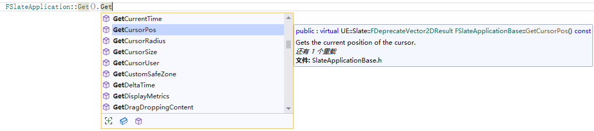

### SWidget

**SWidget** 是 Slate UI开发过程中，开发者 接触频率最多 的类型，它是所有UI控件的基类

对于开发者而言，需要了解它的基本骨架，知道哪些属性可以调整：

``` c++
TAttribute<bool> EnabledState,  						//开启状态，指定是否能够与控件交互，如果禁用，则显示为灰色
TAttribute<EVisibility> Visibility,						//可见性策略
TSharedPtr<IToolTip> ToolTip,							//提示框控件
TAttribute<FText> ToolTipText,							//提示框文本内容
TAttribute<TOptional<EMouseCursor::Type> > Cursor,		//鼠标样式
float RenderOpacity,									//渲染透明度
TAttribute<TOptional<FSlateRenderTransform>> Transform,	//渲染变换
TAttribute<FVector2D> TransformPivot,					//渲染变换中心
FName Tag,												//标签
bool ForceVolatile,										//强制UI失效
EWidgetClipping Clipping,								//裁剪策略
EFlowDirectionPreference FlowPreference,				//UI流向
TOptional<FAccessibleWidgetData> AccessibleData,		//存储数据
TArray<TSharedRef<ISlateMetaData>> MetaData				//元数据
```

>   详见：https://docs.unrealengine.com/5.2/zh-CN/slate-ui-widget-examples-for-unreal-engine/

哪些函数可以调用：

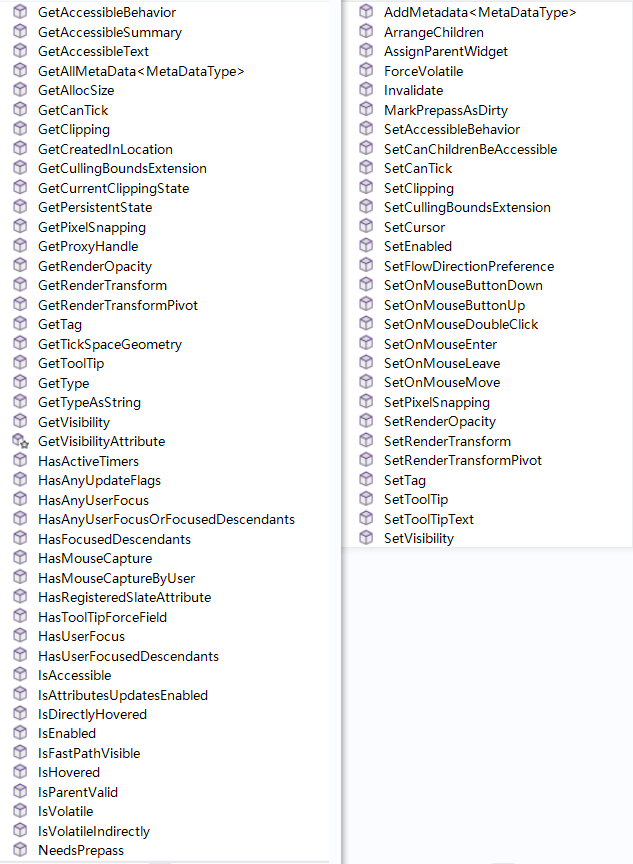

哪些函数可以进行覆写（Override）：


### SWindow

**SWindow** 继承自 **SCompoundWidget** ，这样做只是为了让 **SWindow** 能够使用像 **SWidget** 一样的代码风格，它具有以下属性：

``` c++
EWindowType Type;								//窗口类型
FWindowStyle Style;     						//窗口样式
FText Title;									//窗口标题
float InitialOpacity;							//初始透明度

FVector2D ScreenPosition 						//窗口坐标
FVector2D ClientSize;							//窗口客户区域尺寸
TOptional<float> MinWidth;						//最小宽度
TOptional<float> MinHeight;						//最小高度
TOptional<float> MaxWidth;						//最大宽度
TOptional<float> MaxHeight;						//最大高度
FMargin LayoutBorder;							//窗口内容的边距
FMargin UserResizeBorder;						//调整窗口区域时的响应距离

EAutoCenter AutoCenter; 						//居中策略
ESizingRule SizingRule;							//窗口尺寸处理策略
FWindowTransparency SupportsTransparency; 		//窗口透明度策略
EWindowActivationPolicy ActivationPolicy;		//激活处理策略

bool IsInitiallyMaximized;						//初始时显示为最大化
bool IsInitiallyMinimized;						//初始时显示为最小化
bool IsPopupWindow;								//是否是 Pop up 窗口（无任务栏图标）
bool IsTopmostWindow;							//是否是置顶窗口
bool FocusWhenFirstShown;						//首次预览时获得焦点
bool AdjustInitialSizeAndPositionForDPIScale;	//根据DPI调整窗口初始坐标和尺寸
bool UseOSWindowBorder;							//使用操作系统自身的窗口边框
bool HasCloseButton;							//是否带有关闭按钮
bool SupportsMaximize;							//是否支持最大化
bool SupportsMinimize;							//是否支持最小化
bool ShouldPreserveAspectRatio;					//是否锁定宽高比
bool CreateTitleBar;							//是否创建标题栏
bool SaneWindowPlacement;						//是否将窗口约束到屏幕内
bool bDragAnywhere;								//是否可拖拽到任意位置
bool bManualManageDPI;							//是否手动调整DPI
```

常用的函数有：

``` c++
void MoveWindowTo( FVector2D NewPosition );
void ReshapeWindow( FVector2D NewPosition, FVector2D NewSize );
void ReshapeWindow( const FSlateRect& InNewShape );
void Resize( FVector2D NewClientSize );
void MorphToPosition( const FCurveSequence& Sequence, const float TargetOpacity, const FVector2D& TargetPosition );
void MorphToShape( const FCurveSequence& Sequence, const float TargetOpacity, const FSlateRect& TargetShape );

void ShowWindow();
void HideWindow();
void BringToFront( bool bForce = false );
void RequestDestroyWindow();
void EnableWindow( bool bEnable );
void Maximize();
void Restore();
void Minimize();
```

### 开发流程

Slate开发的绝大部分工作内容可以归纳为：

-   **设置控件属性**
-   **绑定事件逻辑**
-   **组织层次结构**

SWidget 是一个抽象基类，UE根据不同的使用方式，又对其进行派生，划分为四大类：

-   **SCompoundWidget** ：可以设置ChildSlot

    >   Slate 用来提供给开发者的主要扩展方式，一般继承它是为了利用已有的SWidget来组织一系列的Widget。

-   **SPanel** ：可以看做是SWidget的容器，可以包含一个或多个ChildSlot，用于添加SWidget。

    > Slate已经派生了足够多的SPanel，用于组织Slate的布局等各类操作，一般情况下很少对其派生。

- **SLeafWidget** ：叶子控件，不包含ChildSlot

    > 派生它，主要是为了自定义一些拥有独特 渲染和尺寸处理机制 的控件

- **SWeakWidget** ：定义逻辑上的归属而非事件上的。

    > SPanel中的SWidget在事件上具有层级关系，但有时会出现一些特殊情况，比如点击按钮打开一个菜单，菜单可以看做是隶属于这个按钮的，但本质上菜单是新开启了一个窗口，它们在事件传递上并不存在层级关系，所以就得靠SWeakWidget来解决这个问题。一般情况下很少使用它。

大多时候，我们会新增一个C++类，继承自 **SCompoundWidget** ，在`Construct`函数中填充子控件，就像是这样：

``` c++
class SCustomWidget: public SCompoundWidget
{
public:
	SLATE_BEGIN_ARGS(SCustomWidget) {}				//定义Slate参数
	SLATE_END_ARGS()
public:
	void Construct(const FArguments& InArgs){		//使用SNew本质上是调用该函数
        ChildSlot									//填充子控件
        [
            SNew(STextBlock)
            .Text(FText::FromString("This is body"))
        ];
    }
};
```

这样我们就可以使用如下代码来创建该控件：

``` c++
auto MyWidget = SNew(SCustomWidget);
```

如果想增加 **参数（Argument）** ，比如说让文本内容可以设置，那么可以把定义改为：

``` c++
class SCustomWidget : public SCompoundWidget
{
public:
	SLATE_BEGIN_ARGS(SCustomWidget)							
		: _Text(FText::FromString("Default")) {		//初始化参数默认值，变量名为参数定义时的变量名前加下划线
		}				
		SLATE_ARGUMENT(FText,Text)					//使用宏SLATE_ARGUMENT定义参数
	SLATE_END_ARGS()
public:
	void Construct(const FArguments& InArgs) {		
		Text = InArgs._Text;						//接收传递进来的参数
		ChildSlot									
        [
            SNew(STextBlock)
            .Text(Text)								//传递文本内容
        ];
	}
private:
	FText Text;
};
```

这样就可以使用如下代码设置控件内容：

``` c++
auto MyWidget = SNew(SCustomWidget)
    				.Text(FText::FromString("Hello"));
```

当然，我们也可以不走FArguments的方式，直接这样：

```c++
class SCustomWidget : public SCompoundWidget
{
public:
	SLATE_BEGIN_ARGS(SCustomWidget){}				
	SLATE_END_ARGS()
public:
	void Construct(const FArguments& InArgs, FText InText) {	//直接从Construct的函数参数中传入
		Text = InText;						
		ChildSlot									
		[
            SNew(STextBlock)
            .Text(Text)
		];
	}
private:
	FText Text;
};

```

``` c
auto MyWidget = SNew(SCustomWidget,FText::FromString("Hello"));	  //从SNew的参数列表中传入Text
```

如果想让上述参数能够绑定委托，就需要使用Slate的 **属性（Attribute）** 机制：

``` c++
class SCustomWidget : public SCompoundWidget
{
public:
	SLATE_BEGIN_ARGS(SCustomWidget)							
		: _Text(FText::FromString("Default")) {		
		}				
		SLATE_ATTRIBUTE(FText,Text)							//使用宏SLATE_ATTRIBUTE定义参数
	SLATE_END_ARGS()
public:
	void Construct(const FArguments& InArgs) {		
		Text = InArgs._Text;								//接收传递进来的参数
		ChildSlot									
			[
				SNew(STextBlock)
				.Text(Text)									//传递文本属性
			];
	}
private:
	TAttribute<FText> Text;									//使用TAttribute包裹属性
};
```

然后就能使用这样的代码：

```C++
auto MyWidget = SNew(SCustomWidget)
		.Text_Lambda([](){
			return FText::FromString("Hello");
		});
```

如果想增加一些控件的事件处理回调，比如说当上面文本变动时的做一些处理，那么可以用 Slate 的 **事件（Event）** 机制：

``` c++
class SCustomWidget : public SCompoundWidget
{
public:
	SLATE_BEGIN_ARGS(SCustomWidget)							
		: _Text(FText::FromString("Default")) {		
		}				
		SLATE_ATTRIBUTE(FText,Text)							
		SLATE_EVENT(FSimpleDelegate, OnTextChanged)	//使用宏SLATE_EVENT声明事件
	SLATE_END_ARGS()
public:
	void Construct(const FArguments& InArgs) {		
		Text = InArgs._Text;	
		OnTextChanged = InArgs._OnTextChanged;		//传递事件委托
		ChildSlot									
		[
			SNew(STextBlock)
			.Text(Text)
		];
	}
	void SetText(FText InText) {
		Text = InText;
		OnTextChanged.ExecuteIfBound();				//执行委托
	}
	FText GetText(){
		return Text.Get();
	}
private:
	FSimpleDelegate OnTextChanged;					//定义委托
	TAttribute<FText> Text;
};
```

``` c++
auto MyWidget = SNew(SCustomWidget)
    .Text_Lambda([](){
        return FText::FromString("Hello");
    })
    .OnTextChanged_Lambda([](){						//当文字变动时打印日志
        UE_LOG(LogTemp,Warning,TEXT("Oh, Text is changed!"));
    });
```

此外，`SLATE_BEGIN_ARGS(...)`和`SLATE_END_ARGS()`之间还有其他可供使用的宏，使用频率不高，因此这里不展开描述，具体可以查看：

-   `Engine\Source\Runtime\SlateCore\Public\Widgets\DeclarativeSyntaxSupport.h`

综上，Slate的开发流程基本如此。

### 控件一览

这里主要是为了建立  `控件<--->类型` 的映射，知道有什么控件，当使用这些控件的时候，UE源码中大量的用例可供参考，此外UE还提供相应的调试工具。

#### 基础

- `SButton`：按钮


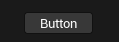

- `SCheckBox`：复选框


- `SComboBox<OptionType>`：自定义元素的组合框，需要提供菜单项的控件生成器


- `STextComboBox` ：文本组合框


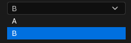

- `SComboButton`：组合按钮，与ComboBox不同的是，ComboButton需要提供一个完整菜单的生成器，而非菜单项生成器

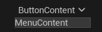

- `SInputKeySelector`：按键输入选择器


- `SNumericDropDown<NumType>`：数字下拉控件


- `SNumericEntryBox<NumType>`：数字选择框


- `SRotatorInputBox = SNumericRotatorInputBox<float>`：旋转输入框


- `SSlider`：滑动条


- `SSpinBox<NumericType>`：自定义数字类型的微调框


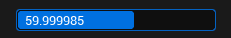

- `SVectorInputBox = SNumericVectorInputBox<float, UE::Math::TVector<float>, 3>`：向量输入框


- `SVolumeControl`：音量调节控件


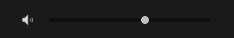

##### 文本

- `STextBlock`：文本显示块


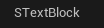

- `SRichTextBlock`：富文本显示块

- `SEditableText`：可编辑文本


- `SInlineEditableTextBlock`：单行文本编辑块（在编辑时才会显示边框）


- `SEditableTextBox`：可编辑器文本框


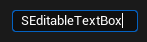

- `SSuggestionTextBox`：带智能提示及输入历史的文本框


- `SSearchBox`：搜索框


- `SMultiLineEditableText`：多行文本编辑块


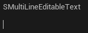

- `SMultiLineEditableTextBox`：多行可编辑文本框


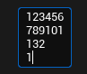

- `SHyperlink`：超链接


##### 颜色

- `SColorBlock`：单个颜色的显示控件


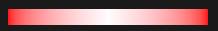

- `SSimpleGradient`：简单渐变色的显示控件，只支持设置起始颜色和结束颜色


- `SComplexGradient`：复杂渐变色的显示控件，支持任意颜色数量组成的渐变色


- `SColorPicker`：单个颜色调节的整合控件（需引入模块 **AppFramework** ）


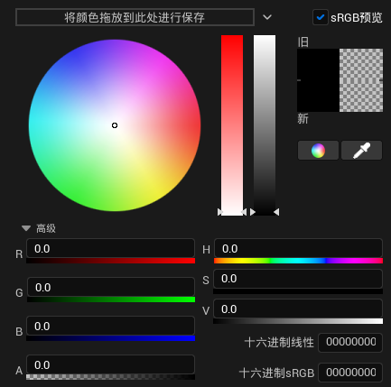

##### 图像

- `SImage`：用于显示图像


##### 导航	

- `SBreadcrumbTrail`


##### 通知

- `SErrorHint`：错误图标，可设置ToolTip


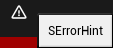

- `SErrorText`：红色背景的文本块


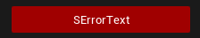

- `FNotificationInfo`：非控件，用于消息通知


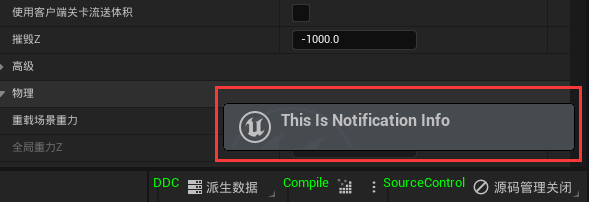

```c++
FNotificationInfo NotificationInfo(FText::FromString("FNotificationInfo"));
NotificationInfo.Text = FText::FromString("This Is Notification Info");
NotificationInfo.bFireAndForget = true;
NotificationInfo.ExpireDuration = 100.0f; 
NotificationInfo.bUseThrobber = true;
FSlateNotificationManager::Get().AddNotification(NotificationInfo);
```

- `SProgressBar`：进度条


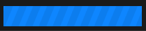

- `SHeader`：标题控件


  - `SScrollBar`：滚动条


  - `SSpacer`：空白控件，一般用于在布局中进行填充

#### 控件容器（SPanel）

##### 布局与尺寸

- `SVerticalBox`：竖直布局

- `SHorizontalBox`：水平布局

- `SOverlay`：重叠布局

- `SGridPanel`：网格布局


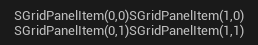

- `SUniformGridPanel`：使用统一网格大小的网格布局面板。

- `SWrapBox`：流式布局，可设置排列方向，当控件超出尺寸时，换行。


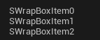

- `SUniformWrapPanel`：使用统一大小的流式布局

- `SCanvas`：可以使用任意坐标和大小来放置Child

- `SConstraintCanvas` :静态

- `SSplitter`：可以拖拽分割线来调整Widget间分割的大小


- `SScrollBox`：为Content添加滚动条

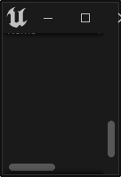

- `SWidgetSwitcher`：Widget切换控件，将Widget全部添加到Slot中，通过设置Slot Index来切换显示对应的Widget


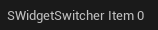

- `SDPIScaler`：用于调整DPI缩放

- `SBox`：控制Content的固定尺寸、最小尺寸或者最大尺寸


- `SScaleBox`：统一缩放Content的尺寸


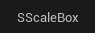

##### 视图

- `SListView`：列表视图


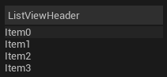

- `STileView`：块视图


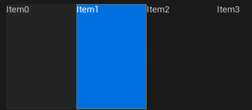

- `STreeView`：树视图


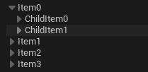

##### 停靠窗口

- `SDockTab`


```C++
const TSharedRef<SDockTab> MajorTab = SNew(SDockTab).TabRole(ETabRole::MajorTab);
TabManager = FGlobalTabmanager::Get()->NewTabManager(MajorTab);

TabManager->RegisterTabSpawner(FName("MyDockTab"), FOnSpawnTab::CreateLambda([](const FSpawnTabArgs& Args) {
    TSharedRef<SDockTab> Tab = SNew(SDockTab).Content()[SNew(STextBlock).Text(FText::FromString("MyDockContent"))];
    return Tab;
})).SetDisplayName(FText::FromString("MyDock"))
    .SetMenuType(ETabSpawnerMenuType::Hidden);
TabManager->TryInvokeTab(FName("MyDockTab"));
```

##### 其他

- `SBackgroundBlur`：模糊Content的背景


- `SBorder`：为Content添加边框


- `STooltipPresenter`：为Content添加ToolTip

- `SExpandableArea`：允许展开或收纳Content


- `SFxWidget`
- `SMenuAnchor`：为区域增加上下文菜单

### 代码参考

UE提供了 **控件反射器** ，可以快速定位到对应UI的创建代码，它的启动点位于编辑器主面板的`顶部菜单栏` - `工具` - `调试` - `控件反射器`：


另外，官方的引擎源码中也提供了一个 **SlateViewer** 工程展示了大部分Slate控件的基本使用：


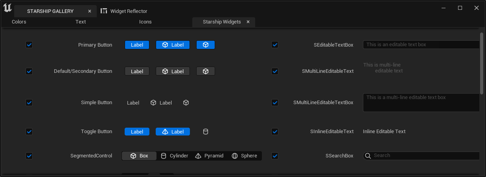

借助IDE的 **代码搜索工具** 可以在引擎中找到对应控件的参数示例，在`Visual Studio`中也可以在`解决方案资源管理器`中查看`类的派生关系`概览所有控件：


## 高级定制

上述技能能满足UI开发的绝大部分需求，但需要涉及到一些复杂的交互机制和渲染逻辑时，就需要自定义SLeafWidget

这里有一个很好的示例， 实现了一个可拖拽移动的控件：


代码如下：

``` c++
#pragma once
#include "Styling/StyleColors.h"
#include "Brushes/SlateColorBrush.h"

class SCustomSlateWidget :public SLeafWidget {
	SLATE_DECLARE_WIDGET(SCustomSlateWidget, SLeafWidget)	//使用宏SLATE_DECLARE_WIDGET声明Slate控件
public:
	SLATE_BEGIN_ARGS(SCustomSlateWidget) {}
	SLATE_END_ARGS()
	void Construct(const SCustomSlateWidget::FArguments InArgs) {
		SetCursor(EMouseCursor::GrabHand);					//设置鼠标进入控件区域的样式
	}
protected:
	FReply OnMouseButtonDown(const FGeometry& MyGeometry, const FPointerEvent& MouseEvent) override {
		if (MouseEvent.IsMouseButtonDown(EKeys::LeftMouseButton)) {
			LastMouseDownPosition = MyGeometry.AbsoluteToLocal(MouseEvent.GetScreenSpacePosition());//将鼠标位置从屏幕空间转换到控件的本地空间
			return FReply::Handled().CaptureMouse(SharedThis(this));								//开始高频率捕获全局的鼠标移动
		}
		return FReply::Handled();
	}
	FReply OnMouseMove(const FGeometry& MyGeometry, const FPointerEvent& MouseEvent) override{
		if (MouseEvent.IsMouseButtonDown(EKeys::LeftMouseButton)) {
			auto Window = FSlateApplication::Get().FindWidgetWindow(SharedThis(this));					//获取该控件的窗口
			auto CurrentMousePosition = MyGeometry.AbsoluteToLocal(MouseEvent.GetScreenSpacePosition());
			auto CurrWindowPosition = Window->GetPositionInScreen();
			auto TargetPosition = CurrentMousePosition + CurrWindowPosition - LastMouseDownPosition;	//计算位置移动
			Window->MoveWindowTo(TargetPosition);
		}
		return FReply::Handled();
	}
	FReply OnMouseButtonUp(const FGeometry& MyGeometry, const FPointerEvent& MouseEvent) override {
		LastMouseDownPosition = FVector2D::ZeroVector;
		return FReply::Handled().ReleaseMouseCapture();											//	释放鼠标捕获
	}
	int32 OnPaint(const FPaintArgs& Args, const FGeometry& AllottedGeometry, const FSlateRect& MyCullingRect, FSlateWindowElementList& OutDrawElements, int32 LayerId, const FWidgetStyle& InWidgetStyle, bool bParentEnabled) const override {
		static FSlateFontInfo FontInfo = FCoreStyle::GetDefaultFontStyle("Bold",30);
		static const FSlateBrush* Bursh = FAppStyle::GetBrush("WhiteBrush");
		FLinearColor BackgroundColor = IsHovered()? FLinearColor(0.6f, 0.5f, 0.9f) : FLinearColor(0.1f, 0.5f, 0.9f);
		FSlateDrawElement::MakeBox(OutDrawElements, LayerId, AllottedGeometry.ToPaintGeometry(), Bursh, ESlateDrawEffect::None, BackgroundColor);		//绘制背景
		FSlateDrawElement::MakeText(OutDrawElements, LayerId, AllottedGeometry.ToPaintGeometry(), FText::FromString("Hello Slate"), FontInfo);			//绘制文字
		return LayerId;
	}
	FVector2D ComputeDesiredSize(float LayoutScaleMultiplier) const override {
		return FVector2D::ZeroVector;															// 使用零向量会填充父控件的内容
	}
private:
	FVector2D LastMouseDownPosition = FVector2D::ZeroVector;
};

// 下方代码需要放置在cpp中
SLATE_IMPLEMENT_WIDGET(SCustomSlateWidget)							// 使用宏SLATE_IMPLEMENT_WIDGET生成代码实现
void SCustomSlateWidget::PrivateRegisterAttributes(FSlateAttributeInitializer& AttributeInitializer) 	//必须实现此函数
{
}
```

``` c++
FSlateApplication::Get().AddWindow(
    SNew(SWindow)
    .ClientSize(FVector2D(200,200))					//设置窗口尺寸为200*200
    .SizingRule(ESizingRule::FixedSize)				//固定窗口尺寸
    .SupportsMaximize(false)						//关闭最大化
    .SupportsMinimize(false)						//关闭最小化
    .CreateTitleBar(false)							//不创建标题栏
    .AutoCenter(EAutoCenter::PreferredWorkArea)		//居中显示
    .IsTopmostWindow(true)							//置顶
    [
        SNew(SCustomSlateWidget)
    ]
);
```

自定义 **SLeafWidget** 的工作流程是：

-   使用宏 **SLATE_DECLARE_WIDGET(WidgetType, ParentType)** 声明控件
-   使用宏 **SLATE_IMPLEMENT_WIDGET(WidgetType)** 在cpp中定义代码实现，并实现函数：
    -   `void WidgetType::PrivateRegisterAttributes(FSlateAttributeInitializer& AttributeInitializer)`
-   覆写控件尺寸计算的函数：
    -   `virtual FVector2D SWidget::ComputeDesiredSize(float LayoutScaleMultiplier) const = 0`
-   覆写各类交互事件。
-   调整控件的属性状态机
-   依据属性状态机，在`绘制函数（OnPaint）`中添加绘制元素

### 交互事件

SWidget提供了非常多的交互事件（以On开头的虚函数）供开发者覆写：

- `OnFocusReceived`：获得焦点
- `OnFocusLost`：失去焦点
- `OnFocusChanging`：焦点发生变化
- `OnKeyChar`：当键盘输入时
- `OnKeyDown`：键盘按键按下
- `OnKeyUp`：键盘按键抬起
- `OnMouseButtonDown`：鼠标按键按下
- `OnMouseButtonUp`：鼠标按键抬起
- `OnMouseMove`：鼠标移动
- `OnMouseEnter`：鼠标进入到Widget区域的瞬间
- `OnMouseLeave`：鼠标离开到Widget区域的瞬间
- `OnMouseButtonDoubleClick`：鼠标双击
- `OnMouseWheel`：鼠标滚轮滚动
- `OnDragEnter`：拖拽东西进入Widget区域的瞬间
- `OnDragLeave`：拖拽东西离开Widget区域的瞬间
- `OnDragOver`：拖拽东西覆盖Widget区域的时候
- `OnDrop`：在Widget上释放拖拽的东西
- ...

>   详细说明，请看SWidget的定义，上面有各个事件的说明及触发时机，关于用法可在UE源码中搜索相应的用例。

使用说明：

- 这些事件由 **FSlateApplication** 负责调用，其函数参数一般包含了该事件携带的所有信息，我们只需对其进行覆盖（override），根据事件数据，做自己的逻辑即可。

- 事件的返回类型为 **FReply** ，用于定义事件的后续处理，它的构造函数是私有的，必须使用如下静态函数去创建实例：

    -  `FReplay::Handled()`：说明该事件已被处理，事件将不会继续往下一级传递。
    -  `FReplay::Unhandled()`：说明该控件并不处理该事件，事件会继续往下一级传递。

    **FReply** 提供了一系列操作用于在事件结束时做一些处理：

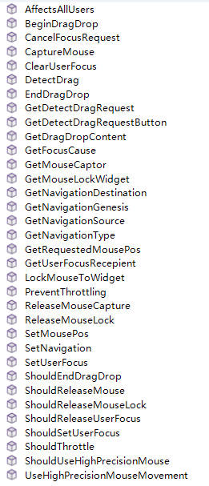

### 绘制事件

SWidget的实际绘制函数为`Paint`，但由于绘制过程中存在一些固定步骤，因此Slate公开了绘制事件`OnPaint`供我们自定义绘制逻辑，它的定义如下：

``` c++
virtual int32 OnPaint(const FPaintArgs& Args, 
                      const FGeometry& AllottedGeometry,
                      const FSlateRect& MyCullingRect, 
                      FSlateWindowElementList& OutDrawElements, 
                      int32 LayerId,
                      const FWidgetStyle& InWidgetStyle,
                      bool bParentEnabled) const = 0;
```

参数说明：

- `const FPaintArgs&` Args：绘制事件的参数，可以得到绘制的当前时间、间隔、父窗口...
- `const FGeometry& ` AllottedGeometry：分配给该SWidget的几何大小（相对于父窗口）
- `  const FSlateRect&` MyCullingRect：该SWidget的裁剪举行，可以在绘制中根据该矩形丢弃绘制元素
- `FSlateWindowElementList&` OutDrawElements：这是整个SWindow的绘制元素列表，我们绘制则是对该对象进行修改。
- `int32` LayerId：绘制的LayerID，一般用于给UI分层，方便对同层级的绘制元素做统一处理。
- `const FWidgetStyle&` InWidgetStyle：父窗口传递过来的Style
- `bool` bParentEnabled：父窗口是否处于开启状态。

在`OnPaint`函数中，我们主要通过 **FSlateDrawElement** 中很多命名以`Make`开头的静态函数来创建绘制元素，其中有：

``` c++
static void MakeBox( //绘制盒子，通过设置Brush，可以是颜色块，也可以是图片
	FSlateWindowElementList& ElementList,
	uint32 InLayer,
	const FPaintGeometry& PaintGeometry,
	const FSlateBrush* InBrush,
	ESlateDrawEffect InDrawEffects = ESlateDrawEffect::None,
	const FLinearColor& InTint = FLinearColor::White );

static void MakeRotatedBox(...);		//绘制一个具有旋转的盒子
static void MakeGradient(...);			//绘制渐变的盒子
static void MakeText(...);				//绘制文本
static void MakeShapedText(...);		//绘制形状文本
static void MakeLines(...);				//绘制线条
static void MakeSpline(...)				//绘制曲线
static void MakeDrawSpaceSpline(...);	 //在绘制空间绘制曲线
static void MakeCubicBezierSpline(...);  //绘制三阶贝塞尔曲线
static void MakeViewport(...)			//绘制FSlateViewport
static void MakeCustom(...);	 		//绘制自定义元素，可自行实现元素的Render函数
static void MakeCustomVerts(...);		//根据顶点进行绘制
static void MakePostProcessPass(...);	//绘制后期滤镜（模糊）
```

这些函数在UE中有非常多的使用，可以搜索相关代码来参考。

>   详见：`Runtime\SlateCore\Public\Rendering\DrawElements.h`

#### FSlateBrush

**FSlateBrush** 用于控制填充区域，在界面中有较高的使用频率，因此Slate也提供了一些它的便捷扩展：


- **FSlateBorderBrush** ：填充边框
- **FSlateBoxBrush** ：盒子画刷
- **FSlateRoundedBoxBrush** ：圆角矩形画刷
- **FSlateColorBrush** ：颜色画刷
- **FSlateImageBrush** ：图片
    - **FSlateVectorImageBrush** ：矢量图
- **FSlateDynamicImageBrush** ：可动态切换图片的画刷
- **FSlateNoResource** ：不带任何资源的画刷

> 上面的一些画刷本质上都是通过一些特定的参数去构造 **FSlateBrush** ，如果出现上述画刷需要组合的情况，可根据它们的构造参数自行组合。

UE中提供了一些内置的 **FSlateBrush** ，可以在源码中搜索`::Get().GetBrush`来查找相关使用：


##### 示例

假如想让整个SWidget填充红色，可以使用这样的代码：

```c++
int32 SCustomSlateWidget::OnPaint(const FPaintArgs& Args,
                                  const FGeometry& AllottedGeometry,
                                  const FSlateRect& MyCullingRect,
                                  FSlateWindowElementList& OutDrawElements,
                                  int32 LayerId,
                                  const FWidgetStyle& InWidgetStyle,
                                  bool bParentEnabled) const {
    static FSlateColorBrush ColorBrush(FColor(255,0,0));
	FSlateDrawElement::MakeBox(OutDrawElements,
                               LayerId, 
                               AllottedGeometry.ToPaintGeometry(),
                               &ColorBrush,
                               ESlateDrawEffect::None, 
                               ColorBrush.TintColor.GetColor(InWidgetStyle));
	return LayerId;
}
```

#### ESlateDrawEffect

**ESlateDrawEffect** 为Slate提供了一些效果，它可以是以下值：

``` c++
enum class ESlateDrawEffect : uint8
{
	None					= 0,			//无效果
	NoBlending			= 1 << 0,			//无混合
	PreMultipliedAlpha	= 1 << 1,			//预乘Alpha
	NoGamma				= 1 << 2,			//不进行Gamma矫正
	InvertAlpha			= 1 << 3,			//反转透明度
	// ^^ These Match ESlateBatchDrawFlag ^^

	NoPixelSnapping		= 1 << 4,			//关闭像素对齐
	DisabledEffect		= 1 << 5,			//禁用状态的效果
	IgnoreTextureAlpha	= 1 << 6,			//忽略纹理中的透明度

	ReverseGamma			= 1 << 7		//逆转Gamma
};
```

#### FSlateFontInfo

**FSlateFontInfo** 用于指定字体信息，对应UE里的字体资产， 它的部分定义如下：

``` c++
struct SLATECORE_API FSlateFontInfo
{
	/**The font object (valid when used from UMG or a Slate widget style asset) */
	TObjectPtr<const UObject> FontObject;

	/**The material to use when rendering this font */
	TObjectPtr<UObject> FontMaterial;

	/**Settings for applying an outline to a font */
	FFontOutlineSettings OutlineSettings;

	/**The composite font data to use (valid when used with a Slate style set in C++) */
	TSharedPtr<const FCompositeFont> CompositeFont;

	/**The name of the font to use from the default typeface (None will use the first entry) */
	FName TypefaceFontName;

	/**
	 * The font size is a measure in point values. The conversion of points to Slate Units is done at 96 dpi.  So if 
	 * you're using a tool like Photoshop to prototype layouts and UI mock ups, be sure to change the default dpi 
	 * measurements from 72 dpi to 96 dpi.
	 */
	int32 Size;

	/**The uniform spacing (or tracking) between all characters in the text. */
	int32 LetterSpacing = 0;

	/**The font fallback level. Runtime only, don't set on shared FSlateFontInfo, as it may change the font elsewhere (make a copy). */
	EFontFallback FontFallback;
};
```

UE中有专门的字体编辑器，在C++中直接构造它比较麻烦，不过UE也提供了一些内置的 **FSlateFontInfo** ，比如：

- `FCoreStyle::Get().GetFontStyle("NormalFont")`
- `FCoreStyle::Get().GetFontStyle("SmallFont")`
- `FCoreStyle::GetDefaultFontStyle("Regular",FontSize);`
- `FCoreStyle::GetDefaultFontStyle("Bold",FontSize)`
- `FCoreStyle::GetDefaultFontStyle("Italic",FontSize);`
- `FCoreStyle::GetDefaultFontStyle("Mono",FontSize);`

##### FontMeasure

大多数GUI框架都有 **字体测量（FontMeasure）** 的概念：测量特定字体格式的某个文本的绘制宽度和高度。

在UE中，可以通过如下方式来测量（伪代码）：

``` c++
FSlateApplication::Get().GetRenderer()->GetFontMeasureService()->Measure(
    const FText& Text,						//文本
    const FSlateFontInfo& InFontInfo,		//字体
    float FontScale							//字体缩放
) -> FVector2D								//返回宽度（X）和高度（Y）
```

### 性能优化

Slate为了优化UI的`Paint`和`Tick`性能，提供了一个 **SInvalidationPanel** 控件，该控件可以让子控件中消耗较高的操作进行缓存，只有当一些特定操作导致 **缓存失效（Invalidate）** ，才会重新执行。

详见：[理解虚幻引擎Slate 架构 - 轮询数据流和委托 | 虚幻引擎5.2文档 ](https://docs.unrealengine.com/5.2/zh-CN/understanding-the-slate-ui-architecture-in-unreal-engine/#轮询数据流和委托)

我们可以手动调用子控件的`Invalidate()`函数来让缓存失效：

``` c++
void SWidget::Invalidate(EInvalidateWidgetReason InvalidateReason);
```

**EInvalidateWidgetReason** 的值可以是：

``` c++
enum class EInvalidateWidgetReason : uint8
{
	None = 0,
	Layout = 1 << 0,		//如果需要更改Widget所需的大小，请使布局无效。这是一个昂贵的无效操作，所以如果你只需要重新绘制一个小部件，就不要使用它
	Paint = 1 << 1,				//使绘制无效
	Volatility = 1 << 2,		//当Volatility变动时触发
	ChildOrder = 1 << 3,		//当添加或移除自控件时触发，使之无效会重建Child的顺序
	RenderTransform = 1 << 4,	//当RenderTransform变动时触发
	Visibility = 1 << 5,		//当可见性变动时触发
	AttributeRegistration = 1 << 6,		//绑定属性时触发
	Prepass = 1 << 7,					//使Prepass无效

	/**
	 * Use Paint invalidation if you're changing a normal property involving painting or sizing.
	 * Additionally if the property that was changed affects Volatility in anyway, it's important
	 * that you invalidate volatility so that it can be recalculated and cached.
	 */
	PaintAndVolatility = Paint | Volatility,
	/**
	 * Use Layout invalidation if you're changing a normal property involving painting or sizing.
	 * Additionally if the property that was changed affects Volatility in anyway, it's important
	 * that you invalidate volatility so that it can be recalculated and cached.
	 */
	LayoutAndVolatility = Layout | Volatility,
};
```

Slate提供了一种基于 **属性（SlateAttribue）** 的方式：让属性的变动跟缓存的重建挂钩

具体的做法是：

-   使用 **TSlateAttribute** 包裹属性（跟 **TAttribute** 的用途不同）， **TSlateAttribute** 包裹的属性在构造初始化时需要传递参数`(*this)`

-   在`void WidgetType::PrivateRegisterAttributes(...)`函数中，使用宏 **SLATE_ADD_MEMBER_ATTRIBUTE_DEFINITION(_Initializer, _Property, _Reason)** 来注册属性

这里有一个简短的示例：

``` c++
class SCustomSlateWidget :public SLeafWidget {
	SLATE_DECLARE_WIDGET(SCustomSlateWidget, SLeafWidget)
public:
	SLATE_BEGIN_ARGS(SCustomSlateWidget){}
	SLATE_END_ARGS()
	void Construct(const SCustomSlateWidget::FArguments InArgs){			
	}
protected:
	SCustomSlateWidget()
		: ClickedCounter(*this) {	//初始化SlateAttribute
	}
	FReply OnMouseButtonDown(const FGeometry& MyGeometry, const FPointerEvent& MouseEvent) override {
		ClickedCounter.Set(*this, ClickedCounter.Get() + 1);		//计数器+1，这里把鼠标按下当做是点击
		return FReply::Handled();
	}
	int32 OnPaint(const FPaintArgs& Args, const FGeometry& AllottedGeometry, const FSlateRect& MyCullingRect, FSlateWindowElementList& OutDrawElements, int32 LayerId, const FWidgetStyle& InWidgetStyle, bool bParentEnabled) const override {
		static FSlateFontInfo FontInfo = FCoreStyle::GetDefaultFontStyle("Bold",30);
		FSlateDrawElement::MakeText(OutDrawElements, LayerId, AllottedGeometry.ToPaintGeometry(), FText::FromString(FString::FromInt(ClickedCounter.Get())), FontInfo);					//绘制当前鼠标点击的次数
		return LayerId;
	}
	FVector2D ComputeDesiredSize(float LayoutScaleMultiplier) const override {
		return FVector2D::ZeroVector;															
	}
private:
	TSlateAttribute<int> ClickedCounter;	 	//记录鼠标点击次数的计数器
};
```

``` c++
SLATE_IMPLEMENT_WIDGET(SCustomSlateWidget)
void SCustomSlateWidget::PrivateRegisterAttributes(FSlateAttributeInitializer& AttributeInitializer) {
    //将ClickedCounter的值变动跟重绘事件挂钩
	//SLATE_ADD_MEMBER_ATTRIBUTE_DEFINITION(AttributeInitializer, ClickedCounter, EInvalidateWidgetReason::Paint);
}
```

``` c++
FSlateApplication::Get().AddWindow(
    SNew(SWindow)
    .SupportsMaximize(false)
    .SupportsMinimize(false)
    .IsTopmostWindow(true)
    .ClientSize(FVector2D(200,200))
    .SizingRule(ESizingRule::FixedSize)
    .CreateTitleBar(false)
    .AutoCenter(EAutoCenter::PreferredWorkArea)
    [
        SNew(SInvalidationPanel)			// 使用SInvalidationPanel包括
        [
            SNew(SCustomSlateWidget)
        ]
    ]
);
```

该代码创建了一个可点击的方块：


点击方块会让`ClickedCounter+1`，但画面不会发生任何变化，当取消`PrivateRegisterAttributes`中注释的代码：

``` c++
void SCustomSlateWidget::PrivateRegisterAttributes(FSlateAttributeInitializer& AttributeInitializer) {
    //将ClickedCounter的值变动跟重绘事件挂钩
	SLATE_ADD_MEMBER_ATTRIBUTE_DEFINITION(AttributeInitializer, ClickedCounter, EInvalidateWidgetReason::Paint);
}
```

重新启动程序，可以发现，当`ClickedCounter`变更时，UI会重新绘制：


## 从Slate到UMG

UE的逻辑编程建立在UObject之上，而Slate为了追求极致的性能，并没有使用UObject这种沉重的机制去管理UI对象

在Slate中，使用的是 **共享指针（Shader Pointer）** 的方式来管理UI对象的生命周期

为了提升游戏开发者的UI开发效率，UE使用UObject对Slate控件包裹了一层，通过反射暴露了Slate控件的一些属性和函数，同时支持了可视化的UI设计，这一层接口也就是我们熟知的 **UMG**

关于 **UMG** ，官方文档中有详细的介绍：

-   https://docs.unrealengine.com/5.2/zh-CN/umg-ui-designer-for-unreal-engine/

这里有一个简短的代码很好地体现了Slate和UMG的关系：

``` c++
#pragma once

#include "UObject/ObjectMacros.h"
#include "Widgets/Text/STextBlock.h"
#include "Components/Widget.h"
#include "CustomUWidget.generated.h"

UCLASS(meta = (DisplayName = "CustomWidget"))					//DisplayName是控件名称
class UMGEXTENDUTILITIES_API UCustomWidget : public UWidget
{
	GENERATED_BODY()
protected:
	virtual TSharedRef<SWidget> RebuildWidget() override {						//重建控件，并赋值给成员变量
		return SAssignNew(MyTextBlock,STextBlock);
	}
	virtual void SynchronizeProperties() override {								//将UObejct的属性同步到Slate控件中
		MyTextBlock->SetText(Text);
		Super::SynchronizeProperties();
	}
	virtual void ReleaseSlateResources(bool bReleaseChildren) override {		//释放Slate资源
		MyTextBlock.Reset();
	}

#if WITH_EDITOR
	virtual const FText GetPaletteCategory() override {							//在编辑器上的控件分类
		return FText::FromString("CustomCategory");
	}
#endif

public:
	UFUNCTION(BlueprintCallable)		//公开函数到蓝图
	FText GetText() const {
		return Text;
	}
	UFUNCTION(BlueprintCallable)
	void SetText(FText InText) {
		Text = InText;
		if (MyTextBlock) {				//设置属性，当控件已经创建的时候，直接把值塞到控件里面
			MyTextBlock->SetText(Text);
		}
	}
protected:
	UPROPERTY(EditAnywhere, BlueprintGetter = "GetText", BlueprintSetter = "SetText")
	FText Text;							//公开属性到编辑器

	TSharedPtr<STextBlock> MyTextBlock;	//实际的Slate控件
};
```


在C++中，使用UMG的方法是：

``` c++
UWidget* UMGWidget = LoadObject<UWidget>(nullptr, TEXT("{AssetPath}"));    			   //从资产加载，也可以NewObject
TSharedPtr<SWidget> SlateWidget = UMGWidget->TakeWidget();                             //该操作会创建一个新的SWidget，
TSharedPtr<SWidget> CachedSlateWidget = UMGWidget->GetCachedWidget();                  //获取上一次创建的SWidget
//之后再使用Slate的使用方式
```

### 生命周期管理

**UWidget** 走的是 **UObject** 的垃圾回收，它持有了 **SWidget** 的共享指针，为了保证控件在显示时（`TSharedPtr<SWidget>`还存在时）， **UWidget** 不会被当成垃圾回收，UMG使用了一个继承自 **FGCObject** 的控件 **SObjectWidget** 对 **UWidget** 增加了引用

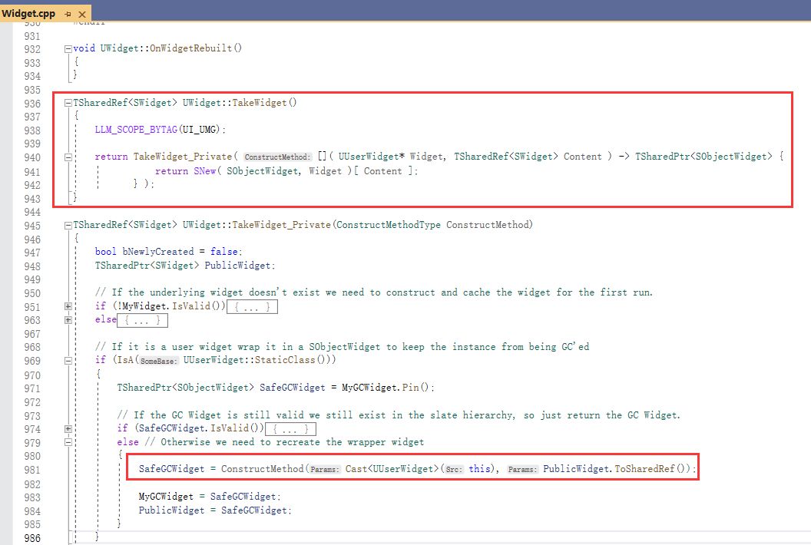

再回到上面的示例代码中，可以了解到，调用`UWidget::TakeWidget()`得到的并不是 `UWidget::RebuildWidget()`中创建的控件，而是对其又用 **SObjectWidget** 包裹了一层，它们在创建过程中的层次关系如下：


在销毁时，它们的释放顺序如下：


-   **SObjectWidget** 继承自 **FGCObject** ，它会添加对UWidget的引用，保证 **SObjectWidget** 存在时， **UWidget** 不会被GC
-   当控件开始销毁时， **SObjectWidget** 的引用计数为0会被销毁，此时会解除对 **UWidget** 的引用
-   当 **UWidget** 的引用为0，则会在下一次垃圾回收时将其释放，此时才会释放其持有的 **SWidget** 共享指针

