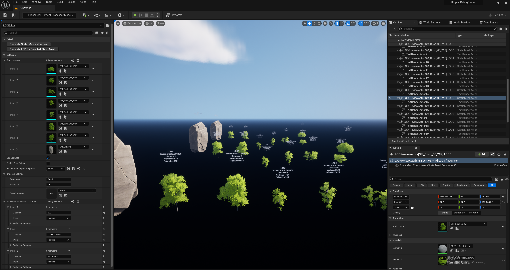
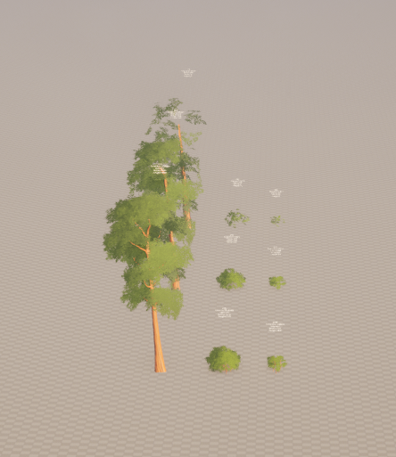
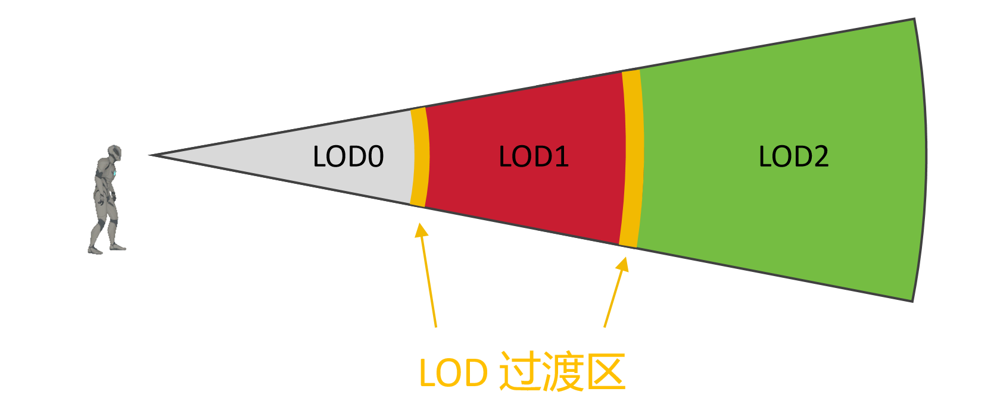
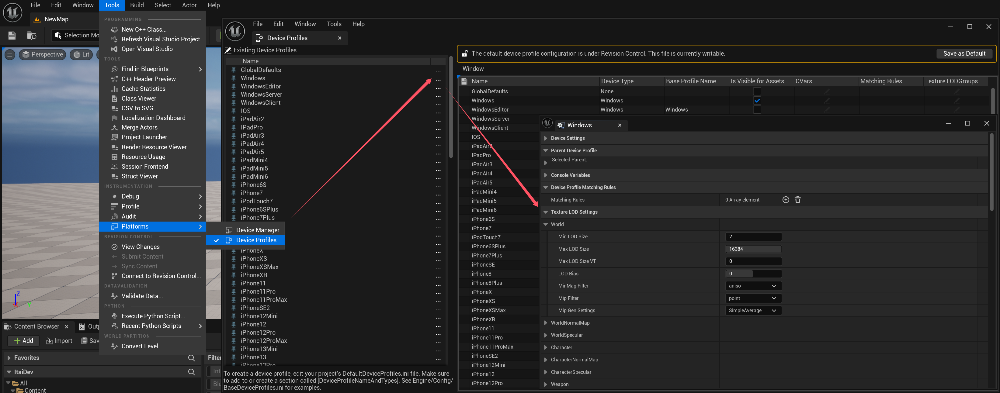
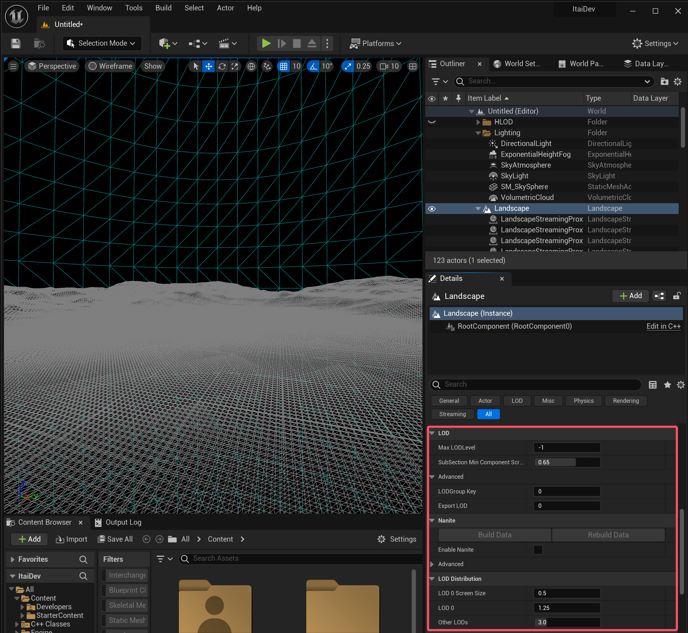
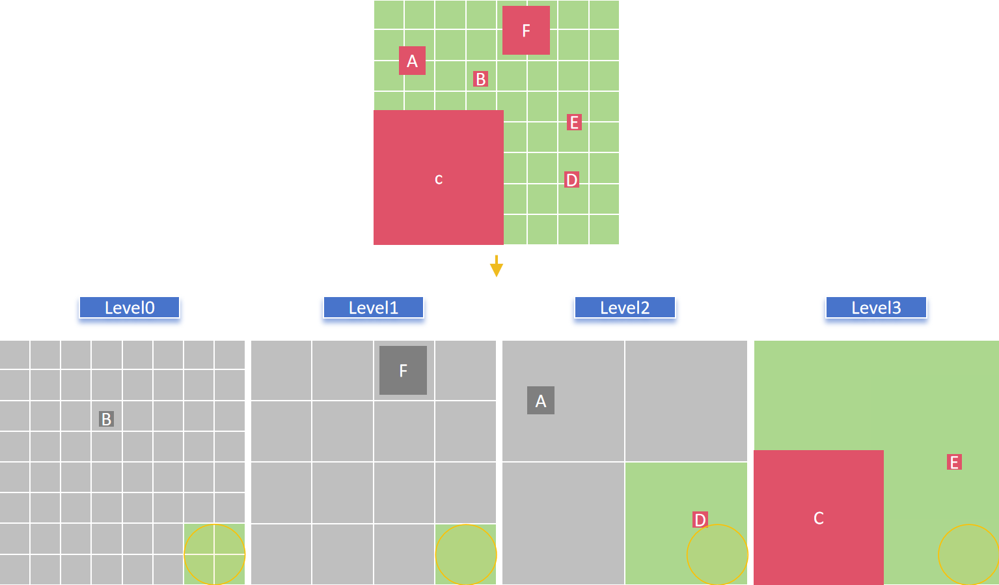

# LOD不完全指南

电子计算机的发明起源于第二次世界大战期间，当时火炮和弹道计算变得日益复杂，原有的计算工具已经无法满足需求，为了解决这些问题，科学家和工程师们开始研制电子计算机。

伴随着电子计算机的出现，电子游戏也应运而生。

在电子游戏的发展进程中，总有那么一些脑洞大开的创意和技术，它不断地突破硬件开发者思维的设限，极致地压榨硬件的性能，驱动着计算机向着一个惊人的方向发展：

- [知乎 | 电子游戏的前世，今生和未来 - 麦片](https://zhuanlan.zhihu.com/p/206828303)

而 **LOD（Level of Detail ）** ，正是在这个发展过程中出现并一直延用至今的一项技术，它旨在：

- 在不同 **重要性（Significance）** 的场合，采用不同精度的策略，从而尽可能的减少资源的浪费，提升整个系统的上限。

这样的思想策略体现在游戏制作的方方面面

## 静态模型

在模型上， LOD 的应用主要是为模型创建多个精度级别的低模，在近距离时，使用高精度模型，远距离时，使用低精度模型。

在用于实时渲染领域且具有一定规模的三维场景中，为了保证程序的帧率，模型LOD的制作通常是开发团队无法绕开的难题。

高额的时间和人力成本让很多独立开发者和小型团队搭建复杂场景时需要面临非常多非常多的困难。

直到UE的虚拟几何体技术—— **Nanite** ，横空出世，从而大幅度降低了场景制作的门槛。

Nanite 会分析模型几何的重要性信息，自动生成高质量的LOD，不仅占用了更少的存储空间，还可以以非常高的性能绘制，它无疑是几何渲染的未来。

但目前而言，在一些特定场景下，我们还不能完全放弃LOD：

- 现代PC的GPU算力通常是冗余的，大部分的中端GPU足以应付一些常见的复杂场景渲染，但其他平台，如移动设备，X Box，Switch...，对于有较高画面要求的项目，它们的算力目前而言更多只是堪堪够用，为了追求更好的视觉效果，甚至往往需要定制一些比较Hack的渲染机制来进行极致的优化，而所分配剩余的算力很难支撑起Nanite的运作。
- Nanite的模型简化算法在一些特殊的模型类型上还有很大的优化空间，比如植被，如果是植被密度较大范围较广的复杂场景，使用LOD能更大程度地压缩性能，这在之前的[文章](https://zhuanlan.zhihu.com/p/713731229)中有提到。

之期大部分的游戏项目，通常是由美术人员在DDC软件中来制作LOD，美术人员在提供模型源文件的同时，按照一定规范来生产模型对应的LOD。

这种做法，目前来看是存在一定局限性的：

- 早期的模型制作流程比较“务实”，大部分时候还是只能通过人工建模的方式，而现在涌现了许多网格处理的SDK，它们往往会提供一些有效的模型简化算法，无需重新建模，就能生成高品质的LOD。 
- 人工制作LOD往往需要高额的成本，团队自身有足够的人力物力还好，如果是交给外包团队去做这个事情的话，无疑会是一笔巨大的开销。
- 任何方法论都有一定适用条件，模型制作也一样，除了一些老牌制作厂商之外，大部分团队应该都很难在游戏制作之初，就能制定出一套尽善尽美的制作规范，往往很多隐秘的问题随着开发进度的推进逐渐浮现，而美术制作又是整个项目中费用消耗的大头，对于LOD制作来说，如果源模型或者规范变了，那么之前制作的“产品”就白费了，所以我们需要将关注点从制作具体的 LOD ，转化为去搭建一条可迭代的 LOD 生产管线。
- 源模型虽然是由美术人员制作的，但他们往往对性能并不敏感，对LOD的认识也不是很深，在面对那些无论怎么制作都很难满足规范的模型时，他们所表现出来的，只会是无措。

此时如果有人对几何处理，图形渲染，编辑器方向有深入的了解，以程序化的方式包揽这些事务，就可以为团队节省出大量的制作成本，这类专业人员一般被定义为 **管线TA** / **引擎管线工程师** 。

在阐述LOD制作之前，我们先了解一下一些现代游戏中的模型制作规格：

- [一些次世代游戏中的三角形计数 | Polycount](https://polycount.com/discussion/141061/polycounts-in-next-gen-games-thread)
- [一些视频游戏中的三角形计数 | Polycount](https://polycount.com/discussion/126662/triangle-counts-for-assets-from-various-videogames)

这些资料可以作为有效的参考，避免源模型就出现那种超出实时渲染规格的情况，这是 [3D - ACE](https://3d-ace.com/) 给出的一个标准：

- **PC 和游戏机**

  | **游戏资产**   | **多边形计数 （UE）** | **三角形数 （UE）** | **多边形计数 （Unity）** | **三角形计数 （Unity）** |
  | -------------- | --------------------- | ------------------- | ------------------------ | ------------------------ |
  | **低细节角色** | 10,000-20,000         | 20,000-40,000       | 5,000-10,000             | 10,000-20,000            |
  | **高细节角色** | 20,000-60,000         | 40,000-120,000      | 10,000-30,000            | 20,000-60,000            |
  | **简单道具**   | 500-2,000             | 1,000-4,000         | 250-1,000                | 500-2,000                |
  | **复杂道具**   | 2,000-10,000          | 4,000-20,000        | 1,000-5,000              | 2,000-10,000             |
  | **基本环境**   | 10,000-50,000         | 20,000-100,000      | 5,000-25,000             | 10,000-50,000            |
  | **详细环境**   | 50,000-200,000        | 100,000-400,000     | 25,000-100,000           | 50,000-200,000           |

- **移动和低端设备**

  | **游戏资产**   | **多边形计数** | **三角形计数** |
  | -------------- | -------------- | -------------- |
  | **低细节角色** | 1,000-5,000    | 2,000-10,000   |
  | **高细节角色** | 5,000-10,000   | 10,000-20,000  |
  | **简单道具**   | 100-500        | 200-1,000      |
  | **复杂道具**   | 500-2,000      | 1,000-4,000    |
  | **基本环境**   | 2,000-10,000   | 4,000-20,000   |
  | **详细环境**   | 10,000-20,000  | 20,000-40,000  |

- **VR/AR 设备**

  | **游戏资产**   | **多边形计数** | **三角形计数** |
  | -------------- | -------------- | -------------- |
  | **低细节角色** | 2,000-10,000   | 4,000-20,000   |
  | **高细节角色** | 10,000-20,000  | 20,000-40,000  |
  | **简单道具**   | 500-1,500      | 1,000-3,000    |
  | **复杂道具**   | 1,500-5,000    | 3,000-10,000   |
  | **基本环境**   | 5,000-15,000   | 10,000-30,000  |
  | **详细环境**   | 15,000-30,000  | 30,000-60,000  |

原博客位于：

- [多边形数量在游戏资产的 3D 建模中重要吗？– 3D-Ace 工作室](https://3d-ace.com/blog/polygon-count-in-3d-modeling-for-game-assets/)

3D-ACE中有很多有价值的 [博客](https://3d-ace.com/blog/) 参考，感兴趣的小伙伴可以看下：


在制作LOD之前，我们最好搭建一个简单的预览关卡，通过一个简单的编辑器工具来自动排列，去完成这样的目的：

- 根据资产列表或者资产路径确定要预览的所有资产。
- 根据模型的包围球半径作为间隔进行横向排布。
- 将LOD的屏幕尺寸转化为距离，纵向排布所有LOD。
- 在生成的模型上扩展显示一些关键信息，比如屏幕尺寸，距离，顶点数，面数...

在这样的视图下我们能更加直观地查看和管理模型的规格：



在早期的LOD制作流程中，我们一般将模型与相机之间的 **距离** 作为LOD切换的判断标准，将可能制作出类似这样的 **LOD 链** ：


但很快有人发现，使用 距离 似乎并不能很直观地确立LOD之间的距离间隔，因为有的模型大，有的模型小，所以引入了另一个参数 —— **屏幕尺寸（Screen Size）** ：我们通过综合评估 **相机距离** ， **相机的透视矩阵** 以及模型的 **包围球半径**  来得到它，这是它的计算公式：

``` c++
float ConvertDistanceToScreenSize(float ObjectSphereRadius, float Distance)
{
	const float FOV = 60.0f;								// 相机参数可以统一写死
	const float FOVRad = FOV * (float)UE_PI / 360.0f;
	const FMatrix ProjectionMatrix = FPerspectiveMatrix(FOVRad, 1920, 1080, 0.01f);		
	const float ScreenMultiple = FMath::Max(0.5f * ProjectionMatrix.M[0][0], 0.5f * ProjectionMatrix.M[1][1]);
	return 2.0f * ScreenMultiple * ObjectSphereRadius / FMath::Max(1.0f, Distance);
}
```

我们通过每次缩减一定百分比的屏幕尺寸来确定LOD之间的间隔，相比直接使用距离，会更加容易一些：


可是，虽然使用屏幕尺寸确实能直观地设置LOD之间的间隔，但为不同尺寸的模型生成不均匀分布的LOD链，会导致视觉上产生的瑕疵更加明显。

假如我们采用屏幕尺寸百分比递减的方式生成LOD（这里为了能看出瑕疵，刻意把LOD的简化幅度调得很大）：


对比一下使用固定的距离梯度来生成LOD：




可以看到使用固定距离梯度LOD的画面变化会更加平缓一些：



虽然使用屏幕尺寸确实可以让单个模型的LOD链组织得更加合理，但由于引擎中大量使用 距离 来为某些视觉效果进行限制（比如阴影，距离场光照...），如果为了可以保证视觉效果的平滑过渡，更建议使用这样的策略来生成LOD：

- 使用固定的LOD距离梯度
- 根据包围球半径确定LOD的数量
- 根据屏幕尺寸和顶点密度确定简化幅度

上述的一些关键参数会随着项目的复杂度以及平台的性能要求发生变化，所以我们不应该直接手动去生成LOD，而是搭建一条LOD生成管线，这样可以不断迭代和优化这条管线。

目前大部分的团队会把这条管线搭建在DDC与引擎之间，但目前来说，虚幻引擎在提供了非常优秀的基础模块，如果我们直接把管线搭建在引擎侧，可以更好的结合实际的游戏场景环境来生成更好的效果，比如之前植被章节所提到的 **八面体替身 （Octahedron Impostor）** ：

- https://shaderbits.com/blog/octahedral-impostors

UE引擎原生虽然提供了一些模型简化算法，但有一些几何处理SDK，它们可以更大程度地在保证视觉效果的前提下，大幅度地缩减模型渲染的开销：

- [Simplygon - 树立 3D 游戏内容优化标准](https://link.zhihu.com/?target=https%3A//www.simplygon.com/)
- [InstaLOD - 生产和自动优化3D内容所需的一切](https://link.zhihu.com/?target=https%3A//instalod.com/zh/)

使用这些SDK提供的接口，可以轻易搭建一条LOD链生成管线。

这是一些可供参考的文档：

- [多边形数量在游戏资产的 3D 建模中重要吗？– 3D-Ace 工作室](https://3d-ace.com/blog/polygon-count-in-3d-modeling-for-game-assets/)
- [当涉及到 LOD 过渡时要考虑什么？ - Simplygon 博客](https://www.simplygon.com/posts/51aba9d5-bafd-459d-94b8-718273fdf092)

## 材质贴图

对于材质而言，早期有一些项目，在生成模型LOD的同时，也会为对应的材质生成LOD，虽然理论意义上，简化材质的逻辑确实可以减少性能开销，但材质LOD无疑会增加材质集的大小，且带来的性能提升并不是特别明显，较复杂的管理方式也让这种做法在实际项目中很难推广。

目前更多的关注点是在贴图上面，而LOD的应用主要是为贴图生成 **Mipmap** 。

大家对 **Mipmap（多级渐远纹理）** 更多的认识应该是解决摩尔纹现象：


- [知乎 | 计算机图形学七：纹理映射(Texture Mapping)及Mipmap技术 - 孙小磊](https://zhuanlan.zhihu.com/p/144332091)

除了解决摩尔纹， Mipmap目前在UE中还有其他用处：

- **纹理流送（Texture Streaming）** ：为了缓解显存占用的压力，UE默认会分配一定大小的纹理流送池（使用`r.Streaming.PoolSize`配置），根据纹理的重要性（相机距离和纹理组优先级）来流入纹理的某个 **MipLevel** ，从而尽可能降低降低整体的显存消耗，这里有一些关于纹理流送非常有价值的文章：
    - [知乎 | UE4 Texture Streaming - mike](https://zhuanlan.zhihu.com/p/556620567)
    - [知乎 | 虚幻引擎（UE4）对移动端纹理资源（ASTC）的极致压缩处理总结 - Sparrowfc](https://zhuanlan.zhihu.com/p/566998709)
- **UI适配（UI Adaptation）** ：由于游戏可能要面临不同分辨率的运行环境，当缩小UI贴图的时候，由于 **下采样 （Downsampling）** 的纹素跨度过大，将会导致贴图出现锯齿边缘，对于动态调整位置的UI，还会出现明细的闪烁，此时就可以给UI贴图生成Mipmap，因为引擎会根据 `DDX(UV)`，`DDY(UV)`来确定使用UI贴图的哪一个 **MipLevel** 。

我们在这里可以单独特化某个贴图的Mipmap：


但最好的方式还是将贴图进行分类到不同的 **纹理组（TextureLODGroup）** ，对每个纹理组采用统一的配置，这样在做多平台的性能调优时，会方便很多。

UE 5 中可以在此处统一设置不同平台下纹理组的配置：



## 地形

UE5的地形运行机制非常完善，地形的LOD是通过调整曲面细分的精度，目前默认使用的是8级LOD，想要修改LOD，只需要调整这些参数：



UE5.1之后支持了Nanite地形，相比LOD，Nanite拥有更合理的几何组织，它通常具有更少的三角形和更保真的视觉效果：


虽然Nanite的调度算法相比曲面细分复杂一些，并且多了一份网格数据，但在镜头静止时，Nanite的渲染消耗明显低于LOD，并且Nanite对虚拟阴影是友好的，如果没有设备限制，Nanite地形会是更好的选择。

目前一些项目中会使用静态网格作为地形，借助世界分区的流送和HLOD可以得到更好的性能且没有地形编辑的限制，但地形主要的优势在于使用几张高分辨率（贴图的分辨率远远小于地形分辨率）的Tile贴图就可以平铺出一个很大的区域，它所占用的磁盘大小要远远小于使用模型平铺出相同精度的地形。

## HLOD

上面提到的几种LOD类型主要的针对单个资产，而HLOD则是对资产合批之后再制作LOD。

目前HLOD在UE中存在两种使用方式：

- 针对普通地图，可以根据该文档来利用工具对网格合并生成HLOD：
    - [Epic Games | 构建 HLOD](https://dev.epicgames.com/documentation/en-us/unreal-engine/building-hierarchical-level-of-detail-meshes-in-unreal-engine)
- 针对开放世界地图，则是需要对场景物体进行分类，设置 **HLODLayer** ，来自动为世界分区的 **网格单元（Grid Cell）** 生成HLOD：
    - [Epic Games | 为世界分区构建HLOD](https://dev.epicgames.com/documentation/en-us/unreal-engine/world-partition---hierarchical-level-of-detail-in-unreal-engine)

这里针对后面一种方式展开说下

因为 **世界分区（World Partition）** 会将场景网格划分成很多个单元，通过  **流送（Streaming）** 只加载关键的一部分区域（比如玩家周边），这样可以有效缓解程序执行的压力：



但对于已经被卸载掉的单元，我们仍然希望它能够显示出来，但不想增加太大的性能开销，所以我们会对单元内的物体生成HLOD，这样可以进一步缩减流送的加载范围，因为HLOD能：

- 减少Draw Call
- 减少图元组件数量，提升剔除效率
- 减少远景的几何和贴图的精度，提升渲染效率和降低内存压力

但它同样也存在问题：

- 只针对静态网格资产
- 只能扩大一定的显示范围
- 会增加磁盘空间大小

目前UE提供了四种基础的HLOD生成策略，分布是：

- 实例化：将单元格内的物体合并为ISM
- 合并：将单元格内的物体合并为一个网格
- 简化：将单元格内的物体合并之后进行网格简化
- 近似：将单元格内的物体合并之后进行网格近似

它们分布适用于不同的网格类别，主要可以分以下几个大类：

- 地形
- 植被
- 场景模型
- 其他

假如使用了这样的分区网格：

| GirdName              | Cell Size | Loading Range | Priority | BlockOnSlowStreaming |
| --------------------- | --------- | ------------- | -------- | -------------------- |
| `MainGrid`（Default） | 12800     | 25600         | 0        | false                |
| `DeferGrid`           | 25600     | 25600         | -9       | true                 |
| `AdvanceGrid`         | 51200     | 51200         | 9        | true                 |
| `SmallGrid`           | 6400      | 12800         | -9       | false                |

地形主要是一些地表静态网格，分布在`AdvanceGrid`，HLOD策略是合并几何，减少 DrawCall 和 图元组件数量。

植被分布在`AdvanceGrid`中，使用 `25600` 的 HISM 进行 Partition，HLOD策略是将 HISM 合并 并退化为大小为`51200` 的ISM。

场景模型分布在 `MainGrid` 中，HLOD是剔除掉小物件，使用近似生成HLOD简模。

其他包含水体以及一些自定义的渲染组件，可能需要定制专属的HLOD生成策略。

## 物理


## 特效

特效（Niagara）是一种非常特殊的渲染组件，GPU粒子使用 Computer Shader 模拟粒子运动，模拟的数据将交由粒子渲染器执行间接渲染。

> Waiting

## 骨骼模型

> Waiting

## 光影

> Waiting

## 动作

> Waiting

