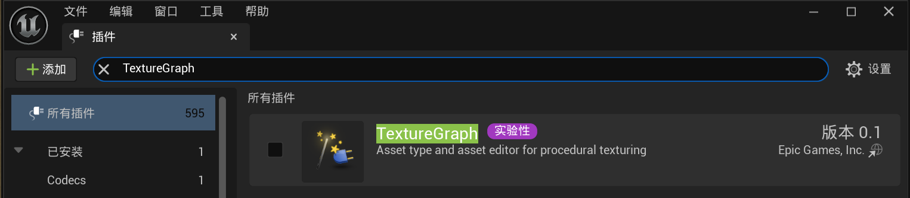
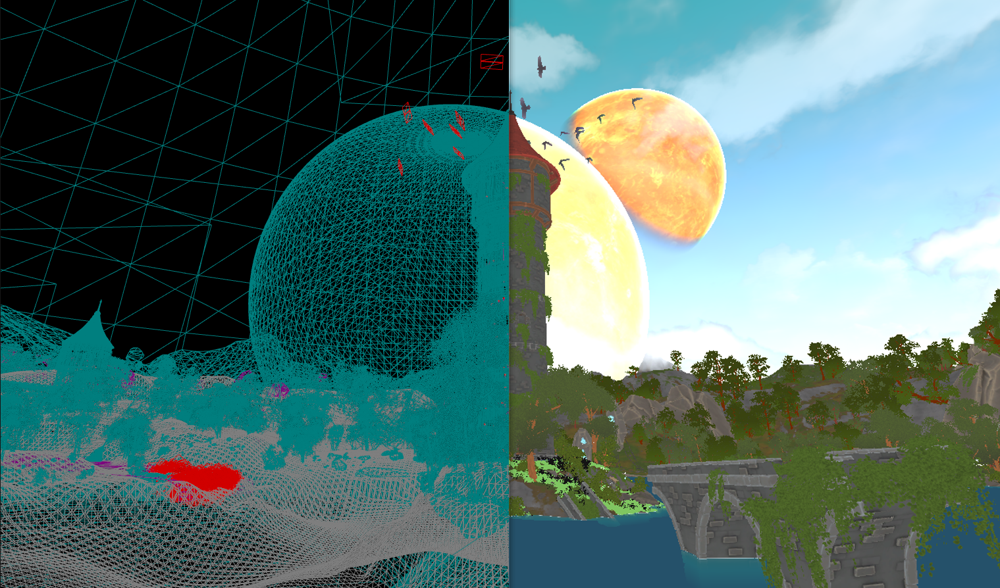
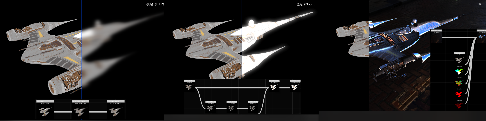
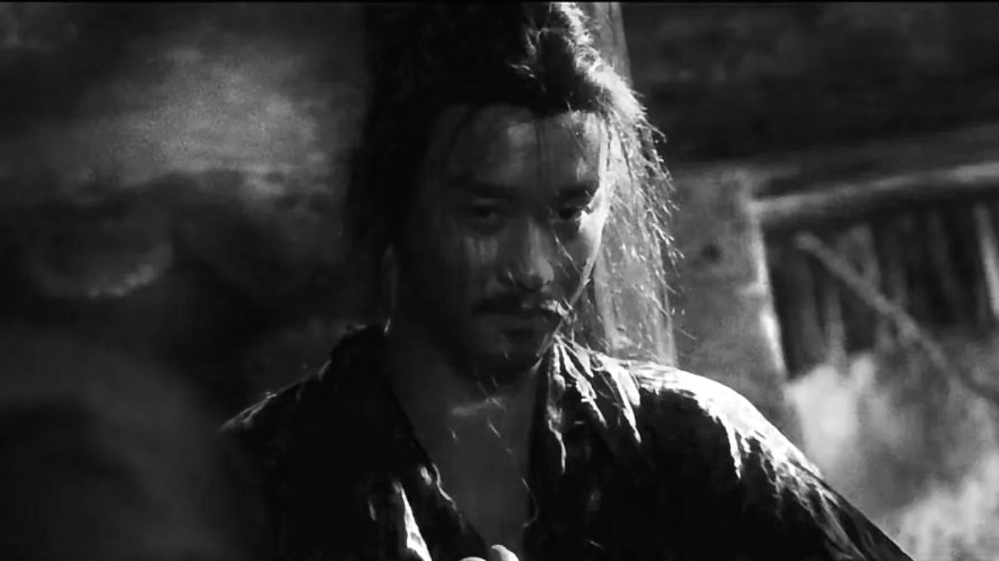

# Unreal Enigne 5 开发 - Texture Graph

**Texture Graph** 是 UE 5.4 推出的一个实验性插件，它主要用于程序化的纹理生成。



关于 Texture Graph 的使用和介绍，这里有很多完善的资料：

- [[中文直播]第51期 | UE5.4新功能之TextureGraph | 朱昌盛（天之川）](https://www.bilibili.com/video/BV1As421M7Bj/)

- [UE5.4纹理图入门 CG世界](https://m.163.com/dy/article/J56TPVL50516BJGJ.html)
- [UE5.4新功能 - Texture Graph上手简介 | CSDN | 电子云与长程纠缠](https://blog.csdn.net/grayrail/article/details/140191905)
- [UE5.4TextureGraph | GALAXIX动漫大陆](https://www.bilibili.com/video/BV1FM4m1o7LE)

很多小伙伴可能看完插件介绍之后，感觉它好像有点用，但是似乎跟自己没多少关系，但实际上，它其实是一个非常强大的插件！

## 概述

如果你是一名图形开发者应该知道，我们会使用许多 **图形渲染管线（Graphics Rendering Pipeline）** 将几何图形 **（Primitive）** 绘制到一张  **渲染目标（Render Target）** （可以理解为纹理，图像）上，这个过程我们一般称为 **Base Pass** （ 或者 **Mesh Pass** ， **Primitives Pass** ）：



而最终呈现给观众的画面，我们往往还需要根据 Base Pass 输出的图像，增加一些额外的效果（比如全局光照，后期处理...)：


这类效果通常是使用一堆 Render Pass 来生成的，Render Pass通常会需要输入一些纹理，最终生成一些RT，而这些生成的RT，又可以作为另一个Render Pass的纹理输入，将这些Render Pass视为一个节点，将它们的输入输出用线连起来，最终我们会得到一个图状结构:



我们通常称它为 **Render Graph / Frame Graph** 。

而我们使用的 Texture Graph，也是类似的流程，只不过 Render Graph 是用来完成一帧游戏画面的绘制，而Texture Graph **通常** 是用来在 **编辑器阶段生成纹理资产** 。

## 用途

Texture Graph 虽然本质上是做程序化纹理，但实际上它的功能集远不如成熟的程序化纹理工具（比如 [Substance Designer](https://www.adobe.com/hk_en/products/substance3d/apps/designer.html)），它比较适合像笔者这种既没有深入了解程序化纹理，也不能熟悉使用PS，但知道怎么写代码，并具备一定图像处理知识基础的人。

笔者会用它来做这些事情：

1. 拖动节点来快速编写逻辑去进行简单的图像处理，对于开发人员来说，当明确输入输出的时候，编写代码往往会比操作编辑器更加直观和高效。

2. 搭建可复用的纹理生成管线，也就是模板化，如果存在大量 源（输入）纹理，或者是 源纹理 会随着时间周期频繁迭代时，会非常有用。

## 用例

下面举几个用例简单介绍下笔者都用它干了些什么花活。

### 图像处理小工具

前段时间看了一遍 《东邪西毒》，里面有个镜头超级帅0.0


想着扒下来做个背景，画风有点油腻，变黑白说不定会好看点，搞个灰度化：


感觉还不错，就是鼻头那点光泽感觉怪怪的，于是打开PS：

- 试下擦除笔，不行，变糊了。
- 用套索工具把亮的那块框出来，调亮度范围，靠，调完之后边缘平滑不了。

明明很简单的逻辑，只是想让鼻头那里不要那么亮，折腾半天没搞，最终打开了Qt，写了条渲染管线，几行代码解决，片段着色器的代码大概是这样的（数值不准确）：

``` c++
void main(){
    vec4 TextureColor = texture(Texture, UV);
    float Gray = (TextureColor.r + TextureColor.g + TextureColor.b) / 3;		// 灰度化
    if( UV.x > 0.53 && UV.x < 0.56 && UV.y > 0.45 && UV.y < 0.51)					// 筛选区域
    {
        if(Gray > 0.2)															// 筛选出灰度值大于0.2的部分
        {
            Gray = 0.2 + (Gray - 0.2) * 0.1; 									// 将超出0.2的部分灰度缩放为原来的0.1倍。
        }
    }
    OutFragColor = vec4(Gray, Gray, Gray, 1);
}
```

最终效果还不错：



当然用Python，CV也能很快实现，但是很多会UE的小伙伴并不会写代码，也不会使用那些复杂的软件（光是学清楚UE就已经很难了），但他们通常都会写材质，所以 Texture Graph 的意义就在于可以让会UE的小伙伴也能去做一些简单的图像处理，而不需要再因为一个比较简单的需求去花大气力学习某个软件。

改成 Texture Graph 完成相同的功能，也很简单： 


### 拟态按钮贴图生成器

很多UI框架一般会支持一些UI特效，其中常见的有：

- Blur（模糊）
- DropShadow（阴影）
- 拟态


UE的UI系统一直被人诟病，

一是非常难用，


### 小地图生成器


1. 

2. 
3. 当Texture。


它主要适用于这样的场景：

- 能快速
- 
- 


在早期的游戏引擎中，并没有 Render Graph这个概念，因此就导致了游戏的图形渲染结构固化，可扩展性很差。

而在现代游戏引擎中，我们通常会去构造一个 Render Graph 来完成一帧游戏画面的绘制，


是一个对开发友好的图像处理工具，简单点说，你可以将它理解为一个可以通过编程来修图的 [PS](https://www.adobe.com/hk_en/products/photoshop.html)，


如果你厌倦了傻瓜式的


