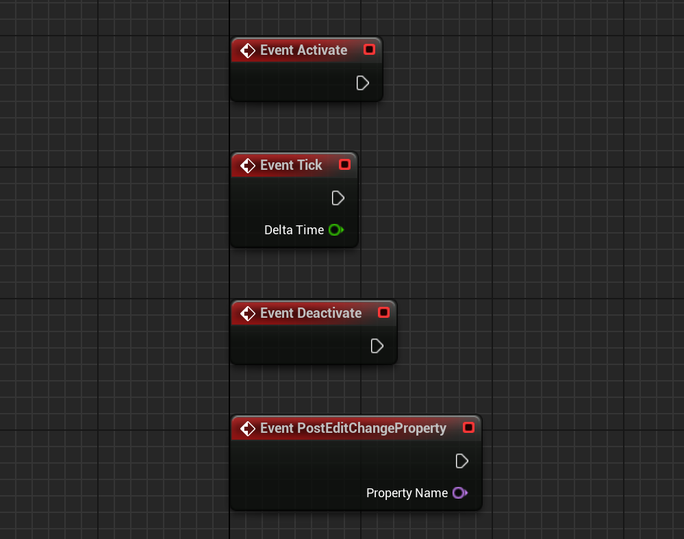

# Unreal Engine 5 开发 — 程序化内容管理

不可否认，游戏体验的核心始终是内容，这一点跟影视行业非常接近，但游戏与影视产业的制作流程却存在显著的差异，尽管游戏具备出色的交互反馈，能让玩家深度参与其中，但算力限制这一严苛条件，如同高悬的达摩克利斯之剑，极大地束缚了游戏行业的内容生产。

影视行业在内容创作时，在一定程度上可以凭借大量的人力、物力和时间投入，采用 “力大砖飞” 的模式 —— 投入海量资源，通过堆积资源和高强度制作来实现高质量内容产出 。

然而游戏行业却难以效仿，受限于算力，游戏无法无节制地堆砌内容元素，否则就会导致游戏卡顿、运行不稳定等问题，严重影响玩家体验。

因此，在游戏行业进行内容生产之前，解决工程化的问题就显得尤为关键。只有通过优化工程流程，合理运用技术手段，提升资源利用效率，才能在有限的算力条件下，实现游戏内容的高质量、高效率产出，满足玩家日益增长的需求。

## 程序化技术

在过去，程序化主要是开发者所聚焦的概念，但近年来，伴随游戏工业化进程的加速，它已悄然渗透进游戏内容生产的各个环节，如同精密齿轮嵌入庞大机械，推动着整体高效运转。毫无疑问，程序化已然成为提升游戏内容产能的关键驱动力，为游戏行业的发展注入源源不断的活力。

[程序化（Procedural）](https://en.wikipedia.org/wiki/Procedural_generation)也叫过程化，它指特定问题的求解过程。

程序化应用的本质上是将问题的求解过程当作是数据资产进行存储，从而保证后续开发能够依靠这些操作数据，进行复用，迭代等（在概念上，它就是一个程序，只不过是在程序中的程序）

游戏行业当下对程序化的应用主要有：

- [ **程序化内容生成** ](https://docs.unrealengine.com/5.2/en-US/procedural-content-generation-overview/)
- [ **程序化建模** ](https://en.wikipedia.org/wiki/Procedural_modeling)
- [ **程序化纹理** ](https://en.wikipedia.org/wiki/Procedural_texture)
- [ **程序化动画** ](https://en.wikipedia.org/wiki/Procedural_animation)
- [ **程序化音频** ](https://en.wikipedia.org/wiki/Synthetic_media)

而这些技术，其实已经逐渐渗透到了美术资产制作的日常当中，它的显著特征是： **通过编程来制作资产而非只有调参** 。

在Unreal Engine中，有着非常优秀的程序化支持：

### Procedural Content Generation


**Procedural Content Generation** 是虚幻中用于PCG的工具集，它为技术美术师、设计师和程序员提供了构建快速、迭代工具和任何复杂性内容的能力，范围从资产（例如建筑物或生物群落生成）到整个世界。

相关参考：

- [Procedural Content Generation Overview | Unreal Engine 5.5 Documentation | Epic Developer Community](https://dev.epicgames.com/documentation/en-us/unreal-engine/procedural-content-generation-overview?application_version=5.5)
- [『UE5 PCG』官方公开课：深入研究Electric Dreams环境项目](https://www.bilibili.com/video/BV1y8411U7Hs)
- [Electric Dreams PCG技术详解（一）——术语、工具和图表介绍](https://mp.weixin.qq.com/s/mGWiPKvWU_NHTktIWA6LnA)
- [Electric Dreams PCG技术详解（二）——沟壑、大型Assembly](https://mp.weixin.qq.com/s/xHdnrFTkywF_7OjqOuALbw)
- [Electric Dreams PCG技术详解（三）——森林、岩石和场景背景](https://mp.weixin.qq.com/s/YWcd8l-VphNLrOlg3zkSzA)
- [Electric Dreams PCG技术详解（四）——远景、雾气、自定义节点及子图表](https://mp.weixin.qq.com/s/CWTUcRIBTXw8WvhX3jrcBw)

### Meta Sounds


**Meta Sounds** 支持进行用户自定义、第三方可扩展、图表重复利用，并提供了可以在编辑器中进行声音设计的强大工具。

相关参考：

- [MetaSounds in Unreal Engine | Unreal Engine 5.5 Documentation | Epic Developer Community](https://dev.epicgames.com/documentation/en-us/unreal-engine/metasounds-in-unreal-engine?application_version=5.5)
- [音频编程基础 - Italink](https://italink.github.io/ModernGraphicsEngineGuide/04-UnrealEngine/7.%E9%9F%B3%E9%A2%91%E5%BC%80%E5%8F%91) 
- [活动演讲 | 初学者的MetaSound指南(官方字幕)](https://www.bilibili.com/video/BV15G4y1A7B5)

### Geometry Script


**Geometry Script** 提供了一组使用蓝图和Python生成和编辑网格体几何体的API，它可以在编辑器工具控件（ Editor Utility Widgets）中编写几何体脚本（Geometry Scripting）和 资产操作（Asset Actions）来创建自定义网格体分析函数库、处理和编辑工具，还可以在Actor蓝图中用它创建程序化对象并实现复杂的几何查询。

相关参考：

- [虚幻引擎中的几何体脚本编写简介 | 虚幻引擎 5.5 文档 | Epic Developer Community](https://dev.epicgames.com/documentation/zh-cn/unreal-engine/introduction-to-geometry-scripting-in-unreal-engine?application_version=5.5)

### Animation Blueprints


用于模拟或在游戏中控制骨骼网格体的蓝图，可以在其中混合动画，调整骨架，创建逻辑来定义每帧使用的最终动画姿势（Pose）

相关参考：

- [Animation Blueprints in Unreal Engine | Unreal Engine 5.5 Documentation | Epic Developer Community](https://dev.epicgames.com/documentation/en-us/unreal-engine/animation-blueprints-in-unreal-engine?application_version=5.5)

### Material Blueprint


用于定义场景对象表面属性的蓝图，可以使用各种图像（纹理），基于节点的材质表达式 以及 材质本身的固有属性 来定义 场景物体最终的表面属性。

相关参考：

- [Unreal Engine Materials | Unreal Engine 5.5 Documentation | Epic Developer Community](https://dev.epicgames.com/documentation/en-us/unreal-engine/unreal-engine-materials?application_version=5.5)

### Texture Graph


**Texture Graph** 为艺术家提供了一个界面，可以直接在 Unreal Engine 中创建或编辑纹理资源，而无需外部图像编辑包。利用类似于 Material Editor 的熟悉节点图，可以将一系列节点连接到输出纹理。

您可以将纹理图表与蓝图、材质和材质函数相结合，以获得只有在 Unreal Engine 中才能实现的独特工作流程。

使用 Texture Graph 可以做很多有意思的应用，比如笔者最近用它来：

- **P图** ：对于开发来说，写代码的自由度相比编辑器操作来说，可太高了。

    

- **制作UI素材** ：虚幻的UI系统并不支持复杂的界面特效，比如边缘模糊（Blur），投射阴影（DropShadow），拟态（Neumorphism）...，这是因为UI这是整个图形内容的一小部分，它只有少量的预算，而使用这些特性需要较为复杂的渲染结构，但借助Texture Graph，我们可以生成这些效果所需要的素材图，配合一些简单的编辑器扩展，这套流程会非常丝滑。
- **生成风格化参考** ：可以给 Texture Graph 扩展一个 AI调用的节点，这样就能让虚幻引擎原生的图形内容，借助AI轻易的实现一些风格化参考，比如笔者用它来生成了：
    - 为项目内容生成了引擎启动加载时的Splash图和缩略图
    - 结合Scene Capture动态地为场景生成一张风格化的小地图
    - 为某些场景生成风格化的加载页面
    - ...

相关参考：

- [Getting Started with Texture Graph | Epic Developer Community](https://dev.epicgames.com/community/learning/tutorials/z0VJ/unreal-engine-getting-started-with-texture-graph)
- [[中文直播]第51期 | UE5.4新功能之TextureGraph | 朱昌盛（天之川）](https://www.bilibili.com/video/BV1As421M7Bj/)
- [UE5.4纹理图入门 CG世界](https://m.163.com/dy/article/J56TPVL50516BJGJ.html)
- [UE5.4新功能 - Texture Graph上手简介 | CSDN | 电子云与长程纠缠](https://blog.csdn.net/grayrail/article/details/140191905)
- [UE5.4TextureGraph | GALAXIX动漫大陆](https://www.bilibili.com/video/BV1FM4m1o7LE)

## 程序化内容管理

上面提到的这些程序化技术的应用，赋予了我们前所未有的创作效能，与过去相比，现在的我们能够在更短的时间内，以更低的预算，产出更为丰富的游戏内容。这不仅显著提升了开发效率，还拓宽了游戏内容的边界，为玩家带来更多元化的体验。

然而，凡事皆有两面性。更多内容的产出，也意味着管理成本将呈指数级增长。从资产管理、版本控制，到测试与更新迭代，每一个环节都需要投入更多的人力、物力和时间成本，以确保庞大的内容体系能够有序运行，不出现任何混乱或差错。

笔者之前在场景搭建的时候非常推崇使用PCG技术，因为整合出一条生成管线肯定是更容易迭代和优化的。

但实际上，目前业界对于PCG的应用还是比较理想化，真正能落地的应用场景并不多。

其很大的原因就在于PCG不接”地气“，目前大多数游戏制作团队场景设计的岗位职责职责划分一般是：

- **游戏策划** ：负责规划游戏场景的整体框架，包括场景的功能、故事背景、风格定位、玩家在场景中的体验流程等，为场景设计提供明确的方向和需求文档。
- **概念设计师** ：根据策划的需求，进行场景的概念设计，通过手绘或数字绘画等方式，绘制出场景的整体风格、氛围、主要建筑和地形的大致形态等概念草图，为后续的详细设计提供视觉参考。
- **场景原画设计师** ：在概念设计的基础上，对场景中的具体元素进行详细的原画设计，包括建筑的结构、装饰细节、地形的起伏变化、植被和道具的样式等，以精确的绘画形式呈现出每个元素的造型、色彩、材质等细节，为建模师提供准确的制作蓝图。
- **3D 建模师** ：使用 3D 建模软件，根据场景原画将设计好的场景元素构建成三维模型，包括搭建建筑、地形、道具等的基础框架，赋予其体积和空间感，并进行初步的 UV 拆分，为后续的纹理绘制做准备。
- **材质灯光师** ：为 3D 模型添加材质和纹理，模拟出物体的真实质感，如木材的纹理、金属的光泽、石头的粗糙感等。同时，负责设置场景中的灯光效果，营造出不同的氛围和光影效果，增强场景的真实感和视觉冲击力。
- **场景音效师** ：负责为场景创作、选择和添加合适的音效，根据场景的主题、情感、氛围等进行音效设计，通过采集、编辑、混音等操作，使音效与场景完美融合，增强场景的沉浸感。
- **特效师** ：根据场景的需要，设计和制作各种特效，如火焰、烟雾、水流、魔法效果等，为场景增添生动性和趣味性，提升玩家的沉浸感。
- **关卡设计师** ：主要负责场景的布局和规划，根据游戏玩法和策划要求，合理安排怪物、道具、任务点、障碍物等元素在场景中的位置，设计玩家的行进路线和关卡难度曲线，确保玩家在场景中能获得良好的游戏体验。
- **场景优化师** ：对已经制作完成的场景进行性能优化，通过减少模型面数、压缩纹理、合理设置光照烘焙等手段，降低场景对硬件的资源占用，提高游戏的运行效率，保证在不同设备上都能流畅运行。

在场景设计的过程中，通常需要以上岗位之间密切的沟通与频繁的迭代，才能完成最终的交付。

之所以使用PCG，是因为游戏团队大幅提升内容原料（模型，材质，特效，音效...）的生产产能之后，同样需要一种高效的手段去完成场景搭建，并兼顾性能优化问题。

但由于PCG管线设计的复杂性，多人协作是非常非常非常困难的，具体到实际项目里面，可能就需要较高水准的TA负责编写PCG的逻辑，而”它“不仅要精通美术制作流程，监管原材料的规范性，同时兼顾游戏策划的需求，及时响应变更，还得了解引擎底层，制定性能优化策略。


据 [相关信息](https://forum.quartertothree.com/t/the-matrix-awakens-an-unreal-engine-5-experience/154271/67) 显示，在虚幻引擎的 《黑客帝国 : 觉醒》示例的开发过程中，大约有 `20-30` 人负责处理资产，整个团队有 `50-70` 名工作人员，这毫无疑问绝对是一次壮举。

在这个示例里面我们能看到 PCG 所展现出的巨大潜力：“轻而易举” 就搭建出了这么恢宏的城市。

而PCG落地困难的原因，我们可以直接归结于很多团队很难拥有像Epic一样的团队质量。

其次，PCG的目标在于归纳和总结出一条可持续迭代的生产管线，但对于游戏产品来说，吸引玩家的，永远是内容和创意，而它们，必然是天马行空的。

具体到项目团队中，PCG可以让多个岗位的职责集中到一起，它既有优势，可以快速地响应迭代，也有劣势，限制各方人员的创意发挥，从而影响内容质量和产能。

与PCG不同的是，程序化内容管理，更像是一种后处理：

- 旨在以程序化的手段让内容组织变得收敛。

因此，本文没有着眼于介绍那些高深莫测的前沿技术，而是聚焦于当下游戏内容生产过程中，梳理和整合一系列常见的程序化手段去管理虚幻引擎中的 **对象（Object）** ， **资产（Asset）** 和 **世界（World）** 。

而使用程序化的手段去管理内容，其原因，简单来说就是： 

- 一些明明看起来很“直观”的操作，在编辑器层面，我们就是很难做到。

这种窘境可以用一段简短的对话来阐述：

>A：你知道大象吗？
>
>B：那当然知道。
>
>A：我非常好奇它的模样，你能把它画出来吗？
>
>B：抱歉，我不会画画，因此我不能~

而程序化的目的，就在于我们并不是直接对具体的目标进行处理，而是通过特征描述我们想要做的事情，这样使得操作的输入和过程可以具有一定的弹性。相当于给出了这样的回答：

> B：抱歉，虽然我不能把大象画出来，但我能告诉你，大象长得特别高大，灰色的身体，四条腿又粗又壮，有蒲扇一样的大耳朵，长长的鼻子能卷起东西，有长着两颗又尖又长的牙齿 ，以后你见到它肯定都一眼就能认出来~

对于游戏项目来说，一些内容制作相关的重型编辑器，通常需要由专业的人员进行开发和委托，但除此之外，游戏内容制作的过程中也存在大量琐碎的 **微需求** ，虽然没必要为这些需求安排专业的人员去开发编辑器工具，但如果没有编辑器工具的辅助，这些任务将会很难完成，比如说：

- 根据坐标区域 `[X0,Y0  -  X1,Y1]`，选中该区域所有的Actor，导出为子关卡进行本地测试
- 筛选出场景中所有开启阴影的光源，检查其阴影的合理性
- 概览所有网格体组件，根据包围盒的大小及其他特征，批量给予组件一定光影和剔除的LOD策略
- 概览所有场景特效的包围盒大小，检索特效包围盒是否存在异常项
- 批量调整特定组件的属性，比如 位移变换，光影开关，物理策略，渲染属性...
- 批量修改资产的某些属性的开关
- 批量筛选出具有特定特征的Actor，并给予高亮显示。
- 搜集场景中所有的静态模型 `SM_BigTree0001`，批量替换为封装好的蓝图 `BP_BigTree0001`，它为树模型额外提供了落叶飘散的粒子特效组件以及树叶摩梭的音效组件
- 向某个区域批量发送射线对场景进行采样，将射线检测得到场景数据存下来用于制作特效
- 批量预览，排序，搜索和编辑场景中所有`StaticMeshActor`的`StaticMeshComponent`的 `Disallow Nanite` 属性
- 将某个区域的静态网格，自动合并为层级实例化静态网格体组件
- ...

这些需求通常会高频出现在地图编辑，场景管理，资产管理，性能优化的过程中，在体量较小的游戏项目中，由于内容是渐进累加的，通常抱着不行咱就砍的心态，一般不会产生太大的问题，但在大型的游戏项目中，内容之间的关系错综复杂，虽然通过PCG技术能缓解一部分压力，但如果没有及时妥善地去解决好这些微需求，内容管理也是非常容易失控的：


- 巫师3 - 开放世界的内容优化管线：https://www.youtube.com/watch?v=p8CMYD_5gE8

## 程序化内容处理插件

虚幻引擎毫无疑问是目前最强大，最通用的游戏引擎，这很大程度得益于其优秀的核心结构设计，既然我们的目标是对虚幻引擎中的内容进行高效地程序化管理，那么深入了解它的体系结构就显得尤为必要且具有重要意义。

由于展开这部分内容将会占用大量的篇幅，因此笔者对之前基础体系的[文档](https://zhuanlan.zhihu.com/p/636151878)根据当前的关注点更新了部分内容，如果对更多的细节感兴趣，网上也有很多优秀的剖析文章：

- 核心架构：[InsideUE - 大钊](https://zhuanlan.zhihu.com/p/22813908)
- 渲染体系：[博客园 - 向往 | 剖析虚幻渲染体系 ](https://www.cnblogs.com/timlly/p/13512787.html)
- 资产管理：[知乎 - UE4的资源管理](https://zhuanlan.zhihu.com/p/357904199)

此外，需要提醒的是，如果没有恰当的项目规范，就是上帝来了也得直摇头：

- 虚幻引擎规范指南：https://github.com/thejinchao/ue5-style-guide

程序化内容处理通常可以囊括为三个基本步骤：


针对如上的流程，笔者搭建了一个简单小巧的编辑器框架（ **ProceduralContentProcessor** ）用来完成这些步骤，它作为一个工具箱，可以轻易派生和扩展统一结构的编辑器工具，插件的Github仓库是：

- https://github.com/Italink/ProceduralContentProcessor

后文将基于这个插件阐述每个阶段具体处理的步骤。

放置插件到项目的`Plugins`目录后，可以在关卡编辑器的编辑器模式下找到 `程序化内容处理器模式`：


**Procedural Content Processor**  提供了三个可用的蓝图资产，可以派生蓝图来扩展自己的编辑器模式：

- **程序化资产处理器（ProceduralAssetProcessor）** ：用于编写 **资产（Asset）** 操作相关的编辑器工具
- **程序化关卡处理器（ProceduralWorldProcessor）** ：用于编写 **关卡（World）** 处理相关的编辑器工具
- **程序化Actor着色器（ProceduralActorColorationProcessor）** ：用于编写Actor调试着色策略。


### 基本用法

**Procedural Content Processor** 本身并没有提供大多复杂的机制，它大多是依托于引擎的原生功能。

一个关键点是：

- 勾选了 **CallInEditor（在编辑器中调用）** 的蓝图函数（或是`UFUNCTION`中具有`CallInEditor`标识符的C++函数），会在对象的细节面板上生成相应的按钮，点击该按钮，将会执行对应的函数逻辑：


以此为契机，我们可以轻易编写大量的编辑器工具。

程序化内容处理器的蓝图`类设置`中的一些选项将会影响到编辑器大纲的显示：

- **Sort Priority** ：排序优先级，影响编辑器大纲中下拉框的排序。
- **Document Hyperlink** ：该处理器的文档链接，点击编辑器大纲上的 【? 按钮】将打开对应的网址。
- **Override UMGClass** ：使用UMG控件顶替默认的细节面板，一般用于自定义编辑器的UI。
- **蓝图显示名称** ：该处理器在编辑器大纲中的真实显示名称。
- **蓝图描述** ：该处理器在编辑器大纲中的提示信息。
- **蓝图命名空间** ：该处理器在编辑器大纲中的分类，多级分类以`.`隔开。


蓝图属性中的一些配置会对细节面板有所影响：

- **可编辑实例** ：只有勾选了可编辑实例的属性，才能在对象的细节面板上编辑，否则只能在蓝图编辑器中修改默认值。
- **只读蓝图** ：勾选后，该属性将变得不可编辑，但会预览。
- **配置变量** ：勾选后，该属性的值将会被存到配置文件中，下次启动处理器时会读取之前的配置。


> 在编辑器制作过程中，一些属性标识和元数据非常有用，但它们并没有公开给蓝图编辑器，这里推荐一个插件：https://github.com/DoubleDeez/MDMetaDataEditor

程序化内容处理器拥有四个可覆写的基本事件函数：

- `void Activate()`：处理器激活时调用。
- `void Tick(DeltaTime)`：处理器激活后，每帧调用。
- `void Deactivate()`：处理器退出时调用。
- `void PostEditChangeProperty(PropertyName)`：处理器属性变更时调用。



对于C++而言，可以覆写如下函数来深度定制编辑器：

- `virtual TSharedPtr<SWidget> BuildWidget()`

UE的细节面板非常强大，仅仅通过 **属性 + 函数** 的方式我们就可以快速搭建出简单易用的编辑器：


### 搜集

#### 关卡

对于 **程序化关卡处理器（ProceduralWorldProcessor）** ，可以在编辑器函数中调用 `GetAll...()` 函数来搜集Actors：


#### 资产

对于 **程序化资产处理器（ProceduralAssetProcessor）** ，则可以编辑器函数中调用 `GetAllAssetRegistry()` 函数获取到资产注册表，从而操作资产。


### 审查

#### Actor着色

插件里还提供了一个资产类型 — **程序化Actor着色器（ProceduralActorColorationProcessor）** 

它相较于 **ProceduralWorldProcessor** ，多了一个事件函数`FLinearColor Colour(const UPrimitiveComponent* PrimitiveComponent)`，可以通过覆写它来对当前场景中所有的图元组件进行调试着色：

> 需要引擎版本>=5.4


#### 对象属性矩阵

在虚幻引擎中，官方提供了一个 **属性矩阵** 的功能用来批量更改资产的某些属性：


**Procedural Content Processor** 在它的基础上，支持以程序化的方式来构建任意对象（UObject）的属性编辑矩阵。

我们只需要在蓝图中添加一个 **Procedural Object Matrix** 类型的成员变量：


在编辑器函数中调用如下接口就能构造对象属性矩阵，它会显示在对象的细节面板上：

- `void ClearObjectMaterix()`：清理对象矩阵
- `void AddTextField(Owner, FieldName, FieldValue)`：添加简单的预览文本，意味着`{Owner}`行，`{FieldName}`列，将被填充为`{FieldValue}`
- `void AddPropertyField(Owner，PropertyName)`：添加属性编辑器，意味着`{Owner}`行，`{PropertyName}`列，将被填充为 【Owner对象PropertyName属性】的编辑器。
- `void AddPropertyFieldBySecondaryObject(Owner，SecondaryObject，SecondaryObjectPropertyName)`：添加属性编辑器，意味着`{Owner}`行，`{SecondaryObjectPropertyName}`列，将被填充为 【SecondaryObject对象SecondaryObjectPropertyName属性】的编辑器。


这是引擎中的一个使用示例：


#### 对象细节视图

虚幻的细节面板可以轻松编辑任意UObject的属性：


但它通常需要明确去选中对象，插件中提供了一个蓝图函数用来显示任意对象的属性面板：

- `void ShowObjectDetailsView(UObject* InObject)`

这样就可以轻易调整一些对象的属性，比如UI，运行时子对象，临时对象等


#### 对象编辑器

使用如下蓝图函数可以打开对应对象的编辑器：

-  `void ShowObjectEditor(UObject* InObject)`

### 处理

对于数据的处理，就需要结合实际的业务需求具体去实现，截止到目前， **UProceduralContentProcessorLibrary** 中包含了如下接口，如有需要，可自行添加：

#### 对象操作

```C++
static TArray<UObject*> GetAllObjectsOfClass(UClass* Class, bool bIncludeDerivedClasses = true);

static TArray<UObject*> GetAllObjectsWithOuter(UObject* Outer, bool bIncludeNestedObjects = true);

static TArray<UClass*> GetAllDerivedClasses(const UClass* ClassToLookFor, bool bRecursive);

static UObject* DuplicateObject(UObject* SourceObject, UObject* Outer);

static int32 DeleteObjects(const TArray< UObject* >& ObjectsToDelete, bool bShowConfirmation = true, bool bAllowCancelDuringDelete = true);

static int32 DeleteObjectsUnchecked(const TArray< UObject* >& ObjectsToDelete);

static void ConsolidateObjects(UObject* ObjectToConsolidateTo, UPARAM(ref) TArray<UObject*>& ObjectsToConsolidate, bool bShowDeleteConfirmation = true);

static TSet<UObject*> GetAssetReferences(UObject* Object, const TArray<UClass*>& IgnoreClasses, bool bIncludeDefaultRefs = false);

static bool IsGeneratedByBlueprint(UObject* InObject);

static void ShowObjectDetailsView(UObject* InObject);

static void ShowObjectEditor(UObject* InObject);

static UObject* CopyProperties(UObject* SourceObject, UObject* TargetObject);

static void ForceReplaceReferences(UObject* SourceObjects, UObject* TargetObject);

static void SetObjectPropertyByName(UObject* Object, FName PropertyName, const int& Value);
DECLARE_FUNCTION(execSetObjectPropertyByName);
```

#### 资产操作


```C++
static bool ObjectIsAsset(const UObject* InObject);

static UBlueprint* GetBlueprint(UObject* InObject);

static bool IsNaniteEnable(UStaticMesh* InMesh);

static void SetNaniteMeshEnabled(UStaticMesh* InMesh, bool bEnabled);

static bool IsMaterialHasTimeNode(AStaticMeshActor* InActor);

static bool MatchString(FString InString,const TArray<FString>& IncludeList, const TArray<FString>& ExcludeList);

static float GetStaticMeshDiskSize(UStaticMesh* StaticMesh, bool bWithTexture = true);

static UStaticMesh* GetComplexCollisionMesh(UStaticMesh* InMesh);

static void SetStaticMeshPivot(UStaticMesh* InStaticMesh, EStaticMeshPivotType PivotType);

static UStaticMeshEditorSubsystem* GetStaticMeshEditorSubsystem();

static float GetLodScreenSize(UStaticMesh* InStaticMesh, int32 LODIndex);

static float GetLodDistance(UStaticMesh* InStaticMesh, int32 LODIndex);

static float CalcLodDistance(float ObjectSphereRadius, float ScreenSize);

static float CalcScreenSize(float ObjectSphereRadius, float Distance);

static float CalcObjectSphereRadius(float ScreenSize, float Distance);

static UTexture2D* ConstructTexture2D(UTextureRenderTarget2D* TextureRenderTarget2D, UObject* Outer, FString Name, TextureCompressionSettings CompressionSettings = TC_Default);

static UTexture2D* ConstructTexture2DByRegion(UTextureRenderTarget2D* TextureRenderTarget2D, FBox2D Region , UObject* Outer, FString Name, TextureCompressionSettings CompressionSettings = TC_Default);

static void UpdateTexture2D(UTextureRenderTarget2D* TextureRenderTarget2D, UTexture2D* Texture);

static FNiagaraSystemInfo GetNiagaraSystemInformation(UNiagaraSystem * InNaigaraSystem);

static FVector2D ProjectWorldToScreen(const FVector& InWorldPos, bool bClampToScreenRectangle);

static bool DeprojectScreenToWorld(const FVector2D& InScreenPos, FVector& OutWorldOrigin, FVector& OutWorldDirection);

static UPhysicalMaterial* GetSimplePhysicalMaterial(UPrimitiveComponent* Component);
```

#### Actor 操作

```C++
static TArray<AActor*> BreakISM(AActor* InISMActor, bool bDestorySourceActor = true);

static AActor* MergeISM(TArray<AActor*> InSourceActors, TSubclassOf<UInstancedStaticMeshComponent> InISMClass, bool bDestorySourceActor = true);

static void SetHLODLayer(AActor* InActor, UHLODLayer *InHLODLayer);

static void SelectActor(AActor* InActor);

static void LookAtActor(AActor* InActor);

static AActor* SpawnTransientActor(UObject* WorldContextObject, TSubclassOf<AActor> Class, FTransform Transform);

static AActor* ReplaceActor(AActor* InSrc, TSubclassOf<AActor> InDst, bool bNoteSelectionChange = false);

static void ReplaceActors(TMap<AActor*, TSubclassOf<AActor>> ActorMap, bool bNoteSelectionChange);

static void ActorSetIsSpatiallyLoaded(AActor* Actor, bool bIsSpatiallyLoaded);

static bool ActorAddDataLayer(AActor* Actor, UDataLayerAsset* DataLayerAsset);

static bool ActorRemoveDataLayer(AActor* Actor, UDataLayerAsset* DataLayerAsset);

static bool ActorContainsDataLayer(AActor* Actor, UDataLayerAsset* DataLayerAsset);

static FName ActorGetRuntimeGrid(AActor* Actor);

static void ActorSetRuntimeGrid(AActor* Actor, FName GridName);
```

#### 编辑器接口

``` c++
static void BeginTransaction(FText Text);

static void ModifyObject(UObject* Object);

static void EndTransaction();

static UUserWidget* AddDialog(UObject* Outer, TSubclassOf<UUserWidget> WidgetClass, FText WindowTitle = INVTEXT("Dialog"), FVector2D DialogSize = FVector2D(400, 300), bool IsModalWindow = true);

static EMsgBoxReturnType AddMessageBox(EMsgBoxType Type, FText Msg);

static UUserWidget* AddContextMenu(UUserWidget* ParentWidget, TSubclassOf<UUserWidget> WidgetClass, FVector2D SummonLocation = FVector2D::ZeroVector);

static void DismissAllMenus();

static void AddNotification(FText Notification, float FadeInDuration = 2, float ExpireDuration = 2, float FadeOutDuration = 2);

static void AddNotificationWithButton(FText Notification, UObject* Object, TArray<FName> FunctionNames);

static void PushSlowTask(FText TaskName, float AmountOfWork);

static void EnterSlowTaskProgressFrame(float ExpectedWorkThisFrame = 1.f, const FText& Text = FText());

static void PopSlowTask();

static void ClearAllSlowTask();
```

### 示例

目前插件中已经提供了一些简单的示例参考：


**Function Test** ：接口测试

- ISM Merge and Break：测试ISM拆解合并接口
- Actor Replace：测试Actor替换接口

**Custom Debug View** ：后处理调试视图，用于查看场景中坡度大于某个值的区域：


**CustomUMG** ：演示如何自定义编辑器面板，显示通知，弹窗，对话框，进度条，对象细节面板，对象编辑器：


**CustomObjectMatrix** ：演示对象属性编辑器的用法：


**CustomActorColoration** ：演示Actor着色的用法 


