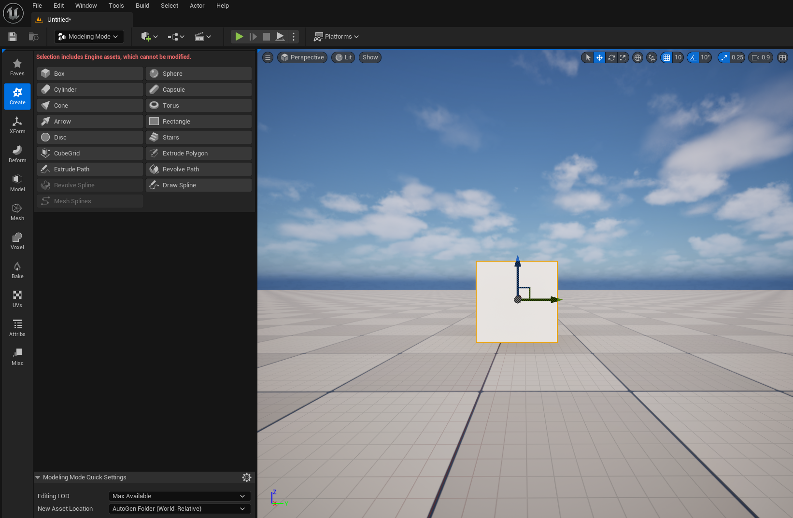
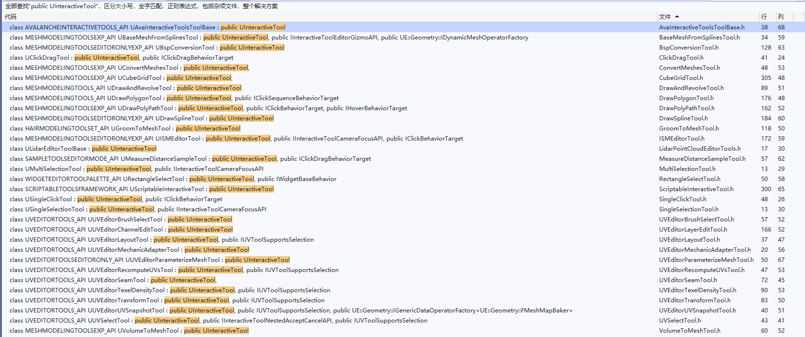
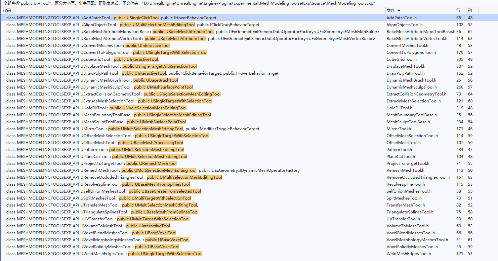
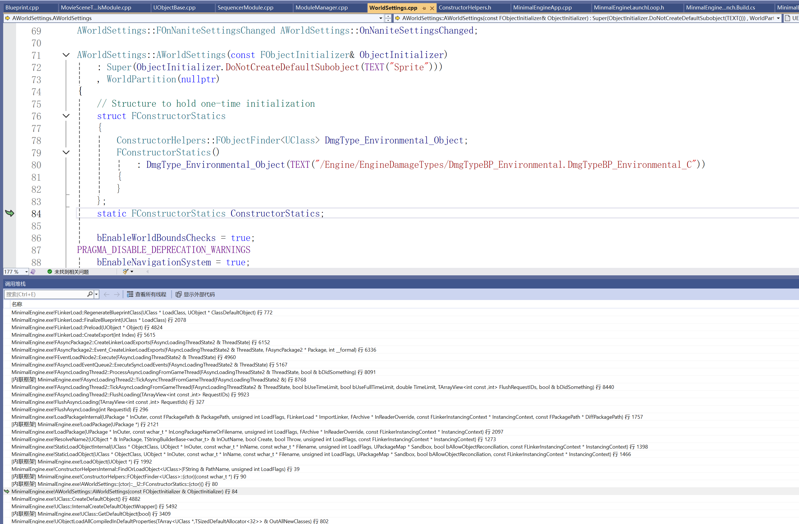
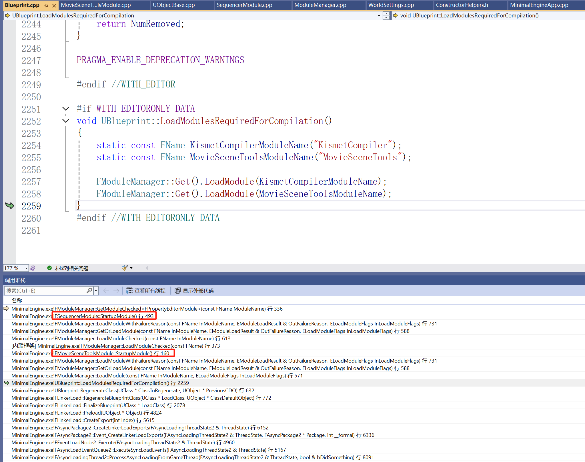

# 几何处理

最近被朋友邀请一起组队参加了深圳举办的 第五届全国人工智能大赛， 喜提三等奖，在这个比赛过程中跟学术方向的同学打交道，学到了不少在工作中接触不到的知识和经验，唯一可惜的是，只能以竞争者的身份去参加这个比赛，由于看不到其他参赛队伍的流程和策略，很难跟其他同学一起学习和交流，可恶，本来想着如果看到有大佬的话直接上去递简历T.T

言归正传，赛题的任务是：

- 输入一组图片，挑选出特定物体然后重建出一个高质量的模型

在早期，我们针对这个任务做了大量的方案测试，最终确定好策略之后，主要划分为两个阶段：

- 挑选出图像中特定的物体并转换为模型。
- 优化模型以满足工业生成的要求。

阶段一由另一位同学负责，涉及到他的研究方向不能透露0.0

而几何优化这一部分由我负责，早期我的计划是使用一些几何处理的SDK，比如之前一直提到的：

- [Simplygon - 树立 3D 游戏内容优化标准](https://link.zhihu.com/?target=https%3A//www.simplygon.com/)
- [InstaLOD - 生产和自动优化3D内容所需的一切](https://link.zhihu.com/?target=https%3A//instalod.com/zh/)

但这些SDK是商业收费且跟环境绑定的，由于比赛程序需要提交到虚拟环境中，这些SDK就用不了，虽然也有一些开源的几何算法和库，但往往不是那么全面，于是我就打起了虚幻引擎的主意0.0，最终完工之后，我只能说：

- 真香！

## 建模工具

不知道大家有没有用过虚幻引擎的建模工具插件：




它里面提供了非常全面的几何处理工具，所以我就在想，能不能把它拆出来单独去用。

当我实际去做尝试，一开始的关注点放得很底层，在网格处理的接口层面去看逻辑，发现剥离出来并不容易，它本质上跟另一个插件 **几何脚本（GeometryScript）** 使用了相同的底层

但当我把关注点放到了 **交互工具框架（InteractiveToolsFramework）** 的时候，发现它似乎在设计之初就考虑到了离线操作的这种情况，因此出乎意料的容易~

在面板上能看到的操作都是一个 **UInteractiveTool** ，引擎里面做了大量的派生：



其中关于网格处理的有这些：



而如果我们想要对一个网格执行 **Remesh** 操作，只需要写这样的代码：

``` c++
void UMinimalEngineCommandlet::Remesh(UStaticMesh* StaticMesh, int TargetPercentage, float InSmoothingStrength, int MaxRemeshIterations, bool bSplitEdge)
{
    // 创建编辑器工具
	FCommandletEditorModeTools CommandletTools;   
    
    // 创建交互工具上下文
	auto InteractiveToolsContext = NewObject<UEditorInteractiveToolsContext>();                  
	
    // 初始化上下文
    InteractiveToolsContext->InitializeContextWithEditorModeManager(&CommandletTools, nullptr);   
	
    // 注册变换工具
    UE::TransformGizmoUtil::RegisterTransformGizmoContextObject(InteractiveToolsContext);         

    // 创建RemeshTool的构建器
	auto ToolBuilder = NewObject<URemeshToolBuilder>();											  
	
    // 在上下文中注册工具，注册名称为"MyTool"
    InteractiveToolsContext->ToolManager->RegisterToolType("MyTool", ToolBuilder);	
    
    // 在上下文中添加目标选取工厂
	InteractiveToolsContext->TargetManager->AddTargetFactory(NewObject<UStaticMeshComponentToolTargetFactory>());  
	
    // 在上下文中选中 MyTool
    InteractiveToolsContext->ToolManager->SelectActiveToolType(EToolSide::Left, "MyTool");

    // 创建临时的静态网格组件，并将资产设置为需要修改的静态网格体
	UStaticMeshComponent* StaticMeshComp = NewObject<UStaticMeshComponent>();
	StaticMeshComp->SetStaticMesh(StaticMesh);

    // 在编辑器工具中选中临时组件
	CommandletTools.SelectComponents({ StaticMeshComp });

    // 激活左侧工具，对应 MyTool
	InteractiveToolsContext->ToolManager->ActivateTool(EToolSide::Left);
    
    // 获取激活的工具
	if (auto Tool = Cast<URemeshTool>(InteractiveToolsContext->ToolManager->ActiveLeftTool)) {
		
        // 传递工具运行的一些参数配置
        Tool->SetSettings(TargetPercentage, InSmoothingStrength, MaxRemeshIterations, bSplitEdge);
		
        // 模拟一次渲染循环
        InteractiveToolsContext->ToolManager->Render(nullptr);
        
        // 模拟工具任务的执行循环
		while (!Tool->CanAccept()) {
			Tool->Tick(0.01f);
		}
        
        // 模拟工具结果的接受请求
		Tool->Shutdown(EToolShutdownType::Accept);
	}
}
```

其中 **FCommandletEditorModeTools** 是重新派生的，因为编辑器面板工具中所使用的是一个全局单例：

``` c++
// UnrealEngine\Engine\Source\Editor\UnrealEd\Private\UnrealEdGlobals.cpp
FEditorModeTools& GLevelEditorModeTools()
{
	checkf(!IsRunningCommandlet(), TEXT("The global mode manager should not be created or accessed in a commandlet environment. Check that your mode or module is not accessing the global mode tools or that scriptable features of modes have been moved to subsystems."));
	if (!ensureMsgf(Internal::EditorModeToolsSingleton.IsValid(), TEXT("The level editor is not started up yet. If you need to access the global mode manager early in the startup phase, please use FLevelEditorModule::OnLevelEditorCreated to gate the access.")))
	{
		Internal::EditorModeToolsSingleton = MakeShared<FEditorModeTools>();
	}
	return *Internal::EditorModeToolsSingleton.Get();
}
```

出于某些考虑，它不允许在命令行中使用，因此我们只需要做一个简单的派生， **FEditorModeTools** 本质上只是起选定的作用：

``` c++
#pragma once

#include "CoreMinimal.h"
#include "EditorModeManager.h"

class FPreviewScene;
class UWorld;

class FCommandletEditorModeTools : public FEditorModeTools
{
public:
	FCommandletEditorModeTools();
	virtual ~FCommandletEditorModeTools() override;

	// FEditorModeTools interface
	virtual USelection* GetSelectedActors() const override;
	virtual USelection* GetSelectedObjects() const override;
	virtual USelection* GetSelectedComponents() const override;
	virtual UWorld* GetWorld() const override;
	void SelectActors(TArray<AActor*> Actors);
	void SelectComponents(TArray<USceneComponent*> Components);
protected:
	UWorld* CommandletWorld = nullptr;
	USelection* ActorSet = nullptr;
	USelection* ObjectSet = nullptr;
	USelection* ComponentSet = nullptr;
	FPreviewScene* PreviewScene = nullptr;
};
```

``` c++
#include "CommandletEditorModeTools.h"
#include "Engine/Selection.h"
#include "PreviewScene.h"
#include "Elements/Framework/TypedElementSelectionSet.h"

FCommandletEditorModeTools::FCommandletEditorModeTools()
{
	CommandletWorld = UWorld::CreateWorld(EWorldType::Editor, true);
	CommandletWorld->AddToRoot();

	UTypedElementSelectionSet* ActorAndComponentsSelectionSet = NewObject<UTypedElementSelectionSet>(GetTransientPackage(), NAME_None, RF_Transactional);
	ActorSet = USelection::CreateActorSelection(GetTransientPackage(), NAME_None, RF_Transactional);
	ActorSet->SetElementSelectionSet(ActorAndComponentsSelectionSet);
	ActorSet->AddToRoot();

	ComponentSet = USelection::CreateComponentSelection(GetTransientPackage(), NAME_None, RF_Transactional);
	ComponentSet->SetElementSelectionSet(ActorAndComponentsSelectionSet);
	ComponentSet->AddToRoot();

	ObjectSet = USelection::CreateObjectSelection(GetTransientPackage(), NAME_None, RF_Transactional);
	ObjectSet->SetElementSelectionSet(NewObject<UTypedElementSelectionSet>(ObjectSet, NAME_None, RF_Transactional));
	ObjectSet->AddToRoot();
}

FCommandletEditorModeTools::~FCommandletEditorModeTools()
{
	if (UObjectInitialized()){
		CommandletWorld->RemoveFromRoot();
		ActorSet->RemoveFromRoot();
		ComponentSet->RemoveFromRoot();
		ObjectSet->RemoveFromRoot();
	}
}

USelection* FCommandletEditorModeTools::GetSelectedActors() const
{
	return ActorSet;
}

USelection* FCommandletEditorModeTools::GetSelectedObjects() const
{
	return ObjectSet;
}

USelection* FCommandletEditorModeTools::GetSelectedComponents() const
{
	return ComponentSet;
}

UWorld* FCommandletEditorModeTools::GetWorld() const
{
	return CommandletWorld;
}

void FCommandletEditorModeTools::SelectActors(TArray<AActor*> Actors)
{
	ActorSet->DeselectAll();
	for (auto Actor : Actors) {
		ActorSet->Select(Actor);
	}
}

void FCommandletEditorModeTools::SelectComponents(TArray<USceneComponent*> Components)
{
	ComponentSet->DeselectAll();
	for (auto Component : Components) {
		ComponentSet->Select(Component);
	}
}
```

而  **URemeshToolBuilder** 并不是引擎提供的类型，这里同样也是做对 **URemeshMeshToolBuilder** 做了一个简单的派生，因为 **URemeshMeshTool** 的大部分变量以及函数都是`protected`，派生是为了能够使用它们：

```c++
UCLASS()
class URemeshToolBuilder : public URemeshMeshToolBuilder
{
	GENERATED_BODY()
public:
	virtual UMultiSelectionMeshEditingTool* CreateNewTool(const FToolBuilderState& SceneState) const override{
    	return NewObject<URemeshTool>(SceneState.ToolManager);
    }
};

UCLASS()
class URemeshTool : public URemeshMeshTool
{
	GENERATED_BODY()
public:
	void SetSettings(int TargetPercentage, float InSmoothingStrength = 0.25f, int MaxRemeshIterations = 20, bool bSplitEdge = true){
        this->BasicProperties->SmoothingStrength = InSmoothingStrength;
        this->BasicProperties->MaxRemeshIterations = MaxRemeshIterations;
        this->BasicProperties->TargetTriangleCount *= TargetPercentage / 100.0f;
        this->BasicProperties->bSplits = bSplitEdge;
        this->Preview->InvalidateResult();          // 使当前工具的结果失效，这会重新激活工具任务的执行
    }
};
```

对于其他工具来说，基本用法也都是这样，只是Tick模拟的时候，有些细微的地方需要注意，比如上面手动模拟了一次渲染循环：

``` C++
InteractiveToolsContext->ToolManager->Render(nullptr);
```

对于有些工具来说，由于缺乏实际的预览场景，可能会导致崩溃，可以直接移除掉它，通常不会影响到结果运行，如果影响了，那么就需要补全工具的输入环境，比如 **UHoleFillTool** 需要选中哪些洞进行填充，你可以在配置设置之前手动调用一下：

``` c++
void UHoleFillTool::SelectAll()
```

对于有些复杂的任务，可能涉及到异步的状态更新，除了模拟工具的Tick之外，可能还会需要模拟引擎的Tick，这个时候可以调用一下如下的函数：

``` c++
while (!Tool->CanAccept()) {
    Tool->Tick(0.01f);
    FakeEngineTick(CommandletTools.GetWorld(), 0.01f, 1); 
}
```

``` C++
void FakeEngineTick(UWorld* InWorld, float InDelta /*= 0.03f*/, int InCount /*= 1*/)
{
	for (int i = 0; i < InCount; i++) {
		if (IsRunningCommandlet()) {
			GEngine->EmitDynamicResolutionEvent(EDynamicResolutionStateEvent::EndFrame);
			CommandletHelpers::TickEngine(InWorld);
			GEngine->EmitDynamicResolutionEvent(EDynamicResolutionStateEvent::EndFrame);
		}
		else if (FSlateApplication::IsInitialized()) {
			FApp::SetDeltaTime(InDelta);
			bool bIsTicking = FSlateApplication::Get().IsTicking();
			GEngine->EmitDynamicResolutionEvent(EDynamicResolutionStateEvent::EndFrame);
			GEngine->Tick(FApp::GetDeltaTime(), false);
			FSlateApplication::Get().PumpMessages();
			FSlateApplication::Get().Tick();
			GFrameCounter++;

			if (!bIsTicking && GIsRHIInitialized) {
				if (FSceneInterface* Scene = InWorld->Scene) {
					ENQUEUE_RENDER_COMMAND(BeginFrame)([](FRHICommandListImmediate& RHICmdList) {
						GFrameNumberRenderThread++;
						GFrameCounterRenderThread++;
						FCoreDelegates::OnBeginFrameRT.Broadcast();
						});

					ENQUEUE_RENDER_COMMAND(EndFrame)([](FRHICommandListImmediate& RHICmdList) {
						FCoreDelegates::OnEndFrameRT.Broadcast();
						RHICmdList.EndFrame();
						});
					FlushRenderingCommands();
				}
				ENQUEUE_RENDER_COMMAND(VirtualTextureScalability_Release)([](FRHICommandList& RHICmdList) {
					GetRendererModule().ReleaseVirtualTexturePendingResources();
					});
			}

			FTaskGraphInterface::Get().ProcessThreadUntilIdle(ENamedThreads::GameThread);

			FSlateApplication::Get().GetRenderer()->Sync();

			FThreadManager::Get().Tick();

			FTSTicker::GetCoreTicker().Tick(FApp::GetDeltaTime());

			GEngine->TickDeferredCommands();

			GEngine->EmitDynamicResolutionEvent(EDynamicResolutionStateEvent::EndFrame);

			FAssetCompilingManager::Get().FinishAllCompilation();
		}
	}
}
```

搞清楚这些之后，虚幻引擎直接堪称神器！

我们可以在编辑器中对参数进行调整，直观地看到各个步骤的结果，从而快速地调整出一套最优的策略，最终我们会把调整好的策略进行封装，打包成一个独立的命令行程序，供算法侧调用。

这里吐槽一下虚幻的编辑器模块，由于我们要打一个包含（建模插件 -> 交互工具框架 -> 编辑器模块）的命令行程序出来，因此创建了一个新的引擎启动循环，并对UBT做了一些配置和调整，但默认打出来的包存在很多奇奇怪怪的依赖，即使做了一些裁剪，但最终的包体还是有1G+.

仔细一查，进入到引擎循环时，已经加载了400+个模块，一翻代码，看得我是泪流满面T.T：

- 比如在 AWorldSettings 构造的时候加载 DmgType 

    

- 还有在蓝图类型注册的时候，链式加载一整个电影序列编辑器（依赖巨大）：

    

一些思考：

笔者在工作经历当中经常遇到一些关于性能优化的疑难杂症，比较常见的是：

- 三维重建得到的模型甚至一些人工建模的模型很多时候都不能直接在引擎里面使用，它们需要满足一定的规格，而这个规格却会随着时间和体量不断发生改变。

无论是模型的生成者还是管理者，都被这个问题折磨得半死不活。

早期笔者尝试过搭建一条几何处理管线来应对这个问题，虽然是参数化的输入，但很多时候，想要得到良好的结果最终还是需要人为主观地进行判断。

这也是我们比赛策略上存在的不足 —— 缺乏创新，基本都是建立在已有的算法和工具上，大多是一些代码和工程的问题。

退出业务开发一线，通过参加这次比赛，才了解到很多前沿的一些技术方向，拿三维重建技术来说，已经非常成熟了，而它距离实时渲染，感觉只差一座桥梁了，而AI，非常擅长这类可量化的问题。

但是，可恶，我不会啊T.T，感兴趣的老哥可以试试~

