**三维高斯泼溅（3D Gaussian Splatting，3DGS）** 是一种用于实时辐射场渲染的计算机图形学技术，它是近几年学术研究的热点，并且已经广泛应用于三维重建领域。

## 三维重建技术

大多数技术领域的产生，通常是 **技术突破降低成本** ， **需求升级创造市场** ， **学术研究提供理论** ， **产业变革拓展场景** 共同作用的结果。

而三维重建领域的发展，在当下计算机技术大爆发的背景下，来自于各行各业对三维信息的迫切需求：

- **工业制造：从 “制造” 到 “智造” 的升级**

    - **逆向工程** ：通过三维扫描获取现有零件的数据，快速重建 CAD 模型，缩短新产品研发周期（如汽车覆盖件模具设计）；

    - **质量检测** ：将重建模型与设计图纸对比，检测表面缺陷或装配误差（如航空航天部件的高精度检测）；

    - **数字孪生** ：构建生产线的三维虚拟模型，实时监控设备状态并优化工艺流程，推动智能制造落地。

-  **医疗健康：精准医疗与可视化革命**

    - **医学影像三维化** ：CT/MRI 断层图像通过三维重建生成器官、肿瘤的立体模型，辅助医生判断病变位置与手术路径（如神经外科的术前规划）；

    - **生物力学仿真** ：基于患者个性化骨骼模型模拟关节运动，制定定制化假肢或康复方案。

- **文化遗产与城市管理：数字化保存与智慧化治理**
    - **文物保护与复原** ：高精度三维重建（如敦煌莫高窟数字化工程）永久保存文化遗产的细节，为破损文物的虚拟修复提供依据；
    
    - **智慧城市建模** ：通过无人机航测或车载 LiDAR 重建城市建筑群，支撑交通规划、灾害模拟（如洪水淹没分析）等应用。
    
- **娱乐与交互：沉浸式体验的技术刚需**

    - **游戏与影视工业化** ：高效建模、虚拟制片、写实渲染及协同生产，推动游戏与影视工业化向自动化、高画质、跨平台协作的数字化生产模式转型；

    - **VR/AR 交互** ：实时三维环境重建是 SLAM（同步定位与地图构建）的核心，支撑了 Meta Quest 等头显设备的空间感知与虚实融合。

- ...

对于三维重建算法，业界通常按传感器是否主动向物体照射光源将其分为：

- **主动式** ：通过主动向物体投射结构化光（如激光、条纹光、编码光等）或声波，利用传感器接收物体表面反射的信号，最终解析信号来获得物体的三维信息。常见的做法如激光扫描、莫尔条纹法、结构光法、ToF（飞行时间法）、相位测量轮廓术等。
- **被动式** ：基于视觉几何原理，通过单目或多目相机采集物体的二维图像，然后对图像进行解析，从而获取物体的三维信息。常见的做法有立体视觉、SfM+MVS、光流法、单目深度估计（如深度学习方法）等。

它们之间的差异主要如下：

| **维度**       | **主动式三维重建**                 | **被动式三维重建**                         |
| -------------- | ---------------------------------- | ------------------------------------------ |
| **硬件成本**   | 高（需主动光源、专用传感器）       | 低（仅需相机）                             |
| **精度**       | 高（亚像素级，适合高精度需求）     | 中低（依赖纹理和视角，适合宏观场景）       |
| **速度**       | 快（单帧或少数图像，适合实时应用） | 慢（多视图匹配，需离线计算）               |
| **纹理依赖**   | 低（主动投射纹理）                 | 高（依赖物体自身纹理）                     |
| **动态适应性** | 差（对运动敏感）                   | 较好（部分算法可处理静态场景中的动态物体） |
| **典型场景**   | 工业检测、文物高精度建模           | 消费级扫描、无人机测绘、大场景重建         |

其中被动式的发展与计算机图形学有着密切的关联：

- 1993 年的 SIGGRAPH 论文[《View interpolation for image synthesis》](https://dl.acm.org/doi/10.1145/166117.166153) 中首次提出图像合成的多视图插值概念，定义了视图合成问题，引领了基于图像的渲染（IBR）领域。当时计算机图形渲染受几何、照明和材质输入模型质量限制，IBR 提供了通过组合照片般逼真的输入图像创建新图像的替代方法。随后，视图合成和基于图像的渲染相关工作迅速增长，出现了光场渲染、光栅图、分层深度图等经典论文

- 2020 年的 ECCV 的论文[《NeRF: Representing Scenes as Neural Radiance Fields for View Synthesis》](https://www.matthewtancik.com/nerf)提出了一种基于神经网络的方式，它能够从少量的二维图像中生成高质量的新视角图像，开创了三维重建的新局面。Nerf使用全连接的神经网络（多层感知器 MLP）表示 3D 场景，通过沿着相机射线查询 5D 坐标并利用体积渲染技术将输出颜色和密度投影到图像上以合成视图，还引入了位置编码使 MLP 能恢复高频函数从而产生高质量结果

-  2023年的 SIGGRAPH 论文[《3D Gaussian Splatting for Real-Time Radiance Field Rendering](https://repo-sam.inria.fr/fungraph/3d-gaussian-splatting/)》提出了一种使用三维高斯分布作为图形基元的场景表示方式，它是 NeRF 之后的重要突破，兼具渲染效率与重建质量，迅速成为了学术研究的热点。

在影视和游戏行业，通常会采用 **网格（Mesh）** 做为图形主流的渲染载体，它的显著特征是： **图元 （Primitive）** （通常是三角形）+ **纹理（Texture）**

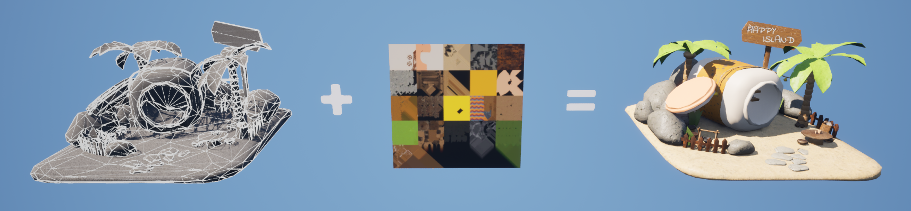

这是因为网格的结构具有较高的灵活性，便于迭代编辑，这也使得现代图形渲染管线的发展与之密不可分，并衍生出了大量成熟的工具链，形成了标准化的行业工作流。

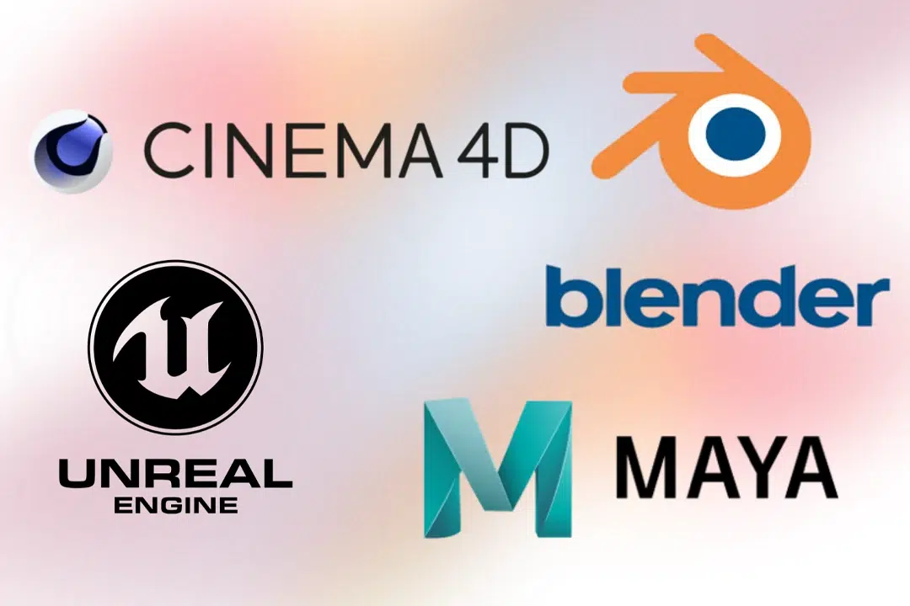

但 Mesh 将 **几何精度** 和 **材质精度** 分离的表达方式虽然具有很多优点，但也产生了诸多复杂的问题，例如Mesh通常需要人工或算法预先假设物体的拓扑结构（如顶点连接关系、曲面类型等）。

图形渲染的任务是将图形转换为图像，三维重建则是它的逆向求解过程（图像 -> 图形），因此使用 **点云（Point Cloud)** 做为数据采集与处理的基础，它更容易记录重建场景的 **无偏采样** 数据，保留原始的几何信息（如边缘、孔洞、非流形结构）。

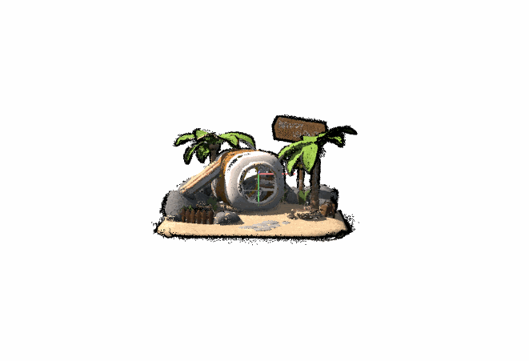

上图所示的点云正是借助开源工具 **[Colmap](https://github.com/colmap/colmap)** 使用  **SFM（Structure from Motion，运动恢复结构）** + **MVS（Multi-View Stereo，多视图立体视觉）** 生成的，我们只需输入多个视角的图像：

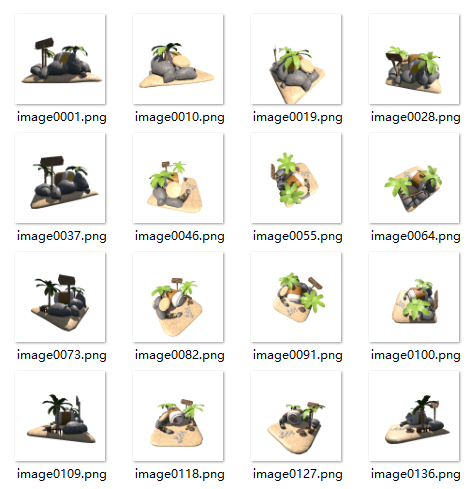

SFM过程会依次执行以下几个步骤：

- **特征提取（Feature Extraction）** ：加载输入图像并进行预处理，提取出各个图像的所包含的特征点。

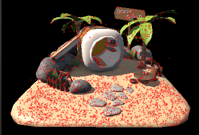

- **特征匹配（Feature Matching）** ：在不同图像间寻找相同的特征点，建立对应关系。

    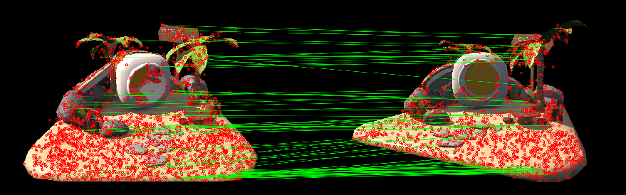

- **增量式重建（Mapper）** ：基于匹配关系，逐步恢复相机位姿和稀疏点云。

    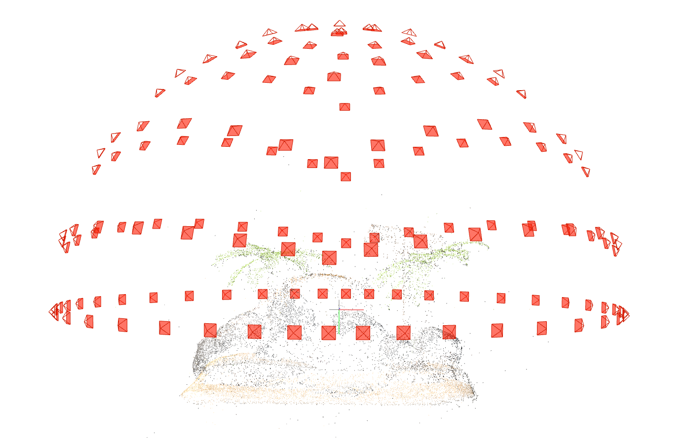

而MVS过程，则会对SFM产生的 **稀疏点云（Sparse Point Cloud）** 进一步处理得到 **稠密点云（Dense Point Cloud）** ，它包含以下步骤：

- **深度图估计（Stereo）** ：为每幅输入图像生成逐像素的深度图，即估计每个像素对应的场景点到相机的距离。

    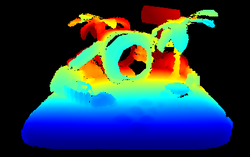

- **深度图融合（Fusion）** ：将多幅图像的深度图合并为一个全局一致的密集点云，消除冲突并填充空洞。

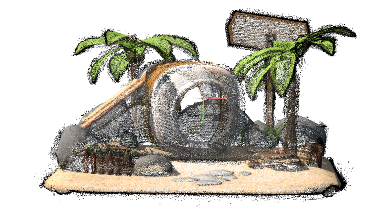

但相同的图形结构，点云通常具有庞大的数据量，上述场景的原始模型具有`4,876`个三角形，转换为较低精度的点云之后却仍然包含`429,113`个点，因此三维重建领域仍然需要考虑将点云转换为Mesh，这是一些常见的做法：

- **泊松重建（Poisson Reconstruction）** ：将点云视为带符号的距离函数（隐式曲面）的采样点，通过求解泊松方程提取等值面（即 Mesh 表面）。
- **移动最小二乘法（MLS，Moving Least Squares）** ：通过局部加权最小二乘法拟合每个点的切平面，生成隐式曲面，再通过 Marching Cubes 算法提取 Mesh
- **Delaunay 三角化（Delaunay Triangulation）** ：在二维或三维空间中，通过最大化空球准则（Delaunay 条件）生成三角网格，三维场景中对应四面体剖分。
- **球旋转算法（Ball Pivoting Algorithm）** ：用固定半径的球在点云表面滚动，球与点云的交点形成三角形，通过调整球半径控制网格密度和细节。
- **Marching Cubes 算法** ：对每个体素单元（立方体），根据顶点是否在曲面内外（由距离函数或密度函数决定），查找预定义的等值面模式，生成三角形。常见策略如 TSDF（Truncated Signed Distance Function，截断符号距离函数）。
- **深度学习方法** ：利用神经网络直接从点云预测 Mesh 的顶点和拓扑，适合自动化处理或复杂形状重建。如[AtlasNet](https://github.com/ThibaultGROUEIX/AtlasNet)，[PointToMesh](https://github.com/nywang16/Pixel2Mesh)，[Mesh R-CNN](https://github.com/facebookresearch/meshrcnn)，[ConvONet](https://github.com/autonomousvision/convolutional_occupancy_networks)等。

## 3D Gaussian Splatting

从学术上来看，3DGS可以当作是对传统 SFM + MVS 流程的变革和拓展。

它可以沿用SFM的结果作为输入，采用 **三维高斯分布** 作为图形基元，通过 **标准随机梯度下降法（Stochastic Gradient Descent, SGD）** 去逼近原始场景，从而得到高质量的图形效果，这个流程看起来像是这样的：

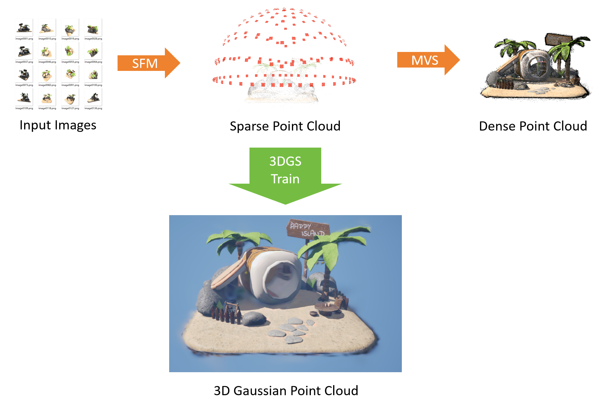

三维高斯基元 是以 三维空间点 作为中心，其概率密度（或辐射强度）随距离中心的增加而指数衰减，这么说可能有些抽象，你可以把三维高斯分布简单想象成 **带有颜色的半透明椭球体** 。

以上图为例，当”椭球体“ **不遵循三维高斯分布** 且 **不透明** 时，图形看起来将会是这样的：

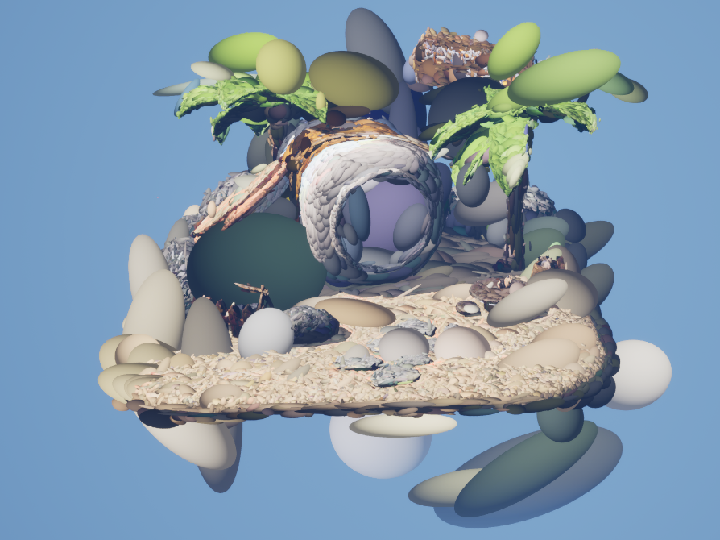

然后依次恢复透明度和三维高斯分布：


这样来看似乎就很容易理解 三维高斯分布 究竟是什么样的东西，而定义一个三维高斯点，主要使用以下参数：

- **中心点位置（X，Y，Z）** ：高斯点在三维空间的中心位置。
- **协方差矩阵（Mat3X3）** ：控制高斯椭圆体的形态结构（胖瘦）。
- **颜色参数（R，G，B）** ：控制椭球体的颜色。
- **不透明度（Opacity）** ：控制椭球体的不透明度。

而 Gaussian Splatting 的训练过程，最终生成的`*.ply`文件实际上就是存储着一堆这样的高斯点，整体流程可以简单概况为：

- 输入过程利用一组具有基本形态结构的点云（例如由SFM得到的稀疏点云）作为高斯基元的初始位置。
- 迭代过程中通过将三维高斯基元投影到二维图像平面，计算权重与损失，使用随机梯度下降法，通过反向传播更新所有高斯的参数（位置、颜色、协方差、不透明度）
- 迭代过程中会动态地调整高斯点的数量，剔除低贡献的基元，在高误差区域执行致密化。

由于考虑到梯度下降过程中的参数控制和优化，协方差矩阵和颜色参数使用了另一种表达方式，其中协方差矩阵进行了如下的拆解：


- S是对角缩放矩阵，使用3个缩放值表示，需要注意的是，实际训练时，为了让 scale 参数始终为正（因为长度不能为负），并且便于网络优化，通常会将 scale 以对数形式存储，也即是说：
    - 网络输出 / Ply 文件中存储的是 `log(scale)`
    - 在使用时，需要取指数 `exp(log(scale))`，恢复为正数的实际 scale
- R是旋转矩阵，以四元数进行表示。

而颜色参数则是使用 **球谐（Spherical Harmonics，SH）而不是直接存储 RGB** ，这是为了让每个高斯球的颜色能够随着观察方向变化，表现更丰富的表面反射和光照效果，使渲染更真实。

如果不考虑观察方向，将SH转换为RGB非常简单：

``` python
C0 = 0.28209479177387814
def SH2RGB(sh):
    return sh * C0 + 0.5
```

此外，为了数值稳定性、梯度计算等方便，通常在存储 opacity 的时候也不是直接使用归一化的不透明度，而是存储 对数几率：

- 网络输出 / Ply 文件中存储的是 `logit(opacity)`
- 在使用时，需要通过`1.0f / (1.0f + exp(-opacity))`才能得到真正的不透明度。

至此，我们了解了3D Gaussian Splatting的输入，过程以及输出，而3dgs之所以那么火爆，一部分原因就在于3dgs具有很高的渲染效率。

因为三维高斯分布是可微分的，我们用一组参数去表示三维空间中的“椭球体”，在绘制时投影到屏幕空间，变成了二维的 **椭圆** ，而这个椭圆切面仍然遵循二维高斯分布，也就意味着，我们可以根据 **三维高斯参数** 以及 **相机参数** 在 **屏幕/图像空间**  推导出 椭圆 的形态结构，直接进行光栅化，这样可以大幅度减少图形绘制所需的运算量。

但由于高斯基元是半透明的，因此在数据处理层面，根据相机对它的进行半透明排序是必不可少的。

目前渲染3dgs的策略主要有三类：

- [ **diff-gaussian-rasterization** ](https://github.com/graphdeco-inria/diff-gaussian-rasterization)：由官方提供的使用 Cuda 的 3DGS 光栅化库。
- [ **3DGS.cpp** ](https://github.com/shg8/3DGS.cpp)：参考 Cuda 版本，通过 Vulkan 计算管线实现的 3DGS 光栅化库。
- 使用图形渲染管线，具体的步骤是：在几何层面将高斯基元视为一个平面四边形，在着色阶段去绘制二维高斯分布。这种做法具有较高的通用性，这是一些开源的参考：
    - [ **fast-gaussian-rasterization** ](https://github.com/dendenxu/fast-gaussian-rasterization)：使用 Python OpenGL借助几何着色器实现的版本。
    - **[splat](https://github.com/jakobbbb/splat)** ：使用 C++ OpenGL通过实例化渲染的版本。
    - **[QEngineUtilities](https://github.com/Italink/QEngineUtilities/blob/main/Source/Core/Source/Private/Render/Component/QGaussianSplattingPointCloudRenderComponent.cpp)** ：包含使用 C++ QRhi 通过实例化渲染的版本。

以上就是3dgs的全部内容，如果对数学细节感兴趣，这里有一篇很好的资料：

- 高斯分布综合概述：https://medium.com/data-science/a-comprehensive-overview-of-gaussian-splatting-e7d570081362

## 虚幻引擎中的应用

关于 3DGS 的应用，知乎上有一个热门的讨论：

- [3DGaussianSplatting技术的影响会有多大？ - 知乎](https://www.zhihu.com/question/626506306?share_code=b3dW4To2Z0eh&utm_campaign=Sharon&utm_content=group2_supplementQuestions&utm_psn=1907217331651838726)

UP最早了解3DGS是在24年年底的时候在B站刷到了：

- [“重建”一座山只需10分钟？神奇的NeRF技术能怎么用！ - 影视飓风](https://www.bilibili.com/video/BV1gF4m1u74D)

由于标题存在一定的误导性，导致UP在复现视频中的流程，看到实际效果之后，直呼 NeRF 大有可为 ！被啪啪打脸之后才发现这里面所采用的技术实际上是3DGS，而非NeRF。

鉴于一个潜在的开发需求，驱动着UP对3DGS展开了深入的研究：

- 因为实际进入到游玩的开放场景需要加载大量的资源（数十GB），大多数游戏都会使用一个Launch/Loading关卡，延缓用户操作，提前开始加载。为了让这个过程更加无感，我希望Launch关卡的背景是整个开放场景的动态俯瞰，有点类似于[这个效果](https://www.bilibili.com/video/BV1tfWne4Eia/?share_source=copy_web&vd_source=dfd2f1bf643a3e0722141847666af060&t=587)，当加载完成时可以从俯瞰视角平滑过渡到玩家视角，因此需要一个全场景的轻量级视觉代理，因为实际场景在引擎中具有庞大的几何数据以及复杂的材质效果，使用传统的网格烘培简化很难完成，而通过一些常用的图像合成手段往往会存在一些瑕疵，因此想到了通过三维重建技术来制作这个视觉代理。

与传统的图形基元相比，3DGS存在很多的缺点：

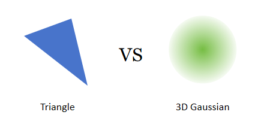

- 在表达高精度且表面效果丰富的图形时，高斯基元的数量级与三角形相近，甚至更多。
- 由于高斯基元半透明的特性，将会导致一些剔除优化的手段失效，并且在其渲染时需要对图元进行半透明排序。
- 高斯点云没有对齐到模型表面，且不连续，只包含颜色特征，这让图形的光影效果很难实现或者说只能以一种高损耗的方式工作。

这些缺点本质上是由 **高斯分布的数学特性** 以及 **梯度下降的优化策略** 决定的，针对这些问题，虽然学术界展开了广泛的探索，但仍然被不少人诟病3DGS只能用来水论文。

回归到工业界，计算机图形技术在近数十年间，经历了革命性的演进，从早期多边形建模到如今的次世代渲染，在 **精度、效率与真实感** 上的突破直接塑造了游戏体验的进化史：


这不仅得益于硬件设备的高速发展，同样也离不开三项核心计算机技术在游戏过程中的广泛应用：

- **LOD（层次细节）** ： **「分级响应，动态适配」**
    - 根据目标对象的 **重要性（Significance）** 动态调整处理精度，在资源消耗与效果之间寻找最优平衡点。
- **Culling（剔除）** ： **「定向过滤，精准聚焦」**
    - 通过预设规则快速识别并排除无需处理的元素，减少系统冗余开销。
- **Streaming（流送）** ： **「按需获取，实时调度」**
    - 将资源视为连续数据流，根据实时需求动态加载 / 卸载，从而突破物理资源限制。

随着开发者对游戏画面和复杂逻辑的追求越来越高，为了突破硬件设备的限制，优化现有的软件技术方案，另一项技术也应运而生 —— **Imposter（替身）** ：

- 一种通过 **抽象替代** 实现系统优化的通用方法论，它的核心在于 **在特定上下文中，用足够好的简化模型替代复杂原件** 。

这种思想跨越图形、分布式系统、AI 等多个领域，成为构建高性能、弹性系统的关键工具。

Imposter 技术持续在「资源有限」与「体验无限」之间寻找最优解，成为现代游戏开发的隐形加速器，它通常能带来计算量以及内存占用的大幅度削减，这对实时图形系统来说非常重要，下面是Imposter技术在游戏行业中的一些应用：

- **LOD优化** ：使用Billboard，Flipbook，Mesh Cards 以及 Octahedron等手段生成静态模型的Imposter，削减远景的绘制开销。

- **人群优化** ：将远处的非关键 NPC（如远处路人）退化为静态实例化网格，骨骼动画烘培为纹理，以此来完成密集人群的效果。

- **剔除优化** ：使用低多边形Imposter代替包围盒，搭建特化的GPU遮挡剔除管线，提升遮挡剔除效率。
- **阴影优化** ：预烘培图形对象的 自阴影（Self-Shadow），使用Imposter去生成该实例的投射阴影（Cast Shadow），从而大幅度削减阴影流程的执行开销。
- ...

而 3DGS 很有可能是 Imposter 在 LOD优化 上的另一种方案衍生。

在传统的LOD制作流程中，业界普遍会使用 **简化** 的手段来生成模型的LOD：

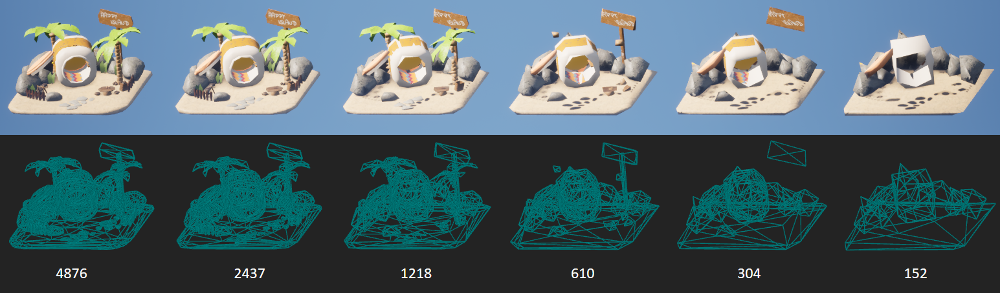

通常使用`50%`的简化幅度通常能较好的平衡性能与视角质量，但这中策略在一些细节特征复杂，几何形状不规则的模型上，得到的效果并不理想。

例如一个一百万三角形数量的模型，如果我们按照50%的简化效率，通常需要`14级LOD`，而这显然会产生大量的数据，且LOD的调度开销会很高，为了限制LOD的数量在`8`以内，简化效率必须提升到`75%`，就像这样：

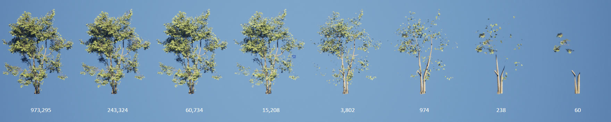

为了保证LOD切换时的视觉变化更加平缓，就必须增加LOD链之间的间隔，而这会显著增加整个图形系统的运行开销。

因此，引入 Imposter 可以很好地解决这个问题，常见的Imposter策略有：

- **公告牌（Billboard）** ：将某个特定角度的模型绘制到纹理上。
- **翻页牌（Flipbook）** ：将多个角度的模型绘制到纹理上，最后在材质上根据玩家视角来切换显示的纹理。
- **卡片簇（Billboard Cloud/ Mesh Card Cloud）：** 将模型绘制在许多的网格插片上，从而来堆叠出源模型相似的视角效果。
- **八面体（Octahedron）** ：将一定视角分布的模型绘制到纹理上，最后在材质上插值多个角度的图像来呈现出可靠的视角过渡效果。

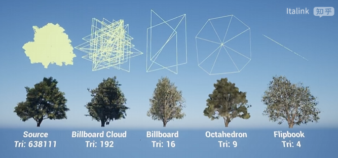

关于这些策略的对比，在之前的植被优化的文章中有简单提及，详见 ：

- https://zhuanlan.zhihu.com/p/713731229

这些策略有着不同的优缺点，适用于不同的使用需求，虽然它们确实能大幅度减少性能开销，但通常只适用于单个结构较为“匀称”的模型，对于结构复杂的组合模型，类似于这种，效果就有些差强人意了：


而 3DGS 的流程本身就是通过梯度下降去逼近原始图像，虽然在高精度下，GS的数量级很容易超过原始网格的三角形数量，但在低精度时，相比传统的优化手段，越是复杂的模型，3DGS的拟合效果越好，性价比越高：

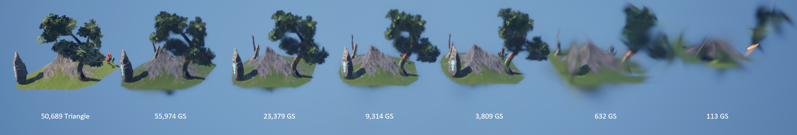

而 高斯点云 相较于 网格，还有另外一个优势，那就是：

- 高斯点云是不连续的特征点，它不像三角形一样需要具有连续的拓扑。

因此，高斯点云的LOD方案实现起来非常容易，只需对高斯点按照特征的重要性进行排序，最终显示时通过GPU调度动态伸缩当前视口需要绘制的高斯点即可。

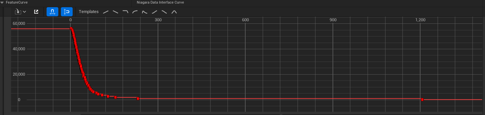


有了这些理论的支撑，于是UP去做了一些工程化的尝试，虽然过程有点艰难，感兴趣的小伙伴可以下载下来试试看：

- https://github.com/Italink/Cosmos/releases/tag/v0.0.1

| 项目              | 场景尺寸 | 内容大小 | 3DGS大小（未压缩） | 3DGS大小（压缩后） | 帧率/GPU耗时（5090D 4K） | 帧率/GPU耗时（3060 Laptop 1K） | 生成时间（7950X+5090D） |
| ----------------- | -------- | -------- | ------------------ | ------------------ | ------------------------ | ------------------------------ | ----------------------- |
| 《City Sample》   | 16 km²   | 64.8 GB  | 0.69GB             | 46.6 MB            | 326 FPS / 1.97 ms        | 112 FPS / 7.51ms               | 30+ hours               |
| 《Project Titan》 | 64 km²   | 49.4 GB  | 1.78 GB            | 115.1 MB           | 294 FPS / 2.48 ms        | 104 FPS / 7.93 ms              | 80+ hours               |


得益于虚幻引擎本身高度优化的渲染架构，当实装上这套高斯渲染的机制之后，整体系统的渲染性能并没有想象中的那么差，更重要的是，相比传统的开放场景搭建方案，3DGS具有非常强的通用性，这对场景管理的价值非常大。

实际上，目前的实现还具有非常大的优化空间：

- 3DGS的训练需要一个具有基本几何形态的点云作为输入，目前它来自于Colmap的SFM重建，由于图形本身就是引擎已知的，因此可以绕过Colmap阶段，直接来生成点云。
- LOD的效果更侧重于图形的棱角边缘，可以以此来优化3DGS的致密化路径。

- Niagara的实现方式虽然具有很好的通用性，但状态管理，内存调度，渲染路径都不是最优的。

- 目前采用了开源的 `Spz` 压缩算法在CPU上执行大约具有10倍的压缩率，但学术界有一些使用Cuda的压缩方案可以达到接近百倍的压缩率。

由于UP个人精力有限，如果对这些功能感兴趣的话，可以自己去做一些尝试，目前插件已完全开源：

-  [Github | Gaussian Splatting For Unreal Engine - Italink](https://github.com/Italink/GaussianSplattingForUnrealEngine) 

> 开发不易，如果这个插件对你有帮助的话，帮忙[点个Star](https://github.com/Italink/GaussianSplattingForUnrealEngine.git)呀 0.0：

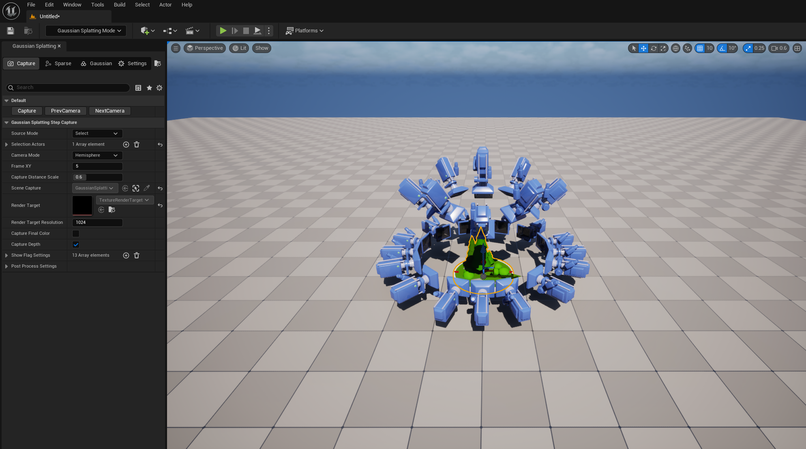

插件目录下对应文件结构的功能如下：

- Content：3DGS相关的UE资产，目前资产版本是5.5.4。

- Scripts：调用 Colmap 和 3DGS算法 的辅助脚本。

- Source：

    - GaussianSplattingRuntime： 运行时模块。
        - `GaussianSplattingPointCloud`：自定义的UE资产，包含3DGS点云的结构。
        - `AGaussianSplattingPointCloudActor`：预留的GSActor基类。
        - `GaussianSplattingPointCloudDataInterface`：Niagara 数据接口，用于将GaussianSplattingPointCloud的数据提交到GPU，供粒子系统使用。
        - `Spz`：3D GS 的压缩算法，来源于 https://github.com/nianticlabs/spz

    - GaussianSplattingEditor：编辑器模块，不参与最终打包。
        - `GaussianSplattingEditorLibrary`：3DGS处理相关的函数接口。
        - `GaussianSplattingEditorSettings`：插件相关配置。
        - `GaussianSplattingHLODBuilder`：使用 3DGS 的 HLOD构建器。
        - 编辑器模式相关（左侧工具栏面板）：
            - `GaussianSplattingEdMode`
            - `SGaussianSplattingEdModePanel`：EdMode 的 UI面板。
            - `GaussianSplattingStep`：EdMode 的核心逻辑。
        - 资产编辑器相关：
            - `GaussianSplattingPointCloudEditor`
            - `SGaussianSplattingPointCloudEditorViewport`
            - `SGaussianSplattingPointCloudEditorViewportClient`
            - `SGaussianSplattingPointCloudFeatureEditor`
