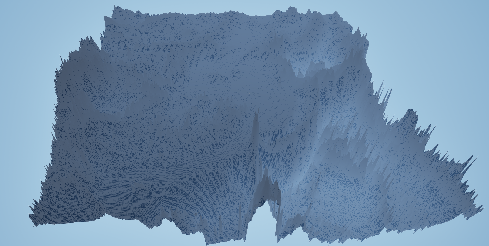
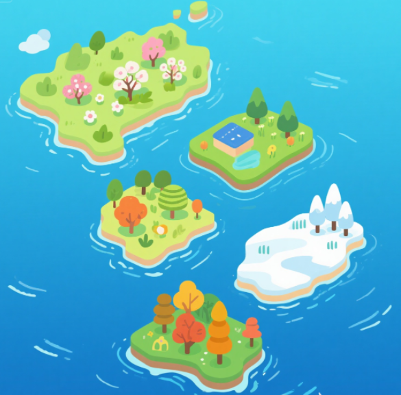

# Landscape

## 概述

地形（Landscape）作为现代游戏里面一种基础的图形元素， 随着现在图形工程复杂性越来越高，研发团队越来越“年轻”，如果仅关注编辑器层面的使用，而忽略了一些重要的细节，那么很可能埋下不小的隐患，因此，本篇文章对此进行一些介绍。

在大多数图形工程中，使用最多的图形元素，毫无疑问是 —— 静态网格体（Static Mesh），它使用顶点几何数据（空间坐标，UV，法线...）结合材质纹理来表达图形效果：


静态网格体在现代游戏开发中占据着举足轻重的地位，已然成为构建游戏世界几何体的基础单元 ，专业建模软件（如 3dsMax、Maya、Blender、Zbrush等）为设计师提供了极大的便利和自由度，让他们可以快速地设计出预想中的图形效果。

相比之下，地形则是一种比较特殊的图形元素，它并不没有像静态网格那样直接使用三角形顶点数据来进行表达，而是依靠高度图：


> 该图由 https://manticorp.github.io/unrealheightmap 生成

高度图中的每一个像素对应一个实际的顶点坐标，映射关系如下：

- 像素坐标（XY）> 顶点水平坐标（XY）
- 像素灰度值（Grayscale） > 顶点高度（Z）



高度图可以视为一个二维数值阵列，其中基本元素类型通常情况下为十六位无符号整型，对应的C++结构是：

``` c++
uint16_t HeightMap[Height][Width];
```

实际的转换规则可能因软件的不同而存在细微差异，虚幻引擎所采用的基本单位是**厘米（cm）**，它的转换规则如下：

- 顶点水平坐标直接由像素坐标转换而来，在不进行任何缩放的情况下，UE地形水平方向的最小表示精度为 **1 cm**。
- 像素灰度存储为十六位无符号整型，这意味着它能区分 `65536` 个不同的高度等级，UE并没有直接将其映射到 cm，而是将其重新映射到 **[-256.0, 255.992] 的浮点范围内**，也就是说，在不进行任何缩放的情况下，UE地形垂直方向所能表示的高度范围为 **-256.0 cm ~ 255.992 cm**，其中高度能表示的最小精度为 **0.0078125 cm**。

综上，一些小伙伴是否会产生这样的疑问：

- 要实现相同的图形效果，明明使用静态网格体具有非常高的精度和自由度，使用地形却存在非常多的限制，那我们为什么还要去使用地形呢？

事实上，关于地形的使用，本质上是对 场景规模 与 高精度 的取舍。

首先我们来谈一下地形具有哪些缺点：

- **水平方向的精度较低**：举个例子，UE5 非WP地图 所支持高度图的最大尺寸为 `8129`，在不进行缩放的情况下，意味着我们能用它来表示的水平宽度为` 81.92 m` ，当我们想要表示更大的区域范围时，比如拉伸10倍，才能表示 `2.68 平方公里` 的区域，而此时，水平方向的最小表示精度变为了 `10 cm`，也就是说小于10cm的几何细节都会丢失。
- **高度的表示范围有限**：在不进行缩放的情况下，高度的表示范围是`-256.0 cm ~ 255.992 cm`，当我们想要表示`2000m`的高山时，就需要要将高度拉伸为原先的1000倍，这意味着高度的最小表示精度将变为`7.8125cm`，而这会让地形的碰撞计算产生至少7cm的计算误差。
- **拓扑结构的单一性**：地形本质是 “连续的高度场网格”，仅支持 “单一层面的起伏”，无法实现静态网格体的复杂拓扑（如悬空平台、地形穿插、地下洞穴等）。
- **较粗的编辑粒度**：地形编辑依赖 “笔刷绘制”（如抬升、降低、平滑），很难像静态网格体那样通过 “顶点级编辑” 精准控制每一个凸起或凹陷。
- **协作开发的复杂度**：高度图、权重图是单一文件，多人同时编辑会导致数据覆盖，需通过版本控制工具严格管理。

但即便它有这么多缺点，**地形依然是当下硬件水平下，大规模场景的唯一解决方案**。

举个例子，假如我们想要搭建一个 `1km²` 的场景，以网格平面来进行铺设，保证平均几何精度为`10cm * 10cm`，即使这已经是一个较低的精度了，但仍然需要 `一亿（10000*10000）`的三角形顶点，而UE5静态网格体一个顶点的占用通常是`28字节`（位置 : 12 + 切线X : 4 + 切线Z : 4 + UV : 8)，那么整个地形网格所占用的未压缩空间大约需要：

- `28 x 10000 x 10000 ÷ 1024³ `  ≈  **2.61 GB**   

这还只是几何数据，在不考虑使用 **平铺贴图（Tiled Texture）**的情况下，`10cm`的纹素精度显然是不能保证画面效果的，必然出现模糊、马赛克，若要保证 “近距离视觉清晰”（比如让 `1cm×1cm` 的地面对应 1 个纹素），则纹理需要的像素总量高达 **100 亿**，只使用 4个通道（ARGB_8888 ）表示颜色的话，未压缩空间大约需要：

- `4 x 100000 x 100000 ÷ 1024³ `  ≈  **37.25 GB**   

这还只是`1km²` 的场景呀。

> 实际上从笔者近几年的接触下来，很多团队（不仅限于游戏行业），对图形场景的数据规模没有比较深的认知，尤其是在策划/产品的眼里，开放场景无非就是用足够多的元素把场景铺大一点~

在这种背景下，当我们想要搭建稍大一些的场景时，地形几乎是必然的选择，除了上面提到的一些缺点，它其实还有不少不容忽视的优点：

- **内存** ：地形的每个顶点只需要4字节（RG通道存储高度，BA通道存储压缩后的法线），而静态网格体的内存占用通常是地形的6到7倍。
- **纹理**：地形是一块 “与高度无关的世界空间映射”，无论如何修改地形起伏（拉高、推平、造山），纹理的平铺精度始终不变，因此使用平铺贴图是很方便的，而静态网格体就很难，因为一旦修改模型形状（如把平坦地面改成斜坡），纹理会随模型拉伸变形 。此外，静态网格体的细节主要依赖纹理和UV精度，而地形则可以在平铺贴图上叠加多层纹理（如细节纹理， 坡度纹理等）来改善层次效果。
- **LOD**：地形的 LOD 是 “基于高度场的动态简化”，GPU 会自动通过 Mipmap 切换低分辨率的贴图 Mip 层，既保证远处渲染效率，又避免纹理拉伸，而静态网格体的 LOD 需为每个层级制作独立的低精度模型。
- **碰撞**：地形使用生成 高度场碰撞体（Heightfield Collider），支持可破坏，其数据结构的特性使得它的碰撞计算效率远比网格体碰撞要高，且在碰撞穿透问题上，由于不存在间隙，其碰撞防护的安全性远优于静态网格体。
- **工作流**：在游戏引擎中，地形被视为基本的图形载体，引擎中围绕地形搭建了非常多的工具和流程，比如植被系统，地形附着物的程序化生成，光影烘焙等。

关于Landscape的使用，官方文档中有着详细的介绍：

- https://dev.epicgames.com/documentation/en-us/unreal-engine/landscape-outdoor-terrain-in-unreal-engine

关于地形的原理，这里有一篇非常详细的剖析文章：

- 虚幻引擎地形系统原理机制源码剖析 - MarsZhou：https://zhuanlan.zhihu.com/p/668278748

## 早期规划

对于实际的游戏项目来说，只知道地形的实现原理和工具的使用往往是不够的，在早期设计时，就应该去制定好一些规划。

### 明确场景规模

场景的大小一定程度上决定了游戏内容的体量，拿UE标准小白人来说，它的默认移动速度为`600cm/s`，移动`1000m` 的距离需要2分46秒，依此结合实际的游戏内容来评估大致所需的场景规模。

> 当场景尺寸大于`1km²`且拥有大量GameObject时，就应该考虑使用 **World Partition** 去组织场景的Steaming。

需要提醒的是，当想要搭建一个可游玩区域非常大的场景时，比如 `64km²`，建议千万不要用一个地形去完成整个场景的搭建，过大的场景规模会大幅度提升资产管理，地图编辑，玩法和关卡设计的复杂度，严重拖垮项目的迭代速度。

>虽然 UE WP 地图目前支持的最大地形尺寸为`65281`，

个人的建议是，单个地形的尺寸不要超过 `4km²`，只在独立的子关卡中进行游戏内容的迭代，有一个主地图专门负责通过海面、河流或者山脉这类元素去拼接子地图，就像是这样：



在 UE 5.4 之后，关卡实例的诸多问题已经得到有效解决，可以依靠它来推动这样的工作流，而后文所述的目标只针对单个地形块。

### 确定分辨率

确定单个地形的规模之后，就需要确定地形表示的最小几何精度，通常情况 1m 的精度足以满足RPG项目的需求，如果想要增加地表细节，可以通过以下方案来完成：

- **法线贴图（Normal Map）**：通过修改表面法线方向影响光照反射，让平坦地形看起来有凹凸细节。
- **视察映射（Parallax Occlusion  Mapping）**：通过计算像素的 “虚拟深度偏移”，让纹理看起来有实际厚度，比法线贴图更具立体感。
- **位移贴图（Displacement Mapping）**： 借助 Nanite 和细分曲面技术支持通过位移贴图实现真正的几何凸起（修改像素级高度）
- **地表附着物**：在地形表面放置静态网格体来补充细节，需要关注碰撞体对性能的影响。

### 平衡流送代理，组件和分段的数量

UE地形对应的结构是 **ALandscape**，由于UE5非WP地图中并没有 **流送代理（ALandscapeStreamingProxy）** 的概念，因此这里先说 **组件（ULandscapeComponent） **和 **分段（Section）** 

ALandscape维护着地形的高度图和权重图，为了将其划分为


https://www.youtube.com/watch?v=gJKGMFcg29c

