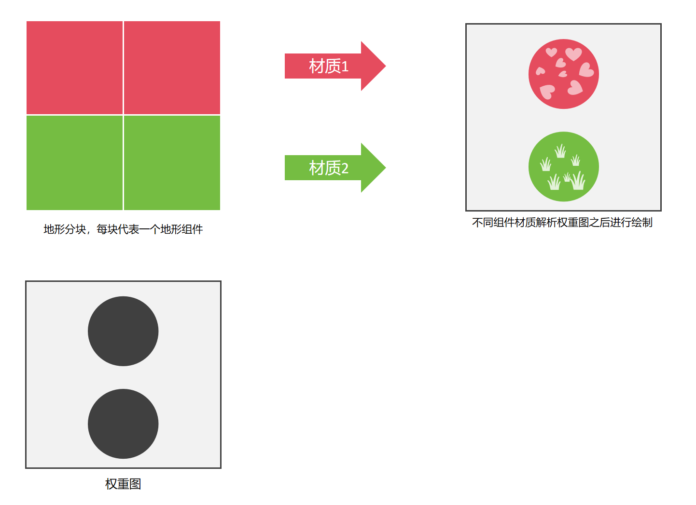
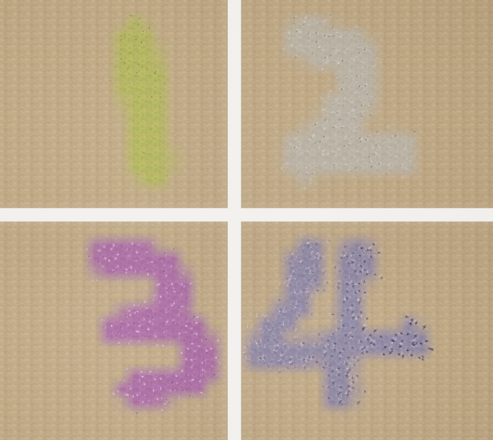
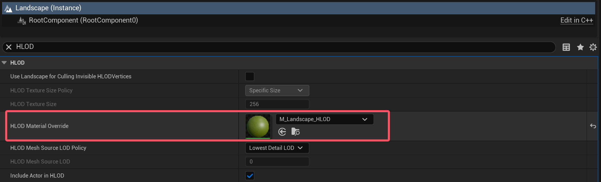
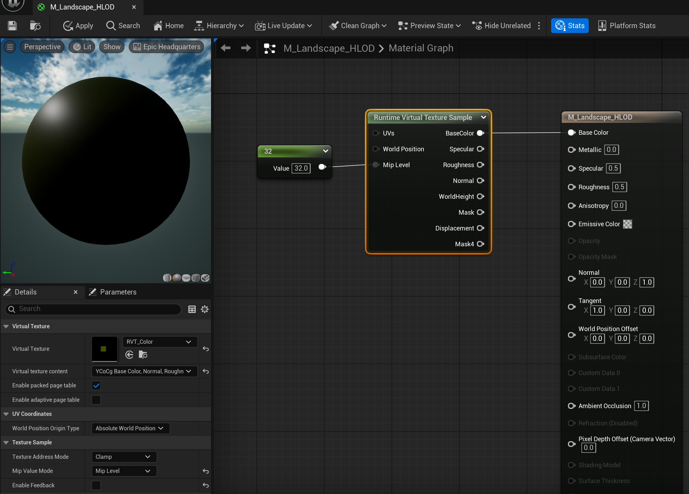
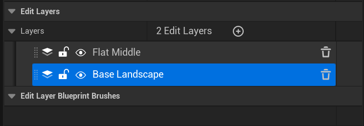
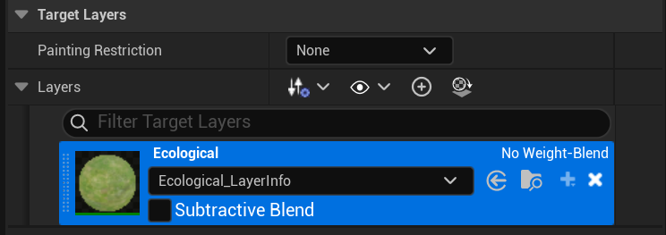

# Landscape 避坑指南

## 概述

地形（Landscape）作为现代游戏里面一种基础的图形元素， 随着现在图形工程复杂性越来越高，研发团队越来越“年轻”，如果仅关注效果的实现和编辑器层面的使用，而忽略了一些重要的细节，那么很可能埋下不小的隐患，因此，本篇文章对此进行一些介绍。

在大多数图形工程中，使用最多的图形元素，毫无疑问是 —— 静态网格体（Static Mesh），它使用顶点几何数据（空间坐标，UV，法线...）结合材质纹理来表达图形效果：


静态网格体在现代游戏开发中占据着举足轻重的地位，已然成为构建游戏世界几何体的基础单元 ，专业建模软件（如 3dsMax、Maya、Blender、Zbrush等）为设计师提供了极大的便利和自由度，让他们可以快速地设计出预想中的图形效果。

相比之下，地形则是一种比较特殊的图形元素，它并不没有像静态网格那样直接使用三角形顶点数据来进行表达，而是依靠高度图：


> 该图由 https://manticorp.github.io/unrealheightmap 生成

高度图中的每一个像素对应一个实际的顶点坐标，映射关系如下：

- 像素坐标（XY）> 顶点水平坐标（XY）
- 像素灰度值（Grayscale） > 顶点高度（Z）


高度图可以视为一个二维数值阵列，其中基本元素类型通常情况下为十六位无符号整型，对应的C++结构是：

``` c++
uint16_t HeightMap[Height][Width];
```

实际的转换规则可能因软件的不同而存在细微差异，虚幻引擎所采用的基本单位是 **厘米（cm）** ，它的转换规则如下：

- 顶点水平坐标直接由像素坐标转换而来，在不进行任何缩放的情况下，UE地形水平方向的最小表示精度为 **1 cm** 。
- 像素灰度存储为十六位无符号整型，这意味着它能区分 `65536` 个不同的高度等级，UE并没有直接将其映射到 cm，而是将其重新映射到 **[-256.0, 255.992] 的浮点范围内** ，也就是说，在不进行任何缩放的情况下，UE地形垂直方向所能表示的高度范围为 **-256.0 cm ~ 255.992 cm** ，其中高度能表示的最小精度为 **0.0078125 cm** 。

综上，一些小伙伴是否会产生这样的疑问：

- 要实现相同的图形效果，明明使用静态网格体具有非常高的精度和自由度，使用地形却存在非常多的限制，那我们为什么还要去使用地形呢？

事实上，关于地形的使用，本质上是对 场景规模 与 高精度 的取舍。

首先我们来谈一下地形具有哪些缺点：

- **水平方向的精度有限** ：举个例子，UE5 非WP地图 所支持高度图的最大尺寸为 `8129`，在不进行缩放的情况下，意味着我们能用它来表示的水平宽度为` 81.29 m` ，当我们想要表示更大的区域范围时，比如拉伸100倍，才能表示 `66.08km` 的区域，而此时，水平方向的最小表示精度变为了 `1m`，也就是说小于`1m`的几何细节都会丢失。
- **高度的表示范围有限** ：在不进行缩放的情况下，高度的表示范围是`-256.0 cm ~ 255.992 cm`，当我们想要表示`2000m`的高山时，就需要要将高度拉伸为原先的1000倍，这意味着高度的最小表示精度将变为`7.8125cm`，而这会让地形的碰撞计算产生至少7cm的计算误差。
- **拓扑结构的单一性** ：地形本质是 “连续的高度场网格”，仅支持 “单一层面的起伏”，无法实现静态网格体的复杂拓扑（如悬空平台、地形穿插、地下洞穴等）。
- **较粗的编辑粒度** ：地形编辑依赖 “笔刷绘制”（如抬升、降低、平滑），很难像静态网格体那样通过 “顶点级编辑” 精准控制每一个凸起或凹陷。
- **协作开发的复杂度** ：高度图、权重图是单一文件，多人同时编辑会导致数据覆盖，需通过版本控制工具严格管理。

但即便它有这么多缺点， **地形依然是当下硬件水平下，大规模场景的唯一解决方案** 。

举个例子，假如我们想要搭建一个 `1km²` 的场景，以网格平面来进行铺设，保证平均几何精度为`10cm * 10cm`，即使这已经是一个较低的精度了，但仍然需要 `一亿（10000*10000）`的三角形顶点，而UE5静态网格体一个顶点的占用通常是`28字节`（位置 : 12 + 切线X : 4 + 切线Z : 4 + UV : 8)，那么整个地形网格所占用的未压缩空间大约需要：

- `28 x 10000 x 10000 ÷ 1024³ `  ≈  **2.61 GB**   

这还只是几何数据，在不考虑使用 **平铺贴图（Tiled Texture）** 的情况下，`10cm`的纹素精度显然是不能保证画面效果的，必然出现模糊、马赛克，若要保证 “近距离视觉清晰”（比如让 `1cm×1cm` 的地面对应 1 个纹素），则纹理需要的像素总量高达 **100 亿** ，只使用 4个通道（ARGB_8888 ）表示颜色的话，未压缩空间大约需要：

- `4 x 100000 x 100000 ÷ 1024³ `  ≈  **37.25 GB**   

这还只是`1km²` 的场景呀。

> 实际上从笔者近几年的接触下来，很多团队（不仅限于游戏行业），对图形场景的数据规模没有比较深的认知，尤其是在策划/产品的眼里，开放场景无非就是用足够多的元素把场景铺大一点~

在这种背景下，当我们想要搭建稍大一些的场景时，地形几乎是必然的选择，除了上面提到的一些缺点，它其实还有不少不容忽视的优点：

- **内存** ：地形的每个顶点只需要4字节（RG通道存储高度，BA通道存储压缩后的法线），而静态网格体的内存占用通常是地形的6到7倍。
- **纹理** ：地形是一块 “与高度无关的世界空间映射”，无论如何修改地形起伏（拉高、推平、造山），纹理的平铺精度始终不变，因此使用平铺贴图是很方便的，而静态网格体就很难，因为一旦修改模型形状（如把平坦地面改成斜坡），纹理会随模型拉伸变形 。此外，静态网格体的细节主要依赖纹理和UV精度，而地形则可以在平铺贴图上叠加多层纹理（如细节纹理， 坡度纹理等）来改善层次效果。
- **LOD** ：地形的 LOD 是 “基于高度场的动态简化”，GPU 会自动通过 Mipmap 切换低分辨率的贴图 Mip 层，既保证远处渲染效率，又避免纹理拉伸，而静态网格体的 LOD 需为每个层级制作独立的低精度模型。
- **碰撞** ：地形使用生成 高度场碰撞体（Heightfield Collider），支持可破坏，其数据结构的特性使得它的碰撞计算效率远比网格体碰撞要高，并且因为它不存在间隙，在碰撞穿透问题上的防护安全性远优于静态网格体。
- **工作流** ：在游戏引擎中，地形被视为基本的图形载体，引擎中围绕地形搭建了非常多的工具和流程，比如植被系统，地形附着物的程序化生成，光影烘焙等。

关于Landscape的使用，官方文档中有着详细的介绍，很好的讲述了地形的概念，LOD和碰撞的管理：

- https://dev.epicgames.com/documentation/en-us/unreal-engine/landscape-outdoor-terrain-in-unreal-engine

关于地形的原理，这里有一篇非常详细的剖析文章：

- 虚幻引擎地形系统原理机制源码剖析 - MarsZhou：https://zhuanlan.zhihu.com/p/668278748

## 规划

对于实际的游戏项目来说，只知道地形的实现原理和工具的使用往往是不够的，在早期设计时，就应该去制定好一些规划。

### 明确场景规模

场景的大小一定程度上决定了游戏内容的体量，拿UE标准小白人来说，它的默认移动速度为`600cm/s`，移动`1000m` 的距离需要2分46秒，依此结合实际的游戏内容来评估大致所需的场景规模。

> 当场景尺寸大于`1km²`且拥有大量GameObject时，就应该考虑使用 **World Partition** 去组织场景的Steaming。

需要提醒的是，当想要搭建一个可游玩区域非常大的场景时，比如 `64km²`，建议千万不要用一个地形去完成整个场景的搭建，过大的场景规模会大幅度提升资产管理，地图编辑，玩法和关卡设计的复杂度，严重拖垮项目的迭代速度。

虽然 UE WP 地图目前支持的最大地形尺寸为`65281`，但个人的建议是，单个地形的尺寸不要超过 `4km²`，只在独立的子关卡中进行游戏内容的迭代，有一个主地图专门负责通过海面、河流或者山脉这类元素去拼接子地图，就像是这样：


在 UE 5.4 之后，关卡实例的诸多问题已经得到有效解决，可以依靠它来推动这样的工作流，而后文所述的目标只针对单个地形块。

### 确定分辨率

确定单个地形的规模之后，就需要确定地形表示的最小几何精度，水平方向通常情况 `1m` 的精度足以满足RPG项目的需求，如果想要增加地表细节，可以通过以下方案来完成：

- **法线贴图（Normal Map）** ：通过修改表面法线方向影响光照反射，让平坦地形看起来有凹凸细节。
- **视察遮挡映射（Parallax Occlusion  Mapping）** ：通过计算像素的 “虚拟深度偏移”，让纹理看起来有实际厚度，比法线贴图更具立体感。
- **位移贴图（Displacement Mapping）** ： 借助 Nanite 和细分曲面技术支持通过位移贴图实现真正的几何凸起（修改像素级高度）。
- **地表附着物** ：在地形表面放置静态网格体和贴花来补充细节，需要关注碰撞体对性能的影响。

垂直方向的纵深一开始就要确定好，后续迭代了大量内容之后才想起这个问题，再做修改就有些麻烦，此外，由于要保证碰撞精度，所以不能过渡拉伸Z轴，对于高耸的山脉，应当考虑使用静态网格体进行填充。

### 平衡流送代理，组件和分段的数量	

UE地形实际对应的核心结构是 **ALandscape** ，它负责管理整个地形的全局数据和组件层级结构，包括持有高度图、权重图等基础资源，以及控制地形的整体属性（如物理设置、LOD 全局参数等）

为了划分 **ALandscape** 的职责，使之拥与更小粒度的LOD管理，可视性判断，DrawCall，碰撞检测和材质管理，于是地形系统提出了 **地形组件（ULandscapeComponent） ** 和 **分段（Section）** 的概念。

假设当下我们把所有小粒度功能都托付于地形组件，暂时不引入分段机制，用 `2017×2017` 分辨率高度图搭建 4km² 场景，组件划分会面临两难：

- 若组件数量少（如 1 个组件覆盖 4km²）：单个组件的顶点数据量大，视锥体剔除时无法精准剔除‘不可见区域’，LOD 切换只能‘整体切换’（比如远处整个组件从 LOD0 切到 LOD3，细节丢失明显），碰撞计算也需处理全量数据，效率低；

- 若组件数量多（如 100 个组件覆盖 4km²）：虽能精准剔除和 LOD 切换，但每个组件的调度（加载 / 卸载）、DrawCall 提交、碰撞体筛选都会产生额外开销，反而拖慢帧率。

为解决这一矛盾，UE 地形系统引入了 **分段（Section）** 概念 —— 它的定位并非是对组件的进一步划分，而是在组件内部承担 **精细粒度的 DrawCall、LOD、剔除、碰撞** 功能，允许组件职责进行合并，从而实现 **减少组件数量** 与 **细粒度管理** 的平衡。

**流送代理（ALandscapeStreamingProxy）** 是 UE5 World Partition 引入的新概念，因为 World Partition 流送的最小单位是Actor，而非Component，因此流送代理的目的就是让原先都挂在ALandscape下的一系列ULandscapeComponent，根据区域划分到不同的流送代理中，一个流送代理可以包含一个或多个地形组件，流送代理的划分取决于项目本身想要的流送粒度。

值得一提的是，流送代理的出现让分段的地位产生了一些动摇，因为早期项目在使用地形时，地形组件一般完全加载，然后通过剔除来进行优化，所以使用分段可以减少组件。

但现在有了 World Partition 的 Streaming，结合HLOD的合并，不仅可以减少地形组件数量，同时还能大幅优化合并后的几何和纹理数据，因此对于WP地图，地形分段的价值可以说是微乎其微了。

综上，地形相关的几个结构的关系主要如下：

| 层级对象                       | 核心职责                                                     | 依赖关系                           |
| ------------------------------ | ------------------------------------------------------------ | ---------------------------------- |
| 地形（ALandscape）             | 管理全局数据（高度图 / 权重图）、统一调度                    | 包含 1 个或多个流送代理（WP 地图） |
| 流送代理（StreamingProxy）     | WP 流送最小单位，承载地形组件                                | 包含 1 个或多个地形组件            |
| 地形组件（LandscapeComponent） | 管理局部数据副本（如某块 100m×100m 区域）和材质（解析图层，物理材质，挖孔） | 内部可划分多个分段                 |
| 分段（Section）                | 承担 DrawCall、LOD、精细剔除、碰撞计算                       | 隶属于单个地形组件                 |

### 确定场景生态结构

地形由高度图和权重图组合而成，高度图负责描述地形的几何形状，而权重图则用于地形的材质表达。

大多数美术人员对图层的管理存在一些误解 ：

- 把材质效果跟图层进行一对一绑定

在实际的工作流中，美术通常是根据效果的需求去添加图层，比如像要一片草地，那么就添加一个Grass图层，想要一片雪地，就添加一个Snow图层，然后紧接着：Gravel（砾石），Dirt（泥土），Rock（岩石），Mud（泥浆），Water（水），Path（道路）....

为了过渡到另一种风格的场景，就继续添加素材和图层...

这种错误的做法将面临以下问题：

- **效果受限：** 地形权重图层的数量存在上限，UE4中上限为8，到了UE5上限为16。
- **性能较差：** 过多的权重图采样将严重拖垮的地形材质的绘制性能。

正确的做法是我们应该理清权重图层和地形材质的关系：

- 权重图层跟材质并不是一对一的关系，地形材质本质上是作为权重数据的解析器（Resolver），一个地形（ALandscape）并不是只允许有一个材质，材质管理的最小粒度是地形组件（ULandscapeComponent）。



比如实现这样的效果，每个数字区域有特定的颜色、植被以及物理材质，按之前错误的做法，这样的效果需要用4个地形图层，但这里实际上只用到了一个，只不过每个地形组件有自己的材质：



> UE5的非WP地图并没有暴露地形组件的编辑入口，想要编辑只能从C++入手，WP地图的ALandscapeStreamingProxy也是通过特化属性面板，批量管理组件属性，这也是为什么容易产生误用的部分原因。

因此，在地形图层管理时，不应该按材质效果去划分图层，而是应该从地形的生态结构上划分，不同的生态群落使用不同的材质去解析图层，这样能避免图层数量的泛滥，同时也能优化地形材质的渲染开销。

由于该流程具有较高的使用门槛，因此还需要为引擎开发相应的工具链去简化迭代过程。

### LOD、Nanite、RVT、HLOD

地形的LOD策略可以在ALandscape的属性面板中进行调整。

目前UE5已经支持了Nanite地形，它具有更高的剔除效率和几何细节，结合VSM，在中高端硬件上的绘制性能通常Nanite比LOD要好。

由于 Nanite 的几何处理路径与 RVT 的采样路径不兼容，通常 Nanite 网格并不支持 RVT 的写入，但由于地形仍保留了原始高度图和权重图数据，引擎会通过非 Nanite 的辅助通道提交 RVT 绘制数据：

- https://dev.epicgames.com/documentation/en-us/unreal-engine/using-nanite-with-landscapes-in-unreal-engine

UE5最新的版本调整了地形HLOD的生成策略，逻辑位于 **ULandscapeHLODBuilder** ，它的具体做法是：

- 将ALandscapeStreamingProxy包含的所有地形组件，选取其中一个LOD级别，合并为一个ULandscapeMeshProxyComponent（继承自UStaticMeshComponent）

个人觉得这种做法不是很高效，因为把流送的粒度和合批的粒度划等号了，举个例子，一个地形组件块的大小是100M，为了让HLOD能够合并组件，流送代理的范围可能就得设置为200M，也就是包含四个地形组件，而这会显著增加地形流送的成本，如果改成一个流送代理只包含一个组件，实际合批根据网格划分的粒度来进行，应该会更好一些。

对于地形的HLOD材质，不需要重新烘培贴图，因为在实际项目中，通常需要在地形上使用RVT，并为地形的RVT开启SVT去存储低级别的MipLevel，因此地形HLOD材质可以直接在ALandscape中指定`HLOD Material Override`



因此地形HLOD的材质无需纹理输入，直接采样RVT的SVT即可：



RVT 在地形上的应用非常广泛，比如可以将远处的地表细节（如贴花，草皮...）烘培到RVT的SVT上，从而保证HLOD的远景材质效果。

将高度写入RVT，在实现一些特效时非常有用，比如：

- 下雨、积雪、水流：根据地形高度（海拔）和法线方向（坡度），动态控制自然现象的效果分布。
- 足迹 / 踩踏效果：角色移动时，在接触点的地形位置生成匹配地形起伏的足迹。

- 爆炸 / 冲击痕迹：爆炸冲击点在地形表面生成与地形轮廓匹配的凹痕或焦痕。
- 雾气 / 烟尘分布：利用地形高度和坡度控制雾气浓度，模拟山谷雾、爬坡雾等效果
- 地面湿润 / 干燥过渡：根据地形排水能力（坡度）模拟雨后地面干燥过程。

关于地形RVT开启SVT的步骤，可以查阅：

- https://dev.epicgames.com/documentation/zh-cn/unreal-engine/runtime-virtual-texturing-in-unreal-engine

> 需要注意的是，文章里提到在RVT体积 **细节（Details）** 面板中选择 **在编辑器中使用流送低mip（Use Streaming Low Mips in Editor）** 属性，在最新版本的引擎中该属性的名称已经改为`View In Editor`，请务必勾选它，否则在编辑器下RVT不会去读取SVT的数据。

## 底层接口

看完这些，有没有觉得，卧槽，地形居然还有那么多注意事项，可现在项目已经踩坑里了，那咋办？别急，有得救！

虽然UE地形系统的调度和管理看起来比较复杂，但它本质上还是对底层的几张贴图进行处理，如果能绕过UE的编辑器，直接去处理对应的图像，那自由度可太高了。

高度图和权重图的管理，统一放到了 **ULandscapeInfo** 中，我们可以通过这样获取到：

``` c++
ULandscapeInfo* LandscapeInfo = LandscapeActor->GetLandscapeInfo();
```

UE中的高度图对应的结构是 **EditLayers** ，UE 支持多个高度图进行叠加，它的导入导出操作如下：



``` c++
void ExportAllEditLayers(ALandscape* LandscapeActor, FString OutputDir){
    ULandscapeInfo* LandscapeInfo = LandscapeActor->GetLandscapeInfo();
    for (int i = 0; i < LandscapeActor->GetLayerCount(); i++) {
        const FLandscapeLayer* Layer = LandscapeActor->GetLayerConst(i);
        FString ExportFilename = FString::Printf(
            TEXT("%s_%s.%s"),
            *Filename,
            *Layer->Name.ToString().Replace(TEXT(" "), TEXT("_")),
            *Extension
        );
        FScopedSetLandscapeEditingLayer Scope(LandscapeActor, Layer->Guid);				// 在上下文中设置当前编辑的高度图层
        LandscapeInfo->ExportHeightmap(FPaths::Combine(OutputDir, ExportFilename));		// 导出当前高度图层
    }
}

void ImportSingleEditLayer(ALandscape* LandscapeActor, int LayerIndex, FString ImportFilename){
    ULandscapeInfo* LandscapeInfo = LandscapeActor->GetLandscapeInfo();
    const FLandscapeLayer* Layer = LandscapeActor->GetLayerConst(LayerIndex);
    FImage Image;
    FImageUtils::LoadImage(*ImportFilename, Image);
    if (Image.Format != ERawImageFormat::Type::G16) {									// 只支持G16格式
		return;
	}
    FIntRect TargetResolution;
	LandscapeInfo->GetLandscapeExtent(TargetResolution);
	if (Image.SizeX != TargetResolution.Width() + 1 || Image.SizeY != TargetResolution.Height() + 1) {
		FImage ScaledImage;																// 将导入图像缩放为地形的分辨率
		Image.ResizeTo(ScaledImage, 
                       TargetResolution.Width() + 1,
                       TargetResolution.Height() + 1, 
                       ERawImageFormat::Type::G16, 
                       Image.GammaSpace);
		Image = ScaledImage;
	}
    FScopedSetLandscapeEditingLayer Scope(LandscapeActor, Layer->Guid, [&] {
        LandscapeActor->RequestLayersContentUpdate(ELandscapeLayerUpdateMode::Update_Heightmap_All);
    });
    FHeightmapAccessor<false> HeightmapAccessor(LandscapeInfo);
    HeightmapAccessor.SetData(TargetResolution.Min.X,
                              TargetResolution.Min.Y, 
                              TargetResolution.Max.X, 
                              TargetResolution.Max.Y, 
                              (uint16*)Image.RawData.GetData());
}
```

权重图对应的结构是 **TargetLayers** ，它的操作相比高度图容易很多，这里提供一下伪代码：



``` c++
ULandscapeInfo* LandscapeInfo = LandscapeActor->GetLandscapeInfo();
FIntRect TargetResolution;
LandscapeInfo->GetLandscapeExtent(TargetResolution);

for (auto Layer : LandscapeInfo->Layers) {
    // 导出
    LandscapeInfo->ExportLayer(Layer.LayerInfoObj, ExportFilename);
    
    // 导入
    FAlphamapAccessor<false, false> AlphamapAccessor(Landscape->GetLandscapeInfo(), Layer.LayerObject);
    AlphamapAccessor.SetData(TargetResolution.Min.X,
                             TargetResolution.Min.Y, 
                             TargetResolution.Max.X,
                             TargetResolution.Max.Y, Data.GetData(),    //Data格式为uint8
                             ELandscapeLayerPaintingRestriction::None);
}
```

通过这些接口我们可以把核心的数据从UE中拿出来，借助一些自由度更高的工具（比如PS、Houdini）进行处理，最后再导回虚幻引擎。


