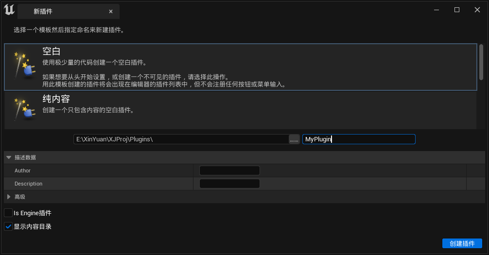
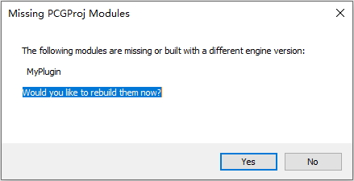
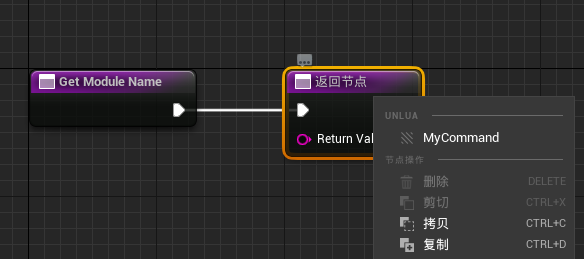
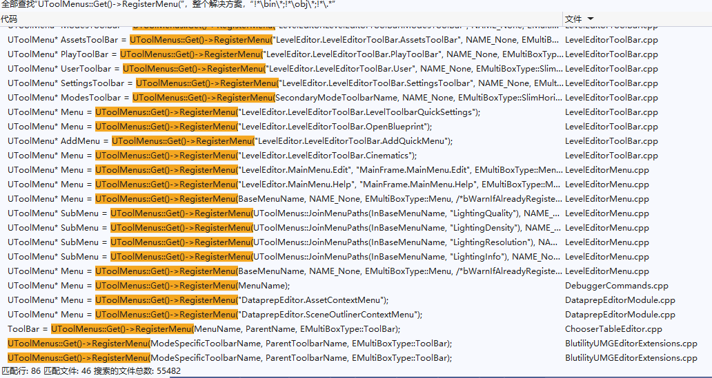
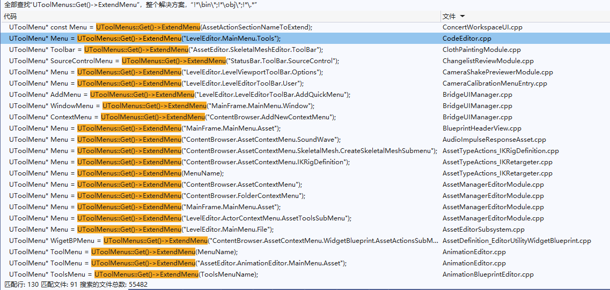
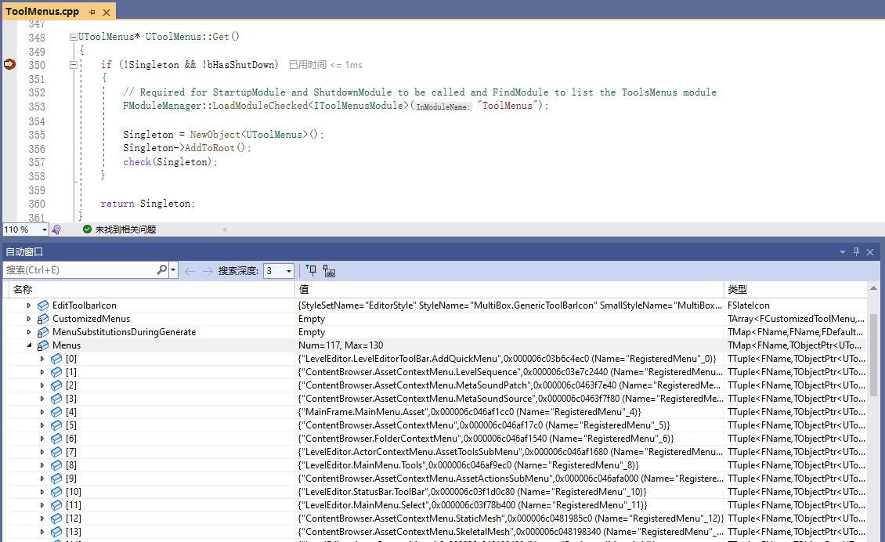

插件 游离在 引擎和工程代码 之外，它是UE中用来扩展 程序功能 的主要方式，

插件本质上是一种模块化的代码设计，遵循这一设计能减少代码间的依赖，使后续更易于迭代和维护。

在UE中，一个插件的标准文件结构如下：


-   `Binaries`：存放编译的生成文件
-   `Content`：存放插件的资产内容
-   `Intermediate`：存放编译过程中生成的中间文件
-   `Resources`：存放插件的资源文件，比如图标，非UE资产
-   `Source`：存放代码源文件，可包含多个Module

-   `*.uplugin`：插件的结构组织文件

其中 `*.uplugin` 的基本内容如下：

``` c++
{
	"FileVersion": 3,				//文件夹版本
	"Version": 1,					//版本Number
	"VersionName": "1.0",			//版本名称
	"FriendlyName": "CustomPlugin",	//别名
	"Description": "",				//描述
	"Category": "Other",			//分类
    "CreatedBy": "",				//作者
	"CreatedByURL": "",				//作者链接
	"DocsURL": "",					//文档链接
	"MarketplaceURL": "",			//商城链接
	"SupportURL": "",				//服务支持链接
	"CanContainContent": false,		//是否包含内容目录
	"IsBetaVersion": false,			//是否为测试版本
	"IsExperimentalVersion": false,	//是否为实验性版本
	"Installed": false,				//是否嵌入
	"Modules": [					//模块定义
		{
			"Name": "CustomPlugin",		//模块名称
			"Type": "Editor",			//模块类型
			"LoadingPhase": "Default"	//加载时机
		}
        //,								//其他模块
        //{
        //	...    
        //}
	]
}
```

关于这些参数的配置，详见：

-   https://docs.unrealengine.com/5.2/en-US/unreal-engine-modules

在UE中开发插件，常见的工作流是：

-   点击 `编辑` - `插件` - 打开插件面板

    

-   添加新插件

    

-   创建空白插件

    

-   由于项目结构发生变化，此时需要重新生成IDE的工程文件

>   空白插件是一个很好的起点，其他只不过是增加了一些附带的代码模板，如果对其并不熟悉，可以尝试添加看看，了解一下里面的代码具体增加了哪些内容，掌握了它的作用，往空白插件里加就行

这是一个C++插件中必需存在的文件：

``` c++
// MyPlugin.h

#pragma once

#include "CoreMinimal.h"
#include "Modules/ModuleManager.h"

class FMyPluginModule : public IModuleInterface
{
public:

	/** IModuleInterface implementation */
	virtual void StartupModule() override;
	virtual void ShutdownModule() override;
};
```

``` c++
// MyPlugin.cpp

#include "MyPlugin.h"

#define LOCTEXT_NAMESPACE "FMyPluginModule"

void FMyPluginModule::StartupModule()
{
	// This code will execute after your module is loaded into memory; the exact timing is specified in the .uplugin file per-module
}

void FMyPluginModule::ShutdownModule()
{
	// This function may be called during shutdown to clean up your module.  For modules that support dynamic reloading,
	// we call this function before unloading the module.
}

#undef LOCTEXT_NAMESPACE
	
IMPLEMENT_MODULE(FMyPluginModule, MyPlugin)		//定义插件入口
```

UE在加载插件时会调用`StartupModule()`，卸载插件时会调用`ShutdownModule()`

插件开发的代码流程主要是：

-   在`StartupModule()`中，调用 **核心模块的函数接口** 或使用 **核心模块的全局单例** 做一些操作，或者说将一些逻辑挂载到 **核心模块的入口点** 上去做一些扩展。
-   在`ShutdownModule()`中，清理`StartupModule()`中所做的操作

其中常见的一些函数模块如下：

-   **FFileHelper** ：文件操作
-   **FPlatformProcess** ：平台相关的操作
-   **FBlueprintEditorUtils** ：蓝图操作
-   **FKismetEditorUtilities** ：编辑器操作
-   **FEdGraphUtilities** ：图表操作
-   **FComponentEditorUtils** ：组件编辑器操作
-   **FEnumEditorUtils** ：枚举操作
-   **FStructureEditorUtils** ：结构体操作
-   **FEditorFolderUtils** ：编辑器文件夹操作
-   **FMaterialEditorUtilities** ：材质操作
-   **FPluginUtils** ：插件操作
-   **UGameplayStatics** ：Gameplay相关操作
-   ...

全局单例如下：

-   `GEngine`，`GEditor`，`GWorld`：引擎里面常用的全局单例
-   `FModuleManager::LoadModuleChecked<FAssetToolsModule>("AssetTools").Get()`：资产的创建，删除，重命名，导入导出...
-   `FModuleManager::LoadModuleChecked<FAssetRegistryModule>(TEXT("AssetRegistry")).Get()`：资产的搜索，枚举...
-   `FModuleManager::LoadModuleChecked<ISettingsModule>("Settings")`：配置文件的相关管理
-   `FModuleManager::LoadModuleChecked<FPropertyEditorModule>("PropertyEditor")：属性编辑器的相关操作`
-   `FModuleManager::LoadModuleChecked<FLevelEditorModule>(TEXT("LevelEditor"))：关卡编辑器的相关操作`
-   `FModuleManager::LoadModuleChecked<FBlueprintEditorModule>("Kismet")：蓝图编辑器的相关操作`
-   ...

核心模块的入口点，一般指的是：

-   **Callback 函数回调**
-   **Delegate 委托**

常见的委托定义集合有：

-   **FCoreUObjectDelegates** ：UObject相关的委托

-   **FCoreDelegates** ：核心模块的相关委托

-   **FEditorDelegates** ：编辑器模块的相关委托

-   **FWorldDelegates** ：游戏世界相关的委托
-   **FGameDelegates**
-   ...

在编写完插件，执行编译时，会在插件的`Binaries`目录下生成以下文件：


-   `*.module`：定义模块库的基本信息
-   `*.dll`：动态库
-   `*.pdb`：程序调试数据库，用于通过源码 断点调试 库，详见 [此处](https://learn.microsoft.com/en-us/visualstudio/debugger/specify-symbol-dot-pdb-and-source-files-in-the-visual-studio-debugger)

其中*.module的文件内容如下

``` c++
{
	"BuildId": "a36b278a-b317-44c3-8743-b82361b74343",
	"Modules": 
	{
		"MyPlugin": "UnrealEditor-MyPlugin.dll"
	}
}
```

这里需要注意的参数是`BuildID`，它是由引擎生成的，当插件的`BuildID`与引擎的`BuildID`不一致时，使用编辑器启动项目会报错：



引擎的`BuildID`可以查看：


## 基础

## 菜单栏工具栏扩展

引擎开发过程中，经常会有一些需求，去扩展引擎编辑器的菜单栏，工具栏，增加一个按钮，去执行一些便捷的操作，就像是这样：




在UE4中，扩展菜单的主要方式是通过 **FExtender** ，到了UE5中，有了新的更易于使用的方式 — **UToolMenus**

**UToolMenus ** 是一个单例类，可以通过以下代码获取单例实例：

``` c++
UToolMenus* ToolMenus = UToolMenus::Get();
```

在UE5中，所有 可扩展的菜单栏工具栏 `在初始化时` ，都会调用函数 `UToolMenus::RegisterMenu` 进行注册：

```c++
UToolMenu* UToolMenus::RegisterMenu(const FName InName,
                                    const FName InParent = NAME_None,
                                    EMultiBoxType InType = EMultiBoxType::Menu,
                                    bool bWarnIfAlreadyRegistered = true)
```



该函数用于注册一个可被扩展的`ToolMenu`，函数的各个参数意义如下：

-   `InName`：注册所用的链式字段，形如`LevelEditor.LevelEditorToolBar.User`，之后可以使用该字段作为Key可以得到`UToolMenu`
-   `InParent`：指定工具菜单的Parent
-   `InType`：指定了该ToolMenu的类型，这个类型就决定了可以怎样来扩展该Menu，它可以是以下的值：
    -   `MenuBar`：菜单栏，支持扩展菜单
    -   `ToolBar`：工具栏，可以添加工具按钮
    -   `VerticalToolBar`：竖直工具栏
    -   `SlimHorizontalToolBar`：水平工具栏，它是工具栏的精简版本，可以将图标和文本元素水平对齐
    -   `UniformToolBar`：
    -   `Menu`：菜单，可以添加菜单项
    -   `ButtonRow`：按行排列的按钮，每行有最大数量的按钮，类似于工具栏，但可以有多行
-   `bWarnIfAlreadyRegistered`：Bool值，如果该字段已被注册则发出警告。

当需要 `预览菜单的时刻` ，则会调用函数`UToolMenus::GenerateWidget`来生成`ToolMenu`的控件：

```c++
TSharedRef<SWidget> UToolMenus::GenerateWidget(const FName Name, const FToolMenuContext& InMenuContext)
```


在`ToolMenu`被Register之后，预览之前的任一时机，我们都可以通过函数`UToolMenus::ExtendMenu`来扩展菜单栏的内容。

``` c++
UToolMenu* UToolMenus::ExtendMenu(const FName InName)
```



上方代码中有大量的扩展参考，而这里也有一个简单的插件扩展实例：

``` c++
#pragma once

#include "Modules/ModuleManager.h"

class FCustomPluginModule : public IModuleInterface
{
public:
	virtual void StartupModule() override {
		//启动插件时给UToolMenus的启动增加一个回调
		UToolMenus::RegisterStartupCallback(FSimpleMulticastDelegate::FDelegate::CreateRaw(this, &FCustomPluginModule::RegisterMenus));
	}

	virtual void ShutdownModule() override {
		//去除UToolMenus的启动回调，重置一些状态
		UToolMenus::UnRegisterStartupCallback(this);
		UToolMenus::UnregisterOwner(this);
	}
private:
	void RegisterMenus() {
		FToolMenuOwnerScoped OwnerScoped(this);
		UToolMenu* Menu = UToolMenus::Get()->ExtendMenu("LevelEditor.LevelEditorToolBar.PlayToolBar");
		FToolMenuSection& Section = Menu->FindOrAddSection("PluginTools");
		FToolMenuEntry& MenuEntry = Section.AddEntry(
			FToolMenuEntry::InitToolBarButton(			//添加工具栏按钮
				"CustomToolbarButton",
				FUIAction
				(
					FExecuteAction::CreateLambda([]() {
						FMessageDialog::Open(EAppMsgType::Ok, NSLOCTEXT("CustomNs", "HelloWorld", "Hello World!"));
					})
				)
			)
		);
		MenuEntry.InsertPosition = FToolMenuInsert(NAME_None, EToolMenuInsertType::First);
	}
};
```

该代码在关卡编辑器主面板的工具栏上添加了一个按钮，在点击时会弹出`Hello World`的对话框：


我们可以在`UToolMenus::Get()`添加断点，通过VS的调试窗口来获取到所有可扩展的字段列表：



## 资产扩展


## 视口扩展

扩展视口需要使用以下几个结构

-   SEditorViewport
-   FEditorViewportClient

## 细节面板相关

**DetailView** 是 UE 反射所带来的另一个强大的功能：

## 蓝图扩展

-   https://ikrima.dev/ue4guide/editor-extensions/custom-blueprints/blueprint-static-analysis/

## 用户体验

### 撤销重做

UObject拥有一套事务机制，如果UObject拥有标志`RF_Transactional`，则可以使用如下代码：

```C++
GEditor->BeginTransaction(NSLOCTEXT("NS", "Transaction", "Transaction"));       //开始事务
Object->Modify();               //此操作将Object的当前状态存储到事务中

SomeChange(Object);             //修改Object的一些属性

GEditor->EndTransaction();      //结束事务，提交Object的新状态
```

上述操作会使得SomeChanged能够被撤销重做。

>   详细请参阅：https://blog.csdn.net/qq_29523119/article/details/96778797

在编辑器开发中，经常会需要某个对象或窗口在撤销重做时，需要响应变更（比如说进行一些重建），UE提供了接口 **FEditorUndoClient** 用于撤销重做事件的监听，一个简单的代码示例如下：

```C++
class FUndoRedoListener: public FEditorUndoClient{
public:
    FUndoRedoListener(){
        if (GEditor)
            GEditor->RegisterForUndo(this);     //在合适的时机，注册该监听器，不一定是在构造函数中
    }
    ~FUndoRedoListener(){
        if (GEditor)
            GEditor->UnregisterForUndo(this);   //取消注册
    }
protected:
    virtual void PostUndo(bool bSuccess) override{      //当编辑器执行撤销后，会调用该函数
        RebuildSomething();
    }
    virtual void PostRedo(bool bSuccess) override{      //当编辑器执行重做后，会调用该函数
        RebuildSomething();
    }
};
```

### 反馈交互

#### 通知


```c++
FNotificationInfo Info(FText::FromString(TEXT("This is notification")));
Info.FadeInDuration = 2.0f;
Info.ExpireDuration = 2.0f;
Info.FadeOutDuration = 2.0f;
FSlateNotificationManager::Get().AddNotification(Info);
```


``` c++
static TWeakPtr<SNotificationItem> NotificationPtr;
FNotificationInfo Info(FText::FromString(TEXT("This is notification")));
Info.FadeInDuration = 2.0f;
Info.FadeOutDuration = 2.0f;
Info.bFireAndForget = false;		
Info.bUseThrobber = false;
FNotificationButtonInfo BtYesInfo = FNotificationButtonInfo(
    NSLOCTEXT("NotificationNamespace","Yes", "Yes"),
    NSLOCTEXT("NotificationNamespace","Yes", "Yes"),
    FSimpleDelegate::CreateLambda([]() {
        TSharedPtr<SNotificationItem> Notification = NotificationPtr.Pin();
        if (Notification.IsValid())
        {
            Notification->SetEnabled(false);
            Notification->SetExpireDuration(0.0f);
            Notification->ExpireAndFadeout();	
            NotificationPtr.Reset();
        }
    }),
    SNotificationItem::ECompletionState::CS_None
);
Info.ButtonDetails.Add(BtYesInfo);
NotificationPtr = FSlateNotificationManager::Get().AddNotification(Info);
```

#### 进度显示


``` c++
float AmountOfWork = 50;
FScopedSlowTask RootTask(AmountOfWork, (NSLOCTEXT("SlowTaskNamespace", "This is slow root task", "This is slow root task")));
RootTask.MakeDialog();
for (int i = 0; i < 50; i++) {
    FScopedSlowTask SubTask(1, (NSLOCTEXT("SlowTaskNamespace", "This is slow sub task", "This is slow sub task ")));
    SubTask.MakeDialog();
    for (int j = 0; j < 2; j++) {
        FPlatformProcess::Sleep(0.5);
        SubTask.EnterProgressFrame(0.5, FText::FromString("Sub Task"));
    }
    RootTask.EnterProgressFrame(1, FText::FromString("Root Task"));
}
```

#### [对话框](https://zhuanlan.zhihu.com/p/268069477)


``` c++
EAppReturnType::Type Ret = FMessageDialog::Open(EAppMsgType::YesNo, NSLOCTEXT("NS", "message dialog", "message dialog"));
if (Ret == EAppReturnType::Yes) {	

}
```

## 基础操作

### 字符串

#### TCHAR

> 通常情况下，代码中的字符串将使用 **ANSI** 进行编码，但由于 **ANSI** 支持的字符数量很少，所以应该在设置字符串变量文字时使用 **TEXT()** 宏，将 **ANSI** 文字转换为 **TCHAR** （本机 Unicode 编码）

``` c++
TCHAR* ThisIsTChars = TEXT("This is Raw String");
```

希望转换TCHAR和原生字符串编码格式，可使用以下宏：

- **TCHAR_TO_ANSI** (str) 

- **TCHAR_TO_UTF8** (str) 
- **TCHAR_TO_UTF16** (str) 
- **TCHAR_TO_UTF32** (str) 
- **TCHAR_TO_WCHAR** (str) 
- **ANSI_TO_TCHAR** (str) 

- **UTF8_TO_TCHAR** (str) 
- ...

游戏对于性能的要求是很高的，普通的String满足不了UE游戏开发中各个应用场景的性能需求，所以UE4提供了三个常用字符串类：

#### [FString](https://docs.unrealengine.com/4.27/zh-CN/ProgrammingAndScripting/ProgrammingWithCPP/UnrealArchitecture/StringHandling/FString/)

> 通用字符串，可以修改，它提供了大量操作字符串的方法。

- 构造
    - static FString **Chr** ( TCHAR Ch )
    - static FString **ChrN** ( int32 NumCharacters, TCHAR Char )
    - static FString **FromInt** ( int32 Num )
    - static FString **SanitizeFloat** ( double InFloat, const int32 InMinFractionalDigits = 1 )
    - static FString **FromBlob** (const uint8* SrcBuffer,const uint32 SrcSize);
- 格式化
    - static FString **Printf** (const FmtType& Fmt, Types... Args)
    - FString& **Appendf** (const FmtType& Fmt, Types... Args)
    - static FString **Format** (const TCHAR* InFormatString, const FStringFormatOrderedArguments& InOrderedArguments)
    - static FString **Format** (const TCHAR* InFormatString, const FStringFormatNamedArguments& InNamedArguments)

- 转化
    - void **ToUpperInline** ()
    - FString **ToUpper** ()
    - void **ToLowerInline** ()
    - FString **ToLower** ()
- 匹配
    - bool **Equals** (const FString& Other, ESearchCase::Type SearchCase = ESearchCase::CaseSensitive)
    - int32 **Compare** ( const FString& Other, ESearchCase::Type SearchCase = ESearchCase::CaseSensitive ) const
    - bool **IsNumeric** () 
    - bool **StartsWith** (const FString& InPrefix, ESearchCase::Type SearchCase = ESearchCase::IgnoreCase)
    - bool **EndsWith** (const FString& InSuffix, ESearchCase::Type SearchCase = ESearchCase::IgnoreCase ) 
    - bool **MatchesWildcard** (const FString& Wildcard, ESearchCase::Type SearchCase = ESearchCase::IgnoreCase)
    - bool **Contains** (const TCHAR* SubStr, ESearchCase::Type SearchCase = ESearchCase::IgnoreCase, 
        ESearchDir::Type SearchDir = ESearchDir::FromStart )

- 弹出
    - void **TrimStartAndEndInline** ()
    - FString **TrimStartAndEnd** () 
    - void **TrimStartInline** ()
    - FString **TrimStart** () 
    - void **TrimEndInline** ()
    - FString **TrimEnd** ()
    - void **TrimQuotesInline** (bool* bQuotesRemoved = nullptr);
    - FString **TrimQuotes** (bool* bQuotesRemoved = nullptr)
    - void **TrimCharInline** (const TCHAR CharacterToTrim, bool* bCharRemoved)
    - FString **TrimChar** (const TCHAR CharacterToTrim, bool* bCharRemoved = nullptr) 

- 查找
    - int32 **Find** ( const TCHAR* SubStr, ESearchCase::Type SearchCase = ESearchCase::IgnoreCase, 
        	ESearchDir::Type SearchDir = ESearchDir::FromStart, int32 StartPosition=INDEX_NONE ) 
    - bool **FindChar** ( TCHAR InChar, int32& Index )
    - bool **FindLastChar** ( TCHAR InChar, int32& Index ) 
    - int32 **FindLastCharByPredicate** (Predicate Pred, int32 Count)
    - int32 **FindLastCharByPredicate** (Predicate Pred)

- 分片
    - int32 **ParseIntoArray** ( TArray<FString>& OutArray, const TCHAR* pchDelim, bool InCullEmpty = true ) 
    - bool **Split** (const FString& InS, FString* LeftS, FString* RightS, ESearchCase::Type SearchCase,
        	ESearchDir::Type SearchDir = ESearchDir::FromStart) 

- 分割
    -  void **LeftInline** (int32 Count, bool bAllowShrinking = true)
    -  FString **Left** ( int32 Count ) 
    -  void **LeftChopInline** (int32 Count, bool bAllowShrinking = true)
    -  FString **LeftChop** ( int32 Count )
    -  FString **Right** ( int32 Count )
    -  void **RightInline** (int32 Count, bool bAllowShrinking = true)
    -  FString **RightChop** ( int32 Count )
    -  void **RightChopInline** (int32 Count, bool bAllowShrinking = true)
    -  FString **Mid** (int32 Start, int32 Count) 
    -  void **MidInline** (int32 Start, int32 Count = MAX_int32, bool bAllowShrinking = true)
- 拼接
    - static FString **Join** (const RangeType& Range, const TCHAR* Separator)
    - static FString **JoinBy** (const RangeType& Range, const TCHAR* Separator, ProjectionType Proj)
- 替换
    - FString **Replace** (const TCHAR* From, const TCHAR* To, ESearchCase::Type SearchCase = ESearchCase::IgnoreCase)
    - int32 **ReplaceInline** ( const TCHAR* SearchText, const TCHAR* ReplacementText, ESearchCase::Type SearchCase = ESearchCase::IgnoreCase )
    - FString **ReplaceQuotesWithEscapedQuotes** () 
    - void **ReplaceCharWithEscapedCharInline** ( const TArray<TCHAR>* Chars = nullptr )
    - FString **ReplaceCharWithEscapedChar** ( const TArray<TCHAR>* Chars = nullptr )
    - void **ReplaceEscapedCharWithCharInline** ( const TArray<TCHAR>* Chars = nullptr )
    - void **ConvertTabsToSpacesInline** (const int32 InSpacesPerTab);
    - FString **ConvertTabsToSpaces** (const int32 InSpacesPerTab)
- 反转
    - void **ReverseString** ();
    - FString **Reverse** ()

#### [FText](https://docs.unrealengine.com/4.27/zh-CN/ProgrammingAndScripting/ProgrammingWithCPP/UnrealArchitecture/StringHandling/FText/)

> 支持文本本地化（多语言），因此面向用户的所有文本都应使用它

##### 文本本地化（国际化）

#### [FName](https://docs.unrealengine.com/4.27/en-US/ProgrammingAndScripting/ProgrammingWithCPP/UnrealArchitecture/StringHandling/FName/)

> 用于命名，它不区分大小写，为便于快速定位某个资源，在创建时，FName会根据字符串内容计算出一个Hash值，这样实现比较逻辑的时候不用比较字符串内容，而是直接比较hash值是否相等。

> ### 相互转换
>
> ```c++
> TestString = TestName.ToString();
> TestString = TestText.ToString();
> 
> TestName = FName(*TestString);
> TestName = TestText	 // 从FText到FName转换不存在，但是可以通过先转到FString，再转到FName，但是不可靠，因为FName不区分大小写。
> 
> TestText = FText::FromName(TestName)
> TestText = FText::FromString(TestString)
> ```

#### 路径

> FPaths
>
> FPackagePath

#### 正则表达式

> https://blog.csdn.net/justtestlike/article/details/81393221

### 数学

UE的数学函数位于以下两个命名空间中：

- [FMath](https://docs.unrealengine.com/4.27/en-US/API/Runtime/Core/Math/FMath/)：UE的基础数学库
- [UkismetMathLibrary](https://docs.unrealengine.com/4.27/en-US/API/Runtime/Engine/Kismet/UKismetMathLibrary/)：蓝图库，在FMath的基础上封装了大量函数公开到蓝图

### 时间日期

### [定时器](https://docs.unrealengine.com/4.26/en-US/ProgrammingAndScripting/ProgrammingWithCPP/UnrealArchitecture/Timers/)

### 文件操作

## 输入输出

### FArchive

### 文件

UE中通过单例类 **[IFileManager](https://docs.unrealengine.com/4.26/en-US/API/Runtime/Core/HAL/IFileManager/)** ，提供了大量的文件操作，其中包括但不限于：

- 文件的读写、移动、删除、存在性验证、可读性验证、查找（递归）
- 目录的创建、删除、存在性验证、遍历

对于文件IO， **[FFileHelper](https://docs.unrealengine.com/4.27/en-US/API/Runtime/Core/Misc/FFileHelper/)** 中还提供了一些便捷的静态方法，用于文件的一次性读写。

### 字节流

### 图片

### 序列化

### Json

> 详细参考：https://www.cnblogs.com/shiroe/p/14751769.html

### XML

## 多线程

### FThread、FRunnable

### FStreamManager

### AsyncTask

### TaskGraph

## 调试

### 日志

- 自定义日志类别

    ``` c++
    // 头文件中声明
    DECLARE_LOG_CATEGORY_EXTERN(CustomLogCategory, Log, All);
    ```

    ``` c++
    // 源文件中定义
    DEFINE_LOG_CATEGORY(CustomLogCategory);
    ```

- 打印日志

    ``` c++
    UE_LOG(CustomLogCategory,Log,TEXT("This is log %d"),123);
    ```

    - Log
    - Warning
    - Error

### 断言

> 代码位于：`Engine\Source\Runtime\Core\Public\Misc\AssertionMacros.h`

- checkCode
- check
- checkf
- checkNoEntry
- checkNoReentry
- checkNoRecursion
- verify
- verifyf
- unimplemented
- ensure
- ensureMsgf
- ensureAlways
- ensureAlwaysMsgf

### 性能分析

### 控制台指令

## 开发心得

本着 **合理即存在** 的思维方式 去 **抄**
