# Niagara 性能优化

**Niagara** 是 **Unreal Engine** 提供的一个几乎无所不能的粒子系统，网上有非常多关于如何使用它来制作某些效果的优质教程，但Niagara的使用管理和性能优化往往会被特效制作人员给忽视。

由于笔者长期以来一直被蹂躏，因此本节会对相关内容做一些补充，希望小伙伴在了解之后可以尽可能避免这类问题=.=。

## 使用

**粒子系统（Particle System）** 是三维场景中用来丰富效果的重要手段，它不同于场景中的 **网格（Mesh）** ，其显著特征在于：

- 粒子的 **数量** 会比较多
- 粒子会随着时间 **运动**

如果不满足这两个特征（即`数量少`且`静态`），那么就需要制作人员考虑是使用 **MeshActor** ，还是粒子。

在 UE 中的特效，我们主要可以划分为两大类：

- **生成特效** ：使用`SpawnSystemAtLocation`和`SpawnSystemAttached`在场景中 **动态生成** 的特效。
- **场景特效** ：以 **Actor的形式布置在场景** 中的特效。

关于这两类特效，有着不同的关注重点，以及相应的管理措施。

### 包围盒

在游戏引擎中，为了减少每一帧图像的渲染开销，引擎会将一些不可见的物体给剔除掉，让这些物体不参与 GPU 的渲染 ，如下图所示：


> 该图像来自于：[马克·加尔维斯 - 主页 (optus23.github.io)](https://optus23.github.io/)

如果你了解 [3D视图变换](https://zhuanlan.zhihu.com/p/597152918) 的话，应该会知道：可以通过相机矩阵计算一遍物件的所有顶点，就能确定物件有没有在相机范围之内.


但显然，一个物体可能具有成千上万的顶点，如果为每个顶点就做一遍计算的话，游戏引擎可能就变成PPT播放器了~

为了简化这个过程，游戏引擎都会采用一种取巧的手段，使用一个能够包围物件的立方体盒子来代替物件的顶点进行相机剔除的计算，虽然盒子仅仅只有6个顶点，可视性判断不够精准，但它带来的性能提升是非常可观的。

> 在逻辑上可以认定为：只要能看到这个盒子，就一定能证明这个物件是可见的

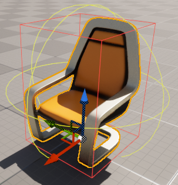

> 显示物体包围盒：`ShowFlag.Bounds 1`

所以大家要明白一点： **引擎中确定一个物体是否在相机范围内，或者是被遮挡，一般情况下，参考的并不是它本身的顶点信息，而是物体的包围盒。**

对于 **静态网格体（StaticMesh）** ，它的顶点都是静态的，在创建资产时，引擎就已经为其自动生成了包围盒信息

但对于特效而言，由于粒子是动态的，它的包围盒就无法静态生成。

在UE中，对于 **CPU粒子** ，引擎在每帧都会重新计算Niagara的包围盒边界：


但  **GPU粒子** 由于其实现的特殊性（所有粒子的数据均在GPU中，且粒子数量往往非常多），从而导致CPU侧无法实时计算粒子的包围盒，开发者 **必须** 为其设置一个 **固定边界** ，即手动设置包围盒的大小

> GPU粒子是GPU驱动的渲染管线，整个过程几乎没有跟CPU的交互，而图形渲染管线的数据往往可以看做是单向的：CPU->GPU，虽然也能从GPU上回读数据，但这个过程会存在一定延迟，且性能代价非常高昂）

在Niagara中，可以在这里设置 **粒子发射器** 的包围盒：

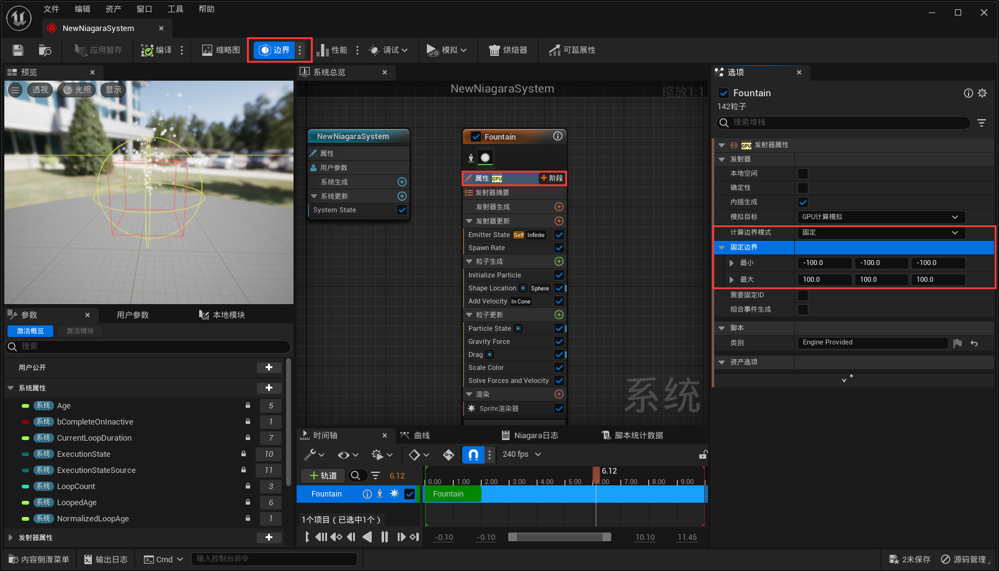

最简单的方式是为 **整个粒子系统** 设置包围盒：


**制作人员必须保证包围盒的正确性** （包围盒尽可能以最小的区域涵盖整个特效的运动空间），否则会造成以下后果：

- 如果特效的包围盒与实际的运动空间不匹配，则会导致错误的视觉裁剪：


- 如果特效的包围盒太大，将导致明明没有在视野范围内的特效，无法被剔除，依旧会执行渲染，造成不必要的损耗。

  

### 生命周期

对于 **场景特效** ，它的生命周期由场景从Actor层面进行管控，一般情况下无需我们关心，而 **生成特效** 的生命周期管控，有一些我们必须要了解的细节：

**生成特效** 是指使用 **UNiagaraFunctionLibrary** 下的几个函数生成的特效：

``` c++
UNiagaraComponent* SpawnSystemAtLocation(const UObject* WorldContextObject,
                                         class UNiagaraSystem* SystemTemplate, 
                                         FVector Location, 
                                         FRotator Rotation = FRotator::ZeroRotator,
                                         FVector Scale = FVector(1.f), 
                                         bool bAutoDestroy = true,
                                         bool bAutoActivate = true, 
                                         ENCPoolMethod PoolingMethod = ENCPoolMethod::None,
                                         bool bPreCullCheck = true);

UNiagaraComponent* SpawnSystemAttached(UNiagaraSystem* SystemTemplate,
                                       USceneComponent* AttachToComponent,
                                       FName AttachPointName,
                                       FVector Location, 
                                       FRotator Rotation,
                                       FVector Scale, 
                                       EAttachLocation::Type LocationType, 
                                       bool bAutoDestroy, 
                                       ENCPoolMethod PoolingMethod, 
                                       bool bAutoActivate = true,
                                       bool bPreCullCheck = true);
```

**SpawnSystemAtLocation** 用于在指定位置生成粒子组件，而 **SpawnSystemAttached** 用于附着在另一场景组件中，对于生命周期，我们主要需要关注几个参数：

- **bAutoActivate** ：是否自动激活，true表示随后立即播放粒子效果
- **bAutoDestroy** ：是否自动销毁，true会在粒子播放完成后销毁组件
- **bPreCullCheck** ：预剔除，如果为true，生成粒子系统的包围盒不在视椎体范围内，那么将不会生成粒子组件，即返回为null
- **PoolingMethod** ：池操作，复用粒子组件的机制，它的值可以是：
  - **None**
  - **AutoRelease** ：自动释放，播放结束之后，自动将之存放到特效池中以供复用
  - **ManualRelease** ：手动释放，需要手动调用 **ReleaseToPool** 才能使该粒子组件被复用
  - ManualRelease_OnComplete：非公开选项，用于Niagara内部的状态控制，请不要使用它。
  - FreeInPool：非公开选项，用于Niagara内部的状态控制，请不要使用它。

#### 特效池

> 详细机制请参阅文章：[【UE4】特效池 - 知乎 (zhihu.com)](https://zhuanlan.zhihu.com/p/394772587)

##### 缓存机制

特效池的目的主要是为了能够复用粒子组件，它的缓存机制可以看做是：

- 如果生成参数带有池操作（即`PoolingMethod != ENCPoolMethod::None`），那么Niagara会到特效池中去搜索是否有可复用的同类型组件，如果有，则使用它，否则就会新建粒子组件，并记录它的使用时间。
- 新建的粒子组件不会被释放（ **意味着bAutoDestroy会失效** ），它会被存到特效池中进行管理。
- 对于 **AutoRelease** 的粒子组件，当播放结束时，特效池会标记它为可复用的。
- 对于 **ManualRelease** 的粒子组件，调用 **ReleaseToPool** 时，如果该粒子已经播放完成，会立即标记为可复用，否则修改池操作为 **ManualRelease_OnComplete** ，在播放完成时，也会标记复用。

##### 清理方式

**UNiagaraComponentPool** 拥有定时清理的机制，两个主要关键参数为：

- **GNiagaraSystemPoolKillUnusedTime** ：默认为180
- **GNiagaraSystemPoolingCleanTime** ：默认为30

上述配置对应的自动清理的机制可以大致当做是：UNiagaraComponentPool每30秒会去清理一下超过180s未被复用的粒子组件

> 实际上并不是Tick清理，而是在每一次复用的时候进行清理，所以未必是30s，可能偏差会比较大。

在切换World时， **UNiagaraComponentPool** 会执行Cleanup

也可手动调用 **UNiagaraComponentPool::ClearPool(UNiagaraSystem* System)** 进行清理。

#### 坑点

- 如果有池操作（ **PoolingMethod** ），那么 **bAutoDestroy** 将会失效
- 池机制正常工作的前提是粒子系统能够播放结束，请注意：
  - 确保粒子系统中没有生命周期无限的发射器
  - 调用了ResetParticles(true)，会走不到 Complete 
  - 如果可延展性剔除的 **剔除反应为休眠** ，被 **剔除的特效不会被复用** ，且 **OnSystemFinished不会触发** （从严格意义上并不算完成）
- 对于有池操作的粒子组件，请 **不要调用DestoryComponent** ，池中的粒子组件会在切换World时清理，或者定时清理。
- 如果 **SpawnSystemAttached** 带有池操作，那么新生成的粒子组件的 **真实持有者为World，而非附着的组件** ，粒子组件将 **不会随附着组件销毁而销毁**
- 对 **AutoRelease** 的粒子组件调用 **ReleaseToPool** 会有报错
- 对于即没有开启 **AutoRelease** ，也没有池操作的粒子，需要严格管控它的生命周期

### 可延展性

通过设置包围盒，可以在 **在视觉上** 将粒子剔除，但需要注意的是：粒子系统不同于普通的场景物体，它还有 **模拟的成本** ！

这是目前非常多特效师在使用Niagara容易忽略的问题，很多小伙伴以为看不到粒子时，粒子就会停止，但实际并不是这样的，它依旧在执行：


对于生成特效，由于它具备一定的生命周期，因此在大多数情况下，它的模拟消耗都无关痛痒。

但对于场景特效，如果布置在场景中的NiagaraActor数量过多，对整个程序的影响都非常大。

为了解决这个问题，UE提供了一个名为 **效果类型（NiagaraEffectType）** 的资产，用于控制 Niagara System **在模拟上的优化策略** 。


我们可以在此处指定NiagaraSystem所使用的效果类型：

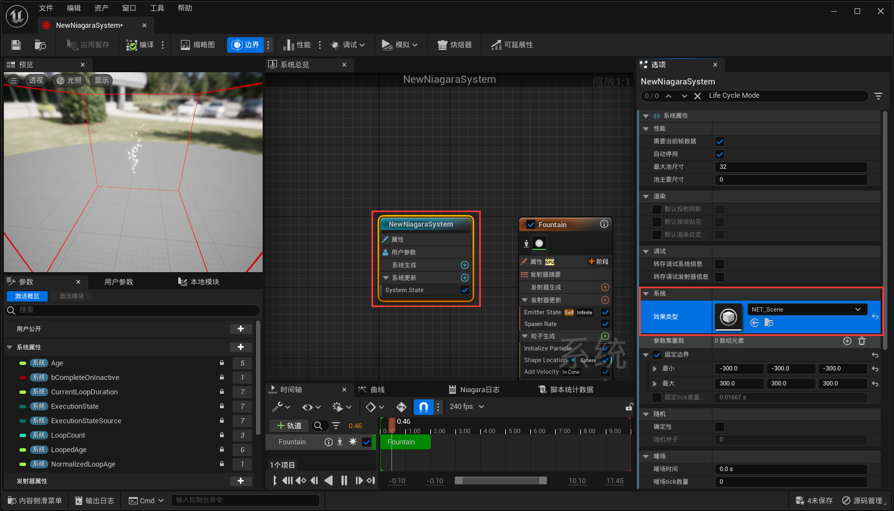

使用它能完成以下需求：

- 限定粒子系统的最远显示距离
- 限制当前视口内显示的最大粒子系统的数量
- 根据性能预算来调整粒子的效果
- 调整发射器发射数量的缩放系数

它的配置面板如下：


我们可以添加 系统和发射器可延展性配置，每一个配置对应不同性能级别下，所采取的可延展性策略：


它的参数意义如下：

- 运行针对本地玩家进行剔除：是否允许剔除由本地玩家生成，附加，创建的特效

- 更新频率：`仅生成`、`低`、`中`、`高`、`连续`

  **NiagaraEffectType** 和 **NiagaraComponent** 一样，都是由 **NiagaraWorldManager** 进行管理， **NiagaraEffectType** 会单独进行Tick，这里的更新频率是指它去检测 **NiagaraSystem** 当前状态的频率，频率越高，剔除反应越及时，但性能开销也越大。

- 剔除反应：`摧毁`、`摧毁并清除`、`休眠`、`休眠并清除`

  清除会立刻被杀死所有粒子，然后剔除NiagaraSystem，如果不清除，则不会生成新粒子，等待已存在粒子生命周期全部结束之后，再进行剔除

  摧毁与休眠的区别在于，摧毁是直接将粒子销毁，而休眠可以当作只是把粒子隐藏等待激活。

  对于场景特效，由于它是放置在场景中的Actor，销毁之后不会再生成，所以一般设置为休眠，具体的销毁和加载由大世界进行管理。

  而对于生成特效，他一般是一次性生成的，如果设置为休眠，它会一直占用内存，所以一般会将其销毁。

  在UE 5.3中，增加了 `暂停` 机制， 它与休眠的区别在于，暂停不会重新激活，将会保留粒子的当前数据（占用内存）

- 重要性处理器：`年龄`、`距离`

  重要性处理器主要跟下方的 **最大系统实例** 有关，最大系统代理决定了当前只允许多少个同类型粒子系统的实例存在，而重要性处理器，则是确定粒子排序的优先级，假如以距离为目标，有十个粒子系统，最大系统实例为五，那么 **NiagaraEffectType** 就只会保留最近的五个粒子效果。

- 系统延展性设置

  **设置列表** ，每添加一个设置项，可以配置该项在哪些环境下才生效

  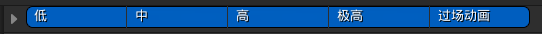

  - 最大距离：根据特效与当前玩家的距离来剔除粒子

  - 剔除代理模式：`已实例化渲染`，如果开启了 **已实例化渲染** ，将会创建一个不可见的粒子系统，其他所有被剔除的同类型粒子系统将使用它进行渲染，这样可以避免大量的模拟成本

  - 最大系统代理：最大的系统代理数

  - 预算调整：根据一定预算来调整粒子系统的可延展性策略
  - 可视性剔除：根据可见性来进行剔除。

> 具体的说明详见编辑器面板的Tooltip

对于场景特效，笔者非常建议大家统一对所有场景特效都统一设置这样的效果类型：


该配置达到的效果是：当粒子系统不可见时，既会停止渲染，也会停止模拟


它能满足绝大多数的需求。

当某些特效需要专门配置剔除策略时，Niagara支持对单独的 NiagaraSystem 和 NiagaraEmitter 进行 **可延展性重载** ，它能 **覆盖** NiagaraEffectType 的配置：


关于 **Niagara Effect Type** 详细配置的示例，可以参考：https://www.youtube.com/watch?v=-P3yaZNgeg0

### LOD

Niagara提供了LODDistance的内置变量，我们可以依据它的数值，对Niagara的性能参数进行一些距离上的适配


比如，通常会对生成数量制作LOD：


### 暖场时间

对于放置在场景中的循环特效 ，它往往会有一段`”预热“`的时间，在Niagara中，我们可以设置系统的暖场时间来把这段预热过程给掐掉：


对于具有 可视性裁剪 的场景特效，休眠裁剪 会重新激活粒子，这个时候会重新播放预热过程：


但设置 暖场时间 把 预热过程 裁剪掉之后，效果是这样的：


### 管控发射器数量

理想的情况是：只要两个发射器所使用的渲染器参数是完全一致的，那么它们就应该使用同一个发射器

因为发射器中的一个渲染器对应一条图形渲染管线，粒子系统本质上是处理图形渲染管线所需的实例化数据

多一个发射器就会多一份渲染数据，并且要多维护一个粒子缓冲区

如果只是想调整粒子的运动机制，可以通过自定义Module的方式进行扩展

### 界定CPU粒子和GPU粒子

CPU粒子：适用于少量的粒子渲染，由于数据位于CPU中，因此能获取到整个场景的信息，可以很方便地跟游戏逻辑进行交互，支持粒子间的事件通信，精准的物理碰撞，还可以动态地计算包围盒边界。

GPU粒子：有着非常低的性能损耗，适合用来渲染大量（百万级别）的粒子。

在界定时，首先思考的维度是粒子数量，如果是粒子数量非常少（比如几个或几十个），那么最好使用CPU粒子（因为没必要为了几个粒子增加GPU的调度开销）

当数量超过一千时，我们考虑的是：功能需求是否需要用的CPU粒子的特性。如果不需要，那么优先使用GPU粒子。

当粒子数非常多，但又需要使用CPU粒子的特性时，需要在较低级别的代码维度去扩展GPU粒子的功能。

## 优化

关于性能优化，我们大多数时候追求的是：在满足美术需求的同时，不造成性能上的卡顿。

整个指标非常模糊，对于大多数初学者而言，我们能做的，只有亡羊补牢。

所以第一点至关重要，我们需要能够发现性能问题，才能进一步去制定优化计划。

### 性能定位

UE提供了非常多的指令和工具来检测场景的执行性能，以下视频可作为参考：

- [[官方培训\]22-UE资产优化 | Epic 肖月_哔哩哔哩_bilibili](https://www.bilibili.com/video/BV1FT411x7hU/?spm_id_from=333.337.search-card.all.click)
- [[UnrealCircle苏州\]UE4性能优化 | 周华 苏州谜匣数娱_哔哩哔哩_bilibili](https://www.bilibili.com/video/BV1FV411G72Q/?vd_source=e173296de020f10e8476ed443bbdfaed)
- [【搬运】UnrealFest2023 UE5性能优化_哔哩哔哩_bilibili](https://www.bilibili.com/video/BV1Yj41147dh/?vd_source=e173296de020f10e8476ed443bbdfaed)

对于引擎人员，一般需要能够熟练使用 **RenderDoc** ， **Unreal Insight** ，各类Stat指令，从这些地方，我们可以获取到非常精细的性能数据。

而对于Niagara，UE中提供了专门的工具来监控Niagara的执行情况 —— **Niagara调试器（Niagara Debugger）**

我们可以在此处打开NiagaraDebugger：

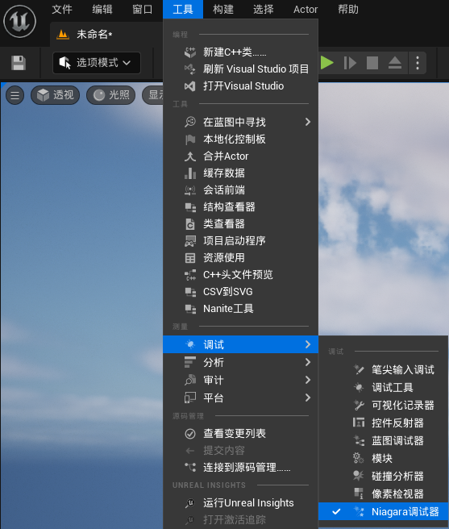

也可以在NiagaraSystem的细节面板中启动调试器：


####  调试Hud

在`调试Hud`页面中，提供了许多可供配置的Niagara调试视图。

勾选 `调试视图已启用`，我们能看到当前场景中正在执行的所有粒子系统的粒子数量和内存


可以勾选 `系统显示边界` 来显示NiagaraSystem的包围盒：


勾选 `显示系统属性`，并添加 属性匹配字符串 ，来增加粒子系统的调试预览视图：

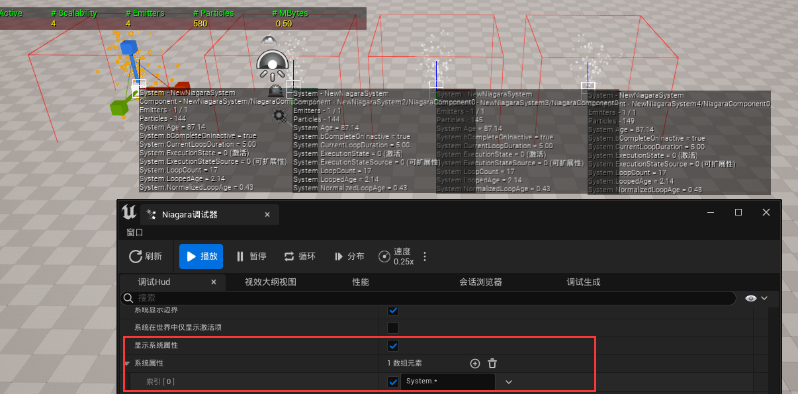

同样也可以预览粒子属性：


当场景中粒子系统比较多时，为了排除其他粒子调试视图的干扰，我们可以设置 命名过滤 来选择调试器需要关注的粒子系统：

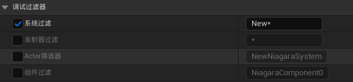

> 该配置只关注命名以`New`开头的粒子系统

#### 视效大纲视图

视效大纲用于对场景中的Niagara进行 **截帧** ，它支持三种视图模式：


点击 捕获（Capture） 就能截取 Niagara 的执行情况（可配置截取的延迟时间和帧的数量）：

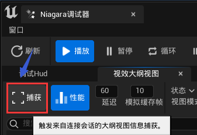

状态模式下，我们可查看场景中所有粒子系统的激活情况，模拟类型（CPU/GPU），粒子数量：


性能模式下，可进一步查看粒子系统在游戏线程和渲染线程的执行消耗


调试模式下，我们可以获取到粒子系统执行时的具体粒子数据：

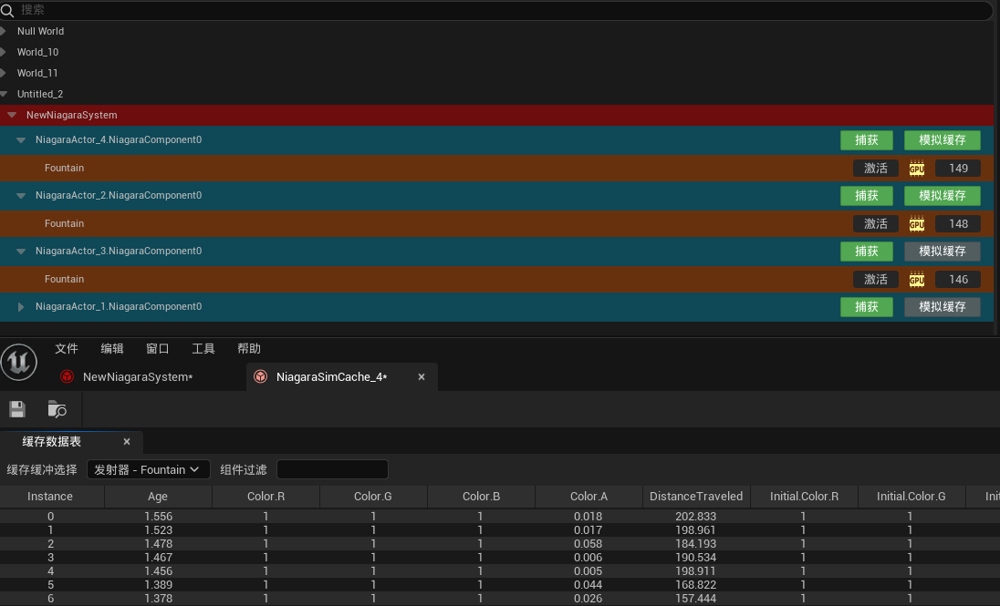

#### 性能

性能视图提供了一些测试手段：


#### 调试生成

调试生成 就是提供了一个界面去Spawn特效粒子，只需配置完粒子系统之后点击`生成系统`（需要在PIE模式下）

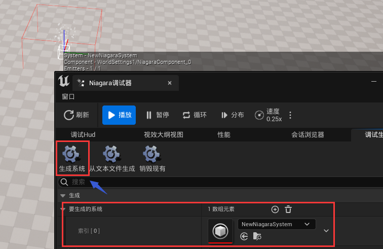

#### 模块性能

Niagara的编辑器中可以获取到每个模块的耗时情况：


#### 资源占用

可以在资产的内容菜单中，点击`尺寸贴图`查看引用贴图的大小：

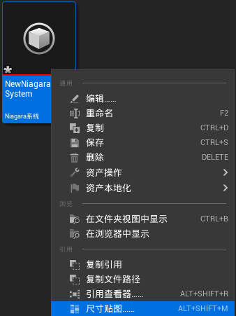

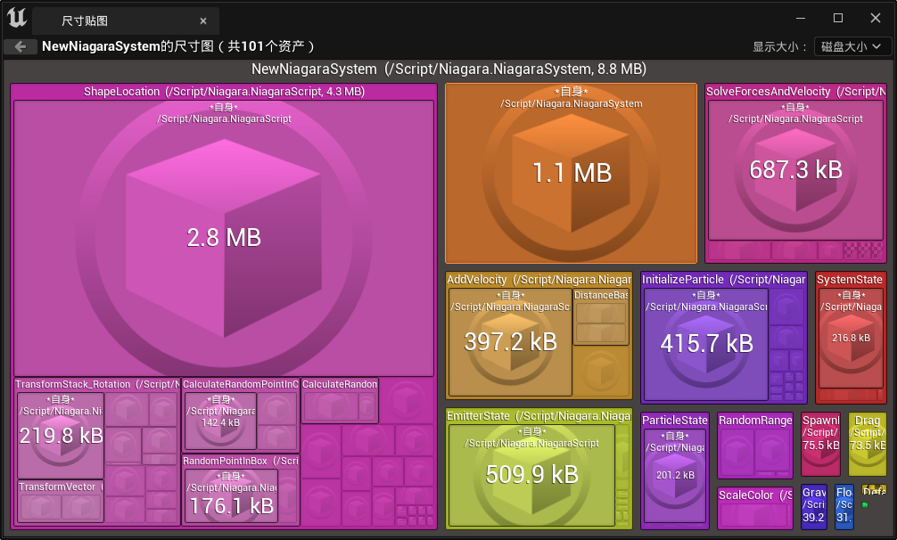

#### 问题及建议

- 在 Unreal Engine 5.1版本之前，Niagara System存在 **重编译BUG** ，它的表现效果是：首次在游戏中生成粒子时，会触发整个粒子系统的重编译，这是由于在 Niagara System Editor 中进行资源保存，存储了与游戏模式下 不同的一些配置，导致粒子系统的HashID不一致，从而引起编译缓存的失效，因此如果需要评估粒子系统在游戏环境中的执行性能，笔者建议在打包环境下进行测试。
- Unreal Engine 为 Niagara 提供了非常完善的配套工具，但对于一个大型团队而言，它是易于使用，但不易于管理的，笔者非常建议在上述工具集的基础上，进行进一步的扩展，增加自动化流程，来完成宏观的粒子系统管理。
- 对于一些常规的渲染优化，如优化材质，简化模型，降低Overdraw，对Niagara同样适用。

### 制作优化

在亡羊补牢的过程中总结出来的优化经验是弥足珍贵的，它能让制作人员逐渐地了解怎样才能制作出性能卓越的粒子特效。

以下是一些能够帮助特效师优化制作的心得（主要针对GPU粒子）

#### 算力认知

`1920 x 1080`是当下电脑显示器常见的分辨率，这代表了屏幕上有将近 **两百万** 个像素点，也意味着电脑绘制一帧图像至少需要做两百万次像素级别的数值处理，而目前一些中端硬件设备上，可以轻易在一秒内绘制成百上千张图像，这惊人的算力得益于 图形处理单元（GPU）的高速发展，与 中央处理单元（CPU）不同的是，CPU是电脑的调度中心，它的架构需要兼顾系统的方方面面，而GPU则是一种剑走偏锋的做法，它的架构中塞入了大量的计算单元以满足图形运算的需求。

> 以当下尖端的消费级显卡 `GeForce RTX 4090` 为例，它具有七百六十多亿个晶体管、一万六千多个计算核心。

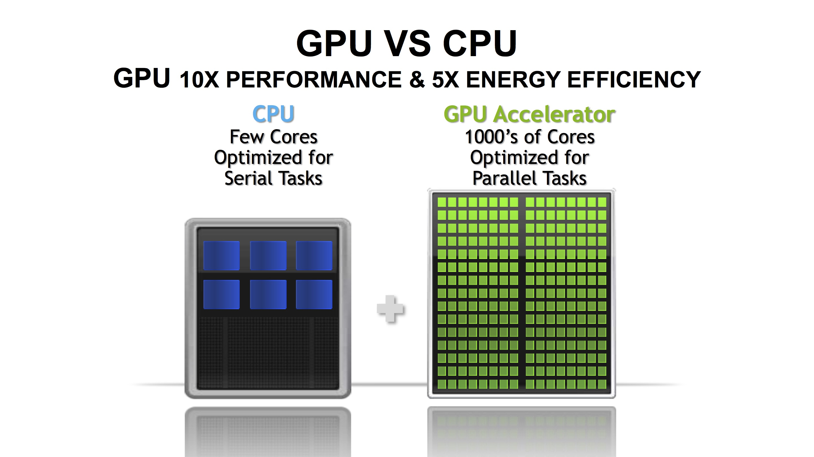

在清楚这个上限之后，我们可以简单将 `单个GPU粒子` 跟 `像素点` 进行对应，也就是通常情况下，中端显卡也能轻松模拟百万级别数量的粒子效果。

但需要注意的是，百万级别往往是整个系统的上限，我们通常不可能将所有性能预算都留给粒子系统，所以在一般情况下，如果整体的粒子数量超过十万，就可能会对整个渲染系统造成性能压力。

如果将这十万粒子转换为对应数量的`1x1`的像素点进行平铺，它大约对应了`300x300`尺寸大小的图像：


粒子系统的 **占屏面积** 越接近它的 **平铺面积** ，则意味着它的性能越好（因为有更少的OverDraw）

以下是一个平平无奇，但却具有14万粒子数量的NiagaraSystem，它辜负了这么大数量所应匹配的表现效果：


并且随着视野的远离，它的OverDraw越来越严重：


> 这个问题可以使用LOD曲线根据距离来优化粒子数量。

#### 底层原理

Niagara本身是UE提供的一个可编程的数据处理器，在NiagaraEditor中，我们可以自由管控这个处理器的处理结构：


并在各个 **阶段（Stage）** 中，使用引擎提供的 可视化节点 编写相应的 **模块（Module）** ，来制定数据的处理逻辑：

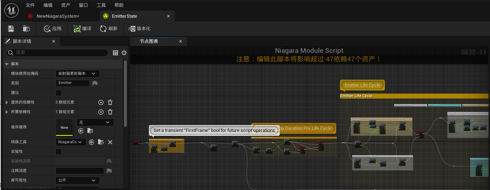

这些可视化的节点逻辑将会被翻译为ComputerShader的代码：

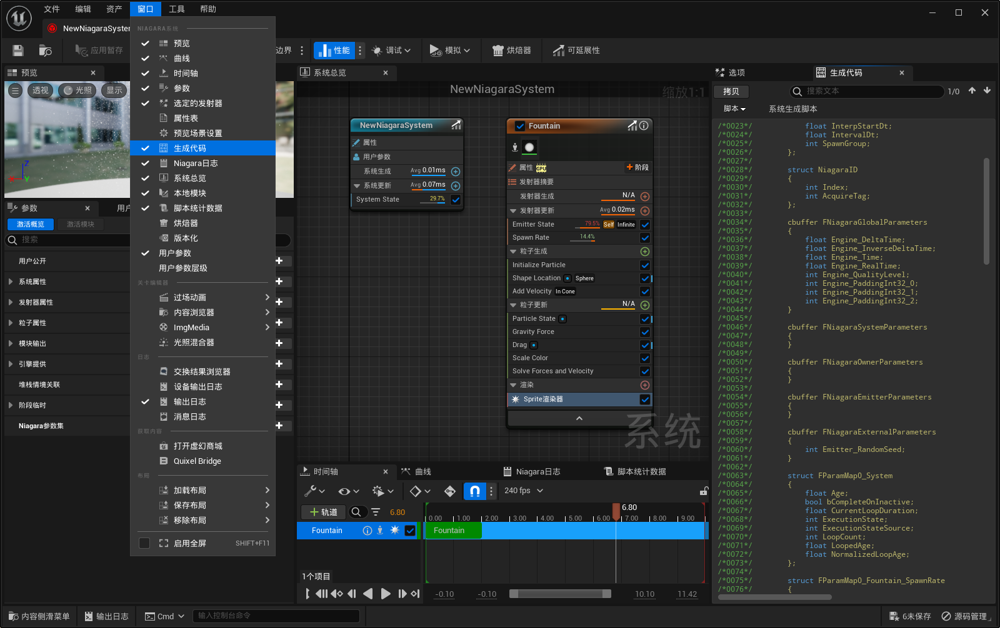

而数据处理的结果，将绑定到渲染器对应的属性插槽，供给渲染器来完成粒子效果的最终表达：

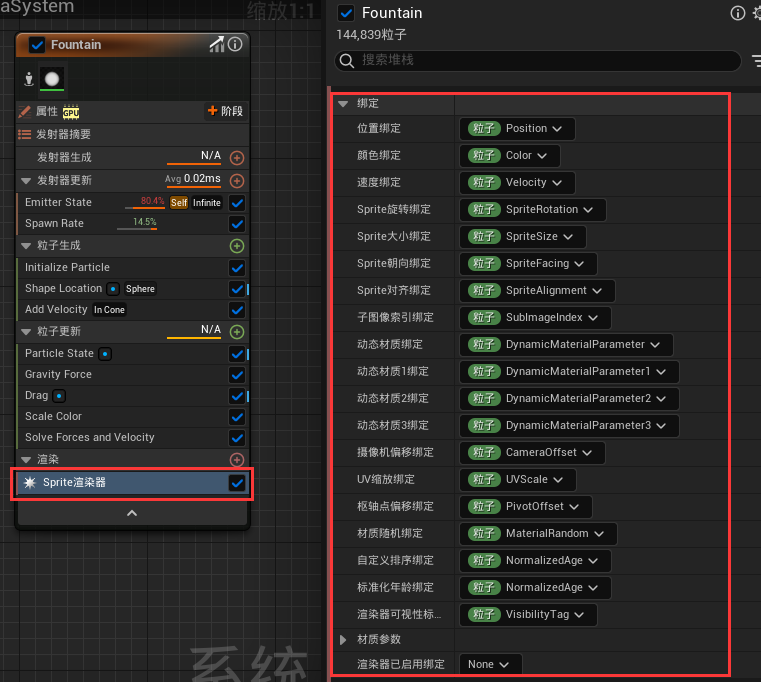

从数据处理层面来进行思考，我们的关键目标是怎样制作一个高效的数据处理器，因此掌握Niagara底层模块的原理，对整体性能和效果的把控，至关重要。

这里有一个非常优秀的教程：

- [[官方培训\]09-UE粒子基础 | 肖月 Epic bilibili](https://www.bilibili.com/video/BV1ea411V76f/?vd_source=e173296de020f10e8476ed443bbdfaed)

#### 序列帧烘培

Niagara Editor 支持将粒子特效烘培为序列帧，对于一些固定视角的特效，我们可以采取此方案来获得极大程度的优化。

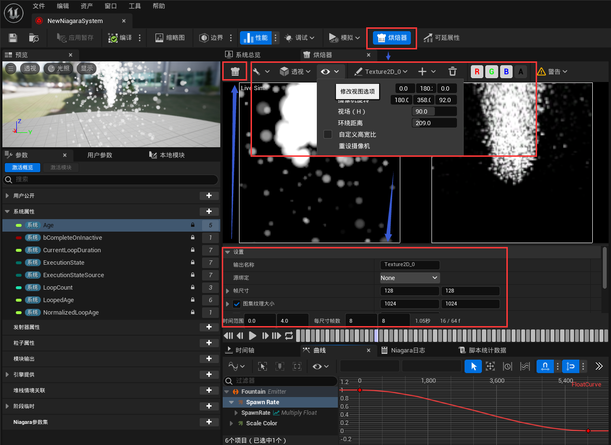

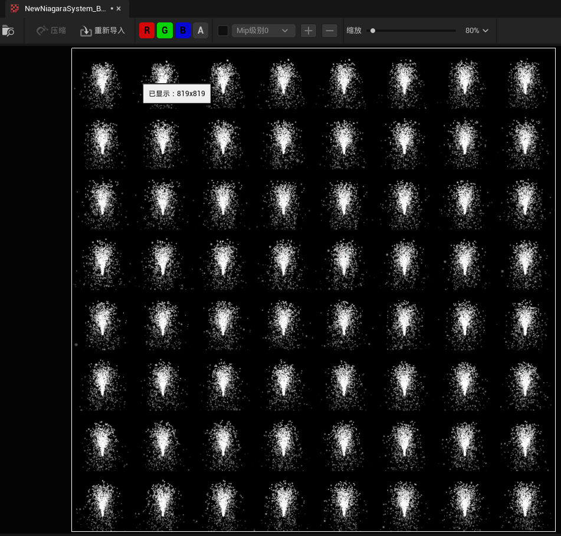

#### 程序化内容生成

粒子系统主要 **适用** 于模拟 **大量** **动态** 的物体，但只有一些特定需求下，我们才不得不使用粒子系统来进行 **实时的模拟** ：

- 制作可交互的动态效果
- 需要营造无视觉死角的立体效果
- 非常大数量的大范围集群

排除以上的使用场景，我们通常可以通过 **烘培静态材质** 来达到想要的表现效果。

所以我们在制作粒子效果时，需要认真审视：是否需要用粒子系统来进行实时的模拟？

如果要，那么我们再思考：是否可以将，粒子系统中某些实时计算的阶段，换成已经预制的静态数据。

比如在制作跟场景相关的特效时，粒子的模拟可能会需要一些场景信息作为输入，而这些场景数据绝大多数情况下都是静态的，我们没必要在运行时去实时计算场景的相关信息，在编辑器中就能静态生成这些数据，这样就可以以较少的性能成本制作出跟场景高度融合的特效，这在粒子系统数量比较多的情况下，提升尤为明显。

我们也可以在Niagara上制作  **程序化内容生成（PCG）** 的资产：

-   在 **Niagara System** 的 **用户参数（User Parameters）** 中，添加粒子系统所需要的场景数据（这里添加了一个名为`SpawnPositionArray`的变量）：


- 创建一个新的 **Actor 蓝图** ，添加 **NiagaraComponent** ，并指定 **Niagara System**

- 在蓝图的 **BeginPlay** 事件中去设置我们在Niagara中添加的参数，并将参数输入 `提升为变量` （`Partcile Spawn Position Array`）：

  

- 在 蓝图中 添加一个函数（例如叫 `CalcParticleSpawnPositionArray`），并勾选 **Call In Editor** ，在这个函数中获取场景信息（无需关心性能，可以扫描Actor，打射线...），填充蓝图变量值（`Partcile Spawn Position Array`）：

  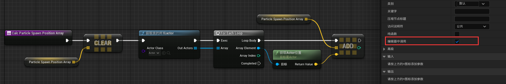

- 将Actor蓝图放到场景中，可以发现它的细节面板中，之前创建的函数变成了一个可点击的按钮：

  

- 点击按钮将执行对应的函数逻辑，它将会将执行并填充蓝图属性，这些属性值将会在保存时被序列化，当正常启动游戏时，执行BeginPlay，将会把这些数据提交给Niagara

- 之后可以在Niagara中编写相应的Module来使用这部分数据。

> 需要注意的是，我们不能直接在`CalcParticleSpawnPositionArray`去设置Niagara的参数值，而是借助蓝图的变量属性序列化来存储场景数据。
>
> 这是因为 设置Niagara参数的函数（以`NiagaraSet...`开头），是直接将数据上传给Niagara的数据处理器，而不会进行存储，因此通过函数来设置Niagara参数，在NiagaraSystem的细节面板上不一定能看到参数发生变化（有一部分属性类型是做了编辑器数据的返回同步，所以能在细节面板看到变更）


