# Fluid Ninja

**Fluid Ninja** 是一个令人惊叹的交互流体模拟插件，使用它可以以极低的性能损耗制作出令人叹为观止的效果：

- 作者YouTube：https://www.youtube.com/c/AndrasKetzer
- 虚幻商城：https://www.unrealengine.com/marketplace/en-US/product/fluidninja-live
- 讨论社区（Discord）：https://discord.com/invite/rgEtwua2tu

作者Youtube上很多视频教程：

- [FluidNinja LIVE - ALL IN ONE TUTORIAL and making FX from scratch - YouTube](https://www.youtube.com/watch?v=vXalfRAnXak&t=3869s)

- [FluidNinja 中文教学 - 陶仁贤 ](https://space.bilibili.com/22866318/channel/seriesdetail?sid=2277642)

## 获取

对于学生用户，可以到 Fluid Ninja 的`Discord社区`中下载学生免费版：

对于商业用户，请在虚幻商城中购买FluidNinja插件：

- https://www.unrealengine.com/marketplace/en-US/product/fluidninja-live

## 示例

在`Content/FluidNinjaLive/Tutorial/Levels/`中有大量的示例关卡，这些关卡中都有详细的描述文本：

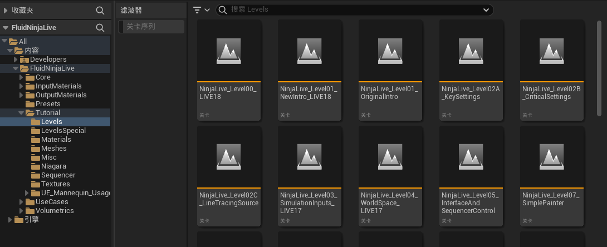

最好的学习方式就是依次对这些关卡进行复刻，理解它的参数配置：

## 关键蓝图

### NinjaLiveComponent

NinjaLiveComponent是FluidNinja的核心，使用它必须搭载一个静态网格体（一般是面片，称它为 **跟踪网格（Trace Mesh）** ），流体模拟的最终结果将作为跟踪网格的材质进行输出：

> 上图中的红色面片也就是跟踪网格

### NinjaLive

NinjaLive是Fluid Ninja提供的一个默认Actor，它对 NinjaLiveComponent 的参数进行了一层包裹，包含了一个能满足绝大多数情况的使用需求的跟踪面片，简化了NinjaLiveComponent的设置，并添加了一些额外的功能，比如：

- 通过ActivationVolume 对 NinjaFluid 进行剔除休眠，进入到ActivationVolume才会激活NinjaLiveComponent
- 通过InteractionVolume更细粒度地设置交互区域。

### NinjaLive_Utilities

NinjaLive_Utilities（蓝图Actor）提供了一些便捷的调试功能，比如：

- 自动控制距离该蓝图最近的玩家
- 显示鼠标
- 调整抗锯齿，景深，运动模糊的质量
- 解除编辑器120FPS的限制
- ...

可以将该蓝图拖入场景中，并进行配置：

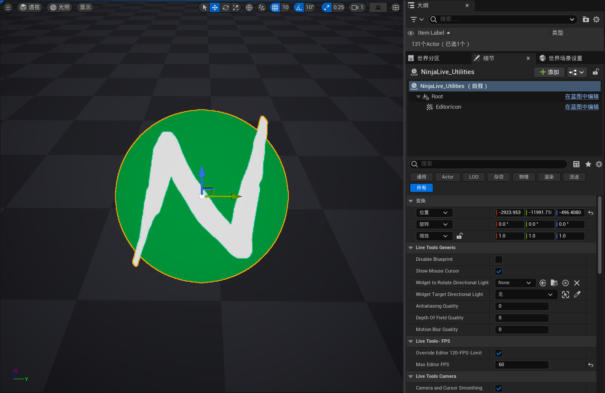

### NinjaLive_PresetManager

NinjaLive_PresetManager（蓝图Actor）用于调整NinjaLive的参数预设。

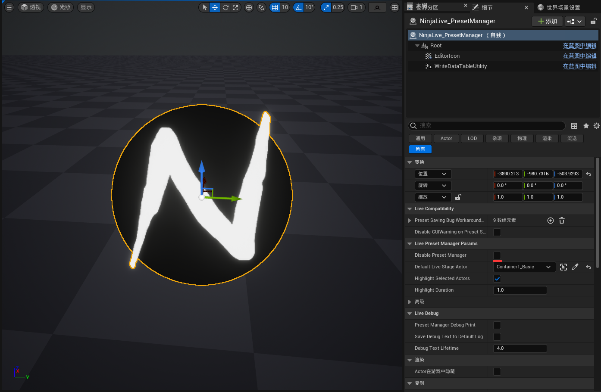

将它拖入场景，启动PIE，可以看到如下面板：

### NinjaLive_MemoryPoolManager

NinjaLive_MemoryPoolManager（蓝图Actor）用于配置FluidNinja的内存策略。

## 模拟过程

在FluidNinja的资产目录下，有一个名为 `Help` 蓝图：

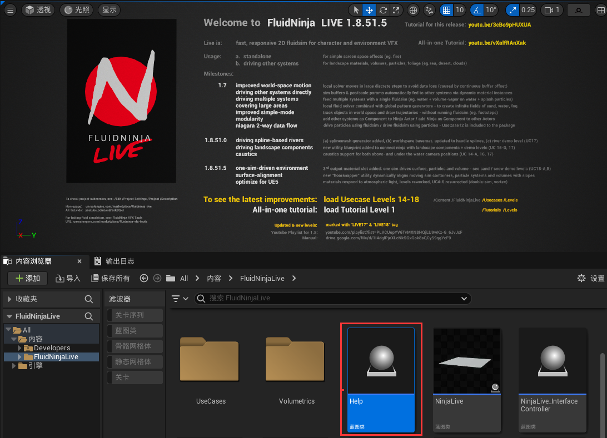

它里面详细描述了 Fluid Ninja 模拟的流程图：

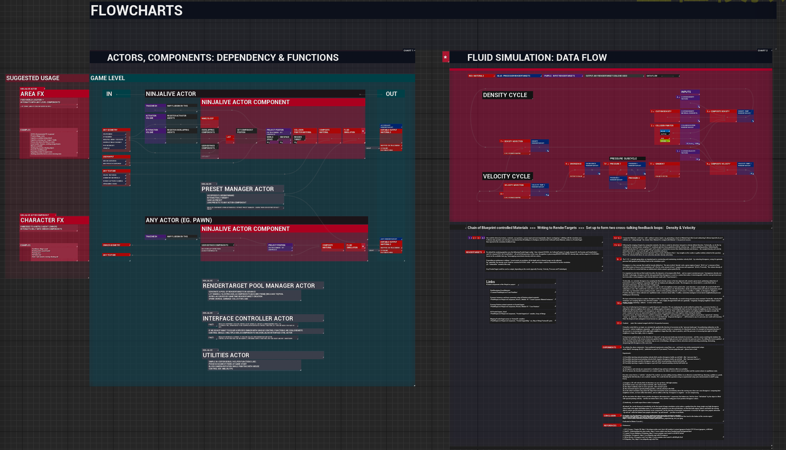

NinjaFluid的核心在于：

- 构建 **Density（密度）** 贴图和 **Velocity（速度）** 贴图
- 叠加 **噪声（Noise）** 来增加流体的随机度
- 调整 **画刷（Brush）** 来控制流体的形体
- 结合 **输出材质（Output Mateial）**
- 将最终结果输出到 **跟踪网格（Trace Mesh）** 的材质表面
- 得到我们想要的结果：

- Density 为单通道纹理，值域为[0,1]，用于表示当前位置流体的密度。
- Velocity 为双通道纹理，值域为[0,1]，用于表示当前位置流体的矢量速度，由于被标准化为[0,1]，速度0实际上对应的RG值为(0.5,0.5)，上图中：
  - Velocity纹理的R通道对应水平速度，当值`<0.5`时流体向左，`>0.5`时流体向右
  - Velocity纹理的R通道对应竖直速度，当值`<0.5`时流体向上，`>0.5`时流体向下
- FluidNinja允许输入三通道材质，其中RG通道代表Velocity，B通道代表Density

## 使用流程

制作过程中，我们本质上是对 **NinjaLiveComponent** 进行操作，它的 **配置项分类（Categories）** 有：

- `Live Activation` ：只有一个Disable Component选项，可以通过蓝图去动态设置来进行剔除。
- `Live Interaction` ：交互相关的所有配置，比如筛选交互目标，跟踪网格的朝向、锁定，世界坐标偏移等。
- `Live Brush Setting` ：画刷的参数配置。
- `Live Generic` ：通用配置，主要是调整效果的预设、输入和输出。
- `Live Performance` ：性能配置，可配置效果的迭代次数，FPS范围限制，LOD等。
- `Live Compatibility` ：兼容性配置，可配置碰撞通道，覆盖输入等。
- `Live Debug` ：调试配置，提供了一些勾选项用于打印提示信息。
- `Live Raymarching` ：配置Raymarching。
- `Live Memory Management` ：配置内存管理。

### 构建输入

这里的输入主要指的是 **密度（Density）** 和 **速度（Velocity）** ，相关的输入配置参数主要位于 **NiagaraComponent** 的`Live Generic`分类下，Fluid Ninja的输入来源可以是以下几种：

- 静态纹理
- 动态材质
- 场景摄像机捕获
- 渲染目标（RenderTarget）
- 流媒体视频
- 鼠标输入
- 场景交互：静态网格体、动态网格体、骨骼网格体、可破坏物...

> 以上输入并不是独立的，它们可以共存，FluidNinja会将多个输入混合到一起，详见`Help.uasset`中的流程图。

在地图`Content/FluidNinjaLive/Tutorial/Levels/NinjaLive_Level03_SimulationInputs_LIVE17.umap`中，有完整的NinjaFluid输入示例，下面对这些输入的关键步骤进行记录：

#### 静态纹理（Texture）

静态纹理的输入设置位于NinjaPreset数据表中：

通常情况下，我们不会直接修改数据表的内容，而是在 **测试关卡** 中，借助 **NinjaLive_PresetManager** 提供的编辑器面板来导出预设表格：

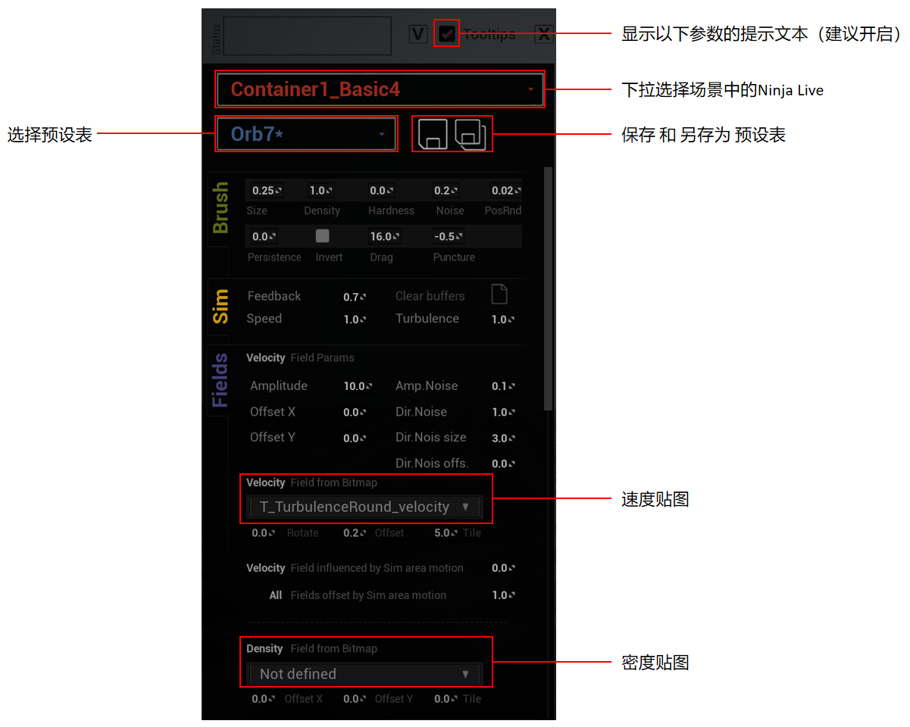

#### 动态材质（Mateiral）

材质的输入配置位于 **NinjaComponent** 的 `Live Generic` 分类下：

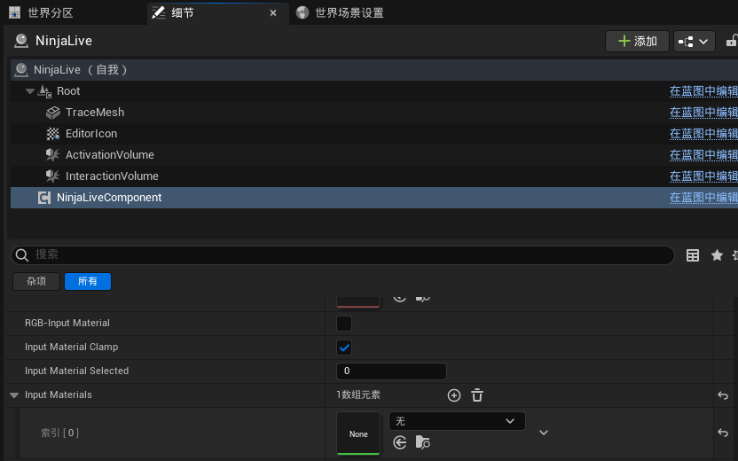

- 可以在 **Input Materials** 参数中添加可用的输入材质。可以多添加，以便可以在 **NinjaLive_PresetManager** 中能够切换预览。
- 调节 **Input Material Selected** 索引选择当前使用的输入材质。
- 勾选 **RGB-Input Material** 会让材质的RG通道作为Velocity纹理，B通道作为Density纹理，否则 **默认只会使用材质的R通道作为Density纹理**
- 勾选 **Input Material Clamp** ，将会裁剪UV坐标位于[0,1]之外的图像。

对于Ninja Fluid的输入材质，需要选择`材质域`为`后期处理`，并关闭`投影光线检测阴影`：

#### 场景摄像机捕获（Scene Capture 2D）

FluidNinja可以使用摄像机来捕获场景，并将相机画面内的图像作为流体模拟的输入，具体的配置位于 **NinjaComponent** 的 `Live Generic` 分类下：

- 可以在 **Input Scene Capture Camera** 选择当前场景已存在的Actor

示例：

- 创建一个 **Ninja Live** ， **Cube** 和 **场景捕获2D（Scene Capture 2D）** ，并将相机对准要捕获的Cube

  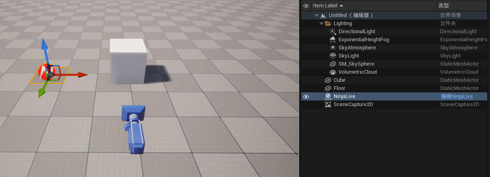

- 在 **Ninja Live** 的 **Ninja Component** 中，配置场景捕获2D，并选择较为直观的材质输出：

  

  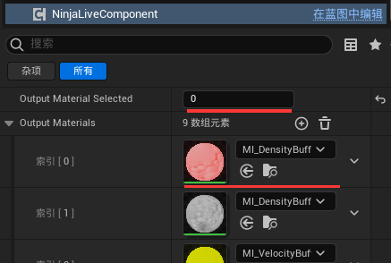

  - 执行PIE，能看到如下效果：

    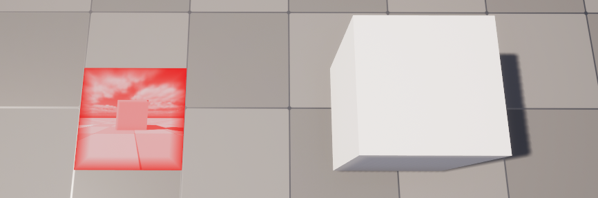

  - 可以在场景捕获2D去调整捕获的配置（相机的参数，对象的筛选...），借助 **NinjaLive_PresetManager** 来调整它的参数效果：

    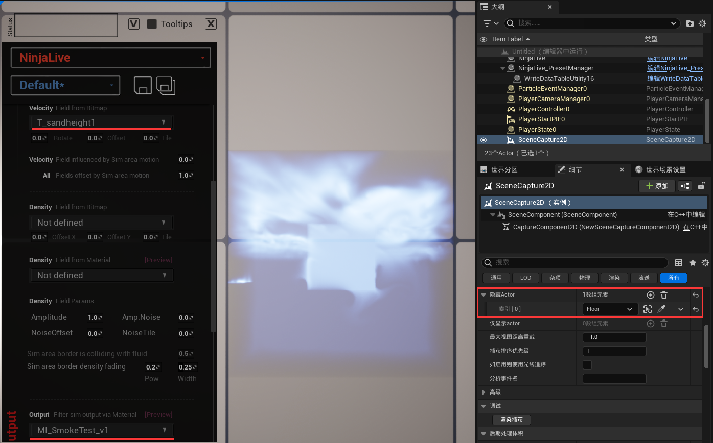

#### 渲染目标（RenderTarget）

材质的输入配置位于 **NinjaComponent** 的 `Live Generic` 分类下：

- 勾选 **Use Render Target as Input** ，将会使用下方的 **Input Render Target** 作为流体模拟的输入
- **Input Render Target** 用于指定读取的 Render Target

在Fluid Ninja中，该方案可以用于制作 **形态可控的3D流体**

Level3中有如下示例：

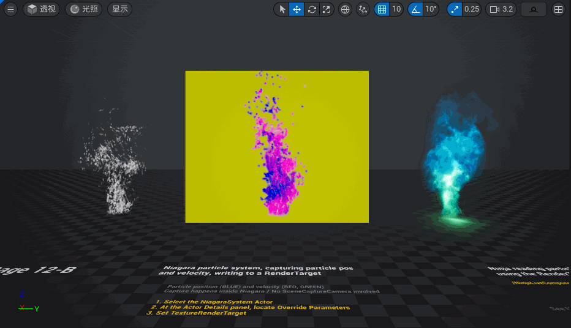

- 左侧是一个Niagara粒子系统，中间是投影的RT，右侧是利用RT+输出材质最终展现出的效果

示例：

- 在内容浏览器新建【Niagara粒子系统】，选择【从现有系统拷贝】

  

- 取消勾选`仅库`，在`标准`分类中找到 **NS_ParticleCaptureBasic** ：

  

- 创建完成之后打开粒子系统，可以发现它包含两个默认发射器：

  - **NE_ParticleCaptureBasic** ：用于将Empty发射器的粒子，通过网格坐标映射到RenderTarget上，可在AttributeReader中选择捕获哪个发射器。
  - **Empty** ：用于模拟的粒子发射器

  

- 下面给了它一个发射速度（60），并增加了一个四散的随机初速度，可以看到如下效果：

  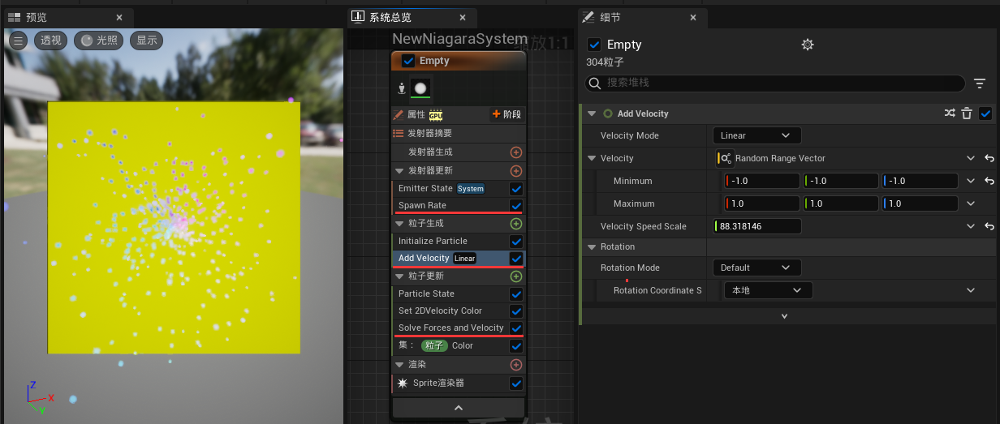

- **NE_ParticleCaptureBasic** 会利用捕获的粒子数据，根据所有粒子的坐标 **“投影”** 到一张RenderTarget上，我们可以在用户参数上设置这个投影过程的策略：

  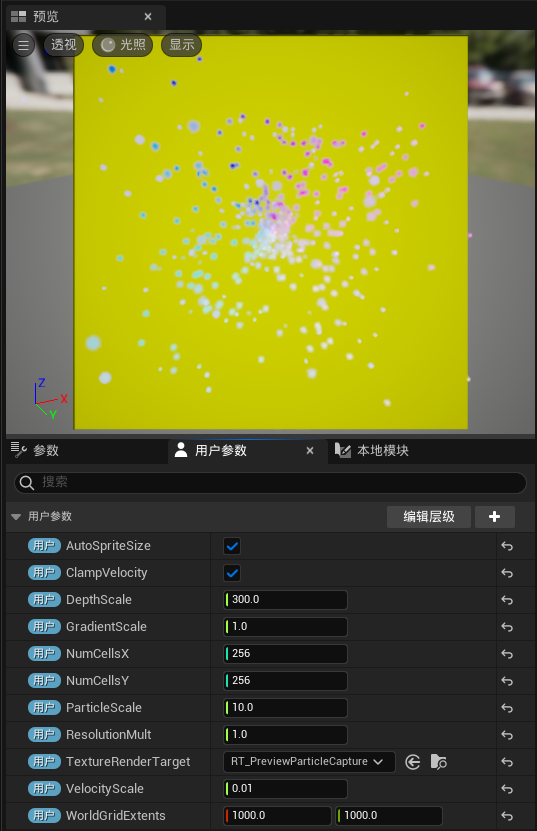

- 用户参数中，默认使用`RT_PrevivewParticleCapture`作为RT输出，它可能被其他粒子系统共用，直接用它会与其他逻辑（教程关卡）冲突，所以我们需要自己创建一张RT：

  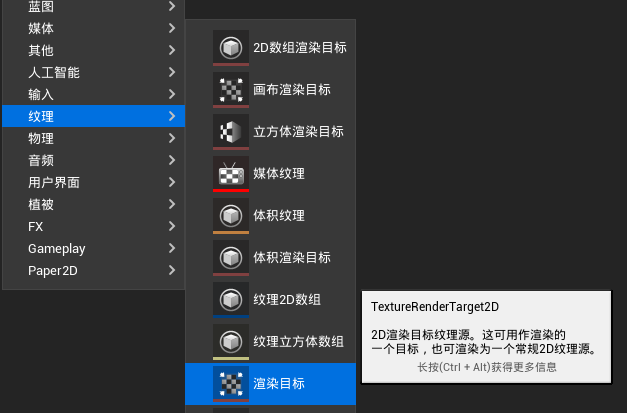

- 并在NiagaraSystem的默认参数中指定它，尝试调整用户参数来理解RT的映射规则：

  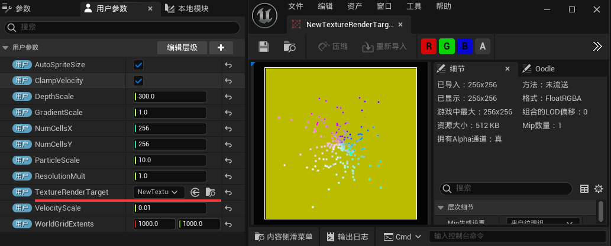

- 将配置好的NiagaraSystem拖拽放入场景中，并场景中浮空放置一个 NinjaLiveActor ，在 NinjaLive的细节面板中设置`TraceMeshSize`为（5，5，1），在NinjaLiveComponent的细节并开启`追踪网格面向相机（Camera Facing Trace Mesh）`，开启RT输入，并指定刚刚创建的RT，选择输出材质为 `MI_DensityBuffer_Red`：

  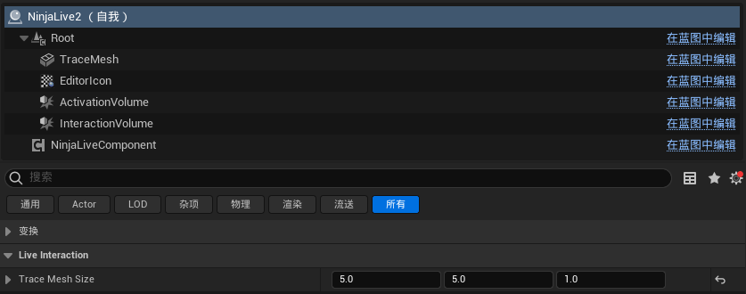

  

- 启动PIE，我们能看到如下效果：

  

- 实际上，我们并不需要对NiagaraSystem进行渲染，我们只需要它的模拟数据， **NS_ParticleCaptureBasic** 默认开启只是为了方便调试，所以我们可以关闭粒子发射器的渲染器：

  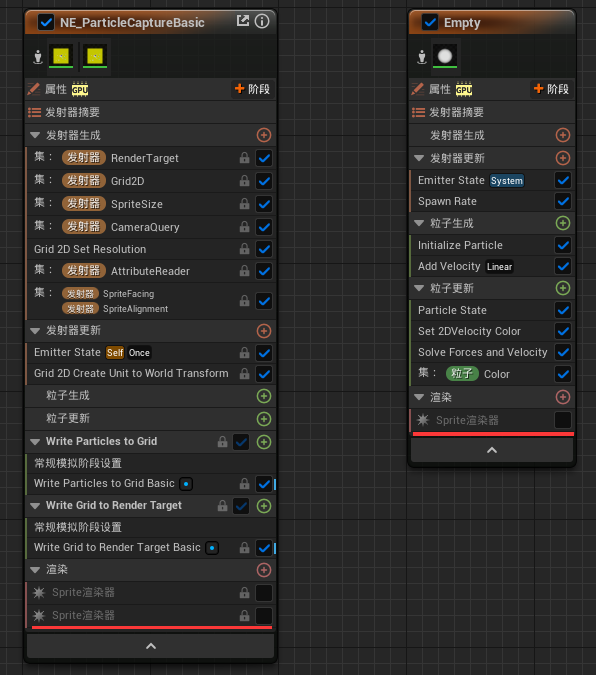

- 此外，由于RT的渲染也是依赖相机位置，所以为了获得更准确的平面图像，需要将 **NiagaraSystem** 和 **NinjaLive** 的位置重叠，选择一个合适的输出材质效果，就能看到：

  

#### 视频输入

使用视频文件作为NinjaFluid的输入，需要指定以下三个参数：

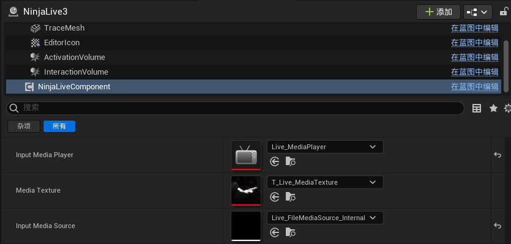

- **Input Media Player** ：视频播放器
- **Media Texture** ：视频绘制所使用的纹理
- **Input Media Source** ：视频播放源

关于UE如何播放视频，可参阅文章 https://zhuanlan.zhihu.com/p/135963353

示例：

- 添加一个NinjaLiveActor，指定视频作为Density输入，再设置一个向上的Velocity贴图`T_Crumple`，结合输出材质`MI_Candle1`，能得到这样的效果：

#### 用户输入

NinjaLiveActor默认开启了鼠标输入，它的效果如下：

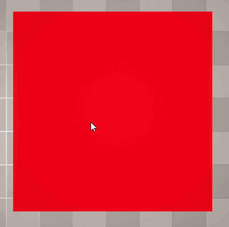

可以在此处进行关闭：

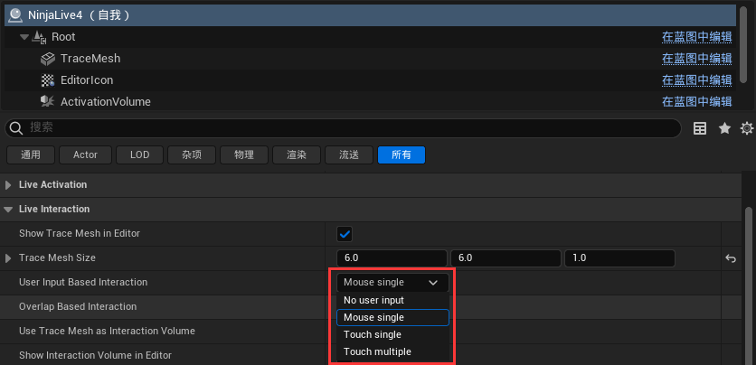

#### 碰撞交互

Fluid Ninja可以通过物理碰撞来作为输入，来完成一些可交互的流体效果，一个简单的示例如下：

- 添加一个NinjaLiveActor

  - 设置`Trace Mesh Size`和`Interaction Volume Size`为`(5,5,1)`
  - 设置NinjaLiveComponent\Live Bursh Settings，否则会因为碰撞画笔太小导致看不到结果
    - 勾选`Brush Scaled By Interacting Obj Size`
    - 设置`Primitive Obj Brush Scale` 为 20

- 添加一个小白人，能看到如下效果：

  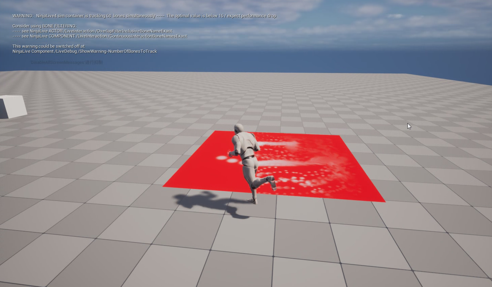

该效果是通过UE的物理碰撞机制实现的，其完整的参数均位于 `NinjaLiveComponent\Live Interaction` 中：

- **Continuous Interaction with Owner Actor** ：与持有该组件的Actor持续交互
- **Continuous Interaction incluisve Obj Type** ：过滤交互的碰撞对象类型
- **Continuous Interaction Component Name** ：过滤交互的组件名
- **Continuous Interaction Bone Names Exact** ：过滤交互的骨骼名
- **Single Target Mode** ：单一目标模式，开启之后FluidNinja认为碰撞产生的图像都是由一个目标生成的，这可以使碰撞路径变得平滑，没有断层（插值）
- **Single Target Type**
- **Single Target Mode Skeletal Mesh Index**
- **Single Target Move Set Sim Speed**
- **Speed Influence Factor** ：速度影响因子
- **Clamp Max Velocity** ：截断最大速度
- **Camera Facing Tace Mesh** ：TraceMesh始终面向相机
-  **Camera Facing Lock Y-Axis** ：锁定摄像机的Y轴
- **Use Legacy Camera Facing**
- **Trance Mesh Translucent Sort Prio**
- **Use Custom Trace Source** ：使用自定义追踪资源，开启之后相当于使用下面的位置作为摄像机位置来进行碰撞检测
- **Custom Trace Source Position** ：自动追踪资源的位置
- **Trace Mesh Moving in World Space** ：TraceMesh位于世界空间
- **Movement Not Quantized to Steps OnAxis**
- **Movements is Locked on This axis** ：锁定某个轴的移动
- **Force Trace Mesh to Custom Vertical Pos**
- **Force Trace Mesh Vertical Position** ：锁定TraceMesh的位置
- **Enable Paint Buffer Offset in World Spacing** ：开启绘制缓存区的世界空间机制
- **Simple Painter Mode** ：单纯的绘制模式，没有碰撞输入

对于 **NinjaLiveActor** ，对上述参数做了进一步封装，有如下参数可以调整：

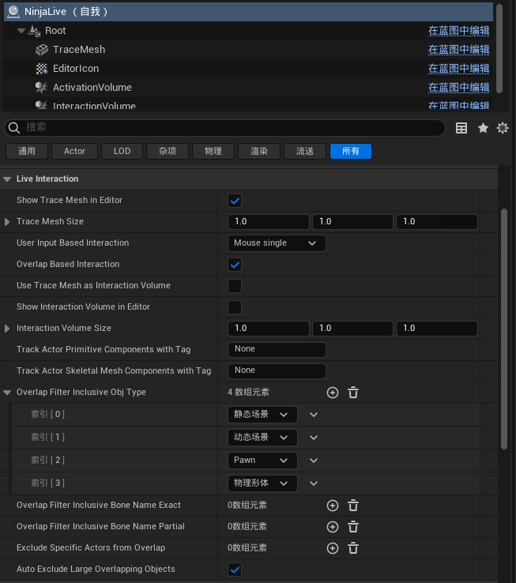

- **Overlap Based Interaction** ：开启碰撞交互

- **Interaction Volume Size** ：交互体积大小

- 以下参数用于 **筛选** 哪些物体可以于交互体积发生“作用”。
  - **Track Actor Primitive Components With Tag** ：追踪带有该标签的组件

  - **Track Actor Skeletal Mesh Components With Tag** ：追踪带有该标签的骨骼网格体组件

  - **Overlap Filter Inclusive Obj Tab** ：需要包含的对象碰撞类型

  - **Overlap Filter Inclusive Bone Name Exact** ：需要包含的骨骼名称，如果为空，则会处理全部骨骼

  - **Overlap Filter Inclusive Bone Name  Partial** ：需要包含的骨骼名称字段，例如填入Foot，则所有名称包含Foot的骨骼都将被包含

  - **Exclude Specific Actors from Overlap** ：需要排除的Actor类型

  - **Auto Exclude Large Overlapping Objects** ：自动排除大型的覆盖对象

### 调节画刷

画刷用于控制FluidNinja输入贴图作用区域的缩放因子，其参数配置如下：

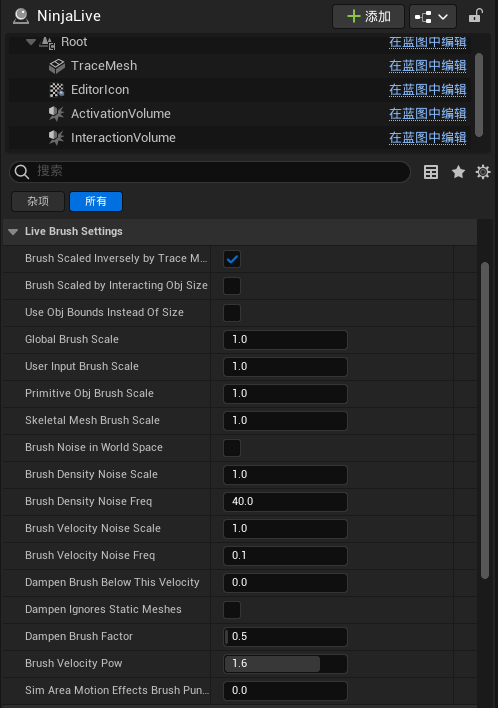

一些关键参数：

- **Brush Scaled Inversely by Trace Mesh Size** ：画刷会随跟踪网格的大小进行缩放
- **Brush Scaled by Interacting Obj Size** ：画刷会随交互对象的大小进行缩放
- **Use Obj Bounds Instead of Size** ：使用交互对象的边界作为画刷尺寸
- **Global Brush Scale** ：全局画刷缩放系数

> 如果碰撞交互的效果几乎不可见，很有可能是画刷太小导致的

### 预设配置

预设表包含了流体模拟相关的参数：

在 **NinjaLive_PresetManager** 阅读参数的提示信息，通过调整来理解它跟效果的关联关系，配完参数后另存为新表。

### 输出材质

FluidNinjaLive内容目录下定义了其使用的核心材质：

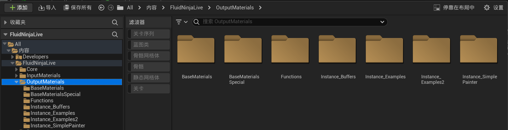

我们可以直接使用`Instance_*`文件夹下的材质实例

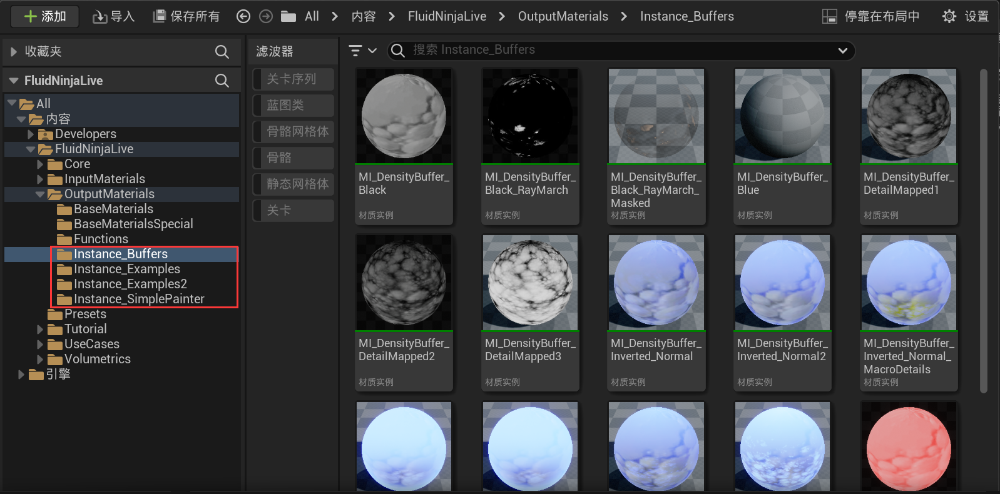

亦或是新建材质实例，设置父项为FluidNinja提供的基础材质（材质文件名称以`M_NinjaOutput_`开头）：

- **M_NinjaOutput_Basic** ：基础材质
- **M_NinjaOutput_Advanced** ：高级材质
- **M_NinjaOutput_TranslucentReflective** ：透明反射材质
- **M_NinjaOutput_WorldSpaceGeneric** ：世界空间材质
- ...

以M_NinjaOutput_Basic为例，它提供了很多可供调整的参数预设：

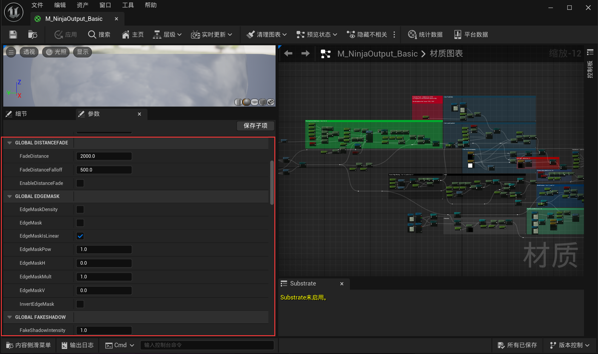

在FluidNinja的Tutorial和Usercase关卡中，有很多可供参考的材质示例，具体的参数意义，可通过复刻进行学习。

## 总结

FluidNinja的思路很巧妙，使用起来有些繁琐，但关键的步骤很清晰：

- 构造模拟过程所需的Density（密度）贴图和Velocity（速度）贴图，使用恰当的画刷和预设并结合对应的材质来呈现出最终想要的效果。

### 优缺点

- FluidNinja通过二维面片来伪装出三维视觉的效果，它的性能损耗远低于常规的粒子流体模拟，但想要伪装出足够真实的三维效果，就要有足够真实的二维输入，否则的话，在某些视角上可以轻易识破FluidNinja的追踪网格面片。
- FluidNinja提供了很多的方式构建流体的输入：贴图，材质，RT，Niagara，相机...，可以满足绝大部分的开发需求，但细节很多，使用起来并不容易，想要随心所欲的制作出想要的效果还需要深入的学习。
- FluidNinja并不能完全代替粒子，它更适用于 **可交互的**  流体模拟，比如烟雾，火焰，水体...
