# 开放场景

- https://www.youtube.com/watch?v=Ur53sJdS8rQ

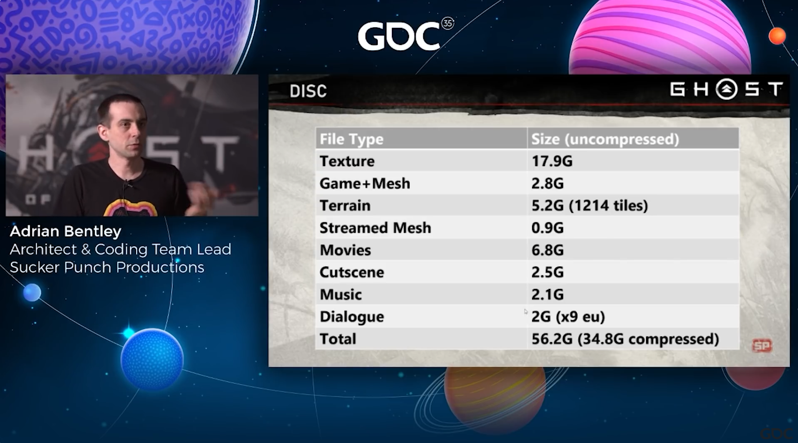

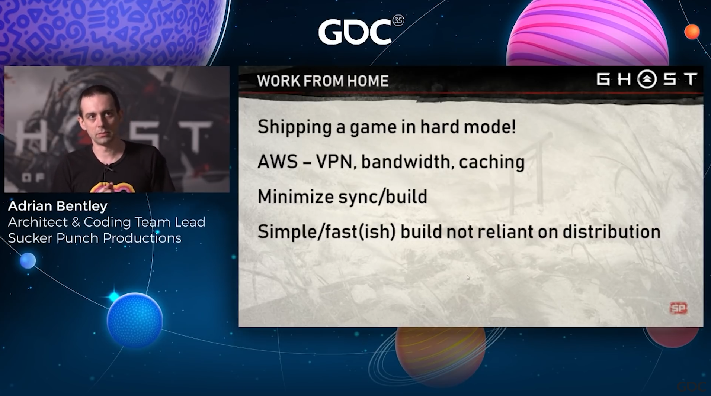

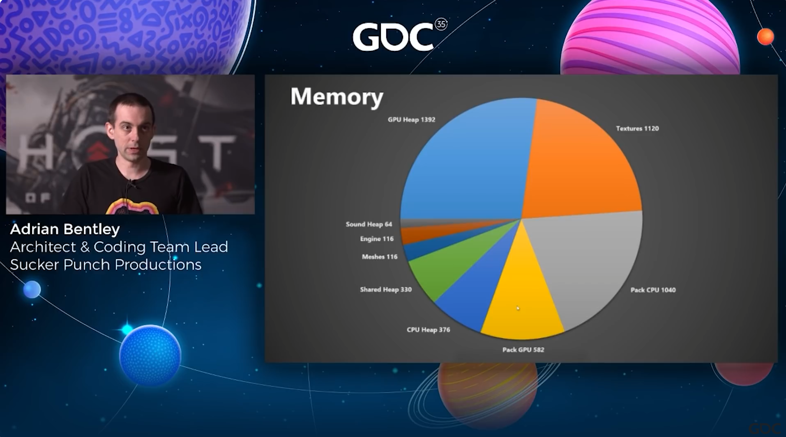

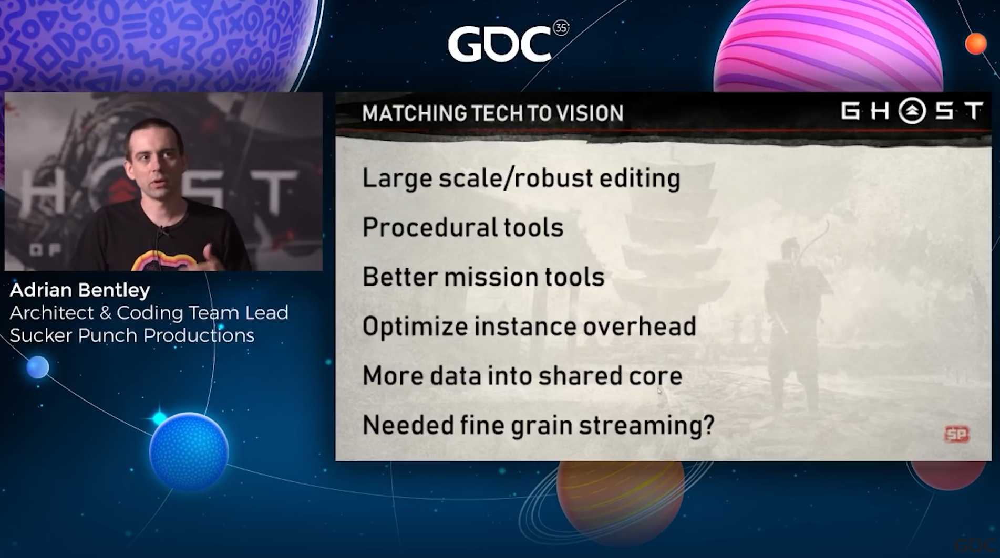

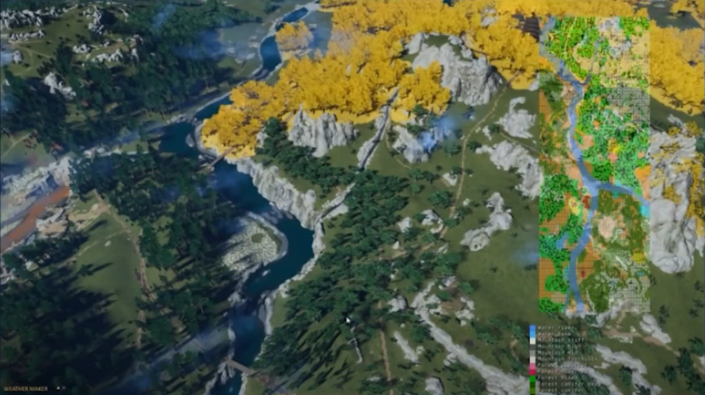

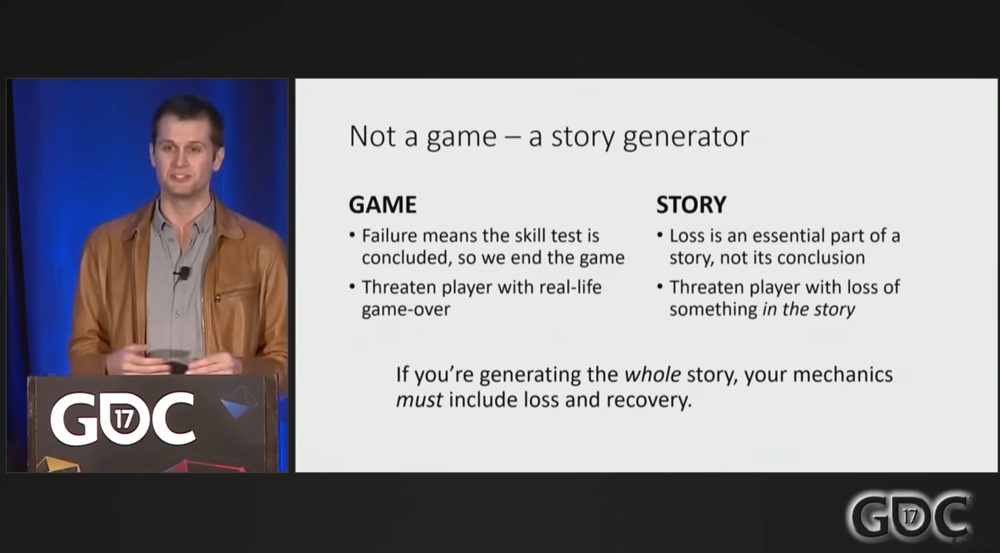

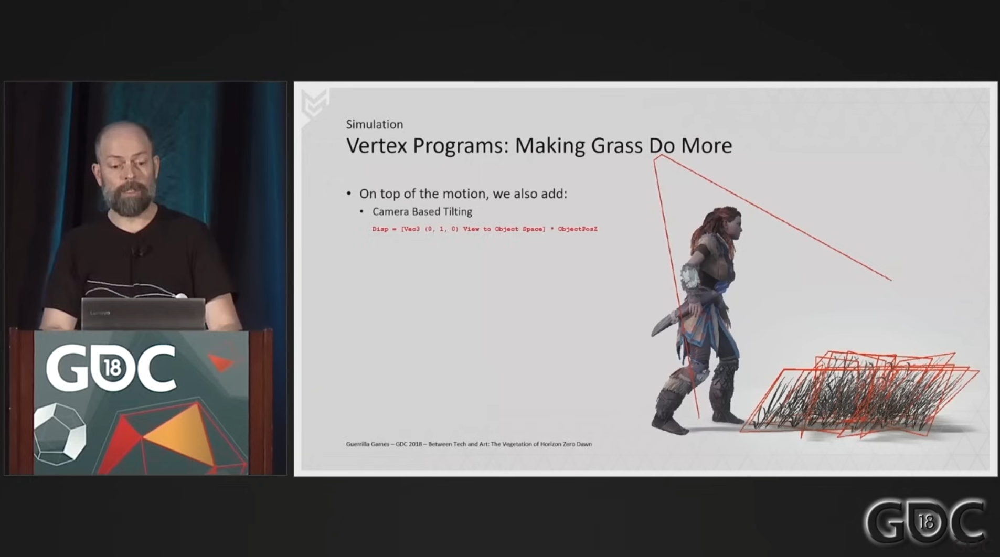

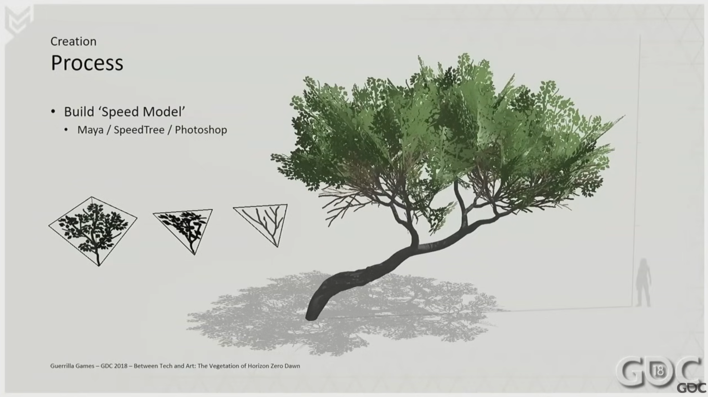

- 开放世界质量验收：
    - https://www.youtube.com/watch?v=2VDlX3Dqm0w
    - https://www.youtube.com/watch?v=VdqhHKjepiE
- 项目管理：
    - https://www.youtube.com/watch?v=M0uuDsjy4b0
    - https://www.youtube.com/watch?v=8m859pxcyLY
- 孤岛惊魂团队工作流：https://www.youtube.com/watch?v=HEaJfXVspPc

https://www.youtube.com/watch?v=2VDlX3Dqm0w

## 场景元素

### 天空大气

### 云

### 光影

### 地形

### 模型

- [认识游戏场景制作：游戏场景的作用及制作流程-网易游学-为热爱赋能 (163.com)](https://game.academy.163.com/course/careerArticle?course=495&isMaster=0)

    

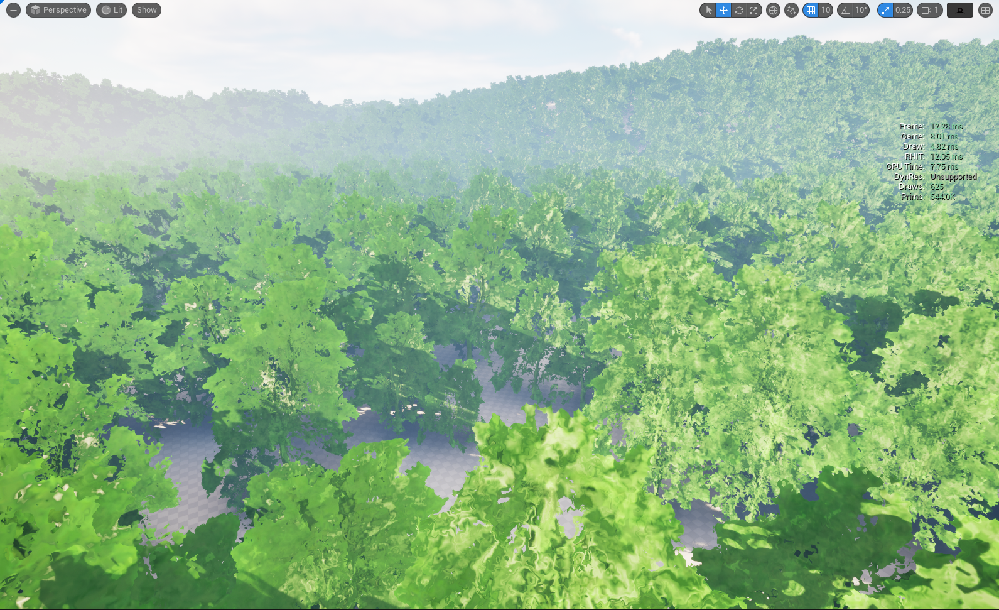

### 植物

## 流送管理

## 动态效果

### 昼夜变换

### 四季变换

### 特效

### 风

### 水

### 火

### 雨

### 雪

### 雾

### 尘

### 电

### 光

[游戏场景美术构成要素 - 哔哩哔哩 (bilibili.com)](https://www.bilibili.com/read/cv12101296/)

## 场景交互

### 水体交互

### 植被交互

[植被的动态交互---草 - 知乎 (zhihu.com)](https://zhuanlan.zhihu.com/p/151342889)

### 地面交互

### 物品交互

#### 破碎

#### 布料

## 场景管理

## 工程管理

## 项目管理

动态环境

- 孤岛惊魂天气：https://www.youtube.com/watch?v=mGHCOOnI5aE
- 孤岛惊魂程序生成：https://www.youtube.com/watch?v=JBp8zvLVsgg

- https://www.youtube.com/watch?v=JBp8zvLVsgg

- https://www.youtube.com/watch?v=wavnKZNSYqU&t=2412s
- https://www.youtube.com/watch?v=gJKGMFcg29c&t=2211s
- https://www.youtube.com/watch?v=WMObgeULNTI
- https://www.youtube.com/watch?v=Ibe1JBF5i5Y
- 巫师3场景搭建：https://www.youtube.com/watch?v=p8CMYD_5gE8

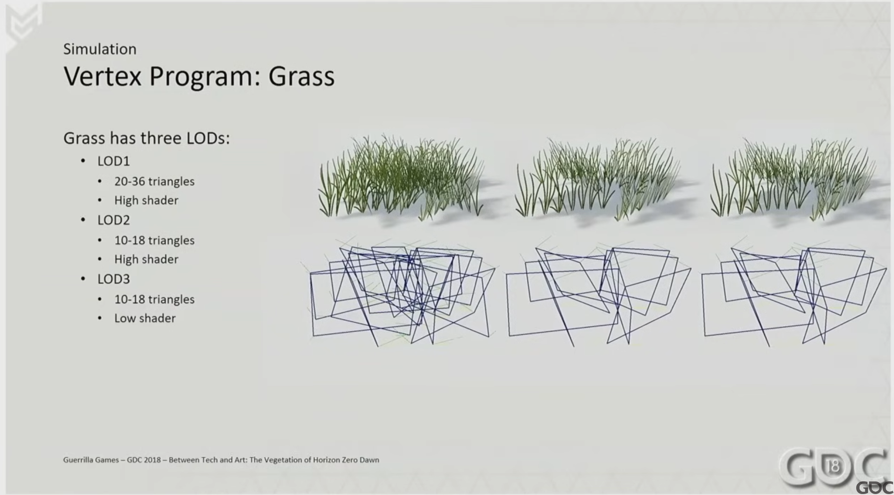

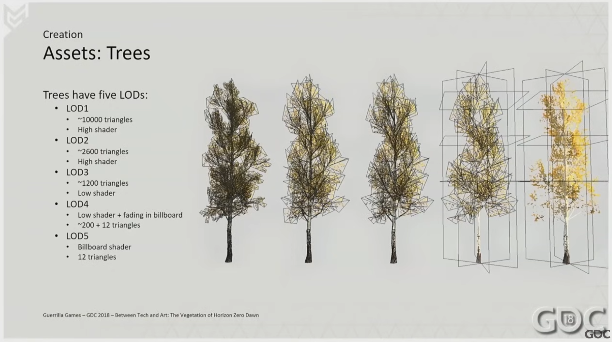

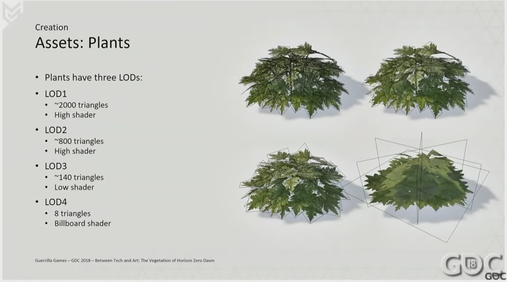

- [优化UE5：重新思考高质量视觉效果的性能范式 - 第1部分：Nanite和Lumen |虚幻音乐节 2023 |Epic开发者社区 (epicgames.com)](https://dev.epicgames.com/community/learning/talks-and-demos/Vpv2/unreal-engine-optimizing-ue5-rethinking-performance-paradigms-for-high-quality-visuals-part-1-nanite-and-lumen-unreal-fest-2023)
- [Optimizing UE5: Rethinking Performance Paradigms for High-Quality Visuals - Pt 2: Supporting Systems | Unreal Fest 2023 | Epic Developer Community (epicgames.com)](https://dev.epicgames.com/community/learning/talks-and-demos/VlO2/unreal-engine-optimizing-ue5-rethinking-performance-paradigms-for-high-quality-visuals-pt-2-supporting-systems-unreal-fest-2023)
- [Vegetation Best Practices for UE5 | Epic Developer Community (epicgames.com)](https://dev.epicgames.com/community/learning/talks-and-demos/2lyj/unreal-engine-vegetation-best-practices-for-ue5)
- [Nanite Virtualized Geometry in Unreal Engine | Unreal Engine 5.4 Documentation | Epic Developer Community (epicgames.com)](https://dev.epicgames.com/documentation/en-us/unreal-engine/nanite-virtualized-geometry-in-unreal-engine)
- [Lumen Global Illumination and Reflections in Unreal Engine | Unreal Engine 5.4 Documentation | Epic Developer Community (epicgames.com)](https://dev.epicgames.com/documentation/en-us/unreal-engine/lumen-global-illumination-and-reflections-in-unreal-engine)

- [离原春草 - 简书 (jianshu.com)](https://www.jianshu.com/u/e2b54829dd21)

- [世界构建指南 (qq.com)](https://mp.weixin.qq.com/s/sbsDIN6dUtq5CGhqRBR5oQ)
