# 开放世界中的植被优化技术

相信大家在一些大型游戏中，或多或少目睹过一些美轮美奂的自然风光，不得不惊叹这些游戏所展现出的艺术效果：

> 《对马岛之魂》

> 《地平线2西之绝境》

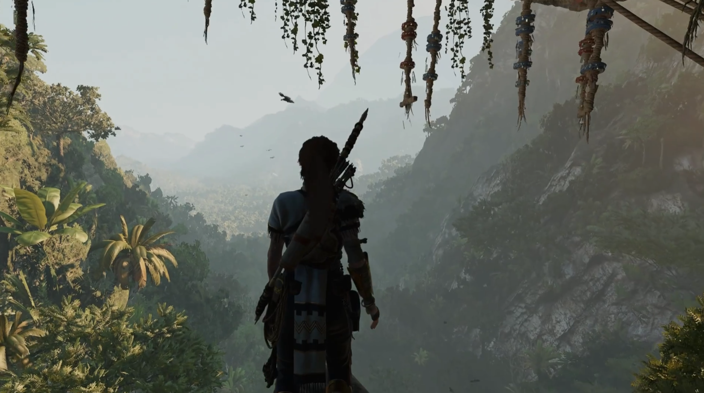

> 《古墓丽影：暗影》

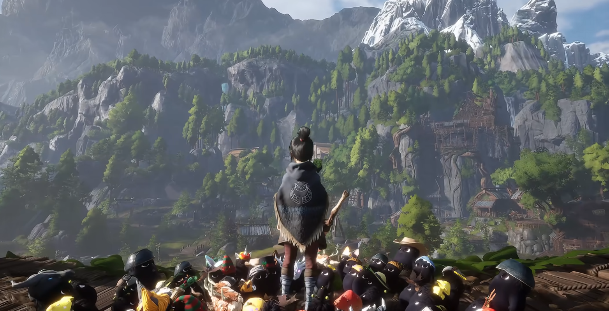

> 《柯娜精神之桥》

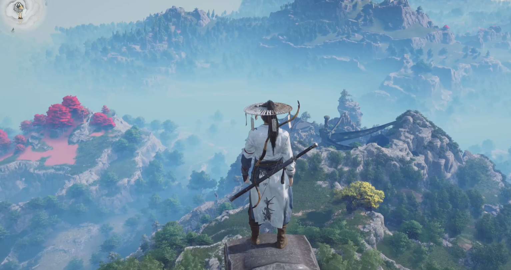

> 《燕云十六声》

>  《刺客信条：奥德赛》

而这些游戏，都不是UE做的...

需要承认的是，尽管 Unreal Engine 5 非常强大，但并非无所不能，想要搭建出像上面那样能够满足游戏项目性能要求的自然场景，我们还将会面临许多除引擎技术之外的挑战.

在开放的自然场景中，植被产生性能问题的频率以及所造成的影响往往不亚于光影和特效。

在UE5中，如果谈到植被优化，大家的第一反应想到的可能是减面，实例化，距离裁剪，优化材质，使用LOD或者Nanite...

这些资产级别的调优和复杂的特化手段，往往很难支撑起开放场景中茂盛的植被生态。

因此，本文会阐述一些关于植被优化的策略和观点。

## 植物资产制作

大多数的三维建模软件都能制作植物资产，但在游戏行业中， **[Speed Tree](https://store.speedtree.com/)**  是主流的植被制作工具。

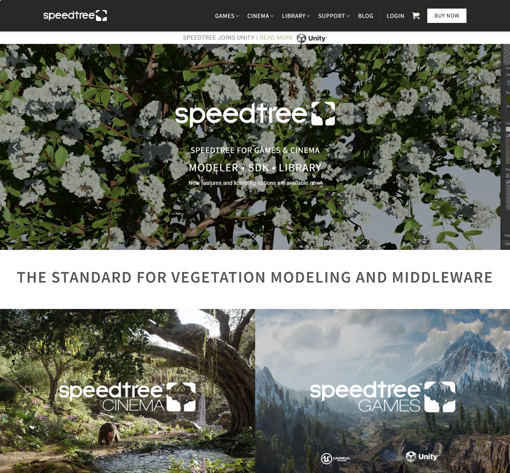

与岩石，物品，建筑等常见模型不同的是，植物往往具有非常多的茎和叶，在几何层面，意味着植物的模型通常拥有大量密集的顶点和面片，这会带来非常高额的渲染开销，这里有一个示例：

- 这样一棵并不是那么茂密的树，却具有高达两百万的三角形，这庞大的顶点数据量和大量的重复绘制够GPU好好喝一壶了。

这种使用模型的几何来表示植物结构的做法我们一般称为 **模型树/草** ，通常这种规格的资产是无法大量用于游戏项目的。

而现有的游戏项目中更多的是使用 **插片/遮罩** 的方式来制作植物资产，通过将一部分的枝叶压到一张纹理面片上，通过在树枝上大量插片来展现出枝繁叶茂的景象，这是一种非常取巧的制作方式，虽然在效果上存在一些瑕疵，但它带来的性能收益是非常客观的。

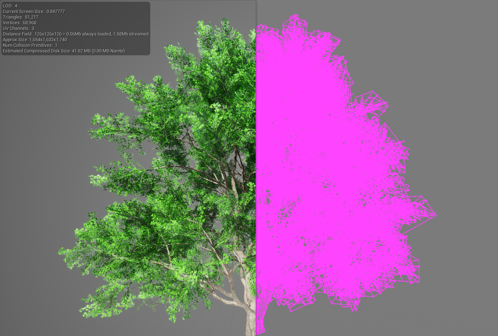

插片的方式曾一直是游戏行业公认的植被渲染最高效的方式，但它也存在一些缺陷：

- 存在视觉缺陷，近镜头容易穿帮。
- 使用遮罩材质，虽然顶点数量有所减少，但依旧存在大量的OverDraw，且阴影的绘制消耗更高。
- 植物模型缺少枝叶的顶点特征，全局光照效果有所损失。

随着 UE5 虚拟几何体技术 - Nanite 的出现，让这一局势发生了一些变化。

Nanite的优势在于使用GPU驱动的管线，可以快速切换几何的细节，并及时剔除不可见的三角形，在尽可能不影响视觉效果的前提下，极大程度地提高顶点利用率（占屏比）。

> 前文所用的模型树，图片只有一百万的像素，但顶点却有两百万，很显然大部分顶点对画面效果的贡献并不高。

关于Nanite，这里有一个很好的官方使用指南：

- [文档 | Nanite虚拟几何体 (epicgames.com)](https://dev.epicgames.com/documentation/zh-cn/unreal-engine/nanite-virtualized-geometry-in-unreal-engine)
- [[官方培训]23-为UE创建美术资产 | Epic 李文磊](https://www.bilibili.com/video/BV18X4y1k7R1/)

对于Nanite植被，官方也做了更细致的对比：

- [Vegetation Best Practices for UE5 | Epic Developer Community (epicgames.com)](https://dev.epicgames.com/community/learning/talks-and-demos/2lyj/unreal-engine-vegetation-best-practices-for-ue5)

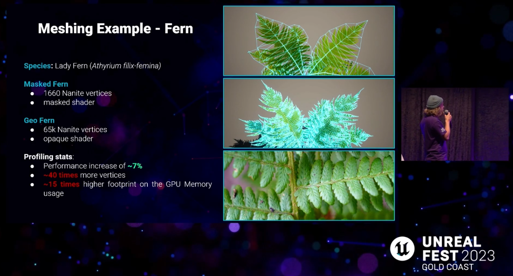

在官方的测试报告中，在同样开启Nanite的前提下，展现出了与传统渲染方式截然不同的结果 —— 使用模型树的性能更优于插片树。

根据这一分析结果，是否意味着我们可以借助Nanite采用模型树的方式来更高效的渲染植被？

答案是否定的。

> 一条有效论据是：前文列出的那些游戏的截图画面，它们并没有使用像Nanite这样的虚拟几何体技术，但也搭建出了惊艳的自然生态风光，反观...

### Nanite  之殇

否定的原因并非是在意顶点数据量和显存占用，因为植被在场景中，通常以实例化的方式进行绘制，尤其是开放世界场景中，我们非常在意分块之间性能的负载均衡，虽然采用Nanite的 **单个** 模型树 可能确实具有更好的性能表现，但这也会阻碍我们搭建出性能优越的统一植被策略。

下面会分几个方面来阐述一下使用Nanite存在的问题，观点可能有些主观，有不对的地方，烦请大佬帮忙指正~

- 更高的效果预期伴随着更难把控的性能平衡
- 并非性能最优的模型优化方式
- 固定精度梯度的静态数据更容易组织出性能优越的密集植被

#### 更高的效果预期伴随着更难把控的性能平衡

UE5 发布演示的时候，相信很多小伙伴都被演示所展现出的画面效果所震撼，当时很多人可能都在想，或许我们即将迎来下一个世代的游戏画面：

不管你们信不信，反正我是信了（狗头），我所了解到的很多团队，也都信了。

信了的人，这几年作为官方小白鼠，可以说是吃了不少苦头，这对一个商业项目来说，更是有着不容小觑的影响。

但吐槽归吐槽，Nanite确实是一项突破性的技术，相比传统的LOD有着绝对的优势，随着这几年官方的优化迭代，其可靠性也逐渐提升。

目前它的的确确可以被广泛应用于实际的游戏项目中，但Nanite所带来的问题，通常不在于其自身。

：我都用Nanite了，做个百万三角形的小石头不过分吧，反正会自动减面。

：你这么点顶点也叫树？细节都没了，这也好意思跟人说自己用的UE5，看不起谁呢？

这种情况通常会出现在使用UE的新兴团队当中，而实际上，UE的爆火距离现在也并不久远，使用UE的团队大多也没有深厚的引擎技术积累（国内更甚），对于这种新兴的技术，这样的团队会容易盲从一些营销上的话术，从而弱化甚至忽视内容制作管线上的迭代和积累。

正因为有了Nanite的加持，往往导致投资人和开发团队会对游戏画面有着更高的要求，在优化层面来看，虽然Nanite可以提高顶点的利用率，但如果使用了细节更多的源资产，将意味着更大的磁盘占用，整个场景画面也会有着相比以往更多更密集的顶点。

其中顶点的数量将严重影响到一些渲染阶段的性能消耗：

- Shadow Map 的构建
- 速度缓冲区的绘制

而磁盘占用不仅会影响到最终的包体大小，更重要的是会大幅增加项目场景管理的难度。

以对马岛之魂为例，大家可能觉得它的地图并没有特别大（28.62 km2），模型种类少，精度也不高，但它的包体却有50+GB，更加令人恐慌的是，它的开发时资产大小：

笔者非常建议去看一下这场GDC，对大型项目的资产管理有一个概念：

- [Zen of Streaming: Building and Loading 'Ghost of Tsushima' (youtube.com)](https://www.youtube.com/watch?v=Ur53sJdS8rQ&t=794s)

试想一下，我们如果用UE的Nanite去复刻对马岛之魂那样的场景，保守一些，我们把资产精度提升个四五倍，可以预想到这么庞大的项目资产所带来的管理成本会有多高。

因此，如果是游戏项目，笔者还是建议请尽可能管理好对场景美术效果的预期，它不应该影响甚至拖累游戏性的迭代。

> 如果游戏场景在开发机上都不能够稳定运行80帧，并且严重侵占玩法或其他模块的性能预算和迭代空间，就是搭得再好看，缺乏游戏性，那又有什么用呢？
> 笔者相信绝大部分玩家都不会因为一个游戏仅仅拥有照片级的写实画面就傻傻的买单。

#### 并非性能最优的模型优化方式

通常优化模型的手段有两种：

- **减面（Reduce）** ：在源模型的几何数据上进行删减从而得到简化的模型。
- **重构（Remesh）** ：通过体素化的模型算法，以一定体素精度来逼近源模型从而得到简化的模型。

> Nanite 使用的是减面的算法

这两种策略有着不同的适用场景：

- 减面：适用于面片，它通常用于对几何棱角追求比较高的模型，如地形，建筑，植物，水体面片...
- 重构：适合模型闭合，几何形体比较圆润的模型，它通常能以极少的顶点来保证源模型的几何形态，如石头，建筑，道具...

对于树而言，假如我们采用这两种策略来生成相同三角形数量的简模：

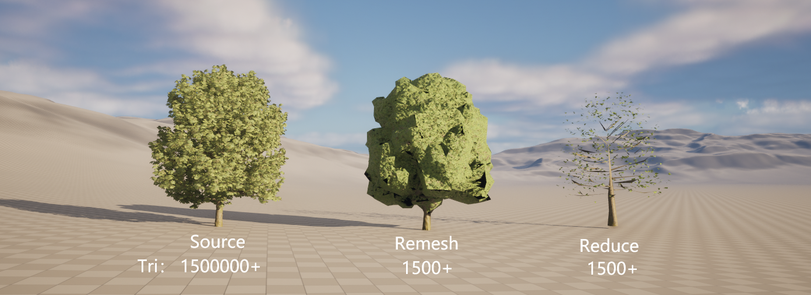

这两种策略都存在各自的问题：

- 重构：模型变得蓬松，UV映射异常的地方出现黑块。（实际上要生成效果良好的重构模型，体素算法的参数得做很多微调和特化）
- 减面：丢失大量树叶细节。

在这方面，笔者做过很多尝试，可以明确的说，通过自动化的模型处理算法，很难得到一个效果优良的植物LOD。

植被优化为什么这么难，就是因为很多时候大家在引擎里面把它视为一种常规模型在渲染机制上来进行优化，但真正要做好游戏中的植被，最关键的部分还是制作上的技巧。

人工制作LOD，美术同学可以以较少的主枝干尽可能营造出更大的覆盖范围，用副枝干去增添主枝干的局部细节，制作低级别的LOD时，只需要剪除一定数量的副枝干。

也可以通过调整顶定色，来区分主枝干和副枝干，最终通过基于植物顶点色权重的减面方式。

> 通常情况下会对树木刷顶点色作为植物风力计算时顶点偏移幅度的权重，可以根这一权重因子，也来作为区域简化幅度的权重。

这种方式可以用来生成植物模型的几个较高精度的LOD，但可惜的是，这样生成的简模往往仍然具有较高的顶点数量（上面简化到1500+个顶点的时候，模型已经面目全非了），想要让顶点数量进一步大幅减少（不能剪除主枝，否则会有很大的视觉瑕疵），但却要保证模型的表现效果，很显然，使用简化的方式是做不到的，我们必须得打破原有模型的几何结构，而 Remesh 的方式，往往会让一棵树变得非常蓬松，并且有UV映射异常的问题，它的表现效果并不好，那有没有其他手段能解决这个问题呢？

答案是有的，我们最终的目的是保证模型的显示效果，而非几何结构，这也引申出了模型优化的另一种策略 —— **替身（Impostor）** 。

> 替身 是笔者自己瞎翻译的，译作 代理 容易跟 Proxy 混淆， 译作 冒名顶替者 又不太好听。

我们一般会用替身去作为植被模型的最后一级LOD，比较常见的替身策略有以下几种：

- **公告牌（Billboard）** ：将某个特定角度的模型绘制到纹理上。
- **翻页牌（Flipbook）** ：将多个角度的模型绘制到纹理上，最后在材质上根据玩家视角来切换显示的纹理。
- **卡片簇（Billboard Cloud/ Mesh Card Cloud）：** 将模型绘制在许多的网格插片上，从而来堆叠出源模型相似的视角效果。
- **八面体（Octahedron）** ：将一定视角分布的模型绘制到纹理上，最后在材质上插值多个角度的图像来呈现出可靠的视角过渡效果。

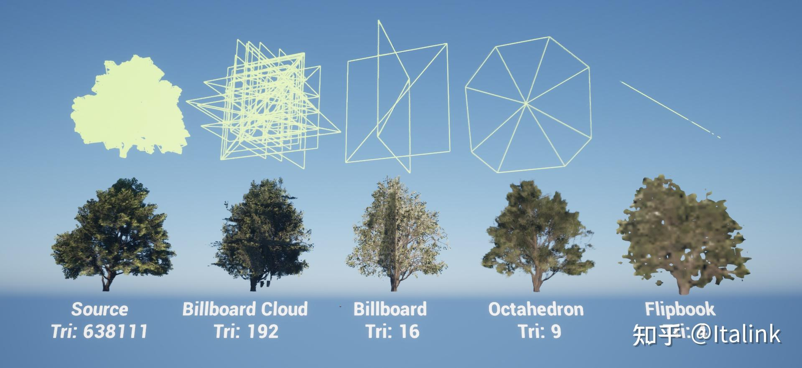

- [游戏场景植被优化 —— Impostor - Italink的视频 - 知乎](https://www.zhihu.com/zvideo/1790733617217019905)

这些替身策略的实现原理并不复杂，清楚它们的原理之后我们也能轻易搭建出一条替身生成管线，不过有一些专门的SDK可以供我们使用：

- [Simplygon - 树立 3D 游戏内容优化标准](https://www.simplygon.com/)
- [InstaLOD - 生产和自动优化3D内容所需的一切](https://instalod.com/zh/)

笔者测试时使用的是 InstaLOD（个人使用免费），这是它提供的UE插件，里面包含了诸多的模型处理算法：

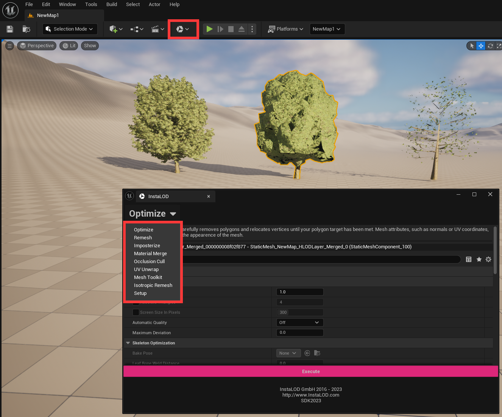

对于 **八面体（Octahedron）** ，UE提供了专门的插件：

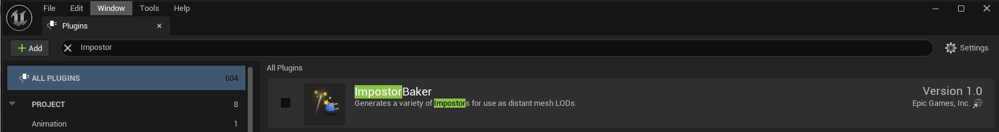

关于其使用方式，可以查看这篇文字：

- [【性能优化】impostor在虚幻中使用（植被优化） - 知乎 (zhihu.com)](https://zhuanlan.zhihu.com/p/693799380)

> 这对一个实际项目来说最有价值的并非是编辑器，而是里面的模型处理相关的代码接口有助于项目团队搭建出符合自身项目规格的模型生成管线。

这么多的替身策略，有小伙伴可能就会问了， 谁的性能效果更好呢？

Billboard 和 Flipbook 有非常少的顶点，较小的贴图尺寸以及简单的着色器程序，它们的性能效果无疑是最好的，但它们的表现效果往往不佳。

比较有争议的主要是 卡片簇 和 八面体 的方式，在之前的很多3A项目中，所采用的基本都是卡片簇的方式，而笔者在 UE 论坛中发现，其实很多人更推荐使用八面体。

笔者这里做了一个简单的对比测试，具体谁优谁劣可能需要更多的数据支撑：

**源模型**

- 三角形数量：639639
- 贴图尺寸：4096
- GPU耗时： 15.52ms

 **卡片簇**

- 三角形数量： 32
- 贴图尺寸：2048
- GPU耗时：10.81ms

**八面体**

- 三角形数量： 32
- 贴图尺寸：2048
- GPU耗时：7.75ms

可以明显看出八面体的性能和画面表现更优于卡片簇的方式，但如果只是作为最后一级LOD的话，卡片簇的纹理尺寸还有很大的优化空间，具体采用什么方案可能就要仁者见仁智者见智了。

 假如采用的是八面体，我们可以在不影响树木效果的前提下，制作出这样的 LOD链：

这样的精度梯度，再结合实例化，它的性能消耗可以做到很低，相比之下，使用Nanite想要到达相同的目的就很困难，因为目前的Nanite所采用的 **自动** 减面算法对树这类模型而言，退化效率很低，为了保证画面不失真，它会综合考虑精度的平均分布来确保保证画面不失真，缺乏重要性的部位区分，它通常具有更多的顶点细节，而Imposter所带来的性能提升是Nanite完全比不了的。

#### 固定精度梯度的静态数据更容易组织出性能优越的密集植被

笔者对Nanite的认知经历了几个阶段：

1. “应用尽用”：一言不合开Nanite。
2. 遇到坑了，草不应该用Nanite，这种密集实例化渲染的物体开启Nanite会有一些Bug。
3. 又遇到坑了，Nanite的特性不能贴合HISM机制，理论上要用HISM才能高效渲染的物体，就不能开Nanite。
4. 在深入了解一些项目的制作手段之后 —— 正经人谁用Nanite做植被哦。

先说第一个坑，Nanite的减面是对单个实例友好的，它可以轻易将一个数百万三角形的几何比较圆润的模型减到变为空像素最后被裁剪掉，但像草或树这种通过实例化动辄数万个实例的情况，使用Nanite的退化并不能高效减少实例，而大量的顶点无疑会给Nanite的调度计算产生巨大的开销，进一步侵占其他GPU任务的计算资源，这在一些中低端机型上，尤为明显。

> 在当前画面里的Nanite的实例数量超过了一定阈值时，甚至会导致画面异常，虽然有一些引擎指令有助于改善该现象。

而第二个坑，要结合世界分区的HLOD来谈，HLOD是一种在开放世界中用来显示在流送加载范围之外的 **远景代理** ，平常的模型可以在分区中 **Merge** + **Remesh（重构）** 来生成远景HLOD，但对于植被而言，对这种零碎面片比较多的物体使用体素化的Remesh算法会生成棉花糖， **Merge** + **Reduce（减面）** 的方式并不能在大幅度减少顶点数量和DrawCall的前提下，保障远景植被的画面质量，因此植被的HLOD，只能使用 **实例化（Instancing）** ，而世界分区中的实例化优化，除了对实例化植被进行 **区域切块** ，还需要用上 **层级实例化静态网格 （HISM ：HierachicalInstancedStaticMesh）** ，与 **实例化静态网格（ISM ：InstancedStaticMesh）** 不同的是，层级实例化网格允许在实例化网格内部切换LOD，比如下面的所有树木都是用一个HISM绘制的：

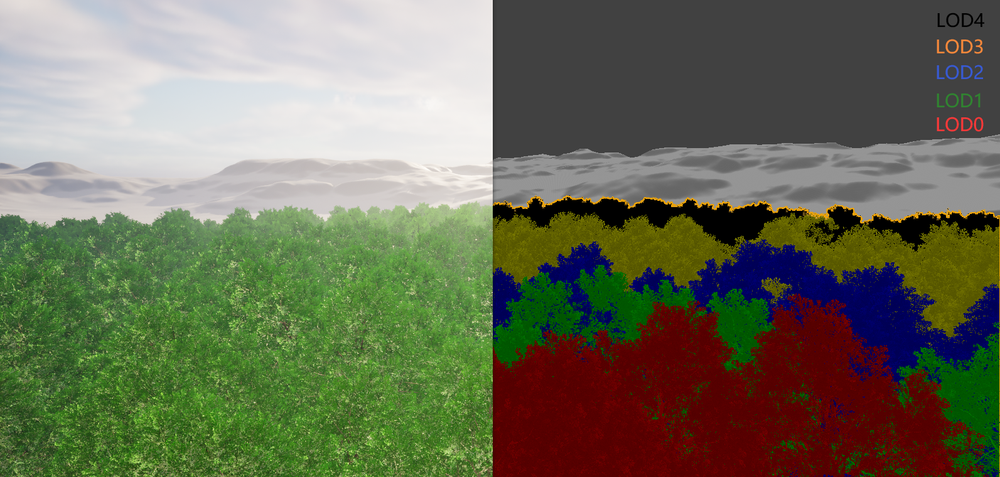

HISM本质上是将实例化网格划分成ClusterTree，每一个Cluster有其独立的LOD级别，最终会产生多个级别的ISM，通过一些引擎指令，我们可以管控HISM的划分策略，关于具体的实现细节可以参考：

- [UHierarchicalInstancedStaticMesh(HISM)原理分析-CSDN博客](https://blog.csdn.net/qq_29523119/article/details/123932029)
- [HISM 大规模植被渲染解决方案-CSDN博客](https://blog.csdn.net/ZJU_fish1996/article/details/108806360)

而Nanite不像传统的LOD方案那样，具有少数固定精度梯度的模型，它的LOD梯度不是模型级别的，而是簇（Cluster）级别的，因此HISM机制不能在使用Nanite的模型上正常工作。

### 制作参考

对于LOD的制作标准，可以参考地平线在GDC上的分享，只不过最后一级LOD变成了八面体：

- [Between Tech and Art: The Vegetation of Horizon Zero Dawn (youtube.com)](https://www.youtube.com/watch?v=wavnKZNSYqU&t=2412s)
- [Interactive Wind and Vegetation in 'God of War' (youtube.com)](https://www.youtube.com/watch?v=MKX45_riWQA)

### 总结

上面说了很多琐碎的信息，这里统一总结一下：

- 相同茂密程度的植物，使用模型树的方式会产生大量的顶点，它所带来的性能和内存消耗远高于插片树的方式。
- 目前Nanite的减面策略对树叶的退化效率很低，而人工控制LOD精度梯度，并使用Imposter，通常可以制作出性能更好的植被。
- 无论是模型树还是插片树，开启Nanite是一定有优化提升的，但 Nanite 与 HISM 相悖，所以如果项目场景中有大量的植被，就不建议使用Nanite植被，而是通过传统的LOD制作流程借助ISM和HISM进行优化。
- 对于新兴团队来说，大家都是摸着石头过河，很难说什么方案是最优的，定好之后按这个规范铺量就高枕无忧了。面对这种解决方案不定的问题，我们最好的管理方案就是搭建好自己的内容生成管线，来尽可能地去减少迭代和验证过程中的沉没成本。

## 植被组织

在确定了植被制作管线之后，还需要考虑植被在场景中的规划方式。

### 搭建方式

在UE中创建大量植被，主要有以下几种方式：

- **植被编辑模式（Foliage EdMode）**

    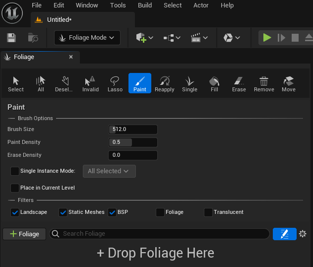

- **地形草地类型（Landscape Foliage Type）**

    

- **程序内容生成框架** 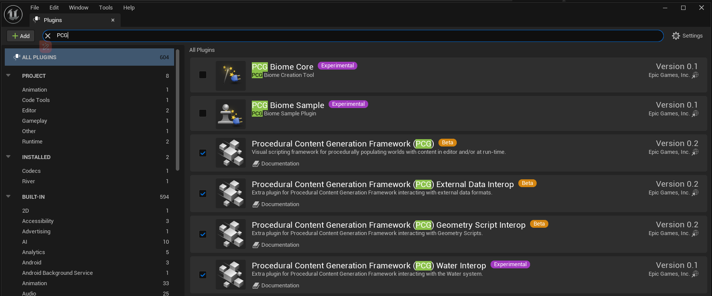

这几种方式有各自的使用场景：

- 植被编辑模式：对于一个正经点的游戏项目来说，我只能说 **植被编辑模式 是碰都不能碰的东西** ，这种刷植被的方式，返工成本巨高，也很难做跨平台的性能适配。

- PCG：PCG框架毫无疑问是最优的植被编辑方式，使用它可以轻易快速的搭建出生态群落，并且可以定制一些的可延展性参数来做多平台的适配。
- 地形草地类型：它适用于密集草的绘制，UE中的实现应该是参考了对马岛中[程序化草](https://www.bilibili.com/video/BV1SF411N7RW/)的管理流程，在预览时通过异步任务去生成草簇，它虽然很高效，但使用地形草地类型会占用一个地形图层去描述草的密度，并不适合大规模使用。

### 分区与流送

首先再回顾一下关于UE5世界分区的内容，之前笔者整理过一个相关文章：

- [Unreal Engine 5 开发 — 开放世界制作 - 知乎 (zhihu.com)](https://zhuanlan.zhihu.com/p/670363215)

前段时间官方也给出了一些比较关键的构建指南：

- [世界构建指南 (qq.com)](https://mp.weixin.qq.com/s/sbsDIN6dUtq5CGhqRBR5oQ)
- [Advanced World Building in Unreal Engine - Chris Murphy / Epic Games for WA Games Week 2023 - YouTube](https://www.youtube.com/watch?v=gJKGMFcg29c&t=2211s)

相信大家对 **流送（Streaming）** 也有了一定概念：

这是笔者在个人测试项目中所使用的网格配置：

| GirdName            | Cell Size | Loading Range | Priority | BlockOnSlowStreaming |
| ------------------- | --------- | ------------- | -------- | -------------------- |
| MainGrid（Default） | 12800     | 25600         | 0        | false                |
| DeferGrid           | 25600     | 25600         | -9       | true                 |
| AdvanceGrid         | 25600     | 51200         | 9        | true                 |
| SmallGrid           | 6400      | 12800         | -9       | false                |

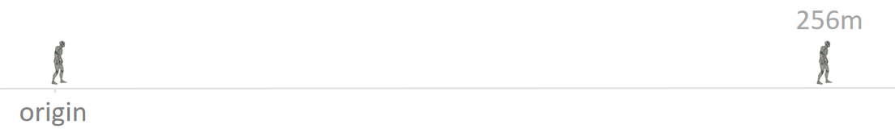

通常 256 m 的加载范围可以保证视野范围内的绝大部分表现效果是正常的，下面是3D视图下的效果（远处的角色是256m下的小黑点）：

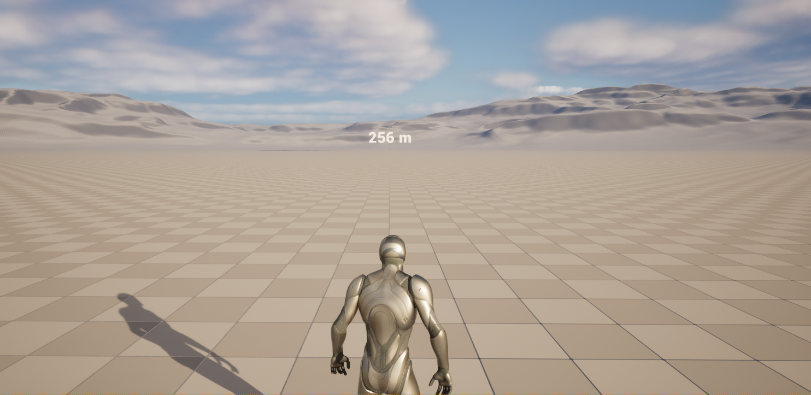

场景模型一般是放在 `Main Gird` 中，但考虑到单元格尺寸（CellSize）也会影响到HLOD合批的距离大小，所以笔者推荐把植被放到 `DeferGrid`中

植被不像其他常规静态模型一样，在开放世界场景中 Merge+Remesh 就能生成一个高品质的远景代理，但植被不行，它不能被Merge成一个Mesh，或者说Merge成一个Mesh之后，没有什么很好的策略可以既保证植被的效果，又能大幅度的削减它的顶点和优化它的材质，因此如果要制作大范围的植被的话，只能采用实例化的方式铺设，为了保证整个世界分区单元之间性能的负载均衡，我们必须严格管控植物的种类数量，在美术效果上，一定是会存在一些妥协的。

> 距离剔除通常会造成严重的视觉瑕疵，如果可以用一些手段（比如雾，转角）让植被在远距离被遮挡，这种情况下我们就无需再考虑远景代理的问题，这种情况把植物视为一个常规的Mesh，开启Nanite，结合世界分区的卸载或者距离剔除就能达到很好的性能效果。

通常植被在近距离使用的是HISM的方式进行组织，在超出加载范围之后：

- 对于小型植被，可以直接不显示远景代理，如果用的是地形草，通常需要保证草的颜色跟地形颜色基本一致，这样在远距离时才不会有特别明显的视觉瑕疵，如果不是使用地形草，使用的是程序化草，可以在编辑器下，通过程序化蓝图中从顶视图烘培一张颜色纹理，以贴花的方式进行渲染来作为草的远景代理。
- 对于大型植被，通常指树木，可以在超出加载范围之后，可以将HISM退化为使用最低级别LOD的ISM作为HLOD（HISM具有簇划分和LOD切换调度的开销），就像是这样：

> 植被的LOD需要能够平滑过渡，由于超出加载范围时HISM会变为ISM，需要保证加载距离左侧和右侧的LOD等级是一致的，这也就意味着模型的LOD梯度是分布在加载距离之内的，由于UE目前使用屏幕空间大小作为模型LOD的切换依据，因此在制作时，需要将其转化为对应的距离。

虽然有了世界分区的加持，并不意味着我们可以把场景搭的无限大，它的优势更多的是无缝加载，计算机的实时计算资源是有限的，虽然可以通过这套合批机制进一步扩大距离，但越大的范围所带来的性能开销也就越大，留给玩法的预算也就越少，因此，角色能看到的距离应该依旧维持在一定距离之内，比如768m：

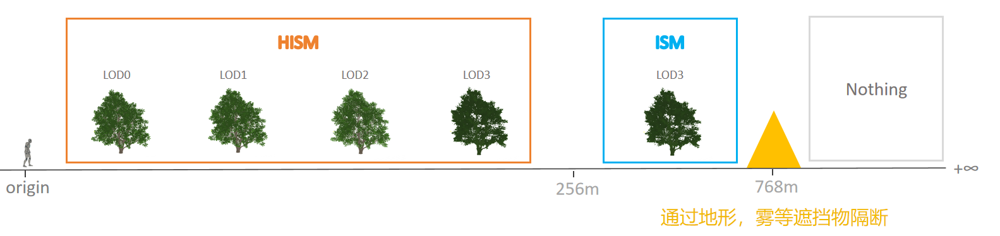

> 不只是树木，其他如模型，粒子，动态材质效果等也建议遵守该规则。

## 阴影优化

植被的阴影消耗往往是整个场景中占比非常大的一环，因为它具有大量密集且重叠的三角形。

那怎么优化阴影呢？

首先，我们需要思考一个问题，为什么需要阴影？假如我们把阴影关了，那么将会看到：

如果让玩家看完上面的对比画面之后，提问：你是喜欢有阴影的画面呢，还是喜欢没阴影的画面？

那玩家的回答大概率是：我选择有阴影的画面。

进一步提问：为什么喜欢有阴影的画面呢？

大多数的回答可能是：因为没阴影的话，画面看起来很违和。

确实，当我们把阴影关了之后，画面的空间层次关系变得差了很多，这已经违反了人对空间的直观感受。

在游戏开发的过程中，我们要学着揣摩玩家的真正的意图，就像在这里一样，本质上玩家在意的并非是想要阴影，他们可能都不在乎什么是阴影？他们仅仅只是不喜欢没有阴影之后违和的画面，而已。

通常在游戏项目中，追求物理或学术上的正确通常是没有意义的，或者说它的性价比并不高，在这里，只要我们可以保证玩家深层次的需求，以一种性能优越的方式， 充分表现出画面的层次感其实就够了。

看着这么扁平的画面：

想要增加它的层次感，你能想到什么？

SSAO 呀！

> 使用 Lumen 后默认不开启 SSAO，可以使用如下指令开启：
>
> `r.Lumen.ScreenProbeGather.ShortRangeAO 0`
>
> `r.Lumen.DiffuseIndirect.SSAO 1`  

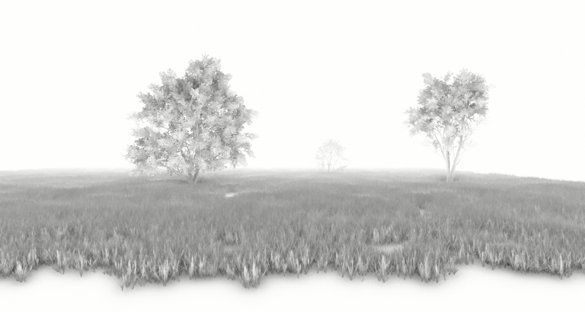

- 如果可以把AO对画面的权重收益提高一些，画面的层次感就会好很多，但这种想法跟目前的Lumen相悖，感兴趣的小伙伴可以试下。

提升AO只能增加画面中细微的空间感，如果没有大面积的空间阴影，画面看起来还是可能会比较奇怪。

对于草，我们可以直接把草的动态阴影给关闭，把接触阴影打开，接触阴影可以看成是一种基于屏幕空间的阴影算法，它几乎是为草量身定制的阴影策略：

> 在模型组件开启接触阴影后，可以在定向光源中设置接触阴影的长度。

- 从上面的对比图不难看出，接触阴影的效果已经很逼近动态阴影了，而它的性能损耗却非常低。

对于树而言，它不能像草一样使用屏幕空间一样的阴影算法，但我们可以优化提交给阴影的顶点数据，因为我们采用的LOD的方式来渲染树木，假如画面中显示的是LOD0，我们完全可以不用LOD0来绘制阴影，而是使用LOD2，或者LOD3...

在UE中，我们可以通过引擎指令`r.ForceLODShadow`，来锁定构建ShadowMap所使用的LOD：

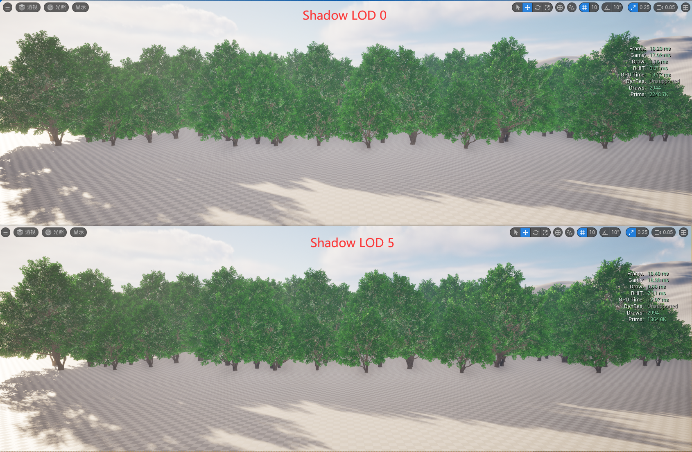

> 通过对比图我们可以看出使用不同LOD的阴影存在一些细微差异，但如果不说的话，谁知道呢？

## 碰撞及交互优化

对于树的碰撞制作，具体要看项目对场景的要求，在熟悉前文的一些网格处理算法之后，我们也可以很容易搭建出一条树木碰撞体的生成管线，比如借助Remesh蓬松的特性可以轻易生成一个像棉花糖一样少量顶点的碰撞体，或者说根据顶点色的分布，只生成树干部分的碰撞...

而对于交互而言，由于我们近距离使用的HISM，并非是一个真实的个体，通常是不能正常交互的。

如果我们需要交互的话，就需要对HISM做一些特殊处理，比如引擎里面扩展了 **UFoliageInstancedStaticMeshComponent** ，它可以用来处理实例的伤害计算：

如果有需求的话，也可以自己派生HISM，让近距离的实例退化为一个实际的Actor，这里笔者不建议走世界分区的方式来管理这种退化。

## 其他

- 尝试关闭 HISM 的 WPO 速度写入：

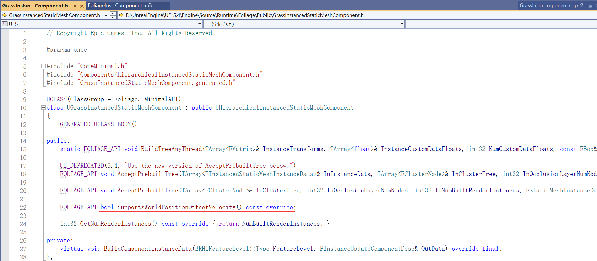

- 限制材质的 WPO最大绘制距离。
- 距离剔除通常会造成严重的视觉瑕疵，如果可以用一些手段（比如雾，转角）让植被在远距离被遮挡，这种情况下我们就无需再考虑远景代理的问题，这种情况把植物视为一个常规的Mesh，可以开启Nanite，结合世界分区的卸载或者距离剔除就能达到很好的性能效果。
