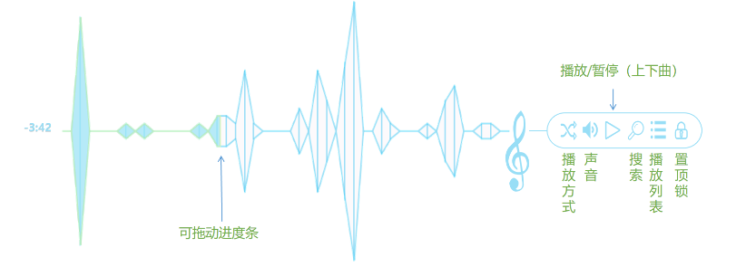
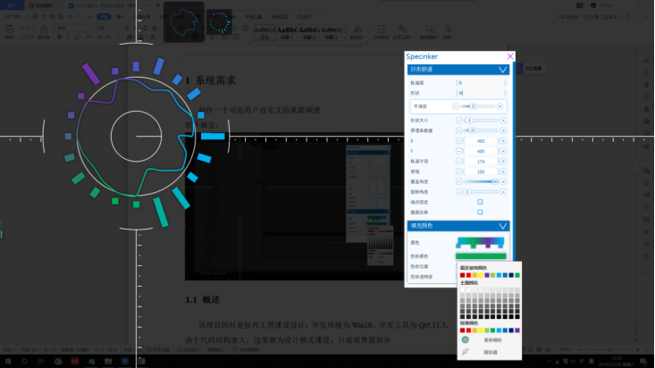
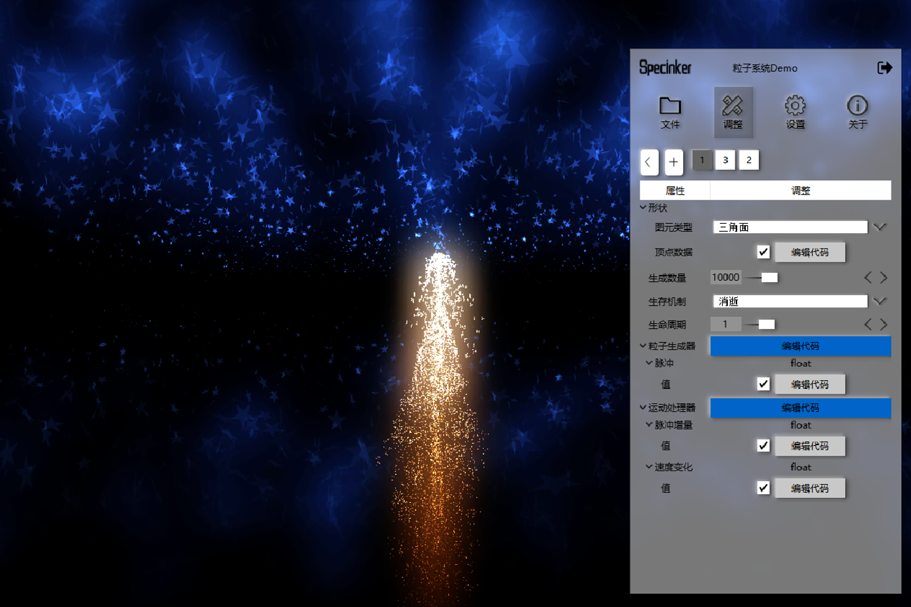
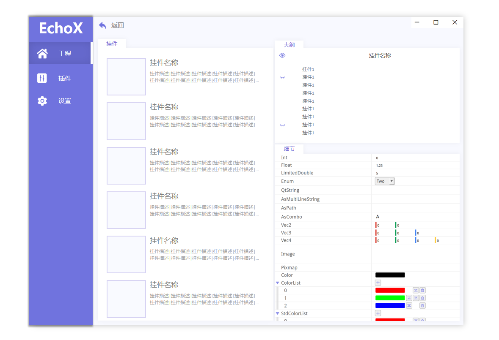
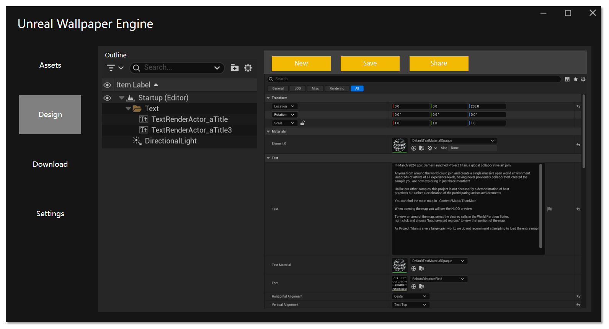

# Cosmos 开发日志 - 起源

对于开发者而言，做出能得到用户称赞的产品，既是梦想，也是使命。

然而产品之间的体量亦有差别，当目标触及宏大的商业版图或复杂的技术架构时，仅凭个人开发者的绵薄之力无异于蚍蜉撼树。

随着项目规模呈指数级扩张，不得不通过堆砌大量人力来提升产能，而在这个庞大的工业流水线中，每个参与者都被异化为精密仪器上的标准化零件，在流程的齿轮咬合中丧失了创作的自主性，被需求迭代与 KPI 考核深深裹挟，逐渐沦为数字洪流中的冰冷统计单元。

就拿UP来说，UP近年的工作内容主要专注于管线（挖大坑）和优化（擦屁股），虽然这算是一个相较核心的职责，但不可否认的是，它也让UP离追求产品内容和用户体验的初衷越来越远，甚至在慢慢丧失一开始学习技术的驱动力。

## 打野历史

UP在学生阶段开发 Specinker 的那段时间是最有学习动力的时期，那个时候会认真地去做设计稿，PPT，一点一点迭代，一点一点进步，在这个过程中，甚至收获了不少的用户：

### Version 1.0 — 2018-09-10

这是UP学习的初期，制作它是为了完成，目标并没有定的很宏大，只希望有一个带着频谱显示的迷你播放器

### Version 2.0 — 2019-05-17

### Version 3.0 — 2019-12-31

### Version 4.0 — 2021-03-21

### EchoX — 2023-07-06

### Unreal Wallpaper Engine — 2025-03-21

## 定位

在这种背景下，经过了无数次的抉择，UP下定决心，争取到了目前人生阶段可能是最后一段长期的“自由时间”，来做一个独立的“作品” —— **Cosmos** 。

- Cosmos 是一个建立在虚幻引擎上的元宇宙演示 Demo。

在效果层面，UP会尽可能地往炫酷的用户体验去迭代。

在技术层面，Cosmos 的技术体系一定会非常硬核。

，它会带着UP的许多期许。

它带着UP的很多期许，但首先需要抱歉的是，Cosmos 并不是 Specinker 的延续，放弃它的原因也很直观：

- 音频可视化至今已经不是什么新鲜玩意了。在UP开发之初，除了专业软件里的频谱可视化，在用户层面，大多时候用的是Rainmeter，但它过于老旧，局限性很大，这也是UP选择开发 Specinker 的原因 —— 有趣且有挑战。而到了现在，似乎只要跟音频挂钩的地方，你都能看到频谱了，比如一些播放器上面现在就有了频谱，还有Steam上也多了不少频谱工具，甚至做的更好更炫。

说了这么多废话0.0，简单说下这个新作品大概的定位：

- 它可能会带有以下标签：
    - 第三人称
    - 宇宙
    - 开放世界
    - AI Agent
