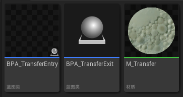
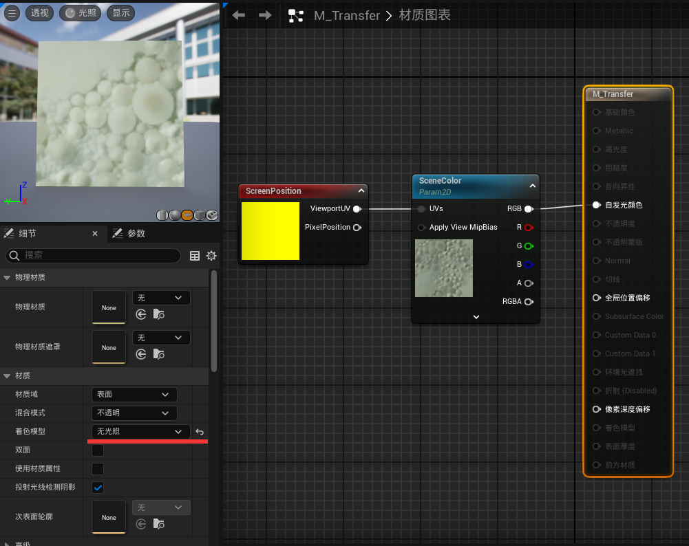
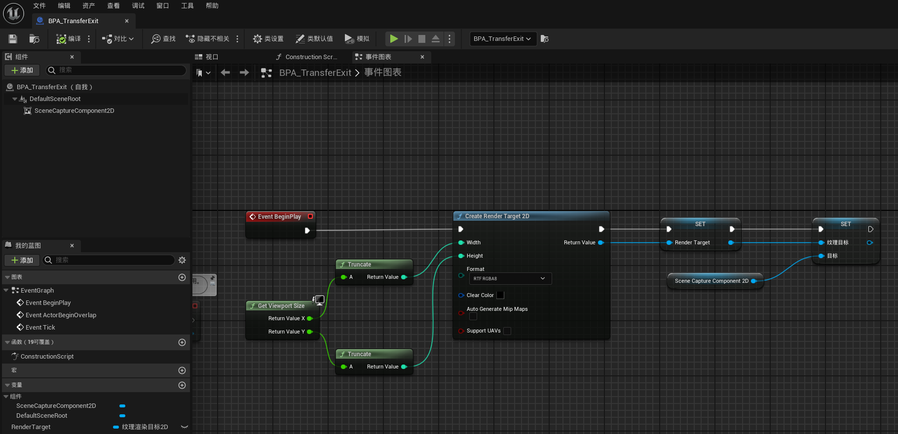
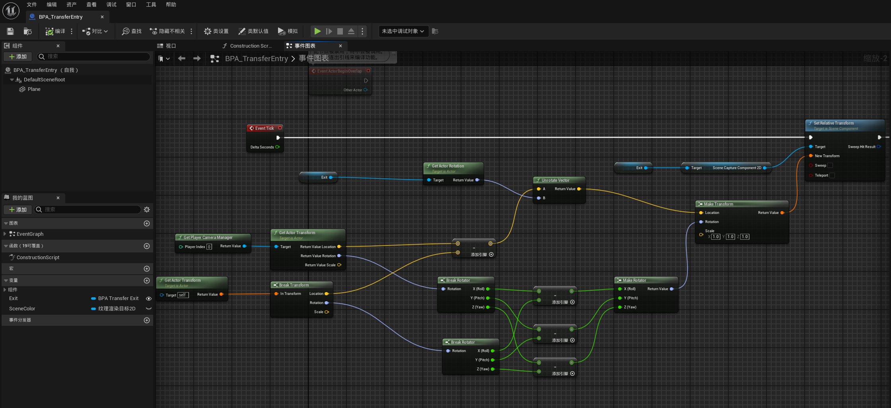
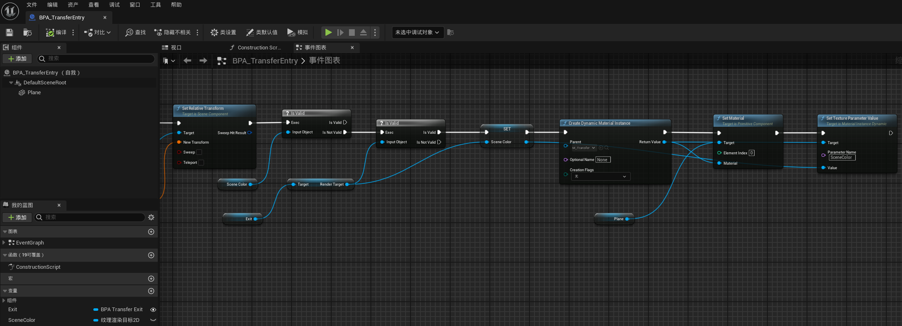
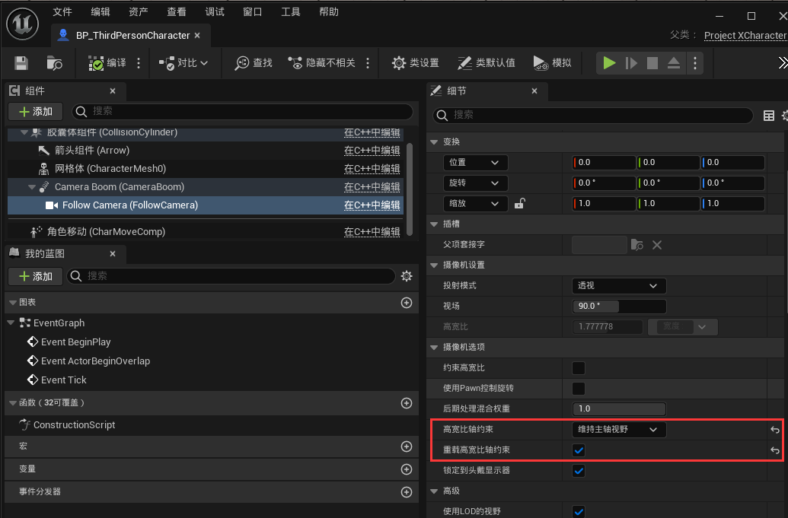

# 传送门效果

## 演示

## 原理

- 制作一个入口点和出口点蓝图Actor，出口点蓝图带有一个 `场景捕获2D组件`，保证其视角参数跟玩家相机参数完全一致，并根据玩家相机与入口点相对位置，同步`场景捕获2D组件`和出口点的相对位置，就像这样（红色小方块对应场景捕获组件）：

    

- 将捕获得到的RT结合Screen UV显示在入口平面上

## 资产

### M_Transfer

### BPA_TransferExit

变量 ：

- RenderTarget：类型为 **纹理渲染目标2D** ， 存储捕获到的RT

### BPA_TransferEntry

变量 ：

- Exit：类型为 **BPA_TransferExit** ，注意勾选可编辑实例
- SceneColor：类型为 **纹理渲染目标2D** ， 存储从出口蓝图获取到的RT

同步捕获组件位置：

确保出口蓝图的RT创建完毕，并为入口蓝图的平板创建动态材质，传递纹理参数：

传送逻辑：

## 使用

在场景中分别放置 `BPA_TransferEntry` 和 `BPA_TransferExit`，并在 BPA_TransferEntry 的细节面板中指定对应的 出口蓝图，就能正常使用了。

 ## 注意事项

- 场景捕获没有抗锯齿。
- 部分光影功能是基于玩家视角的，出口处的画面可能存在一些异常。
- 还需要自行组织关卡的流送逻辑
- 还需要优化视角同步和绘制的生命周期
- 玩家相机组件通常会设置 `宽高比约束`，通常是跟随项目设置`维持X轴视野`，但场景捕获组件内部默认设置为`维持主轴视野`，这个参数不一致会导致画面不同步，场景组件没有把这个参数暴露出来，同步的话需要自己派生进行覆写。

