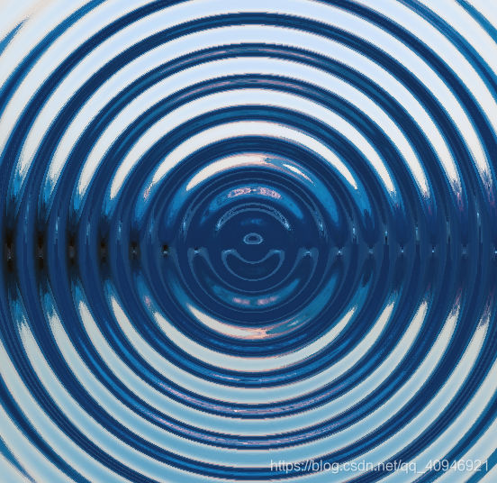
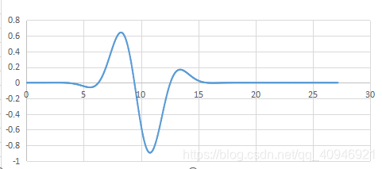
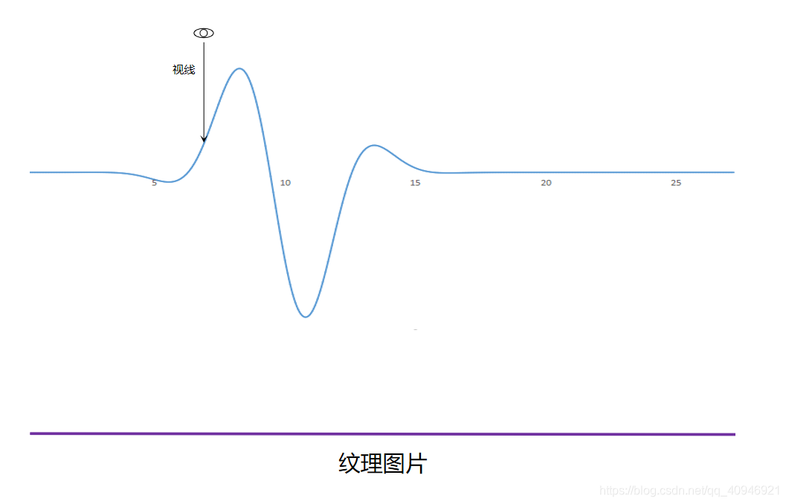

# Qt桌面水面波纹特效

- Github仓库：https://github.com/Italink/DesktopWaveEffect.git

<p style="text-align:center"> 
    <iframe width="560" height="315" src="//player.bilibili.com/player.html?isOutside=true&aid=753422025&bvid=BV1yk4y1B72b&cid=197938359&p=1&autoplay=false" scrolling="no" border="0" frameborder="no" framespacing="0" allowfullscreen="true">		
    </iframe> 
</p>


## 实现工具

- Qt+OpenGL

## 实现功能
- 模拟水波：生成水面波形，完成水面的光照折射计算
- 窗口嵌入桌面
- 监视顶层窗口是否遮挡桌面，是就停止水纹的刷新
- 全局鼠标钩子

## 原理
### 波形生成


把水面波形可以近似看作是一个以振源距离（dis）为参数的正弦波，其中A为最大振幅，F为频率，dis是当前点（xy）与振源的距离，本质上这是一个二元函数，通过这样一个函数，我们能构造出如下效果的曲面：



其中半截面就是一个普通的正弦函数：


这样就完成水面波形的计算了？很显然没这么简单，水面的波形并不只是一个简单的正弦波（博主也不清楚细节），但是通过观察一些水面效果，我们可以发现水波往往是只显示一小段圆环一样的波形，并且随着时间会向外部扩散。

所以我们要做什么呢？

我们需要突出显示正弦波的一小段，把其他部分抑制到几乎为0，显示的这一段会随着时间向外部扩散。我们可以通过改变最大振幅来实现这样的效果，也就是说我们需要让振幅不再是一个常量，而是一个函数，仔细想想，什么函数才能满足我们的需求呢？

当然是它——万能的高斯函数


高斯函数中：

a表示最大振幅(峰值)
b表示对称轴
c与钟状的宽度有关
当a=1，b=10，c=2时，你能得到这样的图形


有了这个高斯函数，我们把它作为正弦函数的最大振幅（也即是两者相乘）


使用之前的参数，我们将会得到：



也就是大约会是这样的波形


为了做扩散，我们需要让高斯函数的对称轴与时间（T）进行关联，随着时间推移，对称轴也随之增大，也就是成正比，我们可以增加另一个变量V来控制扩散的速度


再通过变量W控制波纹的宽度。

 综上，我们得到的水波纹的曲面方程是：


其中：

- A表示最大振幅
- V表示扩散速度
- T表示时间
- W表示宽度系数
- F表示频率

### 水面折射计算

在这一步，我们将计算图片上某一像素点的经过水面折射后实际应该输出的颜色，在OpenGL中，这部分代码在片段着色器中完成（因此上一步也是在片段着色器中）。

#### 计算法向量
我们通过水波的一个半截面来做演示，人的视线是从上往下，大致上观察模型是这个样子的（虽然说光线是从水到空气再到人眼的，但为了推导，我们反过来把光线看作是从人眼发出的）



我们需要计算图片上某一像素点的经过水面折射后实际对应纹理图片的哪一位置

我们需要得到视线经过水面折射后的的方向，要得到这个计算，必须得到视线在水面上对应点（平面）的法向量，通过法向量，我们才能完成入射方向->折射方向的计算

由于通过水面我们是通过函数来构造的，按理说可以通过对函数求偏导来计算得到两个切向量，把它们叉乘就得到了点平面的法向量，但函数其实是非常复杂的，求导之后函数变得非常庞大，计算也比较困难，因此我们用一个投机取巧的方式来计算点平面的法向量：

我们通过求点平面附近两个不共线点的高度，组成两个方向向量，通过对它们求叉乘来计算法向量，这样得到是数据虽然不是很精确，但已经够用了，且效率也不低。

#### 计算折射光线的方向
GLSL提供了一个函数refract（入射向量，法向量，折射相对系数）来计算折射

因此，我们知道了入射向量(0,0,-1)和法向量，求折射向量其实是很简单的，调用函数就行（水到空气的折射系数为4/3，约等于1.33）

#### 计算坐标偏移


得到折射向量之后，我们只需要把折射向量的进行拉伸使得z值等于实际高度（水面高度+波形高度），就能得出经过水面折射后xy的偏移值，原来的坐标+偏移坐标就得到了水面折射后的坐标，另外由于纹理坐标的取值为[0,1]，因此我们还需要根据窗口宽度做一个坐标标准化。

### 大功告成！
附上博主自己实现的片段着色器代码：

``` glsl
#version 330 core
out vec4 FragColor;
 
uniform sampler2D texture;
 
uniform vec3 data[50];          //data传递(鼠标x，鼠标y，运行时间)：支持多振源
uniform int data_size;          //当前有效的data长度
uniform vec2 screen_size;   //屏幕尺寸
uniform float frequency;    //频率
uniform float amplitude;    //最大振幅
uniform float wave_width;   //波纹的宽度
uniform float depth;        //水平面距离背景图片的深度
uniform float speed;
 
in vec2 TexCoord;
 
void main()
{
    float height;
    float upHeight;
    float rightHeight;
    for(int i=0;i<data_size;i++){
        float time = data[i].z;    //鼠标点击后的时间
        float dis = distance(data[i].xy,gl_FragCoord.xy);  //鼠标位置到当前片段位置的距离
 
        float amplit = amplitude*pow(2.74,-(dis-time*speed)*(dis-time*speed)/2/(wave_width*wave_width))*sin(dis*frequency);      //计算当前片段的振幅：这里利用高斯函数突出显示当前时间所显示的波形
 
        height += amplit*sin(dis*frequency);              //当前波形的高度
 
        dis=distance(data[i].xy,gl_FragCoord.xy+vec2(0,1));
 
        upHeight += amplitude*pow(2.74,-(dis-time*speed)*(dis-time*speed)/2/(wave_width*wave_width))*sin(dis*frequency)*sin(dis*frequency);
 
        dis=distance(data[i].xy,gl_FragCoord.xy+vec2(1,0));
 
        rightHeight += amplitude*pow(2.74,-(dis-time*speed)*(dis-time*speed)/2/(wave_width*wave_width))*sin(dis*frequency)*sin(dis*frequency);
    }
 
 
    vec3 up = vec3(0,1,upHeight-height);
 
    vec3 right = vec3(1,0,rightHeight-height);
 
    vec3 normal = cross(up,right);
 
    vec3 view = vec3(0,0,-1);
 
    vec3 re = refract(view,normal,1.33);
 
    vec2 coordOffset = re.xy*((height+depth)/re.z)/screen_size;
 
    FragColor = texture2D(texture,TexCoord+coordOffset);
}
```

