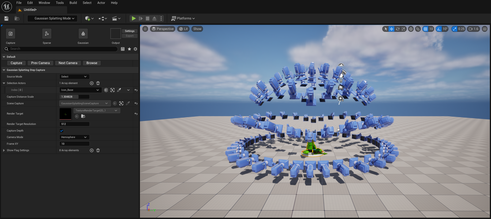

# Gaussian Splatting For Unreal Engine

- 仓库地址：https://github.com/Italink/GaussianSplattingForUnrealEngine/

**GaussianSplattingForUnrealEngine** 是一个虚幻引擎插件，它可以轻易将虚幻中的图形转换为高质量的3D高斯点云：

该插件支持以下功能：

- 提供简单易用的编辑器工具来完成：
    - 图形捕获
    - 稀疏点云重建
    - 高斯训练
- 支持高斯点云（`*.ply`）的导入，在虚幻中以 **GPU粒子** 或 **静态网格体** 为载体进行渲染
- 让3D高斯更接近工业生产，提供了一些非常有用的机制：
    - 精细化的深度修剪：有效剔除漂浮噪点
    - 基于屏幕尺寸的LOD策略：基于高斯点的特征，高效调控粒子的数量和内存

3D高斯具有如下优缺点：

- 优点：
    - 基于【点】表达相较于三角形，更适用于制作粒子特效
    - 基于图像特征识别的重建，相较于传统的网格简化，通常具有更好的简化效果，非常适合用于制作大范围区域的视觉代理
    - 无纹理数据，仅存在基于特征的顶点数据，可微的特性也让它可以进行自由裁剪和压缩
- 缺点：
    - 使用半透明叠加的方式进行渲染，需要对图元进行半透明排序，且 OverDraw 较高
    - 仅还原了物体在视觉上的颜色表达，无法或很难还原物体实际的物理属性，因此不能营造动态的光影效果