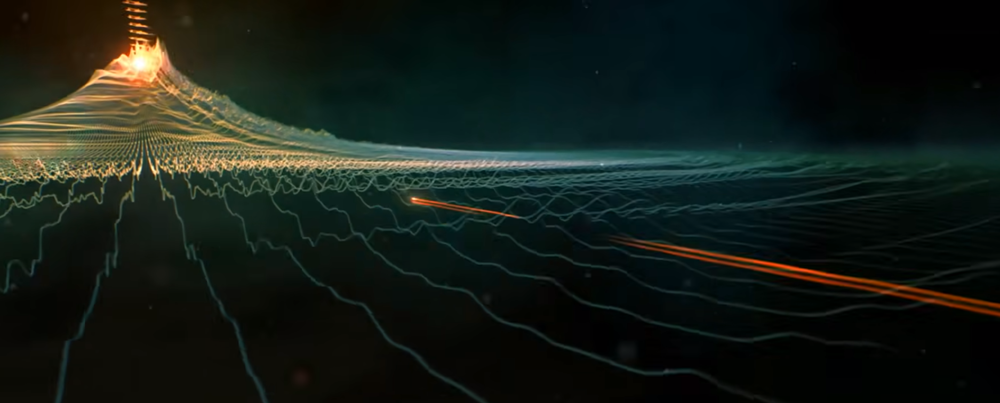

## 背景

这周被抓到上海参加集训，有个游戏相关的研究汇报，本来想着通过脑袋瓜里的一些硬通货，秀下肌肉，结果一上台就猿形毕露，重点重点没说，还尬住好几回，白瞎了组内小伙伴的协助以及连夜赶的PPT，果然我目前还是只能写点技术小作文。

> 长期的闭门造车，导致了口述能力很差，思维跳脱，情商又低，这次可以说是充满遗憾~

很多同学了解到 **元宇宙（Metaverse）** ，可能是从电影《头号玩家》所呈现出来的效果，也有来自于扎克伯格对于元宇宙的阐述，但实际上，元 这个概念，在人类近代社会发展中，已经有了非常成熟的应用。

那什么是元呢？

## 元

元 转译自英文单词 **Meta** ，正如其他单词一样，我们造词，是为了 **归纳和总结** 现实世界中 `事` 或 `物` 及其`行为` 和 `特征`，从而更易于知识 的 **传播** 。

Meta也一样，它用于描述 一件事物在 **发展过程中** 触发 **“进化”** 的 **本质** 。

这么说可能有点抽象，我给大家举个例子：

假如我想从深圳，去到北京，放到一万年前，大家会以什么方式去实现呢？

很显然，在当时的我们能想到的只有徒步。

在一千年以前呢？

我们可能会骑着马过去。

那现在呢？

哦，已经有了非常多的选择，车，火车，高铁，飞机。

那这些跟Meta有什么关系呢？

我想表达的是：Meta其实是一种思维方式的转变，当我们放弃徒步这种直接的行为，去思考，咦，我们能不能通过什么工具来帮助我们去达成目标的时候，它就是Meta的体现。

为了让大家能够对Meta有更清晰的认知，这里我斗胆给Meta下个定义：

- Meta是指思维方式的跃迁，在Meta层面，我们考虑的 **不是** **具体的产品** 和 **实际的目标** ，而是 **转而去思考** 如何 **搭建产品的生产管线** 和 **构建达成目标的中间工具** 。

说到这里，可能还有同学对Meta的概念有些模糊，那我再举一个例子：

假如我们现在面临一个问题：

- 想要修建一栋大楼

通常情况下，我们会想到比较直接的行为，撸起袖子直接干。

但在Meta层面，我们会思考如何去构建一个自动修建大楼的机器。

甚至我们的思维可以进一步跃迁，去思考如何搭建一个生成自动盖楼机的工厂。

这个例子可能有些虚幻，但只要稍加思索，相信很快就能明白Meta的概念。

那Meta能够我们带来什么呢？

- 它可以帮助我们制造出 **一劳永逸** 并且 **可持续性迭代** 的产物。

> 比如说车，一个人发明，所有人都长期受益。
>
> 而交通工具从马，到车，到火车，到高铁，飞机也体现了可持续性的迭代

在人类社会的发展中，Meta的思维体现在方方面面，举两个例子：

- 在工业上，人们从原始社会的鲁莽行事，迈向了工业社会，通过制作工具来提升生产效率，而现在，工业自动化已经初具规模。
- 在学习上，人们从一开始的填鸭式学习，到学习如何学习，再到现在，自动学习机器已经有了具象化的体现（AI），甚至已经能做到让AI去学习如何学习。

在了解了 **元（Meta）** 的概念之后，不难发现，当我们Meta的维度愈高，所面临的问题也就越难，但它所带来的收益也越大

从这个维度去审视元宇宙，大家可能已经有了一些不同以往的切入点，它其实也是Meta的产物，来自于我们一种这样的愿景：

- **真实的世界一片混沌，但在元宇宙中，我们无所不能（The real world is chaotic, but we can control the metaverse）**

## 元宇宙

在人们掌控 Meta 这一神器之后，思维的跃迁变得一发不可收拾，元宇宙的出现是必然的。

但目前而言，大众对元宇宙的定义被混淆成了一个具有如下特征的游戏：

- `开放世界`+`MMO`+`VR/AR`

这个概念完全沦为了炒作，骗钱的工具，什么元宇宙买房，元宇宙工作，元宇宙会议，元宇宙逛街...，相信大多数懂技术的小伙伴都很难绷得住。

知乎上有一个相关讨论：

- [为什么我觉得元宇宙是个骗局？ - 知乎](https://www.zhihu.com/question/486678291)

[这个回答](https://www.zhihu.com/question/486678291/answer/2266323732)直戳痛点：

我们要明白的是，当下的算力和生态，还不足以支撑起元宇宙的构建。

**黑客帝国（The Matrix）** 对我们目前来说，遥不可及：

**头号玩家（Ready Player One）** 让我们寻得了一丝希望：

- https://www.denofgeek.com/games/ready-player-one-easter-eggs-references-movie-guide-complete/

虽然真正意义上的元宇宙对我们来说非常遥远，但当下的技术储备，也足以支撑我们在一个虚拟世界中，完成很多有趣的事情。

游戏行业一直处在相关领域的前沿，从它的发展情况我们可以一窥当下技术能力的上限：

> [Unreal Engine 5 《黑客帝国：觉醒》 （2022.2）](https://www.bilibili.com/video/BV1rY411p7Tg)

根据当前的技术优势，找准元宇宙发展的定位：

- **直追真实世界的画面效果**
- **可以实现 现实中不存在 或者说 高成本 的 吸引人但方式简单 的 交互体验**
- **自由 — 不受物理规则和思维方式的束缚**

避免走入到一些陷阱之中：

- **一味地想要把现实的东西搬到元宇宙**
- **甩不开社会体系和游戏设计的包袱**
- **当前算力还不足以支撑下一代社交产品的出现**

这样我们才能做出一些真正有实际价值的产品。

### 落地方向

#### 真实场景复刻

- 文旅，文博宣传，导航

网易赛车游戏《巅峰极速》中，复刻白云山作为赛道：

在 Unreal Engine 5 的加持下，可以轻易实现超大场景的漫游：

像和平精英那样在这种鸟瞰镜头下增加一些辅助UI：

这可能就是下一代的导航地图。

再在局部增加一些引导UI和创意元素，让AR设备能够同步：

> 视频：[新加坡AR旅游](https://www.youtube.com/watch?v=zFxpXiAkT2k)

文旅宣传的价值就体现出来了

#### 沉浸式体验

- 演唱会，运动会，艺术类会展

笔者目前并没有发现关于这方面比较好的落地产品，很多产品会把它们在 元宇宙中的发展重点 聚焦在 **社交** 和 **互动** 上面，但正如前文所述，当下的算力还支撑不起下一代的社交产品，当下的技术积累还做不到复杂的交互体验，强行去推进最终得到的只能是一堆烂泥。

但现在我们可以依托图形学的高速发展，在元宇宙中去 **扩大艺术的呈现** 。

许多小伙伴可能会看过一些灯光秀或者电子音乐节，它们所带来的视听体验是非常震撼的：

> 视频：[大疆无人机灯光秀（2023年10月16日 世界粮食日）](https://www.bilibili.com/video/BV1AQ4y1s7D3)

> 视频：[拉斯维加斯球型巨幕 MSG Sphere（造价23亿美元）](https://www.bilibili.com/video/BV1Vw411C7Rd)

它们受限于硬件设施，但在虚拟世界中，我们可以做得更好，更多：

> 视频：[音乐图形艺术](https://www.bilibili.com/video/BV1iy4y167pf/)

像是堡垒之夜的虚拟演唱会：

还可以结合 **VR/AR** 来增加更多的代入感：

>  视频：[特效钢琴 / PianiCast](https://www.bilibili.com/video/BV1fZ4y1P7ue)

### 技术支撑

这里笔者简单画了一下目前元宇宙的部分技术体系（灵魂画家）

算力是土壤，为上层的树木提供能量，并链接起了一片片森林。

工业化能力是树的根，干和枝，它有效利用从土壤中获取的能量，支撑起树的整个形态，并延展出一条条的分支。

技术，内容和产品分别对应树的叶，花和果实。

AI像是雨水，它能够丰富内容和玩法，这是大众接触最多的一点，比如最近很火的Chat GPT，各类AIGC的应用，但更为重要的是，它还能滋润算力的土壤，另辟蹊径，让图形算力能够在一定程度上突破硬件的限制。

工业化能力是很多公司所欠缺的点，它主要体现在：

- **技术的把控和融合** ：`技术不懂产品，产品不懂技术` 基本上是多数人或公司的真实写照，我们要明确的是，当前的技术积累是有上限的，所以我们考虑的首要目标不是设计，而是做好各类资源（时间，精力，金钱， **算力** ）预算的分配， **不能即要又要** ，某个产品里有个好点子，搬！某个效果不错，抄！缺乏严谨的底层架构设计，将会导致整个制作管线的混乱。
- **Meta的应用** ：我们知道一个人的能力是有限的，所以我们可能会将希望寄托于一个团队，但在一个超大型的系统构建中，所面临的已经不仅仅只是一个技术问题了，它还是一个工程问题，我们得清晰地认识到， **人的能力是有限的** ，所以我们都借助工具，在技术方面，Meta的应用主要体现在：制作流程上的 **程序化（Procedural）** ，管控流程上的 **自动化（Automation ）**

关于这方面的细节，笔者有一些见解，但不成体系，缺乏打磨，之后再分享出来。
