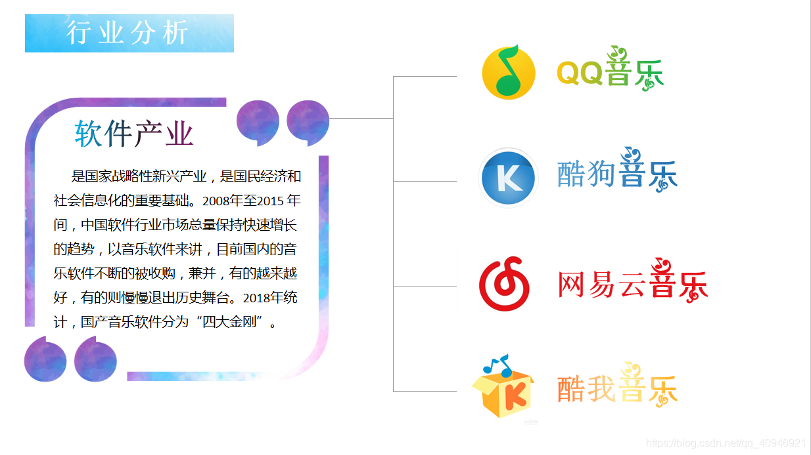
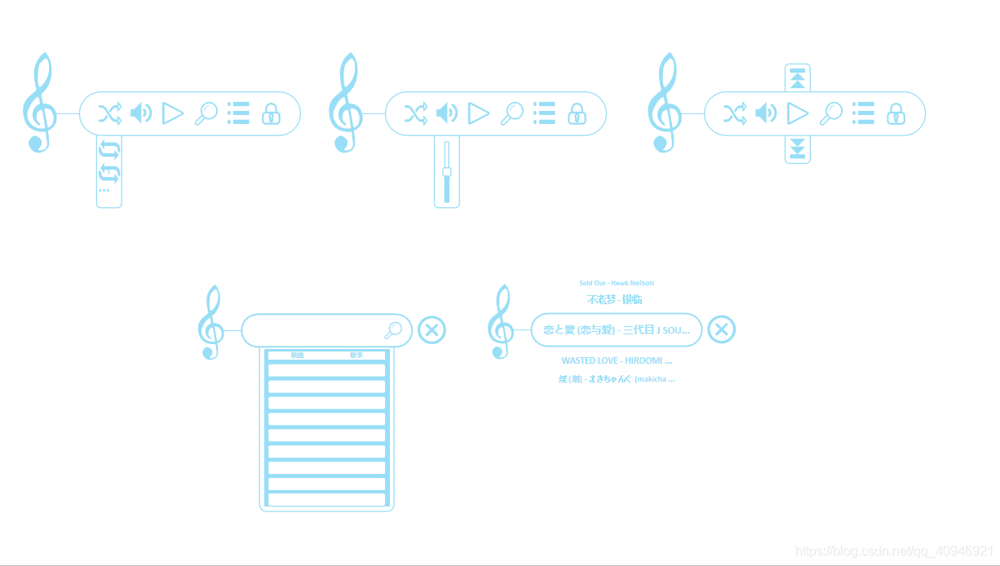
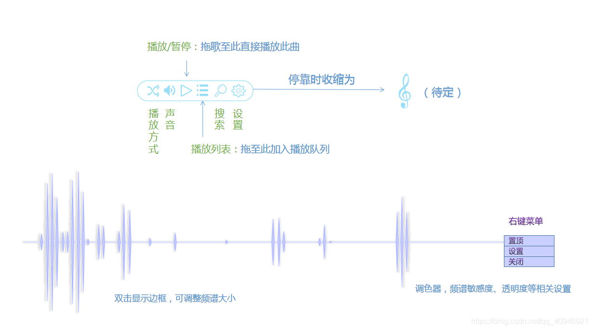
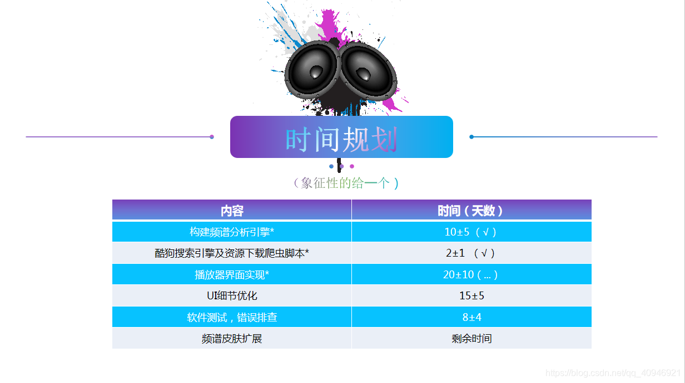

初次将软件定位为 桌面[频谱](https://so.csdn.net/so/search?q=频谱&spm=1001.2101.3001.7020)+音乐播放器

第一次演讲在开学之后的第五周，此时音频分析引擎基本完成，能够播放音频显示简单的音频简单频谱。看过雨滴制作的一些皮肤之后，感觉效果不是很理想。

<iframe src="//player.bilibili.com/player.html?isOutside=true&aid=68047699&bvid=BV1PJ411w7sM&cid=117945274&p=1&autoplay=false" scrolling="no" border="0" frameborder="no" framespacing="0" allowfullscreen="true"></iframe>

<!-- more -->

