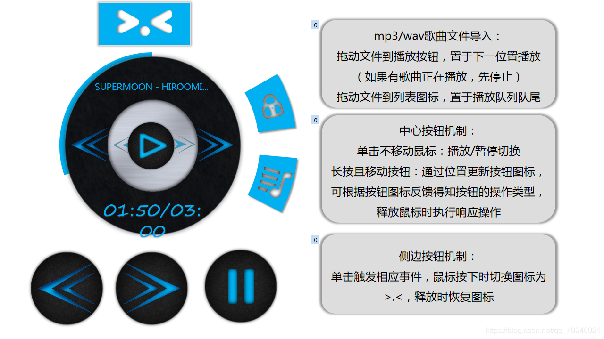
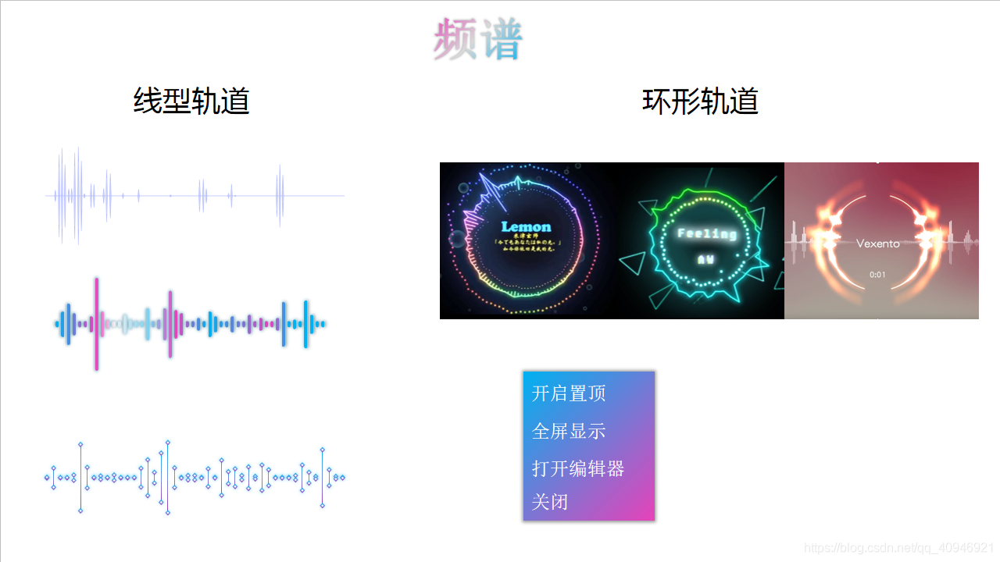

第二次演讲是在开学后第十周，在演讲前几天无意发现AE也可以制作[频谱](https://so.csdn.net/so/search?q=频谱&spm=1001.2101.3001.7020)，并且效果很炫酷！！我就在想我能不能也做一个类似的东西，况且我也有桌面显示这个强大的优势！

此次临时变更软件定位为音乐播放器+频谱设计器+桌面频谱，但程序还没来得及变更，不过这次的ppt有很认真的做-.-

本阶段大多时间花费在界面设计上（频谱设计界面，播放器界面，歌单管理界面），还有就是图形的绘制算法（如何通过音频数据绘制图像），走了特别多的弯路，界面基本都写好了，后来又统统被我丢了（原因是看了AE的频谱，打击太大T.T），俗话说，当断不断，必受其乱，唯一留下来有用的就是一个颜色选择控件，这个控件是模仿wps的，包含颜色选择器，颜色菜单，屏幕取色器，这也是一个不小的工程，整个控件的代码有近两千行，基本占这个阶段40%左右的代码量，这算是软件的第一次重构吧。

<!-- more -->

