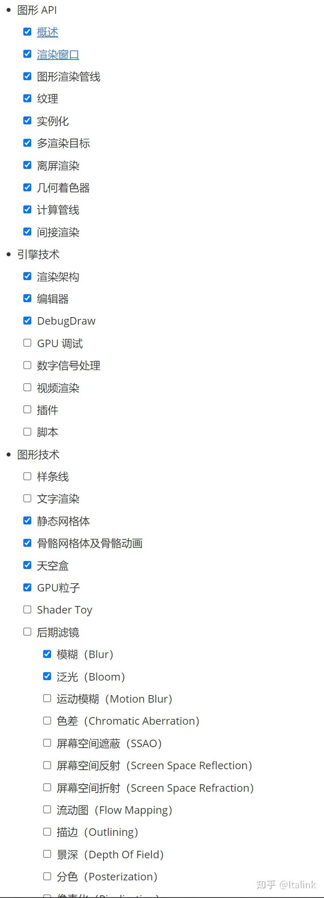

停更一两个月：

- Qt目前已经支持下载6.6.0的开发版本，RHI已经包含DX12后端，部分文件结构有所变动，需要调整QEngineUtilities的代码
- 调整了文章的大纲，为了避免之后的章节存在调整和异动，打算把新加入的那些章节的Demo给写完
- 部分章节的Demo比较枯燥，准备加入一些趣味性，如果您有好的建议，请务必联系我~
- 最近工作压力较大，空余时间也一直在忙，身体状态不是很好~

