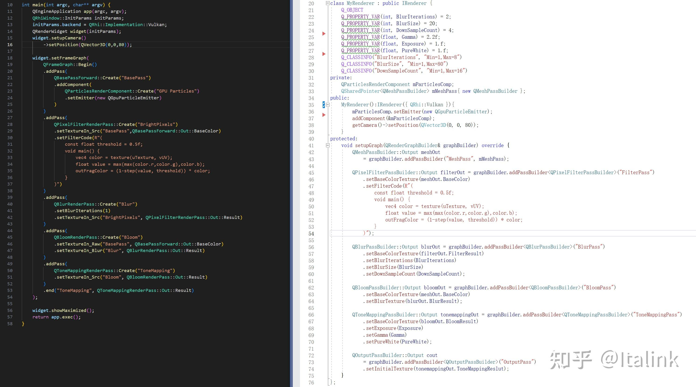
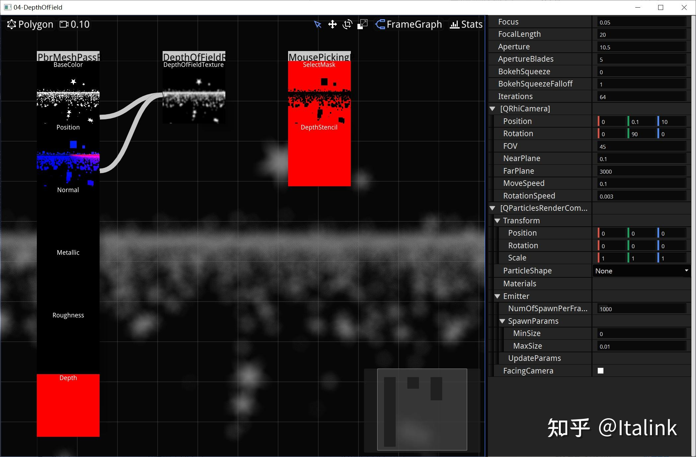

国庆疯狂卷了5000+行代码0.0

把RenderGraph重构了一遍，之前的RenderGraph仅仅是实现了一个便于构造依赖图的结构

重构之后增加了以下功能：

- 异步执行渲染组织逻辑，借助QObject的ThreadQueue机制来完成线程间的数据通信。
- 在RenderGraph中对资源进行了封装，该层面的代码并不直接创建RHI资源，每帧的setup阶段只是创建资源描述，在complie阶段会对资源进行绑定和重建，可以通过资源池对无引用的资源进行复用，并调整了编辑器上的预览视图。
- 封装PrimitiveRenderProxy，主要用于搭建MeshPass（BasePass）中的渲染结构，它可以复用几何数据和流水线结构，来达到外部调用 drawAllMesh(OverrideFragmentShader, OverrideUniformBuffer，OverridePipelineState)的效果，目前用于鼠标的点选机制，后续将用于ShadowMap，屏幕空间反射效果的实现。

明天看下能不能把文章给赶完，忙不过来就得等到下周，弄完这篇文章我可能要跳票了~

