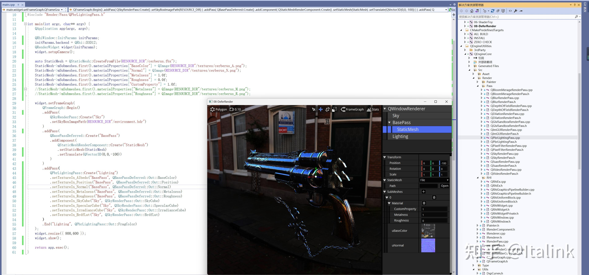
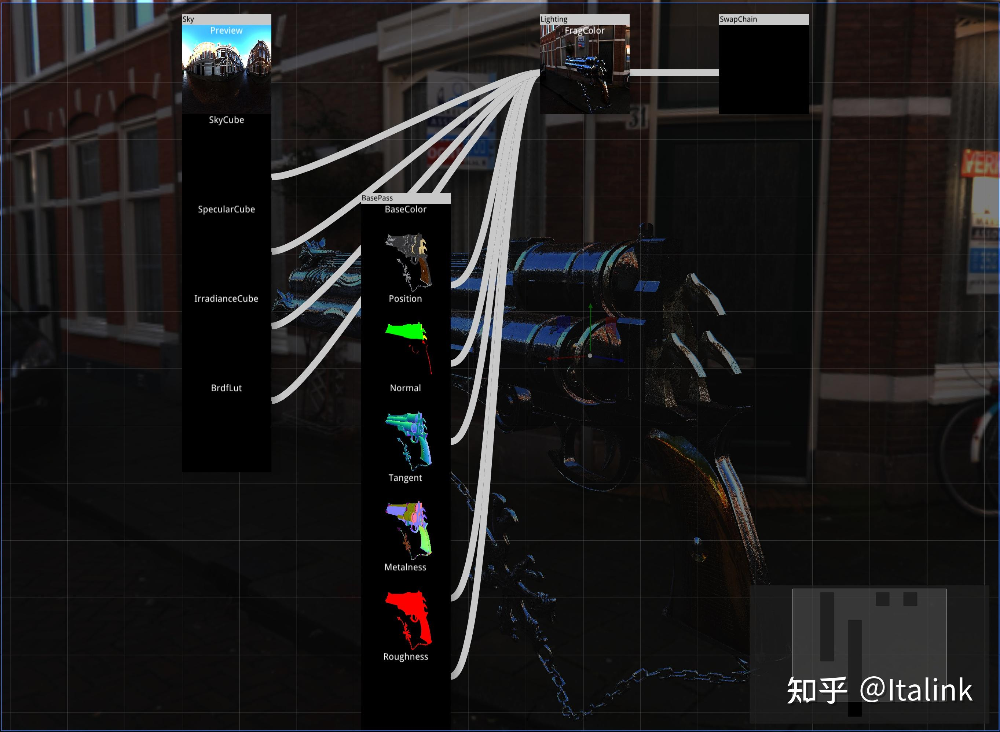

推进进度
\- 景深滤镜（抄来的0.0，感觉效果有点不对，好像是alpha的问题？）
\- 抄了一个PBR仓库的代码，一点点代码抄了两天，主要是问题出在用QRhi要兼顾DX，GL，Vulkan，比如UV不同，DX没有RWTextureCube，采样器maxLod的问题，还好有renderdoc...
\- 重构了一波网格材质的构建方式，尽可能的提供自定义扩展的手段
下周整理一下目前的代码，争取下下周能开始继续写文章

