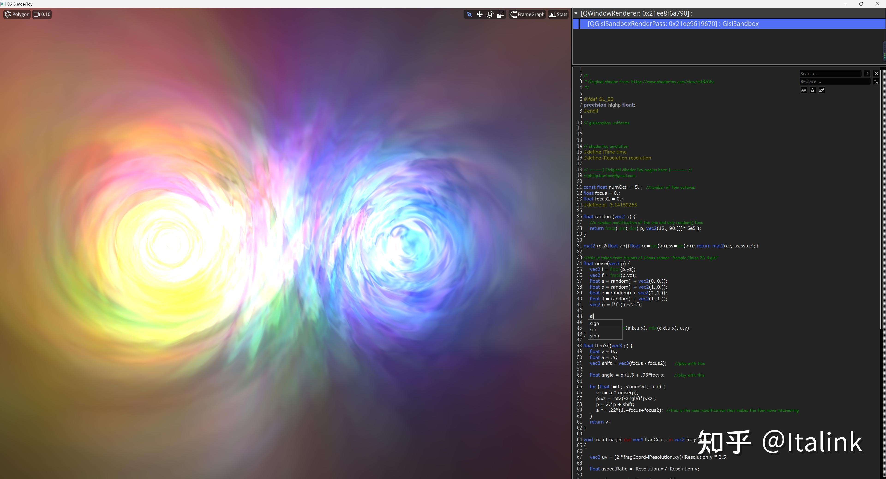

就昨晚和今天有时间写代码T.T，主要是把之前的一些旧代码搬过来，做了一些重构

- 简单接入ShaderToy和之前用QScintilla搭建的GLSL编辑器
- 重构了一些FrameGraph的接口，简化了一下Pass的定义，修复SSAO的BUG，丫的，看好多教程上都是传Perspective矩阵进去，我傻乎乎只传了裁剪矩阵，后面细看逻辑才发现还得加上View，命名害死人...
- 加入文字渲染的两种策略，纹理策略是通过QPainter绘制的，网格策略是通过QPainterPath加入文字可以得到多边形路径，再使用EarCut算法，去除多边形中的空洞，最终得到文字的网格顶点

