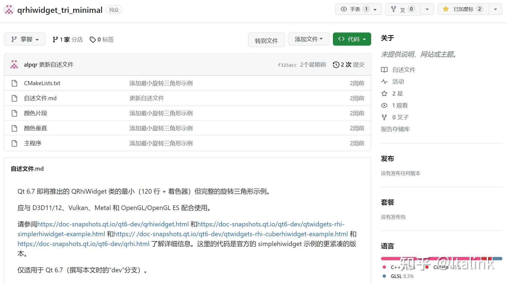

我复活辣！
Qt 6.7 将正式公开 RHI 接口，作者大大文档都已经写好了：
\- [QRhi Class | Qt GUI 6.7.0](https://doc-snapshots.qt.io/qt6-dev/qrhi.html)

从下周开始，图形引擎的文章会继续更新（刚开始调整状态，更新会有点慢），不过会优先把RHI的接口说完，尽快进入到引擎和渲染架构相关的内容

还有一些关于UE的东西想去整理：

- Niagara性能优化
- 开放世界项目管理

