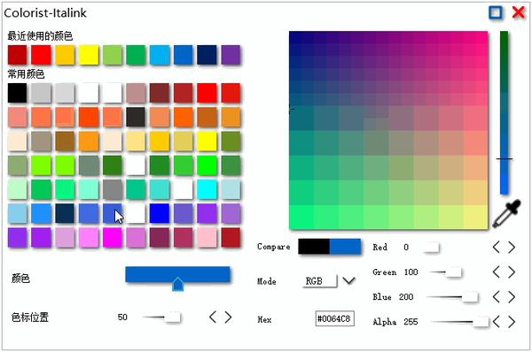
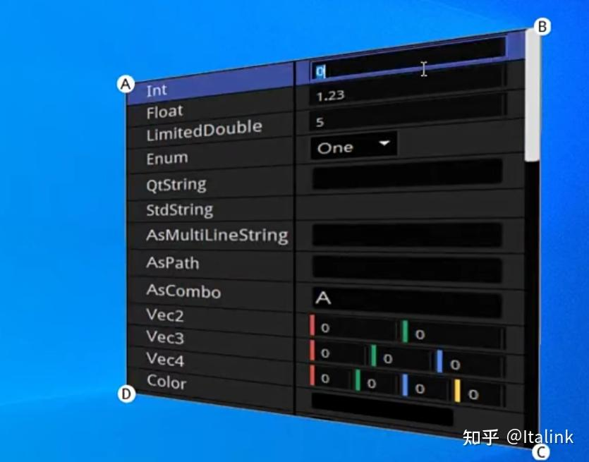
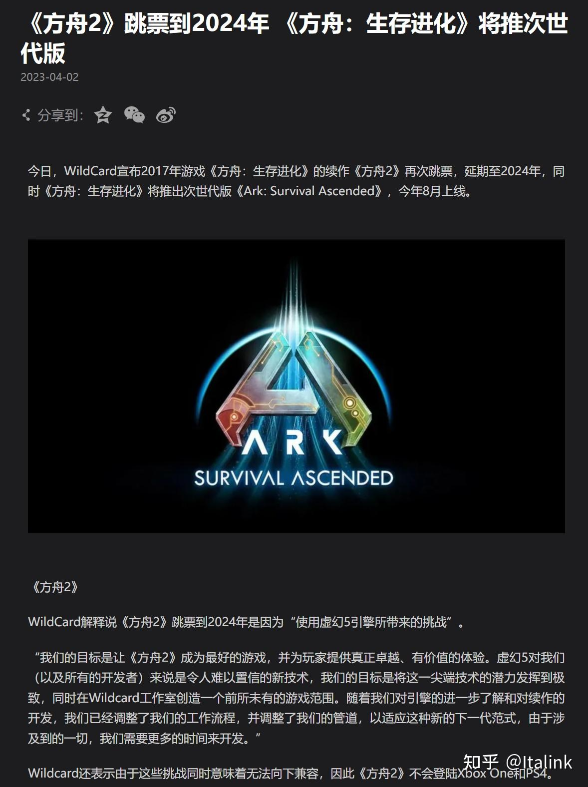

一转眼就过了工作的第三个年头，笔者也算是从之前的阴影中走了出来，很多感慨，在这里记录一下这三年的状态，期待下一个三年~

<!-- more -->

## **个人经历**

笔者入职的第一家公司是 **Insta 360** （实名给老东家打Call），它是一家非常有活力和激情的[独角兽企业](https://zhida.zhihu.com/search?content_id=240917268&content_type=Article&match_order=1&q=独角兽企业&zhida_source=entity)，虽然只在那边待了两个月，但那边浓烈的工程师文化，让笔者学到很多优秀的习惯，至今受益无穷，就比如说，笔者会很愿意认真地在[Wiki](https://zhida.zhihu.com/search?content_id=240917268&content_type=Article&match_order=1&q=Wiki&zhida_source=entity)上去写对外的文档和Demo，因为这会得到其他同事的鼓励和认可，这是一件非常值得高兴的事情~

可是，笔者偏偏又是一个比较理想化的人，在大学的时候，看到过很多讲述国内游戏如何如何艰难的文章，那时候就在想，原来小的时候玩过的那些游戏，背后原来有那么多曲折的故事，让人觉得非常惋惜，又是那么的向往...

“嗯，我要做游戏。”

所以笔者大学的时候，几乎把所有的时间都花在了学习[图形引擎](https://zhida.zhihu.com/search?content_id=240917268&content_type=Article&match_order=1&q=图形引擎&zhida_source=entity)的知识上面，那时候的梦想就是，到网易工作。（因为自己很多喜欢的游戏，不是网易工作室开发的，就是网易代理的）

快毕业时，一开始秋招的目标也只有网易，两轮面试下来，感觉自己发挥得还不错，但一个月多过去（那时已经十月份了），杳无音讯，我开始怀疑自己，是不是因为常年的闭门造车，导致对自己的认知有着很大的偏差，高估自己了，论坛上一看，有很多人晒offer，更焦虑了，一度害怕自己毕业找不到工作，虽然不甘心，但也只能老老实实继续投简历，然后，就得到了老东家的赏识，可以毫不夸张地说，我当时觉得它对我是有知遇之恩的，就像这样：

在收到Offer后我立马答应，果断选择了躺平，然后戏剧性的一幕就来了，刚过三天，网易就发Offer了，年包还比之前高了一大截，啊这，你这让我怎么办？

正如前文所说，笔者是一个比较理想化的人（嫩头青），思来想去，最终还是回了封婉拒的邮件...

当时笔者周围很多人都表示不理解，包括笔者现在再回头去审视这个问题，站在利益最大化的角度，之前的选择肯定是不明智的，但回顾起这段经历，笔者又是非常幸运的。

在 影石 的那段时间应该是笔者身体状态最好的时候，但 做游戏 的执念，宛如梦魇，直到某天，无疑间看到了前司的一条[帖子](https://link.zhihu.com/?target=https%3A//tieba.baidu.com/p/6978363742)，讲述了他们做[自研引擎](https://zhida.zhihu.com/search?content_id=240917268&content_type=Article&match_order=1&q=自研引擎&zhida_source=entity)的艰难历程，看完后整个人都给燃爆了，这不就是自己梦寐以求的地方吗，那一晚，我翻了所有有关它的信息，第二天便跟领导说了自己的想法，在得到肯定后，投了简历，过了！写了很多交接文档，在处理完离职后，去到了广州。

就这样，笔者迈进了自己梦寐以求的游戏行业，就跟大多数游戏人一样，结识了很多优秀的同事，技术力超群的领导，同样，也承受着游戏行业的诅咒...

在笔者入职之后没多久，发生了一件非常令人惋惜的事情，是的，MXY跳楼了，笔者是野路子出身，在此之前并不了解这个人，但在事发前，刚好在知乎上看过他招人的 [文章](https://zhuanlan.zhihu.com/p/422247380) ，当时看这篇文章最深的印象是 —— 评论区里骂声一片。

在此之前，笔者就跟那些无脑小年轻一样，对腾讯也有着不小的偏见，看了几篇文章，听了几句口嗨，搞得自己就跟正义之师一样，笔者承认自己并不高尚，只庆幸自己在那个愚蠢的年龄没干出什么蠢事，只是越是了解他的经历，越觉得后怕...

刚工作的时候，领导给了很高的自由度去做自研引擎的各种尝试和预研，因为招不到合适的同事，所以就干脆去挤时间写教程，说不定能“骗”来一两个0.0

可搞着搞着自研引擎就寄了，就在笔者想出路的时候，突然来了个王炸，说是要搞3A，就是得转[UE](https://zhida.zhihu.com/search?content_id=240917268&content_type=Article&match_order=1&q=UE&zhida_source=entity)。

卧槽，啥，没听错吧？？？3A？？端游？？？单机？？仙侠？？转！

为了不拖后腿，后面可以说是卷到爆，当然，并非每一个人都会像笔者那样感到高兴。

这段时间一定是笔者人生之中最为难忘的经历之一，笔者由衷地感谢那些帮助过自己的每一个人。

可是虽然自己抱着舍命陪君子的决心，但最终，梦想还是破灭了，这种不甘情绪产生的困惑所引起的一系列连锁反应，让自己的状态跌到了谷底。

于是自己便回家了，再次回到熟悉的地方，突然觉得自己有些陌生了，小的时候多开心，除了上学，其他时候不是在看动漫，就是跟小伙伴玩游戏，要不就是跟着舅舅去钓鱼，哪有那么多奇奇怪怪的目标和梦想。

现在终于有时间来审视一下自己，发现自己逐渐能理解很多原来觉得很困惑的事情，就比如，酒明明一点也不好喝，还会有那么多人要去喝，原来是因为真的有那种无法从言语表达的情感，而自己原来只不过是一个幸运儿，一直以来都刚好有“大人们”在前面顶着，又想到了[上野千鹤子](https://link.zhihu.com/?target=https%3A//www.bilibili.com/video/BV1RN411c7ok)所提到的那句话：“你所秉持的‘努力就会有回报’的观念，其实是周边环境一直以来的提携。”，这段话让笔者觉得无力，自责。

这期间有在反复看一部电影 -[《本杰明·巴顿奇事》](https://zhida.zhihu.com/search?content_id=240917268&content_type=Article&match_order=1&q=《本杰明·巴顿奇事》&zhida_source=entity)，有很多印象深刻的台词：

好不容易能在家待一段时间，但长期的颓废，总会让那些关心你的人感到不安，为了创造出一些希望，还是决定振奋起来，继续工作，虽然那时精神状态非常脆弱，但好在之前认识的朋友收留了自己。

不过现在已经不在游戏行业了，一方面是因为现在很难有机会去做自己喜欢的游戏，另一方面，在认真审视自己后，对游戏的执念已经没那么深了，可能跟成长经历有关，自己真正在意的其实是可以得到别人的鼓励和认可，这是一件非常值得高兴的事情，那个人可以是亲人，可以是朋友，可以是同事，可以是同学...

后面可能还会做游戏，不过如果能有机会的话，其实是非常想当一名老师的，但是可能现在离现在的自己太遥远了，不过可以确定的一点是，如果我想，那就去做吧，就比如我喜欢那种引导思维，分享知识收获的喜悦，那就去做吧，而这并不一定需要在学校。

## **职业发展**

说了这么多矫情的话，也展开说说这几年自己都做了些什么吧。

### **Student**

笔者早期是一个网瘾少年，除了打游戏，对自己未来发展稍微有一点正向的爱好就是喜欢做视频剪辑。

在老师的引导下，喜欢上了编程，它无疑是一种自由维度更高的娱乐方式，于是自己便化生 刷题Boy ，在网上结识了很多卷王，自己在[CSDN](https://zhida.zhihu.com/search?content_id=240917268&content_type=Article&match_order=1&q=CSDN&zhida_source=entity)上也写了不少题解。

后面无意间发现了AE的音频可视化效果，自己也想搞一个，毅然入了Qt的坑，为了做一些比较炫酷的实时滤镜（主要是Glow），通过 [Learn OpenGL](https://link.zhihu.com/?target=https%3A//learnopengl-cn.github.io/) 的教程系统性地学习了OpenGL，只不过用的是Qt封装的接口，遇到很多坑，对相关结构也有了不浅的理解，期间补了很多图形学和线性代数的知识，也写了一些教程和示例，虽然现在回头看，代码很烂：

- OpenGL示例仓库：[https://github.com/Italink/QtOpenGL-Essential-Training](https://link.zhihu.com/?target=https%3A//github.com/Italink/QtOpenGL-Essential-Training)
- 教程：
    - [QtOpenGL入门教程（一）—— 图形渲染管线](https://zhuanlan.zhihu.com/p/687543043/bilibili.com/read/cv10421402)
    - [QtOpenGL入门教程（二）—— 搭建渲染管线](https://link.zhihu.com/?target=https%3A//www.bilibili.com/read/cv10422557)
    - [QtOpenGL入门教程（三）—— 初识OpenGL对象（顶点数组对象和缓存对象）](https://link.zhihu.com/?target=https%3A//www.bilibili.com/read/cv10477263)
    - [QtOpenGL入门教程（四）—— 初识纹理对象及2D文字的绘制](https://link.zhihu.com/?target=https%3A//www.bilibili.com/read/cv10552786)
    - [QtOpenGL入门教程（五）—— 再谈着色器及着色器语言](https://link.zhihu.com/?target=https%3A//www.bilibili.com/read/cv10694142)
    - [QtOpenGL入门教程（六）—— 初识帧缓存对象（泛光滤镜）](https://link.zhihu.com/?target=https%3A//www.bilibili.com/read/cv11765941)
    - [QtOpenGL入门教程（七）—— TransformFeedBack（GPU粒子）](https://link.zhihu.com/?target=https%3A//www.bilibili.com/read/cv12927018)

那个时候学完Qt和OpenGL，感觉只要自己想做，什么都能做出来，所以干了很多莽夫行为，不过确实也写了很多有意思的小东西：

- 爆肝一个月写的调色器，只因为嫌弃Qt默认的调色器太丑：[https://github.com/Italink/QColorsDialog](https://link.zhihu.com/?target=https%3A//github.com/Italink/QColorsDialog)

- Qt的拟态窗口滤镜：[https://github.com/Italink/QNeumorphism](https://link.zhihu.com/?target=https%3A//github.com/Italink/QNeumorphism)

而这些小东西，最终都被用在了自己的毕业设计里面：

- [https://blog.csdn.net/qq_40946921/article/details/104124455](https://link.zhihu.com/?target=https%3A//blog.csdn.net/qq_40946921/article/details/104124455)

这是一个非常酷的小软件，应该可以算是一个比较小的图形引擎了，这里面除了制作很多炫酷的图形效果，也是笔者第一次对 [UGC](https://zhida.zhihu.com/search?content_id=240917268&content_type=Article&match_order=1&q=UGC&zhida_source=entity) 所做成功的尝试。

虽然那个时候比较年轻，代码写的很青涩（一个大佬这么评价的），但这个反复重构的过程中，自己的代码功底和架构能力可以说是有了质的飞跃，对编辑器架构（反射），用户体验（[UX](https://zhida.zhihu.com/search?content_id=240917268&content_type=Article&match_order=1&q=UX&zhida_source=entity)），多端兼容有了一定的认识。

在大佬的推荐下，接触到了 [CMake](https://zhida.zhihu.com/search?content_id=240917268&content_type=Article&match_order=1&q=CMake&zhida_source=entity)， Git 和 Markdown。

然后就毕业了，大学生涯算是比较圆满吧~

### **Job 1**

刚工作的时候主要是分两条线。

一条线是保证工作内容产出，那个时候用的是Qt，主要就是在修bug，客户端组内比较缺乏[渲染向](https://zhida.zhihu.com/search?content_id=240917268&content_type=Article&match_order=1&q=渲染向&zhida_source=entity)的成员，所以想的是自己能够顶上，工作之余写了一个VR剪辑软件，支持多片段的剪辑，反射编辑器，特效系统（粒子，滤镜），本来想的是转正答辩的时候，秀领导们一波，后面离开的时候也没拿出手...

另一条线就是继续维护毕业设计里做的那个小软件，确实受到了一小波用户的喜欢，但问题也层出不穷，比如：

- 适配做的很差，笔者只保证了程序能在自己的电脑上能按预期执行，但是这在不同环境下，可能就会产生一些异常，比如不同分辨率，不同[DPI](https://zhida.zhihu.com/search?content_id=240917268&content_type=Article&match_order=1&q=DPI&zhida_source=entity)会导致UI界面的布局错乱，不同的显卡和驱动可能导致软件无法正常启动（部分功能使用了一些高级特性）。
- 产品的设计理念比较混乱，喜欢按程序设计的思维去定义用户习惯，虽然笔者的想法是希望用户在这个软件上，能够拥有足够高的自由度，但想要做到这一点，就必定会创造很高的使用门槛，有这精力还不如直接写代码，高自由度依然是 UGC 应该追求的目标，但这种自由应该是限定在一定范围之内，至少不应该给用户增加过多的认知负担，不过我们确实可以尝试去制定一套高复杂度的机制供专业用户使用，同时支持弹性预设来收敛参数的复杂度，但想要把控它们之间的平衡，并非易事。

在维护小软件的过程中，遇到几件极其糟心的事：

- 角色A，QQ私聊我，说它朋友使用这个软件遇到点问题，让我帮忙解决一下，于是我远程过去，对面开口就说：“修不好就给我退款。” ，我？？？？在这之前笔者这个软件一直是开源免费的，只在上面挂了个二维码，前前后后收到四百多块打赏（其中两百多是一个人给的）。
- 角色B，在我闭源之后，联系到我，说对这个软件很感兴趣，能不能学习一下，于是我高高兴兴地给它讲解整体的流程是怎么样的，都用了那些技术，把自己写的相关文档也发给他了，然后突然画风一转，很不耐烦地直接问我要源码，当时还没反应过来，还跟它解释到自己写的代码可读性不是很高，很多重要功能其实我都写了很详细的文档，要感兴趣的话，可以去看看，不难的，结果它下一句：“我姐是律师，某节跟它打官司都输了，你要是不给，我就去法院告你。”，我？？？？
- 角色C，跟技术无关，某天早上笔者在玩游戏，打完一把莫名其妙被对面加好友，开口就是：“哥，我刚出来打工，工资要到月底才发，实在没钱吃饭了，能不能借我50块钱，我想吃个麻辣烫，工资发了我就还你。”，只能说笔者当时太年轻了，听它一说，就想到了自己刚工作的时候，在深圳举目无亲的那种窘境，谁还没个困难的时候？于是我当即微信转给它100，没想到了当天晚上，它又来了：“哥，能不能转20给我，我想喝个奶茶。”，我？？？？我骂了几句，我一气之下删了它的微信，然后一个月过去，当时看到它加我微信，心头一暖，可能是自己误解他了，之前说的话也有点过分，这肯定是来还钱的，结果我同意之后，它说：“哥，能不能再借我100，钱花光了，工资得月底才能发。”，我？？？？

### **Job 2**

刚来的时候，因为大佬们都在忙其他的项目，就留了很多自由的时间给我去做一些技术研究来练手，那段时间做了很多东西，应该是笔者进步最大的一段时期。

首先，就是放弃OpenGL，转学Vulkan，虽然初期有点困难，但学下来之后对整个图形渲染流程和设备有了更深层次的理解，曾经在OpenGL中搞不清楚的黑盒，也逐渐明了，于是整了个Vulkan的教程，虽然代码写的比较烂，其中一些概念在理解上还存在误解：

- [https://github.com/Italink/HelloVulkan](https://link.zhihu.com/?target=https%3A//github.com/Italink/HelloVulkan)

在感觉对Vulkan理解差不多的时候，于是便想着动手去搭一个简易的引擎，刚把基础的架子搭的差不多了，无疑间在Qt的源码目录下发现了它的[RHI](https://zhida.zhihu.com/search?content_id=240917268&content_type=Article&match_order=1&q=RHI&zhida_source=entity)，在深入了解之后，大致摸清了它的结构和理念，简单点说：

- QRhi 使用Vulkan风格的接口，但它的使用门槛甚至比OpenGL低

于是便用它代替Vulkan作为渲染底层，继续完成小引擎，在早期阶段，找到了一些其他引擎作为参考，其中主要有：

- Bgfx：渲染底层，但没有QRhi那样用得顺手
- [Unreal Engine](https://zhida.zhihu.com/search?content_id=240917268&content_type=Article&match_order=1&q=Unreal+Engine&zhida_source=entity)：这玩意是人能看的？
- O3DE：号称是可以做3A的引擎，前身是Cry Engine，深入看了 Atom Renderer 和 编辑器架构，使用CMake作为构建系统，代码的可读性相对而言比较高，其中一些文档也非常有价值，笔者个人认为存在两个巨大的坑点：
    - [ECS架构](https://zhida.zhihu.com/search?content_id=240917268&content_type=Article&match_order=1&q=ECS架构&zhida_source=entity)的使用门槛太高，且效率低下。
    - 使用 旧时的Qt 作为编辑器，因为[QWidget](https://zhida.zhihu.com/search?content_id=240917268&content_type=Article&match_order=1&q=QWidget&zhida_source=entity)使用CPU来完成UI绘制，且事件系统冗余比较严重，从而导致它的绘制性能很差，因为这一原因所导致的一系列连锁问题，使得它的编辑器使用起来并不是那么友好。

在上面的引擎基础上，深入地去了解了一下引擎里面的一些底层模块，主要是：

- [反射机制](https://zhida.zhihu.com/search?content_id=240917268&content_type=Article&match_order=1&q=反射机制&zhida_source=entity)
- 内存管理
- 垃圾回收
- 脚本方案

在对上述内容理解的差不多之后，便搭了自己的第一个引擎 —— **QEngine** （未开源）

不过写了一个有关对象系统，反射机制的开源库：

- [https://github.com/Italink/XObject.git](https://link.zhihu.com/?target=https%3A//github.com/Italink/XObject.git)

这个引擎并不是很出色，并且存在很多瑕疵：

- 那个时候 Games 104 刚开课，看到有很多人在鼓吹ECS架构，笔者就仔细去了解了一下，好像这个设计理念确实挺优秀的，于是便靠着自己对ECS的理解，结合O3DE里面的实现，搭了一个简单的ECS，结果搭完之后，说实话，那个编辑器我自己都不想用-.-，（最近跟一个同学聊过之后，对ECS有了更深的认识，不仅仅是优化结构和性能，采用ECS的架构会更容易去收集帧状态，从而更方便地去完成一些功能，比如说网络同步，游戏回放...）
- 对 QRhi 以及 现代图形[API](https://zhida.zhihu.com/search?content_id=240917268&content_type=Article&match_order=1&q=API&zhida_source=entity) 的理解不是很深刻，还是以OpenGL那种[状态机](https://zhida.zhihu.com/search?content_id=240917268&content_type=Article&match_order=1&q=状态机&zhida_source=entity)的思路去完成整个渲染系统的构建，在实际编写的过程中其实已经慢慢察觉到有点不对劲了，但是积重难返，干脆就不管了。
- 对反射的理解还不到位，从而导致编辑器的架构并不是很合理，因为是参考O3DE的实现方式，虽然也能完成功能，但编辑器的搭建成本并不低，在深入了解UE编辑器之后，也更加肯定了这一观点。

在这个过程中，有几件我印象非常深刻的事情：

- 我拿出自己搭建好的编辑器，发工作群里，领导纷纷肯定和点赞，喜悦之情溢于言表，“你坤哥，厉害吧”，但回过头来看，那个编辑器可以说是并无亮点~
- 我强烈建议领导在后面的开发过程中使用 [SOL2](https://link.zhihu.com/?target=https%3A//github.com/ThePhD/sol2) 去做Lua的绑定，因为这比之前笔者在毕业设计里面用的 [LuaPlus](https://link.zhihu.com/?target=https%3A//github.com/jjensen/luaplus51-all) ，不仅使用起来更简单，而且功能也更加强大，然后领导很耐心和温和地跟自己说，这个我们完全可以不用[开源库](https://zhida.zhihu.com/search?content_id=240917268&content_type=Article&match_order=2&q=开源库&zhida_source=entity)哦，自己写的话可以做更多定制性的扩展，公司里的某某某，对这方面做了很多研究，如果有相关的疑问可以去找他请教一下哦，然后笔者当时心里的想法是：明明这么多人都推进，并且还在用，我就不信你们能写的比那个开源库好。

在那个阶段，笔者是非常浅薄，无知和傲慢的，时至今日，笔者已经能把编辑器的效果和体验做得勉强还算不错，可以对着Lua的虚拟机一顿操作猛如虎，再回想到上面的两件事，有的只是惭愧和感谢~

在此之前，笔者一直全身心的投入到工作之中，直到某天晚上，下班的时候刚好跟领导顺路，问到了做自研引擎发展的这段经历，在聊天的最后，他说到，其实现在在自研引擎这边，能写代码的，只有我跟你了。

有时候确实觉得自己脑回路有点清奇，因为长期招不到合适的人，所以想到了出来写文章骗人来的法子，于是我便开启了另一条支线 —— 在知乎上开始写起了小作文（为了装出一番大师风范，逼格拉的很高）：

- https://zhuanlan.zhihu.com/p/597319889

然后写着写着自研引擎就寄了T.T，转去搞UE了。

一开始以为自己之前所作的努力全都白费了，但实际上手之后才发现，在自研引擎上的代码积累，让自己对引擎的技术视野变得很宽，怎么说呢，感觉就跟开了挂一样0.0，这几乎是通过现有UE教程和文档很难达到的水平（大佬请无视），那个时候又有了这种感觉 —— 只要我想，我能做到任何事~

在这个阶段，笔者非常享受那种工作的状态，跟同事的合作地非常“融洽”。

摸鱼的时候会偷偷去看策划同学精心写的一大堆规划和文案，就跟看小说一样入迷。

虽然经常跟场景和特效小哥撕逼，因为他们对性能的把控不是很敏感，但是他们做出的效果真的好NB。

程序小哥和动作小哥配合起来把战斗效果做的很棒，不过经常吐槽策划SB。

技美同学负责主导一些比较亮眼的效果。

引擎的同学会跟各个方向的同事对接，收敛开发流程，制作一些编辑工具，完成场景的性能优化，进行技术的预研和选型，编写相关的文档。

此时笔者自己的职业定位应该是：

- 引擎工具
- 引擎管线

深入的点主要是：

- 工程管理
- 编辑器（Slate，UMG）
- 特效（Niagara）
- 建模工具（一系列Mesh处理算法）
- 开放世界工具集（世界分区，植被，HLOD，关卡实例...）

也能做一些效果，但专业的同事做起来会更迅速一些。

但最终，因为诸多原因，我们还是寄了，但我们做的并不差！

本着善始善终的原则，教程也继续在写下去：

- [https://github.com/Italink/ModernGraphicsEngineGuide](https://link.zhihu.com/?target=https%3A//github.com/Italink/ModernGraphicsEngineGuide)

之前自己小引擎的一些模块，也都搬出来用上了：

- [https://github.com/Italink/QEngineUtilities](https://link.zhihu.com/?target=https%3A//github.com/Italink/QEngineUtilities)

这里面有自己写的一套反射编辑器，几乎完美支持了Qt的3D UI，还有很多不错的小组件，就不拿出来一一细说了，这个时期对引擎的基础模块也有了一些深刻的认识：

回家这段时间，也一直在反思这段经历，抛开市场原因，在团队方面，笔者说说都有那些可以改善的问题。

在之前的一篇文章中有提到一个例子：

- 你是一个勤勤恳恳的UE小美术，某天，你突然收到一个大佬那边传来的一个需求：要为某个场景铺上植被。你一想，这我熟啊，立马整了几个植被模型，打开[UE5](https://zhida.zhihu.com/search?content_id=240917268&content_type=Article&match_order=1&q=UE5&zhida_source=entity)的植被模式，用 画刷 咔咔几下，就把植被给刷好了，叫来大佬一看，大佬说：“你这不行啊，一点意境都没有，再改一版。”，然后你绞尽脑汁，废寝忘食，折腾好几天，终于是搞完了，前后一对比，确实好了不少，叫来大佬再看，大佬也是连连称赞，然后这事也就翻篇了，直到某个风雨交加的下午，一个自称是引擎开发工程师的小秃子带着质问的语气问你：“这片植被是你做的吗？”，你只得颤颤巍巍到：“是...是啊，怎么啦？”，“现在场景的复杂度变高了，植被这里的性能消耗很高，植被模型面数也比较高，并且刷得太密了”，然后啪啪摆出一堆性能测试结果作为证据，让你进行优化，可是如果要优化的话，就得重新再刷一遍，又是几天繁琐的工作量，于是你找到大佬，渴望大佬救自己于水火之中，大佬说：“改吧，注意形态效果要跟之前差不多。”，听闻此言，你宛若晴天霹雳，你让我改就算了，还要求跟原来一样，这无疑是火上浇油，但为了保住这份工，你无奈只能照做，浑浑噩噩几天，终于熬了出来，叫来小秃子一看，确实少了不少，于是它心满意足的离开了，结果第二天，这个*又回来了，说是测了一下，优化得还不够，还得减，你一听，怒发冲冠，一脚踹在小秃子身上，看着它躺在地上嚎啕大哭的样子，你仰天大笑，笑着笑着睁开了双眼，挣扎着从电脑桌前支棱起来，擦去嘴角的口水，继续加班~

上面的小秃子其实就是笔者自己，很抱歉在实际的开发过程中，因为自己缺乏对整体情况的把控，导致相关的一些同事增加了一些不必要的工作量，当了小白鼠还受气。

而这种情况在实际的项目开发中只是冰山一角，对于个人而言，我们要认清楚人的能力是有限的，在大型的项目中，要做好项目管理，笔者认为这是几个非常重要的点：

- 尽可能让标准能够 **量化（Quantization）**
- 美术制作流程的 **程序化（Procedural）**
- 引擎管控流程上的 **自动化（Automation）**

此外，在团队的合作中往往存在一个很无解的点 —— 人性总是利己的

世界上到处都存在利益的分配，而在分配的过程中，很难去找到一个大家都满意的平衡点。

对于大多数人而言，谁都希望自己是主角，谁都不希望当陪跑，而在这样一个大型项目中，几乎人人都是螺丝钉，而顺利合作的前提是 —— 大家能够认清这个现实，放下身段，朝着共同的目标前进。

笔者不擅长解决这类问题，接下来说下UE吧。

UE 绝对是引擎技术的天花板，但也存在着比较多的问题。

之前在 Games 104 的[王希](https://zhida.zhihu.com/search?content_id=240917268&content_type=Article&match_order=1&q=王希&zhida_source=entity)大大有提到，自研引擎是做加法，商业引擎是在做减法，对于UE而言，想要做减法可并不是一件容易的事情。

通常情况下，UE的项目必须要有相应的引擎团队，因为UE5早期的版本并不稳定，可能存在一些比较严重的BUG或者功能上的缺失，对于中大型项目来说，也经常会有一些定制化的需求，虽然大多数时候能通过插件的方式完成功能，但难免会遇到一些卡点，此时如果想要项目还能正常推进，一定需要引擎人员负责跟进，而这就意味着可能需要改引擎，这么一看似乎没什么问题，然后紧接着，UE给你来一波超级大更新，在小白都在为引擎新版本功能而欢呼的时候，某个小秃子翻着引擎的ChangeLog，一看就是一个上午，望着密密麻麻的BUG修复，再回看之前自己魔改的代码，现在已经变得面目全非，愣了一会儿，安慰自己道：“自己只做了几个功能，但官方修了几千个BUG，里面还有几个非常重要的BUG修复和性能优化，比如 UE 5 引以为傲的 Lumen 和 [Nanite](https://zhida.zhihu.com/search?content_id=240917268&content_type=Article&match_order=1&q=Nanite&zhida_source=entity)，这总不能不更新吧。”，最后，小秃子也只能默默地叹了一口气，继续加班~

同样的情况发生在《方舟2：生存进化》，看个乐子：

- https://www.zhihu.com/question/610080498

除了引擎不稳定所带来的问题，还要比较重要的一点就是，UE发展到现在，已经是一个非常庞大的系统工程了，它的很多模块目前依然在频繁迭代之中，这些模块有着非常强大的功能（ UI除外 ），对于用户来说，无论是从架构还是使用体验上，都已经做了极大的优化，但如果把他们放到一起，那展现出来的画面将会是 —— 山头林立。

对于开发团队而言，模块的功能越强大，也就意味着学习门槛也会越高，不同模块之间的壁垒也就越高，虽然这不是UE的错，但在这种不收敛的工作流程下，项目管理的成本肯定会急剧膨胀。

如果可能的话，笔者非常建议开发团队在UE底层模块的基础上，去搭建自己的工作流和编辑器，当然这需要很高的时间成本，并且现阶段引擎的不稳定性也会让这种做法很难实现，当然，这只是笔者理想中的处理方式，毕竟这个世界更多的还是[草台班子](https://zhida.zhihu.com/search?content_id=240917268&content_type=Article&match_order=1&q=草台班子&zhida_source=entity)。

### **Now**

被关注了，乱说话容易被打0.0

## **个人变化**

- 首先变化最大的就是心态吧，原来的自己比较热情，在学校老师同学的眼里应该一个是个乐于助人，有求必应的人，但在工作之后，一方面是因为工作本身比较忙，休息时间也很卷，另外就是因为被上面提到的那些人恶心过，再加上被现实破了几盆冷水，现在的自己会更自私一些，有时候看到别人发消息也不想回，察觉到别人的情绪波动也无所谓了，现在确实会觉得很累，但肯定不愿意让那些相信自己的人失望。
- 哦，不对，变化最大的应该是体重，丫的胖了20来斤，这个表情就是笔者现在的真实写照：

- 原来就是个嫩头青，说话直来直去的，虽然有时候自己可能确实是对的，但这种爹味十足的语气绝对会让别人觉得不高兴，因为原来的时候闭门造车，接触的只有技术，在接触更多人之后，才发现对人性的把控其实也是人生当中一个非常重要的课题，之前在谈论一个问题的时候，总会想当然的觉得对方能理解自己，但到了现在，至少懂得了在沟通之前，先摸清自己的定位，首先，可能我们是两个并不熟识的人，对方不相信自己，这是情理之中的事情，自己要做的第一件事情，不是证明自己是对的，因为讨论问题的前提是双方是相互信任的。
- 原来做事情的时候总是蹑手蹑脚的，比如在技术方面，明明是一件很小的事情，自己却拿不定主意，第一时间想到的不是立即执行，而是征求领导意见，在工作过程中，总是等领导来下发任务，虽然在发现一些问题时能及时向上反馈风险，但在解决问题的时候，总是不自觉的躲到了后面，不是因为怕自己做不好，而是不想自己太显眼，这种病态的情绪毫无疑问拖了团队的后腿，这也是笔者现在一直在尝试，相信未来一定能解决的问题。
- 懂得了降低自己对目标的预期，无论说对梦想的执念，似乎也没那么重要了，说人话就是，我躺平了。

## **未来规划**

- 把自己的想法和创意融合到新的项目里面，能够持续地推进这个项目的发展。
- 继续深挖UE引擎的各个模块，会寻找一些切入点继续写小作文，还有一件非常想做的事情，就是把QML嵌入到UE里面，不过现阶段还只是想想。
- 向更多优秀的人学习，看更多的书。
- 继续推进小软件新版本的开发，一直被人催更，但按自己目前的工作强度，这个计划大概率要寄T.T

## **题外话**

- 同志们，多的不说，加油，奥里给！！！
