# GUI

> A Graphical User Interface (GUI), also known as a graphical user interface, refers to a computer operating user interface displayed in a graphical manner.
>
> A graphical user interface is an interface display [format](https://baike.baidu.com/item/格式/2406?fromModule=lemma_inlink) for communication between humans and [computers](https://baike.baidu.com/item/计算机通信/8082711?fromModule=lemma_inlink), allowing users to use input devices such as a [mouse](https://baike.baidu.com/item/鼠标/122323?fromModule=lemma_inlink) to manipulate [icons](https://baike.baidu.com/item/图标/3823326?fromModule=lemma_inlink) or menu options on the [screen](https://baike.baidu.com/item/屏幕/3750314?fromModule=lemma_inlink) to select commands, call files, launch programs, or perform other [daily tasks](https://baike.baidu.com/item/日常任务/10744783?fromModule=lemma_inlink). Compared with character interfaces that complete routine tasks by entering text or character commands via the keyboard, graphical user interfaces have many advantages. A graphical user interface consists of windows, drop-down menus, dialog boxes, and their corresponding control mechanisms, which are standardized in various new applications—meaning the same operation is always completed in the same way. In a graphical user interface, what users see and operate are all graphical objects, applying computer graphics technology.
>
> ——《[Baidu Encyclopedia](https://baike.baidu.com/item/GUI/479966)》

If you're tired of the days of battling with the console, this article might help.

## Overview

GUI is mainly divided into two categories:

- **Native UI**: Traditional native app development mode, using interface on the system platform for development
- **Web UI**: Website applications that run specifically in browsers

Here's a more detailed introduction:

- [Zhihu: What are Native, Web App, and Hybrid?](https://zhuanlan.zhihu.com/p/40705635)

> Hybrid refers to mixed development using Native UI and Web UI

For debates about them, you can check:

- [Zhihu: Web App vs. Native App—Which is the Trend?](https://www.zhihu.com/question/19558750)

Web UI dominates the internet market due to low cost and fast development, while the reasons for using Native UI are nothing more than high performance, customization, and hardware interaction.

Although [Web GPU](https://www.zhihu.com/question/315103318) has now become stable, offering more room for improvement for Web programmers, for students in graphics and engine fields, the author recommends taking the Native direction as it provides more controllable space.

Native UI solutions, categorized by language, mainly include:

C/C++: [Qt](https://www.qt.io/product/framework), [WxWidget](https://www.wxwidgets.org/), [GTK](https://www.gtk.org/), [FLTK](https://www.fltk.org/), [DearImGUI](https://github.com/ocornut/imgui/wiki), [Nuklear](https://github.com/vurtun/nuklear), [duilib](https://github.com/duilib/duilib), [C++ Builder](https://www.embarcadero.com/cn/products), [MFC](https://learn.microsoft.com/en-us/cpp/mfc/mfc-desktop-applications), [EasyX](https://easyx.cn/)

Python: [PyQt](https://riverbankcomputing.com/software/pyqt/), [WxPython](https://www.wxpython.org/), [PyGTK](https://www.gtk.org/), [PyFLTK](https://pyfltk.sourceforge.io/), [DearPyGUI](https://github.com/hoffstadt/DearPyGui/wiki), [Tkinter](https://docs.python.org/3/library/tkinter.html), [PyGame](https://www.pygame.org/news)

C#: [WPF](https://learn.microsoft.com/en-us/dotnet/desktop/wpf/overview/), [WinForm](https://learn.microsoft.com/en-us/dotnet/desktop/winforms/overview)

Java: Swing, [JavaFx](https://openjfx.io/)

Among the above frameworks, using C/C++ has natural advantages. Of course, if you're a Python or C# developer without mandatory work requirements, there's no need to go to great lengths to learn C++ just for GUI.

- [Zhihu: Which Language is Most Suitable for GUI?](https://www.zhihu.com/question/276815517)

How to choose among these C++ GUI frameworks?

The author has learned them in the following order: EasyX - Tkinter - PyGame - JavaFx - FLTK - Qt - ImGUI - UE Slate

After using them all, the author found that GUI is essentially about:

- Handling system (keyboard and mouse) interaction events
- Filling pixels on the screen to draw a few graphics

This is the minimum functionality provided by the operating system or each GUI framework. Imagine having these two functions—binding a callback function to keyboard and mouse operations, and using loops to fill RGB values in screen pixels—what kind of cool graphical interface can't be created? For example, a program like this:

```c++
#include <conio.h>        // Console IO
#include <iostream>

int main() {
    char currentChar = '\0';
    const int width = 20;
    const int height = 20;
    while (true) {
        if (kbhit()) {             // kbhit can determine if there is a key input currently
            currentChar = getch(); // getch is a non-echo input function; unlike getchar, the input key will not be displayed on the console
        }
        system("cls");             // Clear console screen
        std::cout << "Please enter key:" << std::endl;
        for (int y = 0; y < height; y++) {
            for (int x = 0; x < width; x++) {
                std::cout << currentChar;
            }
            std::cout << std::endl;
        }
    }
    return 0;
}
```

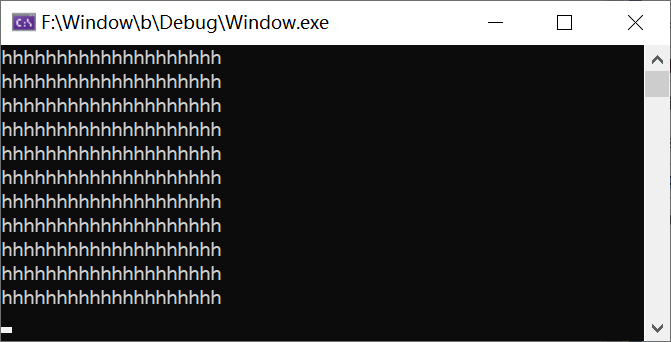

> The console program will flicker frantically during operation; this issue will be resolved below.

Compared to the above console program, GUI essentially encapsulates keyboard and mouse input into an interface, where `width` and `height` are the window dimensions, and colors are filled in pixels at corresponding coordinates.

The key factor in choosing a framework is its ecosystem, specifically reflected in:

- More users and teammates, making recruitment easier
- Wide framework coverage, rich tool libraries, and complete documentation
- Long-term official maintenance, high iteration frequency, and fewer bugs

Among the above frameworks, the best one without a doubt is Qt.

Most modules in Qt follow the LGPL license, which allows us to use modules in the form of dynamic linking and release commercial software. For the open-source license of each module, please refer to:

- https://doc.qt.io/qt-6/licenses-used-in-qt.html

If you want to modify Qt source code or use some commercial modules, you need to purchase a commercial license for Qt. For details, please refer to:

- https://www.qt.io/licensing/open-source-lgpl-obligations

Due to Qt's strict open-source license, independence from C++ standards, and large size, many teams may still choose frameworks like WxWidget, C++ Builder, duilib, or GTK. While MFC, FLTK, and EasyX may be good GUI frameworks, their development ecosystems are not optimistic. If you have a choice, the author recommends not using them.

Dear ImGUI and Nuklear are lightweight, portable GUI toolkits following the **Immediate Mode**. Essentially, they provide some control interfaces for developers to complete the drawing of a frame of graphics. Taking ImGUI as an example, using the following code:

```c++
ImGui::Text("Hello Dear ImGUI");
static bool CheckState;
ImGui::Checkbox("CheckBox ", &CheckState);
```

Can generate such an interface:

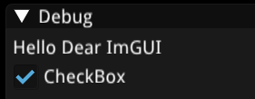

**Immediate Mode** is mainly reflected in passing the pointer of the variable `CheckState` into the "control", while in traditional **Retained Mode**, such as in Qt, the code might look like this:

```c++
static bool CheckState;
QCheckBox* CheckBox = new QCheckBox;
CheckBox->setCheckState(CheckState ? Qt::Checked : Qt::Unchecked);        // Initialization
QObject::connect(CheckBox, &QCheckBox::stateChanged, [&](int state) {     // Bind signal-slot
    CheckState = (state == Qt::Checked);
});
```

It can be seen that **QCheckBox** does not use the pointer of `CheckState`; instead, it sets the initial state of the control through `CheckState`. When the control's `stateChanged` event occurs, it then sets the value of `CheckState`. That is, the control itself holds its own State, while **Immediate Mode emphasizes statelessness** by embedding the state into the control.

During development, storing too many local states requires writing a lot of code to keep them synchronized, which may accidentally introduce bugs—for example, easily causing certain events to execute multiple times or even enter an infinite loop.

For example, adjusting a color:

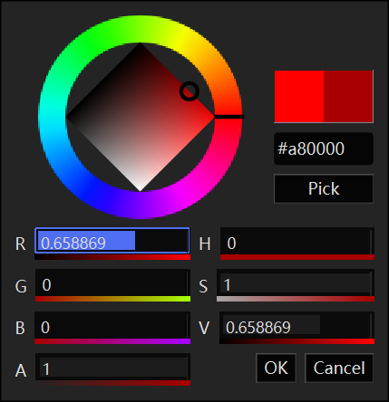

Using a color palette, dragging or entering channel values, hexadecimal input, screen color picking, etc., can all adjust the same color value. If using Retained Mode, after modifying the color through one method, other controls must be manually adjusted to ensure color synchronization. Although following some design patterns can solve this problem, Immediate Mode has natural advantages in such application scenarios. For debates about their differences, please refer to:

- [Zhihu: What are the Connections and Differences Between Retained and IMGUI?](https://www.zhihu.com/question/39093254/answer/1351958747)

Does this mean Dear ImGUI is better than Qt? Not necessarily. The author's views are as follows:

- **Immediate Mode is more suitable for game engines, but Dear ImGUI is still insufficient.** It is just a small GUI toolkit. Although it is indeed easy to get started and can produce good interface effects, the development of large-scale software systems is an engineering art. A lower threshold will bring more problems. Unless there are enough people and energy for continuous iteration, developing with native Dear ImGUI is simply a disaster...

  > Here's an answer that, although not about Dear ImGUI, well exposes the problems of such frameworks: https://www.zhihu.com/question/66934513/answer/248036488

- **Retained Mode is just a way of control architecture; Qt != Retained Mode.** Although the official controls of most Native UI frameworks use Retained Mode, you can also use Immediate Mode on these frameworks if you want.

  > [Why Qt and not IMGUI?](https://deplinenoise.wordpress.com/2017/03/05/why-qt-and-not-imgui/)

Does this mean Qt is better? Not necessarily. Using Qt means introducing its entire Core and Widget modules along with moc, and since we cannot modify its source code due to open-source licensing, it is mostly used as an editor in game engines, such as:

- [O3DE](https://www.o3de.org/): https://github.com/o3de/o3de

Currently, it is not suitable for in-game UI solutions:

- Yunfeng's BLOG—Choice of Game UI Modules: https://blog.codingnow.com/2020/07/game_ui.html

Slate in UE is an excellent underlying UI framework:

- https://docs.unrealengine.com/5.1/en-US/understanding-the-slate-ui-architecture-in-unreal-engine/

However, in the subsequent graphics-related tutorials of this series, Qt will be used as the main editor with ImGUI embedded for scene editing, mainly for the following reasons:

- Qt has cross-platform Window encapsulation, allowing access to Handles for special processing using Native APIs
- Qt has an elegant reflection system, facilitating editor construction. Using Signal-Slot can well decouple logic and improve readability
- Qt has an independent container library, allowing us to avoid the torture of STL
- Qt has many extended libraries with unified interface styles, such as basic math libraries, image codec libraries, and multimedia libraries, which can make learning outcomes more easily applicable
- Qt 6.0 and later introduced RHI (Render Hardware Interface) supporting OpenGL, DX11, Vulkan, and Metal. It is much easier to use than OpenGL, and its architecture uses Vulkan-style glsl and modern graphics APIs without modification like bgfx. Most importantly, using Qt's RHI can well compatible with Native APIs, facilitating the use of advanced features provided by graphics APIs or hardware

Many architectural structures in Qt can be mapped to Unreal Engine. If your goal is Unreal Engine, Qt is definitely the best springboard because Qt's official code is highly readable and has a large number of documents, demos, and tutorials.

## Platform Basics

A GUI program will be displayed on the screen. To systematically manage the pixels on the screen, the operating system provides a structure called Window. On Windows 10, a standard Window is as follows, with a title bar (icon, title text, minimize button, maximize button, close button):

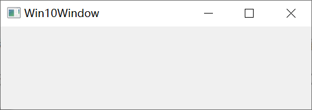

You can create a Window in the following way:

- Create a new `CMakeLists.txt` and `main.cpp` file

- Fill `CMakeLists.txt` with:

  ```cmake
  cmake_minimum_required(VERSION 3.12)
  project(Window)
  add_executable(Window WIN32 main.cpp)
  ```

  > Win32 indicates that the executable is a Win32 window, corresponding to `Project Settings` - `Linker` - `System` - `Subsystem` - `Windows` in Visual Studio
  >
  > 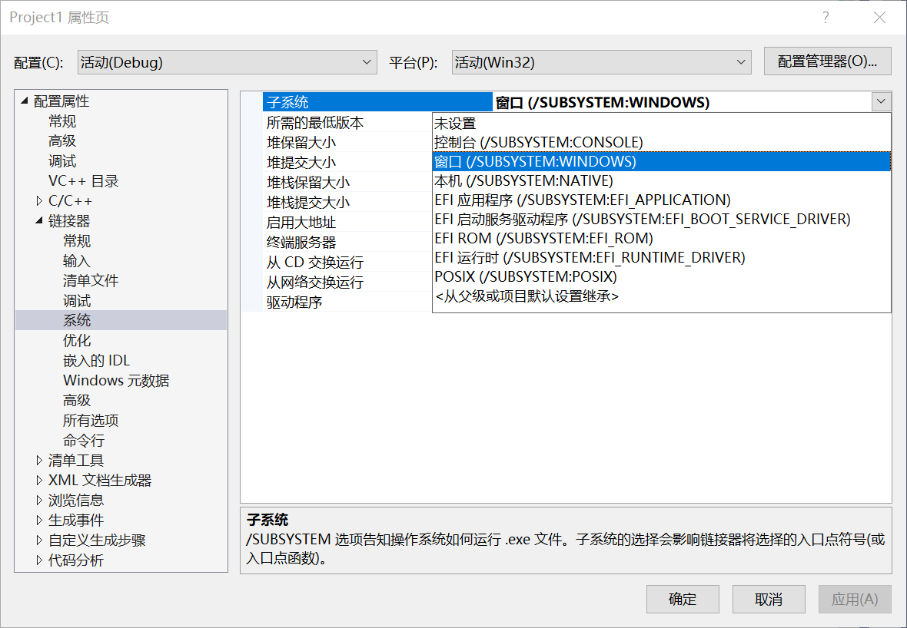

- Fill `main.cpp` with:

  ```c++
  #ifndef UNICODE
  #define UNICODE
  #endif 

  #include <windows.h>

  LRESULT CALLBACK WindowProc(HWND hwnd, UINT uMsg, WPARAM wParam, LPARAM lParam);

  int WINAPI wWinMain(HINSTANCE hInstance, HINSTANCE hPrevInstance, PWSTR pCmdLine, int nCmdShow)
  {
      // Register the window class.
      const wchar_t CLASS_NAME[]  = L"Sample Window Class";
      
      WNDCLASS wc = { };

      wc.lpfnWndProc   = WindowProc;
      wc.hInstance     = hInstance;
      wc.lpszClassName = CLASS_NAME;

      RegisterClass(&wc);

      // Create the window.

      HWND hwnd = CreateWindowEx(
          0,                              // Optional window styles.
          CLASS_NAME,                     // Window class
          L"Learn to Program Windows",    // Window text
          WS_OVERLAPPEDWINDOW,            // Window style

          // Size and position
          CW_USEDEFAULT, CW_USEDEFAULT, CW_USEDEFAULT, CW_USEDEFAULT,

          NULL,       // Parent window    
          NULL,       // Menu
          hInstance,  // Instance handle
          NULL        // Additional application data
          );

      if (hwnd == NULL)
      {
          return 0;
      }

      ShowWindow(hwnd, nCmdShow);

      // Run the message loop.

      MSG msg = { };
      while (GetMessage(&msg, NULL, 0, 0) > 0)
      {
          TranslateMessage(&msg);
          DispatchMessage(&msg);
      }

      return 0;
  }

  LRESULT CALLBACK WindowProc(HWND hwnd, UINT uMsg, WPARAM wParam, LPARAM lParam)
  {
      switch (uMsg)
      {
      case WM_DESTROY:
          PostQuitMessage(0);
          return 0;

      case WM_PAINT:
          {
              PAINTSTRUCT ps;
              HDC hdc = BeginPaint(hwnd, &ps);

              // All painting occurs here, between BeginPaint and EndPaint.

              FillRect(hdc, &ps.rcPaint, (HBRUSH) (COLOR_WINDOW+1));

              EndPaint(hwnd, &ps);
          }
          return 0;

      }
      return DefWindowProc(hwnd, uMsg, wParam, lParam);
  }
  ```

- Use CMake command line or CMake GUI to generate Visual Studio project files. In the `Solution Explorer`, right-click the Window project - `Set as StartUp Project`, and execute to see:

  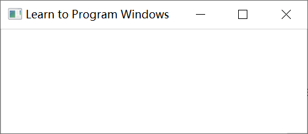

The above code comes from Microsoft's official tutorial. Interested readers can go through it themselves:

- https://learn.microsoft.com/en-us/windows/win32/learnwin32/your-first-windows-program

### Spy++

After seeing this, do you think a Window is a box with maximize, minimize, and close buttons?

Not exactly. In Visual Studio, you can find **Spy++**: `Menu Bar`—`Tools`—`Spy++`

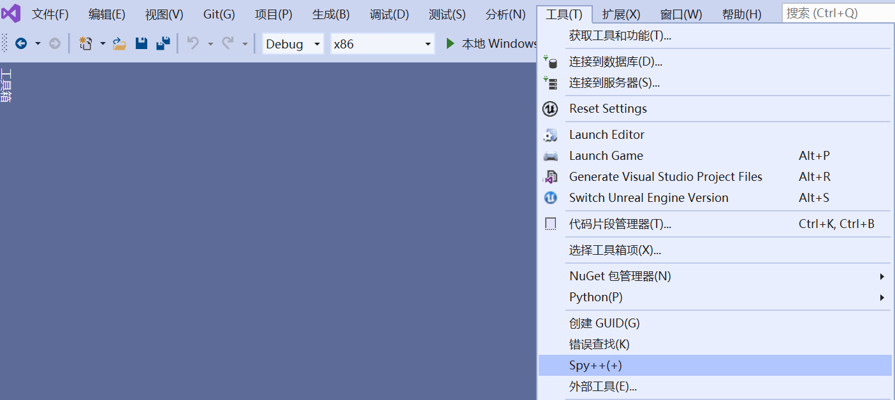

Using it, you can view all Windows in the system:

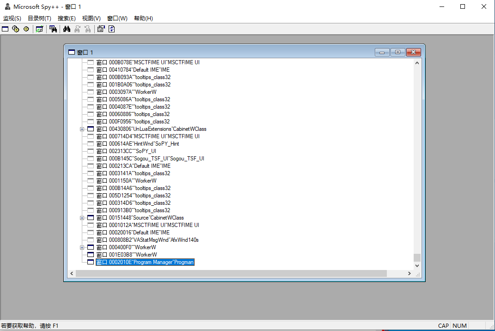

> Spy++ displays all windows hierarchically from bottom to top, meaning everything you see on the monitor can be traced—for example, the bottom layer is the desktop (wallpaper).

Using its window search tool (`Menu Bar`—`Search`—`Find Window`—`Drag` the crosshair below to any window), you can locate the specific `Item` in Spy++, which is somewhat similar to the widget reflector in UE.

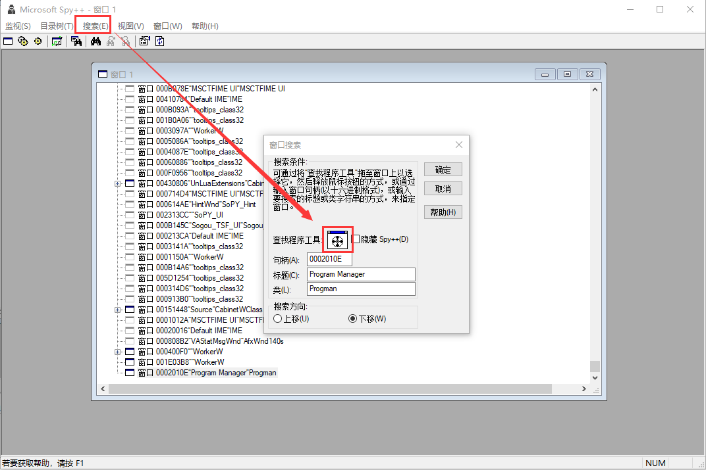

Through the above tool, you can find that windows are hierarchical and may not have a close button or even a border.

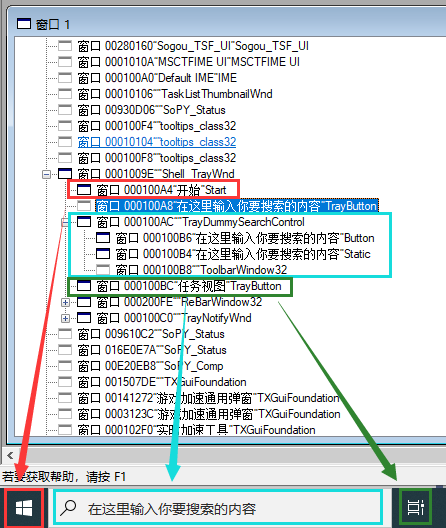

On Windows, the border and title bar are controlled by the system and do not belong to the program itself. We call this the **Non-Client Area**.

The area inside the border can be freely drawn by the program, which is called the **Client Area**.

- [What is windows client and non-client area?](https://www.equestionanswers.com/vcpp/client-non-client-area.php)

Microsoft may have realized that its title bar limits UI beautification, so windows also support setting **borderless and transparent background** properties. Many software use this method to draw **shaped windows**, such as QQ Music's player:


System interaction events are passed to the currently **Activated** window, while windows in the Unactivated state are generally displayed in gray by the system:

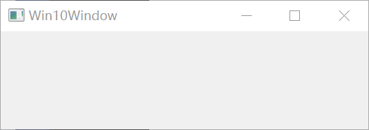

> Generally, there will only be one activated window, which means only one window can receive input events from the computer at present. However, some methods can break this rule, such as [hooks](https://baike.baidu.com/item/%E9%92%A9%E5%AD%90).

### Multiple Buffering

In the previous console program, the page flickers frantically because we are adding things to a buffer little by little, and the console window is previewing this process. Due to the fast refresh speed, flickering occurs. To solve this type of problem, the concept of **Multiple Buffering** was proposed in computer science:

- The buffer used for console preview is called the **front buffer**. The core of multiple buffering is that we do not directly operate the front buffer; instead, after processing the **back buffer**, we **submit it uniformly** to the front buffer. This can effectively avoid flickering and tearing.

> When mentioning uniform submission, do you think of **for copy** and **memcpy** from the previous section?
>
> To put all oranges from one basket to another, is it faster to put them one by one or lift the basket and pour them directly? Obviously the latter.
>
> Hardware and interface providers clearly understand this principle. In most cases, they support operations like Map and Blit.

An example of using double buffering in the console is as follows:

```c++
#include <conio.h>        // Console IO
#include <iostream>
#include <Windows.h>

const int width = 20;
const int height = 20;
const int MaxBufferSize = width * height * 10;

void UseSingleBuffer() {
    char currentChar = '*';
    while (true) {
        if (kbhit()) {             // kbhit can determine if there is a key input currently
            currentChar = getch(); // getch is a non-echo input function; unlike getchar, the input key will not be displayed on the console
        }
        system("cls");             // Clear console screen
        for (int y = 0; y < height; y++) {
            for (int x = 0; x < width; x++) {
                std::cout << currentChar;
            }
            std::cout << std::endl;
        }
    }
}

void UseDoubleBuffer() {
    HANDLE frontendBuffer = GetStdHandle(STD_OUTPUT_HANDLE);     // Get the default buffer

    HANDLE backendBuffer = CreateConsoleScreenBuffer(            // Create a new buffer as the back buffer
        GENERIC_READ | GENERIC_WRITE,
        FILE_SHARE_READ | FILE_SHARE_WRITE,
        NULL,
        CONSOLE_TEXTMODE_BUFFER,
        NULL
    );

    // Hide the cursors of both buffers
    CONSOLE_CURSOR_INFO cci;
    cci.bVisible = FALSE;
    cci.dwSize = 1;
    SetConsoleCursorInfo(frontendBuffer, &cci);
    SetConsoleCursorInfo(backendBuffer, &cci);


    char bufferData[MaxBufferSize];     // Buffer data temporary storage area
    DWORD bufferLength = 0;
    COORD zeroCoord = { 0, 0 };
    char currentChar = '*';

    while (true) {
        if (kbhit()) {
            currentChar = getch();
        }
        bufferLength = 0;

        CONSOLE_SCREEN_BUFFER_INFO backendBufferInfo;          // Get the number of characters per line in backendBuffer
        GetConsoleScreenBufferInfo(backendBuffer, &backendBufferInfo);
        int lineWidth = backendBufferInfo.srWindow.Right - backendBufferInfo.srWindow.Left + 1;

        for (int y = 0; y < height; y++) {
            for (int x = 0; x < width; x++) {
                bufferData[bufferLength++] = currentChar;
            }
            while (bufferLength % lineWidth != 0) {             // Fill characters to achieve line break effect
                bufferData[bufferLength++] = ' ';
            }
        }

        // Write bufferData of length bufferLength starting from zeroCoord in backendBuffer
        WriteConsoleOutputCharacterA(backendBuffer, bufferData, bufferLength, zeroCoord, &bufferLength);
        SetConsoleActiveScreenBuffer(backendBuffer);            // Display backendBuffer
        std::swap(backendBuffer, frontendBuffer);               // Swap front and back buffer operation handles; frontendBuffer will be the backendBuffer for the next loop
    }
}

int main() {
    // UseSingleBuffer();
    UseDoubleBuffer();
    return 0;
}
```

Most GUI frameworks use double buffering, while games even use triple buffering. Generally, we call this structure a [swap chain](https://en.wikipedia.org/wiki/Swap_chain).

For details about multiple buffering, you can refer to:

- https://en.wikipedia.org/wiki/Multiple_buffering

### DPI

> The number of pixels per inch length of an image.
>
> DPI (Dots Per Inch) is a unit of measurement used for dot-matrix [digital images](https://baike.baidu.com/item/数码影像/6208065?fromModule=lemma_inlink), referring to the number of sampling, displayable, or output points per [inch](https://baike.baidu.com/item/英寸?fromModule=lemma_inlink) length.

On Windows, the system DPI is adjusted by setting **Scale and Layout**.

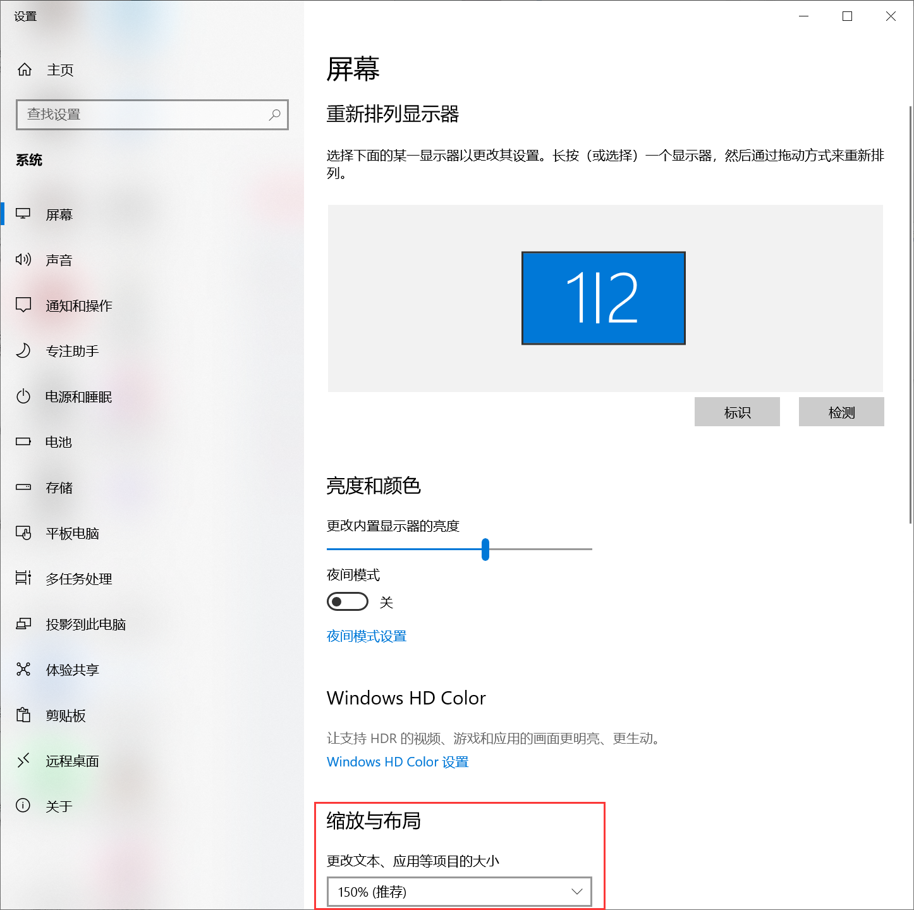

The operating system will adjust the window size and content according to a certain configurable mechanism based on DPI changes. For details about DPI awareness, please refer to:

- https://learn.microsoft.com/zh-cn/windows/win32/hidpi/high-dpi-desktop-application-development-on-windows
- https://doc.qt.io/qt-6/highdpi.html
- https://en.wikipedia.org/wiki/Dots_per_inch

During GUI development, supporting multi-DPI preview has always been a headache because it is difficult to adjust the **effect and layout** of the **entire interface** through a few parameters.

A major pitfall in graphics development is:

- Window Size != Buffer Size. Many friends create Frame Buffers using Window Size, which works normally on computers with 100% scaling but has problems in other cases.

## Qt Basics

### Installation

https://courses.qt.io/how-to-install-qt/index.html#/lessons/WDj_gIccDJa6gmhH_-3P7uC2QDaZHbYA


If you want to continue learning the subsequent graphics chapters, please select `Custom installation` during installation and ensure the following modules are installed:

- Any version above Qt 6, preferably the latest (e.g., 6.5.2 beta), including:
  - **MSVC 2019 64-bit**: Supports Qt development using Visual Studio
  - **Sources**: Qt source code
  - **Qt 5 Compatibility Module**: Coexistence module for Qt 5
  - **Qt Shader Tools**: Qt's shader tool for converting glsl to hlsl, msl
  - Qt Debug Information Files: Optional, large size, used for debugging Qt source code
- Developers and Designer Tools
  - **Debugging Tools For Windows**: Windows debugging tools
  - **CMake**: Build tool; no need to install if already present
  - Qt Installer Framework: Optional, used to package Qt programs into installation packages

In addition, the author also recommends not using **Designer (*.ui)** and **Design Studio** in the early stages of learning, as they will be the biggest resistance to your early improvement.

### Getting Started

- Create a new `CMakeLists.txt` and `main.cpp` file

- Fill `CMakeLists.txt` with:

  ```cmake
  cmake_minimum_required(VERSION 3.12)
  project(QtExample)

  add_executable(QtExample main.cpp)

  find_package(Qt6 COMPONENTS Core Widgets REQUIRED)      # Find Qt6 modules

  target_link_libraries(QtExample                         # Link Core and Widget to QtExample
      PRIVATE 
          Qt6::Core                     
          Qt6::Widgets
  )
  ```

- Fill `main.cpp` with:

  ```c++
  #include <QApplication>
  #include <QWindow>

  int main(int argc, char* argv[]) {
      QApplication a(argc, argv);
      QWindow window;
      window.setTitle("Hello Qt!");
      window.show();
      return a.exec();
  }
  ```

- Use `Cmake command line` or `CMake GUI` to generate a Visual Studio project

- Select **QtExample** as the startup project, compile and run to see:

  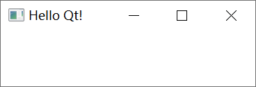

[**QApplication**](https://doc.qt.io/qt-6/qapplication.html) is Qt's scheduling and control center for the entire program. Through it, you can:

- Parse program input parameters (i.e., `argument count` and `argument value` above)
- Manage event communication between objects
- Handle the program's event loop
- Access all Windows and Widgets
- Provide various operations related to program processes
- ...

> Corresponds to **GenericApplication** and **SlateApplication** in UE

You can operate it anywhere in the program through `QApplication::instance()` or the macro `qApp`. Check the official documentation to know what it can do:

- https://doc.qt.io/qt-6/qapplication.html

QApplication inherits from QGuiApplication and comes from the **Widgets module**. If you need a console program instead of a window, using **[QCoreApplication](https://doc.qt.io/qt-6/qcoreapplication.html)** from the **Core module** is sufficient.

> In actual application development, you can derive QApplication and add some global management operations to it.

`QApplication::exec()` will start Qt's event loop, which is equivalent to:

```c++
#include <QApplication>
#include <QWindow>

int main(int argc, char* argv[]) {
    QApplication a(argc, argv);
    Q_ASSERT(QApplication::instance() == &a);

    QWindow window;
    window.setTitle("Hello Qt!");
    window.show();
    while (true) {                        // QApplication has an internal exit signal, but it is private, so it can only be a dead loop here
        QApplication::processEvents();    // Comment it out, and you will find the window can no longer respond to interaction events
    }
}
```

> During development, you may often perform some slow operations that cause the interface to freeze. At this time, you can manually call `QApplication::processEvents()` in the middle of these operations to allow the interface to refresh.

### Object

Most classes in Qt are derived from [QObject](https://doc.qt.io/qt-6/qobject.html), which facilitates managing all its child objects and provides mechanisms such as reflection, Signal-Slot, garbage collection, and events. An example of a QObject subclass definition is as follows:

```c++
class QExmapleClass : public QObject {
    Q_OBJECT            // Q_OBJECT is the entry point for Qt reflection data; it can be omitted if reflection functionality is not needed
};
```

#### Meta Object System

Qt's meta-object system provides mechanisms such as Signal-Slot, runtime type information, and dynamic property systems.

To enable the reflection function of QObject in a project using CMake as the build system, you need to enable [AUTOMOC](https://cmake.org/cmake/help/latest/prop_tgt/AUTOMOC.html) before `add_executable` in `CMakeLists.txt`:

```cmake
set(CMAKE_AUTOMOC ON)
```

`AUTOMOC` will automatically detect whether macros like `Q_OBJECT` exist in the header file. If they exist, Qt's reflection compiler **moc** will scan the file, and after scanning, a `*.moc` file will be generated, which contains the definition of Qt reflection data.

You can find Qt's moc in a path similar to the following. Open cmd in the current directory and execute `moc -h` to see its help documentation.

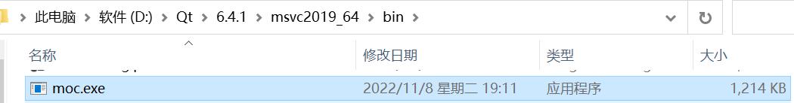

The source code of moc is located in the following path:

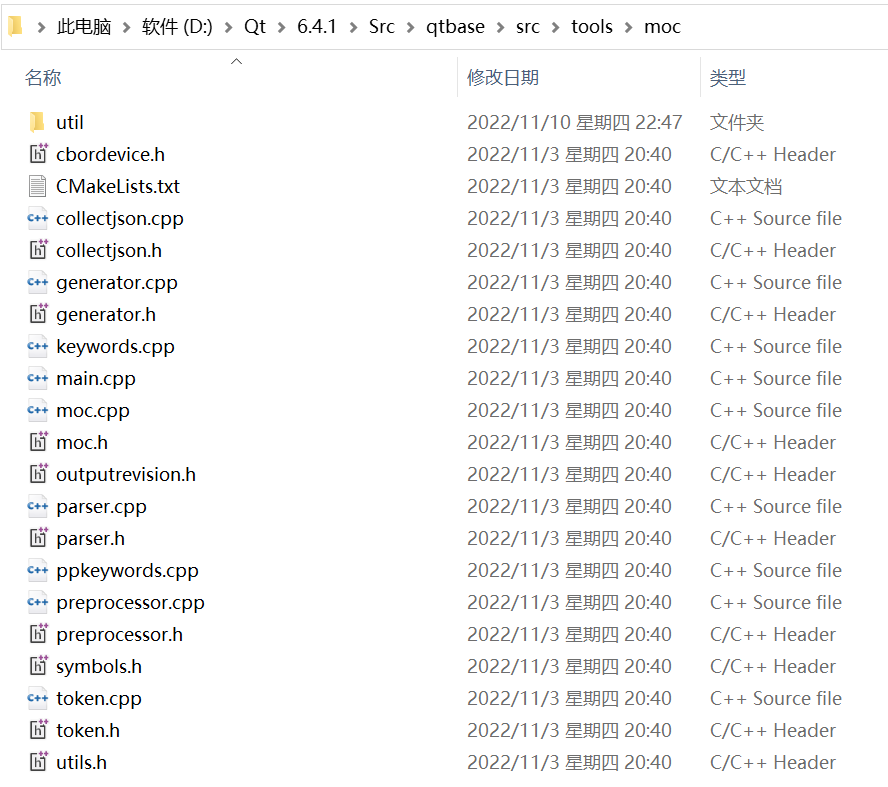

> UE's reflection compiler is UHT (Unreal Header Tool)

For `Q_OBJECT` written in `*.cpp`, you need to manually `include` `*.moc` at the end to trigger the execution of moc. For example:

```c++
/* main.cpp
*/

#include <QApplication>
#include <QMetaType>
#include <QMetaProperty>

class QExmapleClass : public QObject {
    Q_OBJECT
    Q_PROPERTY(int Var READ getVar WRITE setVar)                // Declare MetaProperty through Getter and Setter
public:
    int getVar() {
        return mVar;
    }
    void setVar(int inVar) {
        mVar = inVar;
    }

    Q_INVOKABLE void sayHello(const QString& inName) {         // Declare MetaMethod
        qDebug() << "Hello " << inName.toLatin1().data();
    }

    enum Number {
        Zero, One, Two, Three
    };
    Q_ENUM(Number)                                             // Declare MetaEnum
protected:
    int mVar= 5;
};

int main(int argc, char* argv[]) {
    QApplication a(argc, argv);

    QExmapleClass obj;

    // Get MetaObject
    const QMetaObject* metaObjectFromStatic = &QExmapleClass::staticMetaObject;
    const QMetaObject* metaObjectFromVirtual = obj.metaObject();

    // Read and write properties
    obj.setProperty("Var", QVariant::fromValue<int>(10));
    QVariant var = obj.property("Var");
    qDebug() << "Property : " << var.value<int>();

    // Call function
    qDebug() << "Invoke Method Begin:";
    metaObjectFromStatic->invokeMethod(&obj, "sayHello", Q_ARG(QString, "Boy"));
    qDebug() << "Invoke Method End";

    // MetaType operation
    QMetaType metaType = var.metaType();
    qDebug() << "Meta Type : " << metaType.name() << " ID: " << metaType.id();

    // Traverse and read/write properties in MetaObject, and print property types
    for (int i = metaObjectFromStatic->propertyOffset(); i < metaObjectFromStatic->propertyCount(); i++) {
        const QMetaProperty& metaProperty = metaObjectFromStatic->property(i);
        metaProperty.write(&obj, QVariant::fromValue<int>(15));
        QVariant varFromMetaObject = metaProperty.read(&obj);
        qDebug() << "Meta Property : " << metaProperty.name() << varFromMetaObject;
    }

    // Traverse functions in MetaObject and print parameter information
    for (int i = metaObjectFromStatic->methodOffset(); i < metaObjectFromStatic->methodCount(); i++) {
        const QMetaMethod& metaMethod = metaObjectFromStatic->method(i);
        QByteArrayList paramNames = metaMethod.parameterNames();
        QStringList paramsDefineList;
        for (int j = 0; j < metaMethod.parameterCount(); j++) {
            paramsDefineList << metaMethod.parameterTypeName(j) + " " + paramNames[j];
        }
        qDebug() << QString("Meta Method : %1 %2(%3)")
            .arg(metaMethod.typeName())
            .arg(metaMethod.name())
            .arg(paramsDefineList.join(',')).toLatin1().data();
    }

    // Traverse enums in MetaObject and print enum information
    for (int i = metaObjectFromStatic->enumeratorOffset(); i < metaObjectFromStatic->enumeratorCount(); i++) {
        const QMetaEnum& metaEnum = metaObjectFromStatic->enumerator(i);
        qDebug() << "Meta Enum : " << metaEnum.name();
        for (int j = 0; j < metaEnum.keyCount(); j++) {
            qDebug() << "-- " << metaEnum.key(j) << " : " << metaEnum.value(j);
        }
    }
    return a.exec();
}

#include "main.moc"        // Must include main.moc to trigger moc compilation
```

The above code is a good example of Qt reflection. For more detailed content, please refer to:

- Qt Meta Object System: https://doc.qt.io/qt-6/metaobjects.html
- QMetaObject: https://doc.qt.io/qt-6/qmetaobject.html
- Qt Property System: https://doc.qt.io/qt-6/properties.html

#### Signal-Slot

The signal-slot mechanism is used for communication between objects and is a core feature of Qt. A pseudocode example of its function is as follows:

```c++
class Student{
    Signal nameChanged(string OldName, string NewName);
public:
    void setName(string inName){
        nameChanged.Emit(mName, inName);
        mName = inName;
    }
private:
    string mName;
};

class Teacher{
public:
    void OnStudentNameChanged(string OldName, string NewName){
        // do something
    }
};

class Class{
protected:
    void connectEveryone(){
         for(auto Student:mStudents){
             Student.nameChanged.Connect(mTeacher, &Teacher::OnStudentNameChanged);
         }
    }
private:
    Teacher mTeacher;
    TArray<Student> mStudents;
};
```

Through the connectEveryone function, it can be seen as: "The teacher tells the students in the class that if they change their names, please notify me."

There is no direct modification to the structures of Teacher and Student; instead, the relationship between the two is bound in a third-party collection (the class), thus achieving good decoupling.

> This mechanism corresponds to delegates in UE, which are more detailed than Qt's signal-slot. However, the translation has some flaws. If it were also called Signal, it would be easier to evoke developers' associations and adopt the correct usage.

For more detailed explanations, please refer to:

- https://doc.qt.io/qt-6/signalsandslots.html

#### Event System

In Qt, an event refers to an instance object of a subclass of the abstract class [QEvent](https://doc.qt.io/qt-6/qevent.html), which is used to describe the result of internal or external activities of the application. In function, it can be regarded as a heavyweight Single-Slot. The interaction mechanism in QWidget is implemented through events.

When an event occurs, Qt represents it by constructing an appropriate QEvent subclass instance and calls:

- [static bool QCoreApplication::sendEvent(QObject* *receiver*, QEvent event)](https://doc.qt.io/qt-6/qcoreapplication.html#sendEvent)

To send the event to the corresponding `QObject`, and QObject has a virtual function:

- [virtual bool QObject::event( QEvent* *e* )](https://doc.qt.io/qt-6/qobject.html#event)

By overriding `event`, you can handle events or further distribute them to other functions.

In addition, Qt also supports an event listener mechanism. You can override QObject's virtual function:

- [bool QObject:: eventFilter ( QObject * *watched* , QEvent* *event* )](https://doc.qt.io/qt-6/qobject.html#eventFilter)

To make it a `filterObj`, then call:

- [void QObject:: installEventFilter ( QObject* *filterObj* )](https://doc.qt.io/qt-6/qobject.html#installEventFilter)

Thus allowing this object to act as an event listener for other objects.

For details about the event system, please refer to:

- https://doc.qt.io/qt-6/eventsandfilters.html

#### Garbage Collection

As mentioned in the previous section on memory management, Qt's GC is very simple: a QObject can specify a unique parent, and when the parent is released, the children will also be released. In addition, you can use [QObject::deleteLater](https://doc.qt.io/qt-6/qobject.html#deleteLater) to delay the release of a QObject.

In QWidget, adding child controls will implicitly set the parent. In most cases, there is no need to manually delete them, but you need to pay attention to controlling the parent's lifecycle. If a node in the object tree has a flaw, the entire subtree of objects cannot be released.

### Window

Earlier, we used the Win API to simply create a window. That code is not at all **"modern"**—a large number of macros and strange naming conventions.

**QPlatformWindow** is the underlying cross-platform Window encapsulation detail of Qt. Qt wraps it to provide an interface, which is [**QWindow**](https://doc.qt.io/qt-6/qwindow.html).

> This corresponds to **GenericWindow** and **SWindow** in UE.
>
> I definitely don't believe there's no "affair" between them 0.0

In the client area of a Window, there are often many small widgets, such as the following window:

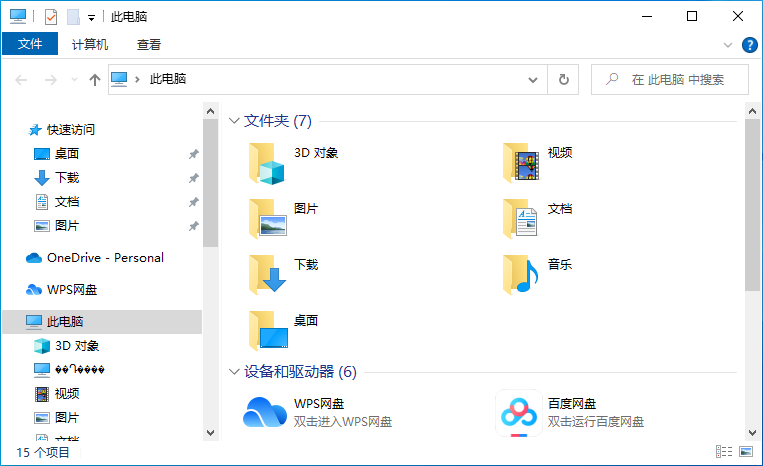

It has many buttons and controls. If we simply use a window's click event (which can get the mouse coordinates) to determine which part of the window was clicked and then handle the drawing little by little, when the window's complexity increases, the entire code will become extremely chaotic and difficult to manage. Although Windows provides a SubWindow mechanism, due to the high cost of maintaining a Window, many frameworks have proposed the concept of **Widget**.

> Corresponds to QWidget in Qt and SWidget in UE.

A Widget can be regarded as a lightweight Window, with the following characteristics:

- In display, a Widget can be regarded as a block, which essentially divides the client area of the Window. This area is drawn by the Widget itself.
- In logic, Widgets have a tree-like hierarchy, and events are often passed from top to bottom.

### Widget

[**QWidget**](https://doc.qt.io/qt-6/qwidget.html) is the core of Qt GUI. Most visual widgets in Qt are derived from it.

It is also very simple to create:

```c++
#include <QApplication>
#include <QWidget>

int main(int argc, char* argv[]) {
    QApplication a(argc, argv);
    QWidget widget;
    widget.setWindowTitle("Hello QWidget!");
    widget.show();
    return a.exec();
}
```

In the development of a single widget, it mainly involves setting the [Properties](https://doc.qt.io/qt-6/qwidget.html#protected-functions) of QWidget:

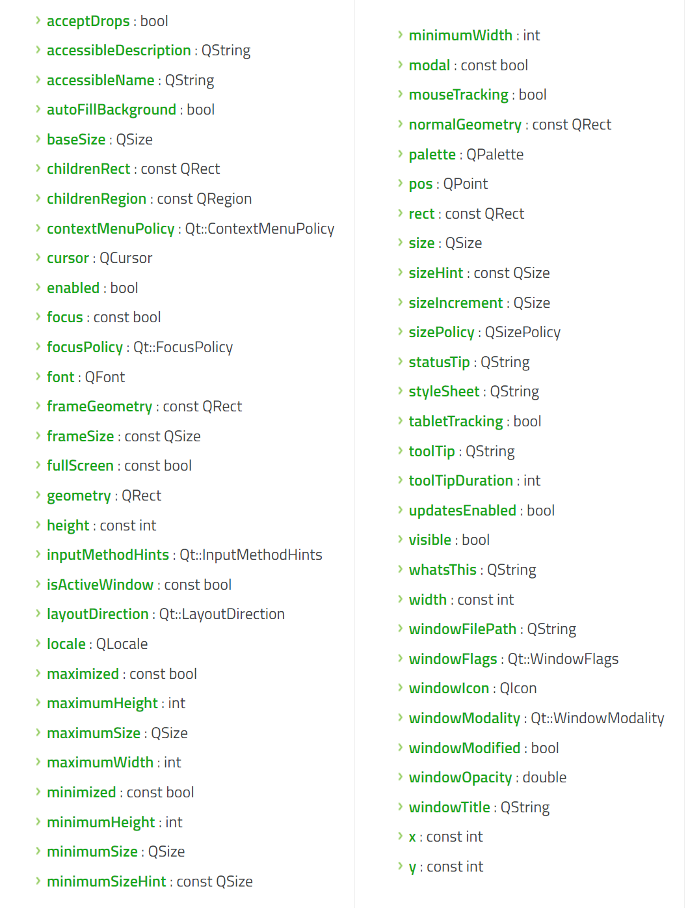

And overriding [Events](https://doc.qt.io/qt-6/qwidget.html#protected-functions):

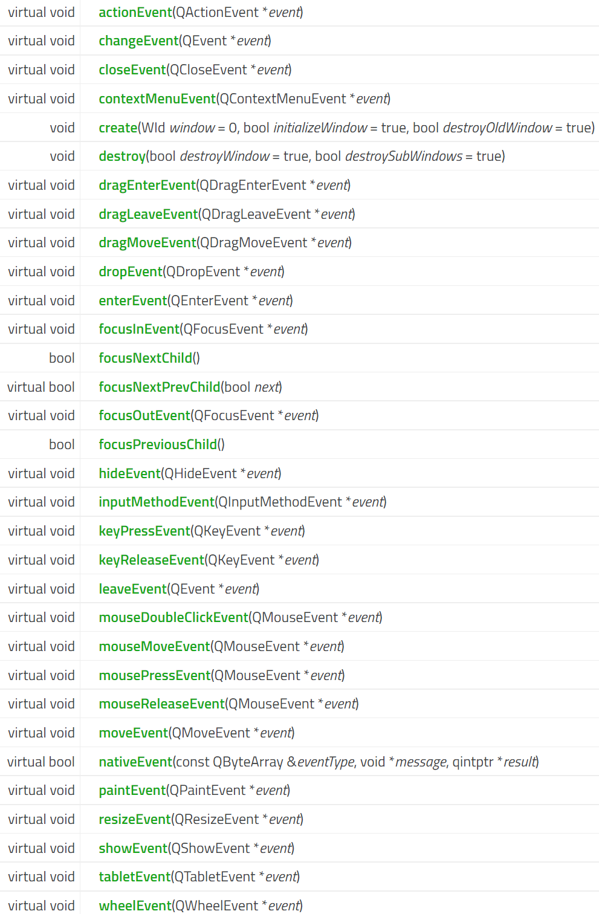

To achieve various complex interface effects and interaction logic.

#### WindowOption

In general, developers may not even come into contact with `QWindow` because the outermost (or top-level) `QWidget` will automatically generate a `QWindow`. We can make some settings on this QWidget to affect the generation of the Window:

- [WindowFlag](https://doc.qt.io/qt-6/qt.html#WindowType-enum): Adjust the Window's flags, such as pop-up windows, dialog boxes, tooltips, borderless...

- [WindowModality](https://doc.qt.io/qt-6/qt.html#WindowModality-enum): Set a modal window. A modal window will block input to other windows, generally used to force the user to select certain options before continuing execution.

- [WindowState](https://doc.qt.io/qt-6/qt.html#WindowState-enum): The states of a Window include: `default`, `minimized`, `maximized`, `fullscreen (borderless)`, `activated`. You can call `setWindowState`, and Qt also provides some convenient APIs, such as [activateWindow()](https://doc.qt.io/qt-6/qwidget.html#activateWindow).

For example, code like this:

```c++
QWidget widget;
widget.setWindowFlags(Qt::FramelessWindowHint|Qt::Tool);
widget.resize(200,200);
widget.show();
```

You can see a 200*200 gray square on the screen, and its icon is also hidden in the taskbar below.

It should be noted that a Window is not created when creating a Widget. Most of the time, our settings for the Widget are just adjusting its parameter state machine. Only when the event is executed will the actual operation be performed according to these states. For example, you can only get the Window's handle after calling show.

#### **[Attribute](https://doc.qt.io/qt-6/qt.html#WidgetAttribute-enum)**

In the Qt namespace, there is a set of enumeration values starting with `WA_` that can be used to set [WidgetAttribute](https://doc.qt.io/qt-6/qt.html#WidgetAttribute-enum). You can set many useful properties for QWidget, among which the commonly used ones are:

- Qt::WA_DeleteOnClose: Destroy the object when the window is closed
- Qt::WA_TranslucentBackground: Make the window's background transparent

#### Event

The display of a GUI lies in QWidget's [paintEvent](https://doc.qt.io/qt-6/qwidget.html#paintEvent). We can override it and use [QPainter](https://doc.qt.io/qt-6/qpainter.html) to draw any graphics we want.

The essence of GUI is nothing more than using various interaction events to adjust the property state machine and switch the drawing results of paintEvent.

This is a good example:

```c++
#include <QApplication>
#include <QWidget>
#include <QMouseEvent>
#include <QPainter>

class QExmapleWidget:public QWidget {
    Q_OBJECT
private:
    QPoint mMousePressPos;
    bool bIsHovered = false;
protected:
    void mousePressEvent(QMouseEvent* event) override {
        if (event->button() == Qt::LeftButton)        // Record the position when the left mouse button is pressed
            mMousePressPos = event->pos();
    }
    void mouseMoveEvent(QMouseEvent* event) override {
        if (event->buttons() & Qt::LeftButton)        // Adjust the Widget's position when dragging with the left mouse button pressed
            move(event->pos() + this->pos() - mMousePressPos);
    }

    void enterEvent(QEnterEvent* event) override {
        bIsHovered = true;                             // Mouse enters the Widget
        setCursor(Qt::ClosedHandCursor);               // Set the shape of the mouse cursor
        update();                                      // Request to refresh the interface
    }

    void leaveEvent(QEvent* event) override {
        bIsHovered = false;                            // Mouse leaves the Widget
        setCursor(Qt::ArrowCursor);                    // Set the shape of the mouse cursor
        update();                                      // Request to refresh the interface
    }

    void paintEvent(QPaintEvent* event) override {
        QPainter painter(this);

        painter.fillRect(this->rect(), bIsHovered ? Qt::green : QColor(0, 100, 200));    // Fill color in the area

        painter.setPen(QPen(Qt::white));
        painter.setFont(QFont("", 20, 90));                                             // Use the default font and set the font size and weight
        painter.drawText(this->rect(), Qt::AlignCenter, "Hello Qt");                    // Draw text
    }
};

int main(int argc, char* argv[]) {
    QApplication a(argc, argv);
    QExmapleWidget widget;
    widget.setWindowFlags(Qt::FramelessWindowHint);         // Borderless
    widget.setAttribute(Qt::WA_TranslucentBackground);      // Transparent background
    widget.setAttribute(Qt::WA_AlwaysStackOnTop);           // Stay on top
    widget.resize(200, 200);
    widget.show();
    return a.exec();
}

#include "main.moc"
```

Running it, you can see the following effect:

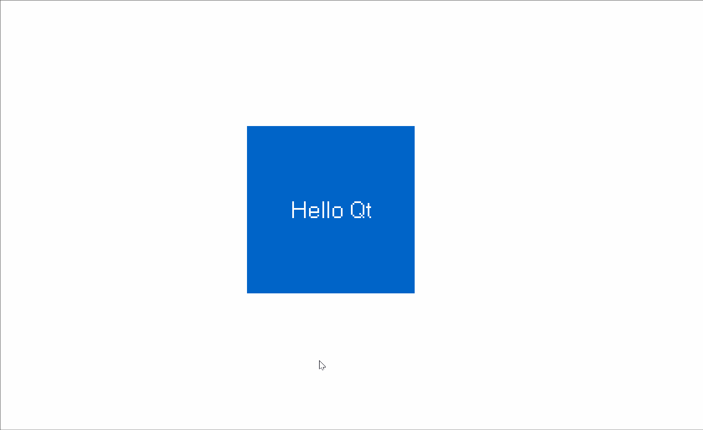

Using QWidget, you can achieve any effect we want.

Qt officially provides many basic controls for developers to use:

- https://doc.qt.io/qt-6/widget-classes.html

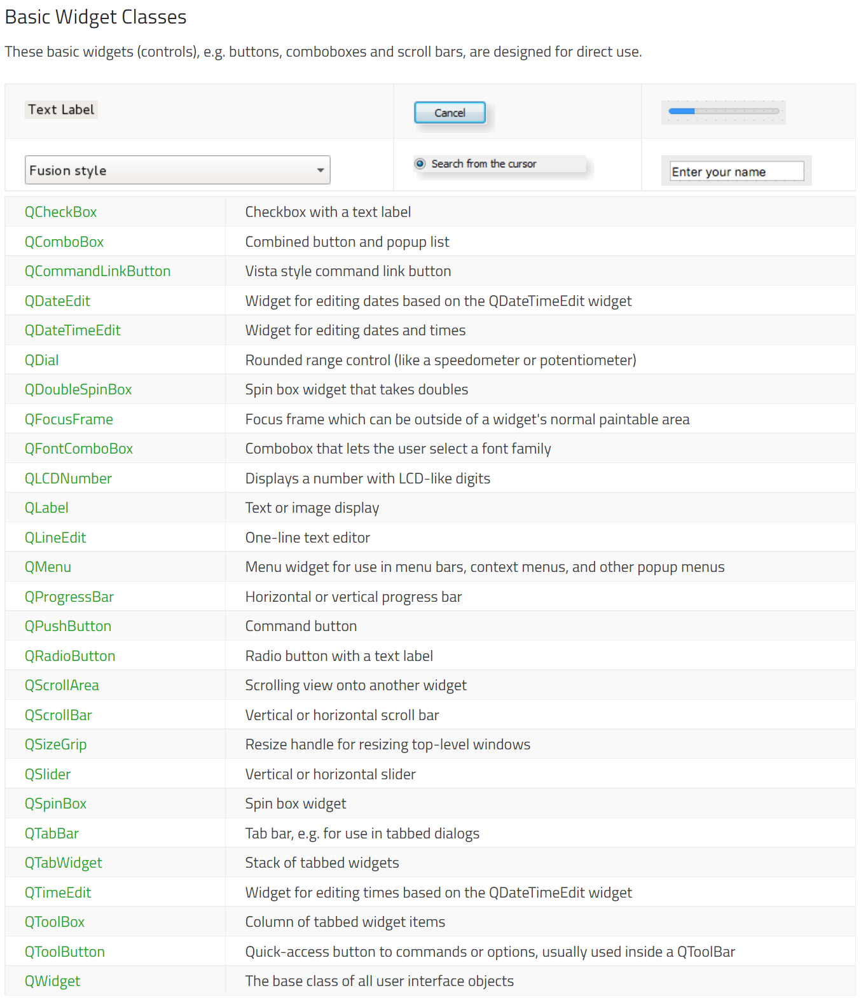

#### Layout

In a program, there is often more than one QWidget, so we also need to organize the layout of these Widgets. The commonly used layout in Qt is BoxLayout. Here is a simple example:

```c++
#include <QApplication>
#include <QWidget>
#include <QHBoxLayout>
#include <QPushButton>

class QMainWidget :public QWidget {
    Q_OBJECT
public:
    QMainWidget() {
        createUI();
    }
private:
    void createUI() {
        QHBoxLayout* hLayout = new QHBoxLayout(this);
        // QHBoxLayout* hLayout = new QHBoxLayout();         // Equivalent
        // setLayout(hLayout);

        hLayout->setContentsMargins(5, 5, 5, 5);             // Set margins
        hLayout->setSpacing(10);                              // Set spacing between internal elements
        hLayout->setAlignment(Qt::AlignLeft|Qt::AlignVCenter);    // Set left alignment and vertical center
        hLayout->addWidget(new QPushButton("A"));
        hLayout->addSpacing(20);                              // Add blank filling
        hLayout->addWidget(new QPushButton("B"));
        hLayout->addWidget(new QPushButton("C"));
    }
};

int main(int argc, char* argv[]) {
    QApplication a(argc, argv);
    QMainWidget widget;
    widget.resize(300, 300);
    widget.show();
    return a.exec();
}

#include "main.moc"
```

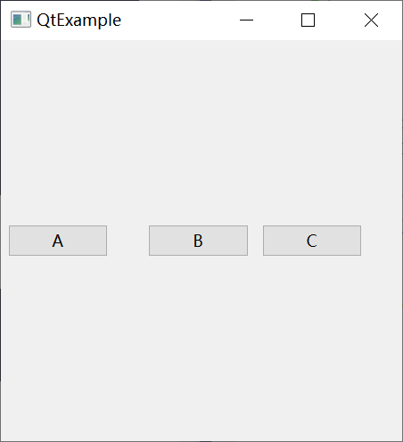

For a complete introduction to layouts, please refer to:

- https://doc.qt.io/qt-6/layout.html

For:

- The outermost Widget
- Widgets without a layout but with a hierarchical relationship

You can adjust the following properties through coordinates relative to the top-left corner of the parent:

- pos: https://doc.qt.io/qt-6/qwidget.html#pos-prop  
- geometry: https://doc.qt.io/qt-6/qwidget.html#geometry-prop  

For Widgets at the same level, you can call the following interfaces to adjust the Z Order:

- [raise()](https://doc.qt.io/qt-6/qwidget.html#raise): Bring to front  
- [lower()](https://doc.qt.io/qt-6/qwidget.html#lower): Send to back  

#### Style

Qt's default style is not aesthetically pleasing, but it supports beautifying controls using QSS. For details, please refer to:

- https://doc.qt.io/qt-6/stylesheet.html

## Advanced Route

Just like what was said in the third section on C++ basics: A large number of practice problems are the best way to learn programming, which can quickly master C++'s basic syntax and various data structures and algorithms, eliminate misunderstandings, and shape programming thinking.

The same applies to Qt. You don't need to learn step by step according to certain books or tutorials. A large number of practices can help you quickly understand the basic framework of a framework.

In the process of learning a framework, the most important things are:

- Examples
- Documentation

When encountering problems, what can often help you is:

- Community

### Documentation

In **Qt Creator**, you only need to select the Qt structure in the code and press `F1` to open its related documentation.

In **Visual Studio**, you need to install the Qt Vs Tool plugin and enable it in the settings:

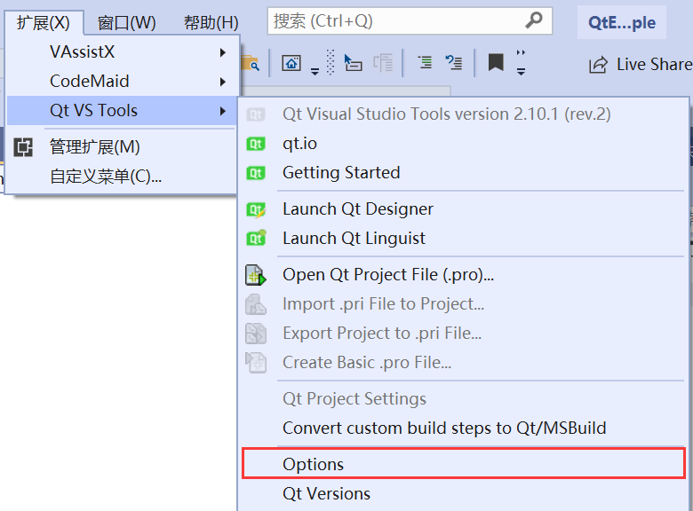

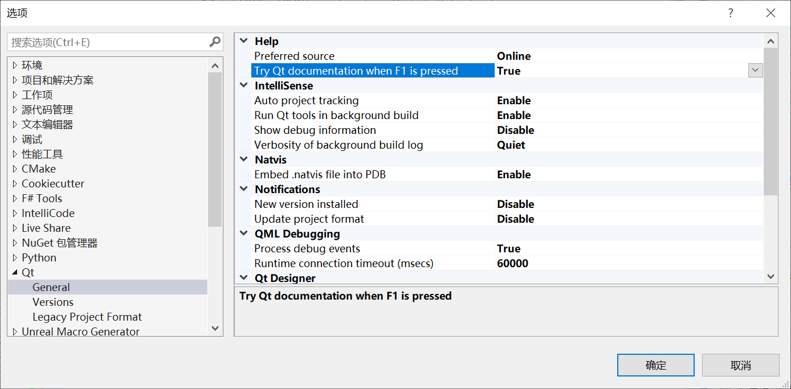

### Examples

This is Qt's official example tutorial page:

- https://doc.qt.io/qt-6/qtexamplesandtutorials.html

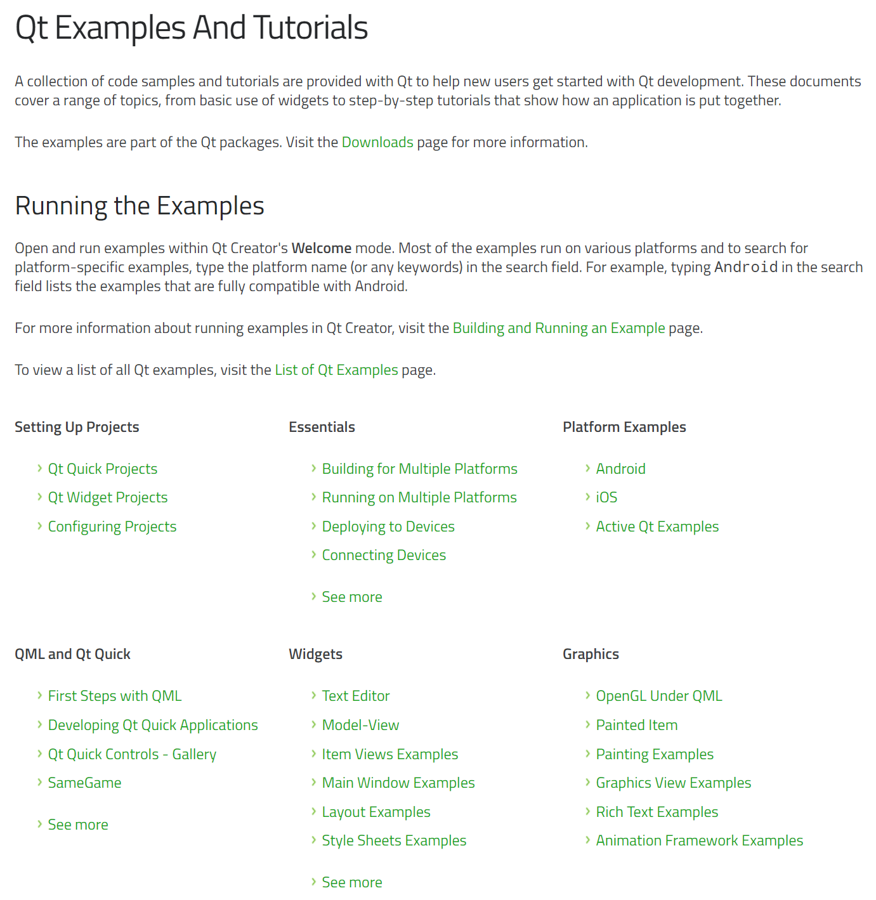

There are also a large number of usage examples in Qt Creator:

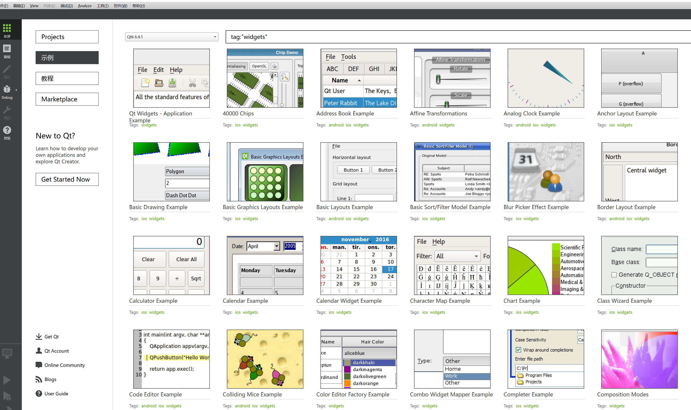

### Source Code

After reaching a certain stage, curiosity will always drive you to open this directory:

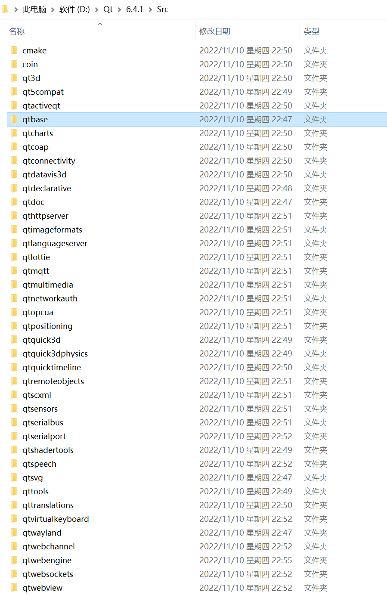

Under the `tests` directory of each module, you can find a large number of test projects that can be run:

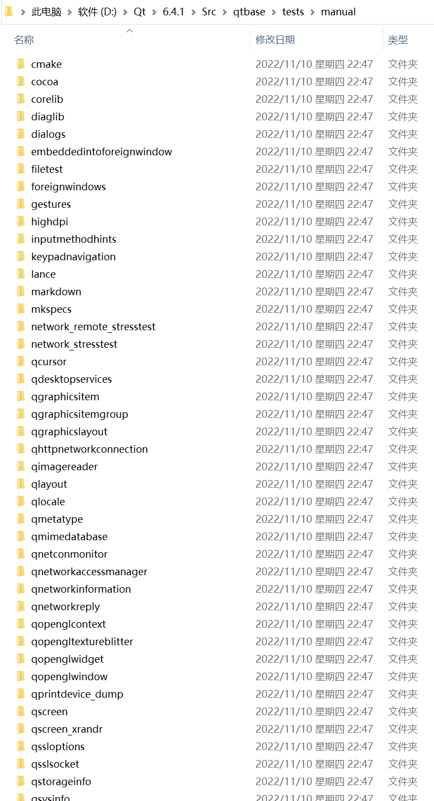

## Conclusion

After seeing this, do you still think Qt is just a GUI framework?

Qt's GUI functionality is even just a small part of the source code directory:

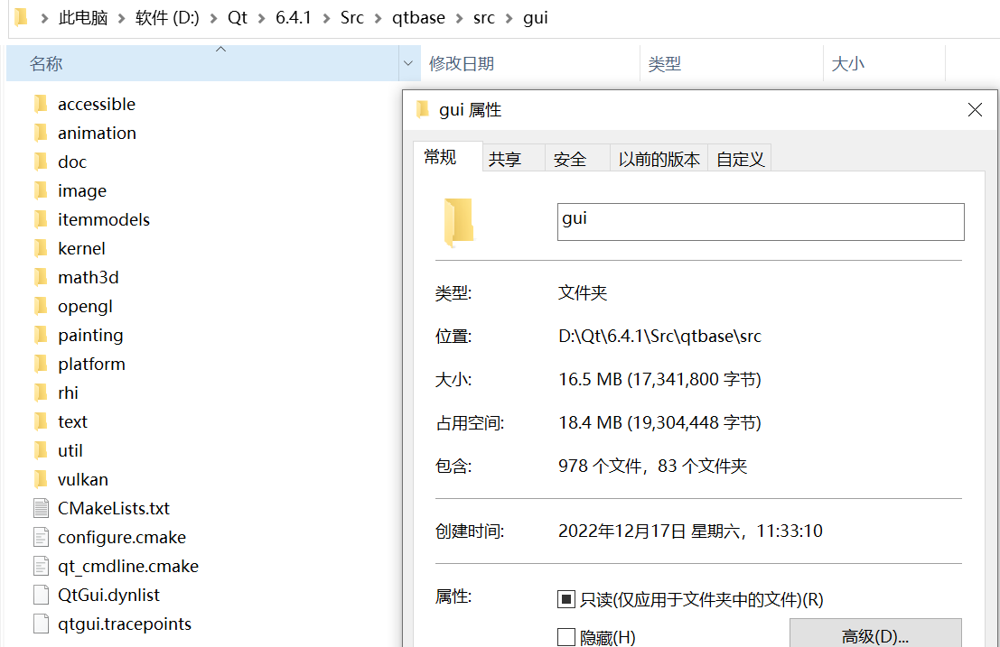

By browsing the source code, you can realize how huge Qt is~

In the author's eyes, it is not inferior to Unreal Engine at the code level. Since they are suitable for different industries, there is no point in comparing them.

But no matter whether your future goal is Qt, Unreal Engine, or others, as long as the direction is C++, Qt is not only a complete tool library but also the best way to improve code literacy and architectural capabilities.