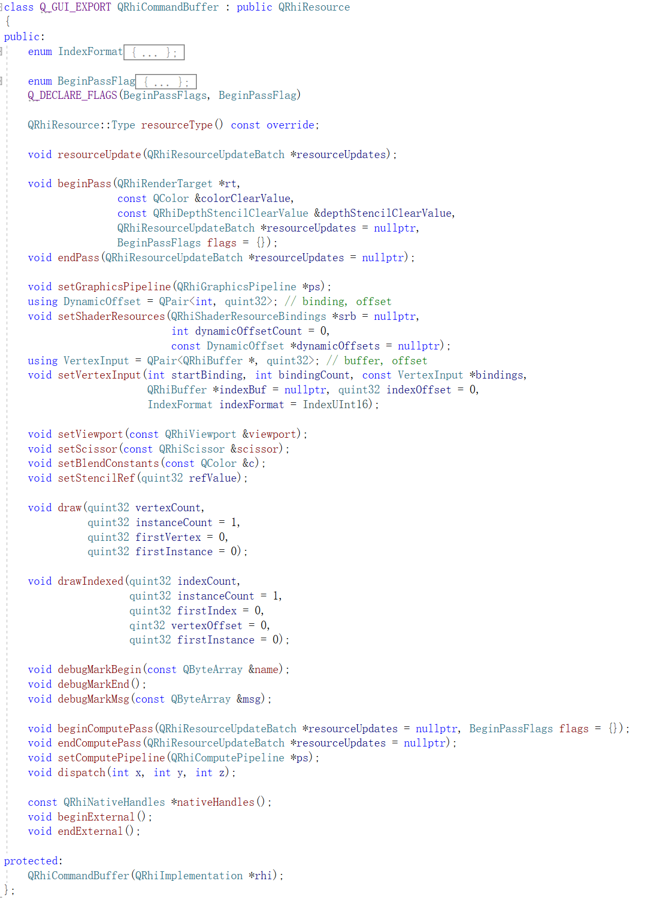
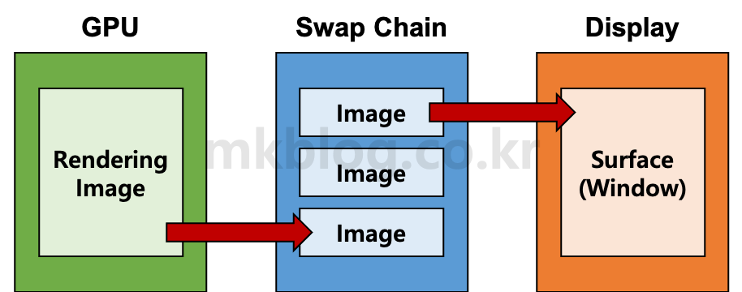
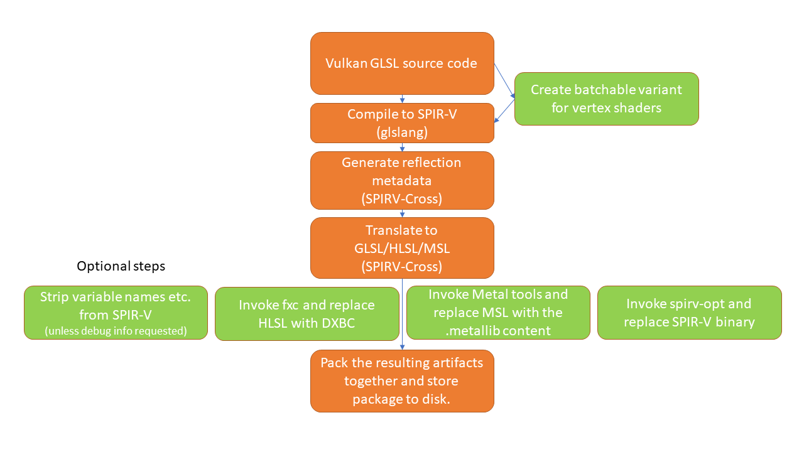
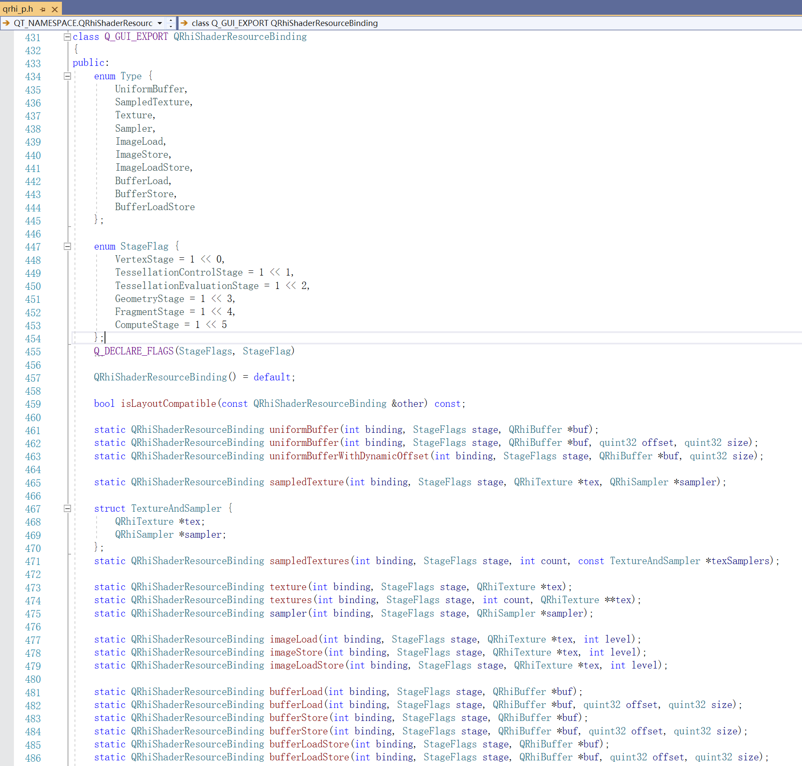
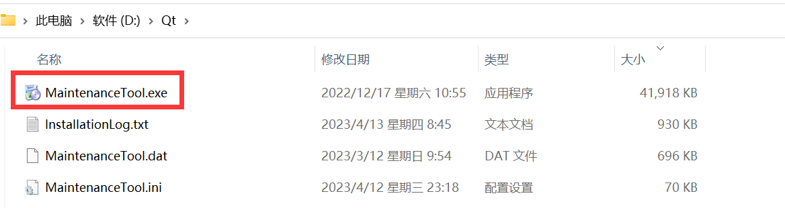
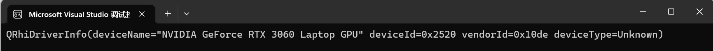
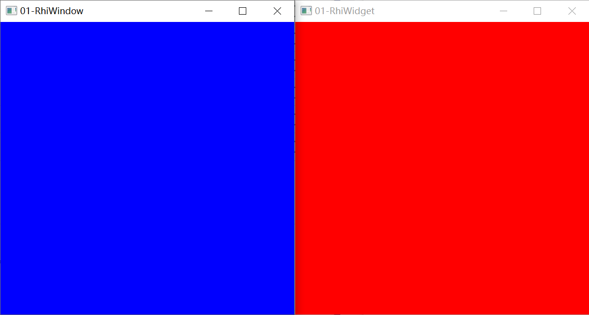

# Fundamentals of Graphics APIs

## Basic Concepts

Modern graphics APIs have many seemingly confusing structures for beginners. There's no need to worry excessively—these terms are just concise names for specific structures and processes. Once you understand their application scenarios and become familiar with their usage workflows, their meanings will naturally become clear.

### Physical Device

In graphics APIs, we generally refer to the GPU as a **Physical Device**.

With the rapid development of GPUs, the functional features of graphics APIs are also increasing day by day. To ensure backward compatibility of graphics API usage with GPU devices, graphics APIs often provide interfaces to query whether a physical device supports certain features and the limits of its resources.

Taking Vulkan as an example, **VkPhysicalDeviceFeatures** can be used to query if a physical device supports a specific feature:

```c++
struct VkPhysicalDeviceFeatures {
    VkBool32    robustBufferAccess;
    VkBool32    fullDrawIndexUint32;
    VkBool32    imageCubeArray;
    VkBool32    independentBlend;
    VkBool32    geometryShader;
    VkBool32    tessellationShader;
    VkBool32    sampleRateShading;
    VkBool32    dualSrcBlend;
    VkBool32    logicOp;
    VkBool32    multiDrawIndirect;
    VkBool32    drawIndirectFirstInstance;
    VkBool32    depthClamp;
    VkBool32    depthBiasClamp;
    VkBool32    fillModeNonSolid;
    VkBool32    depthBounds;
    VkBool32    wideLines;
    //...
}
```

**VkPhysicalDeviceLimits** can be used to query the resource limits of a physical device:

``` c++
struct VkPhysicalDeviceLimits {
    uint32_t              maxImageDimension1D;
    uint32_t              maxImageDimension2D;
    uint32_t              maxImageDimension3D;
    uint32_t              maxImageDimensionCube;
    uint32_t              maxImageArrayLayers;
    uint32_t              maxTexelBufferElements;
    uint32_t              maxUniformBufferRange;
    uint32_t              maxStorageBufferRange;
    uint32_t              maxPushConstantsSize;
    uint32_t              maxMemoryAllocationCount;
    //...
}
```

When using graphics APIs, developers need to be aware of these limits. In addition to finding physical devices that meet their functional requirements, they also need to implement logical compatibility handling for users whose devices do not support certain features during development.

### Logical Device

A Logical Device is the **"agent"** that mediates communication between the developer and the Physical Device.

Since the CPU and GPU execute independently without waiting for each other, to reduce the communication overhead between them and prevent developers from pestering the GPU over trivial matters shouting, "Hey, you can't leave until you finish this task!", modern graphics APIs introduce the concept of a Logical Device. This allows developers to communicate with the agent, who then consolidates tasks and relays them to the Physical Device in a unified manner.

> When creating a Logical Device, you need to specify which extensions of the Physical Device to enable.

### Command Buffer

A Command Buffer, also called a Command List, is the developer's **"note slip"**.

In addition to delivering "goods" to the agent (Logical Device), the developer records tasks to be performed on a note slip and hands it to the agent for relay to the Physical Device.

> In QRhi, CommandBuffers cannot be created directly. There are two ways to obtain them:
>
> - The current CommandBuffer can be obtained via the SwapChain.
> - `rhi->beginOffscreenFrame` creates a new CommandBuffer.
>
> **QRhiCommandBuffer** supports the following commands:
>
> 

### Device Queue

The Device Queue is the only **"bridge"** for communication between the agent (Logical Device) and the Physical Device.

When the agent receives the goods and note slip from the developer, it hurries across the bridge to the Physical Device.

### Synchronization

Why is the GPU so powerful? Because it has a team of subordinates. Imagine this scenario:

> One day, the GPU boss receives a note slip from the agent and immediately gathers the team to assign tasks:
>
> "Hmm~ First item: tear down all the flyers on Fandou Street. Zhang San, you go!"
>
> "Got it!", Zhang San replies and immediately heads for Fandou Street.
>
> "Second item: cover Fandou Street with the developer's flyers. Li Si, you handle this!"
>
> "Yes, sir!", Li Si mounts his beloved scooter and speeds toward Fandou Street.
>
> The next day, the developer arrives with a team, confronts the GPU boss about the missing flyers, and is ready to start a fight.
>
> The GPU boss checks the note slip—it's correct. Inquiry reveals Zhang San tore down the flyers and Li Si posted them. Further questioning reveals Li Si arrived early, posted the flyers first, and Zhang San later tore them all down.
>
> In hindsight, the developer failed to provide clear instructions, and the GPU boss misunderstood, leading to incorrect task scheduling and this incident.

In GPUs, many tasks run in parallel, meaning operations may start sequentially but execute out of order.

Additionally, the CPU and GPU do not wait for each other, but in some cases, we need to wait for certain operations to complete or events to trigger.

To address this, modern graphics APIs provide structures to control synchronization between the CPU, GPU, commands, and queues. Taking Vulkan as an example, it offers several synchronization structures:

- Fence
- Semaphore
- Barrier
- Event

For details, you can read:

- [Synchronization and Cache Control in Vulkan (Part 1): Fences and Semaphores](https://zhuanlan.zhihu.com/p/24817959)
- [Synchronization and Cache Control in Vulkan (Part 2): Barriers and Events](https://zhuanlan.zhihu.com/p/80692115)
- [Understanding Vulkan Synchronization](https://zhuanlan.zhihu.com/p/625089024)

### Window Surface

To present rendering results on the screen, developers often need to create a connection between the graphics API and the windowing system. In Vulkan, this connection can be established by creating a **Window Surface** for the window on the corresponding platform, serving as a bridge between the graphics API and the windowing system.

Since windowing systems vary across operating systems (Windows, Linux, Mac...), creating a Window Surface requires platform-specific configurations.

Several open-source libraries aim to simplify these tedious configurations, such as [GLFW](https://github.com/glfw/glfw).

> **GLFW** is an open-source, multi-platform library for developing OpenGL, OpenGL ES, and Vulkan applications.
>
> It provides a simple, lightweight, platform-independent API for creating windows, contexts, and surfaces; reading input; and handling events.

Most GUI frameworks also manage Window Surfaces. Our task is to consult documentation and dive into the source code.

### Swap Chain ([SwapChain](https://en.wikipedia.org/wiki/Swap_chain))

In the previous sections, we explained the role of the swap chain using console applications—it effectively prevents window flickering and tearing during rendering.



> https://mkblog.co.kr/vulkan-tutorial-10-create-swap-chain/

### Pipeline

A Pipeline, also called a graphics pipeline, is a task flow executed on the GPU. Modern computer graphics APIs typically include three types of pipelines:

- [Graphics Pipeline](https://en.wikipedia.org/wiki/Graphics_pipeline): Used to render images on a **RenderTarget**.
- [Compute Pipeline](https://en.wikipedia.org/wiki/Pipeline_(computing)): Used to process data in **Buffers** or **Images**.
- [Ray Tracing Pipeline](https://www.khronos.org/blog/ray-tracing-in-vulkan#blog_Ray_Tracing_Pipelines): Used for ray tracing processes.

In the previous section, we briefly introduced the graphics pipeline using a console application. Here is a more complete flow diagram:


> https://graphicscompendium.com/intro/01-graphics-pipeline

Its workflow can be simplified as:

- The developer uploads vertex data to the GPU.
- Each vertex's data is processed by the **Vertex Shader**.
- (If present) The data is further processed by the **Tessellation Control Shader**, **Tessellation Evaluation Shader**, and **Geometry Shader** to assemble triangle data.
- The rasterization engine then maps (rasterizes) the triangle data into individual **Fragments**.
- Each fragment's data is processed by the **Fragment Shader**.
- Overlapping fragments are handled in the **Testing and Blending Stage**.
- A unique value for each pixel coordinate is obtained and drawn onto the **RenderTarget**.

### Shader ([Shader](https://en.wikipedia.org/wiki/Shader))

A Shader is a small program running on the GPU, primarily used to extend pipeline functionality. For example, in the graphics pipeline above:

- Input vertex arrays are processed by the **Vertex Shader**.
- After rasterization, each pixel is processed by the **Fragment Shader**.

A graphics pipeline requires at least a Vertex Shader and a Fragment Shader. However, modern graphics APIs support additional shader extensions:

- **Tessellation Control Shader**
- **Tessellation Evaluation Shader**
- **Geometry Shader**
- **Compute Shader**

Shaders are written in API-specific **Shader Languages**, such as:

- [GLSL](https://en.wikipedia.org/wiki/OpenGL_Shading_Language): Used for OpenGL, Vulkan.
- [HLSL](https://en.wikipedia.org/wiki/High-Level_Shader_Language): Used for Direct3D.
- [MSL](https://en.wikipedia.org/wiki/Metal_(API)): Used for Metal.

In modern graphics engines' common RHIs, to support multiple graphics APIs, shaders are often developed in one of these languages and then translated into code for other APIs.

> In QRhi, Vulkan-style GLSL is used for development. Qt compiles GLSL into [SPIR-V](https://zhuanlan.zhihu.com/p/497460602) format using glslang, then translates it into shader code for each API using the open-source library [SPIRV-Cross](https://github.com/KhronosGroup/SPIRV-Cross). The workflow is as follows:
>
> 
>
> QRhi uses Vulkan-style GLSL, so this document is very important:
>
> - https://registry.khronos.org/OpenGL/specs/gl/GLSLangSpec.4.60.html

### Buffer

The term "Buffer" here does not merely refer to a section of memory on the GPU.

Specifically, a Buffer not only holds a section of memory but also includes its **Type** and **Usage**.

In terms of **Type**, graphics APIs generally classify Buffers into:

- **Host Local Memory**: Memory visible only to the Host (usually called regular memory).
- **Device Local Memory**: Memory visible only to the Device (usually called video memory).
- **Host Local Device Memory**: Device-visible memory managed by the Host.
- **Device Local Host Memory**: Host-visible memory managed by the Device.

> The Host typically refers to the CPU side, while the Device refers to the GPU side.

For details, refer to:

- [Vulkan Memory Management](https://zhuanlan.zhihu.com/p/166387973)

Using appropriate memory types can significantly improve memory read/write efficiency. In modern graphics engines' pipelines, **Device Memory** is used whenever possible. When submitting data from the CPU to Device Memory (which the Host cannot access directly), data is first uploaded to **Host-visible Memory**, then copied to the corresponding **Device Memory** via commands. The Buffer holding Host-visible memory for this purpose is generally called a [Staging Buffer](https://vulkan-tutorial.com/Vertex_buffers/Staging_buffer).

> QRhi further wraps these types and classifies them based on usage intent:
>
> - **Immutable**: Used for data that should never change. It has highly efficient GPU read/write performance and is typically placed in **Device Local** GPU memory, which cannot be directly read/written by the CPU. However, QRhi supports uploading to it—each upload creates a new **Host Local** **Staging Buffer** as an intermediary. This operation is very costly.
> - **Static**: Also stored in **Device Local** GPU memory. Unlike Immutable, the **Staging Buffer** created for the initial upload is retained.
> - **Dynamic**: Used for frequently changing data. It is placed in **Host Local** GPU memory and typically uses double buffering to avoid delaying the graphics pipeline.

In terms of **Usage**, Buffers usually have the following **Flags**:

- **VertexBuffer**: Used to store vertex data.
- **IndexBuffer**: Used to store index data.
- **UniformBuffer**: Used to store constant data.
- **StorageBuffer**: Used for data computation in Compute pipelines.
- **IndirectDrawBuffer**: Provides rendering parameters for indirect rendering.

### Texture ([Texture](https://en.wikipedia.org/wiki/Image_texture)) and Sampler

A Texture holds pixel-structured memory and can serve as input to the graphics pipeline or an attachment to a RenderTarget.

A Sampler defines texture sampling rules. Common rules include:

- How to handle out-of-bounds sampling when UV values exceed the range [0,1]:


- How to sample textures when precision is too high or low:


> These correspond to **QRhiTexture** and **QRhiSampler** in QRhi.
>
> ``` c++
> /*Create an RT with one color attachment*/
> QSharedPointer<QRhiTexture> colorAttachment;
> colorAttachment.reset(rhi->newTexture(QRhiTexture::RGBA32F, QSize(800, 600), 1, QRhiTexture::RenderTarget | QRhiTexture::UsedAsTransferSource));
> colorAttachment->create();
> QSharedPointer<QRhiTextureRenderTarget> renderTarget;
> QSharedPointer<QRhiRenderPassDescriptor> renderPassDesc;
> renderTarget.reset(rhi->newTextureRenderTarget({ colorAttachment.get() }));
> renderPassDesc.reset(renderTarget->newCompatibleRenderPassDescriptor());
> renderTarget->setRenderPassDescriptor(renderPassDesc.get());
> renderTarget->create();
> ```

### Descriptor

As mentioned in the graphics pipeline section, each vertex is processed by the Vertex Shader, and each fragment by the Fragment Shader. "Each" translates to "Per" in English. In addition to such "Per" data, there is often shared data common to shaders. In graphics APIs, this type of data is generally called Uniform data, which serves as public input to shaders.

When creating a pipeline structure, Descriptors are used to describe the basic structural information of Uniform data. Common Descriptor types include:

- **UniformBuffer**: Read-only Buffer input for shaders.
- **Sampler**: Read-only texture sampling input for shaders.
- **StorageBuffer**: Read-write Buffer for computation in Compute pipelines.
- **StorageImage**: Read-write Image for computation in Compute pipelines.

> This corresponds to **QRhiShaderResourceBinding** in QRhi:
>
> 

### Descriptor Set Layout Binding

A shader often has multiple types of Uniform inputs. A Descriptor Set Layout Binding is a collection of Descriptors that defines the Uniform structure layout on the shader. After a pipeline is created in a graphics API, most of its parameters cannot be changed, but the Descriptor Set Layout Binding can be dynamically replaced without rebuilding the pipeline.

> This corresponds to **QRhiShaderResourceBindings** in QRhi. Its creation is very simple:
>
> ``` elm
> mShaderBindings.reset(mRhi->newShaderResourceBindings());
> mShaderBindings->setBindings({
> 		QRhiShaderResourceBinding::bufferLoadStore(0, QRhiShaderResourceBinding::ComputeStage, mStorageBuffer.get()),
> 		QRhiShaderResourceBinding::imageLoadStore(1, QRhiShaderResourceBinding::ComputeStage, mTexture.get(), 0),
> });
> mShaderBindings->create();
> ```

### Render Target ([RenderTarget](https://en.wikipedia.org/wiki/Render_Target))

It is equivalent to the [Frame Buffer Object](https://en.wikipedia.org/wiki/Framebuffer_object) in OpenGL, consisting of one or more **Color Attachments** and possibly Depth and Stencil attachments.

![Diagram representing the structure of a Frame Buffer Object [Green 2005]](Resources/Figura-5-Esquema-representando-a-estrutura-de-um-Frame-Buffer-Object-Green-2005.png)

Typically, our rendering fills color data on the RenderTarget. The GPU automatically handles Depth and Stencil data—we only need to configure processing rules.

> It corresponds to **QRhiRenderTarget** in QRhi. Creating a RenderTarget with QRhi is very easy:
>
> ``` c++
> /*Create an RT with one color attachment*/
> QSharedPointer<QRhiTexture> colorAttachment;
> colorAttachment.reset(rhi->newTexture(QRhiTexture::RGBA32F, QSize(800, 600), 1, QRhiTexture::RenderTarget | QRhiTexture::UsedAsTransferSource));
> colorAttachment->create();
> QSharedPointer<QRhiTextureRenderTarget> renderTarget;
> QSharedPointer<QRhiRenderPassDescriptor> renderPassDesc;
> renderTarget.reset(rhi->newTextureRenderTarget({ colorAttachment.get() }));
> renderPassDesc.reset(renderTarget->newCompatibleRenderPassDescriptor());
> renderTarget->setRenderPassDescriptor(renderPassDesc.get());
> renderTarget->create();
> ```

## QRhi

If you're a beginner, after reading the basic concepts above, your head might be spinning. But don't worry—once you start coding, these concepts are just paper tigers. In the following sections of this chapter, we will systematically explain the structure and usage of basic graphics APIs.

First, you need Qt. You can download the Qt online installer from this mirror:

- http://mirrors.ustc.edu.cn/qtproject/official_releases/online_installers/

If you already have Qt, you can find the Maintenance Tool in your Qt installation directory. It is used to update and uninstall Qt components.



Ensure at least the following Qt components are installed:

- **Qt libraries version 6.0 or above** (latest version `6.6.0` as of now)
  - **MSVC compiler kit** (latest `2019 64-bit`) or **MinGW compiler kit** (latest `11.2.0 64-bit`): If using Visual Studio as your IDE, download MSVC.
  - **Sources**: Qt source code.
  - **Qt 5 Compatibility Module**: Compatibility module for Qt5.
  - **Qt Shader Tools**: Qt's shader compilation tools.
  - **Additional Libraries**: Qt extension libraries
    - **Qt Multimedia**: Qt's multimedia module, which includes audio/video encoding/decoding functionality.
  - **Qt Debug Information Files (optional)**: Used for debugging Qt source code under MSVC. It is over 10GB and quite large.

- **Developer and Designer Tools**
  - **Debugging Tools for Windows**: Used for debugging under MSVC.
  - **CMake** (latest version `3.24.2` as of now)

Additionally, you need to install the [Vulkan SDK](https://www.lunarg.com/vulkan-sdk/).

You can verify your environment with a small project:

- Create a new `CMakeLists.txt` and `main.cpp`.
- In `CMakeLists.txt`, create a `Target` and link Qt modules:

``` cmake
cmake_minimum_required(VERSION 3.12)

project(FirstRhiWindowProj)

add_executable(FirstRhiWindow main.cpp)

find_package(Qt6 COMPONENTS Core Widgets Gui REQUIRED)     

target_link_libraries(FirstRhiWindow                        
    PRIVATE 
        Qt6::Core  
        Qt6::Widgets
        Qt6::Gui
        Qt6::GuiPrivate        	// qrhi is a private module of GUI       
)
```

- Fill `main.cpp` with the following code:

```C++
#include <private/qrhi_p.h>
#include <private/qrhid3d11_p.h>

int main(int argc, char** argv) {
	QRhiD3D11InitParams params;
	QRhi::Flags flags;
	QSharedPointer<QRhi> rhi(QRhi::create(QRhi::D3D11, &params, flags));
	qDebug() << rhi->driverInfo();		// Print graphics card device information
	return 0;
}
```

- Compile and run with CMake. If successful, you will see the console window print graphics card information:

  

### QRhiWindow

Operating systems provide fine-grained control over windows. When developers want to adjust a window's effect, they may need to change multiple window properties and events. When numerous effects are stacked, conflicts can easily occur. For example:

> Suppose **Effect A** requires enabling properties `a` and `b`, and **Effect B** requires enabling properties `b` and `c`. If both effects are enabled (properties `a`, `b`, `c` are on), then disabling **Effect B** by directly turning off properties `b` and `c` would leave only property `a` enabled, causing **Effect A** to display incorrectly.

Developers often want to focus on window effects rather than OS-level window properties and events, leading to significant overlap in property and event settings between effects in window management.

Adding association validation to every property setting would make the code bloated, hard to maintain, and more prone to bugs.

Therefore, Qt uses a state machine approach to manage native windows:

- Window settings at the Qt level do not take effect immediately; instead, they are stored until a specific moment (e.g., when `show` is called). Qt then creates the actual OS window based on the current context configuration.

In other words, for a Qt window, the actual OS window is only created after calling the `show` function, allowing access to its window handle.

> During program development, you often encounter code starting with `ensure`. These functions organize complex logic by performing operations based on the current property context—especially common in graphics-related code.

To create a window's graphics rendering structure (which requires the actual window handle), initialization must occur after `show`. Fortunately, Qt provides a relevant event:

- [void QWindow:: exposeEvent (QExposeEvent* ev )](https://doc.qt.io/qt-6/qwindow.html#exposeEvent)
  - This event is triggered when the window switches from `un-exposed` to `exposed` state.
  - When the window is first shown, `resizeEvent` is executed before this event.

> Note that `exposeEvent` is executed multiple times for a window, but initialization only needs to happen once. Therefore, additional logical validation is required.

The graphics rendering structures for a window primarily include:

- `QScopedPointer<QRhiEx> mRhi`
- `QScopedPointer<QRhiSwapChain> mSwapChain`: Swap chain
- `QScopedPointer<QRhiRenderBuffer> mDSBuffer`: Depth-stencil buffer
- `QScopedPointer<QRhiRenderPassDescriptor> mSwapChainPassDesc`: RenderPass descriptor for the swap chain

After successful initialization, we only need to add rendering and resize logic to the window. Here is a standard Window implementation example:

- https://github.com/qt/qtbase/blob/dev/tests/manual/rhi/shared/examplefw.h

Also note that resources created with QRhi must be cleaned up before QRhi is destroyed. Smart pointers effectively manage the lifecycle of these resources.

### QRhiWidget

The key difference between Widgets and Windows is:

- Widgets trigger repainting via specific events, while Windows repaint every frame.

Using Widgets saves performance by avoiding unnecessary refreshes, but for real-time refresh scenarios like games and graphics, Windows better distribute rendering performance.

Here is a standard Widget implementation:

- https://github.com/qt/qtbase/tree/dev/tests/manual/rhi/rhiwidget

### Article Examples

You can find all documents and code for this article series in this repository:

- https://github.com/Italink/ModernGraphicsEngineGuide

Refer to the following video for building instructions:

- https://www.bilibili.com/video/BV1VP41127UM

It contains many interesting examples. If you don't want to build from source, here is a precompiled executable package:

- https://github.com/Italink/ModernGraphicsEngineGuide/releases/download/v1.0.0/Release.zip

#### QEngineUtilities

To simplify the use of certain structures, the author encapsulated common structures into [QEngineUtilities](https://github.com/Italink/QEngineUtilities/), which includes three build targets:

- **QEngineCore**: Rendering architecture with simple encapsulation of RHI, FrameGraph, RenderPass, RenderComponent, and Assets.
- **QEngineEditor**: Editor suite containing basic property adjustment controls (e.g., value regulators, color pickers, notification bubbles, QObject-based DetailView, GLSL code editor).
- **QEngineUtilities**: Launch layer that assembles the above two modules under different build configurations (e.g., embedding the editor interface in `DebugEditor` mode, including only the Core module in `Debug` mode).

You can pull this repository:

- Add **QEngineUtilities** to your project's `CMakeLists.txt` using [add_subdirectory](https://cmake.org/cmake/help/latest/command/add_subdirectory.html).
- Link your `Target` to **QEngineUtilities**.
- Use the `qengine_setup_env` function in CMake to configure environment variables (add DLL search paths) for your `Target`.

It is primarily for teaching and experimentation:

- Readability is prioritized.
- Performance is not meticulously optimized (some code flaws exist due to time constraints, but their impact is minimal).
- Focused on rendering with minimal editor architecture—no bloated modules like asset management, networking, async, or ECS are included.

If successful, you can create Widgets and Windows with the following code:

``` c++
#include <QApplication>
#include "Render/RHI/QRhiWidget.h"
#include "Render/RHI/QRhiWindow.h"

class ExampleRhiWindow : public QRhiWindow {
public:
	ExampleRhiWindow(QRhiWindow::InitParams inInitParams) : QRhiWindow(inInitParams) {}
protected:
	virtual void onRenderTick() override {
		QRhiRenderTarget* renderTarget = mSwapChain->currentFrameRenderTarget();
		QRhiCommandBuffer* cmdBuffer = mSwapChain->currentFrameCommandBuffer();

		const QColor clearColor = QColor::fromRgbF(0.0f, 0.0f, 1.0f, 1.0f);			// Clear screen with blue
		const QRhiDepthStencilClearValue dsClearValue = { 1.0f, 0 };

		cmdBuffer->beginPass(renderTarget, clearColor, dsClearValue);
		cmdBuffer->endPass();
	}
};

class ExampleRhiWidget : public QRhiWidget {
public:
	ExampleRhiWidget() {
		setDebugLayer(true);		// Enable validation layer
	}
	void render(QRhiCommandBuffer* inCmdBuffer) override {
		const QColor clearColor = QColor::fromRgbF(1.0f, 0.0f, 0.0f, 1.0f);			// Clear screen with red
		const QRhiDepthStencilClearValue dsClearValue = { 1.0f, 0 };
		inCmdBuffer->beginPass(mRenderTarget.data(), clearColor, dsClearValue);
		inCmdBuffer->endPass();
	}
};

int main(int argc, char **argv) {
    QApplication app(argc, argv);

    QRhiWindow::InitParams initParams;
    ExampleRhiWindow window(initParams);
	window.setTitle("01-RhiWindow");
	window.resize({ 400, 400 });
	window.show();

	ExampleRhiWidget widget;
	widget.setWindowTitle("01-RhiWidget");
	widget.setApi(QRhiWidget::Vulkan);
	widget.resize({ 400, 400 });
	widget.show();

    return app.exec();
}
```

Running it will display:



If you encounter difficulties, refer to the **01-WindowAndWidget** project in [ModernGraphicsEngineGuide](https://github.com/Italink/ModernGraphicsEngineGuide/tree/main/Source/1-GraphicsAPI) or ask questions [here](https://github.com/Italink/ModernGraphicsEngineGuide/issues).

Next chapter—let's start creating something fun!