# Shader Basics

In the previous section, we mainly covered how to build a basic graphics rendering pipeline using QRhi. You might not have realized it, but you can already draw any graphics with the GPU! All you need to do is fill in the vertex data~

If that's the case, then there's no need to learn anything else afterwards.

In modern graphics APIs, we pursue not only getting things done but also expanding what can be done and turning the impossible into possible.

Therefore, the subsequent articles in the graphics API series will focus on how to use hardware-optimized operations to accelerate graphics rendering.

## History

The emergence of GPUs was to provide reliable hardware acceleration for the then-existing graphics rendering systems. In the early stages of GPU development, graphics APIs aimed to offer simple and universal interfaces to transfer the original fixed rendering processes from the CPU to the GPU.

If you've worked with early OpenGL, you should be familiar with code like this:

```c++
void init(void)
{
    glMatrixMode(GL_MODELVIEW);								// Set the model-view matrix to the identity matrix
    glLoadIdentity();
}
void display(void)
{
    glClear(GL_COLOR_BUFFER_BIT);							// Clear the screen
    glBegin(GL_TRIANGLES);									// Start writing triangle primitives
    glColor3f(1.0, 0.0, 0.0); glVertex3f(-1.0, -1.0, 0.0);	// Write vertex data 0
    glColor3f(0.0, 1.0, 0.0); glVertex3f( 0.0,  1.0, 0.0);	// Write vertex data 1
    glColor3f(0.0, 0.0, 1.0); glVertex3f( 1.0, -1.0, 0.0);  // Write vertex data 2
    glEnd();												// End
    glutSwapBuffers();										// Refresh the swap chain
}
void reshape(int w, int h)
{
    glViewport(0, 0, (GLsizei) w, (GLsizei) h);				// Adjust the viewport size
    glMatrixMode(GL_PROJECTION);							// Set the projection matrix to the identity matrix
    glLoadIdentity();
}
```

In this stage of graphics APIs, the processing logic of each stage in the rendering pipeline was fixed. Developers only needed to provide vertex data, textures, matrices, light sources, and other information to the graphics API to complete 3D scene rendering with GPU acceleration.

Although graphics APIs allowed configuring pipeline stages through a few parameters and flags, with the rapid development of computer graphics and the emergence of various rendering theories, the official interfaces clearly couldn't keep up with the progress of academia and industry, and even restricted further exploration by developers and researchers. Thus, the **Programmable Pipeline** emerged.

Nowadays, we refer to the old usage method as the **Fixed Function Pipeline**.

The programmable pipeline allows developers to write **Shaders** to customize the processing logic of specific pipeline stages.

Each graphics API has its own **Shader Language**, such as:

- OpenGL and Vulkan use [GLSL](https://link.zhihu.com/?target=https%3A//en.wikipedia.org/wiki/OpenGL_Shading_Language)
- Direct3D uses [HLSL](https://learn.microsoft.com/en-us/windows/win32/direct3dhlsl/dx-graphics-hlsl)
- Metal uses [MSL](https://link.zhihu.com/?target=https%3A//en.wikipedia.org/wiki/Metal_(API))

These shader languages share similar overall workflows; the main differences lie in their syntax, which aligns with their respective API styles (or is just for differentiation).

Here's an implementation of a functionally identical Fragment Shader in different shader languages:

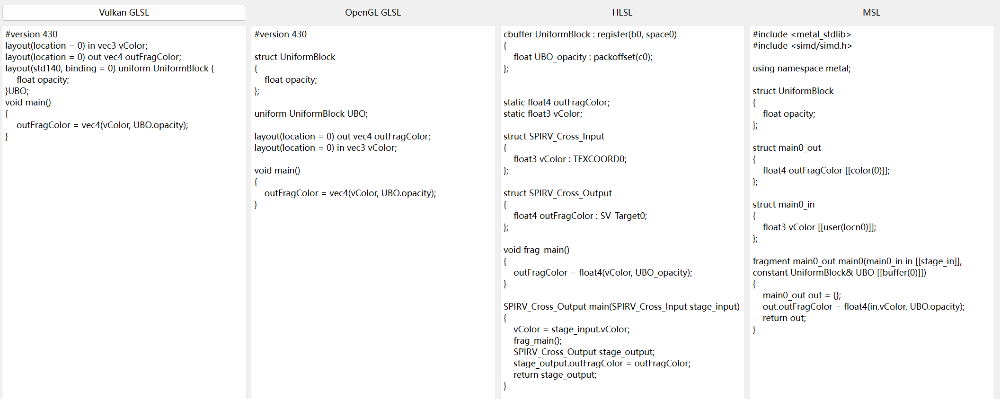

Early game developers often used a single graphics API as the rendering backend for their game engines. However, as the user base of various platforms grew, cross-platform support attracted major manufacturers—supporting one more platform meant accessing one more market.

Therefore, most modern game engines encapsulate these graphics APIs into a unified interface that can be switched between different platforms to achieve better graphics performance. We generally call this set of interfaces **RHI** (Rendering Hardware Interface).

During the encapsulation process, besides handling graphics API commands and resources, cross-platform shaders are also a major challenge.

Currently, most engines develop in one shader language and then translate it into shader languages compatible with other graphics APIs. For example:

- UE uses HLSL for development and leverages open-source libraries [Glslang](https://github.com/KhronosGroup/glslang) and [Spirv-Cross](https://github.com/KhronosGroup/SPIRV-Cross) to implement cross-platform shader translation.
- Engines like Unity, O3DE, Godot, and Bgfx have developed custom shader languages and use built-in compilers with open-source libraries for cross-platform shader translation.

Here are some related readings:

- [[Zhihu-unwind] Analysis of Cross-Platform Engine Shader Compilation Process](https://zhuanlan.zhihu.com/p/56510874)
- [[Zhihu-Leihuo Business Group for Web Games] Basic Introduction to Game Shaders](https://zhuanlan.zhihu.com/p/599456569)

## Shader Translation

QRhi's cross-platform shader solution is similar to UE's, except that QRhi uses Vulkan-style GLSL instead of HLSL. Its translation process is as follows:

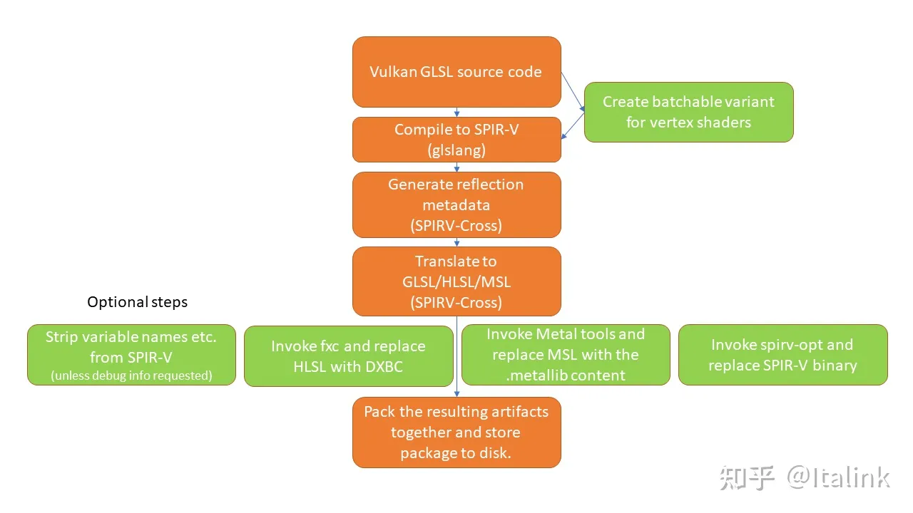

In the previous section, we used the following code to create shaders:

```c++
QShader vs = mRhi->newShaderFromCode(QShader::VertexStage, R"(#version 440
    layout(location = 0) in vec2 position;		// This needs to correspond to the inputLayout above
    layout(location = 1) in vec4 color;

    layout (location = 0) out vec4 vColor;		// Output variable; the location here is for out, not in

    out gl_PerVertex { 							// Fixed definition in Vulkan GLSL
        vec4 gl_Position;						
    };

    void main(){
        gl_Position = vec4(position,0.0f,1.0f);	// Set the actual vertex output based on the input position
        vColor = color;							// Pass the input color to the fragment shader
    }
)");
Q_ASSERT(vs.isValid());

QShader fs = mRhi->newShaderFromCode(QShader::FragmentStage, R"(#version 440
    layout (location = 0) in vec4 vColor;		// The out from the previous stage becomes in for this stage
    layout (location = 0) out vec4 fragColor;	// Fragment shader output; location 0 means output to the first color attachment of the render target
    void main(){
        fragColor = vColor;
    }
)");
Q_ASSERT(fs.isValid());
```

The `newShaderFromCode()` here is not a native function provided by QRhi; instead, the author made a simple encapsulation using interfaces from the **QtShaderTools** module. Its actual logic is as follows:

```c++
#include "private/qshaderbaker_p.h"

QShader newShaderFromCode(QShader::Stage stage, const char* code) {
	QShaderBaker baker;						// Shader baker
	baker.setGeneratedShaderVariants({ QShader::StandardShader });
	baker.setGeneratedShaders({
	    QShaderBaker::GeneratedShader{QShader::Source::SpirvShader, QShaderVersion(100)},
		QShaderBaker::GeneratedShader{QShader::Source::GlslShader, QShaderVersion(430)},
		QShaderBaker::GeneratedShader{QShader::Source::MslShader, QShaderVersion(12)},
		QShaderBaker::GeneratedShader{QShader::Source::HlslShader, QShaderVersion(60)},
	});
	baker.setSourceString(code, stage);		// Assemble GLSL source code
	QShader shader = baker.bake();			// Execute baking to translate into shaders for various graphics APIs

	if (!shader.isValid()) {				// Print compilation errors
		QStringList codelist = QString(code).split('\n');
		for (int i = 0; i < codelist.size(); i++) {
			qWarning() << i + 1 << codelist[i].toLocal8Bit().data();
		}
		qWarning(baker.errorMessage().toLocal8Bit());
	}
	return shader;
}
```

QShaderBaker comes from the private module of **Qt Shader Tools**. When building with CMake, you need to link your build target to `Qt::ShaderToolsPrivate`.

Additionally, we can use Qt's **qsb** command-line tool for **offline translation** of shader code. The tool is located in the following directory:


> You can add this directory to your system environment variables to access the qsb tool globally.

Type `cmd` in the window's address bar and press Enter to open the command-line window. Entering `qsb.exe -h` will show the usage instructions for the tool:

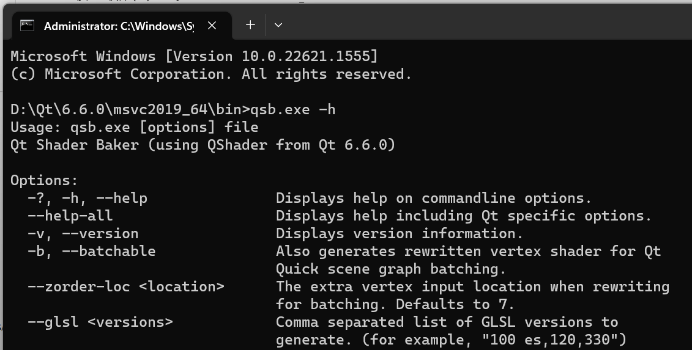

For example, using the command `qsb.exe -c color.frag -o color.frag.qsb --glsl 430 --msl 12 --hlsl 60` will translate the `color.frag` file in the current directory into a `color.frag.qsb` file containing GLSL 430, MSL 12, and HLSL 60 versions.

In Qt, you can use `*.qsb` files as follows:

```c++
QShader newShaderFromQSBFile(const char* filename) {
	QFile file(filename);
	if (file.open(QIODevice::ReadOnly))
		return QShader::fromSerialized(file.readAll());
	return QShader();
}
```

CMake also provides a useful feature: executing operations when certain files change. This allows us to implement **compile-time** shader translation.

This feature is implemented via the CMake command [add_custom_command](https://cmake.org/cmake/help/latest/command/add_custom_command.html). We can add the following function to CMake to handle shaders:

```cmake
function(add_shader TARGET_NAME SHADER_PATH)
    set(OUTPUT_SHADER_PATH ${SHADER_PATH}.qsb)  # Output file path
    add_custom_command(
        OUTPUT ${OUTPUT_SHADER_PATH}        # Specify output file
        COMMAND qsb.exe -c ${SHADER_PATH} -o ${OUTPUT_SHADER_PATH} --glsl 430 --msl 12 --hlsl 60    # Execute QSB tool
        MAIN_DEPENDENCY ${SHADER_PATH}      # Specify dependency file; trigger the command when this file changes
    )  
    set_property(TARGET ${TARGET_NAME} APPEND PROPERTY SOURCES ${OUTPUT_SHADER_PATH})               # Add the output file to a build target to trigger CustomCommand
    source_group("Shader Files" FILES ${SHADER_PATH} ${OUTPUT_SHADER_PATH})                         # Categorize shader files
endfunction()
```

This way, every time `TARGET_NAME` is built, CMake checks if `SHADER_PATH` has changed. If it has, the custom command (here, calling the QSB tool to generate `*.qsb` files) is executed. Error messages will also appear in the IDE's error panel:

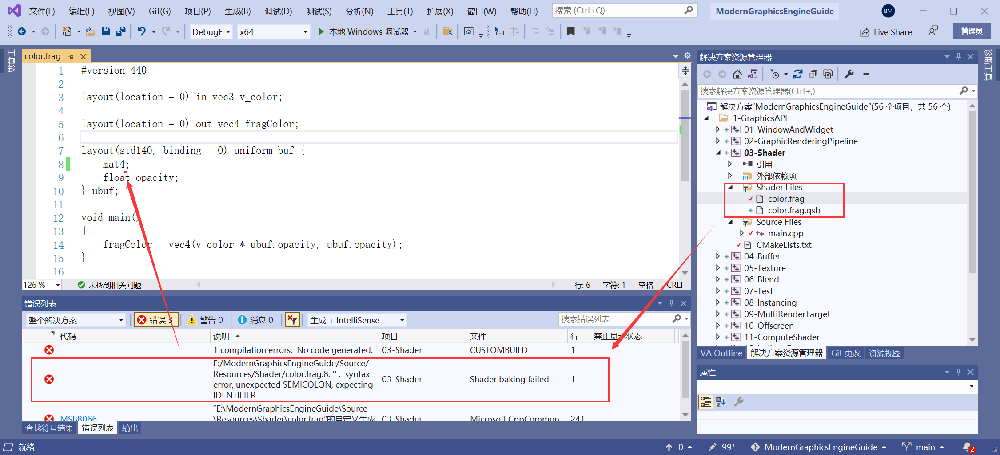

For Qt's shader tools, you can find test examples here:

- https://github.com/qt/qtshadertools/blob/dev/tests/auto/qshaderbaker/tst_qshaderbaker.cpp

The tutorial repository includes an example demonstrating various ways to compile shaders in QRhi:

- https://github.com/Italink/ModernGraphicsEngineGuide/blob/main/Source/1-GraphicsAPI/03-Shader/Source/main.cpp

## Shader Writing

### Basic Types

Common basic types in GLSL are as follows:

| Type       | Meaning                                                  |
| :--------- | :------------------------------------------------------- |
| **void**   | For functions that do not return a value                 |
| **bool**   | A conditional type with values true or false             |
| **int**    | A signed integer                                         |
| **uint**   | An unsigned integer                                      |
| **float**  | A single-precision floating-point scalar                 |
| **double** | A double-precision floating-point scalar                 |
| **vec2**   | A two-component single-precision floating-point vector   |
| **vec3**   | A three-component single-precision floating-point vector |
| **vec4**   | A four-component single-precision floating-point vector  |
| **mat2** | A 2×2 single-precision floating-point matrix |
| **mat3** | A 3×3 single-precision floating-point matrix |
| **mat4** | A 4×4 single-precision floating-point matrix |
| **sampler1D** **texture1D** **image1D**                      | A handle for accessing a 1D texture             |
| **sampler1DArray** **texture1DArray** **image1DArray**       | A handle for accessing a 1D array texture       |
| **sampler2D** **texture2D** **image2D**                      | A handle for accessing a 2D texture             |
| **sampler2DArray** **texture2DArray** **image2DArray**       | A handle for accessing a 2D array texture       |
| **sampler2DRect** **texture2DRect** **image2DRect**          | A handle for accessing a rectangle texture      |
| **sampler3D** **texture3D** **image3D**                      | A handle for accessing a 3D texture             |
| **samplerCube** **textureCube** **imageCube**                | A handle for accessing a cube-mapped texture    |
| **samplerCubeArray** **textureCubeArray** **imageCubeArray** | A handle for accessing a cube map array texture |
| **samplerBuffer** **textureBuffer** **imageBuffer**          | A handle for accessing a buffer texture         |

The complete list of types can be found in:

- https://www.khronos.org/registry/OpenGL/specs/gl/GLSLangSpec.4.60.html#basic-types

The main types to note are **vec (vector)** and **mat (matrix)**. We won't discuss their geometric meanings here; if you're unfamiliar with them, the author recommends reading *3D Math Primer for Graphics and Game Development*.

#### Vectors

In mathematics, a vector (also called Euclidean vector, geometric vector, or simply vector) refers to a quantity with magnitude and direction. In computers, a vector is just a sequence of consecutive numbers. GLSL supports 2D (vec2), 3D (vec3), and 4D (vec4) vectors.

Basic usage of vectors, taking vec4 as an example:

```c++
vec4 mVector = vec4(1, 2, 3, 4);
float x   = mVector.x;		// 1
vec2  xy  = mVector.xy;		// [1, 2]
vec3  xzy = mVector.xzy;	// [1, 3, 2]
vec2  xxw = mVector.xxw;	// [1, 1, 4]
vec4  newVector = vec4(mVector.xx, -1, -2);	// [1, 1, -1, -2]
```

Here, we use `xyzw` to access vector components. GLSL also supports other keyword groups: `rgba` and `pqst`. The choice depends on the usage scenario and personal preference.

GLSL naturally supports vector operations like addition, subtraction, multiplication, division, and dot product.

#### Matrices

In mathematics, a matrix is a rectangular array of complex or real numbers. In computers, it's also just a sequence of consecutive numbers. GLSL supports matrices up to 4x4 (mat4x4), which can be abbreviated as mat4 since it's a square matrix.

A crucial note: GLSL uses column-major matrix storage.

```c++
mat3 mMatrix = mat3(0, 1, 2,
                    3, 4, 5,
                    6, 7, 8);
```

If stored in row-major order, it would be represented as:

```c++
{
  0, 3, 6,
  1, 4, 7,
  2, 5, 8
}
```

The storage order not only affects how matrices are accessed but also, more importantly, the order of matrix operations. The following figure shows the result type of multiplying a 3D matrix and a 3D vector under different storage orders:

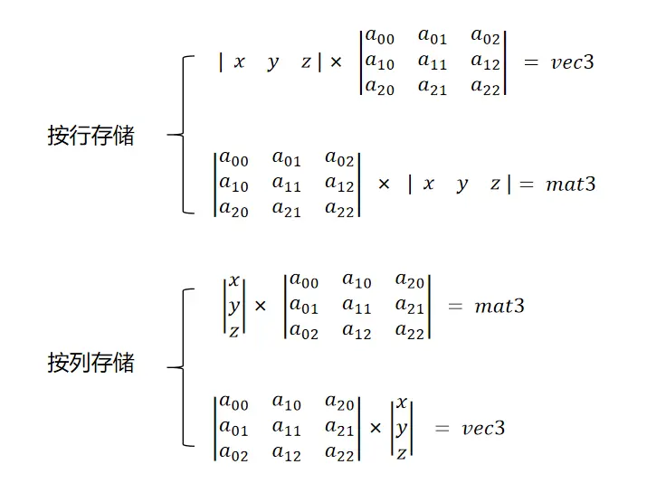

In GLSL, we typically use matrices to transform vectors, so operations are generally performed from right to left:

```c++
vec3 pos    = vec3(0.5, 1.0, 0);
mat3 model  = mat3(...);
vec3 newPos = model * pos; 
```

Additionally, we need to note that besides reversing matrix-vector operation order, some internal matrix operations must also be reversed. For example, if we want to first rotate and then translate a shape using QMatrix4x4 on the client side, we should do this:

```c++
QMatrix4x4 mat4;
mat4.translate(0, 1);					// Operations to execute first are called later
mat4.rotate(60, QVector3D(0, 0, 1));		// So here, rotation is applied first, then translation
```

> Also note that the memory size of QMatrix4x4 is not `16 * sizeof(float)`; it includes a 4-byte identifier. When uploading QMatrix4x4 to the GPU, call `mat.toGenericMatrix<4,4>()` to convert it to **QGenericMatrix** type.

### Qualifiers

In GLSL, we use qualifiers to describe variable properties. Common types of qualifiers include:

- Storage qualifiers: Describe where the variable is stored
- Layout qualifiers: Describe the variable's layout

Common storage qualifiers:

| Storage Qualifier | Meaning                                    |
| :---------------- | :----------------------------------------- |
| None              | Read-write local variable                  |
| **const**         | Constant                                   |
| **in**            | Input variable from the previous stage     |
| **out**           | Output variable to the next stage          |
| **uniform**       | Uniform data variable                      |

The key distinction to note is between `in`, `out`, and `uniform`:

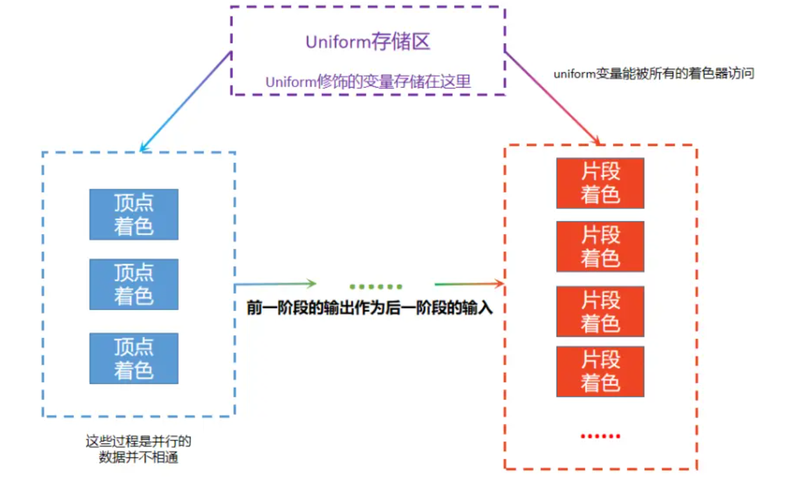

The format of layout qualifiers is:

- `layout( layout-qualifier-id-list )`

Where `layout-qualifier-id-list` is an array of features, which can be either an identifier or a key-value pair. Other common layout qualifier features include:

| Layout Qualifier Feature                                     | Description                                                     |
| :----------------------------------------------------------- | :-------------------------------------------------------------- |
| **binding** =                                                | Maps to the index in the descriptor set binding layout for uniform data |
| **location** =                                               | Determines the position of all input/output variables. The connection between a shader stage's input variables and the previous stage's output variables is determined by location, not variable name |
| **shared**, **packed**, **std140**, **std430**               | Declares the structure memory alignment for Blocks              |
| **local_size_x** =, **local_size_y** =, **local_size_z** =   | In compute shaders, specifies the size of compute units         |
| **max_vertices** =                                           | In geometry shaders, defines the maximum number of vertices     |
| **rgba32f** **rgba16f** **rg32f** **rg16f** **r11f_g11f_b10f** **r32f** **r16f** **rgba16** **rgb10_a2** **rgba8** **rg16** **rg8** **r16** **r8** **rgba16_snorm** **rgba8_snorm** **rg16_snorm** **rg8_snorm** **r16_snorm** **r8_snorm** **rgba32i** **rgba16i** **rgba8i** **rg32i** **rg16i** **rg8i** **r32i** **r16i** **r8i** **rgba32ui** **rgba16ui** **rgb10_a2ui** **rgba8ui** **rg32ui** **rg16ui** **rg8ui** **r32ui** **r16ui** **r8ui** | In compute shaders, specifies the image format for Image variables |

In Vulkan-style GLSL, note the following:

- Any `in` or `out` variable must be modified with `layout(location = ${index})`, as the current stage's `in` variables look for the previous stage's corresponding `out` variables by `Location Index`.
  - For vertex shaders, `in` variables correspond to vertex attributes at the specified index in the pipeline's vertex input layout.
  - For fragment shaders, `out` variables output to the color attachment at the specified index in the render target.
- Any `uniform` variable must be modified with `layout(binding = ${index})`. The `Binding Index` must correspond to the descriptor set layout (QRhiShaderResourceBindings) used in the pipeline.

For the complete documentation on qualifiers, refer to:

- https://registry.khronos.org/OpenGL/specs/gl/GLSLangSpec.4.60.html#storage-qualifiers

### Basic Stages

The execution flow of a complete graphics rendering pipeline is as follows:

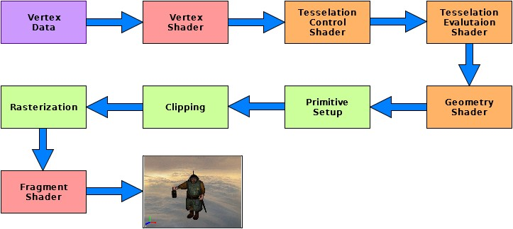

- The red sections, **Vertex Shader** and **Fragment Shader**, are **required** in the graphics rendering pipeline.
- The yellow sections, **Tesselation Control Shader**, **Tesselation Evaluation Shader**, and **Geometry Shader**, are **optional**.
- The green sections, **Primitive Setup**, **Clipping**, and **Rasterization**, are **non-programmable stages**, but graphics APIs provide parameters to adjust their behavior.

To write shaders, we first need to understand the responsibilities of each pipeline stage. The author will focus on vertex and fragment shaders here. The graphics API includes other stages and pipelines, but expanding on them prematurely would overwhelm readers. If you're interested, you can explore them first—these topics will be covered in depth in subsequent articles.

#### Vertex Shader

The responsibility of the **Vertex Shader** is to populate the current vertex's **built-in output variables** based on `input vertex data` and `Uniform data (if any)`, and pass useful data to the next stage.

A core vertex shader template is as follows:

```c++
layout(location = 0) in vec2 position;		

out gl_PerVertex { 							
    vec4 gl_Position;
};

void main(){
    gl_Position = vec4(position, 0.0f, 1.0f); 
}
```

Explanation:

- `layout(location = 0)` corresponds to the vertex attribute at index 0 in the pipeline's vertex input layout.
- `in` indicates an input variable.
- `vec2` specifies the variable type as a 2D vector, which must match the format (Float2) in the vertex input layout.
- `position` is the input variable name; it can be arbitrary.
- `out gl_PerVertex { vec4 gl_Position; };` is the fixed output definition for the vertex shader.
- `gl_Position = vec4(position, 0.0f, 1.0f);` populates the actual vertex output based on the input vertex position.

Important note: Don't be constrained by fixed thinking—you don't have to input a `position` here. In fact, you can input any vertex data, even without a position, as long as you set the value of `gl_Position` in `gl_PerVertex` within the vertex shader. For example:

```c++
layout(location = 0) in vec2 anyVertexData;

out gl_PerVertex { 				
    vec4 gl_Position;
};

vec4 calcPosition(vec2 vertexData){
	// do something
	return position;
}

void main(){
    gl_Position = calcPosition(anyVertexData);
}
```

To pass data from this stage to the next, define an `out` variable with a `layout` description:

```c++
layout(location = 0) in vec2 position;		
layout(location = 0) out vec4 color;		// Define output variable; in and out locations are separate

out gl_PerVertex { 							
    vec4 gl_Position;
};

void main(){
    gl_Position = vec4(position, 0.0f, 1.0f);	
    color = vec4(position.xy, 0.0f, 1.0f);
}
```

If the pipeline includes Uniform data for the vertex shader, define a `uniform` variable with a `binding` description:

```c++
layout(location = 0) in vec2 position;		
layout(location = 0) out vec4 color;	

layout(binding = 0) uniform UniformBlock {	// binding=0 corresponds to the descriptor set layout binding in pipeline creation
	vec4 color;								// UniformBlock is the name of this data structure block; it can be arbitrary
} ubo;


out gl_PerVertex { 							
    vec4 gl_Position;
};

void main(){
    gl_Position = vec4(position, 0.0f, 1.0f);	
    color = ubo.color;						// Set color via Uniform data
}
```

#### Fragment Shader

The responsibility of the **Fragment Shader** is to write to the `color attachment` of the render target based on `input data from the previous stage` and `Uniform data (if any)`.

A core fragment shader template is as follows:

```c++
layout(location = 0) out vec4 fragColor;	
void main(){
    fragColor = vec4(1, 1, 1, 1);
}
```

Explanation:

- `layout(location = 0) out` indicates the fragment will be output to the color attachment at index 0 of the render target. A render target typically has at least one color attachment; the swap chain's render target has only one 4-channel color attachment.
- `vec4` indicates the color attachment has four color channels (e.g., `RGBA8888`).
- `fragColor` is the output variable name; it can be arbitrary.
- `fragColor = vec4(1, 1, 1, 1)` sets the final fragment to opaque white (R=1, G=1, B=1, A=1).

Fragment shaders can also include Uniform inputs like vertex shaders.

In the author's early learning stages, due to the one-to-one correspondence between vertex shader output variables and fragment shader input variables, they mistakenly assumed a one-to-one relationship between the two shaders. But this is incorrect—remember the previous program?

We used `3` vertex data entries:

```c++
static float VertexData[] = {                                       // Vertex data
    // position(xy)      color(rgba)
     0.0f,  -0.5f,      1.0f, 0.0f, 0.0f, 1.0f,
    -0.5f,   0.5f,      0.0f, 1.0f, 0.0f, 1.0f,
     0.5f,   0.5f,      0.0f, 0.0f, 1.0f, 1.0f,
};
```

To draw this image:

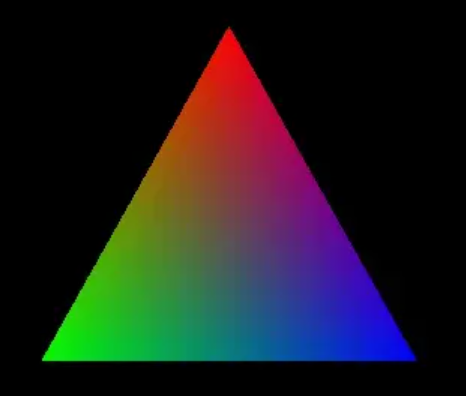

Look closely:明明只输入3个顶点的颜色，但最终的图像中有多少种颜色？

Clearly, it's not 3. How is this achieved?

As shown in the figure below, vertex shaders and fragment shaders are not one-to-one. After vertices are assembled into geometric primitives, the rasterization stage generates many fragments:

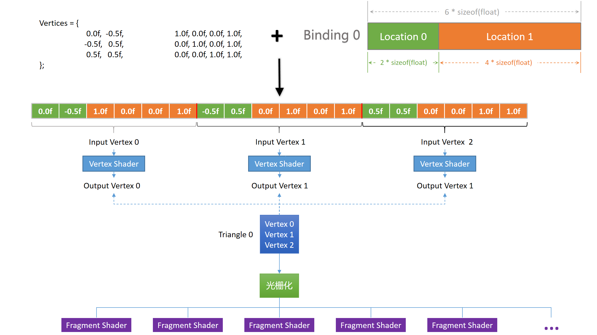

At the shader level, this process can be seen as: the vertex shader's output variables, after rasterization, become input variables for many fragments.

The many-to-many conversion between output and input variables is done via **rasterization interpolation**. For details, refer to:

- [[Zhihu-Mu Tou Gu Tou Shi Tou] Graphics Rendering Basics: Rasterization Algorithms](https://zhuanlan.zhihu.com/p/370059588)

### Built-in Variables

The pipeline provides built-in variables to pass context information to shader programs.

For example, in the vertex shader:

```c++
in int gl_VertexIndex;    	// Index of the current vertex
in int gl_InstanceIndex;  	// Index of the current instance
in int gl_DrawID; 			// Requires GLSL 4.60 or ARB_shader_draw_parameters
in int gl_BaseVertex; 		// Requires GLSL 4.60 or ARB_shader_draw_parameters
in int gl_BaseInstance; 	// Requires GLSL 4.60 or ARB_shader_draw_parameters

out gl_PerVertex {
    vec4 gl_Position;		// gl_Position is required; learn about the other variables' roles	
    float gl_PointSize;		
    float gl_ClipDistance[];
    float gl_CullDistance[];
};
```

Fragment shaders also have built-in variables:

```c++
in vec4 gl_FragCoord;		// Coordinates of the current fragment
in bool gl_FrontFacing;		// Whether the current fragment is front-facing
in float gl_ClipDistance[];
in float gl_CullDistance[];
in vec2 gl_PointCoord;
in int gl_PrimitiveID;
in int gl_SampleID;
in vec2 gl_SamplePosition;
in int gl_SampleMaskIn[];
in int gl_Layer;
in int gl_ViewportIndex;
in bool gl_HelperInvocation;

out float gl_FragDepth;
out int gl_SampleMask[];
```

For details on built-in variables, see:

- https://registry.khronos.org/OpenGL/specs/gl/GLSLangSpec.4.60.html#built-in-language-variables

### Built-in Functions

GLSL includes almost all functions used in graphics development, such as mathematical functions, vector operations (dot product, cross product), matrix transposition, inversion, blending functions, interpolation functions, etc. Basically, anything you can think of or need is available.

For details on these functions, refer to the official documentation:

- https://www.khronos.org/registry/OpenGL/specs/gl/GLSLangSpec.4.60.html#built-in-functions 

### Logical Branches

For developers, shader languages should not be simply treated as programming languages with different syntax. Their most distinctive feature is execution on the GPU—their built-in functions are implemented based on GPU hardware features.

Since GPUs are composed of numerous compute units, they are not well-suited for executing logical operations.

When writing GLSL, we should avoid **branch instructions** as much as possible and instead think from an alternative strategy:

- First, it's clear: Calling `return` in a shader does not affect subsequent stages. If necessary parameters are not filled, default values may be used.
- The main goal of logical branches is usually to have some cases output A, others output B, and so on.

GPUs are optimized for mathematical operations. If we can determine the functional relationship between logical conditions and output results, we can avoid logical branches through numerical computation. This involves a key function:

- The `step` (step) function.

Normally, mathematical functions have continuous, smooth graphs. The step function is special because it has a value jump. Its graph looks like this:

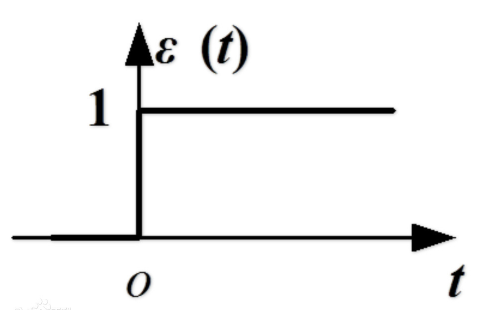

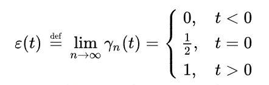

This jump feature is ideal for numerical logical branching, but its usage is not very intuitive. Therefore, GLSL allows using conditional operators to implement related logic, such as `(a < b) ? a : b`.

Some built-in GLSL functions like min and max have GPU-specific implementations, so we don't need to worry about logical branches. We only need to be cautious with `if`—`if` is not equivalent to a branch; what really matters is whether the compiler generates **branch instructions**.

For details and considerations on these issues, here's an excellent explanation:

- [[Zhihu-YAO] if and Branches in Shaders](https://zhuanlan.zhihu.com/p/122467342)

## Pipeline Cache

As mentioned earlier, game engines typically develop in one shader language and translate it into `source code` or `bytecode (intermediate) files` for specific graphics APIs.

When the GPU uses shaders, it needs to compile the `source code` or `bytecode (intermediate) files` into machine-executable binary code. This compilation process depends on the graphics driver. Since each user may have a different graphics driver version, developers can hardly cover all drivers—meaning we must compile the shader binary code on the user's computer.

To avoid stuttering caused by shader compilation during program execution, modern graphics APIs provide a Pipeline Cache feature. This allows the program to compile all pipelines during the first launch and store them on disk, so subsequent runs or restarts won't stutter due to shader compilation.

In Unreal Engine, this technology is called [PSO Cache (Pipeline State Object Cache)](https://docs.unrealengine.com/5.1/en-US/optimizing-rendering-with-pso-caches-in-unreal-engine/)

Here's a great article explaining PSO cache-related knowledge:

- [[Zhihu-mike] UE4 PSO Cache](https://zhuanlan.zhihu.com/p/572503905)

In QRhi, we can enable pipeline cache when creating QRhi:

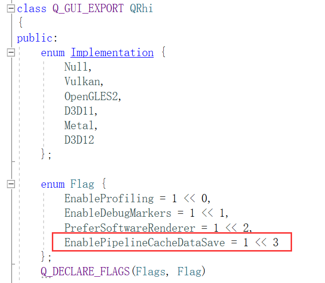

The function `QByteArray QRhi::pipelineCacheData()` can retrieve the compiled pipeline cache data for the current program.

The function `void QRhi::setPipelineCacheData(const QByteArray &data)` can set the pipeline cache data.

When `QRhiGraphicsPipeline::create()` is called, the program queries whether the pipeline state exists based on the current pipeline parameters. If it does, it is reused without recompilation.

## Learning Platforms

There are two interesting foreign platforms that allow creating stunning graphics by modifying only fragment shader code (with fixed pipeline processes and external input variables):

- Shadertoy: https://www.shadertoy.com/

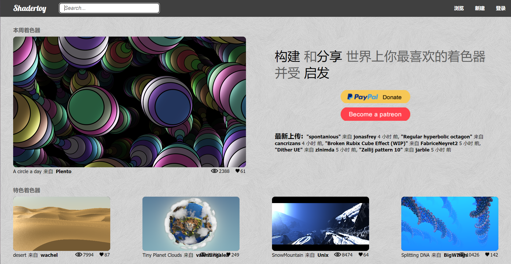

- Glsl Sandbox: http://glslsandbox.com/ 

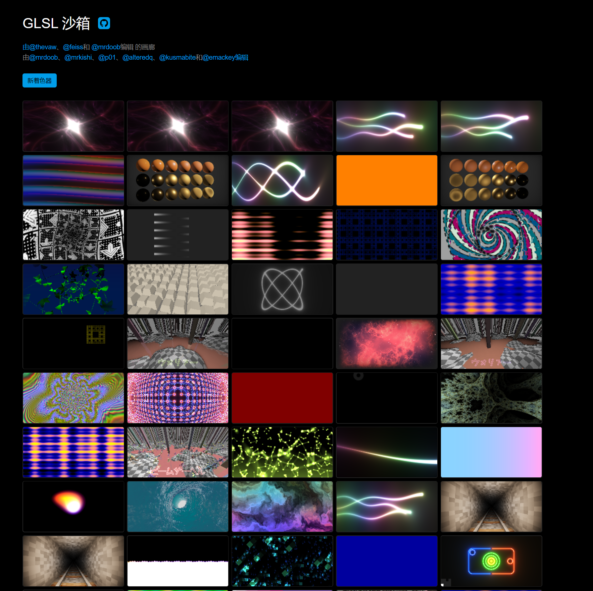

Both platforms feature complete online Shader editors. You can try mimicking simple effects and familiarize yourself with basic shader syntax.

Good luck!