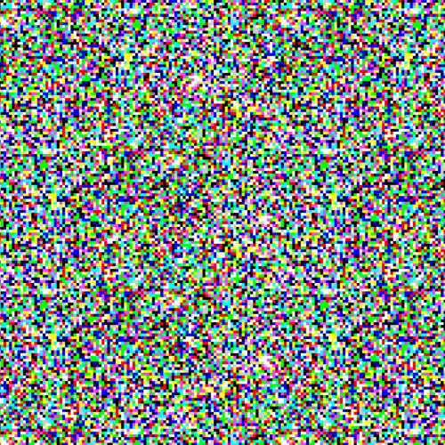
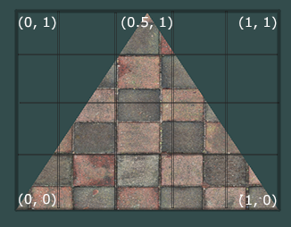
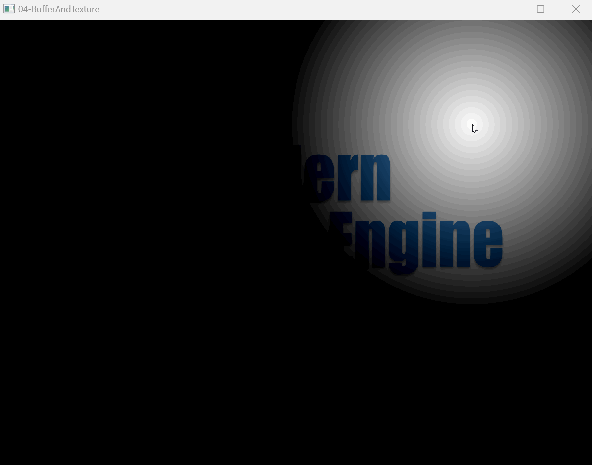

# Buffers and Textures

## Buffers

A **Buffer** holds a section of memory on the GPU along with related characteristics—**Type** and **Usage**.

**Type** determines the storage properties of the Buffer. Graphics APIs typically categorize them into:

- **Host Local Memory**: Memory visible only to the Host, usually referred to as regular memory.
- **Device Local Memory**: Memory visible only to the Device, usually referred to as video memory.
- **Host Local Device Memory**: Memory managed by the Host but visible to the Device.
- **Device Local Host Memory**: Memory managed by the Device but visible to the Host.

> Host usually refers to the CPU side, while Device refers to the GPU side.

For details, refer to:

- [Vulkan Memory Management](https://zhuanlan.zhihu.com/p/166387973)

Using the appropriate memory type can significantly improve memory read/write efficiency. In modern graphics engine pipelines, **Device Memory** is used as much as possible. When submitting data from the CPU to it, since the Host cannot access it directly, data is typically uploaded to a **Host-visible Memory** first, then copied to the corresponding **Device Memory** via commands. We generally call the Buffer holding Host-visible memory a [Staging Buffer](https://link.zhihu.com/?target=https%3A//vulkan-tutorial.com/Vertex_buffers/Staging_buffer).

In terms of **Usage**, Buffers usually have the following **Flags**:

- **VertexBuffer**: Used to store vertex data.
- **IndexBuffer**: Used to store index data.
- **UniformBuffer**: Used to store constant data.
- **StorageBuffer**: Used for data computation in Compute pipelines.
- **IndirectDrawBuffer**: Used to provide rendering parameters for indirect rendering.

In the graphics rendering pipeline chapter, we used QRhi to easily create a buffer for storing vertex data (**VertexBuffer**):

```c++
QScopedPointer<QRhiBuffer> mVertexBuffer;   
mVertexBuffer.reset(mRhi->newBuffer(QRhiBuffer::Immutable, QRhiBuffer::VertexBuffer, sizeof(VertexData)));
mVertexBuffer->create(); // In QRhi, calling the create function of a rendering resource object actually creates the corresponding GPU resource; before this, we are just adjusting the parameter state machine.
```

Use the `newBuffer` function to request a new buffer:

```c++
QRhiBuffer* QRhi::newBuffer(QRhiBuffer::Type type,
                      		QRhiBuffer::UsageFlags usage,
                      		quint32 size);
```

The meanings of the function parameters are as follows:

- **Type**: The type of the Buffer, which determines its storage properties.

  - **Immutable**: Used to store data that is never expected to change, with very efficient GPU read/write performance. It is usually placed in **Device Local** GPU memory and cannot be directly read/written by the CPU. However, QRhi supports uploading to it—the principle is: each time data is uploaded, a new **Host Local** **Staging Buffer** is created as a relay to upload new data. This operation is very costly.

  - **Static**: Also stored in **Device Local** GPU memory. Unlike Immutable, the **Staging Buffer** created during the first data upload is retained permanently.

  - **Dynamic**: Used to store frequently changing data. It is placed in **Host Local** GPU memory and typically uses a double-buffering mechanism to avoid delaying the graphics rendering pipeline.

- **Usage**: The purpose of the Buffer. `Flags` indicates that multiple `Flags` can coexist using the `|` operator.

  - **VertexBuffer**: Indicates the Buffer can be used as a vertex buffer, storing vertex data as input to the graphics rendering pipeline.
  - **IndexBuffer**: Indicates the Buffer can be used as an index buffer, storing index data to select vertex data.
  - **UniformBuffer**: Indicates the Buffer can be used as a Uniform buffer, storing Uniform data as common input to shaders.
  - **StorageBuffer**: Indicates the Buffer can be used as a Storage buffer, which can be read from and written to by compute shaders.

- **Size**: The actual size of the Buffer (in bytes).

### Vertex Buffers

**Vertex Buffers** serve as input to the pipeline.

In QRhi, this is reflected in the need to specify vertex input for the graphics rendering pipeline when recording rendering commands:

```c++
cmdBuffer->setGraphicsPipeline(mPipeline.get());							
cmdBuffer->setViewport(QRhiViewport(0, 0, mSwapChain->currentPixelSize().width(), mSwapChain->currentPixelSize().height()));
cmdBuffer->setShaderResources();										
const QRhiCommandBuffer::VertexInput vertexInput(mVertexBuffer.get(), 0);	// Bind mVertexBuffer to Buffer0 with a memory offset of 0
cmdBuffer->setVertexInput(0, 1, &vertexInput);								
cmdBuffer->draw(3);															
```

When creating the pipeline, you must set the **Vertex Input Layout** for the pipeline, which defines the parsing rules for the buffer. In previous chapters, we used the following vertex data:

```c++
static float VertexData[] = {										// Vertex data
	// position(xy)	 color(rgba)
	 0.0f,  -0.5f,		1.0f, 0.0f, 0.0f, 1.0f,
	-0.5f,   0.5f,		0.0f, 1.0f, 0.0f, 1.0f,
	 0.5f,   0.5f,		0.0f, 0.0f, 1.0f, 1.0f,
};
```

To allow the vertex data to be used by the following vertex shader input:

```glsl
layout(location = 0) in vec2 position;	
layout(location = 1) in vec4 color;
```

We can define the following vertex input layout:

```c++
QRhiVertexInputLayout inputLayout;
inputLayout.setBindings({		 // Define the stride of a single set of vertex data for each VertexBuffer; only one VertexBuffer is used here
    // This is 6*sizeof(float), which means the GPU will read 24 bytes of data from Buffer 0 as a single set of vertex data to pass to the VertexShader
    QRhiVertexInputBinding(6 * sizeof(float)) 
});

inputLayout.setAttributes({
    // From the single set of vertex data obtained from Buffer 0, read Float2-sized data at offset 0 as input for location 0
    QRhiVertexInputAttribute(0, 0 , QRhiVertexInputAttribute::Float2, 0),
   
    // From the single set of vertex data obtained from Buffer 0, read Float4-sized data at offset sizeof(float)*2 as input for location 1
    QRhiVertexInputAttribute(0, 1 , QRhiVertexInputAttribute::Float4, sizeof(float) * 2),	
});
```

During graphics rendering processing, computers only care about data in memory and not the symbolic meaning of that data. It is because of the vertex input layout that we can organize the storage structure of vertices ourselves during programming.

Above, we placed all data in a `float array`. Now we can use a more intuitive structure:

```c++
struct Vertex{					// Vertex structure
	QVector2D position;
	QVector4D color;
};
QVector<Vertex> vertices = {	// Vertex data
    { { 0.0f,  -0.5f},	{1.0f, 0.0f, 0.0f, 1.0f	}},
    { {-0.5f,   0.5f},	{0.0f, 1.0f, 0.0f, 1.0f	}},
    { { 0.5f,   0.5f},	{0.0f, 0.0f, 1.0f, 1.0f	}},
};
```

We only need to populate the vertex data and create the vertex buffer using `sizeof(Vertex) * vertices.size()`:

```c++
QScopedPointer<QRhiBuffer> mVertexBuffer;   

mVertexBuffer.reset(mRhi->newBuffer(QRhiBuffer::Immutable, QRhiBuffer::VertexBuffer, sizeof(Vertex) * vertices.size()));
mVertexBuffer->create(); 
```

And use the following vertex input layout:

```c++
QRhiVertexInputLayout inputLayout;
inputLayout.setBindings({	
    QRhiVertexInputBinding(sizeof(Vertex)) 		// The stride of a single vertex data is the size of the Vertex structure
});

inputLayout.setAttributes({
    QRhiVertexInputAttribute(0, 0 , QRhiVertexInputAttribute::Float2, offsetof(Vertex,position)),
    QRhiVertexInputAttribute(0, 1 , QRhiVertexInputAttribute::Float4, offsetof(Vertex,color)),	
});
```

> The **offsetof** operator can be used to get the memory offset of a member variable in a struct or class.

When uploading, just use the raw data of the array:

```c++
batch->uploadStaticBuffer(mVertexBuffer.get(), mVertices.data());
```

### Index Buffers

**Index Buffers** are used to select vertex data input to the pipeline.

A common application scenario is:

- Since the basic primitives supported by graphics APIs are only points, lines, and triangles, when drawing polygons, multiple triangles are used for tessellation. Take a quadrilateral as an example: a quadrilateral can be divided into two triangles, which have six vertices. However, a quadrilateral actually has only four vertices. If using triangle tessellation, we would need to waste space equivalent to two vertex data entries to store overlapping vertices. Therefore, we need a strategy to reuse vertex data in the vertex buffer to draw a quadrilateral composed of two triangles using only four vertices.

When the pipeline processes vertex input, it divides the data in the vertex buffer into ordered sets of vertex data according to the vertex input layout. In the **default case**, all these vertex data sets are passed to the VertexShader for processing.

The role of the index buffer is to, after dividing into ordered sets of vertex data, select from the original vertex data through a series of indices (Index) and assemble new vertex data to pass to the VertexShader for processing.

Suppose we use the following vertex data:

```c++
static float VertexData[] = {
	// position(xy)
	 1.0f,   1.0f,
	 1.0f,  -1.0f,
	-1.0f,  -1.0f,
	-1.0f,   1.0f,	
};
```

We can use the following index data to assemble new vertex data from the above vertices using 6 indices:

```c++
static uint32_t IndexData[] = {
	0,1,2,
	2,3,0
};
```

Like VertexBuffer, we just need to create an IndexBuffer:

```c++
QScopedPointer<QRhiBuffer> mIndexBuffer;

mIndexBuffer.reset(mRhi->newBuffer(QRhiBuffer::Immutable, QRhiBuffer::IndexBuffer, sizeof(IndexData)));
mIndexBuffer->create();
```

And submit the index data when first recording rendering commands:

```c++
batch->uploadStaticBuffer(mIndexBuffer.get(), IndexData);
```

The rendering commands become:

```c++
cmdBuffer->setGraphicsPipeline(mPipeline.get());
cmdBuffer->setViewport(QRhiViewport(0, 0, mSwapChain->currentPixelSize().width(), mSwapChain->currentPixelSize().height()));
cmdBuffer->setShaderResources();
const QRhiCommandBuffer::VertexInput vertexBindings(mVertexBuffer.get(), 0);

// Specify the IndexBuffer and clarify that it uses UInt32-formatted index data
cmdBuffer->setVertexInput(0, 1, &vertexBindings, mIndexBuffer.get(), 0, QRhiCommandBuffer::IndexUInt32);  

// Use drawIndexed instead of draw so rendering will read 6 indices from the IndexBuffer, assemble 6 vertices using data from the vertex buffer, and draw triangles
cmdBuffer->drawIndexed(6);
```

### Uniform Buffers

**Uniform Buffers** are used to provide some common read-only data for shaders in the pipeline.

In QRhi, you can create a UniformBuffer using the following code:

```c++
QScopedPointer<QRhiBuffer> mUniformBuffer;   

mUniformBuffer.reset(mRhi->newBuffer(QRhiBuffer::Dynamic, QRhiBuffer::UniformBuffer, mUniformBuffer));
mUniformBuffer->create();
```

- The type of UniformBuffer must be `QRhiBuffer::Dynamic`.
- `UniformBufferSize` indicates the required buffer size in bytes.

When creating a UniformBuffer, we usually don't directly use `UniformBufferSize` to create a block of memory, but instead use an auxiliary struct definition, such as:

```c++
struct UniformBlock{
	QVector2D mousePos;
	float time;
};

//...
mUniformBuffer.reset(mRhi->newBuffer(QRhiBuffer::Dynamic, QRhiBuffer::UniformBuffer, sizeof(UniformBlock)));
//...
```

The advantage of this is that we can give some intuitive structure to this memory through the struct definition.

For example, in the above struct, a total of `12 bytes` of memory are allocated: the `first 8 bytes` store a 2D vector, and the `last 4 bytes` store a float.

Uniform Buffers belong to **Shader Resources**. To use them, you need to add a binding entry to the shader resource binding (i.e., descriptor set layout) of the pipeline:

```c++
mShaderBindings.reset(mRhi->newShaderResourceBindings());
mShaderBindings->setBindings({
	QRhiShaderResourceBinding::uniformBuffer(0, QRhiShaderResourceBinding::StageFlag::FragmentStage, mUniformBuffer.get())
});
mShaderBindings->create();
```

- QRhiShaderResourceBinding provides some static methods to add shader resource binding entries; here we use the static function `QRhiShaderResourceBinding::uniformBuffer()`.
- `0` represents the binding index.
- `QRhiShaderResourceBinding::StageFlag::VertexStage` indicates the UniformBlock can be used in the fragment shading stage; `Flag` indicates this is a combinable identifier.

With the above code structure, we can use the following code in the vertex shader to use UniformBuffer data:

```c++
QShader vs = mRhi->newShaderFromCode(QShader::FragmentStage, R"(#version 440
    layout(binding = 0) uniform UniformBlock{	// 0 corresponds to the ShaderResourceBinding definition
        vec2 mousePos;
        float time;
    }UBO;
    //...
)");
Q_ASSERT(vs.isValid());
```

To correctly parse the memory structure in the UniformBuffer, we define an interface block in the Shader with the same memory layout as the C++ struct. The above is a simplified写法; the following may be more familiar:

```c++
QShader vs = mRhi->newShaderFromCode(QShader::FragmentStage, R"(#version 440	
	struct UniformBlock{
        vec2 mousePos;
        float time;
	};
    layout(binding = 0) uniform UniformBlock UBO;
    //...
)");
Q_ASSERT(vs.isValid());
```

Submitting UniformBlock data is similar to other Buffers:

```c++
UniformBlock ubo;
ubo.mousePos = QVector2D(mapFromGlobal(QCursor::pos())) * qApp->devicePixelRatio();		// Get mouse position
ubo.time = QTime::currentTime().msecsSinceStartOfDay() / 1000.0f;						// Get current time
batch->updateDynamicBuffer(mUniformBuffer.get(), 0, sizeof(UniformBlock), &ubo);
```

In the above code, we used the following struct definitions:

```c++
struct UniformBlock{		// c++
	QVector2D mousePos;
	float time;
};

struct UniformBlock{		// shader
    vec2 mousePos;
    float time;
};
```

Note that in the block structure defined in the Shader, the graphics API may add padding between block members to maintain hardware alignment and may optimize out unused members.

In the above structure, if we swap the positions of `vec2 mousePos;` and `float time;`:

```c++
struct UniformBlock{		// c++
    float time;
	QVector2D mousePos;
};

struct UniformBlock{		// shader
    float time;
    vec2 mousePos;
};
```

Although the structure definitions seem the same, there are significant differences in memory layout.

Taking OpenGL as an example: OpenGL requires `vec2` to follow `8-byte` alignment. This causes the UniformBlock structure definition in the shader to add `4 bytes` of padding between `time` and `mousePos` to ensure `mousePos` is `8-byte` aligned. This means the actual size of the shader-side struct is not `12 bytes` but `16 bytes`. If the C++ side still treats it as `12 bytes`, the Uniform data uploaded from the C++ side will not match what the Shader receives.

To solve this problem, a brute-force method is to manually pad data on the C++ side to ensure alignment:

```c++
struct UniformBlock{		// c++
    float time;
   	uint32_t __padding; 	// This variable is used for padding alignment to match the memory structure in the Shader
	QVector2D mousePos;
};

struct UniformBlock{		// shader
    float time;
    vec2 mousePos;
};
```

In C++11, a more elegant method is provided—[alignas](https://en.cppreference.com/w/cpp/language/alignas):

```c++
struct UniformBlock{		// c++
	float time;
	alignas(8) QVector2D mousePos;		// Use alignas to specify 8-byte alignment for this member
};

struct UniformBlock{		// shader
    float time;
    vec2 mousePos;
};
```

For more details on buffer alignment, refer to:

- [Learn OpenGL Uniform Block Layout](https://learnopengl-cn.github.io/04%20Advanced%20OpenGL/08%20Advanced%20GLSL/#uniform_1)
- [OpenGL Wiki - Interface_Block](https://www.khronos.org/opengl/wiki/Interface_Block_(GLSL)#Memory_layout)

### Storage Buffers

**Storage Buffers** are used to provide readable and writable data in Compute Pipelines.

Their usage is almost identical to UniformBuffers. The main differences between them are:

- **Storage Buffers can allocate very large video memory**: The OpenGL specification guarantees Uniform Buffers can be up to **16KB**, while Storage Buffers can be up to **128MB**.
- **Storage Buffers are writable and even support atomic operations**: Reads and writes to Storage Buffers may be out of order, so they often require memory barriers to ensure synchronization.
- **Storage Buffers support variable storage**: This means blocks in Storage Buffers can define unbounded arrays, like `int arr[];`. In shaders, `arr.length` can be used to get the array length, whereas blocks in Uniform Buffers require explicit array sizes when defining arrays.
- **Under the same conditions, SSBO access is slower than Uniform Buffers**: Storage Buffers are usually accessed like buffer textures, while Uniform Buffer data is read through internally shader-accessible memory.

Their usage will be explained in the later Compute Shader chapter. Here is a comprehensive document:

- https://www.khronos.org/opengl/wiki/Shader_Storage_Buffer_Object

## Textures

In previous chapters, we generated a colored triangle image using three vertex attributes and rasterization interpolation:


In computers, if we want to draw an image—since images often have many non-linearly gradient attributes—continuing to use vertices to pass color attributes would require millions of triangles for a single image. Although this data volume is manageable for GPUs, such a large number of triangles would undoubtedly put enormous pressure on the geometry and rasterization stages.

For example, this is a noise image only `500*500` in size:



Each color is not linearly gradient. If we describe these attributes using vertices, we would need 2.5 million vertices, meaning the graphics rendering pipeline would need to process nearly a million triangles to render this image. Clearly, this operation is very performance-intensive.

To solve the problem of image rendering, graphics APIs introduced another concept—**Textures**.

They exist as **Shader Resources** in the graphics rendering pipeline. Similar to buffers, they hold a section of GPU memory and include characteristics—**Image Format**, **Sample Count**, and **Type Flags**.

In QRhi, you can create a texture using the following interface:

```c++
QRhiTexture* QRhi::newTexture(QRhiTexture::Format format,
                        const QSize &pixelSize,
                        int sampleCount = 1,
                        QRhiTexture::Flags flags = {});
```

- **format**: Image format. Common image formats include:
  - `RGBA8`: Has four channels—Red `R`, Green `G`, Blue `B`, and Alpha `A`. `8` means each channel occupies `8 bits` (one byte), which can represent 256 feature values.
  - `R8`: Has a single Red (R) channel. `8` means each channel occupies `8 bits`.
  - `RGBA32F`: Floating-point texture with four channels—Red `R`, Green `G`, Blue `B`, and Alpha `A`. `32` means each channel occupies `32 bits` (four bytes). Non-floating-point textures can only store values between [0,1]; values outside this range are discarded. Floating-point textures allow values on the image to exceed this range.
  - `D24S8`: Uses `24 bits` for the depth channel and `8 bits` for the stencil channel.
  - ...
- **pixelSize**: The size of the image to create.
- **sampleCount**: Number of samples, default is 1 (no multisampling for anti-aliasing). Generally, computers support setting sample counts to {1, 2, 4, 8}.
- **flags**: Texture flags. By default, QRhi creates a 2D texture. This flag can specify other types (e.g., 1D, 3D, cube, texture array) and behavioral characteristics (e.g., whether to generate Mipmaps, whether it can be a transfer source, whether it can be read/written by compute shaders, whether it can be used as a RenderTarget attachment).

We can create a texture using the following code:

```c++
QImgae mImage;
QScopedPointer<QRhiTexture> mTexture;

mImage = QImage("{Your Image Path}").convertedTo(QImage::Format_RGBA8888);
mTexture.reset(mRhi->newTexture(QRhiTexture::RGBA8, mImage.size()));
mTexture->create();
```

To map the image onto geometric shapes, we add an attribute to the vertices of the geometric shape—**Texture Coordinates**.

> Texture coordinates range from 0 to 1 on the x and y axes. Obtaining texture colors using texture coordinates is called Sampling. Texture coordinates start at (0, 0) (the bottom-left corner of the texture image) and end at (1, 1) (the top-right corner). The following image shows how texture coordinates are mapped onto a triangle.
>
> 

> To distinguish from coordinate components of spatial positions, texture coordinates generally use u, v, w instead of x, y, z. Since 2D textures are commonly used, texture coordinates are often called **UV**.

Additionally, there are some issues we need to consider:

- Suppose an image stored on disk with size `100*100` is zoomed to `1000*1000` during preview. The original image has only 10,000 pixels but needs to display 1,000,000 pixels on the screen. You might think of rasterization interpolation from earlier, but now we are not drawing the image using vertices but as a shader texture resource. Interpolation is definitely needed, but what interpolation method should be used?
- Suppose we want to perform the following operation on every point of an image: calculate the average of each pixel with its 8 neighboring pixels. This看似 simple operation has a major problem—the pixels around the edges do not have 8 neighboring pixels, meaning we need to handle them specially. Special handling implies logical branches, and as mentioned in the previous chapter, GPUs are not good at logical processing. Is there another way? If we can sample the missing pixels at the boundaries normally and return a value (e.g., 0), we wouldn't need to handle boundaries specially. This operation means we might sample the image outside the texture coordinate range [0,1]. What value should be returned in such cases?

This is the responsibility of the **Sampler**—defining **Interpolation Filtering Behavior** and **Out-of-Bounds Handling Strategy**.

Here is an excellent article explaining these behaviors; readers are strongly encouraged to read it:

- https://learnopengl-cn.github.io/01%20Getting%20started/06%20Textures/#_3

In QRhi, you can create a sampler using the following function:

```c++
enum Filter {
    None,
    Nearest,		// Nearest Neighbor Filtering: takes the pixel value closest to the texture coordinate
    Linear			// Linear Filtering: interpolates based on pixels around the texture coordinate			
};
enum AddressMode {
    Repeat,			// Repeat: out-of-bounds parts use repeated images
    ClampToEdge,	// Clamp to edge: out-of-bounds parts use pixel values from the image edges
    Mirror,			// Mirror: out-of-bounds parts use mirrored images
};
QRhiSampler*QRhi::newSampler(QRhiSampler::Filter magFilter,
                        QRhiSampler::Filter minFilter,
                        QRhiSampler::Filter mipmapMode,
                        QRhiSampler::AddressMode addressU,
                        QRhiSampler::AddressMode addressV,
                        QRhiSampler::AddressMode addressW = QRhiSampler::Repeat);
```

- **magFilter**: Magnification filter—sampling method used when the image is zoomed in.
- **minFilter**: Minification filter—sampling method used when the image is zoomed out.
- **mipmapMode**: Mipmap sampling mode (explained in the next article).
- **addressU**: Out-of-bounds handling strategy in the horizontal direction.
- **addressV**: Out-of-bounds handling strategy in the vertical direction.
- **addressW**: Out-of-bounds handling strategy in the direction perpendicular to the screen in 3D space (can be ignored for 2D textures).

You can create a sampler using the following method:

```c++
QScopedPointer<QRhiSampler> mSapmler;

mSapmler.reset(mRhi->newSampler(
    QRhiSampler::Filter::Linear,
    QRhiSampler::Filter::Linear,
    QRhiSampler::Filter::Nearest,
    QRhiSampler::AddressMode::Repeat,
    QRhiSampler::AddressMode::Repeat,
    QRhiSampler::AddressMode::Repeat
));
mSapmler->create();
```

Like UniformBuffer, Textures are **Shader Resources**. To use them, you need to bind them in **ShaderResourceBinding**:

```c++
mShaderBindings->setBindings({
    QRhiShaderResourceBinding::sampledTexture(1,													// Binding index in the pipeline
                                              QRhiShaderResourceBinding::StageFlag::FragmentStage, 	// Can be used in the fragment shader
                                              mTexture.get(),										// Texture object
                                              mSapmler.get())										// Sampler object
});
```

With the above code, we can sample the texture in the fragment shader using the following code:

```glsl
layout(location = 0) in vec2 vUV;			// Texture coordinates passed from the vertex shading stage via rasterization
layout(location = 0) out vec4 outFragColor;	// Fragment color output

layout(binding = 1) uniform sampler2D inTexture;	// Shader texture resource

void main(){
    outFragColor = texture(inTexture,vUV);	// Sample the image using the texture function based on UV coordinates; returns a vec4
}
```

Here are some useful tips:

- In GLSL, you can use the function `textureSize(inTexture, 0)` to get the texture size.
- When testing the effects of some Passes in certain chapters, you may often need to draw full-screen textures. There's a simple method: generate vertex and texture coordinates for a rectangle using the built-in vertex shader variable `gl_VertexIndex` without any vertex input. Just use an empty **InputVertexLayout** and call `cmdBuffer->draw(4)` to draw the rectangle texture. The vertex shader creation is as follows:

```c++
QShader vs = mRhi->newShaderFromCode(QShader::VertexStage, R"(#version 450
    layout (location = 0) out vec2 vUV;
    out gl_PerVertex{
        vec4 gl_Position;
    };
    void main() {
        vUV = vec2((gl_VertexIndex << 1) & 2, gl_VertexIndex & 2);		/
        gl_Position = vec4(vUV * 2.0f - 1.0f, 0.0f, 1.0f);
#if Y_UP_IN_NDC				 // Since DX and GL/VK have different NDC coordinates, compatibility handling is needed here
        vUV.y = 1 - vUV.y;
#endif 
    })"
    , QShaderDefinitions()	 // This parameter simply adds #define Y_UP_IN_NDC 1 at the beginning of the code		
    .addDefinition("Y_UP_IN_NDC", mRhi->isYUpInNDC())
);
```

> For details: https://stackoverflow.com/questions/2588875/whats-the-best-way-to-draw-a-fullscreen-quad-in-opengl-3-2

## Examples

The [04-BufferAndTexture](https://github.com/Italink/ModernGraphicsEngineGuide/blob/main/Source/1-GraphicsAPI/04-BufferAndTexture/Source/main.cpp) example in this tutorial demonstrates how to use **Uniform Buffers**, **Index Buffers**, and **Textures**. You can use it as a reference to implement interesting things:



## Memory Management

In the [C++ Memory Management](https://zhuanlan.zhihu.com/p/603325037) chapter, we introduced some methods for managing CPU memory in C++. For GPU memory, there are also specific terms. Here are some detailed documents:

- **Vulkan Dos and Don'ts**: https://developer.nvidia.com/blog/vulkan-dos-donts/
- **DX12 Dos and Don'ts**: https://developer.nvidia.com/dx12-dos-and-donts

There are also third-party libraries we can rely on:

- **Vulkan Memory Allocator**: https://github.com/GPUOpen-LibrariesAndSDKs/VulkanMemoryAllocator
- **D3D12 Memory Allocator**: https://github.com/GPUOpen-LibrariesAndSDKs/D3D12MemoryAllocator

> Fortunately, QRhi already includes these two memory allocators internally: https://github.com/qt/qtbase/tree/dev/src/gui/rhi