# Unreal Engine C++ Programming Documentation

## Preface

**Unreal Engine** is a powerful engine written in C++, but due to the existence of **Unreal Build Tool (UBT)** and **Unreal Header Tool (UHT)**, it has syntax independent of C++ standards. Hence, netizens jokingly refer to it as **U++**.

Not only does it differ in syntax, but the development workflow under Unreal Engine is also vastly different from regular C++ development. For example, the STL standard library is like a toolkit—**we use it to develop**—while Unreal Engine is more like a development platform—**we develop based on it**.

Currently, there are not many U++ tutorials and books. Among them, the series of articles that are more useful for developers include:

- [Invisible Elephant: An Analysis of Unreal Engine Programming](https://book.douban.com/subject/27033749/)
- [UE4 Development Guide - Gamedev Guide](https://ikrima.dev/ue4guide/)
- [Trace Research Lab - Zha Lipeng](https://imzlp.com/)
- [Dissecting the Unreal Rendering System - Xiang Wang](https://www.cnblogs.com/timlly/p/13512787.html)
- [InsideUE - Dazhao](https://zhuanlan.zhihu.com/p/22813908)

The scarce documentation and obscure code of Unreal Engine are almost an insurmountable chasm for C++ beginners. This is because Unreal Engine, as an industrial-grade project, has many developers, a huge codebase, and rapid iterations. It is extremely difficult to organize and summarize its development process.

I have gone through some U++ video tutorials, which are quite fragmented. Most are just C++ basic tutorials wrapped in UE's skin, with limited content and many blind spots, so the learning benefits are not great.

> If you find any good tutorials, you can also recommend them in the comment section~

To get started with Unreal Engine, you often need to have the engineering capabilities for medium-to-large C++ projects. It can be clearly stated that **it is not suitable for C++ beginners**.

If you are a student still in school, who coincidentally discovered Unreal Engine—such a magical thing—attracted by its stunning visual effects, and had a sudden urge to learn U++ development, then you should think: besides being able to solve programming problems and write papers, do you have the following skills?

- Familiar with C++ project building
- Have a certain understanding of each sub-module in the engine, and possess the ability to read source code of medium-to-large projects

If not, I suggest you calm down and polish your skills first, rather than forcing yourself to dive in directly.

Foundations can only become solid through years of polishing, and technology is accumulated little by little to build up layer by layer. You can't think about taking shortcuts, listening to others boast about someone who casually tinkers a few times and becomes extremely skilled. But in reality, **in the industry, there are no geniuses who don't work hard**—at least among the people I respect, there are no exceptions. Moreover, there is no distinction between strong and weak technologies; most of the time, it's just **those who hear the Tao earlier and those who specialize in different fields**.

Take my experience as an example: I learned U++ for a period of time three years ago. At that time, I went through the official documentation once and then followed this tutorial to code:

- https://docs.unrealengine.com/5.2/zh-CN/unreal-engine-cpp-programming-tutorials/

After that, I was in a daze, feeling that a lot of code was莫名其妙, with too many knowledge blind spots. I simply gave up and decided to learn something I could see and touch. So I studied Qt, CMake, OpenGL, some graphics knowledge, and digital signal processing, then made this:

- [Audio Visualization Graphics Engine—Specinker](https://blog.csdn.net/qq_40946921/article/details/104124455/)

When I could master these skills proficiently and then looked back at Unreal Engine, wow, everything became clear~

When I saw **UBT (Unreal Build Tool)**, I realized its purpose is the same as CMake—to manage project building. It can be used to perform operations like:

- Adding **dependent libraries (Library)**, **include directories (Include Directories)**, and **macro definitions (Definitions)** to the build target
- Setting compiler configurations
- Executing build scripts

When I caught sight of **UHT (Unreal Header Tool)**, I thought of Qt's Moc (Meta Object Compiler). Its workflow is to scan code header files, obtain some information, then generate new code files and add them to the build target. It is used to implement code reflection in UE. Through reflection, type-based controls, object-based panels can be implemented, and reflection data can be organized by oneself to achieve visual programming scripts like Blueprints.

When I encountered **Slate**, I didn't even need documentation to guess:

- **FSlateApplication** is a global singleton, serving as the scheduling center for all UIs. It can obtain and set the state of the entire application and provide some useful operations.
- **SWindow** is the top-level window, holding a cross-platform window instance (FGenericWindow) and providing window-related configurations and operations.
- **SWidget** is used to divide window areas, handle interactions and drawing events within its own area. My first reaction when seeing it was to check which properties can be set, which virtual functions for events can be overridden, and how to handle its PaintEvent.

Then I mapped some basic GUI concepts over:

- **Basic window states**: Active, Focus, Visible, Modal, Transform
- **Layout strategies and related concepts**:
  - Box layout (HBox, VBox), Flow layout, Grid layout, Anchor layout, Overlap layout, Canvas
  - Margin, Padding, Spacing, Alignment
- **Style management**: Icon, Style, Brush
- **Font management**: Font Family, Font Measure
- **Size calculation**: Widget size calculation strategy
- **Interaction events**: Mouse, Keyboard, Drag-and-drop, Focus events, Event handling mechanism, Mouse capture
- **Drawing events**: Drawing elements, Area clipping
- **Basic controls**: Label, Button, Check, Combo, Slider, Scroll Bar, Text, Dialog, Color, Menu Bar, Menu, Status Bar, Scroll Panel, Stack/Switcher Panel, List Panel, Tree Panel, Dock Window, ...
- **Internationalization**: Text Localization

Ok, I found that I can also use Slate to implement any interface effect I can imagine.

When I saw **RHI (Rendering Hardware Interface)**, I could associate it with what operations in OpenGL/Vulkan it corresponds to. If I wanted to make custom extensions, it would just be following the example.

When I came across **Niagara**, I knew that GPU particles are just simulating particle movement on the interaction chain through the Compute Pipeline, using atomic operations and indirect rendering for particle recycling. Finally, the particle data is bound as instantiation data to the parameters of the particle renderer to render particle effects. And the Modules in Niagara are just organizing Compute Shader code and pipeline resources. Precisely because I know the implementation principle of the particle system, I am very sensitive to Niagara's workflow and performance.

When I saw **World**, **Actor**, **Component**, **Controller**..., I suddenly realized that the Gameplay architecture can use so many structures to divide code responsibilities, which is much better than what I, a half-baked developer, did~

And so on. It can be said that after I stopped following some documents and tutorials blindly, it was the knowledge system built on general frameworks that allowed me to have an "unusual" thinking dimension when looking back at Unreal Engine—what should be in an engine? Oh, Unreal Engine also has it, and it's done very well.

Therefore, if you don't yet have the engineering capabilities for medium-to-large C++ projects, I suggest you learn Qt, or some open-source, lightweight engines with complete basic documentation. It would be even better if you can try to build one yourself~

After establishing a solid basic knowledge system, the focus of subsequent learning is mainly **ideas**.

This article aims to elaborate on the main route of basic development. It is merely a developer document, not a tutorial.

## Project Structure

The file structure of a standard UE project is as follows:


- `Config`: Stores various configuration files in the project (GameConfig, EngineConfig, EditorConfig, PluginConfig...)
- `Content`: Stores resource files of the project
- `Saved`: Temporary directory. Files generated during project development are generally located here, including logs, crash records, baking, local editor configurations, etc.
- `Source`: Stores source code files of the project
- `MyProj.uproject`: Project file

### uproject

`*.uproject` stores some basic information of the project. Its initial structure is as follows:

```json
{
	"FileVersion": 3,
	"EngineAssociation": "5.2",		
	"Category": "",
	"Description": "",
	"Modules": [					
		{
			"Name": "MyProj",
			"Type": "Runtime",
			"LoadingPhase": "Default"
		}
	],
	"Plugins": [
		{
			"Name": "ModelingToolsEditorMode",
			"Enabled": true,
			"TargetAllowList": [
				"Editor"
			]
		}
	]
}
```

The key parameters of this file are:

- `EngineAssociation`: Engine version
- `Modules`: Code modules owned by the project
- `Plugins`: Built-in plugins enabled by the project

Although these parameters can be modified manually, most of the time, making changes in the UE editor is safer and more convenient.

#### Switching Engine Versions

In the right-click menu of `*.uproject`, you can switch the engine version of the current project:

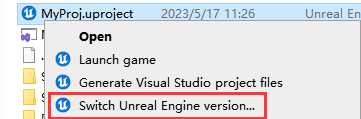

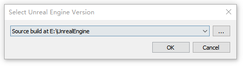

If the engine does not appear in the drop-down list of the selection box, you need to go to the directory below and use **UnrealVersionSelector-Win64-Shipping.exe** to register:


#### Enabling Built-in Plugins

In the engine, after enabling a built-in plugin, the editor will automatically add a new plugin entry under `Plugins` in the `*.uproject` file:

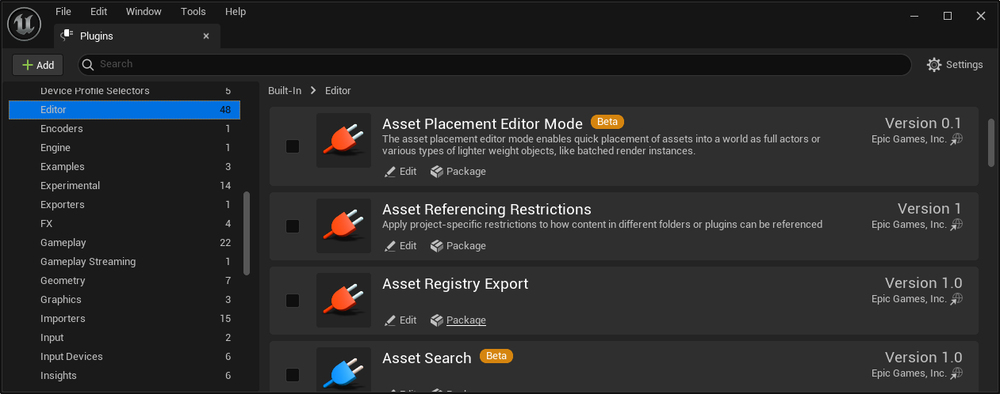

#### Adding Project Modules

**Modules** are the basic building blocks of the software architecture of **Unreal Engine (UE)**. They encapsulate integrated programming tools, runtime functions, libraries, or other features in independent code units.

Using modular programming can bring the following benefits:

- Modules enforce good code separation, which can be used to encapsulate functionality and hide internal components of the code.
- Modules are compiled into separate compilation units. This means that only changed modules need to be compiled, significantly reducing compilation time for larger projects.
- Modules are linked together in a dependency graph, and only code packages that are actually used are allowed to include header files, in line with the [Include What You Use (IWYU)](https://docs.unrealengine.com/5.2/zh-CN/include-what-you-use-iwyu-for-unreal-engine-programming) standard. This means that modules not used in your project will be safely excluded from the editor.
- You can control which modules are loaded and unloaded at any time during runtime. This allows you to manage which systems are available and active, thereby optimizing the performance of your project.
- You can include or exclude modules in your project based on specific conditions (e.g., which platform the project is written for).

All projects and plugins have their own **main module** by default.

In the UE editor main panel - `Tools` - `Debug` - `Modules`, you can see all modules enabled in the current project:

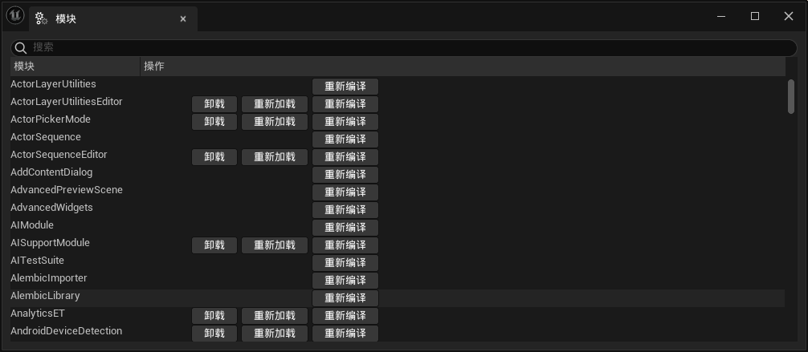

For information on creating modules, please refer to:

- Unreal Engine Modules: https://docs.unrealengine.com/5.2/zh-CN/unreal-engine-modules/
- Creating a Gameplay Module: https://docs.unrealengine.com/5.2/zh-CN/how-to-make-a-gameplay-module-in-unreal-engine/

In addition to reading the documentation, you must also understand some basic concepts of C++ project building:

- `*.Build.cs` is the build file for UE modules. It defines the build rules for the module, including include paths, dependent libraries, compilation options, etc. (similar to CMake's CMakeLists.txt)

A basic `*.Build.cs` structure is as follows:

```C#
using UnrealBuildTool;
using System.IO; // for Path
public class ModuleName : ModuleRules
{
	public ModuleName(ReadOnlyTargetRules Target) : base(Target)
	{
		PCHUsage = ModuleRules.PCHUsageMode.UseExplicitOrSharedPCHs;

		PublicIncludePaths.AddRange(
			new string[] {
				// ... add public include paths required here ...
			}
		);


		PrivateIncludePaths.AddRange(
			new string[] {
				// ... add other private include paths required here ...
			}
		);


		PublicDependencyModuleNames.AddRange(
			new string[]
			{
				"Core",
				"CoreUObject",
				"Engine",
				// ... add other public dependencies that you statically link with here ...
			}
		);

		PrivateDependencyModuleNames.AddRange(
			new string[]
			{
				// ... add private dependencies that you statically link with here ...	
			}
		);
	}
}
```

- UE's build tool (UBT) generates the project's **project files** (VS project's `*.sln` file) based on `*.Build.cs`. Therefore, when modifying the content of `*.Build.cs` or the code file structure of the module, you need to use UBT to regenerate the project files so that the IDE can analyze the changed code and dependency relationships.
- Include paths and dependent libraries are basic concepts of C++ project building.
  - Include paths are used to add search paths for header file definitions.
  - Dependent libraries are used to **link** the implementation of external modules to the current module.

Suppose there is a C++ header file `D:/Unreal Projects/MyProj/Source/MyProj/MyHeader.h` in the project. To use the code definitions in it, you can directly use:

```c++
#include "D:/Unreal Projects/MyProj/Source/MyProj/MyHeader.h"
```

If you add `"D:/Unreal Projects/MyProj/Source/MyProj"` to `IncludePaths` in `*.Build.cs`, you can change it to:

``` c++
#include "MyHeader.h"
```

If you want to use code from other modules in the current module, you only need to add the target module to `DependencyModuleNames` in `*.Build.cs`.

> If you don't do this step, you will get a link error during compilation. At this time, you only need to find the code file of the structure used, find which `*.Build.cs` the file is located under through the IDE, and add its module name to `DependencyModuleNames` to solve the problem.

#### The Difference Between Public and Private

Simply put, Public means transitive, and Private means only for self-use.

Suppose there are three modules A, B, and C, with the following code file structure:

- Folder A
  - A.Build.cs
  - Public folder
    - a.h
  - Private folder
    - A.h
- Folder B
  - B.Build.cs
  - Public folder
    - b.h
  - Private folder
    - B.h

- Folder C
  - C.Build.cs
  - Public folder
    - c.h
  - Private folder
    - C.h

The pseudo-code of `*.Build.cs` is as follows:

```C#
public class A(ReadOnlyTargetRules Target) : base(Target){
}

public class B(ReadOnlyTargetRules Target) : base(Target){
    PrivateDependencyModuleNames.AddRange( new string[] { "A"});
}

public class C(ReadOnlyTargetRules Target) : base(Target){
    PublicDependencyModuleNames.AddRange( new string[] { "B"});
}
```

If you use files from modules A and B in **c.h**, the following results will occur:

```c++
#include "C.h"
//【Compilation Error 0】, the Private folder is not a search path for module C.

#include "b.h"
// Compiles normally. UE automatically adds the module's own Public directory to the PublicIncludePaths of Build.cs. Also, since module C's public dependencies include module B,
// module B's PublicIncludePaths are also passed to module C. Therefore, module C can normally access the Public directory in B.


#include "B.h"	
//【Compilation Error 1】, module C cannot access module B's Private directory.

#include "A.h"			
//【Compilation Error 2】, since module C's public dependencies include module B, but module B only added module A in its private dependencies.
// Therefore, B can normally use Public content in A, but C cannot use A.

#include "a.h"			
//【Compilation Error 3】, module C cannot access any content of module A.

```

To eliminate the above errors, you can change the structure of `*.Build.cs` to:

``` C#
public class A(ReadOnlyTargetRules Target) : base(Target){
    PublicIncludePaths.AddRange( new string[] { "Private"});	// Fixes 【Compilation Error 3】 by adding module A's Private folder to the public include paths.
}

public class B(ReadOnlyTargetRules Target) : base(Target){
    PublicDependencyModuleNames.AddRange( new string[] { "A"});	// Fixes 【Compilation Errors 2 and 3】 by adding module A as a public dependency of module B, indicating a transitive dependency.
    PublicIncludePaths.AddRange( new string[] { "Private"});	// Fixes 【Compilation Error 1】 by adding module B's Private folder to the public include paths.
}

public class C(ReadOnlyTargetRules Target) : base(Target){		
    PublicDependencyModuleNames.AddRange( new string[] { "B"});
    PublicIncludePaths.AddRange( new string[] { "Private"});	// Fixes 【Compilation Error 0】 by adding module C's Private folder to the public include paths.
}
```

After reading the above example, it's not difficult to understand the difference between Public and Private:

- Public means transitive
- Private means only for current use

Readers may wonder: why not just use Public uniformly? It can save a lot of operations. The reason is that it also brings problems:

- Definition conflicts: When overlapping definitions (classes, functions, global variables) appear in the imported modules, it will cause compilation errors.
- Slow compilation: If module B imports module A, when the code of module A changes, it will also trigger recompilation of module B. Therefore, a large number of unnecessary dependencies will seriously slow down the compilation speed. For example, `#include "CoreMinimal.h"` can also cause this problem.

To prevent the risk of compilation conflicts and slow compilation in modules, you should use Private as much as possible when writing modules. Only when the module needs to be passed externally should you consider using Public.

## Object System

The logical main body of Unreal Engine adopts an object-oriented design paradigm. To allow all **classes** to have a unified management method, Unreal, like other object-oriented frameworks, provides its own base class—**UObject**.

### Structure

Its structural hierarchy is as follows:

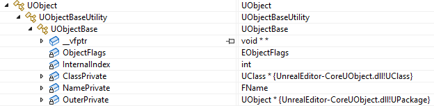

It is mainly composed of three levels of structure, each with different responsibilities:

- **UObjectBase**: Data layer, defines all basic data of UObject, including:
  - **ObjectFlags**: Various flags of the Object
  - **InternalIndex**: All Object pointers in UE are stored in an array. Here, the index is recorded for quick positioning in the array, mainly used for GC.
  - **ClassPrivate**: Meta-type of the Object—UClass: stores reflection data of the class
  - **NamePrivate**: Name of the Object
  - **OuterPrivate**: Object that holds this Object (related to serialization, **not related to lifecycle**)
- **UObjectBaseUtility**: Data interface layer, provides many processing interfaces for the data layer.

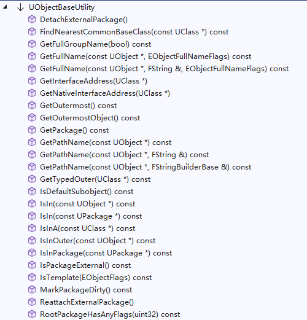

- **UObject**: Function layer, provides a large number of basic function interfaces for the object system.

In the constructor of **UObjectBase**, there is such code:

```c++
UObjectBase::UObjectBase(UClass* InClass, EObjectFlags InFlags, EInternalObjectFlags InInternalFlags, UObject *InOuter, FName InName)
:   ObjectFlags         (InFlags)
,   InternalIndex       (INDEX_NONE)
,   ClassPrivate        (InClass)
,   OuterPrivate        (InOuter)
{
    check(ClassPrivate);
    // Add to global table.
    AddObject(InName, InInternalFlags);
}
```

Among them, AddObject will store the address of the newly created UObject in the global variable **GUObjectArray**, which is located in: `Runtime\CoreUObject\Private\UObject\UObjectHash.cpp`

```c++
// Global UObject array instance
FUObjectArray GUObjectArray;
```

The definition of **FUObjectArray** is located in `Runtime\CoreUObject\Public\UObject\UObjectArray.h`. It is mainly used internally to manage all Objects, clusters, and GC. Its main data members are as follows:

```c++
class FUObjectArray{
    //typedef TStaticIndirectArrayThreadSafeRead<UObjectBase, 8 * 1024 * 1024 /* Max 8M UObjects */, 16384 /* allocated in 64K/128K chunks */ > TUObjectArray;
    typedef FChunkedFixedUObjectArray TUObjectArray;

    // note these variables are left with the Obj prefix so they can be related to the historical GObj versions

    /** First index into objects array taken into account for GC.                           */
    int32 ObjFirstGCIndex;
    /** Index pointing to last object created in range disregarded for GC.                  */
    int32 ObjLastNonGCIndex;
    /** Maximum number of objects in the disregard for GC Pool */
    int32 MaxObjectsNotConsideredByGC;

    /** If true this is the intial load and we should load objects int the disregarded for GC range.    */
    bool OpenForDisregardForGC;
    /** Array of all live objects.                                          */
    TUObjectArray ObjObjects;
    /** Synchronization object for all live objects.                                            */
    mutable FCriticalSection ObjObjectsCritical;
    /** Available object indices.                                           */
    TArray<int32> ObjAvailableList;

    /**
     * Array of things to notify when a UObjectBase is created
     */
    TArray<FUObjectCreateListener* > UObjectCreateListeners;
    /**
     * Array of things to notify when a UObjectBase is destroyed
     */
    TArray<FUObjectDeleteListener* > UObjectDeleteListeners;
};
```

Another key structure is **FUObjectHashTables**, which is a singleton class that stores a large number of mappings for quick lookup. Its code structure is as follows:

```c++
struct FHashBucket{
    void *ElementsOrSetPtr[2];  //May be UObjectBase* or TSet<UObjectBase*>*
};

template <typename T>
class TBucketMap : private TMap<T, FHashBucket>{
    //...
};

class FUObjectHashTables
{
    /** Thread lock */
    FCriticalSection CriticalSection;
public:

    TBucketMap<int32> Hash;                 //Mapping from Id to Object
    TMultiMap<int32, uint32> HashOuter;      //Mapping from Id to parent object ID

    TBucketMap<UObjectBase*> ObjectOuterMap;    //Mapping from Object to child object set
    TBucketMap<UClass*> ClassToObjectListMap;   //Mapping from UClass to all its instances
    TMap<UClass*, TSet<UClass*> > ClassToChildListMap;  //Mapping from UClass to its derived Classes
    TAtomic<uint64> ClassToChildListMapVersion;         

    TBucketMap<UPackage*> PackageToObjectListMap;       //Mapping from Package to object set

    TMap<UObjectBase*, UPackage*> ObjectToPackageMap;   //Mapping from Object to Package

    static FUObjectHashTables& Get()
    {
        static FUObjectHashTables Singleton;
        return Singleton;
    }
    //...
};
```

### Creation

A simple UObject class definition is as follows:

``` c++
#pragma once

#include "UObject/Object.h"
#include "CustomObject.generated.h"		//If #include "{filename}.generated.h" exists, UE will use UHT to generate reflection data for this file.

UCLASS()
class UCustomObject :public UObject {
    GENERATED_BODY()	//GENERATED_BODY() is the entry macro for reflection. UHT will generate the definition of this macro, which defines some structures to be inserted into the class definition of UCustomObject.
public:
    UCustomObject() {}
};
```

To create an object instance of UObject, the function `NewObject<>()` is generally used, such as `NewObject<UCustomObject>()`. Its complete function definition is as follows:

```c++
/**
 * Convenience template for constructing a gameplay object
 *
 * @param	Outer		the outer for the new object.  If not specified, object will be created in the transient package.
 * @param	Class		the class of object to construct
 * @param	Name		the name for the new object.  If not specified, the object will be given a transient name via MakeUniqueObjectName
 * @param	Flags		the object flags to apply to the new object
 * @param	Template	the object to use for initializing the new object.  If not specified, the class's default object will be used
 * @param	bCopyTransientsFromClassDefaults	if true, copy transient from the class defaults instead of the pass in archetype ptr (often these are the same)
 * @param	InInstanceGraph						contains the mappings of instanced objects and components to their templates
 * @param	ExternalPackage						Assign an external Package to the created object if non-null
 *
 * @return	a pointer of type T to a new object of the specified class
 */
template< class T >
FUNCTION_NON_NULL_RETURN_START
	T* NewObject(UObject* Outer,
                 const UClass* Class, 
                 FName Name = NAME_None,
                 EObjectFlags Flags = RF_NoFlags,
                 UObject* Template = nullptr, 
                 bool bCopyTransientsFromClassDefaults = false,
                 FObjectInstancingGraph* InInstanceGraph = nullptr,
                 UPackage* ExternalPackage = nullptr)
{
	if (Name == NAME_None)
	{
		FObjectInitializer::AssertIfInConstructor(Outer, TEXT("NewObject with empty name can't be used to create default subobjects (inside of UObject derived class constructor) as it produces inconsistent object names. Use ObjectInitializer.CreateDefaultSubobject<> instead."));
	}

#if DO_CHECK
	// Class was specified explicitly, so needs to be validated
	CheckIsClassChildOf_Internal(T::StaticClass(), Class);
#endif

	FStaticConstructObjectParameters Params(Class);
	Params.Outer = Outer;
	Params.Name = Name;
	Params.SetFlags = Flags;
	Params.Template = Template;
	Params.bCopyTransientsFromClassDefaults = bCopyTransientsFromClassDefaults;
	Params.InstanceGraph = InInstanceGraph;
	Params.ExternalPackage = ExternalPackage;
	return static_cast<T*>(StaticConstructObject_Internal(Params));
}
```

Regarding Object creation, the following points need to be noted:

- **Outer has no relationship with the Object's lifecycle**: The Outer parameter is used to indicate which parent object the current object **belongs to in storage**. It is related to asset serialization.

- **Objects can be created through UClass**: `NewObject<UCustomObject>()` is equivalent to `NewObject<UObject>(GetTransientPackage(), UCustomObject::StaticClass())`

Generally, most objects we come into contact with in Unreal Engine are **UObjects**. At the code level, to create any UObject, we generally use this method:

``` c++
UObject* MyObject = NewObject<UObject>();

UTexture2D* MyTexture = NewObject<UTexture2D>();

UBlueprint* MyBlueprint = NewObject<UBlueprint>();

UStaticMesh* MyStaticMesh = NewObject<UStaticMesh>();

UNiagaraSystem* MyNiagaraSystem = NewObject<UNiagaraSystem>();

AActor* MyActor = NewObject<AActor>();

UStaticMeshComponent* MyStaticMeshComponent = NewObject<StaticMeshComponent>();

UWorld* World = NewObject<UWorld>();

...
```

These statements have no syntax errors in Unreal and can be compiled successfully.

But friends familiar with Unreal may know that if you create objects directly like this, although they can be created successfully, some of their mechanisms may not work properly. Because those types are accompanied by specific construction data and logic, and the engine often wraps them into new interfaces, such as:

- Use `UWorld::CreateWorld(...)` to construct UWorld
- Use `UWorld::SpawnActor(...)` to create an Actor in the corresponding world
- Use `FKismetEditorUtilities::CreateBlueprint(...)` to create a Blueprint (UBlueprint) in the editor
- Use `UObject::CreateDefaultSubobject(...)` in the Actor's constructor to create the component structure belonging to the current Actor
- ...

Therefore, if some mechanisms of the object created using `NewObject()` do not work properly, it is very likely that the engine has encapsulated specific construction logic. If you can't find it, you can try to find those initialization and registration logics and execute them manually.

### Destruction

In addition to the creation of UObject objects, their destruction, i.e., lifecycle management, is also very important.

As we all know, Unreal has a set of automatic garbage collection mechanisms, which is a **timed and quantitative** recycling method based on object references.

For developers, we usually don't need to deeply analyze the execution principle of this mechanism, but only need to master its basic usage. The basic usage mainly includes the following points:

- How does the engine define whether an object is garbage?
- How to configure and use GC?

There are **four direct ways** in UE to prevent an object from being considered garbage:

- Use the `EObjectFlags::RF_Standalone` flag when calling `NewObject`. This flag ensures that the created object will not be GC-collected in the **editor** (see `GarbageCollection.h line28` for details).

- Use the function `void UObject::AddToRoot()` to add the object to the root object set, so that the object will not be released. Use `void UObject::RemoveFromRoot()` to remove the object from the root object set.

- Derive the **FGCObject** class, which is widely used for object lifecycle management in various modules of UE: [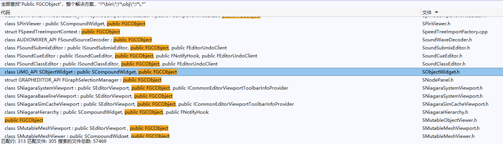](https://italink.github.io/ModernGraphicsEngineGuide/04-UnrealEngine/Resources/image-20230523170954045.png)

    When UE executes GC, it will call the `virtual void AddReferencedObjects( FReferenceCollector& Collector )` function of **all FGCObject objects**. **Collector** is an operation entry. Objects added to **Collector** will not be released in this GC.

    The constructor of **FGCObject** registers the object to the global FGCObject list in UE, which means that objects derived from the FGCObject class can be used as root objects.

    Therefore, developers only need to add `public FGCObject` to their native structure definitions and derive its related functions:

    ```
    class FMyManager : public FGCObject {
        virtual void AddReferencedObjects(FReferenceCollector& Collector) override {
            //Collector.AddReferencedObject(...)
            //..
        }
        virtual FString GetReferencerName() const override{ return TEXT("FMyManager"); }   
    };
    ```

- Use the smart pointer **TStrongObjectPtr** to store objects. Its essence still uses **FGCObject**, but this structure is very heavy and is not recommended for large-scale use. For details, see:

    - [UE4's Smart Pointers Related to UObject](https://zhuanlan.zhihu.com/p/371851019)

The **indirect way** is:

- When an object is not garbage currently, the objects it references are also not garbage.

UE mainly uses reflection to build and analyze references between objects, such as this code:

```c++
UCLASS()
class UCustomObject :public UObject {
public:
    UCustomObject() {}

    UPROPERTY()         
    UObject* Prop = nullptr;
};

int main() {
    auto A = NewObject<UCustomObject>();
    auto B = NewObject<UCustomObject>();
    A->Prop = B;        
    A->AddToRoot();
    // Engine Loop
    return 0;
}
```

- Since `Object A` is added to the root object set, it will not be released. Also, because UE determines through reflection that the `Prop property` of `Object A` references `Object B`, B will not be released either.

Regarding usage, we can directly destroy objects manually through the following functions:

- `bool UObject::ConditionalBeginDestroy()`: Directly destroy the object without waiting for GC.
- `void UObject::MarkAsGarbage()`: Mark as garbage, which will be released in the next GC.

You can also use the following code to manually execute GC in the current frame:

```
bool bForceGarbageCollectionPurge = true;   //Whether to perform full GC
GEngine->ForceGarbageCollection(bForceGarbageCollectionPurge);
```

In addition, it should be noted that UE's **object system** and **reflection system** complement each other. Due to some reasons, UObject objects **do not use destructors** to complete resource release logic. Therefore, when you need to implement destructor logic, please override the virtual function of UObject:

- `virtual void BeginDestroy()`

Regarding adjusting the GC parameter details in project configuration:

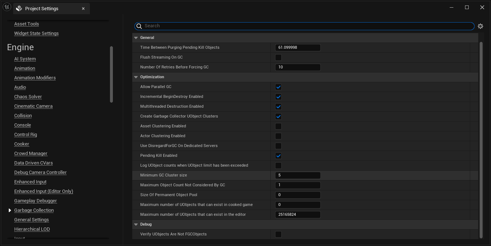

### Application

Create a unique object name:

``` c++
FName MakeUniqueObjectName(UObject* Parent,
                           const UClass* Class,
                           FName InBaseName/*=NAME_None*/,
                           EUniqueObjectNameOptions Options /*= EUniqueObjectNameOptions::None*/)
```

Listen to UObject creation and destruction:

```c++
class FUObjectCreateListener
{
public:
    virtual ~FUObjectCreateListener() {}
    virtual void NotifyUObjectCreated(const class UObjectBase *Object, int32 Index)=0;
    virtual void OnUObjectArrayShutdown()=0;
};

class FUObjectDeleteListener
{
public:
    virtual ~FUObjectDeleteListener() {}
    virtual void NotifyUObjectDeleted(const class UObjectBase *Object, int32 Index)=0;
    virtual void OnUObjectArrayShutdown() = 0;
};
```

Developers can custom-derive these two types of listeners and call the following functions of **GUObjectArray** to achieve the purpose of globally monitoring or modifying UObjects (this is how UnLua does it):

```c++
class FUObjectArray{
    void AddUObjectCreateListener(FUObjectCreateListener* Listener);
    void RemoveUObjectCreateListener(FUObjectCreateListener* Listener);
    void AddUObjectDeleteListener(FUObjectDeleteListener* Listener);
    void RemoveUObjectDeleteListener(FUObjectDeleteListener* Listener);
};
```

`Runtime\CoreUObject\Public\UObject\UObjectHash.h` provides some static methods to manage and access the data of **FUObjectHashTables**

``` c++
UObject* StaticFindObjectFastInternal(const UClass* Class, const UObject* InOuter, FName InName, bool ExactClass = false, bool AnyPackage = false, EObjectFlags ExclusiveFlags = RF_NoFlags, EInternalObjectFlags ExclusiveInternalFlags = EInternalObjectFlags::None);

UObject* StaticFindObjectFastExplicit(const UClass* ObjectClass, FName ObjectName, const FString& ObjectPathName, bool bExactClass, EObjectFlags ExcludeFlags = RF_NoFlags);

COREUOBJECT_API void GetObjectsWithOuter(const class UObjectBase* Outer, TArray<UObject *>& Results, bool bIncludeNestedObjects = true, EObjectFlags ExclusionFlags = RF_NoFlags, EInternalObjectFlags ExclusionInternalFlags = EInternalObjectFlags::None);

COREUOBJECT_API void ForEachObjectWithOuterBreakable(const class UObjectBase* Outer, TFunctionRef<bool(UObject*)> Operation, bool bIncludeNestedObjects = true, EObjectFlags ExclusionFlags = RF_NoFlags, EInternalObjectFlags ExclusionInternalFlags = EInternalObjectFlags::None);

inline void ForEachObjectWithOuter(const class UObjectBase* Outer, TFunctionRef<void(UObject*)> Operation, bool bIncludeNestedObjects = true, EObjectFlags ExclusionFlags = RF_NoFlags, EInternalObjectFlags ExclusionInternalFlags = EInternalObjectFlags::None)
{
    ForEachObjectWithOuterBreakable(Outer, [Operation](UObject* Object) { Operation(Object); return true; }, bIncludeNestedObjects, ExclusionFlags, ExclusionInternalFlags);
}

COREUOBJECT_API class UObjectBase* FindObjectWithOuter(const class UObjectBase* Outer, const class UClass* ClassToLookFor = nullptr, FName NameToLookFor = NAME_None);

COREUOBJECT_API void GetObjectsWithPackage(const class UPackage* Outer, TArray<UObject *>& Results, bool bIncludeNestedObjects = true, EObjectFlags ExclusionFlags = RF_NoFlags, EInternalObjectFlags ExclusionInternalFlags = EInternalObjectFlags::None);

COREUOBJECT_API void ForEachObjectWithPackage(const class UPackage* Outer, TFunctionRef<bool(UObject*)> Operation, bool bIncludeNestedObjects = true, EObjectFlags ExclusionFlags = RF_NoFlags, EInternalObjectFlags ExclusionInternalFlags = EInternalObjectFlags::None);

COREUOBJECT_API void GetObjectsOfClass(const UClass* ClassToLookFor, TArray<UObject *>& Results, bool bIncludeDerivedClasses = true, EObjectFlags ExcludeFlags = RF_ClassDefaultObject, EInternalObjectFlags ExclusionInternalFlags = EInternalObjectFlags::None);

COREUOBJECT_API void ForEachObjectOfClass(const UClass* ClassToLookFor, TFunctionRef<void(UObject*)> Operation, bool bIncludeDerivedClasses = true, EObjectFlags ExcludeFlags = RF_ClassDefaultObject, EInternalObjectFlags ExclusionInternalFlags = EInternalObjectFlags::None);

COREUOBJECT_API void ForEachObjectOfClasses(TArrayView<const UClass*> ClassesToLookFor, TFunctionRef<void(UObject*)> Operation, EObjectFlags ExcludeFlags = RF_ClassDefaultObject, EInternalObjectFlags ExclusionInternalFlags = EInternalObjectFlags::None);

/*Get UClass of all derived classes of UClass*/
COREUOBJECT_API void GetDerivedClasses(const UClass* ClassToLookFor, TArray<UClass *>& Results, bool bRecursive = true);

COREUOBJECT_API TMap<UClass*, TSet<UClass*>> GetAllDerivedClasses();

COREUOBJECT_API bool ClassHasInstancesAsyncLoading(const UClass* ClassToLookFor);

void HashObject(class UObjectBase* Object);

void UnhashObject(class UObjectBase* Object);

void HashObjectExternalPackage(class UObjectBase* Object, class UPackage* Package);

void UnhashObjectExternalPackage(class UObjectBase* Object);

UPackage* GetObjectExternalPackageThreadSafe(const class UObjectBase* Object);

UPackage* GetObjectExternalPackageInternal(const class UObjectBase* Object);
```

The `ObjectTools` namespace in `Editor\UnrealEd\Public\ObjectTools.h` also provides many methods for safely operating Objects **in the editor**. In addition, there are similar ones like **ThumbnailTools**, **AssetTools**...

``` c++
namespace ObjectTools
{
    UNREALED_API bool IsObjectBrowsable( UObject* Obj );

    UNREALED_API void DuplicateObjects( const TArray<UObject*>& SelectedObjects, const FString& SourcePath = TEXT(""), const FString& DestinationPath = TEXT(""), bool bOpenDialog = true, TArray<UObject*>* OutNewObjects = NULL );

    UNREALED_API UObject* DuplicateSingleObject(UObject* Object, const FPackageGroupName& PGN, TSet<UPackage*>& InOutPackagesUserRefusedToFullyLoad, bool bPromptToOverwrite = true, TMap<TSoftObjectPtr<UObject>, TSoftObjectPtr<UObject>>* DuplicatedObjects = nullptr);

    UNREALED_API FConsolidationResults ConsolidateObjects( UObject* ObjectToConsolidateTo, TArray<UObject*>& ObjectsToConsolidate, bool bShowDeleteConfirmation = true );
    UNREALED_API FConsolidationResults ConsolidateObjects(UObject* ObjectToConsolidateTo, TArray<UObject*>& ObjectsToConsolidate, TSet<UObject*>& ObjectsToConsolidateWithin, TSet<UObject*>& ObjectsToNotConsolidateWithin, bool bShouldDeleteAfterConsolidate, bool bWarnAboutRootSet = true);
    UNREALED_API void CompileBlueprintsAfterRefUpdate(const TArray<UObject*>& ObjectsConsolidatedWithin);

    UNREALED_API void CopyReferences( const TArray< UObject* >& SelectedObjects ); // const

    UNREALED_API void ShowReferencers( const TArray< UObject* >& SelectedObjects ); // const

    UNREALED_API void ShowReferenceGraph( UObject* ObjectToGraph );

    UNREALED_API void ShowReferencedObjs( UObject* Object, const FString& CollectionName = FString(), ECollectionShareType::Type ShareType = ECollectionShareType::CST_Private);

    UNREALED_API void SelectActorsInLevelDirectlyReferencingObject( UObject* RefObj );

    UNREALED_API void SelectObjectAndExternalReferencersInLevel( UObject* Object, const bool bRecurseMaterial );

    UNREALED_API void AccumulateObjectReferencersForObjectRecursive( UObject* Object, TArray<UObject*>& Referencers, const bool bRecurseMaterial );

    bool ShowDeleteConfirmationDialog ( const TArray<UObject*>& ObjectsToDelete );

    UNREALED_API void CleanupAfterSuccessfulDelete ( const TArray<UPackage*>& ObjectsDeletedSuccessfully, bool bPerformReferenceCheck = true );

    UNREALED_API int32 DeleteObjects( const TArray< UObject* >& ObjectsToDelete, bool bShowConfirmation = true, EAllowCancelDuringDelete AllowCancelDuringDelete = EAllowCancelDuringDelete::AllowCancel);

    UNREALED_API int32 DeleteObjectsUnchecked( const TArray< UObject* >& ObjectsToDelete );

    UNREALED_API int32 DeleteAssets( const TArray<FAssetData>& AssetsToDelete, bool bShowConfirmation = true );

    UNREALED_API bool DeleteSingleObject( UObject* ObjectToDelete, bool bPerformReferenceCheck = true );

    UNREALED_API int32 ForceDeleteObjects( const TArray< UObject* >& ObjectsToDelete, bool ShowConfirmation = true );

    UNREALED_API void ForceReplaceReferences(UObject* ObjectToReplaceWith, TArray<UObject*>& ObjectsToReplace);
    UNREALED_API void ForceReplaceReferences(UObject* ObjectToReplaceWith, TArray<UObject*>& ObjectsToReplace, TSet<UObject*>& ObjectsToReplaceWithin);

    UNREALED_API void AddExtraObjectsToDelete(TArray< UObject* >& ObjectsToDelete);

    UNREALED_API bool ComposeStringOfReferencingObjects( TArray<FReferencerInformation>& References, FString& RefObjNames, FString& DefObjNames );

    UNREALED_API void DeleteRedirector(UObjectRedirector* Redirector);

    UNREALED_API bool GetMoveDialogInfo(const FText& DialogTitle, UObject* Object, bool bUniqueDefaultName, const FString& SourcePath, const FString& DestinationPath, FMoveDialogInfo& InOutInfo);

    UNREALED_API bool RenameObjectsInternal( const TArray<UObject*>& Objects, bool bLocPackages, const TMap< UObject*, FString >* ObjectToLanguageExtMap, const FString& SourcePath, const FString& DestinationPath, bool bOpenDialog );

    UNREALED_API bool RenameSingleObject(UObject* Object, FPackageGroupName& PGN, TSet<UPackage*>& InOutPackagesUserRefusedToFullyLoad, FText& InOutErrorMessage, const TMap< UObject*, FString >* ObjectToLanguageExtMap = NULL, bool bLeaveRedirector = true);

    UNREALED_API void AddLanguageVariants( TArray<UObject*>& OutObjects, TMap< UObject*, FString >& OutObjectToLanguageExtMap, USoundWave* Wave );

    UNREALED_API bool RenameObjects( const TArray< UObject* >& SelectedObjects, bool bIncludeLocInstances, const FString& SourcePath = TEXT(""), const FString& DestinationPath = TEXT(""), bool bOpenDialog = true );

    UNREALED_API FString SanitizeObjectName(const FString& InObjectName);

    UNREALED_API FString SanitizeObjectPath(const FString& InObjectPath);

    UNREALED_API FString SanitizeInvalidChars(const FString& InText, const FString& InvalidChars);

    UNREALED_API FString SanitizeInvalidChars(const FString& InText, const TCHAR* InvalidChars);

    UNREALED_API void SanitizeInvalidCharsInline(FString& InText, const TCHAR* InvalidChars);

    UNREALED_API void GenerateFactoryFileExtensions( const UFactory* InFactory, FString& out_Filetypes, FString& out_Extensions, TMultiMap<uint32, UFactory*>& out_FilterIndexToFactory );

    UNREALED_API void GenerateFactoryFileExtensions( const TArray<UFactory*>& InFactories, FString& out_Filetypes, FString& out_Extensions, TMultiMap<uint32, UFactory*>& out_FilterIndexToFactory );

    UNREALED_API void AppendFactoryFileExtensions( UFactory* InFactory, FString& out_Filetypes, FString& out_Extensions );

    UNREALED_API void AppendFormatsFileExtensions(const TArray<FString>& InFormats, FString& out_FileTypes, FString& out_Extensions);

    UNREALED_API void AssembleListOfExporters(TArray<UExporter*>& OutExporters);

    UNREALED_API void TagInUseObjects( EInUseSearchOption SearchOption, EInUseSearchFlags InUseSearchFlags = EInUseSearchFlags::None);

    UNREALED_API TSharedPtr<SWindow> OpenPropertiesForSelectedObjects( const TArray<UObject*>& SelectedObjects );

    UNREALED_API void RemoveDeletedObjectsFromPropertyWindows( TArray<UObject*>& DeletedObjects );

    UNREALED_API bool IsAssetValidForPlacing(UWorld* InWorld, const FString& ObjectPath);

    UNREALED_API bool IsClassValidForPlacing(const UClass* InClass);

    UNREALED_API bool IsClassRedirector( const UClass* Class );

    UNREALED_API bool AreObjectsOfEquivalantType( const TArray<UObject*>& InProposedObjects );

    UNREALED_API bool AreClassesInterchangeable( const UClass* ClassA, const UClass* ClassB );

    UNREALED_API void GatherObjectReferencersForDeletion(UObject* InObject, bool& bOutIsReferenced, bool& bOutIsReferencedByUndo, FReferencerInformationList* OutMemoryReferences = nullptr, bool bInRequireReferencingProperties = false);

    UNREALED_API void GatherSubObjectsForReferenceReplacement(TSet<UObject*>& InObjects, TSet<UObject*>& ObjectsToExclude, TSet<UObject*>& OutObjectsAndSubObjects);
};
```

## Reflection System

Reflection is an emerging concept in modern program development. It aims to examine code from a Meta perspective, treating enums, classes, structures, functions... in the code as runtime-accessible or even manipulable assets. **Essentially, it is the introspection of C++ code.**

For the concept of reflection and its basic implementation, please refer to:

- [Modern Graphics Engine Introduction Guide (V)—Macros, Templates, Reflection](https://zhuanlan.zhihu.com/p/600456225)

### Structure

In UE, a relatively complete reflection markup example is as follows:

```c++
/*CustomStruct.h*/
#pragma once        
#include "UObject/Object.h"
#include "CustomStruct.generated.h"

UCLASS()
class UCustomClass :public UObject {
    GENERATED_BODY()
public:
    UCustomClass() {}
public:
    UFUNCTION()
    static int Add(int a, int b) {
        UE_LOG(LogTemp, Warning, TEXT("Hello World"));
        return a + b;
    }

private:
    UPROPERTY(meta = (Keywords = "This is keywords"))
    int SimpleValue = 123;

    UPROPERTY()
    TMap<FString, int> ComplexValue = { {"Key0",0},{"Key1",1} };
};
```

```cpp
UENUM()
enum class ECustomEnum : uint8 {
    One UMETA(DisplayName = "This is 0"),
    Two UMETA(DisplayName = "This is 1"),
    Tree UMETA(DisplayName = "This is 2")
};

USTRUCT()
struct FCustomStruct
{
    GENERATED_BODY()

    UPROPERTY()
    int Value = 123;
};

// Fixed structure definition of Interface
UINTERFACE()
class UCustomInterface :public UInterface {
    GENERATED_BODY()
};
class ICustomInterface
{
    GENERATED_BODY()
public:
    UFUNCTION()
    virtual void SayHello() {}
};
```

For the structures marked by the above macros, UE will create corresponding data structures to store their metadata.

- **UCLASS()** : UClass, stores class description information
- **USTRUCT()** : UScriptStruct, stores struct description information
- **UENUM()** : UEnum, stores enum description information
- **UPROPERTY()** : FProperty, stores property description information
- **UFUNCTION()** : UFunction, stores function description information
- **UINTERFACE()** : None

You can add some parameters in the parentheses of these macros for use by related systems. For specific configurations, please refer to:

- UnrealSpecifiers | UE5 Identifier Detailed Explanation: https://github.com/fjz13/UnrealSpecifiers

- [Reflection System in Unreal Engine | Unreal Engine 5.2 Documentation](https://docs.unrealengine.com/5.2/en-US/reflection-system-in-unreal-engine/)
  - [Objects in Unreal Engine | Unreal Engine 5.2 Documentation](https://docs.unrealengine.com/5.2/en-US/objects-in-unreal-engine/)
  - [UFunctions in Unreal Engine | Unreal Engine 5.2 Documentation](https://docs.unrealengine.com/5.2/en-US/ufunctions-in-unreal-engine/)
  - [Unreal Engine UProperties | Unreal Engine 5.2 Documentation](https://docs.unrealengine.com/5.2/en-US/unreal-engine-uproperties/)
  - [Structs in Unreal Engine | Unreal Engine 5.2 Documentation](https://docs.unrealengine.com/5.2/en-US/structs-in-unreal-engine/)
  - [Interfaces in Unreal Engine | Unreal Engine 5.2 Documentation](https://docs.unrealengine.com/5.2/en-US/interfaces-in-unreal-engine/)
  - [Metadata Specifiers in Unreal Engine | Unreal Engine 5.2 Documentation](https://docs.unrealengine.com/5.2/en-US/metadata-specifiers-in-unreal-engine/)
- https://www.unrealengine.com/en-US/blog/unreal-property-system-reflection

Here is a relatively complete reflection usage example:

```c++
UClass* MetaClassFromGlobalStatic = StaticClass<UCustomClass>();
UClass* MetaClassFromMemberStatic = UCustomClass::StaticClass();            // Get UClass via static method based on type
UCustomClass* Instance = NewObject<UCustomClass>();
UClass* MetaClassFromInstance = Instance->GetClass();                       // Get UClass from instance, still valid when the instance pointer degenerates to parent class
UClass* SuperMetaClass = MetaClassFromInstance->GetSuperClass();            // Get the parent class's UClass
bool IsCustomClass = MetaClassFromInstance->IsChildOf(UCustomClass::StaticClass()); // Check inheritance relationship

UFunction* FuncAdd = MetaClassFromInstance->FindFunctionByName("Add");      // Get function
UFunction* SuperFunc = FuncAdd->GetSuperFunction();                         // Get parent function, which is null here

/* Call function */
int A = 5, B = 10;
uint8* Params = (uint8*)FMemory::Malloc(FuncAdd->ReturnValueOffset);
FMemory::Memcpy((void*)Params, (void*)&A, sizeof(int));
FMemory::Memcpy((void*)(Params + sizeof(A)), (void*)&B, sizeof(int));
FFrame Frame(Instance, FuncAdd, Params, 0, FuncAdd->ChildProperties);
int Result;
FuncAdd->Invoke(Instance, Frame, &Result);
UE_LOG(LogTemp, Warning, TEXT("FuncAdd: a + b = %d"), Result);

/* Override function */
FuncAdd->SetNativeFunc(execCallSub);
Frame = FFrame(Instance, FuncAdd, Params, 0, FuncAdd->ChildProperties);
FuncAdd->Invoke(Instance, Frame, &Result);
UE_LOG(LogTemp, Warning, TEXT("FuncSub: a - b = %d"), Result);

/* Read and write property information */
FIntProperty* SimpleProperty = FindFProperty<FIntProperty>(UCustomClass::StaticClass(), "SimpleValue");
int* SimplePropertyPtr = SimpleProperty->ContainerPtrToValuePtr<int>(Instance);	  // Get the actual property address from the compound structure's address
*SimplePropertyPtr = 789;

FMapProperty* ComplexProperty = FindFProperty<FMapProperty>(UCustomClass::StaticClass(), "ComplexValue");
TMap<FString, int>* ComplexPropertyPtr = ComplexProperty->ContainerPtrToValuePtr<TMap<FString, int>>(Instance);
ComplexPropertyPtr->FindOrAdd("Key02", 2);

bool HasBlueprintVisible = SimpleProperty->HasAllPropertyFlags(EPropertyFlags::CPF_BlueprintVisible);
FString MetaData = SimpleProperty->GetMetaData("Keywords");

/* Enum related */
UEnum* MetaEnum = StaticEnum<ECustomEnum>();            
UEnum* MetaEnumFromValueName = nullptr; 
UEnum::LookupEnumName("EMetaEnum::One", &MetaEnumFromValueName);        // Get by enum element name
for (int i = 0; i < MetaEnum->NumEnums(); i++) {
    UE_LOG(LogTemp, Warning, TEXT("%s : %d - %s"), *(MetaEnum->GetNameByIndex(i).ToString()), MetaEnum->GetValueByIndex(i), *MetaEnum->GetMetaData(TEXT("DisplayName"), i));
}

/* UStruct related */
UStruct* MetaStructFromGlobalStatic = StaticStruct<FCustomStruct>();
UStruct* MetaStructFromMemberStatic = FCustomStruct::StaticStruct();
FCustomStruct* StructInstance = new FCustomStruct;
```

### CDO (Class Default Object)

UE's reflection system provides UObject with a mechanism called **Class Default Object**, i.e., each class has a default object.

The existence of CDO makes each Class have a **global singleton**.

You can get CDO through the following function:

``` c++
UObject* UClass::GetDefaultObject(bool bCreateIfNeeded = true) const
{
    if (ClassDefaultObject == nullptr && bCreateIfNeeded)   // Create new if not exists
    {
        UE_TRACK_REFERENCING_PACKAGE_SCOPED((GetOutermost()), PackageAccessTrackingOps::NAME_CreateDefaultObject);
        const_cast<UClass*>(this)->CreateDefaultObject();
    }
    return ClassDefaultObject;
}
```

UE also provides some convenient methods to get it:

```c++
const UObject* ConstCDO = GetDefault<UObject>();		 // Get Const pointer of CDO
UObject* MutableCDO = GetMutableDefault<UObject>(); 	 // Get modifiable CDO pointer
```

UE uses CDO as a template when calling `NewObject`, so you can modify the property values of CDO to adjust the initial values of new object properties.

UE's Details panel also uses CDO as a reference to check which properties of the current object differ from CDO:

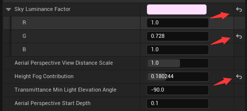

In addition, CDO is closely related to UE's Config mechanism:

```c++
UCLASS(config = CustomSettings, defaultconfig)
class UCustomSettings : public UObject {
	GENERATED_BODY()
public:
	UPROPERTY(EditAnywhere, Config)
	FString ConfigValue;
};
```

Due to the global singleton feature of CDO, it can be used to store some configurations. By adding Config-related identifiers in `UCLASS` and `UPROPERTY`, you can use the following code to store related configurations in the project's directory:

```c++
CDO->SaveConfig();
//Instance->LoadConfig();
//Instance->TryUpdateDefaultConfigFile();
```

If you want the configuration file to be further displayed in the editor's Project Settings, you can register the configuration file at the plugin's startup time using the following code:

```c++
ISettingsModule* SettingsModule = FModuleManager::GetModulePtr<ISettingsModule>("Settings");
if (SettingsModule) {
    auto Settings = GetMutableDefault<UCustomSettings>();
    SettingsModule->RegisterSettings("Project", 
                                     TEXT("CustomSection"),
                                     TEXT("CustomSettingsName"),
                                     LOCTEXT("CustomSettingsName", "CustomSettingsName"),
                                     LOCTEXT("CCustomSettingsTooltip", "Custom Settings Tooltip"),
                                     Settings);
}
```

It should also be noted that CDO will also execute UObject's constructor, so when performing some high-cost operations, you need to consider whether CDO also needs to execute them:

``` c++
UCustomObject::UCustomObject(const FObjectInitializer& ObjectInitializer){
    if (HasAnyFlags(EObjectFlags::RF_ClassDefaultObject)) {		// Check if the current object is CDO
	}
}
```

### Serialization

UObject supports serialization and deserialization, so any UObject can be used as an Asset.

UE's serialization interface is as follows:

``` c++
class UObject{
    /** 
     * Handles reading, writing, and reference collecting using FArchive.
     * This implementation handles all FProperty serialization, but can be overridden for native variables.
     */
    virtual void Serialize(FArchive& Ar);
};
```

UObject will automatically serialize **non-Transient** reflected properties. You can also override the `Serialize` function to add non-reflected data using `FArchive`.

You can convert UObject and ByteArray to each other using **FObjectReader** and **FObjectWriter**.

If you only need to serialize reflected properties, you can use the following code:

``` c++
TArray<uint8> Buffer;
FMemoryWriter PropertiesAr(Buffer, true);
CustomObject->SerializeScriptProperties(PropertiesAr);
```

For more details on serialization, see:

- [Zhihu - UE Serialization Introduction and Source Code Analysis](https://zhuanlan.zhihu.com/p/617464719)

### Blueprint

The most powerful point of Unreal Engine reflection is that developers can not only generate reflection data by scanning code, but also **create and organize reflection data structures by themselves**.

Here is an example of using code to construct a UClass:

```c++
DEFINE_FUNCTION(execIntToString)                // Custom native function
{
    P_GET_PROPERTY(FIntProperty, IntVar);       // Get parameter
    P_FINISH;                                   // End getting parameters
    *((FString*)RESULT_PARAM) = FString::FromInt(IntVar);       // Set return value
}
```

``` c++
UClass* CustomClass = NewObject<UClass>(GetTransientPackage(),"CustomClass");       // Custom class
CustomClass->ClassFlags |= CLASS_EditInlineNew;         // Set class flags
CustomClass->SetSuperStruct(UObject::StaticClass());    // Set parent class

FIntProperty* IntProp = new FIntProperty(CustomClass, TEXT("IntProp"), EObjectFlags::RF_NoFlags);// Create Int property
FStrProperty* StringProp = new FStrProperty(CustomClass, TEXT("StringProp"), EObjectFlags::RF_NoFlags);

UPackage* CoreUObjectPkg = FindObjectChecked<UPackage>(nullptr, TEXT("/Script/CoreUObject"));   // Create Vector struct property
UScriptStruct* VectorStruct = FindObjectChecked<UScriptStruct>(CoreUObjectPkg, TEXT("Vector"));
FStructProperty* VectorProp = new FStructProperty(CustomClass, "VectorProp", RF_NoFlags);
VectorProp->Struct = VectorStruct;

CustomClass->ChildProperties = IntProp;                 // CustomClass->ChildProperties is a linked list node, link properties via linked list
IntProp->Next = StringProp;                 
StringProp->Next = VectorProp;

UFunction* CustomFucntion = NewObject<UFunction>(CustomClass, "IntToString", RF_Public);
CustomFucntion->FunctionFlags = FUNC_Public | FUNC_Native;  // Native function refers to native C++ function; otherwise, it refers to function code in blueprint script

FIntProperty* IntParam = new FIntProperty(CustomFucntion, "IntParam", EObjectFlags::RF_NoFlags);
IntParam->PropertyFlags = CPF_Parm;                         // Used as function parameter

FStrProperty* StringReturnParam = new FStrProperty(CustomFucntion, "StringReturnParam", EObjectFlags::RF_NoFlags);
StringReturnParam->PropertyFlags = CPF_Parm | CPF_ReturnParm;       // Used as function return value (must include CPF_Parm)

CustomFucntion->ChildProperties = IntParam;                         // Function return value must be the last node to calculate subsequent parameter offsets
IntParam->Next = StringReturnParam;

CustomFucntion->SetNativeFunc(execIntToString);                     // Set native function
CustomFucntion->Bind();                                                 
CustomFucntion->StaticLink(true);                                   // Link all properties, this operation will generate property memory size, offset value, etc.
CustomFucntion->Next = CustomClass->Children;                       // Add Function to the head of the Class Children linked list for Field access
CustomClass->Children = CustomFucntion;

CustomClass->AddFunctionToFunctionMap(CustomFucntion, CustomFucntion->GetFName());  // Add custom function to the custom class's function table

CustomClass->Bind();
CustomClass->StaticLink(true);                          // Link all properties
CustomClass->AssembleReferenceTokenStream();            // Associate property GC to complete custom class construction

UObject* CDO = CustomClass->GetDefaultObject();         

// Assign values to properties in CDO
void* IntPropPtr = IntProp->ContainerPtrToValuePtr<void*>(CDO);
IntProp->SetPropertyValue(IntPropPtr, 789);

FVector Vector(1, 2, 3);
void* VectorPropPtr = VectorProp->ContainerPtrToValuePtr<void>(CDO);
VectorProp->CopyValuesInternal(VectorPropPtr, &Vector, 1);

// Call custom function
int InputParam = 12345;
UFunction* Func = CustomClass->FindFunctionByName("IntToString");
uint8* Params = (uint8*)FMemory::Malloc(Func->ReturnValueOffset);		// Allocate parameter buffer
FMemory::Memcpy((void*)Params, (void*)&InputParam, sizeof(int));
FFrame Frame(CDO, Func, Params, 0, Func->ChildProperties);
FString ReturnParam;
Func->Invoke(CDO, Frame, &ReturnParam);
```

After that, we can even use the UClass we created to create a UObject:

```c++
UObject* CustomObject = NewObject<UObject>(GetTransientPackage(), CustomClass);
```

UE's Blueprint is just a wrapper for the above operations and provides a corresponding editor.

The data structure corresponding to UE's Blueprint is **UBlueprint**. Most of our operations in the Blueprint Editor (property and function operations, node editing, class settings...) are basically modifying the parameters of **UBlueprint**:

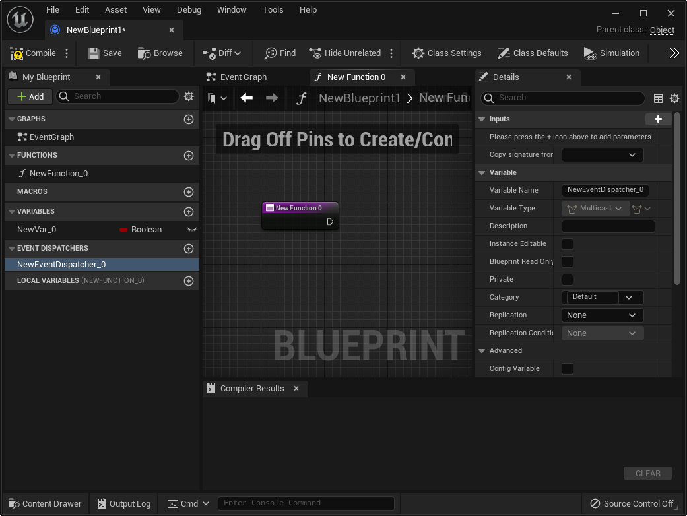

You can create a Blueprint using the following interface:

```c++
static UBlueprint* FKismetEditorUtilities::CreateBlueprint(
    UClass* ParentClass,
    UObject* Outer, 
    const FName NewBPName,
    enum EBlueprintType BlueprintType,
    TSubclassOf<UBlueprint> BlueprintClassType,
    TSubclassOf<UBlueprintGeneratedClass> BlueprintGeneratedClassType, 
    FName CallingContext = NAME_None);
```

The parameter meanings are as follows:

- **ParentClass** : Parent class, the generated Blueprint will inherit the properties and methods of this Class
- **Outer** : Outer (holder) of the generated Blueprint
- **NewBPname** : Name of the generated Blueprint
- **BlueprintType** : Type of the Blueprint, which can be one of the following values:

    ``` c++
    enum EBlueprintType
    {
        /** Normal blueprint. */
        BPTYPE_Normal               UMETA(DisplayName="Blueprint Class"),
        /** Blueprint that is const during execution (no state graph and methods cannot modify member variables). */
        BPTYPE_Const                UMETA(DisplayName="Const Blueprint Class"),
        /** Blueprint that serves as a container for macros to be used in other blueprints. */
        BPTYPE_MacroLibrary         UMETA(DisplayName="Blueprint Macro Library"),
        /** Blueprint that serves as an interface to be implemented by other blueprints. */
        BPTYPE_Interface            UMETA(DisplayName="Blueprint Interface"),
        /** Blueprint that handles level scripting. */
        BPTYPE_LevelScript          UMETA(DisplayName="Level Blueprint"),
        /** Blueprint that serves as a container for functions to be used in other blueprints. */
        BPTYPE_FunctionLibrary      UMETA(DisplayName="Blueprint Function Library"),
    
        BPTYPE_MAX,
    };
    ```

- **BlueprintClassType** : Base template of the Blueprint class, you can use `UBlueprint::StaticClass()` by default, which can be used to customize Blueprint configurations
- **BlueprintGeneratedClassType** : Base template of the Blueprint-generated class, you can use `UBlueprintGeneratedClass::StaticClass()` by default, which can be used to customize generation strategies
- **CallingContext** : Calling context, empty by default

The logic of creating a Blueprint can be simply regarded as:

``` c++
UBlueprint* FKismetEditorUtilities::CreateBlueprint(
    UClass* ParentClass,
    UObject* Outer,
    TSubclassOf<UBlueprint> BlueprintClassType,
    TSubclassOf<UBlueprintGeneratedClass> BlueprintGeneratedClassType)
{
    UBlueprint* NewBP = NewObject<UBlueprint>(Outer,*BlueprintClassType);   // Create instance based on BlueprintClassType
    NewBP->ParentClass = ParentClass;

    UBlueprintGeneratedClass* NewGenClass =                                 // Create instance based on BlueprintGeneratedClassType
        NewObject<BlueprintGeneratedClassType>(NewBP->GetOutermost(),*BlueprintGeneratedClassType);

    NewGenClass->SetSuperStruct(ParentClass)            // Set the parent class of NewGenClass to ParentClass so that its properties and methods can be accessed

    NewBP->GeneratedClass = NewGenClass;            	// Assign the newly generated UClass to NewBP->GeneratedClass 
}
```

When you click the Compile button in the Blueprint Editor:


The following function is actually called:

``` c++
static void FKismetEditorUtilities::CompileBlueprint(UBlueprint* BlueprintObj, 
                             EBlueprintCompileOptions CompileFlags = EBlueprintCompileOptions::None,
                             class FCompilerResultsLog* pResults = nullptr );
```

The goal of this function is to generate the **member variable GeneratedClass** of UBlueprint based on the `property list` and `logic graph` of the Blueprint Editor plus the `ParentClass`.

Usually, the steps to use Blueprint on the C++ side are as follows:

``` c++
UClass * BlueprintGenClass = LoadObject<UClass>(nullptr, "/Game/NewBlueprint.NewBlueprint_C");  	// Get the generated class in the Blueprint
UObject* Instance = NewObject<UObject>(GetTransientPackage(),Blueprint->GeneratedClass);			// Create object instance based on the class

UFunction* Func = Blueprint->GeneratedClass->FindFunctionByName("FuncName");     // Find the function named [FuncName] in the class reflection data
Instance->ProcessEvent(Func, nullptr);							 				 // Call the function defined in the Blueprint

FProperty* Prop = FindFProperty<FProperty>(Blueprint->GeneratedClass, "IntProp");// Find the property named [IntProp] in the class reflection data
int value = 0;
Prop->GetValue_InContainer(Instance,&value);		// Get property
Prop->SetValue_InContainer(Instance,&value);		// Set property
```

Using `/Game/NewBlueprint.NewBlueprint_C` is exactly to get the **member variable GeneratedClass of UBlueprint**, where `/Game/NewBlueprint` is the Package path, and `NewBlueprint_C` is the object name of the **member variable GeneratedClass**.

For the **UClass** generated by **UBlueprint**, you can access the member variable `ClassGeneratedBy` of **UClass** to get the **UBlueprint** that generated it, or use the function:

```c++
static UBlueprint* UBlueprint::GetBlueprintFromClass(const UClass* InClass);
```

After understanding the principle of Blueprint, its use is not difficult. Here is an example of using code to create a Blueprint and open the editor:

``` c++
UClass* ParentClass = NewObject<UClass>();      // Create ParentClass
ParentClass->SetSuperStruct(UObject::StaticClass());
ParentClass->ClassFlags = CLASS_Abstract | CLASS_MatchedSerializers | CLASS_Native | CLASS_ReplicationDataIsSetUp | CLASS_RequiredAPI | CLASS_TokenStreamAssembled | CLASS_HasInstancedReference  | CLASS_Constructed;

// Add event function to Class
UFunction* BPEvent = NewObject<UFunction>(ParentClass, "BlueprintEvent", RF_Public | RF_Transient);
BPEvent->FunctionFlags = FUNC_Public | FUNC_Event | FUNC_BlueprintEvent;
BPEvent->Bind();
BPEvent->StaticLink(true);

BPEvent->Next = ParentClass->Children;              // Add the function to the Parent's Field
ParentClass->Children = BPEvent;
ParentClass->AddFunctionToFunctionMap(BPEvent, "BlueprintEvent");

ParentClass->Bind();
ParentClass->StaticLink(true);
ParentClass->AssembleReferenceTokenStream(true);

UBlueprint* NewBP = FKismetEditorUtilities::CreateBlueprint(                        // Create Blueprint
    ParentClass,
    GetTransientPackage(),
    "NewBP",
    EBlueprintType::BPTYPE_Normal,
    UBlueprint::StaticClass(),
    UBlueprintGeneratedClass::StaticClass());

int32 NodePositionY = 0;

// Create event node in the graph
FKismetEditorUtilities::AddDefaultEventNode(NewBP, NewBP->UbergraphPages[0], "BlueprintEvent", ParentClass, NodePositionY); 

// Create custom event if it doesn't exist
FKismetEditorUtilities::AddDefaultEventNode(NewBP, NewBP->UbergraphPages[0], "CustomEvent", ParentClass, NodePositionY);    

// Open Blueprint Editor
FBlueprintEditorModule& BlueprintEditorModule = FModuleManager::LoadModuleChecked<FBlueprintEditorModule>("Kismet");
BlueprintEditorModule.CreateBlueprintEditor(EToolkitMode::Standalone, nullptr, NewBP);  
```

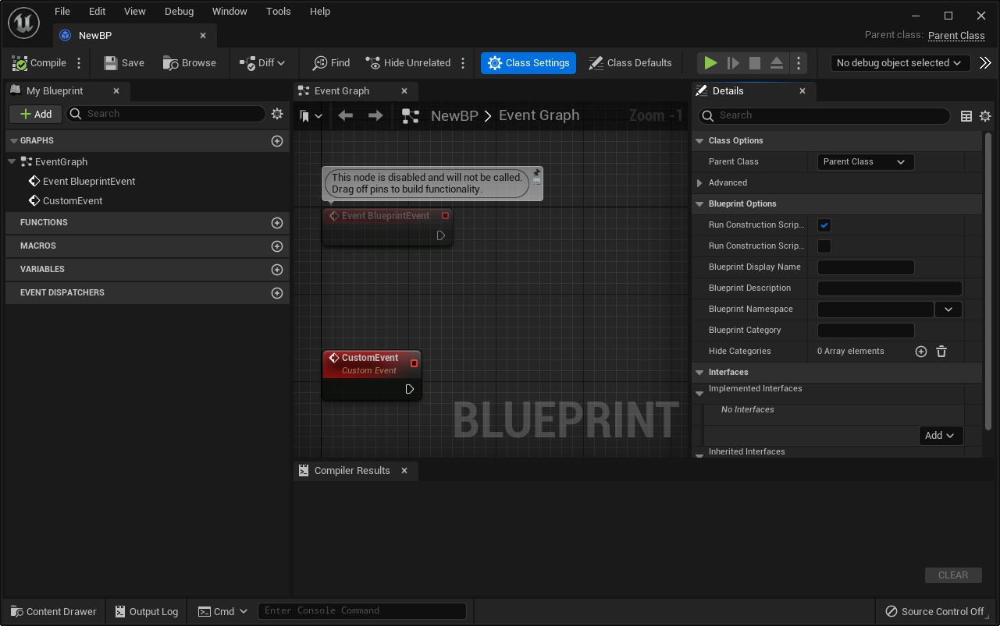

## Asset System

One of the function prototypes of NewObject is as follows:

``` c++
template< class T >
T* NewObject(UObject* Outer = (UObject*)GetTransientPackage());
```

Outer can be simply understood as the parent object. It should be noted that **Outer** is not related to UObject's GC; its role is to specify the relationship in the asset storage structure.

The asset objects in UE are not equivalent to physical files. In fact, a `*.uasset` and `*.umap` file on disk can be understood as corresponding to a **UPackage** object.

When creating an asset in UE, you first create a `UPackage` as the actual physical file mapping, then use `NewObject` to create the actual asset, specifying its `Outer` as the `Package`. When saving the `Package`, all `UObjects` held by the `Package` will be serialized to the physical file. This process looks like:

``` c++
// Create a new Package, /Game/CustomPackage is the package path, where /Game represents the project's Content directory
UPackage* CustomPackage = CreatePackage(nullptr, TEXT("/Game/CustomPackage"));

// Create a new asset, which can be any UObject (UObject is an abstract class here, so there will be a warning)
UObject* CustomInstance = NewObject<UObject>(CustomPackage, UObject::StaticClass(),
                                             TEXT("CustomInstance"), 
                                             EObjectFlags::RF_Public | EObjectFlags::RF_Standalone);	

// Get the local disk path of the Package
FPackagePath PackagePath = FPackagePath::FromPackageNameChecked(CustomPackage->GetName());
const FString PackageFileName = PackagePath.GetLocalFullPath();

// Save the package to disk
const bool bSuccess = UPackage::SavePackage(CustomPackage,
                                            CustomInstance, 
                                            RF_Public | RF_Standalone,
                                            *PackageFileName,
                                            GError, nullptr, false, true, SAVE_NoError);
```

This operation will create a `CustomPackage.uasset` file in the project's Content directory.


We can load the package and asset object from disk using the following code:

``` C++
UPackage* LoadedPackage = LoadPackage(nullptr, TEXT("/Game/CustomPackage"), LOAD_None);
UObject* LoadedAsset = LoadObject<UObject>(nullptr,TEXT("/Game/CustomPackage.CustomInstance"));
```

If you want the asset to be creatable and previewable in the UE Editor, you need to:

- Derive **UFactory** to define the generation factory for the asset object
- Derive **FAssetTypeActions_Base** to define the asset's preview, menu, and other behaviors in the editor

For more details on asset management, please refer to:

- [Zhihu - UE4 Resource Management](https://zhuanlan.zhihu.com/p/357904199)

## Gameplay Framework

There are several very detailed articles here, so we won't go into too much detail:

- [Zhihu - Haigou大人 | UEGamePlay Framework: UObject, Actor, Component](https://zhuanlan.zhihu.com/p/15846253240)
- [Zhihu - Haigou大人 | UEGamePlay Framework: WorldContext, GameInstance, Engine, UGameplayStatics](https://zhuanlan.zhihu.com/p/16084230887)
- [Zhihu - Haigou大人 | UEGamePlay Framework: World, Level, WorldSetting, Level Blueprint](https://zhuanlan.zhihu.com/p/15882499225)
- [Zhihu - Haigou大人 | UEGamePlay Framework: Pawn, Controller, APlayerState](https://zhuanlan.zhihu.com/p/16087843925)
- [Zhihu - Haigou大人 | UEGamePlay Framework: GameMode, GameState](https://zhuanlan.zhihu.com/p/16089018768)

After understanding these structural systems, we can try to write some bold code. For example, here is an example of offline rendering a static model:

``` c++
void Render(UStaticMesh* StaticMesh, FString OutFileName, FTransform CameraTransform, int32 InResolution)
{
	EWorldType::Type WorldType = EWorldType::Editor;
	UWorld* World = UWorld::CreateWorld(WorldType, false, "RenderWorld");		// Manually create UWorld
	
    UWorld* LastWorld = GWorld;
	GWorld = World;         
	
    FWorldContext& EditorContext = GEditor->GetEditorWorldContext();
	EditorContext.SetCurrentWorld(World);   // Sky Light's update depends on GEgnine's Tick, which requires GWorld == EditorContext.World() 

	const FURL URL;
	World->InitializeActorsForPlay(URL);
	World->BeginPlay();															// Manually execute UWorld's begin event

    FakeEngineTick(World, 0.03f);
    
	AStaticMeshActor* Actor = World->SpawnActor<AStaticMeshActor>();
	UStaticMeshComponent* StaticMeshComp = Actor->GetStaticMeshComponent();

	ASkyAtmosphere* SkyAtmosphereActor = World->SpawnActor<ASkyAtmosphere>();
	AExponentialHeightFog* ExponentialHeightFogActor = World->SpawnActor<AExponentialHeightFog>();

	ADirectionalLight* DirectionalLightActor = World->SpawnActor<ADirectionalLight>();
	UDirectionalLightComponent* DirectionalLightComponent = DirectionalLightActor->GetComponent();
	DirectionalLightComponent->SetIntensity(12);

	ASkyLight* SkyLightActor = World->SpawnActor<ASkyLight>();
	USkyLightComponent* SkyLightComponent = SkyLightActor->GetLightComponent();
	SkyLightComponent->SetMobility(EComponentMobility::Movable);
	SkyLightComponent->bLowerHemisphereIsBlack = false;
	SkyLightComponent->SetIntensity(2);
	SkyLightComponent->RecaptureSky();											// Request to refresh sky light
    
	FakeEngineTick(World, 0.03f);												// Execute Tick to wait for rendering update to complete

	UTextureRenderTarget2D* RenderTarget = NewObject<UTextureRenderTarget2D>();	// Initialize RT data
	RenderTarget->RenderTargetFormat = ETextureRenderTargetFormat::RTF_RGBA16f;
	RenderTarget->InitAutoFormat(InResolution, InResolution);
	RenderTarget->UpdateResourceImmediate(true);

    FakeEngineTick(World, 0.03f);												// Wait for RT resource submission
    
    ETextureRenderTargetFormat RenderTargetFormat = RenderTarget->RenderTargetFormat;
	FTextureRenderTargetResource* RenderTargetResource = RenderTarget->GameThread_GetRenderTargetResource();
    
	ASceneCapture2D* SceneCaptureActor = World->SpawnActor<ASceneCapture2D>();
	USceneCaptureComponent2D* SceneCaptureComp = SceneCaptureActor->GetCaptureComponent2D();
	SceneCaptureComp->TextureTarget = RenderTarget;
	SceneCaptureComp->bCaptureEveryFrame = false;
	SceneCaptureComp->bOverride_CustomNearClippingPlane = true;
	SceneCaptureComp->CustomNearClippingPlane = 0.01f;
	SceneCaptureComp->CaptureSource = ESceneCaptureSource::SCS_FinalColorLDR;
	SceneCaptureComp->ShowFlagSettings.Add(FEngineShowFlagsSetting{ TEXT("DistanceFieldAO"), false });
	SceneCaptureComp->SetShowFlagSettings(SceneCaptureComp->ShowFlagSettings);

	FakeEngineTick(World);											// Wait for SceneCapture state update

	SceneCaptureActor->SetActorTransform(CameraTransform); 			// Execute capture
	SceneCaptureComp->CaptureScene();
   
    TArray<FLinearColor> Colors;
	FReadSurfaceDataFlags ReadPixelFlags(RCM_MinMax);
	FIntRect IntRegion(0, 0, RenderTarget->SizeX, RenderTarget->SizeY);
	RenderTargetResource->ReadLinearColorPixels(Colors, ReadPixelFlags, IntRegion);
    
	FImageView ImageView(Colors.GetData(), RenderTarget->SizeX, RenderTarget->SizeY);
	FImageUtils::SaveImageByExtension(*OutFileName, ImageView);	 	// Save image

	World->DestroyWorld(false);										// Restore state
	GEngine->DestroyWorldContext(World);
	GWorld = LastWorld;
}

// Manually execute engine Tick update
static void FakeEngineTick(UWorld* InWorld, float InDelta = 0.03f)    
	FApp::SetDeltaTime(InDelta);

    GEngine->EmitDynamicResolutionEvent(EDynamicResolutionStateEvent::EndFrame);
    GEngine->Tick(InDelta, false);									// Contains the update of the current World

    FSlateApplication::Get().PumpMessages();
    FSlateApplication::Get().Tick();

    GFrameCounter++;

    bool bIsTicking = FSlateApplication::Get().IsTicking();
    if (!bIsTicking && GIsRHIInitialized) {
        if (FSceneInterface* Scene = InWorld->Scene) {
            ENQUEUE_RENDER_COMMAND(BeginFrame)([](FRHICommandListImmediate& RHICmdList) {
                GFrameNumberRenderThread++;
                GFrameCounterRenderThread++;
                FCoreDelegates::OnBeginFrameRT.Broadcast();
            });

            ENQUEUE_RENDER_COMMAND(EndFrame)([](FRHICommandListImmediate& RHICmdList) {
                FCoreDelegates::OnEndFrameRT.Broadcast();
                RHICmdList.EndFrame();
            });
            FlushRenderingCommands();
        }
        ENQUEUE_RENDER_COMMAND(VirtualTextureScalability_Release)([](FRHICommandList& RHICmdList) {
            GetRendererModule().ReleaseVirtualTexturePendingResources();
        });
    }

    FTaskGraphInterface::Get().ProcessThreadUntilIdle(ENamedThreads::GameThread);

    FSlateApplication::Get().GetRenderer()->Sync();

    FThreadManager::Get().Tick();

    FTSTicker::GetCoreTicker().Tick(InDelta);

    GEngine->TickDeferredCommands();

    GEngine->EmitDynamicResolutionEvent(EDynamicResolutionStateEvent::EndFrame);

    FAssetCompilingManager::Get().FinishAllCompilation();
}
```

## Others

### Delegate

UE uses the concept of **Delegate** for communication between objects, which can call C++ functions in a general and type-safe way.

> If you are familiar with Qt, Delegate actually corresponds to Signal in Qt's Signal-Slot mechanism. However, Delegate is more powerful than Signal and also more complex to use.
>
> Its biggest flaw is the naming. If it were also called Signal, it would be easier to evoke developers' associations and lead to correct usage.

Here is a scenario using Delegate (pseudocode named with Signal):

```C++
class Student{
    Signal nameChanged(string OldName, string NewName);
public:
	void setName(string inName){
       	string oldName = mName;
    	mName = inName;
        nameChanged.Emit(oldName,mName);
    }
private:
    string mName;
};

class Tearcher{
public:
    void OnStudentNameChanged(string OldName, string NewName){
        // do something
    }
};

class Class{
protected:    
    void connectEveryone(){
      	 for(auto Student:mStudents){		
             Student.nameChanged.Connect(mTeacher,&Tearcher::OnStudentNameChanged);
         }
    }
private:
   	Teacher mTeacher;
    TArray<Student> mStudents;
};
```

The function `connectEveryone` in this example accomplishes the following: "The teacher tells the students in the class that if you change your name, please notify me."

Instead of directly modifying the structures of Teacher and Student, the relationship between them is bound in a third party (the Class), thereby achieving code decoupling.

Without using Delegate, to achieve the same functionality, you might write ugly code like this:

``` c++
class Student{
public:
    Student(Class* InClass)		// Need to pass the pointer of the upper-level logic domain
        : mClass(InClass){}
    
	void setName(string inName){
        string oldName = mName;
    	mName = inName;
        
        // Unsafe chain call, and calls with large context spans will make subsequent maintenance and iteration difficult
        mClass->mTeacher->OnStudentNameChanged(OldName,mName);	
    }
private:
    string mName;
    Class* mClass
};

class Tearcher{
public:
    void OnStudentNameChanged(string OldName, string NewName){
        // do something
    }
};

class Class{
    friend class Student;
private:
   	Teacher mTeacher;
    TArray<Student> mStudents;
};
```

For the use of UE Delegate, see:

- [Delegate in UE4 and Its Implementation Principle - Tencent Program Brother](https://zhuanlan.zhihu.com/p/575671003)