# An Incomplete Guide to LOD

The invention of electronic computers originated during World War II, when artillery and ballistic calculations became increasingly complex, and existing computing tools could no longer meet the demands. To solve these problems, scientists and engineers began developing electronic computers.

With the advent of electronic computers, video games also emerged.

In the development of video games, there are always some creative ideas and technologies that continuously break through the limitations of hardware developers' thinking, maximize the performance of hardware, and drive computers to develop in an amazing direction:

- [Zhihu | The Past, Present and Future of Video Games - Maipian](https://zhuanlan.zhihu.com/p/206828303)

And **LOD (Level of Detail)**, is a technology that emerged during this development process and has been used to this day. Its purpose is:

- Adopt different precision strategies in scenarios of different **Significance** to minimize resource waste and increase the upper limit of the entire system.

This ideological strategy is reflected in all aspects of game production.

## Models

In terms of models, the application of LOD mainly involves creating multiple low-poly versions of the model with different precision levels. High-precision models are used at close distances, while low-precision models are used at long distances.

In large-scale 3D scenes used in real-time rendering, creating model LODs is usually an unavoidable challenge for development teams to ensure the program's frame rate.

High time and labor costs make it very difficult for many independent developers and small teams to build complex scenes.

This changed dramatically with the emergence of UE's virtual geometry technology—**Nanite**, which significantly lowered the threshold for scene production.

Nanite analyzes the importance information of model geometry and automatically generates high-quality LODs. It not only occupies less storage space but also can be rendered with very high performance. It is undoubtedly the future of geometric rendering.

However, currently, in some specific scenarios, we still cannot completely abandon LOD:

- The GPU computing power of modern PCs is usually redundant. Most mid-range GPUs are sufficient to handle rendering of some common complex scenes. However, for other platforms such as mobile devices, Xbox, Switch..., their computing power is currently only barely sufficient for projects with high graphical requirements. To pursue better visual effects, it is often necessary to customize some relatively hacky rendering mechanisms for extreme optimization, and the remaining computing power allocated is difficult to support the operation of Nanite.
- Nanite's model simplification algorithm still has much room for optimization in some special model types, such as vegetation. If it is a complex scene with high vegetation density and a wide range, using LOD can compress performance to a greater extent, which was mentioned in a previous [article](https://zhuanlan.zhihu.com/p/713731229).

In most previous game projects, LODs were usually created by artists in DDC software. While providing the model source files, artists produced the corresponding LODs for the models according to certain specifications.

This approach has certain limitations currently:

- The early model production process was relatively "pragmatic". Most of the time, models could only be created manually. However, many mesh processing SDKs have emerged now, which often provide some effective model simplification algorithms. High-quality LODs can be generated without re-modeling.
- Manually creating LODs often requires high costs. It's okay if the team has sufficient manpower and resources. If it is outsourced to a third-party team, it will undoubtedly be a huge expense.
- Any methodology has certain applicable conditions, and model production is no exception. Except for some established production companies, most teams should find it difficult to develop a perfect production specification at the beginning of game production. Often, many hidden problems gradually emerge as the development progress advances. Moreover, art production is the largest expense in the entire project. For LOD production, if the source model or specifications change, the previously produced "products" will be wasted. Therefore, we need to shift our focus from creating specific LODs to building an iterable LOD production pipeline.
- Although the source models are created by artists, they are often not sensitive to performance and have a limited understanding of LOD. When facing models that are difficult to meet the specifications no matter how they are created, they will only feel helpless.

At this point, if someone has an in-depth understanding of geometric processing, graphics rendering, and the editor direction, and takes charge of these tasks in a procedural way, it can save the team a lot of production costs. Such professionals are generally defined as **Pipeline TA** / **Engine Pipeline Engineer**.

### References

Before elaborating on LOD production, let's first understand the model production specifications in some modern games:

- [Triangle Counts in Next-Gen Games | Polycount](https://polycount.com/discussion/141061/polycounts-in-next-gen-games-thread)
- [Triangle Counts for Assets from Various Videogames | Polycount](https://polycount.com/discussion/126662/triangle-counts-for-assets-from-various-videogames)

These materials can be used as effective references to avoid source models that exceed real-time rendering specifications. Here is a standard provided by [3D-ACE](https://3d-ace.com/):

- **PC and Consoles**

  | **Game Asset**       | **Polygon Count (UE)** | **Triangle Count (UE)** | **Polygon Count (Unity)** | **Triangle Count (Unity)** |
  | -------------------- | --------------------- | ------------------- | ------------------------ | ------------------------ |
  | **Low-Detail Character** | 10,000-20,000         | 20,000-40,000       | 5,000-10,000             | 10,000-20,000            |
  | **High-Detail Character** | 20,000-60,000         | 40,000-120,000      | 10,000-30,000            | 20,000-60,000            |
  | **Simple Prop**      | 500-2,000             | 1,000-4,000         | 250-1,000                | 500-2,000                |
  | **Complex Prop**     | 2,000-10,000          | 4,000-20,000        | 1,000-5,000              | 2,000-10,000             |
  | **Basic Environment** | 10,000-50,000         | 20,000-100,000      | 5,000-25,000             | 10,000-50,000            |
  | **Detailed Environment** | 50,000-200,000        | 100,000-400,000     | 25,000-100,000           | 50,000-200,000           |

- **Mobile and Low-End Devices**

  | **Game Asset**       | **Polygon Count** | **Triangle Count** |
  | -------------------- | -------------- | -------------- |
  | **Low-Detail Character** | 1,000-5,000    | 2,000-10,000   |
  | **High-Detail Character** | 5,000-10,000   | 10,000-20,000  |
  | **Simple Prop**      | 100-500        | 200-1,000      |
  | **Complex Prop**     | 500-2,000      | 1,000-4,000    |
  | **Basic Environment** | 2,000-10,000   | 4,000-20,000   |
  | **Detailed Environment** | 10,000-20,000  | 20,000-40,000  |

- **VR/AR Devices**

  | **Game Asset**       | **Polygon Count** | **Triangle Count** |
  | -------------------- | -------------- | -------------- |
  | **Low-Detail Character** | 2,000-10,000   | 4,000-20,000   |
  | **High-Detail Character** | 10,000-20,000  | 20,000-40,000  |
  | **Simple Prop**      | 500-1,500      | 1,000-3,000    |
  | **Complex Prop**     | 1,500-5,000    | 3,000-10,000   |
  | **Basic Environment** | 5,000-15,000   | 10,000-30,000  |
  | **Detailed Environment** | 15,000-30,000  | 30,000-60,000  |

The original blog is located at:

- [Does Polygon Count Matter in 3D Modeling for Game Assets? – 3D-Ace Studio](https://3d-ace.com/blog/polygon-count-in-3d-modeling-for-game-assets/)

3D-ACE has many valuable [blog](https://3d-ace.com/blog/) references. Interested friends can check them out:


### Production Process

Before creating LODs, it is best to build a simple preview level and use a simple editor tool to automatically arrange assets to achieve the following goals:

- Determine all assets to be previewed based on the asset list or asset path.
- Arrange assets horizontally using the model's bounding sphere radius as the interval.
- Convert the LOD's screen size to distance and arrange all LODs vertically.
- Display some key information on the generated models, such as screen size, distance, vertex count, face count...

In this view, we can more intuitively view and manage the model specifications:

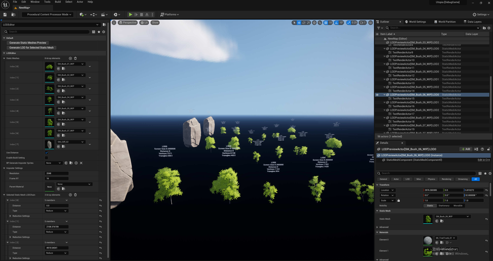

In the early LOD production process, we generally used the **distance** between the model and the camera as the criterion for LOD switching. A simplified model with a certain precision level is switched every certain distance. In this way, we might create an **LOD chain** like this:

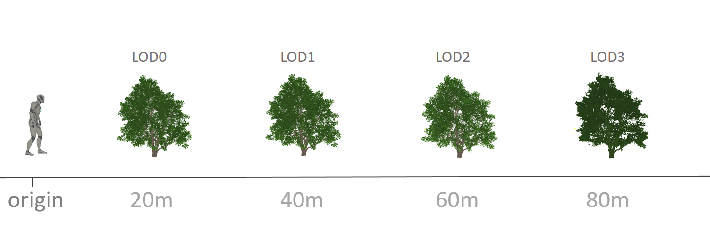

However, it was soon discovered that using distance does not provide an intuitive way to establish the distance intervals between LODs. Because some models are large and some are small, different distance intervals must be evaluated for each model to ensure appropriate precision distribution. To solve this problem, we introduced another parameter—**Screen Size**: it comprehensively evaluates the **camera distance**, **camera's perspective matrix**, and the model's **bounding sphere radius** to obtain a value, which can be roughly regarded as the model's screen occupancy ratio. Here is its calculation formula:

``` c++
float ConvertDistanceToScreenSize(float ObjectSphereRadius, float Distance)
{
	const float FOV = 90.0f;								// Camera parameters can be confirmed uniformly
	const float FOVRad = FOV * (float)UE_PI / 360.0f;
	const FMatrix ProjectionMatrix = FPerspectiveMatrix(FOVRad, 1920, 1080, 0.01f);		
	const float ScreenMultiple = FMath::Max(0.5f * ProjectionMatrix.M[0][0], 0.5f * ProjectionMatrix.M[1][1]);
	return 2.0f * ScreenMultiple * ObjectSphereRadius / FMath::Max(1.0f, Distance);
}
```

We determine the intervals between LODs by reducing the screen size by a certain percentage each time, which is easier than using distance directly:

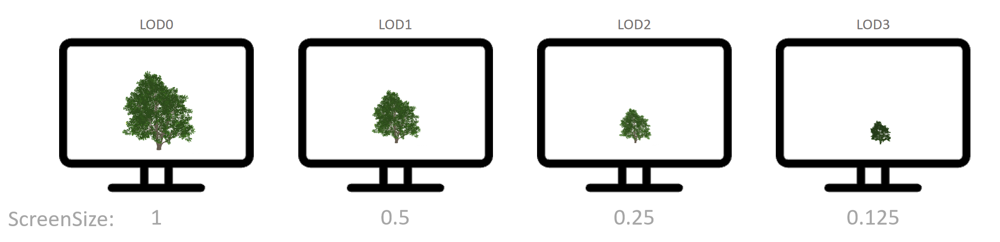

However, although using screen size does provide an intuitive way to set the intervals between LODs, if the distance intervals of the LOD chains generated for models of different sizes are not uniform, the visual artifacts will become more obvious.

If we generate LODs by decreasing the screen size by a fixed percentage, we can see that the distances of the LOD chains for different models are inconsistent (here, the LOD simplification amplitude is deliberately set very large to make the artifacts visible):

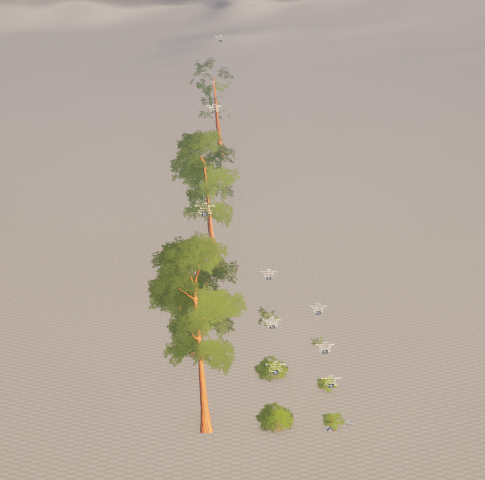


Compare this with generating LODs using a fixed distance gradient:

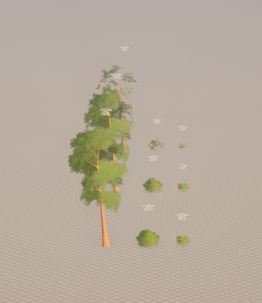


It can be seen that the画面 changes are smoother when using fixed distance gradient LODs:

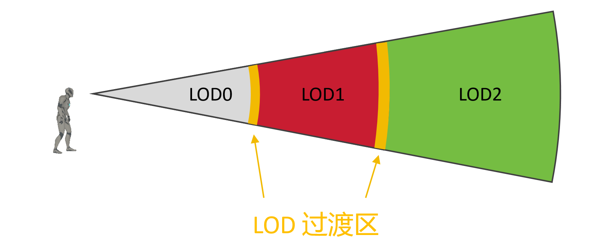

Although using screen size does allow intuitive setting of LOD intervals, since the engine uses **distance** to limit certain visual effects (such as shadows, distance field lighting...), if we want visual effects to transition more smoothly, it is recommended to use the following strategy to generate LODs:

- Use fixed LOD distance gradients
- Determine the number of LODs based on the bounding sphere radius
- Determine the simplification amplitude based on screen size, vertex density, and model features

The above key parameters will change with project iteration, increasing complexity, and platform performance requirements. Therefore, we should not generate LODs manually but build an iterable LOD production pipeline, which can be continuously iterated and optimized.

Common strategies for generating simplified models include three types:

- **Reduce**: Delete vertex data from the original model according to importance and a certain **simplification amplitude** to generate simplified models.
- **Remesh**: Use voxelization model algorithms to approximate the source model with a certain **voxel precision** to obtain simplified models.
- **Impostor**: A clever way to maintain the model's visual effect, which usually breaks the original geometric structure of the model.

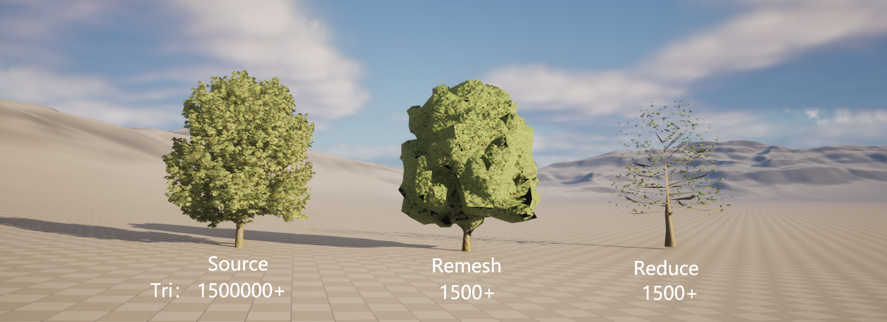

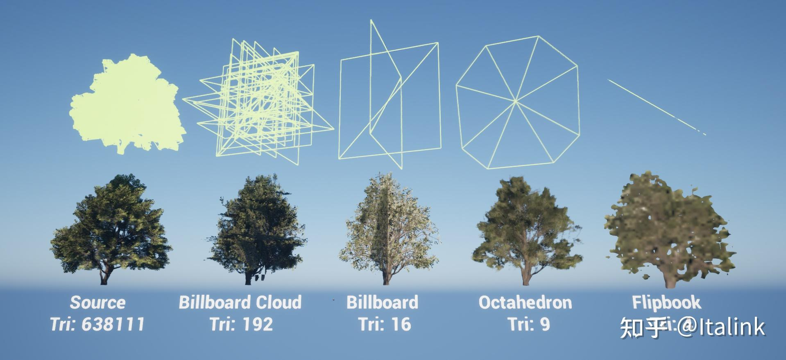

Currently, most teams build this pipeline between DDC and the engine. However, Unreal Engine currently provides very excellent model processing interfaces. If we build the pipeline directly on the engine side, we can better combine the actual game scene environment to generate better results.

For example, the **Octahedron Impostor** mentioned in the previous vegetation chapter:

- https://shaderbits.com/blog/octahedral-impostors

Although UE engine natively provides some model simplification algorithms, there are some geometric processing SDKs that can reduce the rendering overhead of models to a greater extent while ensuring visual effects:

- [Simplygon - Setting the Standard for 3D Game Content Optimization](https://link.zhihu.com/?target=https%3A//www.simplygon.com/)
- [InstaLOD - Everything You Need to Produce and Automatically Optimize 3D Content](https://link.zhihu.com/?target=https%3A//instalod.com/zh/)

Using the interfaces provided by these SDKs, an LOD chain generation pipeline can be easily built.

Here are some reference documents for LOD production:

- [Does Polygon Count Matter in 3D Modeling for Game Assets? – 3D-Ace Studio](https://3d-ace.com/blog/polygon-count-in-3d-modeling-for-game-assets/)
- [What to Consider When It Comes to LOD Transitions? - Simplygon Blog](https://www.simplygon.com/posts/51aba9d5-bafd-459d-94b8-718273fdf092)

### Underlying Mechanism

#### Creating Custom Meshes

``` c++
UPackage* NewPackage = CreatePackage(TEXT("/Game/NewStaticMesh"));												// Create a new package
UStaticMesh* NewStaticMesh = NewObject<UStaticMesh>(NewPackage, "NewStaticMesh",  RF_Public | RF_Standalone);	// Create a new mesh, specify Outer as the new package so that when saving the new package, this object will be serialized and stored

{	// LOD0
    FStaticMeshSourceModel& NewSourceModel = NewStaticMesh->AddSourceModel();									// Create a new source model	
    FMeshDescription& NewMeshDescription = *NewStaticMesh->CreateMeshDescription(0);							// Create a mesh description for this source model
    FStaticMeshAttributes AttributeGetter = FStaticMeshAttributes(NewMeshDescription);							// Create an attribute getter for the mesh description
    AttributeGetter.Register();

    TPolygonGroupAttributesRef<FName> PolygonGroupNames = AttributeGetter.GetPolygonGroupMaterialSlotNames();	// List of polygon group names, corresponding to the respective MeshSections
    TVertexAttributesRef<FVector3f> VertexPositions = AttributeGetter.GetVertexPositions();						// Vertex array
    TVertexInstanceAttributesRef<FVector3f> Normals = AttributeGetter.GetVertexInstanceNormals();				// Normal array
    TVertexInstanceAttributesRef<FVector3f> Tangents = AttributeGetter.GetVertexInstanceTangents();				// Tangent array
    TVertexInstanceAttributesRef<float> BinormalSigns = AttributeGetter.GetVertexInstanceBinormalSigns();		
    TVertexInstanceAttributesRef<FVector4f> Colors = AttributeGetter.GetVertexInstanceColors();					// Vertex color array
    TVertexInstanceAttributesRef<FVector2f> UVs = AttributeGetter.GetVertexInstanceUVs();						// Texture coordinate array

    int32 VertexCount = 4;
    int32 VertexInstanceCount = 6;
    int32 PolygonCount = 2;
    NewMeshDescription.ReserveNewVertices(VertexCount);															// Preallocate memory
    NewMeshDescription.ReserveNewVertexInstances(VertexInstanceCount);
    NewMeshDescription.ReserveNewPolygons(PolygonCount);
    NewMeshDescription.ReserveNewEdges(PolygonCount * 2);
    UVs.SetNumChannels(PolygonCount);
    {
        const FVertexID VertexID0 = NewMeshDescription.CreateVertex();
        const FVertexID VertexID1 = NewMeshDescription.CreateVertex();
        const FVertexID VertexID2 = NewMeshDescription.CreateVertex();
        const FVertexID VertexID3 = NewMeshDescription.CreateVertex();

        VertexPositions[VertexID0] = FVector3f(0.0f, 0.0f, 0.0f);
        VertexPositions[VertexID1] = FVector3f(100.0f, 0.0f, 0.0f);
        VertexPositions[VertexID2] = FVector3f(100.0f, 0.0f, 100.0f);
        VertexPositions[VertexID3] = FVector3f(0.0f, 0.0f, 100.0f);

        const FVertexInstanceID VertexInstanceID0 = NewMeshDescription.CreateVertexInstance(VertexID0);
        const FVertexInstanceID VertexInstanceID1 = NewMeshDescription.CreateVertexInstance(VertexID1);
        const FVertexInstanceID VertexInstanceID2 = NewMeshDescription.CreateVertexInstance(VertexID2);

        const FVertexInstanceID VertexInstanceID3 = NewMeshDescription.CreateVertexInstance(VertexID0);
        const FVertexInstanceID VertexInstanceID4 = NewMeshDescription.CreateVertexInstance(VertexID2);
        const FVertexInstanceID VertexInstanceID5 = NewMeshDescription.CreateVertexInstance(VertexID3);

        UVs[VertexInstanceID0] = FVector2f(0.0f, 0.0f);
        UVs[VertexInstanceID1] = FVector2f(1.0f, 0.0f);
        UVs[VertexInstanceID2] = FVector2f(1.0f, 1.0f);
        UVs[VertexInstanceID3] = FVector2f(0.0f, 0.0f);
        UVs[VertexInstanceID4] = FVector2f(1.0f, 1.0f);
        UVs[VertexInstanceID5] = FVector2f(0.0f, 1.0f);

        Normals[VertexInstanceID0] 
            = Normals[VertexInstanceID1] 
            = Normals[VertexInstanceID2] 
            = Normals[VertexInstanceID3] 
            = Normals[VertexInstanceID4] 
            = Normals[VertexInstanceID5] 
            = FVector3f(0.0f, 1.0f, 0.0f);

        UMaterialInterface* Material = UMaterial::GetDefaultMaterial(MD_Surface);

        {	// Mesh Section 0
            FPolygonGroupID PolygonGroup0 = NewMeshDescription.CreatePolygonGroup();
            PolygonGroupNames[PolygonGroup0] = "LOD0_Section0";
            NewMeshDescription.CreatePolygon(PolygonGroup0,
                {
                    VertexInstanceID0,
                    VertexInstanceID1,
                    VertexInstanceID2,
                });
            NewStaticMesh->GetStaticMaterials().Add(FStaticMaterial(Material));
        }

        {	// Mesh Section 1
            FPolygonGroupID PolygonGroup1 = NewMeshDescription.CreatePolygonGroup();
            PolygonGroupNames[PolygonGroup1] = "LOD0_Section1";
            NewMeshDescription.CreatePolygon(PolygonGroup1,
                {
                    VertexInstanceID3,
                    VertexInstanceID4,
                    VertexInstanceID5
                });
            NewStaticMesh->GetStaticMaterials().Add(FStaticMaterial(Material));
        }
    }
    NewSourceModel.ScreenSize = 1;														// Set screen size
    NewStaticMesh->CommitMeshDescription(0);											// Commit mesh description
}

{
    FStaticMeshSourceModel& NewSourceModel = NewStaticMesh->AddSourceModel();
    FMeshDescription& NewMeshDescription = *NewStaticMesh->CreateMeshDescription(1);
    FStaticMeshAttributes AttributeGetter = FStaticMeshAttributes(NewMeshDescription);
    AttributeGetter.Register();

    TPolygonGroupAttributesRef<FName> PolygonGroupNames = AttributeGetter.GetPolygonGroupMaterialSlotNames();
    TVertexAttributesRef<FVector3f> VertexPositions = AttributeGetter.GetVertexPositions();
    TVertexInstanceAttributesRef<FVector3f> Tangents = AttributeGetter.GetVertexInstanceTangents();
    TVertexInstanceAttributesRef<float> BinormalSigns = AttributeGetter.GetVertexInstanceBinormalSigns();
    TVertexInstanceAttributesRef<FVector3f> Normals = AttributeGetter.GetVertexInstanceNormals();
    TVertexInstanceAttributesRef<FVector4f> Colors = AttributeGetter.GetVertexInstanceColors();
    TVertexInstanceAttributesRef<FVector2f> UVs = AttributeGetter.GetVertexInstanceUVs();

    int32 VertexCount = 3;
    int32 VertexInstanceCount = 3;
    int32 PolygonCount = 1;
    NewMeshDescription.ReserveNewVertices(VertexCount);
    NewMeshDescription.ReserveNewVertexInstances(VertexInstanceCount);
    NewMeshDescription.ReserveNewPolygons(PolygonCount);
    NewMeshDescription.ReserveNewEdges(PolygonCount * 2);
    UVs.SetNumChannels(1);
    {
        const FVertexID VertexID0 = NewMeshDescription.CreateVertex();
        const FVertexID VertexID1 = NewMeshDescription.CreateVertex();
        const FVertexID VertexID2 = NewMeshDescription.CreateVertex();

        VertexPositions[VertexID0] = FVector3f(0.0f, 0.0f, 0.0f);
        VertexPositions[VertexID1] = FVector3f(100.0f, 0.0f, 0.0f);
        VertexPositions[VertexID2] = FVector3f(50.0f, 0.0f, 100.0f);

        const FVertexInstanceID VertexInstanceID0 = NewMeshDescription.CreateVertexInstance(VertexID0);
        const FVertexInstanceID VertexInstanceID1 = NewMeshDescription.CreateVertexInstance(VertexID1);
        const FVertexInstanceID VertexInstanceID2 = NewMeshDescription.CreateVertexInstance(VertexID2);

        UVs[VertexInstanceID0] = FVector2f(0.0f, 0.0f);
        UVs[VertexInstanceID1] = FVector2f(1.0f, 0.0f);
        UVs[VertexInstanceID2] = FVector2f(0.5f, 1.0f);

        Normals[VertexInstanceID0]
            = Normals[VertexInstanceID1]
            = Normals[VertexInstanceID2]
            = FVector3f(0.0f, 1.0f, 0.0f);

        UMaterialInterface* Material = UMaterial::GetDefaultMaterial(MD_Surface);

        {
            FPolygonGroupID PolygonGroup0 = NewMeshDescription.CreatePolygonGroup();
            PolygonGroupNames[PolygonGroup0] = "LOD1_Section0";
            NewMeshDescription.CreatePolygon(PolygonGroup0,
                {
                    VertexInstanceID0,
                    VertexInstanceID1,
                    VertexInstanceID2,
                });
            NewStaticMesh->GetStaticMaterials().Add(FStaticMaterial(Material));
        }
    }
    NewSourceModel.ScreenSize = 0.5f;
    NewStaticMesh->CommitMeshDescription(1);
}

NewStaticMesh->ImportVersion = EImportStaticMeshVersion::LastVersion;			// Declare that this build uses the latest version of data to prevent automatically generated LODs from replacing our filled model data
NewStaticMesh->Build();															// Build the mesh
NewStaticMesh->PostEditChange();
NewStaticMesh->WaitForPendingInitOrStreaming(true, true);

FStaticMeshCompilingManager::Get().FinishAllCompilation();
FAssetRegistryModule::AssetCreated(NewStaticMesh);								

FPackagePath PackagePath = FPackagePath::FromPackageNameChecked(NewPackage->GetName());
FString PackageLocalPath = PackagePath.GetLocalFullPath();
UPackage::SavePackage(NewPackage, NewStaticMesh, RF_Public | RF_Standalone, *PackageLocalPath, GError, nullptr, false, true, SAVE_NoError);			// Save the new package
```

#### Render Resource Submission Timing

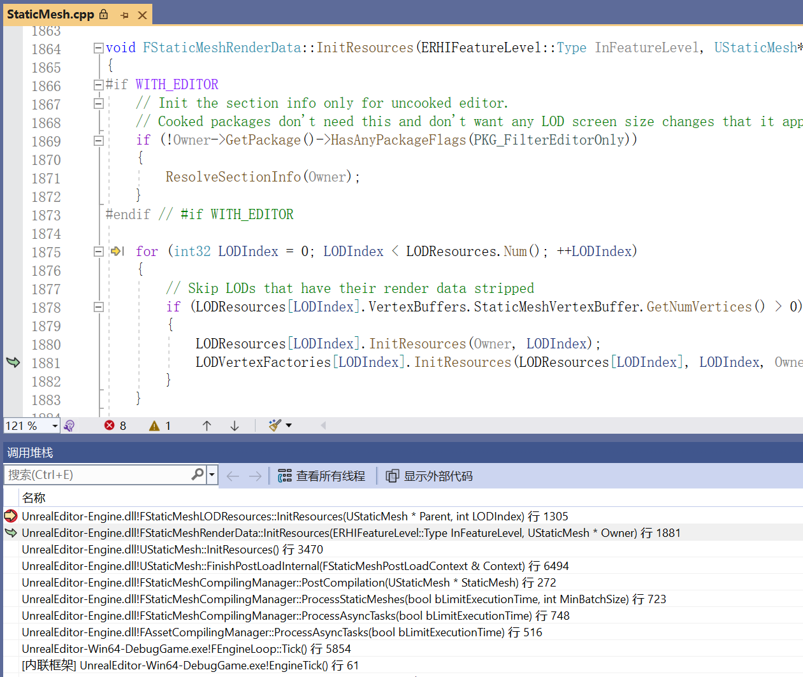

#### Render Execution Strategy

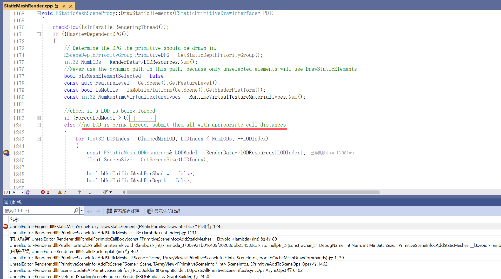

#### Common Console Variables

- `r.ForceLOD`: Force lock the LOD level of all models
- `r.ForceLODShadow`: Force lock the LOD level used for submitting to the shadow pass
- `r.StaticMesh.MinLodQualityLevel`: Set the minimum LOD level of the model
- `r.StaticMeshLODDistanceScale`: Scaling factor for LOD distance

## Material Textures

For materials, in some early projects, LODs were also generated for the corresponding materials when generating model LODs. Although simplifying material logic can theoretically reduce performance overhead, material LODs will undoubtedly increase the size of the material set, and the performance improvement is not particularly obvious. The more complex management method also makes this approach difficult to promote in actual projects.

Currently, more attention is focused on textures, and the application of LOD mainly involves generating **Mipmaps** for textures.

Most people's understanding of **Mipmaps (Multilevel Mipmaps)** is that they solve the moiré pattern phenomenon:

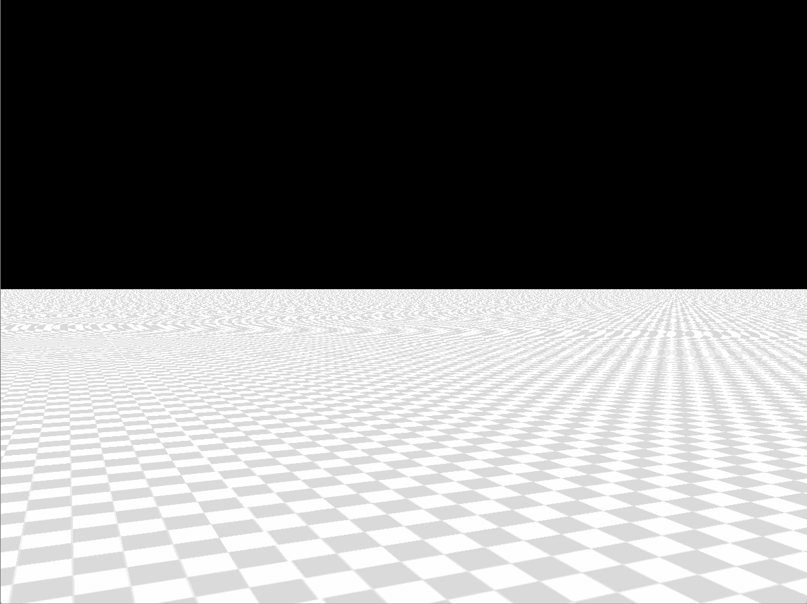

- [Zhihu | Computer Graphics VII: Texture Mapping and Mipmap Technology - Sun Xiaolei](https://zhuanlan.zhihu.com/p/144332091)

In addition to solving moiré patterns, Mipmaps currently have other uses in UE:

- **Texture Streaming**: To alleviate the pressure of video memory usage, UE will allocate a texture streaming pool of a certain size by default (configured using `r.Streaming.PoolSize`). It streams in a certain **MipLevel** of the texture according to the texture's importance (camera distance and texture group priority) to minimize overall video memory usage. Here are some very valuable articles about texture streaming:
    - [Zhihu | UE4 Texture Streaming - mike](https://zhuanlan.zhihu.com/p/556620567)
    - [Zhihu | Summary of Unreal Engine (UE4) Extreme Compression Processing for Mobile Texture Resources (ASTC) - Sparrowfc](https://zhuanlan.zhihu.com/p/566998709)
- **UI Adaptation**: Since games may run in environments with different resolutions, when UI textures are scaled down, the excessive span of **Downsampling** texels will cause jagged edges in the textures. For UI with dynamically adjusted positions, obvious flickering will also occur. At this time, Mipmaps can be generated for UI textures because the engine will determine which **MipLevel** of the UI texture to use based on `DDX(UV)` and `DDY(UV)`.

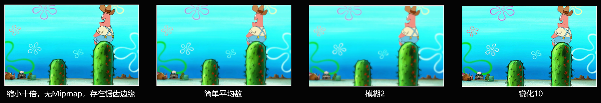

We can specifically customize the Mipmaps of a certain texture here:

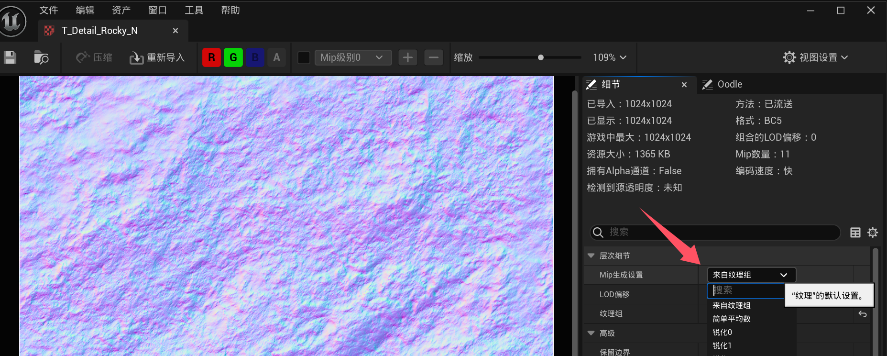

However, the best way is to classify textures into different **TextureLODGroups** and adopt unified configurations for each texture group. This will be much more convenient when performing performance tuning across multiple platforms.

In UE 5, you can uniformly set the configuration of texture groups for different platforms here:

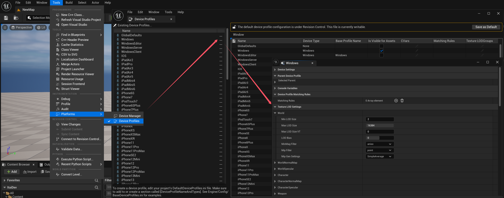

## Terrain

The terrain operation mechanism of UE5 is very complete. Terrain LOD is achieved by adjusting the precision of tessellation. Currently, 8 levels of LOD are used by default. To modify the LOD, you only need to adjust these parameters:

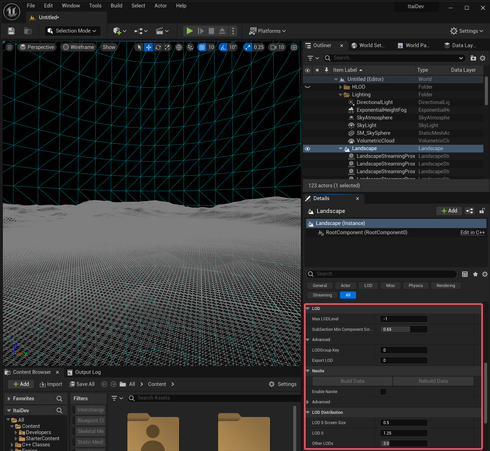

UE5.1 and later versions support Nanite terrain. Since the terrain uses very standardized model data, enabling Nanite will undoubtedly result in more reasonable geometric organization. Compared with LOD, it usually has fewer triangles and more realistic visual effects:

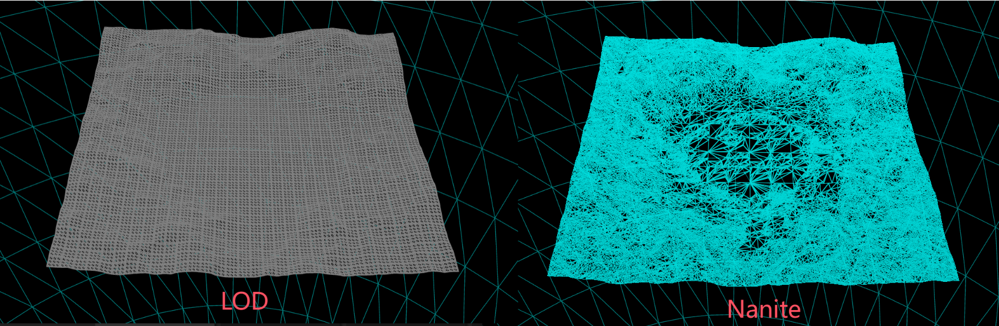

Although Nanite's scheduling algorithm is more complex than tessellation and requires an additional copy of mesh data, when the camera is stationary, Nanite's rendering consumption is significantly lower than LOD. Moreover, Nanite is friendly to virtual shadows. If there are no platform restrictions, Nanite terrain will be a better choice.

Currently, some projects use static meshes as terrain. With the streaming and HLOD of world partition, a better balance of performance can be achieved without the limitations of terrain editing. However, the main advantage of terrain is that it can tile a large area using several high-resolution Tile textures (the resolution of the texture is much smaller than the terrain resolution). The disk space it occupies is much smaller than that of using models to tile a terrain with the same visual precision.

## HLOD

The several types of LOD mentioned above mainly target individual assets, while HLOD involves creating LODs after batching assets.

Currently, there are two ways to use HLOD in UE:

- For ordinary maps, you can use tools to merge meshes and generate HLOD according to this document:
    - [Epic Games | Building HLOD](https://dev.epicgames.com/documentation/en-us/unreal-engine/building-hierarchical-level-of-detail-meshes-in-unreal-engine)
- For open-world maps, it is necessary to classify scene objects and set **HLODLayer** to automatically generate HLOD for the **Grid Cell** of the world partition:
    - [Epic Games | Building HLOD for World Partition](https://dev.epicgames.com/documentation/en-us/unreal-engine/world-partition---hierarchical-level-of-detail-in-unreal-engine)

Let's elaborate on the latter method.

Because **World Partition** divides the scene meshes into many cells and only loads a key part of the area (such as around the player) through **Streaming**, which can effectively reduce the pressure on program execution:

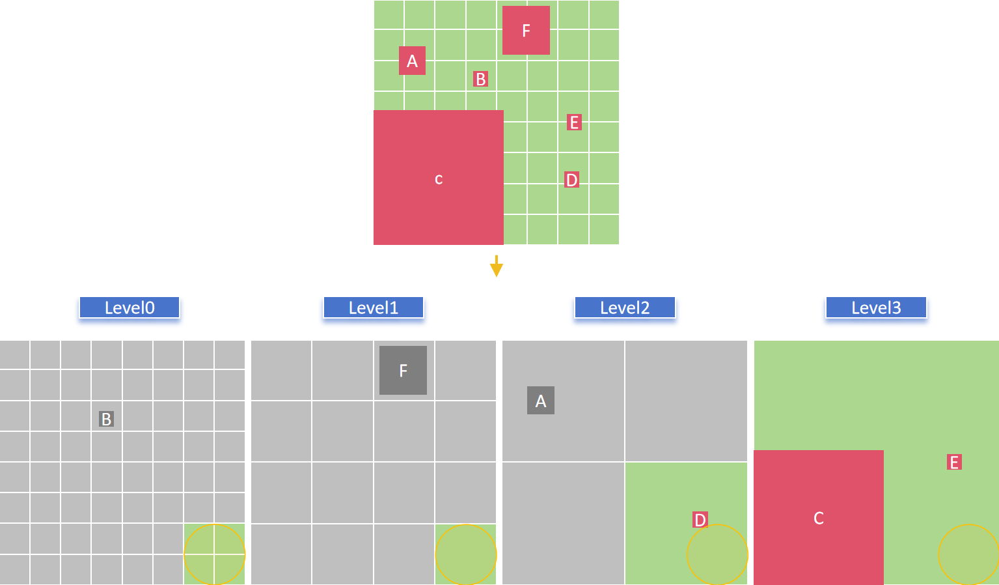

However, for cells that have been unloaded, we still want them to be displayed but do not want to increase the performance overhead too much. Therefore, we generate HLODs for the objects in the cells, which can further reduce the loading range of streaming because HLOD can:

- Reduce Draw Calls
- Reduce the number of primitive components and improve culling efficiency
- Reduce the precision of geometry and textures in the distance, improve rendering efficiency and reduce memory pressure

But it also has problems:

- Can only expand the display range to a certain extent
- Will increase the size of disk space

Currently, UE provides four basic HLOD generation strategies, which are **only for static mesh assets**:

- Instancing: Merge the objects in the cell into ISM
- Merging: Merge the objects in the cell into a single mesh
- Simplification: Merge the objects in the cell and then simplify the mesh
- Approximation: Merge the objects in the cell and then approximate the mesh

They are suitable for different mesh categories. Suppose we use the following partitioned meshes:

| GirdName              | Cell Size | Loading Range | Priority | BlockOnSlowStreaming |
| --------------------- | --------- | ------------- | -------- | -------------------- |
| `MainGrid`（Default） | 12800     | 25600         | 0        | false                |
| `DeferGrid`           | 25600     | 25600         | -9       | true                 |
| `AdvanceGrid`         | 51200     | 51200         | 9        | true                 |
| `SmallGrid`           | 6400      | 19200         | -9       | false                |

They can be divided into the following categories:

- Terrain patches: Mainly some static mesh patches used to supplement the ground surface (non-terrain components), distributed in `AdvanceGrid`. The size of terrain blocks can generally be 25600. For terrain patches, they are placed in cells of `51200`, and geometry is merged to generate HLOD to reduce DrawCalls and the number of primitive components.
- Ordinary models: Distributed in `MainGrid`, placed in cells of `12800`. The HLOD generation method is to eliminate small objects, merge them, and then simplify or approximate to generate HLOD simplified models, which can have multiple HLOD levels.
- Vegetation: Distributed in `AdvanceGrid`, using HISM of `25600` to organize Partition, placed in cells of `51200`. The HLOD strategy is to merge HISM and degenerate it into ISM of size `51200`.
- Others: Some custom or dynamic rendering components (such as particles, water bodies...). It is best to avoid displaying them in the distance. Usually, such objects need to expand the loading distance and have good LODs, or customize exclusive HLOD generation strategies.

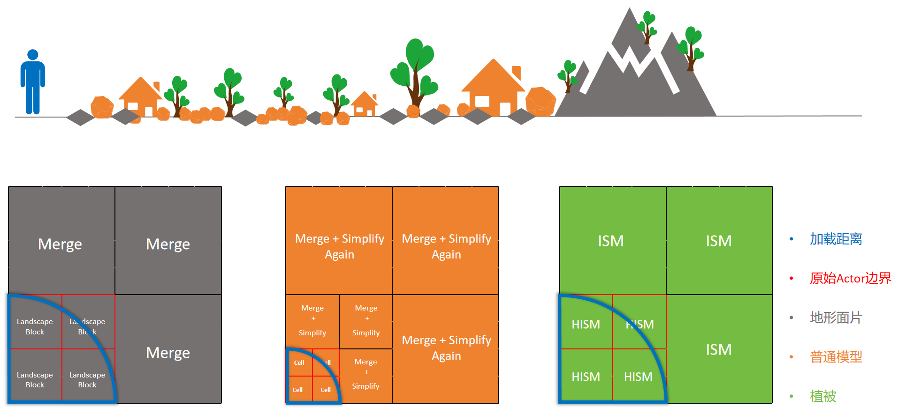

## Effects

**Effects (Niagara)** are very special rendering components. GPU particles use **Compute Shader** to simulate particle movement, and the simulated data is handed over to the particle renderer for **Indirect Rendering**.

Particle optimization mainly involves reducing the complexity of simulation logic, reducing emitters, clipping, optimizing materials, and reducing OverDraw.

The main application of LOD lies in the fact that Niagara provides some engine-built-in variables:

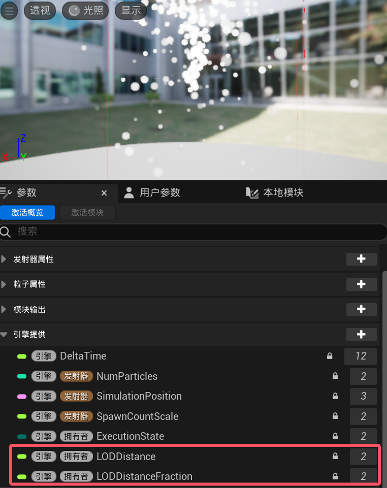

Usually, we dynamically adjust the number of particles and their life cycles according to the LOD distance to optimize the performance consumption of particles.