# Vegetation Optimization Techniques in Open Worlds

I believe that in some large-scale games, we have all more or less witnessed some breathtaking natural scenery and can't help but marvel at the artistic effects displayed by these games:

> *Ghost of Tsushima*

> *Horizon Forbidden West*

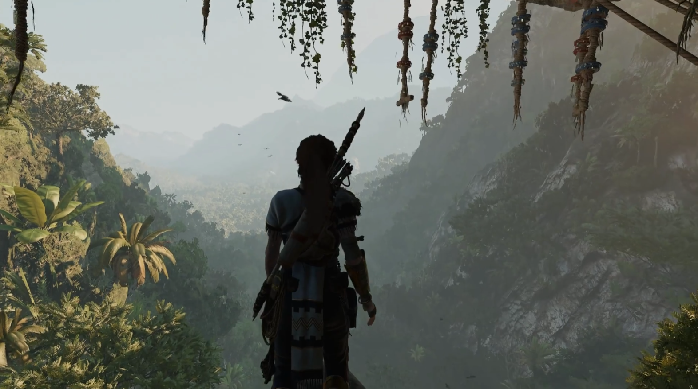

> *Shadow of the Tomb Raider*

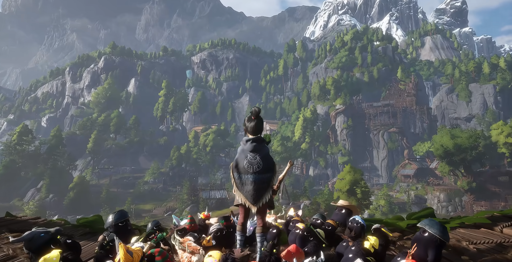

> *Kena: Bridge of Spirits*

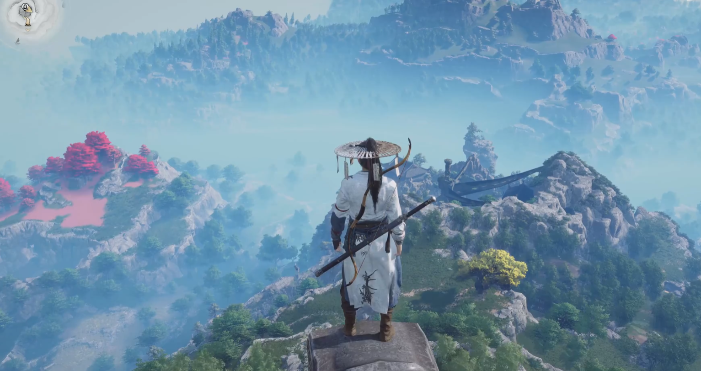

> *YanCloud 16*

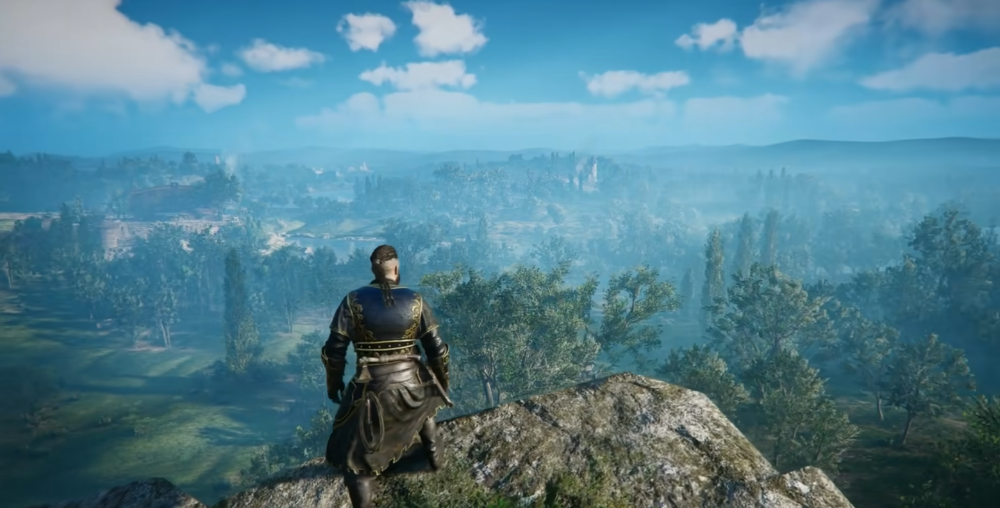

> *Assassin's Creed: Odyssey*

And none of these games were made with UE...

It must be acknowledged that although Unreal Engine 5 is very powerful, it is not omnipotent. To build natural scenes that meet the performance requirements of game projects like the ones above, we will face many challenges beyond engine technology.

In open natural scenes, the frequency and impact of performance issues caused by vegetation are often no less than those caused by lighting and special effects.

When it comes to vegetation optimization in UE5, the first things that come to mind might be reducing polygons, instancing, distance culling, optimizing materials, using LOD, or Nanite...

These asset-level optimizations and complex specialized methods often struggle to support the lush vegetation ecosystems in open scenes.

Therefore, this article will elaborate on some strategies and perspectives regarding vegetation optimization.

## Plant Asset Production

Most 3D modeling software can create plant assets, but in the game industry, **[Speed Tree](https://store.speedtree.com/)** is the mainstream vegetation production tool.

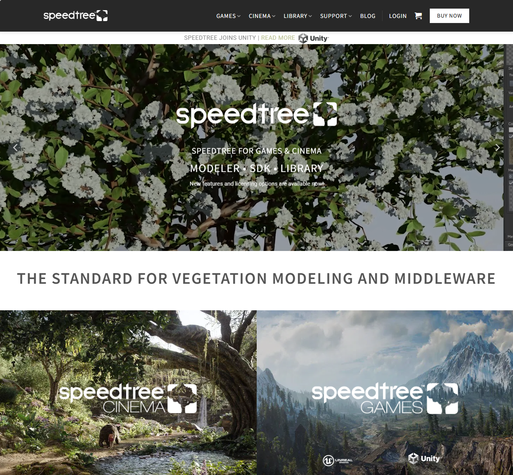

Unlike common models such as rocks, items, and buildings, plants often have a large number of stems and leaves. Geometrically, this means plant models usually have a large number of dense vertices and faces, which brings very high rendering costs. Here is an example:

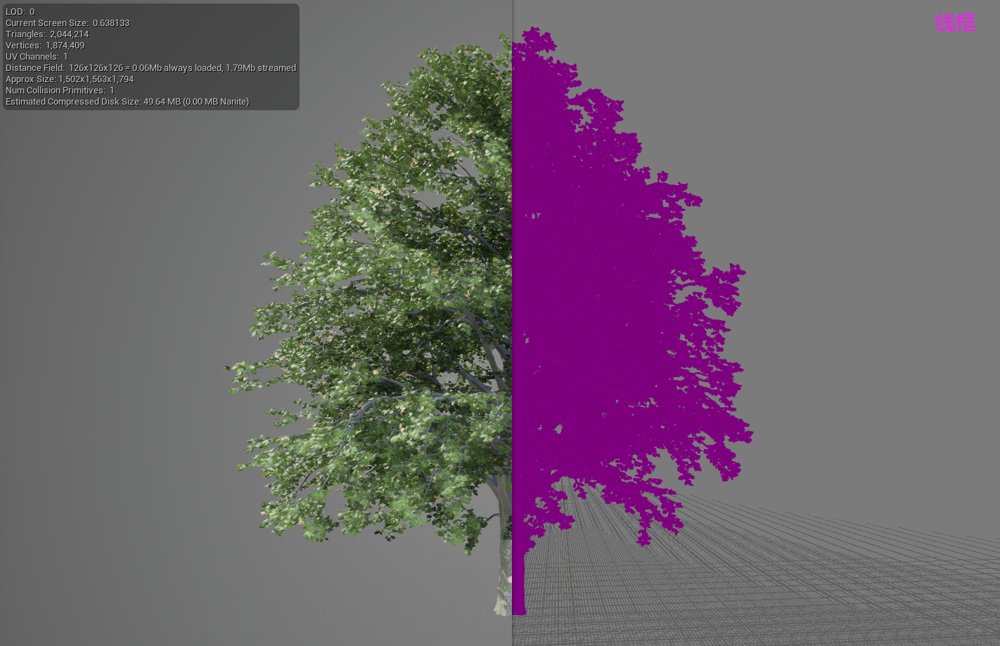

- Such a not-so-lush tree has up to two million triangles. This huge amount of vertex data and numerous repeated draws will keep the GPU busy.

This method of using model geometry to represent plant structures is generally called **model trees/grass**. Usually, assets of this specification cannot be used in large quantities in game projects.

In existing game projects, plant assets are more often made using the **card/mask** method. By pressing some branches and leaves onto a texture sheet and inserting a large number of cards on the branches to show a lush appearance, this is a very clever production method. Although there are some flaws in the effect, the performance benefits it brings are very objective.

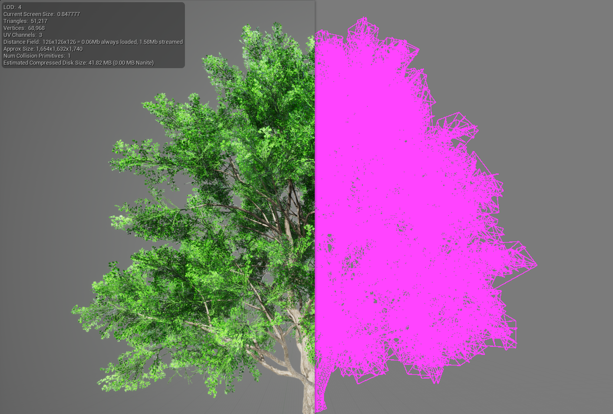

The card method has long been recognized as the most efficient way for vegetation rendering in the game industry, but it also has some defects:

- Visual defects, easy to be exposed in close-up shots.
- Using mask materials, although the number of vertices is reduced, there is still a lot of OverDraw, and the shadow rendering cost is higher.
- Plant models lack vertex features of branches and leaves, resulting in loss of global illumination effects.

With the emergence of UE5's virtual geometry technology - Nanite, this situation has changed somewhat.

The advantage of Nanite lies in using a GPU-driven pipeline, which can quickly switch geometric details and timely cull invisible triangles, greatly improving vertex utilization (screen space ratio) without affecting the visual effect as much as possible.

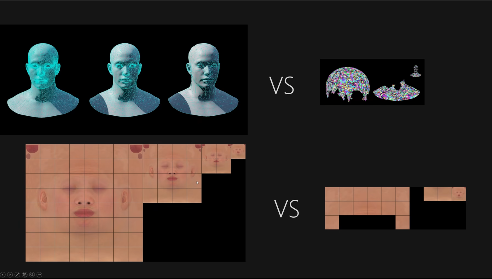

> The model tree used earlier has only one million pixels in the image but two million vertices. Obviously, most vertices contribute little to the画面 effect.

Regarding Nanite, here is a good official usage guide:

- [Documentation | Nanite Virtualized Geometry (epicgames.com)](https://dev.epicgames.com/documentation/zh-cn/unreal-engine/nanite-virtualized-geometry-in-unreal-engine)
- [[Official Training] 23 - Creating Art Assets for UE | Epic Li Wenlei](https://www.bilibili.com/video/BV18X4y1k7R1/)

The official also made a more detailed comparison for Nanite vegetation:

- [Vegetation Best Practices for UE5 | Epic Developer Community (epicgames.com)](https://dev.epicgames.com/community/learning/talks-and-demos/2lyj/unreal-engine-vegetation-best-practices-for-ue5)

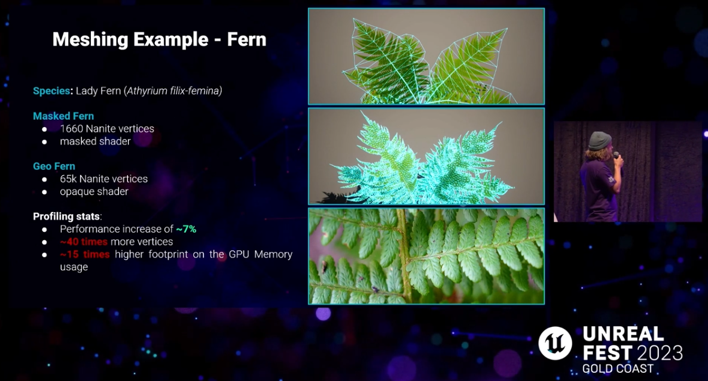

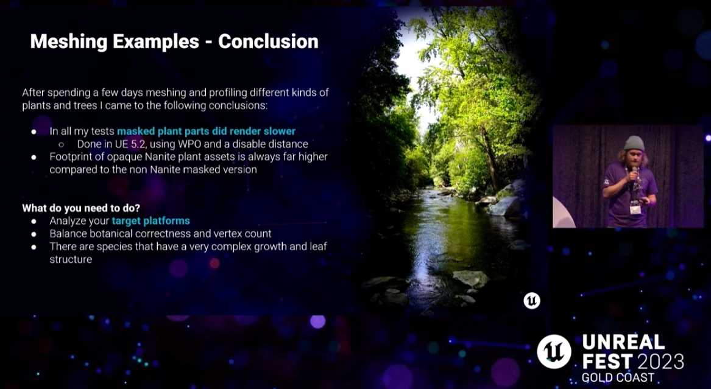

In the official test report, with Nanite enabled, results completely different from traditional rendering methods were shown - using model trees performed better than card trees.

Based on this analysis result, does it mean that we can use the model tree method with the help of Nanite to render vegetation more efficiently?

The answer is no.

> A valid argument is: The screenshots of those games listed earlier did not use virtual geometry technology like Nanite, but they still built stunning natural ecological scenery. In contrast...

### The Downside of Nanite

The reason for the negative answer is not about the vertex data volume and video memory usage, because vegetation in the scene is usually drawn in an instanced way, especially in open world scenes. We are very concerned about the load balance of performance between partitions. Although a **single** model tree using Nanite may indeed have better performance, it will also hinder us from building a unified vegetation strategy with superior performance.

The following will elaborate on the problems of using Nanite from several aspects. The views may be somewhat subjective. If there are any mistakes, please correct them~

- Higher effect expectations, accompanied by more difficult performance balance control
- Unable to specialize model optimization strategies, and not the most performance-optimal model optimization processing method
- Static data with fixed precision gradients is easier to organize into high-performance dense vegetation

#### Higher effect expectations, accompanied by more difficult performance balance control

When UE5 was released, I believe many friends were shocked by the画面 effect shown in the demo. At that time, many people might have thought that we were about to usher in the next generation of game graphics:

Believe it or not, I did (dog head). Many teams I know also believed it.

Those who believed have been official guinea pigs for the past few years and have suffered a lot. This has an even more significant impact on a commercial project.

But complaints aside, Nanite is indeed a breakthrough technology with absolute advantages over traditional LOD. With the official optimization iterations over the years, its reliability has gradually improved.

Currently, it can indeed be widely used in actual game projects, but the problems brought by Nanite usually do not lie in itself.

: I'm using Nanite, so it's not too much to make a small stone with one million triangles, right? Anyway, it will automatically reduce polygons.

: Is this the number of vertices you call a tree? The details are gone. How dare you say you use UE5? Do you look down on me?

This situation usually occurs in emerging teams using UE. In fact, the popularity of UE is not that long ago, and most teams using UE do not have deep engine technology accumulation (especially in China). For such emerging technologies, such teams are prone to盲从 marketing rhetoric, thereby weakening or even ignoring the iteration and accumulation of content production pipelines.

Precisely because of the blessing of Nanite, bosses and development teams often have higher requirements for game graphics. From the optimization perspective, although Nanite can improve vertex utilization, if source assets with more details are used, it will mean larger disk usage, and the entire scene will have more and denser vertices than before.

The number of vertices will seriously affect the performance consumption of some rendering stages:

- Shadow Map construction
- Velocity buffer drawing

And disk usage not only affects the final package size but also significantly increases the difficulty of project scene management.

Take *Ghost of Tsushima* as an example. You may think its map is not particularly large (28.62 km2), with few model types and low precision, but its package size is over 50 GB. What's more alarming is the size of its development assets:

I highly recommend watching this GDC to get a concept of asset management for large-scale projects:

- [Zen of Streaming: Building and Loading 'Ghost of Tsushima' (youtube.com)](https://www.youtube.com/watch?v=Ur53sJdS8rQ&t=794s)

Imagine if we use UE's Nanite to replicate a scene like *Ghost of Tsushima*. Conservatively, if we increase the asset precision by four or five times, we can imagine how high the management cost of such a huge project asset will be.

Therefore, for game projects, I still suggest managing the expectations of scene art effects as much as possible. It should not affect or even drag down the iteration of gameplay.

> If the game scene cannot run stably at 80 frames on the development machine, and seriously encroaches on the performance budget and iteration space of gameplay or other modules, no matter how good it looks, if it lacks gameplay, what's the use?
> I believe most players will not pay for a game just because it has photo-realistic graphics.

#### Unable to specialize model optimization strategies, and not the most performance-optimal model optimization processing method

There are usually two ways to optimize models:

- **Reduce**:删减 the geometric data of the source model to get a simplified model.
- **Remesh**: Approximate the source model with a certain voxel precision through voxelization model algorithms to get a simplified model.

These two strategies have different application scenarios:

- Reduce: Suitable for planes, usually used for models with high requirements for geometric edges and corners, such as terrain, buildings, plants, water planes...
- Remesh: Suitable for closed models with relatively rounded geometric shapes, which can usually ensure the geometric shape of the source model with very few vertices, such as stones, buildings, props...

For trees, if we use these two strategies to generate simplified models with the same number of triangles:

> Nanite uses the Reduce algorithm. It can be understood that the reduced model will be a certain precision gradient of Nanite. The Nanite strategy is to prioritize ensuring that the画面 is not distorted. If this tree uses Nanite directly, how far do you think it needs to be to display such precision? Obviously, it has to be very far, and there are still many vertices at this time.

Both strategies have their own problems:

- Remesh: The model becomes fluffy, and black blocks appear where UV mapping is abnormal. (In fact, to generate a good Remesh model, the parameters of the voxel algorithm need a lot of fine-tuning and specialization)
- Reduce: A lot of leaf details are lost.

In this regard, I have done many attempts and can clearly say that it is difficult to get excellent plant LOD through automated model processing algorithms with unified strategies.

Why is vegetation optimization so difficult? Because many times people treat it as a regular model in the engine's rendering mechanism for optimization, but the most critical part of making good vegetation in games is the production skills.

For manually making LOD, art students can use as few main branches as possible to create a larger coverage area, use secondary branches to add local details to the main branches, and when making low-level LOD, only need to cut off a certain number of secondary branches.

You can also adjust the vertex color to distinguish between main and secondary branches, and finally use the vertex color weight-based reduction method for plants.

> Usually, vertex colors are painted on trees as weights for the vertex offset amplitude during plant wind calculation. This weight factor can also be used as the weight for regional simplification.

This method can be used to generate several high-precision LODs of plant models, but unfortunately, the simplified models generated in this way still often have a high number of vertices (when simplified to more than 1500 vertices, the model is already unrecognizable). To further reduce the number of vertices significantly (without cutting the main branches, otherwise there will be great visual defects) while ensuring the model's performance effect, it is obvious that the simplification method cannot do this. We must break the original geometric structure of the model. However, the Remesh method often makes a tree very fluffy and has UV mapping abnormalities. Its performance effect is not good. Is there any other way to solve this problem?

The answer is yes. Our ultimate goal is to ensure the display effect of the model, not the geometric structure. This also leads to another strategy for model optimization - **Impostor**.

> Impostor is my own translation. Translating it as "proxy" is easy to confuse with Proxy, and translating it as "impostor" is not very nice.

We usually use Impostor as the last level LOD of vegetation models. Common Impostor strategies include the following:

- **Billboard**: Draw the model from a specific angle onto a texture.
- **Flipbook**: Draw the model from multiple angles onto a texture, and finally switch the displayed texture according to the player's perspective in the material.
- **Billboard Cloud/ Mesh Card Cloud**: Draw the model on many mesh cards to stack up the perspective effect similar to the source model.
- **Octahedron**: Draw the model with a certain perspective distribution onto a texture, and finally interpolate images from multiple angles in the material to present a reliable perspective transition effect.

- [Game Scene Vegetation Optimization —— Impostor - Italink's video - Zhihu](https://www.zhihu.com/zvideo/1790733617217019905)

The implementation principles of these Impostor strategies are not complicated. After understanding their principles, we can easily build an Impostor generation pipeline. However, there are some specialized SDKs available for us to use:

- [Simplygon - Setting the Standard for 3D Game Content Optimization](https://www.simplygon.com/)
- [InstaLOD - Everything You Need to Produce and Automatically Optimize 3D Content](https://instalod.com/zh/)

I used InstaLOD (free for personal use) for testing. This is the UE plugin it provides, which includes many model processing algorithms:

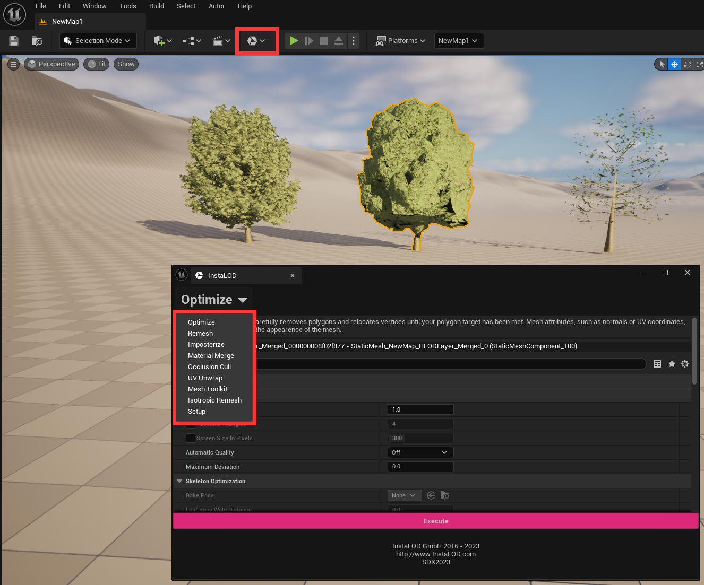

For **Octahedron**, UE provides a special plugin:

For its usage, you can check this article:

- [【Performance Optimization】Use of Impostor in Unreal (Vegetation Optimization) - Zhihu (zhihu.com)](https://zhuanlan.zhihu.com/p/693799380)

For those interested in the principle, you can check this blog:

- https://shaderbits.com/blog/octahedral-impostors

> The most valuable thing for an actual project is not the editor, but the code interface related to model processing inside, which helps the project team build a model generation pipeline that meets their own project specifications.

With so many Impostor strategies, some friends may ask, which one has better performance and effect?

Billboard and Flipbook have very few vertices, small texture sizes, and simple shader programs. Their performance effects are undoubtedly the best, but their performance effects are often not good.

The most controversial are the Billboard Cloud and Octahedron methods. In many previous 3A projects, the Billboard Cloud method was basically used, but I found in the UE forum that many people recommend using Octahedron.

I did a simple comparison test here. Who is better may need more data support:

**Source Model**

- Number of triangles: 639639
- Texture size: 4096
- GPU time: 15.52ms

 **Billboard Cloud**

- Number of triangles: 32
- Texture size: 2048
- GPU time: 10.81ms

**Octahedron**

- Number of triangles: 32
- Texture size: 2048
- GPU time: 7.75ms

It can be clearly seen that the performance and画面 performance of Octahedron are better than those of Billboard Cloud. However, if it is only used as the last level LOD, the texture size of Billboard Cloud still has a lot of optimization space. The specific plan may vary from person to person.

If Octahedron is used, we can make such an LOD chain without affecting the tree effect:

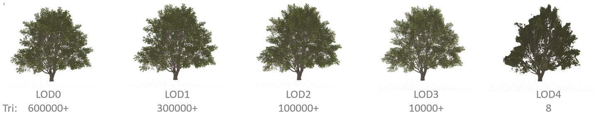

This precision gradient, combined with instancing, can achieve very low performance consumption. In contrast, it is very difficult to achieve the same goal with Nanite, because the current **automatic** reduction algorithm used by Nanite has low degradation efficiency for models like trees. To ensure that the画面 is not distorted, it will comprehensively consider the average distribution of precision to ensure that the画面 is not distorted, lacking the distinction of important parts. It usually has more vertex details, and the performance improvement brought by Impostor is completely incomparable to Nanite.

This is a simple comparison test I did:

- Nanite undoubtedly has the most保真 effect details, but its performance consumption is much higher than that of LOD. Moreover, because Nanite is based on camera perspective geometric scheduling, when the perspective rotates rapidly (which is very common in game projects), the GPU consumption will fluctuate severely!

The above LOD chain also leads us to think about another problem:

- For the problem of multi-quality compatibility, in the traditional LOD strategy, we usually adjust the **Bias** of LOD to do compatibility for different qualities. For example, in high quality, the LOD chain starts from `LOD0`, and in low quality, the LOD chain can start from `LOD1` or LOD, which can greatly reduce the number of vertices, thereby improving scene performance. But in Nanite, what should we do?

The LOD of a model is usually manually supervised, which needs to ensure **clear optimization range** and **smooth transition effect**. To achieve this, each model's LOD usually needs to be **manually** made or use **non-unified parameter** model simplification strategies.

Nanite is different. Nanite uses a unified reduction strategy for all models. This strategy optimizes vertices as much as possible while ensuring the visual effect. This strategy will lead to some models having high degradation efficiency and some having low degradation efficiency due to different model characteristics.

Although Nanite can also adjust the offset and degradation multiplier, using unified parameters will definitely break the above strategy, leading to the visual effect of the model not being guaranteed, and some abnormalities or even broken faces that users cannot accept.

This is not just for vegetation, but for all models using Nanite.

#### Static data with fixed precision gradients is easier to organize into high-performance dense vegetation

My understanding of Nanite has gone through several stages:

1. "Use it as much as possible": Turn on Nanite for everything.
2. Encountered a pitfall: Grass should not use Nanite. There are some bugs when using Nanite for objects with dense instanced rendering.
3. Encountered another pitfall: The characteristics of Nanite cannot fit the HISM mechanism. Theoretically, objects that need HISM for efficient rendering cannot use Nanite.
4. After in-depth understanding of the production methods of some projects - who uses Nanite for vegetation seriously?

Let's talk about the first pitfall. Nanite's reduction is friendly to individual instances. It can easily reduce a model with millions of triangles and a relatively rounded geometry to empty pixels and finally be culled. However, for grass or trees that have tens of thousands of instances through instancing, the degradation of Nanite cannot efficiently reduce instances, and a large number of vertices will undoubtedly generate huge overhead for Nanite's scheduling calculation, further occupying the computing resources of other GPU tasks. This is especially obvious on some mid-to-low-end models.

> When the number of Nanite instances in the current画面 exceeds a certain threshold, it may even cause画面 abnormalities, although there are some engine commands that help improve this phenomenon.

The second pitfall should be discussed in combination with the HLOD of world partitioning. HLOD is a **distant proxy** used to display outside the streaming loading range in the open world. Ordinary models can generate distant HLOD through **Merge** + **Remesh** in the partition. However, for vegetation, using the voxelized Remesh algorithm for objects with many fragmented planes will generate marshmallows. The **Merge** + **Reduce** method cannot guarantee the画面 quality of distant vegetation while greatly reducing the number of vertices and DrawCall. Therefore, the HLOD of vegetation can only use **Instancing**. The instancing optimization in world partitioning, in addition to **regional切块** for instanced vegetation, also needs to use **Hierarchical Instanced Static Mesh (HISM)**, which is different from **Instanced Static Mesh (ISM)**. Hierarchical instanced meshes allow switching LOD inside the instanced mesh. For example, all the trees below are drawn with one HISM:

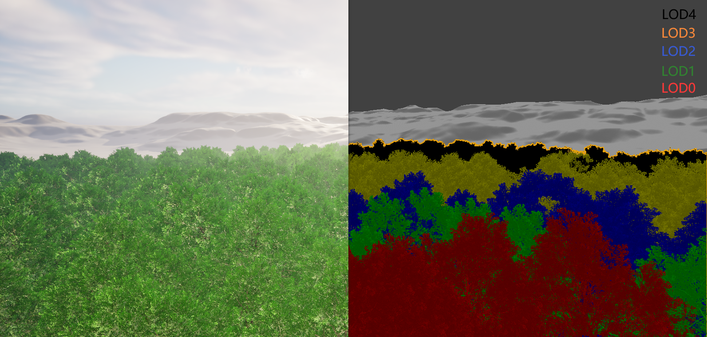

HISM essentially divides the instanced mesh into ClusterTree, each Cluster has its own independent LOD level, and finally generates multiple levels of ISM. Through some engine commands, we can control the division strategy of HISM. For specific implementation details, you can refer to:

- [UHierarchicalInstancedStaticMesh (HISM) Principle Analysis - CSDN Blog](https://blog.csdn.net/qq_29523119/article/details/123932029)
- [HISM Large-scale Vegetation Rendering Solution - CSDN Blog](https://blog.csdn.net/ZJU_fish1996/article/details/108806360)

Unlike traditional LOD schemes, Nanite does not have a few models with fixed precision gradients. Its LOD gradient is not at the model level, but at the cluster level. Therefore, the HISM mechanism cannot work normally on models using Nanite.

### Production Reference

For the production standard of LOD, you can refer to the GDC sharing of Horizon, except that the last level LOD becomes Octahedron:

- [Between Tech and Art: The Vegetation of Horizon Zero Dawn (youtube.com)](https://www.youtube.com/watch?v=wavnKZNSYqU&t=2412s)
- [Interactive Wind and Vegetation in 'God of War' (youtube.com)](https://www.youtube.com/watch?v=MKX45_riWQA)

### Summary

I have said a lot of trivial information above, and here is a unified summary:

- For plants with the same lushness, using the model tree method will generate a large number of vertices, and the performance and memory consumption it brings are much higher than those of the card tree method.
- The current reduction strategy of Nanite has low degradation efficiency for leaves, while manually controlling the LOD precision gradient and using Impostor can usually produce vegetation with better performance.
- Whether it is a model tree or a card tree, turning on Nanite will definitely have optimization improvements, but Nanite is contrary to HISM. Therefore, if there is a lot of vegetation in the project scene, it is not recommended to use Nanite vegetation, but to use traditional LOD production processes with ISM and HISM for optimization.
- For emerging teams, everyone is crossing the river by feeling the stones, and it is difficult to say which solution is optimal. Once it is determined, you can rest assured by laying out the quantity according to this specification. Facing this problem of uncertain solutions, our best management plan is to build our own content generation pipeline to minimize the sunk cost in the iteration and verification process as much as possible.

It is recommended to build a preview level for scene assets:

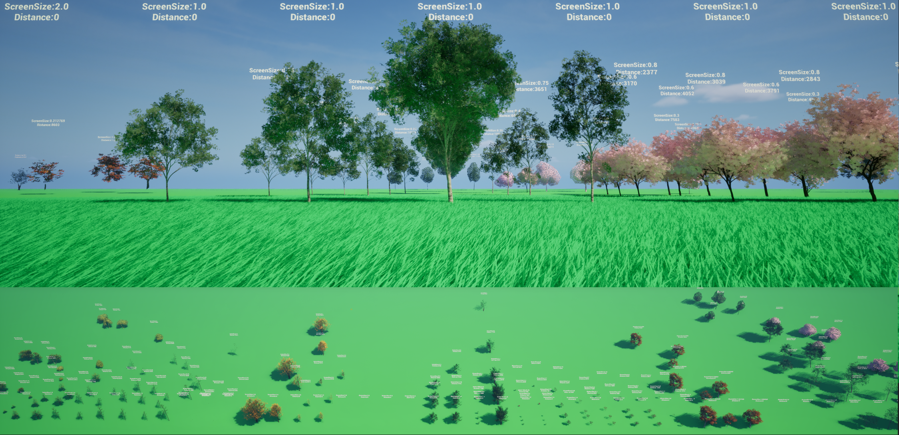

## Vegetation Organization

After determining the vegetation production pipeline, we also need to consider the planning method of vegetation in the scene.

### Construction Methods

In UE, there are mainly the following ways to create a large number of vegetation:

- **Foliage EdMode**

    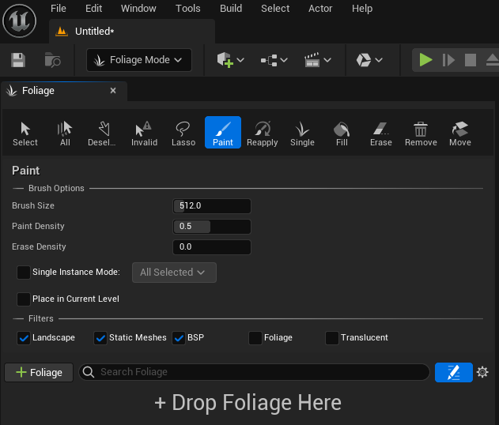

- **Landscape Foliage Type**

    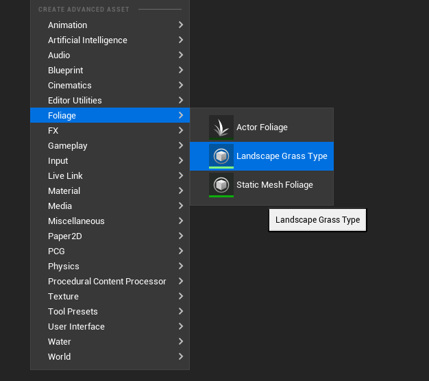

- **Procedural Content Generation Framework** 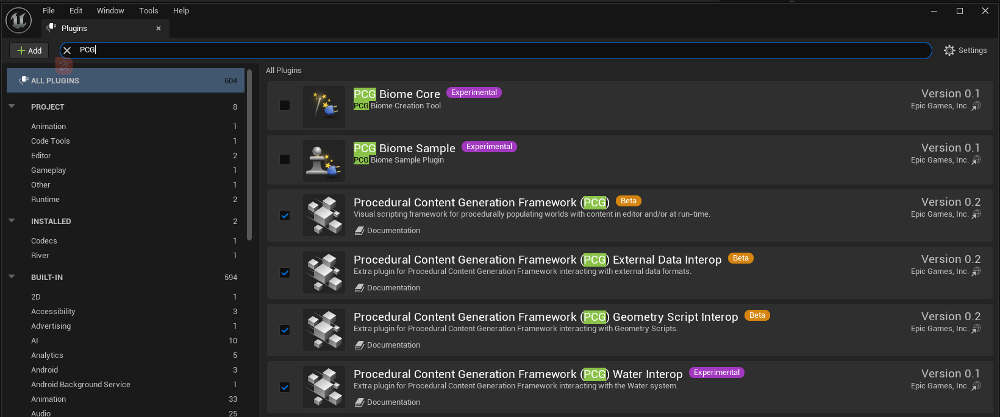

These methods have their own application scenarios:

- Foliage EdMode: For a serious game project, I can only say that **Foliage EdMode is something that cannot be touched at all**. This way of painting vegetation has a huge rework cost and is difficult to do cross-platform performance adaptation.

- PCG: The PCG framework is undoubtedly the best vegetation editing method. Using it can easily and quickly build ecological communities, and can customize some scalable parameters for multi-platform adaptation.
- Landscape Foliage Type: It is suitable for dense grass drawing. The implementation in UE should refer to the management process of [procedural grass](https://www.bilibili.com/video/BV1SF411N7RW/) in *Ghost of Tsushima*. It generates grass clusters through asynchronous tasks during preview. Although it is very efficient, using Landscape Foliage Type will occupy a terrain layer to describe the density of grass, which is not suitable for large-scale use.

### Partitioning and Streaming

First, let's review the content about UE5 world partitioning. I have sorted out a related article before:

- [Unreal Engine 5 Development — Open World Production - Zhihu (zhihu.com)](https://zhuanlan.zhihu.com/p/670363215)

Some key construction guidelines were also given by the official some time ago:

- [World Construction Guide (qq.com)](https://mp.weixin.qq.com/s/sbsDIN6dUtq5CGhqRBR5oQ)
- [Advanced World Building in Unreal Engine - Chris Murphy / Epic Games for WA Games Week 2023 - YouTube](https://www.youtube.com/watch?v=gJKGMFcg29c&t=2211s)

I believe everyone has a certain concept of **Streaming**:

This is the grid configuration used in my personal test project:

| GirdName            | Cell Size | Loading Range | Priority | BlockOnSlowStreaming |
| ------------------- | --------- | ------------- | -------- | -------------------- |
| MainGrid（Default） | 12800     | 25600         | 0        | false                |
| DeferGrid           | 25600     | 25600         | -9       | true                 |
| AdvanceGrid         | 51200     | 51200         | 9        | true                 |
| SmallGrid           | 6400      | 12800         | -9       | false                |

Usually, a loading range of 256 m can ensure that most of the performance effects in the field of view are normal. The following is the effect in the 3D view (the character in the distance is a small black dot under 256 m):

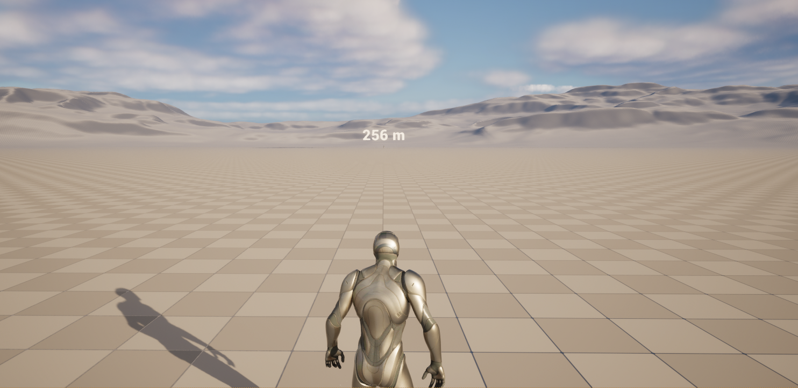

Scene models are generally placed in `Main Grid`, but considering that the cell size (CellSize) will also affect the distance of HLOD batching, I recommend putting vegetation in `AdvanceGrid`.

Unlike other regular static models, vegetation cannot generate a high-quality distant proxy by Merge+Remesh in open world scenes. But vegetation cannot be Merge into a Mesh, or after Merge into a Mesh, there is no good strategy to ensure the effect of vegetation while greatly reducing its vertices and optimizing its materials. Therefore, if you want to make a large range of vegetation, you can only use the instanced way to lay it. To ensure the load balance of performance between the world partition units, we must strictly control the number of plant types. There will definitely be some compromises in the art effect.

> Distance culling usually causes serious visual defects. If we can use some means (such as fog, corners) to block the vegetation at a distance, we do not need to consider the problem of distant proxies in this case. In this case, treat the plant as a regular Mesh, turn on Nanite, and combine with the unloading or distance culling of world partitioning to achieve good performance effects.

Usually, vegetation uses HISM for organization at close range. After exceeding the loading range:

- For small vegetation, you can directly not display the distant proxy. If you use terrain grass, you usually need to ensure that the color of the grass is basically the same as the terrain color, so that there will be no particularly obvious visual defects at a distance. If you do not use terrain grass but use procedural grass, you can bake a color texture from the top view in the procedural blueprint in the editor and render it as a decal as the distant proxy of the grass.
- For large vegetation, usually referring to trees, after exceeding the loading range, HISM can be degraded to ISM using the lowest level LOD as HLOD (HISM has the overhead of cluster division and LOD switching scheduling), like this:

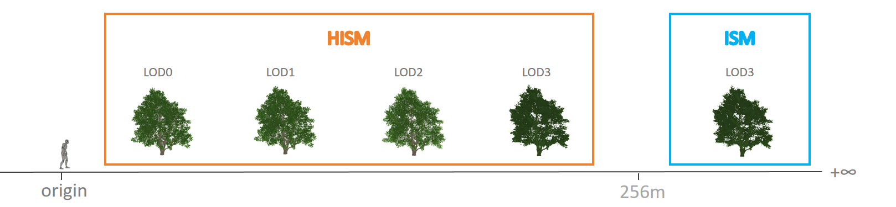

> The LOD of vegetation needs to be able to transition smoothly. Since HISM will become ISM when exceeding the loading range, it is necessary to ensure that the LOD levels on the left and right sides of the loading distance are consistent, which means that the LOD gradient of the model is distributed within the loading distance. Since UE currently uses the screen space size as the basis for model LOD switching, it needs to be converted to the corresponding distance during production.

Although with the blessing of world partitioning, it does not mean that we can build an infinitely large scene. Its advantage is more about seamless loading. The real-time computing resources of the computer are limited. Although this batching mechanism can further expand the distance, the larger the range, the greater the performance overhead, and the less budget left for gameplay. Therefore, the distance that the character can see should still be maintained within a certain distance, such as 768 m:

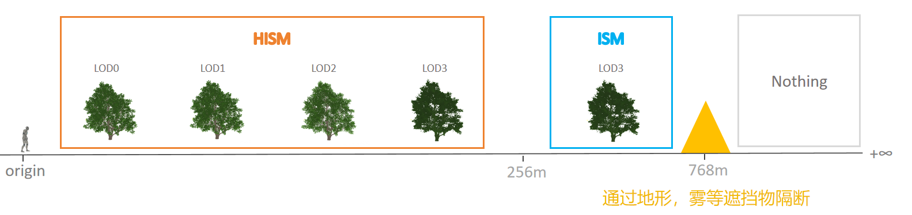

> Not only trees, but also other models, particles, dynamic material effects, etc. are recommended to follow this rule.

## Shadow Optimization

The shadow consumption of vegetation is often a large part of the entire scene, because it has a large number of dense and overlapping triangles.

So how to optimize shadows?

First, we need to think about a question: Why do we need shadows? If we turn off the shadows, we will see:

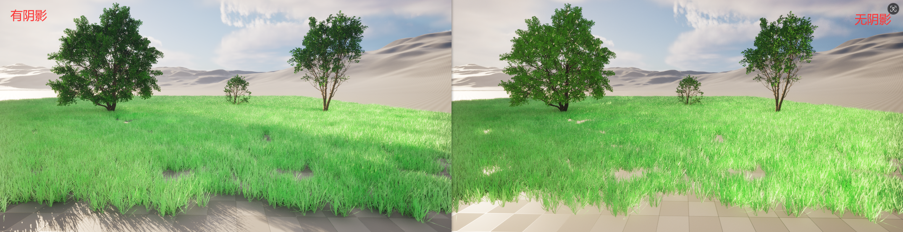

If players are asked after watching the above comparison画面: Do you like the画面 with shadows or the one without shadows?

Most players will probably answer: I choose the画面 with shadows.

Further question: Why do you like the画面 with shadows?

Most answers may be: Because without shadows, the画面 looks very违和.

Indeed, when we turn off the shadows, the spatial hierarchy of the画面 becomes much worse, which violates people's intuitive feeling of space.

In the process of game development, we need to learn to揣摩 the real intentions of players. Just like here, essentially, players do not care about shadows. They may not even care what shadows are. They just don't like the违和画面 after losing shadows.

Usually, pursuing physical or academic correctness in game projects is usually meaningless, or its cost performance is not high. Here, as long as we can ensure the deep-seated needs of players and fully show the sense of hierarchy of the画面 in a performance-superior way, it is enough.

Looking at such a flat画面:

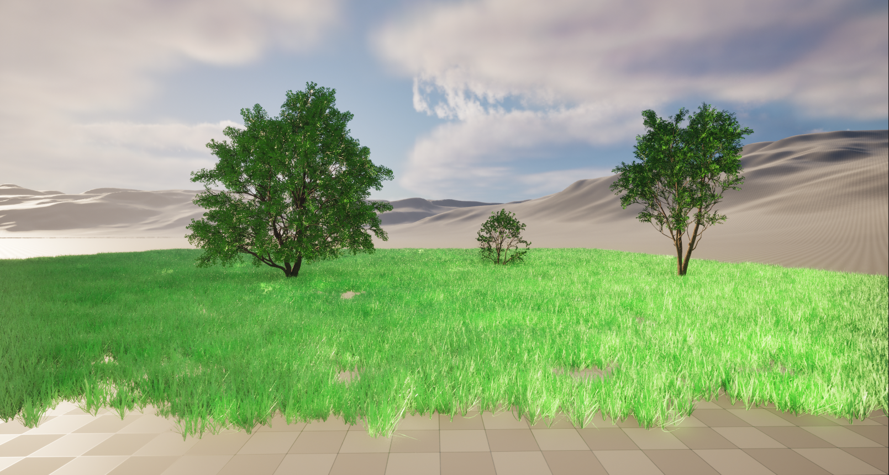

To increase its sense of hierarchy, what can you think of?

SSAO!

> SSAO is not enabled by default after using Lumen. You can use the following commands to enable it:
>
> `r.Lumen.ScreenProbeGather.ShortRangeAO 0`
>
> `r.Lumen.DiffuseIndirect.SSAO 1`  

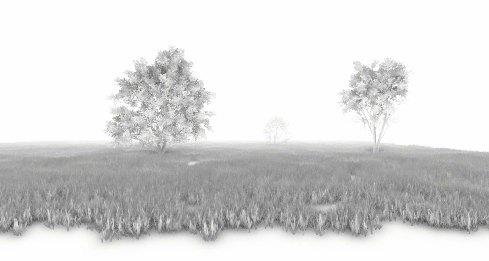

- If we can increase the weight gain of AO on the画面, the sense of hierarchy of the画面 will be much better, but this idea is contrary to the current Lumen. Interested friends can try it.

Improving AO can only increase the subtle sense of space in the画面. Without large-area spatial shadows, the画面 may still look strange.

For grass, we can directly turn off the dynamic shadow of the grass and turn on the contact shadow. The contact shadow can be regarded as a screen-space-based shadow algorithm, which is almost a shadow strategy tailored for grass:

> After enabling contact shadow in the model component, you can set the length of the contact shadow in the directional light.

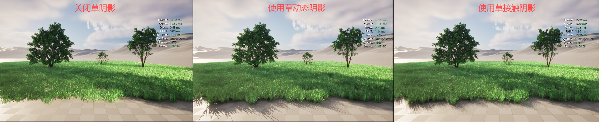

- From the above comparison chart, it is not difficult to see that the effect of contact shadow is already very close to that of dynamic shadow, but its performance loss is very low.

For trees, it cannot use screen-space shadow algorithms like grass, but we can optimize the vertex data submitted to the shadow. Because we use the LOD method to render trees, if the画面 shows LOD0, we can completely use LOD2 or LOD3 to draw the shadow instead of LOD0...

In UE, we can lock the LOD used to build ShadowMap through the engine command `r.ForceLODShadow`:

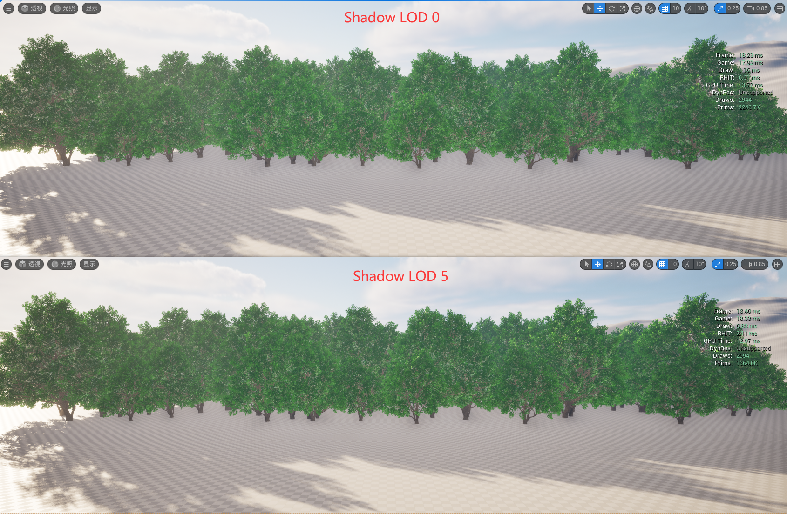

> Through the comparison chart, we can see that there are some subtle differences in the shadows using different LODs, but if we don't say it, who knows?

## Collision and Interaction Optimization

For the collision production of trees, it depends on the project's requirements for the scene. After being familiar with some of the mesh processing algorithms mentioned earlier, we can also easily build a generation pipeline for tree collision bodies. For example, using the fluffy characteristics of Remesh can easily generate a collision body with a small number of vertices like a marshmallow, or generate a collision only for the trunk part according to the distribution of vertex colors...

For interaction, since we use HISM at close range, which is not a real individual, it usually cannot interact normally.

If we need interaction, we need to do some special processing on HISM. For example, the engine extends **UFoliageInstancedStaticMeshComponent**, which can be used to handle the damage calculation of instances:

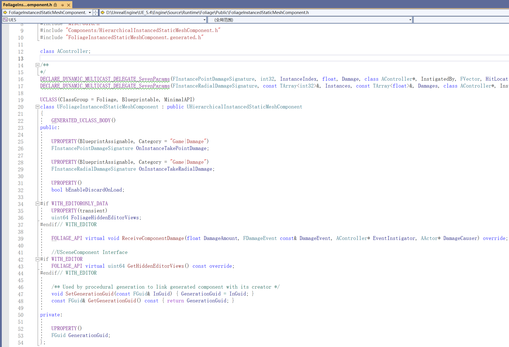

If there is a demand, you can also derive HISM yourself to make close-range instances degrade into actual Actors. Here, I do not recommend using the world partitioning method to manage this degradation.

## Others

- Try to turn off the WPO speed writing of HISM:

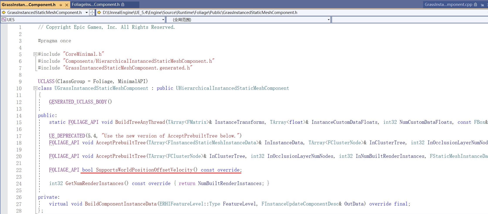

- Limit the maximum drawing distance of WPO in materials.
- Distance culling usually causes serious visual defects. If we can use some means (such as fog, corners) to block the vegetation at a distance, we do not need to consider the problem of distant proxies in this case. In this case, treat the plant as a regular Mesh, turn on Nanite, and combine with the unloading or distance culling of world partitioning to achieve good performance effects.