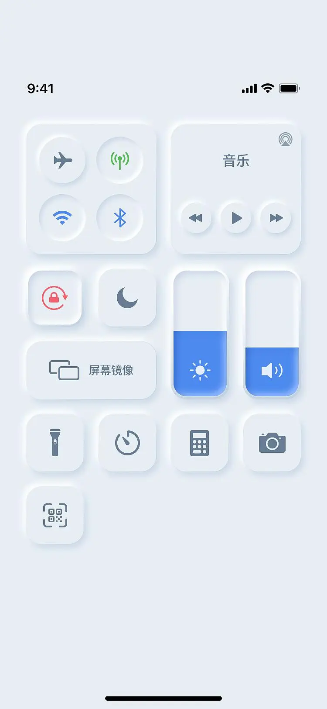
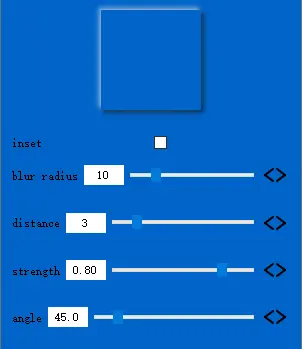
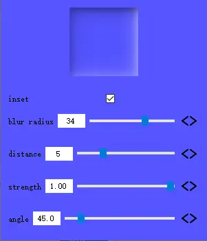

# Qt Neumorphic Window Filter

- GitHub Repository: https://github.com/Italink/QNeumorphism

I believe many friends have seen some neumorphic interface effects, just like the one below:

Neumorphic interfaces look both concise and aesthetically pleasing. Many front-end developers can easily achieve such effects using CSS3.0. However, Qt's QSS style is based on CSS2.0 and does not have the **box-shadow** property, making it impossible to set such effects via style sheets. But I was really tempted by this neumorphic effect.

After some research, I finally found a solution — **QGraphicsEffect**

This is a Demo using the neumorphic filter, with only three core files:

- **QNeumorphism.h**
- **QNeumorphism.cpp**
- **QPixmapFilter.h**

This Demo refers to **https://neumorphism.io** and implements a parameter adjustment panel for the neumorphic filter on **QPushButton**. Here are some effect examples:

