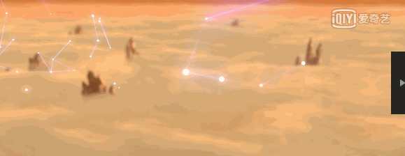
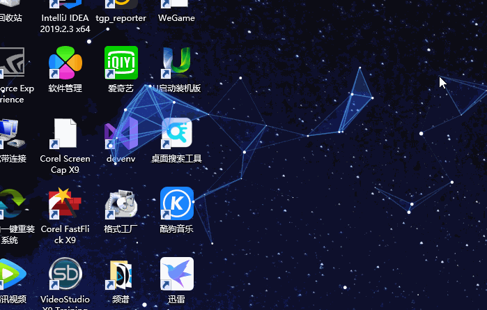
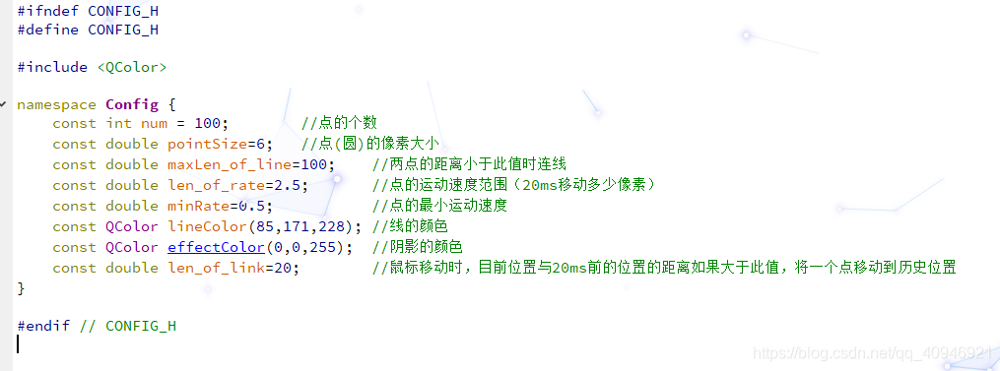

# Qt Desktop Particle Effects

- Github Repository: https://github.com/Italink/DesktopParticlesEffect

I recently watched *Ne Zha* and noticed a very cool particle effect in it:



I suddenly had the idea to implement it myself, and this is the final result:



## Tools Used

Master at least one GUI tool: Here I used Qt5 + QtCreator

## Required Knowledge

- Drawing mechanisms
- Multithreading (for real-time screen updates)
- Windows window property modification (window transparency, border hiding, mouse penetration)

## Animation Mechanism

- **Points**: There are many floating points (actually tiny circles) in the animation. These points move at different speeds and directions. To prevent points from moving outside the screen, we need to add a collision mechanism. When a point hits the screen edge, its movement direction should change (following the law of light reflection), and here I also randomly assign a speed to the point upon collision.

- **Lines**: By detecting the above point set, draw a line when the distance between two points falls within a certain range. The transparency of the line is associated with its length.

- **Triangles**: After drawing a line, traverse the point set to check if a triangle can be formed with the current points. If yes, draw it and associate its transparency.

- **Mouse Movement**: Set a point to track the mouse position so that the mouse position can also be used to draw lines and triangles. Record the historical trajectory of the mouse. When the mouse movement speed reaches a certain value, randomly place one point from the point set onto the historical trajectory.

## Configuration



## Drawing Code

``` c++
void Widget::paintEvent(QPaintEvent *e)
{
    QPainter painter(this);
    painter.setRenderHint(QPainter::Antialiasing,true);
    QPen pen;
    pen.setWidthF(1.2);
    painter.setPen(pen);
    QColor c(Config::lineColor);
    c.lighter();
    QPolygon p;
    for(unsigned int i=0;i<points.size();++i){      //Note: deduplication
        for(unsigned int j=i+1;j<points.size();++j){
            if(points[i].getDistance(points[j])<Config::maxLen_of_line){
                c.setAlpha(Config::maxLen_of_line-points[i].getDistance(points[j]));
                pen.setBrush(c);
                painter.setPen(pen);
                painter.drawLine(points[i].getX(),points[i].getY(),points[j].getX(),points[j].getY());      //Draw line
                c.setAlpha((Config::maxLen_of_line-points[i].getDistance(points[j]))/3);
                painter.setBrush(c);
                for(int k=j+1;k<points.size();++k){
                    if(points[k].getDistance(points[i])<Config::maxLen_of_line&&points[k].getDistance(points[j])<Config::maxLen_of_line){
                        p.setPoints(3,int(points[i].getX()),int(points[i].getY()),int(points[j].getX()),int(points[j].getY()),int(points[k].getX()),int(points[k].getY()));
                        painter.drawPolygon(p);                                 //Draw triangle
                    }
                }
            }
 
        }
        painter.setBrush(QColor(252,251,243));
        painter.setPen(Qt::NoPen);
        if(i)           //Draw points; the first point is used for the mouse
            painter.drawEllipse(points[i].getRect());
    }
}
```

## Point Movement Code

``` c++
void Widget::run()
{
    collisionDetection();
 
    points[0].setX(QCursor::pos().x());
    points[0].setY(QCursor::pos().y());
    for(int i=1;i<points.size();++i)
    {
        points[i].run();
    }
    int x=(lastPos-QCursor::pos()).x(),
        y=(lastPos-QCursor::pos()).y();
    if(sqrt(x*x+y*y)>Config::len_of_link)
    {
        int index=1+qrand()%(points.size()-1);
        points[index].setX(lastPos.x());
        points[index].setY(lastPos.y());
    }
    lastPos=QCursor::pos();
    update();
}
```