# Audio Visualization Software—Specinker (Closed Source)

## Preface

I believe many friends love music, and I am also a loyal music enthusiast who always enjoys listening to music quietly alone without doing anything else.

You may have come into contact with some audio visualization software a long time ago, such as the post-production rendering software AE, WallpaperEngine, Rainmeter, Avee, etc. It has to be said that AE's spectrum effect is absolutely powerful, but its rendering time has always been a headache. WallpaperEngine and Rainmeter focus on being wallpaper software, so there are very few spectrum materials available. Avee is a good choice; if Spec doesn't meet your needs, I strongly recommend using it. It can input audio and encode videos with impressive effects.

The original intention of Spec was for me to learn some knowledge related to audio, video, and graphics. Unexpectedly, as I delved deeper, the software's positioning evolved—from a music player that displays spectrums at the beginning, to a spectrum designer, and now to an audio visualization graphics engine. I dare to call it a graphics engine because it truly has many features of a graphics engine.

If you are interested in the UP and the development process of Spec, there is a brief description at the end.

## Download Link:

Download link: [specinker5.1.exe - Lanzou Cloud](https://italink.lanzoui.com/iYOAZp16qib) (If it crashes, please update your graphics card driver and open it with a dedicated graphics card)

Old version blog: [Specinker Old Version Blog_ItaLink-CSDN Blog](https://blog.csdn.net/qq_40946921/article/details/108539935)

User guide: [Spec User Guide_ItaLink-CSDN Blog_spec Software](https://blog.csdn.net/qq_40946921/article/details/108528317)

Undergraduate graduation defense PPT demonstration:

<iframe width="560" height="315" src="//player.bilibili.com/player.html?bvid=BV1f44y1z7qi&cid=348421166&p=1&share_source=copy_web&autoplay=false" scrolling="no" border="0" frameborder="0" framespacing="0" allowfullscreen="true"></iframe>

## What is Specinker?

Specinker is an audio visualization graphics engine that the UP spent one year creating with great effort. It has many graphic effects, including some basic spectrum graphics, special effect filters, particle systems, 3D models, etc. The UP has encapsulated these graphics and exposed some adjustable parameters. You can even write Lua scripts for these parameters to achieve dynamic effects (such as automatic rotation, mouse tracking, rhythm-following movement, etc.).

## Video Tutorial

<iframe width="560" height="315" src="//player.bilibili.com/player.html?isOutside=true&aid=335187087&bvid=BV1XA411c7vb&cid=398619724&p=1&autoplay=false" scrolling="no" border="0" frameborder="0" framespacing="0" allowfullscreen="true"></iframe>

## Feature Highlights of Specinker

### Clean and Efficient UI

The overall framework of Spec's graphical interface has gone through five versions as the software's positioning changed. Below are some design sketches of four historical interfaces: Currently, Spec uses a more streamlined graphical interface with a single window and high controllability.

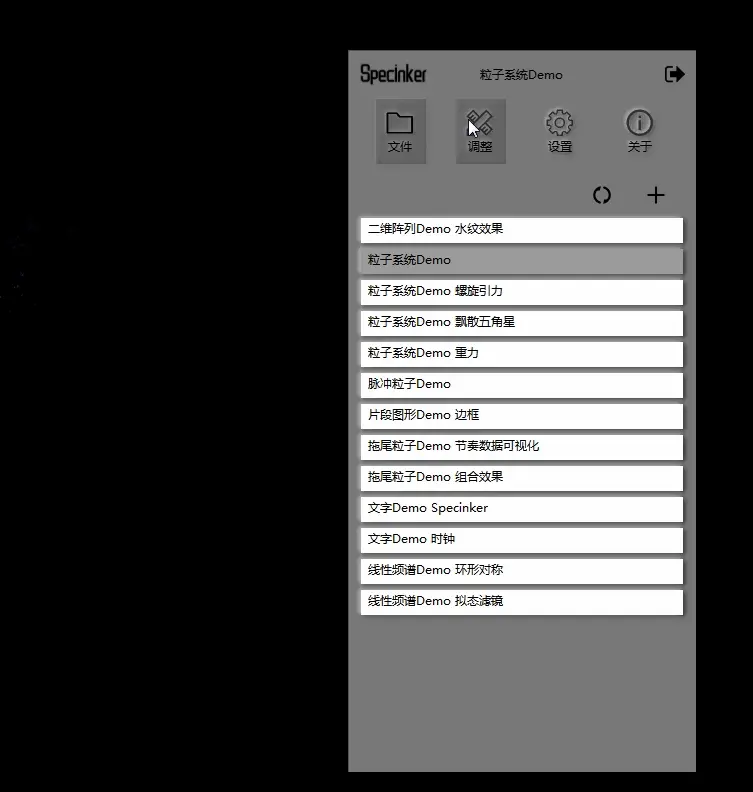

Among them, I reimplemented high-performance lightweight adjustment controls:

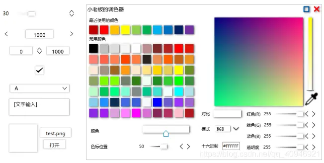

### Material Management

Click the 【+】 in the 【Adjust】 interface to add materials. After adding, a default ID will be assigned to the material. Right-click to operate on the material, and a single click will open the position adjustment control for the material.

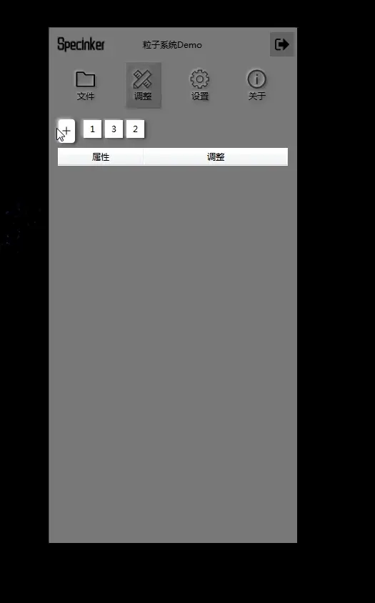

**Grouping**: Hold down Ctrl on the keyboard to select multiple material squares. After selection, right-click the mouse to open the menu for grouping. After grouping, you can move them as a whole.

### Property Management

For any material property, you can right-click to open the menu, copy 【Ctrl+C】 and paste 【Ctrl+V】, and use undo 【Ctrl+Z】 and redo 【Ctrl+Y】. Note that these operations are performed on the current property.

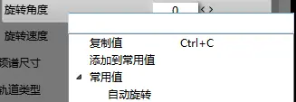

In addition, you can 【Add to Common Values】 for a property, so that this property will always appear in the 【Common Values】 list of properties with the same name. I have added some, such as 【Auto Rotation】 for 【Rotation Angle】.

You can also manage these values in the common value management of Spec's 【Settings】 interface:

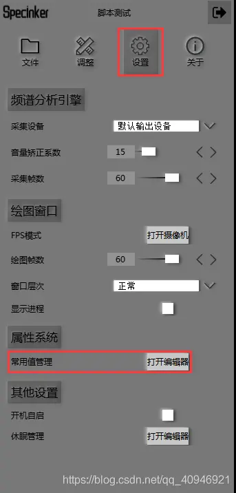

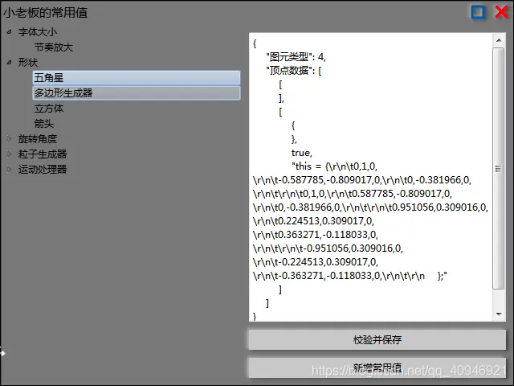

### Basic Graphics

Spec has implemented some simple basic graphics for users to use. You can combine these graphics to form new effects, such as the following:

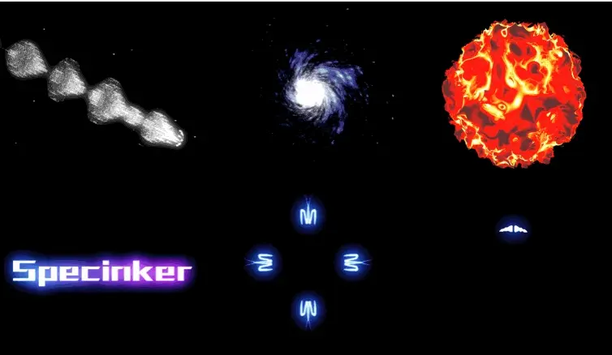

### Real-Time Filters

Spec has implemented many real-time filters. Using filters can make graphics look better, but note that filters have high resource usage, so please try to keep the filter area as small as possible.

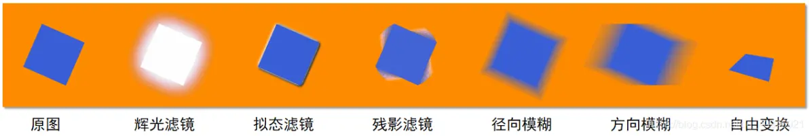

### Script Engine

To make a certain property of a material change dynamically—for example, often wanting a graphic to rotate automatically—early versions of Spec achieved this by adding a 【Rotation Speed】 option combined with 【Rotation Angle】. This implementation method has many drawbacks:

- 【Rotation Speed】 easily conflicts with 【Rotation Angle】 and is not easy to synchronize
- It can only achieve simple automatic rotation and cannot be extended (e.g., it cannot make the graphic rotate automatically with the rhythm)

The current method used by Spec is Lua scripting. You can directly write Lua code to make the material's properties change dynamically. Properties that can use code will have a checkbox in front of them, as follows:

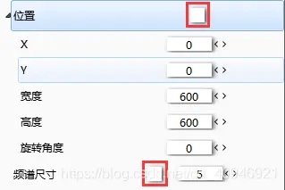

Just check the box, and the property will be calculated using code. For example, to achieve an automatic rotation effect:

1. Check the code checkbox

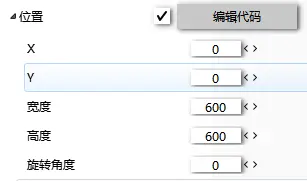

2. Click the edit code button to open the code editor and write the code

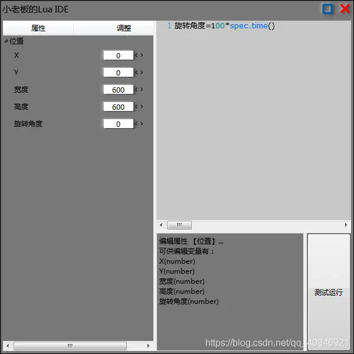

3. Click Test Run, and you can see the graphic start rotating automatically

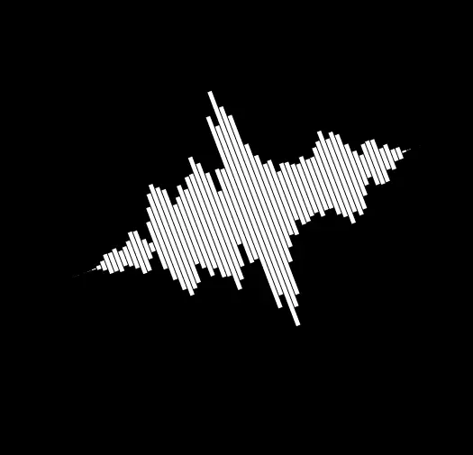

4. We can also expose our own parameters. Right-click the position and add a float1 variable

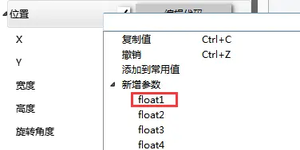

5. Name it 【Rotation Speed】

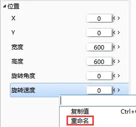

6. Then replace the 100 in the code with 【Rotation Speed】

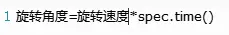

7. After that, you can use the 【Rotation Speed】 parameter to adjust it.

### Particle System

Based on the script engine and OpenGL, Spec has implemented a programmable GPU particle system.

The default particle system has added gravity and attraction code, as well as mouse following. Add a glow filter to it, and you will find the effect is actually quite good.

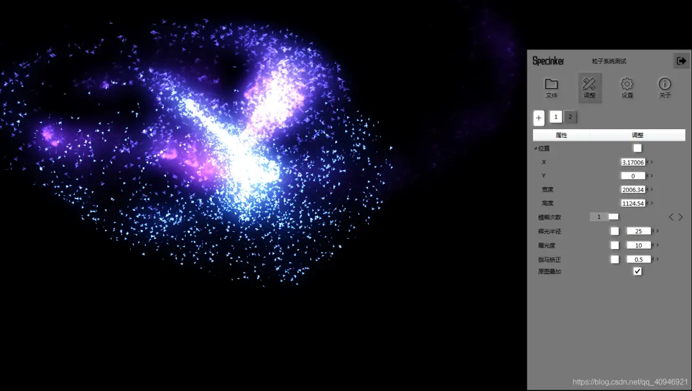

Let's explain in detail how to use the particle system:

**Controlling Particle Shape**:

The particle shape is controlled by 【Primitive Type】 and 【Vertex Data】. The default 【Primitive Type】 is triangle fan, and Lua code is used to generate an n-sided polygon:

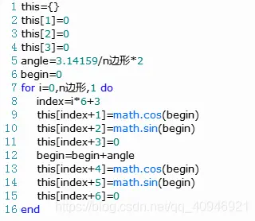

You may not understand the code, but it doesn't matter. However, you must know how Spec parses the format of vertex data. You need to construct a Lua array where every three data points represent the xyz of a vertex. Note two points:

- Vertex coordinates use normalized coordinates, i.e., the value range of xyz is [-1, 1]
- The starting index of the Lua array is 1

For example, if you want to create a square particle shape, you can construct such data in the code:

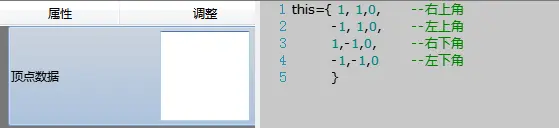

Click 【Test Run】 and change the 【Primitive Type】 to 【Triangle Strip】, and you will see the particle shape become a square:

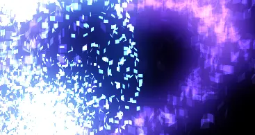

**【Spawn Count】**: Indicates how many particles are spawned per second

**【Lifetime】**: Indicates how many seconds each particle survives

**The following explains the programmability of particles**:

A particle is essentially a combination of data with some states (such as velocity, size, position, rotation, etc.). Particle movement means changing these particle states. Spec's particle system uses two code interfaces:

**【Particle Generator】**: Used to generate the initial state of particles, which can be regarded as the state of the first frame (this state will not be displayed).

**【Motion Processor】**: This code is called every frame after the particle is spawned to process the particle's state.

Special reminders:

- This is no longer implemented through Lua code. Since Spec uses GPU particles implemented through transform feedback, this code will eventually run on the GPU. Therefore, the code format used here is GLSL (shader language).
- Please carefully read the console log in the motion processor, where "in" represents input variables. To distinguish them, I named them starting with "i". For example, the variable 【iPosition】 represents the 【position】 of the previous frame. You only need to assign a value to 【position】 in the code.

Through GLSL code, you can define any particle movement rules. For example, you can add gravity, resistance, or even some collision effects. Since there is a lot of content, the UP will use a detailed article to explain it later.

## About the UP and Specinker

The **UP** is a young guy who likes to hide in the corner and work on "black technology". The first time I came into contact with music spectrums was when I accidentally saw it on a friend's wallpaper—it was so cool! You may have guessed which software it is—yes, Rainmeter. I immediately went to find information to learn it, but found that Rainmeter's programming syntax was completely different from the C/C++ I had learned; it was too old. At that time, I thought: "Is it useful for me to spend time learning this?" Obviously, I gave up. I also thought about trying to make it myself at that time, but didn't know where to start.

It wasn't until later when I was learning Qt that I found a spectrum analyzer project in the official examples. I was so excited at that time, but the 7,000-8,000 lines of code were like Mount Tai pressing down on me. I didn't understand audio and video encoding, multimedia drivers, and I had only learned Qt for a few months. But could I really not do it even if there was a project for me to copy?

So I continuously removed useless code according to the logic of the code, just like defusing a bomb. If the project crashed, I used the previous backup to delete again. After more than two weeks, I finally modified it to only 1,000 lines of core code. During this process, I basically had a general understanding of the audio processing flow. Then I used this part of the code combined with Qt's drawing mechanism to complete the first version of Specinker:

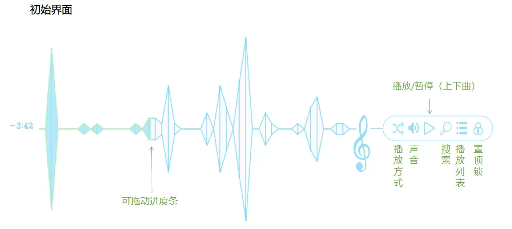

Looking back now, isn't it terrible? But it took me more than two months to make such a small thing. However, I received encouragement from my classmates at that time, which made me very happy. Then I posted this project online, and surprisingly, some people actually used it! Then I started expanding it crazily, like I was "on drugs". I began to transform the original spectrum player into a spectrum designer:

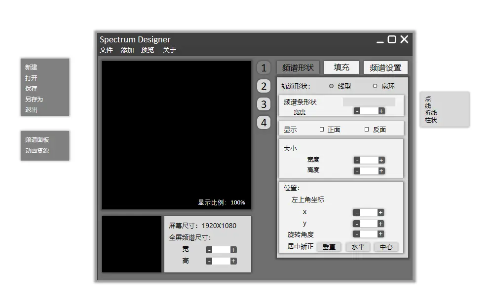

Halfway through writing, I suddenly realized I was being stupid: since this is made to be displayed on the desktop, why didn't I design it directly on the desktop instead of using a preview box? It was like taking off my pants to fart.

Then I had to abandon part of the code and rewrite it, resulting in the following version (which is also known as "Dynamic Sound"; it may be the version used more online, thanks to everyone's promotion):

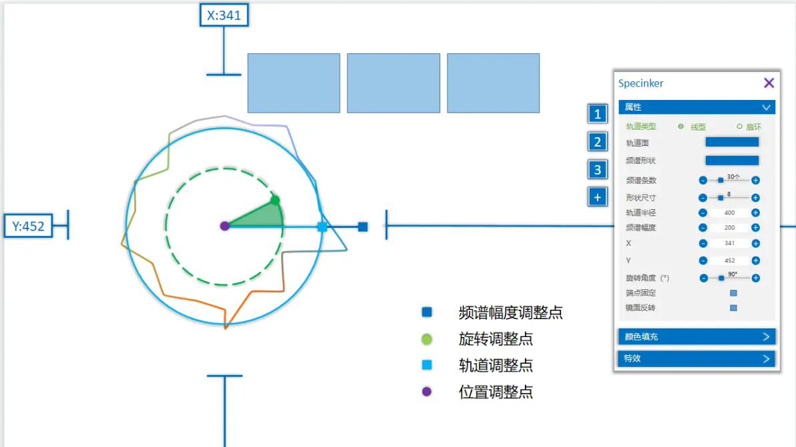

This version had a big improvement in user experience; it was simpler and easier to use. The code volume was already quite large, exceeding 10,000 lines. At that time, I excitedly told my teacher: "I thought Qt's color picker was too ugly, so I made one myself, writing more than 2,000 lines of code!" I originally planned to continue expanding this version, but then a problem arose: "Blogger, the spectrum on the desktop seems a bit delayed, and the graphics are a bit laggy." Then I patiently explained: "This thing is very resource-intensive; a little lag should be normal." I always thought so until someone compared Spec's effect with Wallpaper Engine. I realized I had underestimated C++ and overestimated myself. What to do? I had to modify it; could I admit defeat? Then I basically rewrote the core code originally obtained from the Qt official example. Instead of using Qt's multimedia framework, I directly used the Windows low-level sound card driver API (IMMDevice) to collect sound card data, and used some signal processing techniques to smooth the audio data. Then the audio rhythm had a qualitative leap! The delay was gone, and the rhythm was pretty good. At that time, I felt I was really awesome. But then another turning point came:

A junior asked me for help with a programming problem. After I told him the solution, he praised me a lot. Then I proudly sent him the effect of Spec. I still remember that conversation clearly:

- UP: [Video]
- UP: Cool, right?
- Junior: What is this?
- UP: A software I made myself to create spectrums.
- Junior: Oh, I know it's a spectrum.
- UP: I spent a long time making it, writing ** lines of code.
- Junior: Brother, to be honest, this is really bad. I've seen many spectrum videos that are much cooler than this. Wait, let me find them for you.
- Junior: [Video]
- Junior: How about it?

I didn't speak after watching the video because I felt like a joke. That video was made with AE; Spec's spectrum effect was worlds apart from AE's. I didn't sleep all night that day, thinking: "How does AE create such effects?" Then I searched: "Oh, it turns out it has a glow effect." Then I looked further: "It turns out glow is just blurring the image and then brightening it a bit." Then I immediately started working, looking for blur principles and writing blur algorithms. After a few hours of折腾, I found that blurring a 1000*1000 image took several seconds. "Oh right, doesn't Qt have a blur effect? I'll take that code and use it." After another few hours of折腾, it still took one or two seconds. Oh right, didn't they always say to use OpenCV for image processing? I tried that again. The time was indeed much faster, but it was close to 100ms—real-time rendering would be as laggy as a PPT. Finally, I learned that high-performance drawing requires using the GPU. Then I searched on Zhihu: What to use for GPU drawing? I折腾 until dawn; my roommates went to class, and I went to bed. Then I was idle for more than a week. When I got home, I started my OpenGL learning journey. That period was very boring; I would fall asleep on the desk while writing. But fortunately, I dragged my younger brother into it—when I learned OpenGL, he also had to read books. I didn't use QQ or WeChat much, like I had evaporated from the world. But fortunately, I persisted. After learning OpenGL, I didn't start coding directly; instead, I briefly learned 3ds Max and UE4. I didn't learn them in depth, but paid special attention to their architecture and functions before finally starting to write code. Coincidentally, it was also my senior year, and this project became my graduation project. Then, there was the current Spec.

Looking back on this journey, I really have a lot of emotions. I have been in the trough and encountered many difficulties, but fortunately, I received help from many people, which allowed me to stick to my original intention and break through myself. I used to always escape from reality and feel desperate in moments of brief clarity. But one day you will know: there will always be someone, or some people, who make you have to stand up because you are their hope.

Unrelated to Spec, I hope everyone who sees this can live each day positively and optimistically.

** For the development process of Spec, you can check this link: **

https://github.com/Italink/Italink-s-Undergraduate-Design

The UP is also making OpenGL-related tutorials, which can be found in the column.

Due to work reasons, Spec may not be updated temporarily, but the UP will never give up!

When the UP has enough experience in the future, I will definitely make a better and cooler Spec. At that time, it may not just be displayed on the computer. 0.0