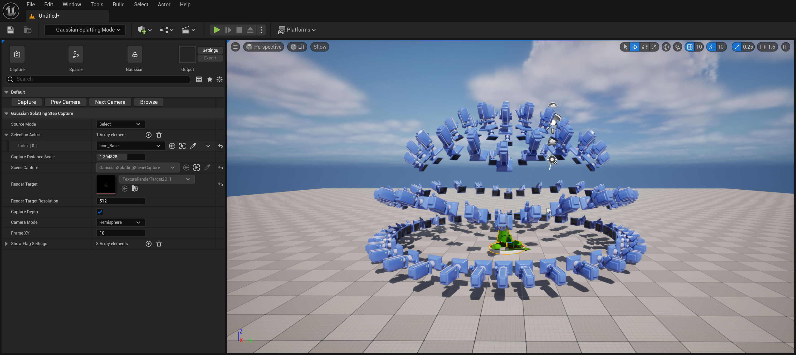

# Gaussian Splatting For Unreal Engine

- Repository URL: https://github.com/Italink/GaussianSplattingForUnrealEngine/

**GaussianSplattingForUnrealEngine** is an Unreal Engine plugin that allows easy conversion of graphics in Unreal into high-quality 3D Gaussian point clouds:

This plugin supports the following features:

- Provides simple-to-use editor tools for:
    - Graphics capture
    - Sparse point cloud reconstruction
    - Gaussian training
- Supports importing Gaussian point clouds (`*.ply`), which are rendered in Unreal using **GPU particles** or **static meshes** as carriers
- Makes 3D Gaussians more suitable for industrial production by offering several very useful mechanisms:
    - Refined depth clipping: effectively eliminates floating noise points
    - Screen-size-based LOD strategy: efficiently adjusts the number of particles and memory usage based on the characteristics of Gaussian points

3D Gaussians have the following advantages and disadvantages:

- Advantages:
    - Compared to triangles, the **point-based** representation is more suitable for creating particle effects
    - Reconstruction based on image feature recognition usually yields better simplification results than traditional mesh simplification, making it ideal for creating visual proxies for large-scale areas
    - No texture data, only feature-based vertex data exists; its differentiable nature also allows for free cropping and compression
- Disadvantages:
    - Rendering uses a translucent overlay method, requiring translucent sorting of primitives and resulting in high OverDraw
    - Only restores the visual color expression of objects; it cannot or can hardly restore the actual physical properties of objects, so it cannot create dynamic lighting and shadow effects