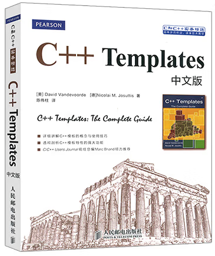

Je crois que la plupart des amis n'ont plus de grandes difficultés dans leur apprentissage après avoir trouvé le truc, et une phase après cela tourne principalement autour de deux mots —— **paresse**

> Les macros, les templates et la réflexion ne sont pas des éléments indispensables au développement. Leur utilisation permet de réduire considérablement le code, mais elles introduisent également de nouveaux problèmes.

## Macro

Avant que le code C++ ne participe à la compilation, il y a une phase de précompilation où le préprocesseur traite les **directives de préprocesseur** dans le code. Différents compilateurs ont différentes directives de préprocesseur. Par exemple, le préprocesseur de Microsoft C/C++ peut reconnaître les directives suivantes :

- [#define](https://learn.microsoft.com/en-us/cpp/preprocessor/hash-define-directive-c-cpp?view=msvc-170) : Définir une macro
- [#if](https://learn.microsoft.com/en-us/cpp/preprocessor/hash-if-hash-elif-hash-else-and-hash-endif-directives-c-cpp?view=msvc-170) : Jugement logique conditionnel
- [#ifdef](https://learn.microsoft.com/en-us/cpp/preprocessor/hash-ifdef-and-hash-ifndef-directives-c-cpp?view=msvc-170) : Jugement "if define"
- [#ifndef](https://learn.microsoft.com/en-us/cpp/preprocessor/hash-ifdef-and-hash-ifndef-directives-c-cpp?view=msvc-170) : Jugement "if not define"
- [#elif](https://learn.microsoft.com/en-us/cpp/preprocessor/hash-if-hash-elif-hash-else-and-hash-endif-directives-c-cpp?view=msvc-170) : Else if
- [#else](https://learn.microsoft.com/en-us/cpp/preprocessor/hash-if-hash-elif-hash-else-and-hash-endif-directives-c-cpp?view=msvc-170)
- [#endif](https://learn.microsoft.com/en-us/cpp/preprocessor/hash-if-hash-elif-hash-else-and-hash-endif-directives-c-cpp?view=msvc-170) : Terminaison du jugement logique
- [#error](https://learn.microsoft.com/en-us/cpp/preprocessor/hash-error-directive-c-cpp?view=msvc-170) : Lancer une erreur
- [#include](https://learn.microsoft.com/en-us/cpp/preprocessor/hash-include-directive-c-cpp?view=msvc-170) : Inclure un fichier d'en-tête
- [#line](https://learn.microsoft.com/en-us/cpp/preprocessor/hash-line-directive-c-cpp?view=msvc-170) : Corriger le numéro de ligne fourni au compilateur
- [#pragma](https://learn.microsoft.com/en-us/cpp/preprocessor/pragma-directives-and-the-pragma-keyword?view=msvc-170) : La directive Pragma spécifie des fonctionnalités de compilateur spécifiques à la machine ou au système d'exploitation
- [#undef](https://learn.microsoft.com/en-us/cpp/preprocessor/hash-undef-directive-c-cpp?view=msvc-170) : Annuler la définition d'une macro
- ...

On peut utiliser `#define` pour définir une macro et `#undef` pour annuler une définition de macro précédente. La logique d'une macro peut être considérée comme un simple remplacement de caractères. Voici les utilisations de base :

``` c++
#define EMPTY_MACRO							// Macro vide
#define SRC Dst								// Remplacement

#define EMPTY_FUNC_MACRO()					// Macro de fonction vide
#define F(Param) Param						// Macro de fonction
#define F_STR(Param) #Param					// Convertir le paramètre de fonction en chaîne de caractères
#define F_MERGE(Param0,Param1) Param0##_##Param1	// Concaténer les paramètres de fonction
#define F_VARIADIC(...) __VA_ARGS__					// Transmission de paramètres variadiques

int main() {
	EMPTY_MACRO
	int SRC;
	EMPTY_FUNC_MACRO()
	F(const char*) F_MERGE(Const, Text) = F_STR(F_VARIADIC(A, B, C, D, E));
	return 0;
}
```

Après la phase de précompilation, le code ci-dessus deviendra :

``` c++
int main() {
	int Dst;
	const char* Const_Text = "ABCDE";
	return 0;
}
```

En général, les définitions de macros dans un programme C++ proviennent de :

- Les macros prédéfinies par le compilateur
- Les macros ajoutées par les outils de construction
- Les macros définies dans le code à l'aide de `#define`

Pour les macros prédéfinies par le compilateur, prenons MSVC comme exemple. Voici une liste détaillée des macros prédéfinies :

- https://learn.microsoft.com/en-us/cpp/preprocessor/predefined-macros?view=msvc-170

Pour les outils de construction, par exemple cmake, la fonction [target_compile_definitions](https://cmake.org/cmake/help/v3.2/command/target_compile_definitions.html) est fournie pour ajouter des définitions de macros à la cible de construction :

```cmake
target_compile_definitions(<target>
  <INTERFACE|PUBLIC|PRIVATE> [items1...]
  [<INTERFACE|PUBLIC|PRIVATE> [items2...] ...])
```

Les utilisations principales des macros sont les suivantes :

### Branche de compilation

- On peut utiliser une macro comme interrupteur pour basculer vers différentes branches de compilation

```c++
/* Branche de compilation multiplateforme */
#ifdef _WIN32
   #ifdef _WIN64
      // Définir quelque chose pour Windows (seulement 64 bits)
   #else
      // Définir quelque chose pour Windows (seulement 32 bits)
   #endif
#elif __APPLE__
    #include "TargetConditionals.h"
    #if TARGET_IPHONE_SIMULATOR
         // Simulateur iOS
    #elif TARGET_OS_IPHONE
        // Appareil iOS
    #elif TARGET_OS_MAC
        // Autres types de Mac OS
    #else
    #   error "Plateforme Apple inconnue"
    #endif
#elif __ANDROID__
    // Android
#elif __linux__
    // Linux
#elif __unix__ // Tous les systèmes Unix non capturés ci-dessus
    // Unix
#elif defined(_POSIX_VERSION)
    // POSIX
#else
#   error "Compilateur inconnu"
#endif
```

``` c++

/* Branche de compilation par version */
#if _MSC_VER >= 1910
// . . .
#elif _MSC_VER >= 1900
// . . .
#else
// . . .
#endif
```

### Simplification du code

- On peut remplacer certaines étapes de code fixes par des macros pour simplifier le code

Par exemple :

``` c++
#define MAX(a,b) ((a) > (b) ? (a) : (b))
#define MIN(a,b) ((a) < (b) ? (a) : (b))

#define M_PI 3.1415926535
```

``` C++
/* Utiliser ce groupe de macros pour générer des opérations liées à la classe, par exemple enregistrer la classe dans le script.. */
#define CLASS_BEGIN(ClassName) ...
#define CLASS_ADD_PROPERTY(PropertyName) ...
#define CLASS_ADD_FUNCTION(FunctionName) ...
#define CLASS_END() ...
```

``` c++
#define FOR_EACH_NUMBER_TYPE(FuncBegin,Func)\
  FuncBegin(int) \
  Func(float) \
  Func(double) \
  Func(short) \
  Func(unsigned int)

#define NUMBER_PREPEND_COMMAN(Type) ,Type
#define NUMBER_BEGIN(Type) Type

// FOR_EACH_NUMBER_TYPE(NUMBER_BEGIN, NUMBER_PREPEND_COMMAN)
// S'étendra en int,float,double,unsigned int
```

Il y a aussi des utilisations plus avancées, par exemple utiliser des macros pour implémenter la récursivité afin de traiter certaines choses :

- https://github.com/pfultz2/Cloak/wiki/C-Preprocessor-tricks,-tips,-and-idioms

### Indices de débogage

- Certaines macros prédéfinies fournissent beaucoup d'informations contextuelles

``` c++
#include <iostream>

int main(){
	std::cout << __DATE__<<"|"
	<< __TIME__ << "|"
	<< __FILE__ << "|"
	<< __LINE__ << "|"
	<< __FUNCTION__ << std::endl;
	return 0;
}
```

Le code ci-dessus affichera :

``` c++
Jan 15 2023|21:49:58|C:\Users\Administrator\source\repos\Macro\main.cpp|4|main
```

### Défauts

Les macros ne sont pas万能 (universelles), elles présentent également des problèmes graves :

- Fonctionnalité simple, seulement un remplacement de chaînes de caractères. Pour les paramètres, seules les opérations de **concaténation** et de **conversion en chaîne** sont disponibles.
- Les macros ajoutent beaucoup de syntaxe magique hors de la norme C++ au programme. Une utilisation excessive augmente la charge cognitive des développeurs et rend la maintenance difficile.
- Le code développé par les macros ne peut pas être débogué avec le compilateur.


## Template

Les exemples de templates les plus courants que vous connaissez devraient être les divers conteneurs et algorithmes de la bibliothèque standard C++, tels que std::vector, std::map, std::sort()...

D'après l'expérience actuelle de l'auteur, ils sont principalement largement utilisés dans certaines bibliothèques d'outils fortement liées aux types, comme : conteneurs, algorithmes, sérialisation, réflexion, liaison de scripts...

### Objectif d'apprentissage

Pour les développeurs de jeux, il n'est pas nécessaire d'approfondir excessivement les templates, mais il peut être nécessaire de comprendre les concepts de spécialisation, de spécialisation partielle et d'extraction de type, et de maîtriser les compétences suivantes :

- Utiliser des templates pour faire des jugements : par exemple, juger si un type répond à une certaine condition, si une certaine structure existe...

    ``` c++
    class Base {
    };
    
    class Derived : public Base{
    public:
    	void Test() {}
    };
    
    template< typename T>
    struct has_test_function
    {
    	typedef char                 Yes;
    	typedef struct { char d[2]; } No;
    
    	template<typename Proxy>
    	static Yes test(decltype(&Proxy::Test));
    	template<typename Proxy>
    	static No test(...);
    
    	static const bool value = (sizeof(test<T>(0)) == sizeof(Yes));
    };
    
    int main() {
        // Juger si c'est un type flottant
    	std::cout << std::is_floating_point<int>::value << std::endl; 	// 0 
    	std::cout << std::is_floating_point<float>::value << std::endl;	// 1
    	std::cout << std::is_floating_point<double>::value << std::endl;// 1
        
        // Juger la relation d'héritage entre classes
    	std::cout << std::is_base_of<Base, Derived>::value << std::endl;// 1
        
        // Juger si la fonction Test existe dans la classe
    	std::cout << has_test_function<Base>::value << std::endl;		// 0
    	std::cout << has_test_function<Derived>::value << std::endl;	// 1
    	return 0;
    }
    ```

    > Dans la bibliothèque standard, en tapant **std::is**, l'IDE affichera beaucoup de fonctions de template disponibles

- Contrôler les branches de structure par spécialisation et spécialisation partielle de template : beaucoup de bibliothèques d'outils de template utilisent la spécialisation et la spécialisation partielle de template pour fournir des points d'extension. Voici un bon exemple :

    Supposons qu'il y ait une telle demande :

    Il y a un std::vector dont les éléments sont des conteneurs séquentiels. On souhaite trier selon la taille des éléments du conteneur séquentiel. Par exemple, `std::vector<std::vector<int>>`, dont le type d'élément `std::vector<int>` est un conteneur séquentiel. Finalement, on veut obtenir l'effet suivant :

    ``` c++
    std::vector<std::vector<int>> vec = {
        {0,1,2},
        {0,1},
        {0,1,2,3,4},
        {0,1,2,3},
        {0}
    };
    
    /* Après tri, il devrait être comme suit */
    std::vector<std::vector<int>> vec = {
        {0},
        {0,1},
        {0,1,2},
        {0,1,2,3},
        {0,1,2,3,4}
    };
    ```

    Les points sur lesquels nous devons nous concentrer sont :

    - Comment déterminer si un type est un conteneur séquentiel ?
    - Parce qu'il faut implémenter le mécanisme de tri de std::sort, il faut考虑 (penser) à comment **autoriser et n'autoriser que les conteneurs séquentiels** à trier via ce mécanisme :

    Le code final est le suivant :

    ``` c++
    #include <iostream>
    #include <algorithm>
    #include <vector>
    #include <list>
    
    template<typename _Ty>
    struct sequential_container {					// Pour juger si un type est un conteneur séquentiel et obtenir sa taille, par défaut false et 0
    	static_assert(false,"Invalid Type");			// Erreur si un conteneur non séquentiel est utilisé
    	static int size(const _Ty& containter){ return 0;}
    	static const bool isVaild = false;
    };
    
    
    template<typename _Ty>
    struct sequential_container<std::vector<_Ty>>{	// Par spécialisation partielle, spécifier std::vector comme conteneur séquentiel et implémenter sa fonction size
    	static int size(const std::vector<_Ty>& containter) { return containter.size(); }
    	static const bool isVaild = true;
    };
    
    // Limiter la portée via std::enable_if
    template<typename _ItemType, typename std::enable_if<sequential_container<_ItemType>::isVaild>::type* = nullptr>
    void sequential_container_sort(std::vector<_ItemType>& vec) {
    	std::sort(vec.begin(),vec.end(),[](const _ItemType& Lhs, const _ItemType& Rhs){
    		return sequential_container<_ItemType>::size(Lhs) < sequential_container<_ItemType>::size(Rhs);
    	});
    }
    
    int main() {
    	std::vector<std::vector<int>> vec = {
    		{0,1,2},
    		{0,1},
    		{0,1,2,3,4},
    		{0,1,2,3},
    		{0}
    	};
    	sequential_container_sort(vec);
    	return 0;
    }
    ```

    Si on veut étendre d'autres conteneurs séquentiels par la suite, il suffit de passer par la spécialisation ou la spécialisation partielle de template :

    ``` c++
    template<>					// Étendre std::string
    struct sequential_container<std::string> {		
    	static int size(const std::string& containter) { return containter.size(); }
    	static const bool isVaild = true;
    };
    
    template<typename _Ty>		// Étendre std::list
    struct sequential_container<std::list<_Ty>> {
    	static int size(const std::list<_Ty>& containter) { return containter.size(); }
    	static const bool isVaild = true;
    };
    ```

### Mode d'apprentissage

Pour les amis qui veulent approfondir l'apprentissage des templates, vous pouvez chercher sur Github des dépôts utilisant beaucoup de templates pour apprendre. Voici quelques bibliothèques que l'auteur a étudiées :

- [Rttr](https://github.com/rttrorg/rttr) : Bibliothèque de réflexion implémentée avec des templates
- [Sol2](https://github.com/ThePhD/sol2) : Bibliothèque pratique pour lier C++ à Lua
- [Bitsery](https://github.com/fraillt/bitsery) : Bibliothèque de sérialisation binaire
- [EASTL](https://github.com/electronicarts/EASTL) : Bibliothèque de conteneurs et d'algorithmes visant une efficacité dans les jeux
- [UnLua](https://github.com/Tencent/UnLua) : Bibliothèque de liaison entre le moteur Unreal et Lua

Il y a un bon livre ici :



Il y a aussi un bon tutoriel :

- https://github.com/wuye9036/CppTemplateTutorial


## Réflexion (Reflection)

### Concept de base

Pour les **macros**, elles peuvent effectuer des remplacements de code lors de la phase de précompilation.

Pour les **templates**, ils permettent aux classes, structures et fonctions en C++ de changer avec le type.

Ils ont tous une syntaxe claire en C++, mais la réflexion est différente : elle n'appartient pas à la norme C++ et au compilateur, elle ressemble plutôt à un mécanisme —— **considérer les énumérations, classes, structures, fonctions... dans le code comme des actifs accessibles et même manipulables à l'exécution** , **elle est essentiellement l'introspection du code C++**

Les opérations qui peuvent être effectuées incluent mais ne sont pas limitées à :

1. Lire et écrire les propriétés d'un objet selon le nom
2. Appeler une fonction selon le nom
3. Créer une instance selon le nom de la classe
4. Juger la relation d'héritage entre types selon le nom
5. Itérer toutes les propriétés, méthodes et énumérations d'un objet
6. Adaptation implicite entre différents types
7. Ajouter des métadonnées pour les types, propriétés, fonctions et paramètres

### RTTI

C++ a par défaut un mécanisme RTTI (Runtime Type Identification). RTTI fournit deux opérateurs très utiles :

- L'opérateur typeid, qui retourne le type réel désigné par un [pointeur](https://baike.baidu.com/item/指针?fromModule=lemma_inlink) et une référence.

- L'opérateur [dynamic_cast](https://baike.baidu.com/item/dynamic_cast?fromModule=lemma_inlink), qui convertit en toute sécurité un pointeur ou une référence de type [classe de base](https://baike.baidu.com/item/基类?fromModule=lemma_inlink) en un pointeur ou une référence de type [classe dérivée](https://baike.baidu.com/item/派生类?fromModule=lemma_inlink).

Bien qu'on puisse obtenir des informations sur le type avec lui, tant que RTTI est activé, l'impact sur les performances globales de l'exécution du programme est relativement important. Par conséquent, dans les moteurs, RTTI est désactivé, et les frameworks de réflexion ont généralement implémenté leur propre fonction `Cast`.

> Voir https://baike.baidu.com/item/RTTI pour plus de détails

### Principe de réflexion

Les frameworks de réflexion relativement complets actuels sont :

- Unreal Engine : Moteur de jeu "open source"
- Qt : Framework GUI open source
- [RTTR (Run Time Type Reflection)](https://github.com/rttrorg/rttr) : Bibliothèque de réflexion open source

Ces frameworks de réflexion prennent en charge toutes les opérations mentionnées ci-dessus, et chaque implémentation a certaines "caractéristiques", par exemple :

- Unreal Engine a implémenté le compilateur de réflexion UHT (Unreal Header Tool), qui prend en charge la liaison et la génération automatiques de l'éditeur, la sérialisation des objets, les scripts Blueprint, l'analyse des références, la récupération de mémoire, la synchronisation réseau...
- Qt a implémenté le compilateur de réflexion Moc (Meta Object Compiler) qui prend en charge le mécanisme de signaux et slots, l'édition UI visuelle, les scripts QML
- Il y a aussi quelques bibliothèques de réflexion C++ sur Github, la plupart utilisent libclang pour analyser le code. Comparé à HeaderTool d'UE4 et MOC de Qt, libclang fait trop de travail d'analyse, ce qui rend son efficacité extrêmement faible et ralentit considérablement la vitesse de compilation dans les grands projets.

Prenons l'opération 1 ci-dessus comme exemple. En tant qu'utilisateur de C++, si vous ne savez pas ce qu'est la réflexion et que vous voulez lire et écrire une propriété selon son nom, vous pourriez écrire le code suivant :

``` c++
class Example{
public:
    void setProperty(std::string name, int var){
        if(name == "a")
            a = var;
        else if(name == "b")
            b = var;
    }
private:
    int a;
    int b;
};
```

Le code ci-dessus est simple, mais il peut réellement répondre à la demande. Peut-être pouvons-nous faire quelques optimisations :

- if else est trop lent, on peut accélérer en construisant une cartographie (map) :

```c++
class Example{
public:
    void setProperty(std::string name, int var) {
        *PropertyMap.at(name) = var;
    }
private:
    int a = 0;
    int b = 0;
    std::unordered_map<std::string, int* > PropertyMap = {
        {"a",&a},
        {"b",&b}
    };
};
```

Ci-dessus, nous avons enregistré l'adresse de la variable pour chaque instance Example, mais il semble un peu gaspillé que chaque objet Example construise une PropertyMap. Peut-on changer pour qu'il n'y ait qu'une seule PropertyMap par classe Example ?

> Évidemment oui. Comme la structure mémoire d'Example est déterminée, nous n'avons qu'à utiliser l'offset `Offset` enregistré dans la mémoire, et enfin `l'adresse de this` + `Offset` pour obtenir l'adresse de la variable.

``` c++
class Example {
public:
    void setProperty(std::string name, int var) {
        int offset = PropertyMap[name];
        int* valuePtr = (int*)((char*)this + offset);  // Notez que l'étendue de + pointeur est la longueur d'un élément, donc ici on convertit d'abord this en char*, + offset est + offset octets
        *valuePtr = var;
    }
private:
    int a = 0;
    int b = 0;
    static std::unordered_map<std::string, int> PropertyMap;;
};

std::unordered_map<std::string, int> Example::PropertyMap = {
    {"a", offsetof(Example, a)},
    {"b", offsetof(Example, b) }
};
```

Le code ci-dessus est presque impeccable sur la structure, mais il est assez鸡肋 —— setValue ne peut définir que les variables de type int. Peut-on faire en sorte que différents types puissent être définis via la même fonction ? Les grands experts pensent peut-être d'abord aux templates, et ils pourraient écrire un code comme celui-ci :

``` C++
template<typename _Ty>
void setProperty(std::string name, _Ty var) {
    int offset = PropertyMap[name];
    _Ty* valuePtr = (_Ty*)((char*)this + offset);  // Notez que l'étendue de + pointeur est la longueur d'un élément, donc ici on convertit d'abord this en char*, + offset est + offset octets
    memcpy(valuePtr, &var, sizeof(_Ty));
}
```

Maintenant, le code est parfait sur la fonctionnalité, mais il y a encore des problèmes : il faut spécifier clairement le type de la propriété lors de l'appel de setProperty. De plus, si la propriété est un type composite et contient des pointeurs, l'utilisation de `memcpy` ne fait qu'une copie superficielle, et en réalité, nous pouvons avoir besoin d'appeler la fonction de copie profonde de la structure composite. Bien que nous puissions faire la validation du type par spécialisation partielle, l'utilisation massive de templates entraînera une expansion急剧 (rapide) du code. Donc nous avons un besoin urgent d'un moyen d'effacement de type léger et vérifiable.

Pour ce problème, vous devriez facilement penser à la solution —— il suffit de fournir un void* pour enregistrer l'adresse des données et un TypeID pour enregistrer le type.

Dans les frameworks de réflexion, cette structure est généralement appelée **Variant**

Mais ce n'est pas fini avec un void* plus un TypeID qui effacent le type, il faut aussi noter :

- Les types de données stockés par Variant sont divers. L'effacement et la restauration du type, la copie, la construction, la destruction des données ont souvent des différences. Les frameworks de réflexion les divisent généralement selon ces différences en :
  - Types de base (int, double, char...)
  - Class/Struct
  - Pointeurs
  - Conteneurs (séquentiels, de hachage)

Par conséquent, Variant a souvent un Flag pour identifier les caractéristiques du type.

Pour que Property prenne en charge le traitement de Variant, il faut aussi stocker l'ID de type de la propriété. Pour être plus intuitif, nous utilisons une structure comme celle-ci :

```c++
struct MetaProperty{  // Stocker les informations clés de la propriété
    variant read(void* ObjectPtr){
       	return variant::readFromProperty(typeId, ObjectPtr, offset);
    }
    
    void write(void* ObjectPtr, variant var){
        if(var.canConvert(typeID)){
            var.writeToProperty(ObjectPtr, offset);
        }
    }
    
    std::string name;
    int offset;
    int typeID;
};

struct MetaClass{    // Stocker toutes les informations de la classe
	std::unordered_map<std::string, MetaProperty> properties;
};
```

> Dans MetaClass, en plus de MetaProperty, il y a généralement :
>
> MetaFunction : Décrire les informations de la fonction, les paramètres de la fonction, l'ID (ou l'adresse)...
>
> MetaEnum : Décrire les informations de l'énumération

Le pseudo-code est le suivant :

```c++

class Example {
public:
    void setProperty(std::string name, variant var) {
		StaticMetaClass.Properties[name]->write(this, var);
    }
private:
    int a = 0;
    int b = 0;
    
    friend class MetaClass;
    static MetaClass StaticMetaClass;
};

MetaClass Example::staticMetaClass = {
    
    {		// Construire properties
    {"a", {"a", variant::GetType<int>(), offsetof(Example, a)}},   
    {"b", {"b", variant::GetType<int>(), offsetof(Example, b)}},
    }
    
};
```

Pour l'opération 2 [Appeler une fonction selon le nom], voici une structure core simple :

```C++
#include <iostream>
#include <string>

class Example {
public:
    void print(int a) {                 // Exemple de fonction 1
        std::cout << a << std::endl;
    }
    double add(double a, double b) {     // Exemple de fonction 2
        return a + b;
    }

    template<typename _TyParam0>
    bool invoke(std::string name, const _TyParam0& param0) {        // Adapter les fonctions avec seulement un paramètre
        void* params[2] = { nullptr, (void*)&param0 };
        return invoke_internal(name, params);
    }

    template<typename _TyRet, typename _TyParam0, typename _TyParam1>
    bool invoke(std::string name, _TyRet& ret, const _TyParam0& param0, const  _TyParam1& param1) {     // Adapter les fonctions avec deux paramètres et une valeur de retour
        void* params[3] = { (void*)&ret, (void*)&param0, (void*)&param1 };
        return invoke_internal(name, params);
    }
private:
    bool invoke_internal(std::string name, void** params) {         // Core : Appeler la fonction correspondante selon la pile de paramètres, l'index 0 stocke le pointeur de la valeur de retour
        if (name == "print") {
            print((*reinterpret_cast<int(*)>(params[1])));
            return true;
        }
        else if (name == "add") {
            double ret = add((*reinterpret_cast<double(*)>(params[1])), (*reinterpret_cast<double(*)>(params[2])));
            if (params[0]) {
                *reinterpret_cast<double*>(params[0]) = std::move(ret);
                return true;
            }
        }
        return false;
    }
};

int main() {
    Example ex;
    ex.invoke("print", 5);
    double result;
    ex.invoke("add", result, 10.0, 5.0);
    std::cout << result << std::endl;
    return 0;
}
```

> Le core de l'appel de réflexion est de sélectionner la fonction correspondante selon le nom via une fonction de transfert **invoke_internal**, puis de lire les paramètres depuis `void** params` et de restaurer l'appel. Enfin, on encapsule une couche via un template pour adapter différents nombres de paramètres.

En résumé, nous avons implémenté deux petites fonctions :

1. Lire et écrire les propriétés d'un objet selon le nom
2. Appeler une fonction selon le nom

Dans ces deux petites fonctions, nous avons implémenté la réflexion sans nous en rendre compte. L'implémentation ci-dessus nous permet de considérer les variables `a`, `b`, les fonctions `print`, `add` comme des actifs accessibles et même manipulables à l'exécution du programme.

Vous avez peut-être remarqué que, pour qu'une Class prenne en charge la réflexion, nous devons implémenter beaucoup de parties de code dur avec une structure fixe, comme : la construction des informations **MetaProperty**, **MetaFunction**, **MetaEnum**, l'écriture de **invoke_internal**. Pour simplifier cette partie, les méthodes de paresse (laziness) normales que nous utilisons ne sont que deux :

- Macro : Utiliser des macros pour générer du code au format fixe

  - Défaut : Son plus grand point faible est qu'elle ne fait qu'un simple remplacement de texte, donc ses fonctionnalités sont très limitées lors de son utilisation pour la réflexion.

- Template : La métaprogrammation de template est la paradigm de programmation la plus狂战酷炫 (folle et cool) ces dernières années. Son utilisation permet de faire beaucoup de calculs et de branches logiques à la compilation. Comparé aux macros, elle a une programmabilité suffisante et un environnement C++ complet. La célèbre bibliothèque de réflexion ([RTTR](https://github.com/rttrorg/rttr)) est générée via des templates.

  - Défauts :
    - Le seuil d'utilisation des templates est élevé.
    - Les caractéristiques des templates entraînent des problèmes, par exemple, les templates doivent être placés dans le fichier d'en-tête pour transmettre la liaison de réflexion.
    - Le plus grand défaut est qu'il faut écrire manuellement certaines fonctions de liaison.

Bien que nous combinions les deux méthodes ci-dessus, l'implémentation de la réflexion a encore certaines limitations. Y a-t-il d'autres moyens ? La réponse est certainement oui.

Vous ne pouvez peut-être pas imaginer que ces挂壁 (cheaters)丧心病狂 (fous) aient eu l'idée d'attaquer le compilateur C++ pour résoudre这么一点点 (tant peu) de limitations.

Leur objectif est simple : **être capable de générer du code à volonté selon les informations du code** .

Plus simplement, je veux faire un programme qui, d'une part, peut obtenir toutes les informations du code comme les templates, mais sans être limité par la syntaxe des templates, et d'autre part, peut modifier le code comme les macros, mais pas seulement un remplacement de caractères.

Pour cela, nous devons implémenter un compilateur de réflexion, composé de deux parties :

- **Header Parser** : Analyser les informations définies dans le code (généralement le fichier d'en-tête)

- **Code Generator** : Générer du code附加 (supplémentaire) selon les informations existantes

Ceux qui adoptent cette méthode sont Qt (Moc) et Unreal (UHT), et leur processus est基本上 (essentiellement) similaire :

- Convention de marqueurs : Ici, les marqueurs réfèrent aux **macros** . L'utilisation de marqueurs a pour principal but :

  - Accélérer la vitesse de scan du code. L'éditeur utilise par défaut un scan approximatif, et lorsqu'il rencontre un marqueur, il déclenche l'analyse détaillée correspondante.

  - Permettre de spécifier manuellement la structure à réfléchir.

  - Prenons UE comme exemple :


  ``` c++
  UCLASS()							// Utiliser une macro pour marquer la classe
  class MyObject: public UObject{
      GENERATED_BODY()				// Macro d'entrée de la définition de la classe
  public: 
      UFUNCTION(BlueprintCall)		// Utiliser une macro pour marquer la fonction, les paramètres sont transmis au compilateur de réflexion
      void Func();
  private:
     	UPROPERTY(EditAnywhere , Meta = (DisaplayName = "Int"))			// Utiliser une macro pour marquer la propriété
      int Value;
  };
  ```

  L'utilisation de marqueurs a pour principal but de permettre à l'outil de scan du code de搜集 (collecter) rapidement les informations valides environnantes. En général, les usages des macros de marqueurs sont principalement de trois types :

  - "Macros vides" sans paramètres : Ne servent qu'à marquer

    - Exemple : **Q_INVOKABLE** dans Qt

  - "Macros vides" avec paramètres : En plus de marquer, peuvent transmettre des paramètres à l'outil de scan pour générer du code personnalisé

    - Exemple : **UProperty(...)**, **UFunction(..)** dans UE, **Q_PROPERTY(...)** dans Qt

  - Macros d'entrée : Comportent une partie de la définition

    - Exemple : **GENERATED_BODY()** dans UE, dont la définition est générée par UHT dans gen.h. **Q_OBJECT** dans Qt remplit une partie de la définition de manière fixe. Exemple :

      ``` c++
      #define Q_OBJECT \
      static const QMetaObject staticMetaObject; \
      virtual const QMetaObject *metaObject() const; \
      ...
      ```

- Analyse du code &搜集 d'informations (collecte d'informations)

  - Ce processus est principalement accompli par **Header Parser** (UE UHeaderTool | Qt MOC). L'analyse consiste en fait à scanner les mots-clés et à restaurer la structure hiérarchique de la classe, sans toucher au contenu syntaxique. Le Parser de QtMOC est léger et efficace, capable d'analyser facilement les fonctions, énumérations, types, classes, tandis qu'UE a fourni de nombreuses extensions pour son projet.

    > Pour un compilateur C++ complet, il doit analyser la lexique du code, construire l'arbre syntaxique, etc. Ces processus sont très lents. Dans MOC de Qt, une méthode astucieuse est adoptée : d'abord, le code est préprocesseur (par exemple, exécuter #include, #define) pour obtenir le code réel, puis le code est divisé en un tableau Symbol selon les séparateurs (espace, tabulation, saut de ligne). Par exemple, le code ci-dessus sera divisé en :
    >
    > {"UCLASS()" ,"class", "MyObject", ":", "public", "UObject", "{", "GENERATED_BODY()", ...}
    >
    > Le compilateur de réflexion n'a qu'à faire correspondre rapidement ces symboles. Lorsqu'il rencontre notre macro de marqueur, par exemple GENERATED_BODY(), il analyse caractère par caractère les informations que nous voulons.

  - Exemple :

    > Supposons que les marqueurs suivants soient convenus :
    >
    > ```cpp
    > AxPROPERTY(GET getX SET setX) 
    > int x = 0;
    > ```
    >
    > Son processus d'analyse ressemble à ceci :
    >
    > ```c++
    > void Moc::parser(){
    >        //...
    >        case AX_PROPERTY_TOKEN: // Ce code est déclenché lors du scan du symbol AxPROPERTY
    >        	parseAxProperty(&def);
    >        break;
    >        //...
    > }
    > 
    > void Moc::parseAxProperty(ClassDef *def)
    > {
    >        PropertyDef axVarDef;         // Définition de la propriété
    >        next(LPAREN);                 // Juger si le suivant est une parenthèse ouvrante
    >        while (test(IDENTIFIER)) {        // Juger si c'est un identifiant (non mot-clé)
    >            QByteArray type = lexem();    // Obtenir le type
    >            next();                       // Scanner le mot-clé suivant
    >            if (type == "GET") {      
    >                axVarDef.getter = lexem();// Analyser la fonction Get
    >            }
    >            else if (type == "SET") {
    >                axVarDef.setter = lexem();// Analyser la fonction Set
    >            }
    >        }
    >        next(RPAREN);                 // Juger si le suivant est une parenthèse fermante
    >        axVarDef.type = parseType();  // Analyser le type
    >        next(IDENTIFIER);             // Juger si le suivant est un identifiant
    >        axVarDef.name = lexem();      // Stocker le nom de la fonction
    >        until(SEMIC);                 // Scanner jusqu'au point-virgule
    >        def->propertyList << axVarDef;    // Ajouter la propriété à la classe
    > }
    > ```

- Une fois que suffisamment d'informations sur le code sont搜集ées (collectées), **Code Generator** est utilisé pour générer du code. En clair, c'est écrire un fichier de code selon les informations搜集ées par Header Parser.

  - Pour Qt, un fichier moc_*.cpp est généré, qui contient le code qu'il fallait écrire manuellement précédemment, comme les informations sur property, function, enum, la fonction invoke_internal, etc.

  - Pour UE, il génère _.generated.h et _.gen.cpp : Comparé à Qt, UE génère un fichier d'en-tête supplémentaire, dont le principal but est de générer la définition de **GENERATED_BODY** . Grâce à cette méthode, UE peut même modifier la définition de la classe de manière personnalisée, tandis que Qt ne peut que étendre sur les interfaces existantes.

  - Exemple

    > Supposons maintenant qu'on utilise Code Generator pour générer du code à l'aide des informations de propriété :
    >
    > ```c++
    >  for(auto& property : def.propertyList){
    >        fprintf(out, "        .property(\"%s\"", property.name.constData());
    >        if (property.getter.isEmpty()) {
    >            fprintf(out, ",&%s::%s)\n", def.classname.constData(), property.name.constData());\
    >            continue;
    >        }
    >        fprintf(out, ",&%s::%s", def.classname.constData(), property.getter.constData());
    >        if (!property.setter.isEmpty()) {
    >            fprintf(out, ",&%s::%s", def.classname.constData(), property.setter.constData());
    >        }
    >        fprintf(out, ")\n");
    >    }
    >   ```
    > 
    > Le code ci-dessus peut générer le code suivant :
    > 
    > ```c++
    > .property("x", &TestClass::getX, &TestClass::setX)
    >   ```


- Les étapes ci-dessus ne complètent que l'analyse et la génération du code. Pour réellement installer UHT et MOC dans le projet, il faut compter sur les outils de construction :

  - UE appelle UHT via **UBT (Unreal Build Tool)**

  - Qt appelle MOC via QMake

  - De plus, CMake, en tant qu'outil de construction主流 (principal) aujourd'hui, fournit également des instructions correspondantes pour prendre en charge ces opérations, comme :

    ```cmake
    // Commande personnalisée, et spécifier la dépendance. Lorsque ${INPUT_FILE_PATH} change, appeler ${CMD} pour générer ${OUTPUT_FILE} 
    add_custom_command(OUTPUT ${OUTPUT_FILE}               
                  	   COMMAND ${CMD}
                  	   DEPENDS ${INPUT_FILE_PATH})   
       
    // Ajouter le fichier de code généré aux sources de la cible
    set_property(TARGET ${PROJECT_TARGET} APPEND PROPERTY SOURCES ${OUTPUT_FILE}) 
    ```

Avec ce mécanisme **Header Parser + Code Generator**, nous pouvons faire des fonctionnalités de réflexion de niveau supérieur (nous pouvons modifier le code C++ selon nos besoins) :

- Liaison automatique de l'éditeur
- Sérialisation automatique
- Liaison automatique de scripts
- Analyse des références, récupération de mémoire
- Synchronisation réseau

Pour l'implémentation de ces fonctionnalités, il y a trop de détails et de difficultés. Personnellement, je pense qu'il n'y a pas beaucoup de sens à approfondir leurs principes d'implémentation.

- Pour les utilisateurs, il suffit de comprendre la méthode d'utilisation définie par l'officielle, et au niveau inférieur, de comprendre grossièrement leur flux de travail.
- Pour les personnes ayant la même demande de développement, Code Generator est généralement fortement lié au mécanisme core du framework, donc il y aura beaucoup de黑话 (argot) dedans. La pensée globale peut être借鉴 (inspirée), mais il n'est pas nécessaire de poursuivre l'uniformité dans les détails.

### Comparaison des frameworks

L'auteur a beaucoup utilisé UE, Qt et RTTR, et le sentiment global après utilisation est le suivant :

- Degré de support des informations de réflexion : UE > RTTR > Qt. Les informations de réflexion d'UE et RTTR sont toutes stockées ensemble via l'enregistrement, donc toutes les MetaClass, MetaFunction, MetaEnum peuvent être traitées uniformément globalement. Qt est plus conservateur : les informations de réflexion sont stockées localement dans la Class, et ne prennent même pas en charge les MetaData. La réflexion d'UE est plus exagérée : elle peut même construire manuellement une MetaClass pour créer un Object (principe de Blueprint).
- Extensibilité : UE > Qt > RTTR. Ce point est principalement dû à l'appui du compilateur de réflexion pour UE et Qt.
- Facilité d'utilisation : Qt > RTTR > UE. La réflexion de Qt est relativement concise.
- Pour les besoins de réflexion légers, RTTR est un choix très bon.


Il y a aussi quelques projets de test de réflexion de l'auteur :

- [XObject](https://github.com/Italink/XObject) : Imiter MOC de Qt avec la bibliothèque STD, générer le code d'enregistrement de RTTR et la méthode de sérialisation en scannant le code marqué par XObject.

- [QDetailWidget](https://github.com/Italink/QDetailWidget) : Sur la base de Moc de Qt, imiter DetailView d'UE, prendre en charge l'éditeur de propriété personnalisé, l'annulation et la rétablissement, permettre l'édition de propriété de conteneur séquentiel, conteneur de hachage et pointeur partagé (en cours de refactorisation...).