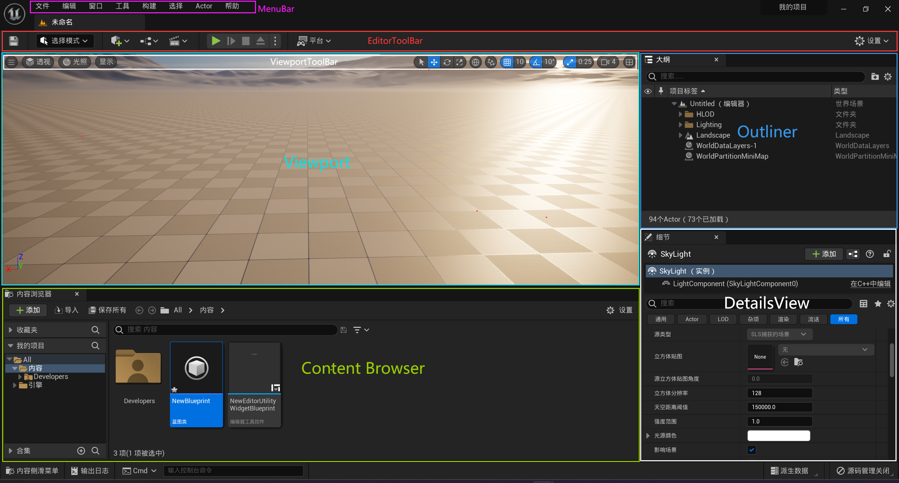
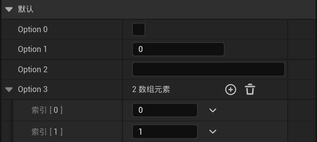
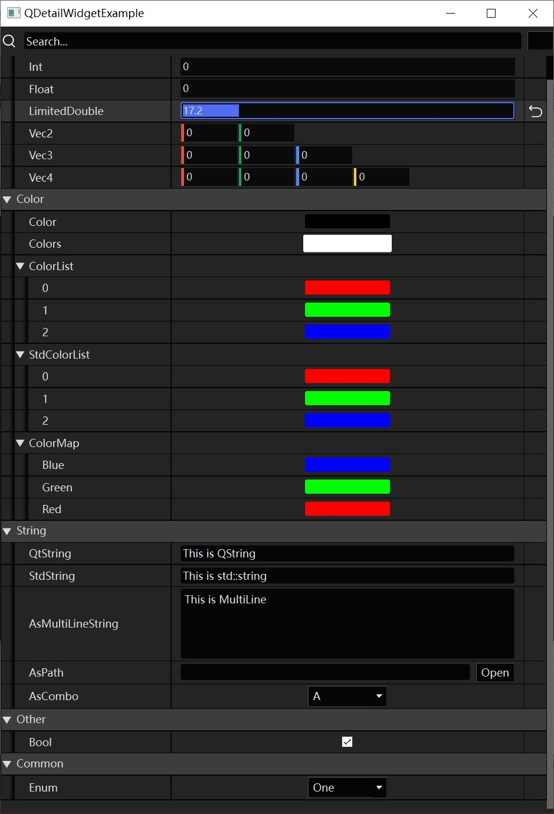
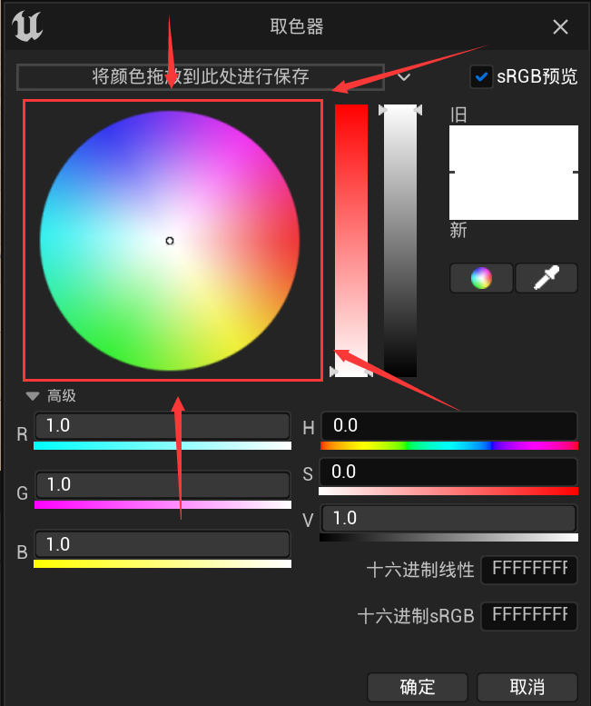

# Architecture de l'éditeur

La majeure partie du code que j'ai accumulé au cours des dernières années de développement a été consacrée à l'éditeur du moteur. Je présente ici quelques réflexions pour vous donner des références. L'article analysera comment concevoir un bon éditeur selon les dimensions suivantes :

- Esthétique de conception
- Expérience utilisateur
- Architecture de l'éditeur basée sur la réflexion (reflection)
- Optimisation des performances

## Esthétique de conception

L'esthétique de conception est un domaine où la plupart des développeurs manquent, car ils consacrent beaucoup de temps au code et peu sont disposés à réfléchir intensément à la création d'interfaces élégantes.

Bien qu'ils n'aient pas un esprit de designer, ils ont des yeux capables d'apprécier les beautés. Avec des références appropriées, les développeurs peuvent rapidement reproduire les effets correspondants.

Dans la plupart des équipes de développement logiciel, il y a généralement des designers UI professionnels qui se concentrent principalement sur :

- La mise en page
- La palette de couleurs
- Les icônes
- La disposition

Parmi les systèmes logiciels que j'ai utilisés, certains ont effectivement pris en compte les points ci-dessus et créé des interfaces élégantes, mais ont souvent négligé la **conception modulaire des UI**, ce qui entraîne :

- L'incapacité pour l'utilisateur d'établir rapidement des règles d'utilisation du logiciel, générant une charge cognitive importante.
- La dégradation de l'architecture organisationnelle du code du logiciel. Une UI bien conçue modulairement permet de deviner la structure hiérarchique du code à partir de l'interface, tandis qu'une interface désordonnée correspond généralement à un code chaotique.

Prendre Unreal Engine comme exemple : sa conception modulaire est très intuitive :



Il suffit à l'utilisateur de comprendre et maîtriser les responsabilités des différents éléments modulaire de l'interface pour pouvoir opérer par analogie sans recourir à des tutoriels ou à la documentation dans de nombreux cas.

Les designers UI se concentrent principalement sur les effets de l'interface, donc il est souvent difficile pour eux de créer une conception modulaire adaptée à l'architecture du code. C'est pourquoi les développeurs doivent réfléchir, discuter, guider et apprendre à dire "non" sur ce sujet.

Pour des concepts et styles de conception UI plus détaillés, voici des références :

- [All Time Design - UI Style Guide](https://alltimedesign.com/ui-style-guide/)

## Expérience utilisateur

L'expérience utilisateur s'articule principalement autour de :

- Réduire la charge cognitive de l'utilisateur : respecter les connaissances générales et les normes dans la disposition de l'interface, la dénomination des étiquettes et les opérations.
- Prendre en charge l'annulation (undo) et la rétablissement (redo) : permettre la correction rapide des erreurs de manipulation.
- Fournir des retours d'opération appropriés : lors de l'exécution d'opérations, informer l'utilisateur de l'état d'exécution via des journaux, des boîtes de dialogue, des barres de progression, des bulles de notification, des barres d'état...
- Sauvegarder ou archiver l'état en temps opportun : éviter la perte de données importantes dues à un crash inattendu.
- Offrir des modes d'opération configurables : permettre à l'utilisateur de personnaliser les raccourcis clavier, la disposition, le style d'opération, etc.

Pour la réduction de la charge cognitive, voici une documentation très complète :

- [O3DE - Modèle UX de la carte de composant (Component Card UX Pattern)](https://docs.o3de.org/docs/tools-ui/ux-patterns/component-card/)

- [O3DE - Gestion des erreurs de la carte de composant (Component Card Error Handling)](https://docs.o3de.org/docs/tools-ui/ux-patterns/error/)

Concernant l'annulation et le rétablissement, c'est un problème de conception de code. Généralement, nous utilisons le modèle Memento et le modèle Commande au niveau du design pattern pour implémenter ces fonctionnalités. Dans Qt, les structures correspondantes sont **QUndoCommand** et **QUndoStack**, dont la définition core de **QUndoCommand** est la suivante :

``` c++
class QUndoCommand
{
    virtual void undo();
    virtual void redo();
    virtual int id() const;
    virtual bool mergeWith(const QUndoCommand *other);
}；
```

En utilisation, nous dérivons QUndoCommand, redéfinissons les fonctions pour implémenter les comportements d'annulation et de rétablissement, puis poussons la Command spécifique dans la UndoStack.

Voici un exemple de code simple :

``` c++
#include <QUndoCommand>
#include <QUndoStack>
#include <QDebug>

class QAssignCommand : public QUndoCommand {
public:
	QAssignCommand(int* ptr, int dstValue)
		: mValuePtr(ptr)
		, mSrcValue(*ptr)
		, mDstValue(dstValue) {}
protected:
	virtual void undo() override {
		*mValuePtr = mSrcValue;
	}
	virtual void redo() override {
		*mValuePtr = mDstValue;
	}
private:
	int* mValuePtr = nullptr;
	int mSrcValue;
	int mDstValue;
};

int main(int argc, char** argv) {
	QUndoStack stack;
	int value = 0;
	stack.push(new QAssignCommand(&value, 1));
	qDebug() << value;		//1
	
	stack.undo();
	qDebug() << value;		//0
	
	stack.redo();
	qDebug() << value;		//1

	stack.beginMacro("Merge");	
	stack.push(new QAssignCommand(&value, 2));
	stack.push(new QAssignCommand(&value, 3));
	stack.endMacro();
	qDebug() << value;		//3

	stack.undo();
	qDebug() << value;		//1

	return 0;
}
```

Son principe de fonctionnement est relativement simple, mais il y a des points difficiles à gérer :

- Si l'objet manipulé dans la Command est détruit ailleurs, mais que la Command existe encore dans la Stack, l'exécution de l'annulation ou du rétablissement peut provoquer un crash du programme.

Pour ce problème, nous pouvons résoudre cela principalement par les solutions suivantes :

- Vérifier si les instructions d'annulation/rétablissement couvrent complètement le cycle de vie de l'objet manipulé.
- Ajouter une validation de validité à la Command.
- Utiliser la sérialisation pour sauvegarder et reconstruire l'objet.

Dans Unreal Engine, un mécanisme d'annulation/rétablissement basé sur le système d'objets est fourni : **Transactional**.

Pour toute instance UObject portant l'identifiant `RF_Transactional`, le code suivant peut être utilisé pour implémenter l'annulation et le rétablissement :

``` c++
GEditor->BeginTransaction(FText::FromString("Assign Value"));	//Démarrer la transaction

MyObject->Modify();												//Sauvegarder l'état initial
MyObject->ValueProperty = 123;									//Modifier la propriété

GEditor->EndTransaction();										//Terminer la transaction
```

Grâce au GC de UObject qui permet un recyclage différé des objets, nous n'avons pas à nous soucier du cycle de vie de l'objet manipulé. Pour son principe de fonctionnement, voir :

- [CSDN - UE4 编辑器(UObject)的Undo撤回系统Transactional](https://blog.csdn.net/qq_29523119/article/details/96778797)

Concernant la sauvegarde de l'état, nous avons tous connu des situations où le programme crash soudainement ou l'ordinateur s'éteint. Dans ce cas, si les données de travail n'ont pas été sauvegardées à temps, des heures de travail peuvent être perdues. Si le programme fournit des moyens d'assistance pour la sauvegarde ou la sauvegarde, cela peut nous sauver en cas d'accident.

Ce moyen désigne généralement la sauvegarde automatique. En plus de permettre à l'utilisateur de sauvegarder manuellement les données de travail, nous pouvons également sauvegarder ou archiver automatiquement les données de travail à des moments spécifiques, par exemple :

- Sauvegarder lors de la fermeture d'une interface par l'utilisateur.
- Sauvegarde automatique定时.
- Sauvegarder lors du crash du programme (la fonction `SetUnhandledExceptionFilter` peut être utilisée pour définir un callback système lors du crash).

Les moyens ci-dessus peuvent réduire au maximum le risque de perte de données de travail. Bien sûr, pour certaines données dont la sauvegarde n'entraîne pas de perte de performance importante, comme les petits fichiers de configuration, il est possible de sauvegarder immédiatement après l'exécution de l'opération.

## Pensée Meta

La pensée Meta peut offrir une grande commodité dans le processus de développement logiciel industriel moderne. Elle peut fournir une méthode d'extension de code à long terme.

> Les mots associés à la pensée meta sont : `dérivation`, `dimension supérieure`, `point de vue de Dieu`, ...
>
> Voir plus en détail : [[ Zhihu ] bus waiter- 谈meta](https://zhuanlan.zhihu.com/p/406257437)

Si écrire du code est comparable à construire une maison, nous nous concentrons sur la manière de construire une bonne maison. Au niveau Meta, nous nous concentrons sur la manière de construire une machine qui construit automatiquement des maisons. La pensée Meta transforme un problème d'ingénierie en un autre. Bien que la difficulté augmente, elle peut apporter des avantages incomparables si la méthode est appropriée.

J'ai été en contact avec certains moteurs et logiciels自研 (développés en interne). Lorsque le sujet concerne l'**éditeur de moteur自研**, les critiques abondent ci-dessous.

La raison en est principalement :

- L'interface est rudimentaire.
- L'expérience utilisateur est mauvaise.

La plupart des développeurs pensent :

- "Ce n'est pas qu'on ne peut pas faire mieux, mais qu'il faut beaucoup de temps et que ce sera compliqué. Il n'est pas nécessaire de perdre du temps, ça suffit qu'il soit utilisable."

Bien sûr, cette idée est acceptable pour de petits outils, mais si on traite des outils utilisés fréquemment avec cette attitude, cela deviendra une torture pour les utilisateurs.

J'ai accumulé des dizaines de milliers de lignes de code sur Qt, mais seulement des milliers de lignes sur Unreal Engine, mais j'ai réalisé plus de fonctionnalités complètes. De plus, dans Unreal Engine, les exigences en matière de style d'interface et d'expérience utilisateur sont très faciles à satisfaire, ce qui est largement dû à l'**infrastructure** d'Unreal Engine.

Dans les moteurs de jeu, les architectures basées sur la conception Meta sont omniprésentes, et la plus utile et la plus puissante d'entre elles est sans aucun doute l'**architecture de l'éditeur basée sur la réflexion (reflection)**.

Nous avons tous vu des panneaux de réglage de paramètres, par exemple :



Au niveau du code, ces paramètres configurables correspondent souvent à des structures de données spécifiques, qui peuvent être comme ceci :

``` c++
struct Options{
	bool 			Option0;
    int 			Option1;
    string 			Option2;
    vector<string> 	Option3;
};
```

La plupart des développeurs écrivent manuellement du code pour créer un panneau d'édition en fonction de la structure de données `Options`. Au niveau Meta, nous décomposons davantage ce type de structure complexe, car les types de base en C++ sont limités, et les types créés par les développeurs ne sont que des organisations hiérarchiques des types de base selon certaines règles. Nous pouvons créer des contrôles en fonction du type des variables membres, et organiser la disposition des contrôles en fonction de la structure de `Options`. En bref, c'est **des contrôles basés sur le type, des panneaux basés sur la structure**.

Puisque nous avons besoin d'obtenir des informations sur la structure de données au moment de l'exécution, nous devons absolument compter sur la **réflexion (reflection)**. De plus, l'organisation de la structure de données est souvent arborescente, donc nous utilisons le contrôle `TreeView` du framework GUI pour organiser le panneau de contrôles.

Voici un pseudo-code simple :

``` c++
class Options: public Object{		//Structure de données, Object est la classe de base du système d'objets
    OBJECT_ENTRY()					//OBJECT_ENTRY est la macro d'entrée du système de réflexion
    
   	PROPERTY()	bool 			Option0;	//Utiliser la macro PROPERTY pour réfléchir la propriété
    PROPERTY()  int 			Option1;
    PROPERTY()  string 			Option2;
    PROPERTY()  vector<string> 	Option3;
};

class DetailView: public TreeView{
public:
	void setObject(Object* object){											
        clearTreeView();
        for(auto metaProperty: object->metaObject()){						//Parcourir toutes les propriétés de l'objet selon MetaObject
            Widget* widget = generateWidgetForType(metaProperty.type());	//Créer un contrôle en fonction du type
            widget->bind(Object,metaProperty);								//Lier le contrôle à la propriété réfléchie
            this->addRow(widget);											//Ajouter le contrôle au TreeView
        }
    }
};
```

Pour les types, nous les classons principalement selon les catégories suivantes :

- Types de base : booléen, numérique, énumération, chaîne de caractères
- Types composites : classe, structure
- Types de conteneur :
    - Conteneurs séquentiels : list, array, vector, set, queue...
    - Conteneurs associatifs : map, hashmap...

Grâce à cette classification, les développeurs n'ont qu'à créer des contrôles pour les types de base, organiser la disposition du panneau de propriétés pour les types composites, et le panneau d'édition des types de conteneur est souvent généré et combiné automatiquement en fonction du type des éléments internes. De plus, pour permettre aux développeurs d'étendre librement les propriétés de base et de remplacer le panneau et la disposition de l'objet, deux structures sont généralement fournies :

```C++
class IDetailCustomization{
public:
	virtual void CustomizeDetails(DetailsBuilder* builder) = 0;		//Pour personnaliser le panneau de réglage de l'objet
};

class IPropertyTypeCustomization{
public:
	virtual void CustomizeHeader(RowBuilder* builder) = 0;		//Pour personnaliser la ligne d'en-tête (Header Row) du type de propriété
	virtual void CustomizeChildren(DetailsBuilder* builder) {}	//Pour ajouter la ligne enfant (Child Row) du type de propriété
};
```

Pour gérer les propriétés, on dérive également `IPropertyHandle`, qui sert principalement à :

- Gérer l'organisation des relations hiérarchiques à l'aide de la polymorphie.
- Servir de seule entrée pour la définition et l'obtention des propriétés, intégrer les fonctions de annulation/rétablissement, notification de modification, synchronisation de l'éditeur, etc.

``` c++
class IPropertyHandle{
    void SetValue(Variant var);
    Variant GetValue();
    virtual Widget* GenerateNameWidget();		//Générer le contrôle de nom de la propriété
	virtual Widget* GenerateValueWidget();		//Générer le contrôle de valeur de la propriété
	virtual void GenerateChildrenRow(DetailsBuilder* builder);	//Générer la ligne enfant de la propriété
};
```

Avec le support des structures ci-dessus, le processus de création de DetailView peut être simplement considéré comme :

``` C++
map<typeid,IDetailCustomization*> GloabalDetailCustomizationMap;
map<typeid,IPropertyTypeCustomization*> GloabalPropertyTypeCustomizationMap;

class DetailView: public TreeView{
public:
	void setObject(Object* object){											
        clearTreeView();
        
        auto DetailCustomization = GloabalDetailCustomizationMap[object->metaObject()->type()];	
        DetailsBuilder builder(this);
        DetailCustomization->CustomizeDetails(&builder);
        /* Obtenir le DetailCustomization correspondant au type de l'objet, appeler CustomizeDetails pour parcourir toutes ses propriétés,
        créer IPropertyHandle, et IPropertyHandle créera des contrôles de réglage de propriété spécifiques en fonction de IPropertyTypeCustomization correspondant au type de propriété
        */
    }
};
```

L'architecture réelle est plus complexe que la structure ci-dessus, mais tant que vous maîtrisez la pensée core, l'implémentation n'est pas difficile. Voici une implémentation simple de Qt (référence à DetailsView d'Unreal Engine) :

- Code : https://github.com/Italink/QEngineUtilities/tree/main/Source/Editor/Source/Public/DetailView
- Projet d'exemple : https://github.com/Italink/QEngineUtilities/tree/main/Samples/DetailViewExample



## Optimisation des performances

Les ressources de calcul de l'ordinateur sont toujours limitées, et dans un moteur de jeu, la part principale de la consommation de performances est sans aucun doute le Game. Par conséquent, nous devons réduire au maximum la consommation de performances de l'éditeur pour minimiser son impact sur l'exécution du Game.

Généralement, nous pouvons optimiser les performances de l'éditeur par les moyens suivants (applicables également aux UI dans le jeu) :

- **Ne pas utiliser des effets d'interface à haute consommation pour追求 l'esthétique** :

  - Éviter autant que possible les animations et filtres d'interface (flou, ombre,拟态, verre fumé, transformation de projection...).
  - Ne pas utiliser des ressources d'image à haute résolution.
  - Pour les UI statiques, utiliser autant que possible des images préfabriquées ou dessiner préalablement sur un RT (Bitmap), plutôt que de dessiner en temps réel à chaque frame avec le framework GUI, comme la palette de couleurs du sélecteur de couleurs :

    

- **Contrôler le moment du redessin de l'interface** : Si une `opération A` déclenche une mise à jour de l'interface, mais que nous exécutons souvent plusieurs fois `opération A` dans une frame, il est évident qu'il n'est pas nécessaire de redessiner l'interface plusieurs fois par frame. Par conséquent, nous ne mettons pas à jour l'UI directement dans `opération A`, mais définissons un identifiant et redessinons l'UI en fonction de l'identifiant dans l'événement `Tick` de l'UI, comme ceci (pseudo-code) :

  ``` c++
  class MyWidget : public Widget{
  private:
      bool bNeedRepaint = false;
  public:
      void setFont(...){				//Définir la police, déclencher le redessin de l'interface
       	bNeedRepaint = true;
      }
      
      void tick() override{			//Redéfinir l'événement Tick de l'UI, vérifier si le redessin est nécessaire lors du Tick
          if(bNeedRepaint){
              repaintUI();			//Interface de redessin de l'UI
              bNeedRepaint = false;
          }
      }  
  };
  ```

- **Utiliser le cache de dessin hors écran et le rafraîchissement局部** : Pour certaines UI dont l'image de la frame précédente est très réutilisable, on peut d'abord dessiner l'UI sur un RT (Bitmap), et mettre à jour seulement les zones nécessaires de l'UI à chaque frame. Cette méthode est courante dans les UI liées aux graphiques et aux toiles.

- **Éviter d'exécuter des opérations logiques à haute consommation dans le thread principal qui bloquent l'UI** : Le traitement de l'UI se déroule généralement dans le thread principal. Si certaines opérations logiques exécutées dans le thread principal prennent beaucoup de temps, cela entraînera un blocage de l'UI. Il y a deux méthodes principales pour résoudre ce problème :

  - Insérer des opérations de mise à jour du système UI dans les opérations logiques pour forcer le rafraîchissement de l'UI.
  - Déplacer les opérations logiques vers un thread asynchrone pour leur exécution, puis exécuter les mises à jour liées à l'UI dans le thread principal une fois l'exécution logique terminée.